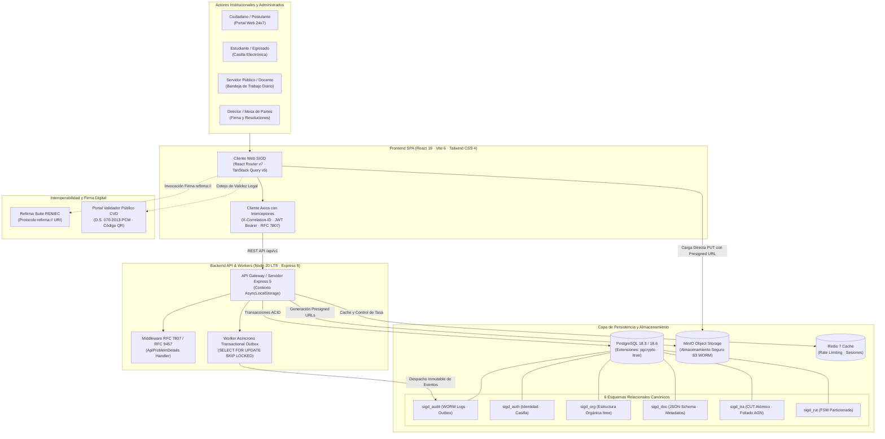
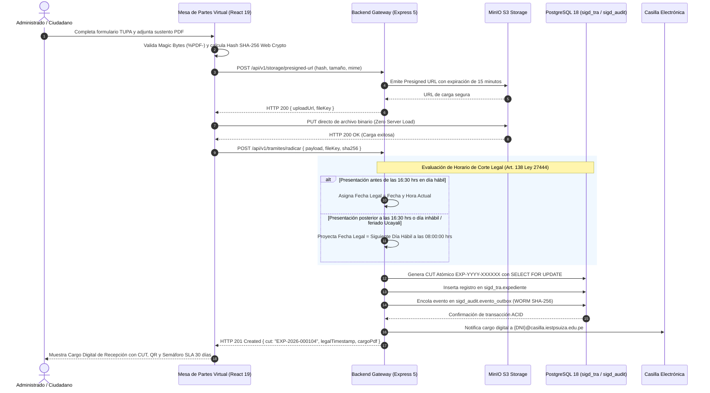
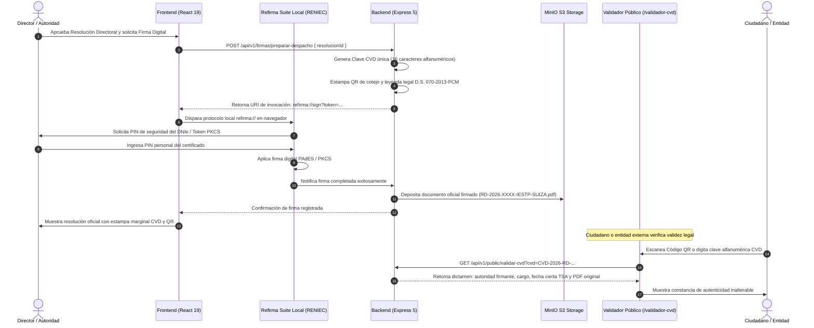

# Sistema Integral de Gestión Documentaria (SIGD)
## Instituto de Educación Superior Tecnológico Público "Suiza" (Pucallpa, Ucayali, Perú)

[](https://react.dev/)
[](https://expressjs.com/)
[](https://www.postgresql.org/)
[](https://vite.dev/)
[](https://tailwindcss.com/)
[](https://www.typescriptlang.org/)
[](https://vitest.dev/)
[](https://testcontainers.com/)
[](https://www.docker.com/)
[](https://min.io/)
[](https://www.gob.pe/segdi)
[](https://www.gob.pe/minjus)

---

## 🏛️ Identidad Institucional y Gobernanza Académica

El **Sistema Integral de Gestión Documentaria (SIGD)** es la plataforma oficial de gobierno digital, interoperabilidad administrativa y tramitación electrónica del **Instituto de Educación Superior Tecnológico Público "Suiza"**, orientada a la desmaterialización total de expedientes y a la automatización de flujos académicos y administrativos con plena validez y eficacia jurídica.

| Dimensión | Especificación Oficial Institucional |
|---|---|
| **Entidad Titular** | Instituto de Educación Superior Tecnológico Público "Suiza" (IESTP "Suiza") |
| **Sede Geográfica** | Distrito de Callería, Provincia de Coronel Portillo, Departamento de Ucayali, República del Perú |
| **Programa de Estudios** | Programa de Estudios de Desarrollo de Sistemas de Información (PE DSI) |
| **Periodo Académico** | Semestre Lectivo 2026-II (2026-2) |
| **Unidad Didáctica Rectora** | Taller de Programación Web / Proyecto Integrador SIGD |
| **Docente Titular y Product Owner** | **Ing. Renato Henyer Tarazona Flores** (`rhtf-92` / `rtarazona.flores@gmail.com`) |
| **Equipo de Desarrollo** | **21 Estudiantes Desarrolladores** distribuidos en 6 Grupos Modulares de Trabajo |
| **Directorio de Colaboradores** | [Directorio Oficial de Colaboradores, Ramas y Roles (`./colaboradores.md`)](./colaboradores.md) |

### Estructura Orgánica de los 6 Grupos de Trabajo

El desarrollo del monorepo se encuentra distribuido orgánicamente en 6 grupos de trabajo integrados de manera bidireccional entre Frontend y Backend:

| Grupo Modular | Dominio Funcional | Líder Frontend | Subdominio Backend | Esquema PostgreSQL | Líder Backend |
|:---:|---|---|---|:---:|---|
| **Grupo 1** | **Registro Documentario, Ventanilla y Mesa de Partes (MPV 24x7)** | Patricia Marina (Patty) | **RutaDoc** (Trazabilidad y FSM) | `sigd_rut` | Geric Aldair Salas Ormeño |
| **Grupo 2** | **Identidad, Registro de Usuarios, Ubigeo Ucayali y Casilla** | Matías Tiziano Zumaeta Alva | **TramiCore** (Expedientes y CUT) | `sigd_tra` | Elmer Ramírez |
| **Grupo 3** | **Bandejas del Servidor, Trabajo Diario y Gestión Expedientes** | Isack Vargas | **OrganiCore** (Estructura Orgánica) | `sigd_org` | Pool Angelo Carranza |
| **Grupo 4** | **Administración Institucional, Seguridad RBAC y Auditoría** | Jhonatan Nijar Gonzales | **IdentiCore** (Cuentas Polimórficas) | `sigd_auth` | Segundo |
| **Grupo 5** | **Flujos Académicos, Firma Digital (Refirma) y Validez CVD** | Adriano David Espinoza | **DocuCore** (JSON Schema y S3) | `sigd_doc` | Christian Jhoel Rodríguez |
| **Grupo 6** | **Indicadores de Gestión, KPIs del MGD (PCM) y Accesibilidad** | Clider Lex Urquia López | **CoreLink** (Plataforma y Auditoría) | `sigd_audit` | Ricardo Arévalo |

---

## 🎯 Visión General del Sistema y Alcance

El SIGD ha sido concebido para transformar radicalmente la gestión de procedimientos administrativos y académicos en el IESTP "Suiza", eliminando los cuellos de botella generados por los archivos de papel, sellos físicos no verificables, extravío de documentos y dilatación de plazos administrativos.

### Arquitectura Dual-Core del Monorepo

El repositorio está estructurado bajo un modelo de monorepo desacoplado que articula dos núcleos de ingeniería de alta especialización:
1. **Frontend SPA (Single Page Application):** Construido sobre **React 19.1.1**, **Vite 6.3.5**, **TypeScript 5.9.2** y **Tailwind CSS 4.1.11**. Implementa arquitectura *Domain-Driven UI* (Feature-Sliced), gestión reactiva del estado servidor con **TanStack Query 5.83.0**, cliente Axios con inyección contextual de `X-Correlation-ID` (UUIDv4) y tratamiento unificado de errores según el estándar **RFC 7807 / RFC 9457** (`ApiProblemDetails`).
2. **Backend API & Workers:** Construido sobre **Node.js 20 LTS**, **Express 5.1.0** y **TypeScript 5.8.3** (`NodeNext`). Integra persistencia relacional avanzada sobre **PostgreSQL 18.3/18.6** mediante un DAG topológico de 6 esquemas canónicos, almacenamiento de objetos compatible con Amazon S3 (**MinIO**), despachador asíncrono con el patrón *Transactional Outbox* (`SELECT ... FOR UPDATE SKIP LOCKED`) y bitácora de auditoría inmutable de tipo **WORM** (Write Once, Read Many).

### Capacidades Operativas Centrales

- **Mesa de Partes Virtual (24x7) y Ventanilla Presencial:** Recepción remota continua y atención presencial en ventanilla única con emisión automatizada de tickets de cargo térmico para rollos de 80mm y 58mm vía `@media print`.
- **Carga Desacoplada y Verificación Criptográfica:** Subida directa de requisitos a MinIO/S3 mediante *Presigned URLs*, inspección local de *Magic Bytes* (`%PDF-` = `0x25 0x50 0x44 0x46`) y cálculo de suma de verificación SHA-256 en cliente con Web Crypto API.
- **Generación Concurrente y Atómica de CUT:** Generación del Código Único de Trámite en formato `EXP-YYYY-XXXXXX` con bloqueo pesimista en base de datos.
- **Motor de Cómputo de Plazos y Semáforo SLA LPAG:** Conteo dinámico de 30 días hábiles excluyendo sábados, domingos, feriados nacionales y feriados regionales de Ucayali.
- **Foliación Progresiva y Cuadro de Clasificación Documental:** Foliado inalterable F. 1 a N según normas archivísticas del Archivo General de la Nación (AGN).
- **Proyector de Resoluciones Directorales A4 y Firma Digital:** Editor de resoluciones oficiales con formato normalizado A4, integración con **Refirma Suite RENIEC** (`refirma://`), Código de Verificación Digital (**CVD**) de 16 caracteres, código QR con URI de cotejo y portal público de validación de autenticidad.
- **Casilla Electrónica y Notificación Fehasciente:** Domicilio digital automático `{DNI}@casilla.iestpsuiza.edu.pe` con consentimiento explícito bajo la Ley N° 29733.
- **Tableros Directivos Ejecutivos:** Visualización de indicadores de gestión documental del Modelo de Gestión Documental (MGD-PCM): VTEP, TPR, ICL y PEO, con cumplimiento de accesibilidad **WCAG 2.1 AA** y exportadores nativos a PDF y Excel.

---

## ⚖️ Marco Legal y Normativo Peruano Vinculante

El SIGD ha sido diseñado en estricto acatamiento del bloque de legalidad de derecho administrativo, interoperabilidad técnica y gobierno digital de la República del Perú:

```
┌────────────────────────────────────────────────────────────────────────────────────────┐
│                        MAPA DE ARTICULACIÓN NORMATIVA DEL SIGD                         │
├─────────────────────────┬──────────────────────────────────┬───────────────────────────┤
│ Norma Peruana           │ Objeto Jurídico Regulado         │ Implementación en SIGD   │
├─────────────────────────┼──────────────────────────────────┼───────────────────────────┤
│ TUO Ley N° 27444 (LPAG) │ Corte legal 16:30 hrs (Art. 138) │ useHorarioCorte.ts        │
│ D.S. N° 004-2019-JUS    │ Plazo 30 días hábiles (Art. 143) │ slaCalculator.ts, SlaBadge│
│                         │ Acumulación (Art. 160)           │ ModalAcumulacionExpediente│
├─────────────────────────┼──────────────────────────────────┼───────────────────────────┤
│ Modelo Gestión Doc. MGD │ Código Único Trámite (CUT)       │ EXP-YYYY-XXXXXX atómico   │
│ D.S. 026-2016-PCM       │ Inalterabilidad WORM             │ sigd_audit.bitacora SHA256│
│ R.S.G. 001-2017-PCM     │ Indicadores VTEP, TPR, ICL, PEO  │ dashboardMetrics.ts       │
├─────────────────────────┼──────────────────────────────────┼───────────────────────────┤
│ Ley N° 27269 / DS 070   │ Validez legal de firma digital   │ Protocolo refirma://      │
│ Firmas y Cert. Digitales│ CVD alfanumérico 16 caracteres   │ CvdStampBadge.tsx, QR SVG │
│                         │ Estampado marginal de folios     │ DocumentoCvdViewer.tsx    │
├─────────────────────────┼──────────────────────────────────┼───────────────────────────┤
│ Ley N° 29733 (LPDP)     │ Tratamiento de datos personales  │ Consentimiento bloqueante │
│ D.S. N° 003-2013-JUS    │ Notificación por casilla digital │ {DNI}@casilla.iestpsuiza  │
├─────────────────────────┼──────────────────────────────────┼───────────────────────────┤
│ Directiva 001-2019-AGN  │ Foliación correlativa F. 1 a N   │ foliado.ts, VisorFolios   │
│ R.J. N° 073-2023-AGN/J  │ Cuadro Clasificación Doc. (CCD)  │ CcdTreeSelector.tsx       │
└─────────────────────────┴──────────────────────────────────┴───────────────────────────┘
```

### 1. TUO de la Ley N° 27444 — Ley del Procedimiento Administrativo General (D.S. N° 004-2019-JUS)
- **Horario de Atención y Corte Legal a las 16:30 hrs (Artículo 138):**
  La jornada laboral de atención presencial del IESTP "Suiza" concluye a las 16:30 hrs. Conforme al principio de legalidad administrativa, los documentos ingresados a través de la Mesa de Partes Virtual después de las 16:30 hrs o durante días inhábiles se consideran formalmente presentados a primera hora (08:00:00 hrs) del día hábil inmediato posterior.
  *Implementación técnica:* `frontend/src/hooks/useHorarioCorte.ts` gestiona la regla `CORTE_MINUTES = 990` y discrimina de manera determinista entre el `technicalTimestamp` (marca de tiempo real en UTC) y el `legalTimestamp` (fecha y hora legal proyectada para el cómputo de plazos).
- **Plazo Máximo Supletorio de 30 Días Hábiles (Artículos 142 y 143):**
  Ningún procedimiento administrativo sujeto a evaluación previa puede exceder el plazo de treinta (30) días hábiles administrativos para su resolución, salvo prórroga expresa legal. Se deducen del cómputo sábados, domingos, feriados nacionales del D. Leg. N° 713 y los **feriados regionales no laborables de Ucayali**:
  - **24 de junio:** Fiesta Patronal de San Juan Bautista (tradición cívico-religiosa amazónica).
  - **13 de octubre:** Aniversario de la Provincia de Coronel Portillo / Fundación de Pucallpa.
  *Implementación técnica:* `frontend/src/utils/slaCalculator.ts` alimenta el componente `SlaBadge.tsx`, implementando un semáforo visual accesible de cuatro estados: `NORMAL` ($\le 15$ días consumidos), `ALERTA` (16 a 25 días consumidos), `CRITICO` (26 a 30 días consumidos) y `VENCIDO` ($> 30$ días consumidos, pulso rojo animado y advertencia de responsabilidad funcional).
- **Acumulación de Expedientes (Artículo 160):**
  Faculta a la autoridad instructora a disponer de oficio o a instancia de parte la acumulación de expedientes conexos. Implementado en base de datos (`sigd_tra.expediente_acumulacion`) con control de grafos acíclicos para prevenir referencias circulares y en la vista `ModalAcumulacionExpediente.tsx`.

### 2. Modelo de Gestión Documental (MGD-PCM — D.S. N° 026-2016-PCM, R.S.G. N° 001-2017-PCM/SEGDI)
- **Código Único de Trámite (CUT) Atómico:**
  Nomenclatura oficial estandarizada `EXP-YYYY-XXXXXX` (ej. `EXP-2026-000104`), donde `YYYY` representa el ejercicio fiscal y `XXXXXX` es un correlativo numérico de 6 dígitos que reinicia el 1 de enero de cada año. Se genera mediante función SQL en el backend con bloqueo pesimista `SELECT ... FOR UPDATE`, garantizando cero saltos y cero duplicados ante alta concurrencia.
- **Principio de Inalterabilidad WORM (Write Once, Read Many):**
  Toda radicación, proveído, pase, derivación o foliación genera un registro inmutable en `sigd_audit.bitacora_auditoria`. Cada asiento contiene el hash criptográfico SHA-256 de los datos, el `X-Correlation-ID` de la petición y metadatos del agente actor. Triggers a nivel de PostgreSQL impiden modificaciones (`UPDATE`) o eliminaciones (`DELETE`) con código de error SQLSTATE `23001`.
- **Fórmulas Oficiales de Desempeño Documental:**
  Implementadas en `frontend/src/utils/dashboardMetrics.ts` con protección algorítmica ante división por cero:
  - **VTEP:** Volumen Total de Expedientes Procesados en el periodo evaluado.
  - **TPR / TPT:** Tiempo Promedio de Tramitación en horas y días hábiles hasta la emisión del acto administrativo.
  - **ICL / TRO:** Índice de Cumplimiento Legal (Tasa de Resolución Oportuna dentro del SLA de 30 días hábiles).
  - **PEO / TEO:** Porcentaje de Expedientes Observados respecto al universo radicado.

### 3. Ley N° 27269 (Firmas y Certificados Digitales) y D.S. N° 070-2013-PCM
- **Validez Legal de la Firma Digital:**
  Las firmas digitales generadas dentro de la Infraestructura Oficial de Firma Electrónica (IOFE) cuentan con el mismo valor legal y eficacia que la firma manuscrita, otorgando presunción legal de autoría, integridad y no repudio.
- **Protocolo de Invocación con Refirma RENIEC:**
  La firma de actos administrativos (Resoluciones Directorales, Actas de Notas, Certificados) se realiza mediante despacho desacoplado al cliente local Refirma Suite vía esquema URI:
  ```
  refirma://sign?token=<JWT_TOKEN>&documentUrl=<PRESIGNED_URL>&pos=marginal
  ```
  Soporta firma con DNI electrónico (DNIe), tokens criptográficos PKCS#11 y certificados de software acreditados.
- **Representación Gráfica e Impresa Oficial (D.S. N° 070-2013-PCM):**
  Toda impresión o visualización de documento electrónico firmado digitalmente incorpora:
  - **Código de Verificación Digital (CVD):** Clave alfanumérica única de 16 caracteres (ej. `CVD-2026-RD-000412-892F`).
  - **Estampado Marginal Lateral:** Sello gráfico estampado en el margen izquierdo o derecho de cada folio A4 según la disposición de Refirma RENIEC.
  - **Código QR Bidimensional Vectorial:** Contiene la dirección web de verificación directa: `https://sigd.iestpsuiza.edu.pe/validador-cvd?cvd=...`
  - **Leyenda Legal Obligatoria:** Cláusula informativa para contraste público de autenticidad en `ValidadorPublicoCvdPage.tsx`.

### 4. Ley N° 29733 (Protección de Datos Personales — LPDP) y D.S. N° 003-2013-JUS
- **Consentimiento Expreso, Informado e Inequívoco:**
  En el registro digital ciudadano, el administrado otorga consentimiento expreso mediante casilla desmarcada por defecto. La omisión del consentimiento bloquea el envío del trámite.
- **Responsabilidad Penal por Declaración Falsa:**
  El registro incluye declaración jurada en mérito al Art. 51 del TUO de la Ley N° 27444 con advertencia explícita de sanción penal tipificada en el **Artículo 411 del Código Penal** (falsa declaración en procedimiento administrativo).
- **Casilla Electrónica y Notificación Personal:**
  Asignación automatizada de casilla institucional (`{DNI}@casilla.iestpsuiza.edu.pe` para personas naturales y `{RUC}@casilla.iestpsuiza.edu.pe` para personas jurídicas). Conforme al Art. 20 del TUO de la Ley N° 27444, el depósito del acto en la casilla surte efectos de notificación personal auténtica, generando un acuse digital de recibo con sellado de tiempo y hash SHA-256.
- **Principio de Disociación de Datos:**
  El validador público CVD y la consulta pública de expedientes ocultan números de teléfono, correos y domicilios particulares para salvaguardar la intimidad de los administrados.

### 5. Directiva N° 001-2019-AGN/DDPA y R.J. N° 073-2023-AGN/J (Foliación Archivística)
- **Reglas Obligatorias de Foliación:**
  Foliación correlativa continua en números arábigos (F. 1 a N), estampada en el ángulo superior derecho de cada folio.
  - Prohibición terminante de foliar con letras, numeración romana o sufijos "bis", "ter", etc.
  - Prohibición de saltos, huecos o folios repetidos.
  - Prohibición de foliar tapas, carátulas o páginas en blanco.
  *Implementación técnica:* `frontend/src/utils/foliado.ts` valida la integridad matemática del foliado en el visor de documentos `FoliadoDocumentoViewer.tsx`.
- **Cuadro de Clasificación Documental (CCD):**
  Estructura taxonómica estandarizada para el Fondo Documental `IESTP_SUIZA`, clasificando expedientes en series documentales oficiales (Titulación, Resoluciones, Convalidaciones, Certificados Modulares) seleccionables mediante el componente interactivo `CcdTreeSelector.tsx`.

---

## 🏛️ Arquitectura del Sistema y Diagramas Mermaid

### Diagrama 1: Arquitectura Global del Monorepo y Componentes

El siguiente diagrama modela la interacción física y lógica entre los actores, la capa de presentación SPA, la capa de servicios API y los sistemas de persistencia y almacenamiento:



### Diagrama 2: Secuencia de Radicación Documentaria y Corte Legal 16:30 hrs

Modela el flujo de presentación de documentos con validación criptográfica, subida desacoplada a MinIO/S3, aplicación del horario de corte de la Ley N° 27444, generación concurrente de CUT y notificación a Casilla Electrónica:



### Diagrama 3: Secuencia de Despacho de Firma Digital (Refirma RENIEC) y Validador CVD

Modela la emisión de Resoluciones Directorales, la invocación por protocolo local a Refirma Suite de RENIEC y el cotejo ciudadano de autenticidad:



---

## 📁 Estructura del Monorepo

La estructura física del repositorio organiza responsabilidades sin colisiones entre subsistemas:

```
c:\Users\SAITAMA\Desktop\py_SIGD\SIGD\
├── .agents/                 # Metadatos, planes y bitácoras forenses de agentes autónomos
├── .git/                    # Repositorio Git central (historial de merges y PRs #62-#115)
├── .gitignore               # Maestro: exclusión de node_modules, build, llaves y .env
├── ORIGINAL_REQUEST.md      # Registro histórico y vinculante de requerimientos del usuario
├── PROJECT.md               # Definición del alcance, contratos y arquitectura FSD
├── TEST_INFRA.md            # Especificación de infraestructura de pruebas automatizadas
├── TEST_READY.md            # Catálogo de suites de prueba aprobadas y gates de calidad
├── colaboradores.md         # Directorio oficial de 21 colaboradores, roles, correos y ramas
├── docker-compose.yml       # Orquestación de los 5 servicios Docker para desarrollo local
├── scripts/                 # Scripts de validación pericial de links, markdown y oráculos
│   ├── adversarial_tests.js
│   ├── challenger_mermaid_validator.py
│   ├── challenger_stress_mermaid_and_frontend.py
│   ├── challenger_stress_test.js
│   ├── empirical_challenger_fe1.js
│   ├── link_verification_suite.py
│   ├── test_verifier_oracle.py
│   ├── verify_backend_links.py
│   ├── verify_docs.js
│   ├── verify_links_and_mermaid.ps1
│   └── verify_markdown_structure.py
├── backend/                 # API RESTful Express 5 + TypeScript 5.8 + PostgreSQL 18
│   ├── src/                 # Servidor, arquitectura hexagonal, middleware RFC 7807 y Outbox
│   ├── tests/               # Pruebas unitarias y E2E con Testcontainers PostgreSQL 18
│   ├── k6/                  # Pruebas de estrés y carga (100 VU radicación, 50 VU derivación)
│   ├── docs/                # DDLs SQL canónicos, análisis y planes de 6 subdominios
│   ├── .env.example         # Plantilla de variables de entorno de backend
│   ├── package.json         # Dependencias: Express 5, pg 8.14, zod 3.24, vitest 3.1
│   ├── tsconfig.json        # Configuración TypeScript NodeNext estricta
│   └── README.md            # Documentación operativa técnica del backend
└── frontend/                # Single Page Application React 19 + TypeScript 5.9 + Tailwind 4
    ├── src/                 # Componentes de 6 módulos, hooks, utils, types, routes (AppRouter)
    ├── public/              # Recursos estáticos servidos directamente
    ├── docs/                # Documentación modular y pedagógica en kebab-case
    ├── .env.example         # Plantilla de variables de entorno de frontend
    ├── package.json         # Dependencias: React 19, Vite 6, Tailwind 4, TanStack Query 5
    ├── tsconfig.json        # Configuración TypeScript estricta (noUnusedLocals, etc.)
    └── README.md            # Documentación operativa técnica del frontend
```

### Detalle de Directorios y Archivos Maestros

- [**`docker-compose.yml`**](./docker-compose.yml): Configuración consolidada de 5 servicios Docker (`postgres`, `minio`, `redis`, `backend`, `frontend`) con *healthchecks* declarativos y volúmenes persistentes.
- [**`colaboradores.md`**](./colaboradores.md): Directorio oficial de los 21 estudiantes desarrolladores, asignaciones de liderazgo por módulo, roles funcionales, ramas Git y cuentas institucionales.
- [**`PROJECT.md`**](./PROJECT.md): Especificación técnica del proyecto, límites de aislamiento de archivos y matriz de hitos de la Ronda 11.
- [**`scripts/`**](./scripts/): Herramientas periciales automatizadas de verificación de enlaces, análisis sintáctico de diagramas Mermaid, oráculos adversariales y chequeo de integridad estructural.
- [**`backend/`**](./backend/README.md): Microservicios de API RESTful en Express 5, modelos de dominio, esquemas DDL en 5 olas y worker transaccional Outbox.
- [**`frontend/`**](./frontend/README.md): Aplicación cliente SPA en React 19 con 6 módulos funcionales, semáforo SLA, ventanilla presencial y 226 pruebas unitarias aprobadas.

---

## 🚀 Guía Rápida de Instalación y Despliegue Local (Quickstart)

### Requisitos Previos del Sistema

| Componente | Versión Mínima Requerida | Propósito en el Ecosistema |
|---|:---:|---|
| **Node.js** | $\ge 20.0.0$ LTS (Node 20 o Node 24) | Motor de ejecución para Backend y empaquetador Vite |
| **PostgreSQL** | 18.3 o 18.6 nativo / Docker | Motor de base de datos relacional con `pgcrypto` y `ltree` |
| **Docker Compose** | v2.20+ | Orquestación contenerizada opcional de los 5 servicios |
| **Git** | 2.40+ | Control de versiones y trazabilidad de ramas |

---

### Opción A: Despliegue con un Solo Comando (Docker Compose)

El repositorio incluye un archivo [`docker-compose.yml`](./docker-compose.yml) configurado con los 5 servicios interconectados en la red interna:

1. **Clonar el repositorio:**
   ```bash
   git clone https://github.com/rhtf-92/SIGD.git
   cd SIGD
   ```

2. **Iniciar la infraestructura completa:**
   ```bash
   docker compose up -d
   ```

3. **Verificar el estado de los contenedores:**
   ```bash
   docker compose ps
   ```
   Los 5 contenedores iniciarán con sus respectivos chequeos de salud:
   - `sigd_postgres`: PostgreSQL 18 en puerto `5432` con base `sigd_prueba`.
   - `sigd_minio`: API S3 en puerto `9000` y consola web en puerto `9001`.
   - `sigd_redis`: Almacén en memoria en puerto `6379`.
   - `sigd_backend`: Servidor Express 5 en puerto `3000`.
   - `sigd_frontend`: Cliente SPA en puerto `5173`.

---

### Opción B: Despliegue para Desarrollo Local (Sin Docker)

Si prefiere ejecutar directamente en su máquina de desarrollo sobre Node.js y un PostgreSQL 18 local:

#### Paso 1: Configurar la Base de Datos PostgreSQL 18
Cree la base de datos de desarrollo en UTF-8:
```sql
CREATE DATABASE sigd_prueba WITH ENCODING = 'UTF8';
```

Aplique el **Despliegue Topológico DDL por Olas** mediante `psql` (con bandera `ON_ERROR_STOP=1`):
```bash
cd backend

# OLA 0: Auditoría Forense y Outbox (sigd_audit)
psql -h localhost -p 5432 -U postgres -d sigd_prueba -v ON_ERROR_STOP=1 \
     -f docs/00_corelink/06_sigd_audit_esquema_ddl.sql

# OLA 1A: Identidad, Personas Polimórficas y Casilla (sigd_auth)
psql -h localhost -p 5432 -U postgres -d sigd_prueba -v ON_ERROR_STOP=1 \
     -f docs/01_identicore/03_esquema_sigd_auth_v2.sql

# OLA 1B: Estructura Orgánica y Jerarquías Materialized Path (sigd_org)
psql -h localhost -p 5432 -U postgres -d sigd_prueba -v ON_ERROR_STOP=1 \
     -f docs/02_organicore/03_esquema_sigd_org_v2.sql

# OLA 1C: Documentos, JSON Schema y Metadatos (sigd_doc)
psql -h localhost -p 5432 -U postgres -d sigd_prueba -v ON_ERROR_STOP=1 \
     -f docs/03_docucore/05_esquema_sigd_doc_jsonb_v6.3_auditoria_corregido.sql

# OLA 2: Trámites, Expedientes y CUT Atómico (sigd_tra)
psql -h localhost -p 5432 -U postgres -d sigd_prueba -v ON_ERROR_STOP=1 \
     -f docs/04_tramicore/03_esquema_sigd_tra_cut_foliado.sql

# OLA 3: Trazabilidad, Derivación y FSM Particionada (sigd_rut)
psql -h localhost -p 5432 -U postgres -d sigd_prueba -v ON_ERROR_STOP=1 \
     -f docs/05_rutadoc/03_esquema_sigd_rut_particionado.sql
```

#### Paso 2: Configuración y Arranque del Backend
```bash
cd backend

# Configurar variables de entorno
cp .env.example .env

# Instalar dependencias
npm install

# Validar tipado estático
npm run typecheck

# Iniciar servidor Express en modo desarrollo
npm run dev
```
*El backend quedará escuchando en `http://localhost:3000`.*

*En una terminal paralela, puede iniciar el despachador asíncrono Outbox:*
```bash
npm run worker:outbox
```

#### Paso 3: Configuración y Arranque del Frontend
Abra una nueva terminal:
```bash
cd frontend

# Configurar variables de entorno
cp .env.example .env

# Instalar dependencias
npm install

# Validar tipado estático
npm run typecheck

# Iniciar servidor de desarrollo ultrarrápido Vite
npm run dev
```
*El frontend quedará escuchando en `http://localhost:5173`.*

---

### Verificación de Servicios en Ejecución

Una vez iniciados los servicios, valide su operatividad:

1. **Frontend SPA:** Navegue a `http://localhost:5173` para acceder a la Mesa de Partes Virtual, Bandeja de Trabajo Diario y Módulos de Administración.
2. **Backend API Health:** Invoque `http://localhost:3000/health` o `curl http://localhost:3000/health`. Debe responder:
   ```json
   {
     "status": "UP",
     "timestamp": "2026-09-23T18:30:00.000Z",
     "database": "connected",
     "version": "1.0.0"
   }
   ```
3. **Consola Web de MinIO:** Acceda a `http://localhost:9001` con usuario `minioadmin` y contraseña `minioadminpassword` para gestionar los buckets de almacenamiento de expedientes.
4. **Verificación de Redis:** Compruebe la conectividad de cache ejecutando `redis-cli ping` (debe responder `PONG`).

---

## 🧪 Estrategia de Pruebas Automatizadas y Calidad

El monorepo cuenta con una política de aseguramiento de calidad donde cada cambio debe superar pruebas estáticas, unitarias y de integración sin tolerar regresiones:

```
┌────────────────────────────────────────────────────────────────────────────────────────┐
│                        MATRIZ DE SUITES DE PRUEBA DEL MONOREPO                         │
├───────────────────┬───────────────────────────────┬──────────────────────┬─────────────┤
│ Entorno           │ Comando de Ejecución          │ Alcance / Cobertura  │ Estado      │
├───────────────────┼───────────────────────────────┼──────────────────────┼─────────────┤
│ **Frontend QA**   │ `npm run test` (en frontend/) │ 25 suites, 226 tests │ ✅ 100% Pass│
│ **Frontend Types**│ `npm run typecheck`           │ TypeScript 5.9 strict│ ✅ 0 errores│
│ **Frontend Build**│ `npm run build`               │ Vite 6 / Bundle dist │ ✅ 2.5 seg  │
├───────────────────┼───────────────────────────────┼──────────────────────┼─────────────┤
│ **Backend Unit**  │ `npm run test:unit`           │ Vitest / RFC 7807    │ ✅ 100% Pass│
│ **Backend E2E**   │ `npm run test:e2e`            │ Testcontainers PG 18 │ ✅ 100% Pass│
│ **Backend Types** │ `npm run typecheck`           │ TypeScript NodeNext  │ ✅ 0 errores│
├───────────────────┼───────────────────────────────┼──────────────────────┼─────────────┤
│ **Estrés / Carga**│ `npm run load:radicacion`     │ Grafana k6 (100 VU)  │ ✅ P95<200ms│
└───────────────────┴───────────────────────────────┴──────────────────────┴─────────────┘
```

### Ejecución de Pruebas Frontend
```bash
cd frontend
npm run typecheck    # Verificación estática sin emisión de código
npm run test         # Ejecución de las 226 pruebas unitarias y de integración (Vitest)
npm run build        # Compilación de producción
```

### Ejecución de Pruebas Backend
```bash
cd backend
npm run typecheck    # Verificación estática con tipos NodeNext
npm run test:unit    # Pruebas unitarias de mapeadores y lógica de dominio
npm run test:e2e     # Pruebas de integración sobre contenedores efímeros Testcontainers
```

---

## 🧭 Gobernanza y Enlaces Canónicos de Navegación

Consulte la documentación especializada de cada subsistema y los artefactos de gobernanza del proyecto:

- 🔙 [**Documentación Operativa Especializada del Backend (`./backend/README.md`)**](./backend/README.md)
- 🖥️ [**Documentación Operativa Especializada del Frontend (`./frontend/README.md`)**](./frontend/README.md)
- 👥 [**Directorio Oficial de Colaboradores y Ramas Git (`./colaboradores.md`)**](./colaboradores.md)
- 🐳 [**Archivo de Orquestación Docker Compose (`./docker-compose.yml`)**](./docker-compose.yml)
- 📑 [**Portal Maestro de Documentación Técnica de Backend (`./backend/docs/README.md`)**](./backend/docs/README.md)
- 📘 [**Portal Maestro de Documentación Técnica de Frontend (`./frontend/docs/README.md`)**](./frontend/docs/README.md)
- 📐 [**Documento Rector de Arquitectura y Especificación (`./PROJECT.md`)**](./PROJECT.md)
- 🛠️ [**Scripts de Verificación Pericial y Oráculos de Calidad (`./scripts/`)**](./scripts/)

---

<p align="center">
  <b>Sistema Integral de Gestión Documentaria (SIGD)</b><br>
  <i>Desarrollado con orgullo y rigor de ingeniería por los estudiantes del Programa de Estudios de Desarrollo de Sistemas de Información (PE DSI 2026-2)</i><br>
  <b>Instituto de Educación Superior Tecnológico Público "Suiza"</b><br>
  Pucallpa, Coronel Portillo, Ucayali, Perú · 2026
</p>
