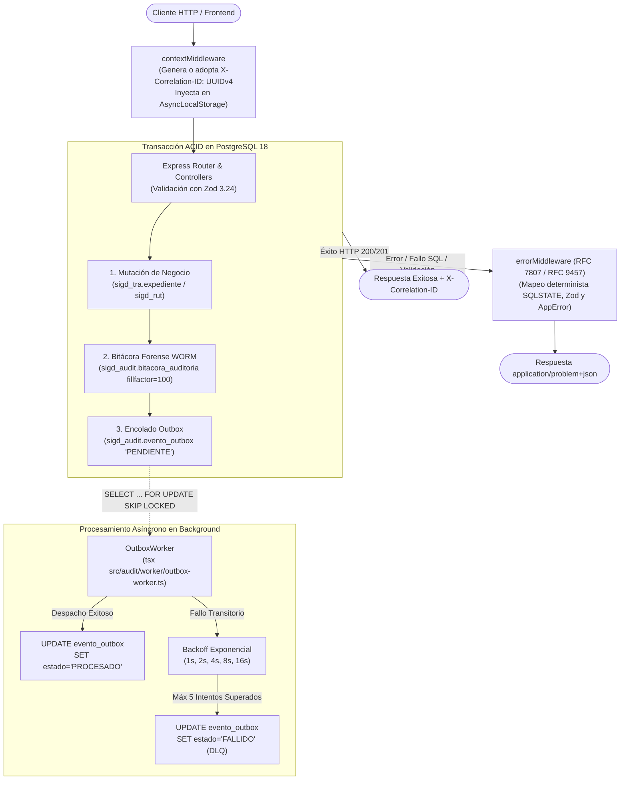
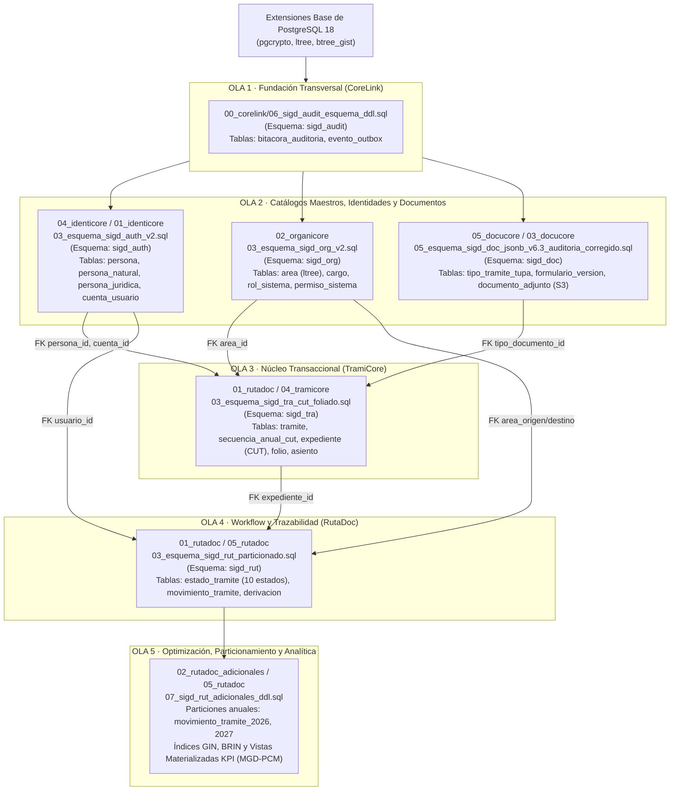

# SISTEMA INTEGRAL DE GESTIÓN DOCUMENTARIA (SIGD) — BACKEND
## Instituto de Educación Superior Tecnológico Público "Suiza" (Pucallpa, Ucayali, Perú)
**Programa de Estudios:** Desarrollo de Sistemas de Información (PE DSI) — Semestre Académico 2026-2  
**Unidad Didáctica:** Taller de Programación Web / Proyecto Integrador Transversal  
**Nivel de Arquitectura:** Senior Software Architect / Backend Specialist Guide  

---

<p align="center">
  
  
  
  
  
  
  
  
</p>

---

## 📑 ÍNDICE GENERAL

1. [Identidad Institucional y Rol del Backend](#1-identidad-institucional-y-rol-del-backend)
2. [Stack Tecnológico y Entorno de Ejecución (100% Verificado)](#2-stack-tecnológico-y-entorno-de-ejecución-100-verificado)
3. [Patrones Arquitectónicos y Núcleo Transversal](#3-patrones-arquitectónicos-y-núcleo-transversal)
   - 3.1 [Serialización Estándar de Errores RFC 7807 / RFC 9457 (`ApiProblemDetails`)](#31-serialización-estándar-de-errores-rfc-7807--rfc-9457-apiproblemdetails)
   - 3.2 [Trazabilidad Contextual con `AsyncLocalStorage` (`X-Correlation-ID`)](#32-trazabilidad-contextual-con-asynclocalstorage-x-correlation-id)
   - 3.3 [Patrón Transactional Outbox y Bitácora Forense Inmutable WORM](#33-patrón-transactional-outbox-y-bitácora-forense-inmutable-worm)
4. [Arquitectura de Base de Datos y los 6 Dominios Funcionales](#4-arquitectura-de-base-de-datos-y-los-6-dominios-funcionales)
   - 4.1 [Secuencia Canónica de Despliegue DDL (Grafo Topológico DAG de 5 Olas)](#41-secuencia-canónica-de-despliegue-ddl-grafo-topológico-dag-de-5-olas)
   - 4.2 [Desglose en Profundidad de los 6 Dominios Funcionales](#42-desglose-en-profundidad-de-los-6-dominios-funcionales)
5. [Estrategia de Pruebas, Verificación y Benchmarks de Rendimiento](#5-estrategia-de-pruebas-verificación-y-benchmarks-de-rendimiento)
   - 5.1 [Suites de Integración E2E sobre Testcontainers (PostgreSQL 18)](#51-suites-de-integración-e2e-sobre-testcontainers-postgresql-18)
   - 5.2 [Suites Unitarias con Vitest](#52-suites-unitarias-con-vitest)
   - 5.3 [Pruebas de Estrés y Carga con Grafana k6](#53-pruebas-de-estrés-y-carga-con-grafana-k6)
   - 5.4 [Matriz de Comandos Operativos Verificados](#54-matriz-de-comandos-operativos-verificados)
6. [Catálogo Exhaustivo de Contratos y Endpoints de la API](#6-catálogo-exhaustivo-de-contratos-y-endpoints-de-la-api)
7. [Estructura del Directorio, Gobernanza y Enlaces Maestros](#7-estructura-del-directorio-gobernanza-y-enlaces-maestros)

---

## 1. IDENTIDAD INSTITUCIONAL Y ROL DEL BACKEND

El backend del **Sistema Integral de Gestión Documentaria (SIGD)** constituye el núcleo transaccional, normativo y de seguridad del **IESTP "Suiza"** (Pucallpa, Ucayali, Perú). Diseñado bajo principios de Clean Architecture y Domain-Driven Design (DDD), opera como un motor desacoplado de alta disponibilidad que garantiza:

* **API Gateway & Orquestación de Negocio:** Centraliza la recepción de solicitudes, validación tipada estricta, aplicación de reglas administrativas y despacho de trámites institucionales (matrículas, títulos, traslados, certificaciones y convalidaciones).
* **Despacho Transaccional de Eventos (*Transactional Outbox Pattern*):** Garantiza atomicidad absoluta entre la mutación de estado en base de datos y la publicación de eventos hacia servicios periféricos sin recurrir a costosos protocolos de bloqueo distribuido (Two-Phase Commit).
* **Bitácora Criptográfica Inmutable WORM (*Write Once, Read Many*):** Implementa un registro forense inalterable con factor de relleno `fillfactor = 100`, restricción de privilegios en base de datos (`REVOKE UPDATE, DELETE`) y preservación de huellas digitales SHA-256, blindando la trazabilidad institucional ante cualquier intento de alteración retrospectiva.
* **Alineamiento Pleno al Marco Normativo Peruano:**
  - **TUO de la Ley N° 27444 (LPAG):** Cómputo de plazos máximos en días hábiles (30 días), acumulación de expedientes (Art. 160), regla de corte legal a las 16:30 hrs y Libro General de Registros (Arts. 153-156).
  - **Modelo de Gestión Documental (MGD-PCM / SEGDI):** Generador de Código Único de Trámite (**CUT**) anual correlativo `EXP-YYYY-XXXXXX`.
  - **Ley N° 27269 y D.S. 070-2013-PCM:** Integración con firma digital certificada (Refirma RENIEC), sellado de tiempo y Código de Verificación Digital (CVD).
  - **Ley N° 29733 (LPDP):** Consentimiento auditable para casilla electrónica y anonimización de datos sensibles en consultas públicas.
  - **Directiva N° 001-2019-AGN / R.J. N° 073-2023-AGN/J:** Foliación digital progresiva, correlativa e ininterrumpida sin solapamientos ni omisiones.

---

## 2. STACK TECNOLÓGICO Y ENTORNO DE EJECUCIÓN (100% VERIFICADO)

Cada elemento del stack ha sido validado contra `backend/package.json`, `tsconfig.json`, `tsconfig.build.json` y el código fuente en `src/`:

| Capa Arquitectónica | Tecnología / Paquete | Versión Declarada | Detalle de Configuración y Propósito en Producción |
| :--- | :--- | :--- | :--- |
| **Runtime Engine** | Node.js | `>=20` (LTS) | Motor de ejecución JavaScript con soporte nativo de ES Modules (`"type": "module"`), `node:async_hooks` (`AsyncLocalStorage`) y `node:crypto`. |
| **Lenguaje Tipado** | TypeScript | `^5.8.3` | Compilación con resolución `NodeNext`, target `ES2022`, `strict: true`, `declaration: true`, `sourceMap: true` y exclusión de tests en build de producción (`tsconfig.build.json`). |
| **Framework Web** | Express | `^5.1.0` | Pipeline asíncrono nativo, enrutamiento tipado, desacoplamiento de cabeceras reveladoras (`app.disable('x-powered-by')`) y parseo seguro de JSON (`express.json()`). |
| **Base de Datos** | PostgreSQL | `18.3` / `18.6` | Motor RDBMS relacional empresarial con extensiones nativas `pgcrypto` (`gen_random_uuid()`), `ltree` (caminos jerárquicos) y `btree_gist` (restricciones de exclusión temporal `TSTZRANGE`). |
| **Driver de Conexión** | `pg` (node-postgres) | `^8.14.1` | Cliente de conexión con Pool optimizado (`max: 20` conexiones en `src/database.ts`), soporte de transacciones ACID y aislamiento pesimista. |
| **Esquemas de Validación** | Zod | `^3.24.2` | Inferencia estática de tipos y validación runtime estricta de payloads entrantes, transformando infracciones en estructuras `invalid_params` estándar. |
| **Test Runner Unitario** | Vitest | `^3.1.3` | Ejecutor ultrarrápido con soporte nativo ESM y aislamiento por procesos (`pool: 'forks'`) para suites unitarias y de integración. |
| **Contenedores de Prueba**| Testcontainers | `^10.21.1` | Aprovisionamiento dinámico programático de contenedores Docker efímeros para pruebas de integración continua y base de datos limpia. |
| **Driver BD Contenedor** | `@testcontainers/postgresql` | `^10.21.1` | Contenedor oficial `postgres:18-alpine` con extensiones cargadas y ciclo de vida automatizado (`global-setup.ts` / `global-teardown.ts`). |
| **Cliente de Prueba HTTP**| Supertest | `^7.1.1` | Emulación de peticiones HTTP de alta fidelidad contra la aplicación Express sin levantar puertos de red físicos. |
| **Ejecutor TypeScript** | `tsx` | `^4.19.4` | Ejecución en caliente con recarga automática (`tsx watch src/server.ts`) y ejecución aislada de workers (`tsx src/audit/worker/outbox-worker.ts`). |
| **Pruebas de Carga** | Grafana k6 | Scripts en `k6/` | Evaluación de concurrencia a 100 VU (radicación) y 50 VU (derivación) con umbrales P95 < 200 ms y tasa de error < 0.1%. |
| **Variables de Entorno**| dotenv | `^16.5.0` | Carga declarativa de configuración desde archivos `.env`. |

---

## 3. PATRONES ARQUITECTÓNICOS Y NÚCLEO TRANSVERSAL



### 3.1. Serialización Estándar de Errores RFC 7807 / RFC 9457 (`ApiProblemDetails`)

El backend prohíbe de forma terminante la fuga de detalles de infraestructura, trazas internas de pila o mensajes ambiguos hacia el exterior. Todas las fallas son interceptadas y serializadas bajo el estándar **IETF RFC 7807 / RFC 9457** (`application/problem+json`).

#### Arquitectura de Componentes de Error:
* **`src/middleware/error-middleware.ts`:** Middleware terminal de Express. Extrae el `correlation_id` del contexto activo, registra en `console.error` únicamente los errores de nivel 5xx con metadatos contextuales (sin exponerlos al cliente), fija la cabecera HTTP `x-correlation-id` y emite el payload tipado.
* **`src/errors/error-mapper.ts`:** Orquestador central (`serializeError`). Discrimina polimórficamente si el error proviene de una instancia de `AppError`, un error de validación de Zod (`ZodError`), una excepción nativa de PostgreSQL (`PostgresqlError`) o una excepción no controlada.
* **`src/errors/postgres-error-mapper.ts`:** Evalúa códigos nativos `SQLSTATE` de la base de datos y los transforma en respuestas canónicas sanitizadas.
* **`src/errors/zod-error-mapper.ts`:** Mapea los `issues` de validación de Zod extrayendo el nombre del campo infractor y la regla incumplida en una colección estructurada de `invalid_params`.

#### Jerarquía Tipada de Clases de Error de Dominio (`src/shared/domain/errors/`):
* **`AppError`:** Clase abstracta base. Atributos: `status` (number), `code` (string), `detail` (string), `invalidParams` (`InvalidParam[]`). Captura automáticamente la traza de pila con `Error.captureStackTrace`.
* **`ValidationError`:** Código HTTP `400 Bad Request`, `code: 'VALIDATION_ERROR'`.
* **`UnauthorizedError`:** Código HTTP `401 Unauthorized`, `code: 'UNAUTHORIZED'`. Mensaje por defecto: *"No autenticado."*
* **`ForbiddenError`:** Código HTTP `403 Forbidden`, `code: 'FORBIDDEN'`. Mensaje por defecto: *"Permisos insuficientes."*
* **`NotFoundError`:** Código HTTP `404 Not Found`, `code: 'NOT_FOUND'`. Mensaje por defecto: *"Recurso no encontrado."*
* **`ConflictError`:** Código HTTP `409 Conflict`, `code: 'CONFLICT'`. Mensaje por defecto: *"Conflicto de estado o de unicidad."*
* **`DomainError`:** Código HTTP `422 Unprocessable Entity`, código de negocio dinámico. Modela infracciones a las reglas de procedimiento administrativo.

#### Matriz Estricta de Mapeo PostgreSQL (SQLSTATE):
| Código SQLSTATE | Categoría PostgreSQL | Código de Error API | Código HTTP | Mensaje Sanitizado Emitido al Cliente |
| :---: | :--- | :--- | :---: | :--- |
| **`23505`** | `unique_violation` | `DUPLICATE_KEY` | **409 Conflict** | `"El registro ya se encuentra registrado."` |
| **`23503`** | `foreign_key_violation` | `FOREIGN_KEY_VIOLATION` | **400 Bad Request** | `"El recurso referenciado no es válido."` |
| **`23502`** | `not_null_violation` | `NOT_NULL_VIOLATION` | **400 Bad Request** | `"Un campo obligatorio no fue proporcionado."` |
| **`P0001`** | `raise_exception` | `DOMAIN_RULE` | **422 Unprocessable** | `"Regla de negocio incumplida."` |
| *Cualquier otro* | Falla interna no controlada | `INTERNAL_ERROR` | **500 Server Error** | `"Ocurrió un error interno en el servidor."` (Se enmascara; traza enviada a stderr con `correlation_id`). |

#### Ejemplo Real de Payload RFC 7807 Emitido por la API:
```json
{
  "type": "https://sigd.iestpsuiza.edu.pe/errors/validation_error",
  "title": "Validation Error",
  "status": 400,
  "detail": "Los datos enviados no son válidos.",
  "instance": "/api/expedientes",
  "code": "VALIDATION_ERROR",
  "correlation_id": "7c9e6679-7425-40de-944b-e07fc1f90ae7",
  "invalid_params": [
    {
      "name": "dni_solicitante",
      "reason": "Formato de DNI inválido."
    },
    {
      "name": "folios",
      "reason": "Los folios no pueden ser negativos."
    }
  ]
}
```

---

### 3.2. Trazabilidad Contextual con `AsyncLocalStorage` (`X-Correlation-ID`)

La trazabilidad de extremo a extremo se implementa mediante `node:async_hooks` a través de `src/shared/request-context/request-context.ts` y el middleware `src/middleware/context-middleware.ts`.

#### Mecanismo Operativo:
1. **Adopción o Generación del UUIDv4:** Al ingresar un request, `contextMiddleware` inspecciona la cabecera `x-correlation-id`. Si está presente y no vacía, la preserva; si no, genera un UUIDv4 criptográfico mediante `node:crypto.randomUUID()`.
2. **Construcción del Contexto Inmutable (`RequestContext`):**
   ```typescript
   export interface RequestContext {
     correlation_id: string;      // UUIDv4 único de la transacción
     usuario_id: string | null;   // UUID de la cuenta autenticada (o null para anónimos)
     ip_origen: string;           // IP cliente extraída de req.ip
     user_agent: string;          // Agente de usuario extraído de req.get('user-agent')
   }
   ```
3. **Inyección en el Ciclo de Vida Asíncrono:** Se ejecuta `runWithContext(contexto, () => next())`, ligando el contexto a la cadena de ejecución asíncrona de Node.js.
4. **Respuesta Espejada:** El middleware estampa la cabecera en la respuesta HTTP: `res.setHeader('x-correlation-id', contexto.correlation_id)`.
5. **Consumo No Invasivo:** Los módulos de persistencia (`bitacora-auditoria.repository.ts`, `evento-outbox.repository.ts`) recuperan el contexto mediante `getRequestContext()` o `requireRequestContext()` sin obligar a los controladores o capas de servicio a transportar parámetros de telemetría en sus firmas.

#### Demostración Empírica de Aislamiento Concurrente:
La suite `tests/e2e/e2e-11-concurrencia-async-local-storage.test.ts` certifica matemáticamente que:
* **100 tareas asíncronas concurrentes** con retrasos pseudoaleatorios ejecutadas simultáneamente en el event loop no presentan contaminación cruzada ni colisiones de `correlation_id`.
* Se valida la preservación de contexto en llamadas anidadas de hasta 3 niveles de profundidad (`parent -> child -> grandchild`), retornando limpiamente al contexto original.

---

### 3.3. Patrón Transactional Outbox y Bitácora Forense Inmutable WORM

Para evitar el problema de escrituras parciales (ej. guardar un expediente en la base de datos pero fallar al emitir una notificación o evento), el SIGD implementa el patrón **Transactional Outbox** complementado con una **Bitácora WORM**.

#### 1. Atomicidad Transaccional de Tres Vías:
En cualquier mutación sustantiva (ej. `src/referencia/expediente.router.ts`), la operación se encierra en una transacción ACID estricta de PostgreSQL:
```typescript
await cliente.query('BEGIN');
try {
  // 1. Mutación de negocio en el esquema correspondiente
  const exp = await cliente.query('INSERT INTO sigd_tra.expediente ... RETURNING expediente_id, numero');
  
  // 2. Registro síncrono en la bitácora WORM inmutable
  await registrarMutacion(cliente, {
    esquema: 'sigd_tra',
    tabla: 'expediente',
    operacion: 'INSERT',
    datos_despues: { numero: datos.numero, tipo_documental_id: datos.tipo_documental_id }
  });

  // 3. Encolado del evento de integración en el outbox
  await insertarEvento(cliente, {
    agregado: 'expediente',
    tipo_evento: 'TramiteRegistrado',
    payload: { expediente_id: exp.rows[0].expediente_id, correlation_id: getRequestContext()?.correlation_id }
  });

  await cliente.query('COMMIT');
} catch (error) {
  await cliente.query('ROLLBACK');
  throw error;
}
```

#### 2. Bitácora Forense WORM (`sigd_audit.bitacora_auditoria`):
Definida en `backend/docs/00_corelink/06_sigd_audit_esquema_ddl.sql`:
* **Factor de Relleno Máximo:** `WITH (fillfactor = 100)`, optimizado para tablas de solo inserción (append-only), compactando el almacenamiento y acelerando escaneos secuenciales.
* **Seguridad y Revocación de Privilegios:**
  ```sql
  REVOKE UPDATE, DELETE ON sigd_audit.bitacora_auditoria FROM sigd_app;
  REVOKE UPDATE, DELETE ON sigd_audit.bitacora_auditoria FROM sigd_worker;
  ```
  La cuenta de aplicación `sigd_app` únicamente ostenta privilegios `INSERT` y `SELECT`. Ningún usuario del sistema ni servicio puede modificar o borrar registros históricos.
* **Estructura Forense:** Almacena `id_auditoria` (UUID), `correlation_id` (obligatorio, sin default para forzar la inyección desde `AsyncLocalStorage`), `usuario_id`, `ip_origen` (`INET`), `user_agent`, `esquema`, `tabla`, `operacion` (`INSERT`, `UPDATE`, `DELETE`), `datos_antes` (`JSONB`), `datos_despues` (`JSONB`) y `fecha_hora` (`TIMESTAMPTZ`).

#### 3. Motor Despachador Asíncrono (`src/audit/outbox-worker.ts`):
* **Lectura No Bloqueante con `SKIP LOCKED`:**
  ```sql
  SELECT id_evento, correlation_id, agregado, tipo_evento, payload, intentos
    FROM sigd_audit.evento_outbox
   WHERE estado = 'PENDIENTE'
   ORDER BY creado_en
   LIMIT $1
     FOR UPDATE SKIP LOCKED;
  ```
  Permite escalar horizontalmente múltiples instancias de workers sin que colisionen entre sí ni procesen dos veces el mismo evento.
* **Estrategia de Reintentos y Resiliencia:**
  - Tamaño de lote por defecto: `100` eventos (`OUTBOX_LOTE`).
  - Límite de intentos: `5` (`OUTBOX_MAX_INTENTOS`).
  - Backoff exponencial: `backoffBaseMs * (2 ** intentos)` (con base de 1,000 ms: 1s, 2s, 4s, 8s, 16s).
  - Al agotar los 5 reintentos, el evento se marca de forma definitiva como `FALLIDO` (Dead Letter Queue) para inspección manual sin detener el flujo general.

---

## 4. ARQUITECTURA DE BASE DE DATOS Y LOS 6 DOMINIOS FUNCIONALES

### 4.1. Secuencia Canónica de Despliegue DDL (Grafo Topológico DAG de 5 Olas)

Para resolver las dependencias circulares y bloqueos relacionales entre sub-equipos, el despliegue físico de la base de datos PostgreSQL 18 está estructurado en un **Grafo Acíclico Dirigido (DAG) de 5 Olas**. Cada ola provee las claves primarias requeridas por las capas sucesivas:



#### Tabla de Equivalencias de Despliegue de las 5 Olas:
| Ola Arquitectónica | Especificación Canónica / Plan de Implementación | Ruta Física del Script DDL en el Repositorio (`backend/docs/`) | Esquema PostgreSQL |
| :---: | :--- | :--- | :---: |
| **Ola 1** | `00_corelink/06_sigd_audit_esquema_ddl.sql` | [`docs/00_corelink/06_sigd_audit_esquema_ddl.sql`](docs/00_corelink/06_sigd_audit_esquema_ddl.sql) | `sigd_audit` |
| **Ola 2A** | `04_identicore/01_sigd_auth_esquema_ddl.sql` | [`docs/01_identicore/03_esquema_sigd_auth_v2.sql`](docs/01_identicore/03_esquema_sigd_auth_v2.sql) | `sigd_auth` |
| **Ola 2B** | `02_organicore/02_sigd_org_esquema_ddl.sql` | [`docs/02_organicore/03_esquema_sigd_org_v2.sql`](docs/02_organicore/03_esquema_sigd_org_v2.sql) | `sigd_org` |
| **Ola 2C** | `05_docucore/05_sigd_doc_esquema_ddl.sql` | [`docs/03_docucore/05_esquema_sigd_doc_jsonb_v6.3_auditoria_corregido.sql`](docs/03_docucore/05_esquema_sigd_doc_jsonb_v6.3_auditoria_corregido.sql) | `sigd_doc` |
| **Ola 3** | `01_rutadoc/03_sigd_tra_esquema_ddl.sql` | [`docs/04_tramicore/03_esquema_sigd_tra_cut_foliado.sql`](docs/04_tramicore/03_esquema_sigd_tra_cut_foliado.sql) | `sigd_tra` |
| **Ola 4** | `01_rutadoc/04_sigd_rut_esquema_ddl.sql` | [`docs/05_rutadoc/03_esquema_sigd_rut_particionado.sql`](docs/05_rutadoc/03_esquema_sigd_rut_particionado.sql) | `sigd_rut` |
| **Ola 5** | `02_rutadoc_adicionales/07_sigd_rut_adicionales_ddl.sql` | Partición declarativa anual y optimizaciones en `sigd_rut` y capas analíticas | `sigd_rut` / Analítica |

---

### 4.2. Desglose en Profundidad de los 6 Dominios Funcionales

#### Dominio 1: IdentiCore (`sigd_auth`) — Identidad, Seguridad y Casilla Electrónica
* **Archivo DDL Canónico:** `backend/docs/01_identicore/03_esquema_sigd_auth_v2.sql`
* **Tablas Principales (11 tablas):** `tipos_documento`, `persona`, `persona_natural`, `persona_juridica`, `representacion_legal`, `persona_documento_historial`, `cuenta_usuario`, `sesion_usuario`, `consentimiento_datos`, `perfil_usuario`, `auditoria_usuarios`.
* **Reglas Críticas de Negocio:**
  - **Modelo Polimórfico de Personas:** Tabla base `persona` conectada 1:1 con `persona_natural` (DNI regex `^[0-9]{8}$`) y `persona_juridica` (RUC de 11 dígitos validado por algoritmo Módulo 11 con pesos `[5,4,3,2,7,6,5,4,3,2]` y regex `^(10|15|17|20)[0-9]{9}$`).
  - **Hashing Criptográfico de Contraseñas:** Algoritmo **Argon2id** (`$argon2id$v=19$m=65536,t=3,p=4`) en `cuenta_usuario.password_hash`.
  - **Casilla Electrónica & Ley N° 29733:** `sigd_auth.consentimiento_datos` registra de forma auditable la aceptación previa e informada del administrado con marca temporal, IP de origen y versión de términos.

#### Dominio 2: OrganiCore (`sigd_org`) — Jerarquía Institucional y Permisos ABAC
* **Archivo DDL Canónico:** `backend/docs/02_organicore/03_esquema_sigd_org_v2.sql`
* **Extensiones Clave:** `ltree`, `btree_gist`, `pgcrypto`.
* **Tablas Principales (9 tablas):** `area`, `cargo`, `rol_sistema`, `permiso_sistema`, `rol_permiso`, `usuario_rol`, `asignacion_personal`, `facultad_despacho`, `encargatura_despacho`.
* **Reglas Críticas de Negocio:**
  - **Jerarquía con Materialized Path (`ltree`):** Columna `area.path ltree NOT NULL` indexada con GiST (`idx_area_path_gist`).
  - **Triggers Anti-Ciclo:**
    * `trg_area_set_path` (`BEFORE INSERT OR UPDATE`): bloquea el área padre `FOR UPDATE` e impide que un área sea su propio padre o que dependa de su propio descendiente (`v_parent_path @> OLD.path`), arrojando **`SQLSTATE 23514`**.
    * `trg_area_rebuild_descendants` (`AFTER UPDATE`): recalcula en cascada el prefijo de todos los sub-árboles de áreas dependientes.
  - **Restricciones de Exclusión GiST:** `EXCLUDE USING gist (id_area WITH =, cargo_id WITH =, vigencia WITH &&)` en `asignacion_personal` y `encargatura_despacho`, imposibilitando dos titulares o delegaciones simultáneas en el mismo cargo y área en rangos de tiempo solapados.
  - **Función ABAC Temporal:** `sigd_org.usuario_tiene_facultad_despacho(p_cuenta_id, p_area_id, p_cargo_id, p_momento)` evalúa en el instante exacto `p_momento` si el usuario cuenta con facultad de despacho válida (como titular o suplente formal).

#### Dominio 3: DocuCore (`sigd_doc`) — Documentos, JSON Schema y Almacenamiento S3
* **Archivo DDL Canónico:** `backend/docs/03_docucore/05_esquema_sigd_doc_jsonb_v6.3_auditoria_corregido.sql`
* **Tablas Principales (9 tablas):** `tipo_tramite_tupa`, `tipo_documento`, `formulario_version`, `expediente`, `expediente_formulario_respuesta`, `requisito`, `tipo_documento_requisito`, `expediente_requisito`, `documento_adjunto`.
* **Reglas Críticas de Negocio:**
  - **Formularios Dinámicos con JSON Schema:** Versiones inmutables gobernadas por JSON Schema Draft 2020-12 en `formulario_version.schema_definicion JSONB` con índice GIN.
  - **Almacenamiento Desacoplado MinIO / S3:** Carga de binarios mediante *Presigned URLs*. Metadatos en `documento_adjunto`: `s3_bucket`, `s3_key`, `tamanio_bytes`, `sha256_hash CHAR(64)` y `magic_bytes_validado BOOLEAN` (validación de cabecera `%PDF-1.4`).
  - **Deduplicación Ágil:** Restricción de unicidad de hash SHA-256 por requisito (`uq_documento_sha256_por_requisito`).

#### Dominio 4: TramiCore (`sigd_tra`) — Radicación, CUT Atómico y Foliado AGN
* **Archivo DDL Canónico:** `backend/docs/04_tramicore/03_esquema_sigd_tra_cut_foliado.sql`
* **Tablas Principales (6 tablas):** `tramite`, `secuencia_anual_cut`, `expediente`, `expediente_acumulacion`, `expediente_documento_folio`, `asiento_registro`.
* **Reglas Críticas de Negocio:**
  - **Generador de CUT Atómico (`generar_cut_expediente`):** Gestiona correlativos contiguos por año fiscal sin secuencias globales. Ejecuta `INSERT INTO secuencia_anual_cut ... ON CONFLICT (anio_fiscal) DO NOTHING` seguido de `SELECT secuencia + 1 FROM secuencia_anual_cut WHERE anio_fiscal = p_anio FOR UPDATE`. Formatea `EXP-YYYY-XXXXXX` con constraint `CHECK (codigo_expediente ~ '^EXP-[0-9]{4}-[0-9]{6}$')`.
  - **Acumulación de Expedientes (Art. 160 LPAG):** Funciones `acumular_expediente` y `desacumular_expediente` con ordenamiento ascendente de IDs para evitar deadlocks y trigger `trg_acumulacion_validar_escritura` que prohíbe inserciones directas sin acto resolutivo.
  - **Foliación Progresiva AGN (R.J. N° 073-2023-AGN/J):**
    * Función canónica `agregar_folio_expediente`: bloquea el expediente con `SELECT ... FOR UPDATE` y calcula `folio_inicio = COALESCE(MAX(folio_fin), 0) + 1`.
    * Trigger `trg_folio_verificar_solapamiento`: bloquea el expediente `FOR UPDATE` e impide solapamientos o huecos con **`SQLSTATE 23514`**.
    * Triggers de inmutabilidad `trg_folio_no_update` y `trg_folio_no_delete`: rechazan cualquier alteración o borrado con **`SQLSTATE 23001`**.
  - **Libro General de Registros (`asiento_registro`):** Asientos inmutables con secuencia `seq_asiento_numero_registro`, canales `MESA_PRESENCIAL` y `MESA_VIRTUAL`, y triggers que rechazan borrado o edición de número con **`SQLSTATE 23001`**.

#### Dominio 5: RutaDoc / Confidat (`sigd_rut`) — Workflow, Plazos y Validez Legal
* **Archivo DDL Canónico:** `backend/docs/05_rutadoc/03_esquema_sigd_rut_particionado.sql`
* **Tablas Principales (12 tablas):** `accion_tramite`, `estado_tramite`, `transicion_estado_tramite`, `tipo_relacion_movimiento`, `movimiento_tramite` (particionada), `derivacion_tramite`, `recepcion_tramite`, `observacion_tramite`, `atencion_tramite`, `relacion_movimiento`, `movimiento_documento`, `estado_actual_tramite`.
* **Reglas Críticas de Negocio:**
  - **Particionamiento Declarativo Anual:** `movimiento_tramite` está particionada por rango `PARTITION BY RANGE (fecha_hora)` con particiones físicas `movimiento_tramite_2026` y `movimiento_tramite_2027`.
  - **FSM de 10 Estados Legales:** `REGISTRADO` $\rightarrow$ `RECEPCIONADO` $\rightarrow$ `DERIVADO` $\rightarrow$ `EN_TRAMITE` $\rightarrow$ `PENDIENTE_FIRMA` $\rightarrow$ `FIRMADO` $\rightarrow$ `NOTIFICADO` $\rightarrow$ `OBSERVADO` $\rightarrow$ `SUBSANADO` $\rightarrow$ `ARCHIVADO`.
  - **Defensa Append-Only:** Función `fn_rechazar_mutacion_historica` con triggers `BEFORE UPDATE OR DELETE` que lanzan **`SQLSTATE 23001`**.
  - **Validez Legal (Confidat):** Integración con firma digital Refirma RENIEC (Ley N° 27269), sellado de tiempo y representación impresa con Código de Verificación Digital (CVD bajo D.S. 070-2013-PCM).

#### Dominio 6: CoreLink (`sigd_audit`) — Plataforma, Outbox y Auditoría WORM
* **Archivo DDL Canónico:** `backend/docs/00_corelink/06_sigd_audit_esquema_ddl.sql`
* **Tablas Principales (2 tablas):** `bitacora_auditoria` (WORM, `fillfactor = 100`, sin updates/deletes) y `evento_outbox` (cola transaccional procesada con `SELECT ... FOR UPDATE SKIP LOCKED`).
* *(Detallado en profundidad en las secciones 3.1, 3.2 y 3.3)*.

---

## 5. ESTRATEGIA DE PRUEBAS, VERIFICACIÓN Y BENCHMARKS DE RENDIMIENTO

El backend implementa una estrategia de prueba en tres niveles (*Unitario, E2E con Contenedores Efímeros, y Rendimiento*):

```
       ▲
      / \        Pruebas de Carga k6 (100 VU Radicación, 50 VU Derivación, P95 < 200 ms)
     /   \
    / E2E \      12 Suites E2E sobre Testcontainers (postgres:18-alpine dinámico)
   /       \
  / Unitarias \  Vitest Suites Rápidas (error-mapper, serialización, Zod, sanitización)
 /_____________\
```

### 5.1. Suites de Integración E2E sobre Testcontainers (PostgreSQL 18)

Las pruebas E2E se ejecutan contra una instancia real de PostgreSQL 18 levantada automáticamente en Docker mediante Testcontainers (`tests/setup/global-setup.ts`). Al iniciar, el runner inicializa `postgres:18-alpine`, instala `pgcrypto`, ejecuta las semillas de `tests/fixtures/01_schema_fixtures_test.sql` y el DDL de `sigd_audit`:

| Archivo de Prueba E2E | Escenario Evaluado y Regla de Negocio Certificada | Código HTTP Esperado |
| :--- | :--- | :---: |
| **`e2e-01-radicacion.test.ts`** | Radicación exitosa en Mesa de Partes, persistencia en `sigd_tra.expediente` y emisión de cabecera `x-correlation-id`. | `201 Created` |
| **`e2e-02-validacion.test.ts`** | Validación Zod con fallo en formato de DNI y folios negativos, retornando lista estructurada `invalid_params`. | `400 Bad Request` |
| **`e2e-03-duplicado.test.ts`** | Colisión de unicidad PostgreSQL (`SQLSTATE 23505`), retornando error sanitizado sin fugar detalles internos. | `409 Conflict` |
| **`e2e-04-derivar-area-inexistente.test.ts`** | Intento de derivación a un área inexistente en `sigd_org.area`, validando que no se registren movimientos huérfanos. | `404 Not Found` |
| **`e2e-05-transicion-estado.test.ts`** | Flujo completo de derivación a área activa, persistencia en `sigd_rut.movimiento_tramite` y auditoría en bitácora. | `200 OK` |
| **`e2e-06-contexto-auditoria.test.ts`** | Captura automática de `usuario_id`, `ip_origen` y `correlation_id` en la bitácora WORM sin pasarlos en el código de negocio. | `201 Created` |
| **`e2e-07-atomicidad-outbox.test.ts`** | Confirmación de atomicidad transaccional entre el expediente y el evento `TramiteRegistrado` en `sigd_audit.evento_outbox`. | `201 Created` |
| **`e2e-08-sin-token.test.ts`** | Rechazo de acceso a rutas protegidas sin cabecera de autenticación (`x-auth`), serializado bajo RFC 7807. | `401 Unauthorized` |
| **`e2e-09-privilegios.test.ts`** | Control de autorización por roles (operador vs admin en cabecera `x-rol`), retornando denegación formal. | `403 Forbidden` |
| **`e2e-10-falla-critica.test.ts`** | Simulación de excepción no controlada en el servidor; verificación de que no se expongan stack traces al cliente. | `500 Server Error` |
| **`e2e-11-concurrencia-async-local-storage.test.ts`** | **100 tareas asíncronas simultáneas** con demoras aleatorias; certificación de cero contaminación cruzada de contexto. | *Aserción Memoria* |
| **`e2e-12-concurrencia-worker.test.ts`** | **Dos instancias simultáneas de `OutboxWorker`** con `SKIP LOCKED`; certificación de cero eventos duplicados o perdidos. | *Aserción BD* |

---

### 5.2. Suites Unitarias con Vitest

* **Archivo de Configuración:** `vitest.unit.config.ts`.
* **Propósito:** Pruebas unitarias de aislamiento ultra-rápidas ejecutables en local o en pipelines de CI/CD sin requerir Docker ni PostgreSQL.
* **Cobertura:** `tests/unit/error-mapper.test.ts` valida la serialización determinista de errores de dominio `ValidationError`, issues de Zod, excepciones `23505` de PostgreSQL y enmascaramiento seguro de excepciones 500.

---

### 5.3. Pruebas de Estrés y Carga con Grafana k6

Ubicadas en `backend/k6/`:

1. **Escenario 1: Radicación Masiva en Mesa de Partes (`k6/escenario-1-radicacion.js`)**
   - **Objetivo:** Medir el throughput de creación de expedientes con persistencia atómica en outbox y bitácora.
   - **Carga:** Escalado escalonado (`ramping-vus`): 30s de subida a 100 VU $\rightarrow$ 1 minuto sostenido a 100 VU $\rightarrow$ 30s de bajada (Total: 2 min).
   - **Endpoint evaluado:** `POST /api/expedientes`.
   - **SLA Crítico:** `http_req_duration: ['p(95)<200']` (Percentil 95 inferior a 200 ms) y `http_req_failed: ['rate<0.001']` (tasa de fallos menor al 0.1%).

2. **Escenario 2: Operación Simultánea de Derivación (`k6/escenario-2-derivacion.js`)**
   - **Objetivo:** Evaluar la contención de bloqueos relacionales en traslados inter-áreas.
   - **Carga:** Concurrencia sostenida (`constant-vus`): 50 VUs continuas durante 1 minuto 30 segundos.
   - **Flujo por iteración:** `POST /api/areas` $\rightarrow$ `POST /api/expedientes` $\rightarrow$ `POST /api/expedientes/derivar`.
   - **SLA Crítico:** Percentil P95 < 200 ms y tasa de error < 0.1%.

---

### 5.4. Matriz de Comandos Operativos Verificados

Todos los comandos están verificados contra los scripts oficiales de `backend/package.json`:

```bash
# 1. Desarrollo con recarga automática en caliente (Hot Reload)
npm run dev
# Ejecuta: tsx watch src/server.ts

# 2. Compilación de código TypeScript para producción
npm run build
# Ejecuta: tsc -p tsconfig.build.json

# 3. Ejecución del servidor compilado en producción
npm start
# Ejecuta: node dist/server.js

# 4. Verificación estática de tipos en todo el proyecto
npm run typecheck
# Ejecuta: tsc --noEmit

# 5. Ejecución de pruebas unitarias rápidas (sin requerir Docker)
npm run test:unit
# Ejecuta: vitest run --config vitest.unit.config.ts

# 6. Ejecución de las 12 pruebas de integración E2E sobre Testcontainers (requiere Docker)
npm run test:e2e
# Ejecuta: vitest run

# 7. Ejecución abreviada de tests E2E
npm test
# Ejecuta: vitest run --dir tests/e2e

# 8. Ejecución del worker asíncrono despachador del Transactional Outbox
npm run worker:outbox
# Ejecuta: tsx src/audit/worker/outbox-worker.ts

# 9. Ejecución de la prueba de carga k6 (Escenario 1 - Radicación 100 VU)
npm run load:radicacion
# Ejecuta: k6 run k6/escenario-1-radicacion.js

# 10. Ejecución de la prueba de carga k6 (Escenario 2 - Derivación 50 VU)
npm run load:derivacion
# Ejecuta: k6 run k6/escenario-2-derivacion.js
```

---

## 6. CATÁLOGO EXHAUSTIVO DE CONTRATOS Y ENDPOINTS DE LA API

El servidor expone sus rutas bajo `/health` y el prefijo `/api` (con convención de integración canónica `/api/v1/...` documentada para los clientes frontend):

### 6.1. Endpoint de Chequeo de Salud (Health Check)
* **`GET /health`**
  - **Propósito:** Sondeo de liveness/readiness para balanceadores y Kubernetes.
  - **Respuesta (200 OK):**
    ```json
    { "status": "ok" }
    ```

---

### 6.2. Endpoints de Diagnóstico y Seguridad Transversal
* **`GET /api/protegido`**
  - **Propósito:** Verificación de autenticación en cabeceras HTTP.
  - **Cabeceras Requeridas:** `x-auth: <token>`
  - **Respuestas:**
    * `200 OK`: `{ "ok": true }`
    * `401 Unauthorized`: Formato RFC 7807 (`code: 'UNAUTHORIZED'`).

* **`POST /api/accion-admin`**
  - **Propósito:** Verificación de autorización RBAC basada en roles.
  - **Cabeceras Requeridas:** `x-auth: <token>`, `x-rol: admin`
  - **Respuestas:**
    * `200 OK`: `{ "ok": true }`
    * `401 Unauthorized`: Si falta `x-auth`.
    * `403 Forbidden`: Si `x-rol` no es `admin` (`code: 'FORBIDDEN'`).

* **`GET /api/falla-critica`**
  - **Propósito:** Endpoint de prueba para certificar la sanitización de errores internos 500 y verificar que jamás se filtren stack traces.
  - **Respuesta:**
    * `500 Internal Server Error`: Formato RFC 7807 (`code: 'INTERNAL_ERROR'`).

---

### 6.3. Dominio de Organización (`sigd_org`)
* **`POST /api/areas`**
  - **Propósito:** Registro de una nueva unidad orgánica en el organigrama institucional.
  - **Validación de Entrada (Zod Schema):**
    ```typescript
    z.object({
      nombre: z.string().min(1, 'El nombre es obligatorio.')
    })
    ```
  - **Ejemplo de Request:**
    ```json
    { "nombre": "Jefatura de Unidad Académica DSI" }
    ```
  - **Respuestas:**
    * `201 Created`:
      ```json
      { "area_id": "018f45a0-974a-711e-b876-b63e1fa21430" }
      ```
    * `400 Bad Request`: Falla de validación en `nombre`.

---

### 6.4. Dominio Transaccional y Radicación (`sigd_tra` & `sigd_audit`)
* **`POST /api/expedientes`**
  - **Propósito:** Radicación formal de expediente en Mesa de Partes con emisión atómica de bitácora WORM y evento outbox.
  - **Validación de Entrada (Zod Schema):**
    ```typescript
    const esquemaRadicacion = z.object({
      numero: z.string().min(1, 'El campo es obligatorio.'),
      dni_solicitante: z.string().regex(/^\d{8}$/, 'Formato de DNI inválido.'),
      numero_documento: z.string().min(1, 'El campo es obligatorio.'),
      folios: z.number().int().min(0, 'Los folios no pueden ser negativos.'),
      tipo_documental_id: z.string().uuid(),
      solicitante_id: z.string().uuid(),
      area_destino_id: z.string().uuid(),
    });
    ```
  - **Ejemplo de Request:**
    ```json
    {
      "numero": "EXP-2026-000142",
      "dni_solicitante": "74859612",
      "numero_documento": "SOL-2026-089",
      "folios": 12,
      "tipo_documental_id": "00000000-0000-4000-8000-000000000001",
      "solicitante_id": "00000000-0000-4000-8000-000000000002",
      "area_destino_id": "00000000-0000-4000-8000-000000000003"
    }
    ```
  - **Respuestas:**
    * `201 Created`:
      ```json
      {
        "expediente_id": "018f45b2-3e21-789a-bcde-123456789abc",
        "numero": "EXP-2026-000142",
        "correlation_id": "7c9e6679-7425-40de-944b-e07fc1f90ae7"
      }
      ```
    * `400 Bad Request`: Payload inválido (`invalid_params`).
    * `409 Conflict`: Número de expediente colisiona con uno existente (`DUPLICATE_KEY`).

---

### 6.5. Dominio de Trazabilidad y Derivación (`sigd_rut`)
* **`POST /api/expedientes/derivar`**
  - **Propósito:** Traslado inter-áreas de un expediente con verificación de existencia de área activa y registro de movimiento.
  - **Validación de Entrada (Zod Schema):**
    ```typescript
    z.object({
      expediente_id: z.string().uuid(),
      area_destino_id: z.string().uuid()
    });
    ```
  - **Ejemplo de Request:**
    ```json
    {
      "expediente_id": "018f45b2-3e21-789a-bcde-123456789abc",
      "area_destino_id": "018f45a0-974a-711e-b876-b63e1fa21430"
    }
    ```
  - **Respuestas:**
    * `200 OK`:
      ```json
      {
        "ok": true,
        "expediente_id": "018f45b2-3e21-789a-bcde-123456789abc"
      }
      ```
    * `400 Bad Request`: UUID malformado.
    * `404 Not Found`: El área de destino no existe o no se encuentra activa (`detail: 'El área de destino no existe.'`).

---

### 6.6. Contratos de Almacenamiento Desacoplado MinIO / S3 (`sigd_doc`)
* **`POST /api/v1/storage/presigned-url`**
  - **Propósito:** Generación de URL prefirmada para subida directa de archivos desde el cliente (evitando saturar el buffer del backend).
  - **Request Body:**
    ```json
    {
      "fileName": "solicitud_titulacion_firmada.pdf",
      "fileSize": 2048576,
      "contentType": "application/pdf",
      "sha256Hex": "a591a6d40bf420404a011733cfb7b190d62c65bf0bcda32b57b277d9ad9f146e",
      "category": "REQUISITO_TUPA"
    }
    ```
  - **Response (200 OK):**
    ```json
    {
      "uploadUrl": "https://storage.iestpsuiza.edu.pe/sigd-docs/2026/09/exp-000142/a591a6d4.pdf?X-Amz-Signature=...",
      "fileKey": "2026/09/exp-000142/a591a6d4.pdf",
      "expiresAt": "2026-09-23T23:59:59.000Z",
      "requiredHeaders": {
        "Content-Type": "application/pdf",
        "x-amz-checksum-sha256": "pZGm1Av0IEBKARczz7exkNYsZb8LzaMrV7J32a2fFG4="
      }
    }
    ```

---

## 7. ESTRUCTURA DEL DIRECTORIO, GOBERNANZA Y ENLACES MAESTROS

### 7.1. Árbol Físico de Componentes de `backend/`

```
backend/
├── src/
│   ├── app.ts                  # Factoría Express (middlewares, health check, router montaje)
│   ├── server.ts               # Entrypoint HTTP principal (puerto, señales POSIX y shutdown)
│   ├── database.ts             # Pool de conexiones PostgreSQL con pg (^8.14.1)
│   ├── shared/                 # Dominio compartido transversal y contratos
│   │   ├── domain/errors/      # Jerarquía AppError, ValidationError, NotFoundError...
│   │   ├── request-context/    # AsyncLocalStorage y propagación de x-correlation-id
│   │   └── types/              # Interfaces TypeScript de contratos, bitácora y eventos
│   ├── middleware/             # Middlewares (contextMiddleware, errorMiddleware)
│   ├── errors/                 # Mapeadores RFC 7807 (error-mapper, postgres, zod)
│   ├── audit/                  # Persistencia outbox, bitacora-auditoria y OutboxWorker
│   │   ├── outbox-worker.ts    # Lógica de polling SKIP LOCKED y backoff exponencial
│   │   └── worker/             # Entrypoint ejecutable independiente para el worker
│   └── referencia/             # Enrutador de referencia (/api/expedientes, /api/areas...)
├── tests/
│   ├── e2e/                    # 12 suites de integración E2E sobre Testcontainers
│   ├── unit/                   # Suites unitarias de mapeadores de error con Vitest
│   ├── fixtures/               # Script semilla determinista (01_schema_fixtures_test.sql)
│   ├── helpers/                # Utilidades de base de datos, app e inyección de payloads
│   └── setup/                  # Global setup (Docker PG18) y global teardown
├── k6/                         # Escenarios de estrés k6 (radicación 100 VU, derivación 50 VU)
│   ├── escenario-1-radicacion.js
│   └── escenario-2-derivacion.js
├── docs/                       # Documentación técnica pericial y DDLs de los 6 dominios
│   ├── 00_corelink/            # Ola 0: sigd_audit (WORM, Outbox, RFC 7807)
│   ├── 01_identicore/          # Ola 1A: sigd_auth (Identidad, Argon2id, Ley 29733)
│   ├── 02_organicore/          # Ola 1B: sigd_org (ltree, ABAC, exclusión GiST)
│   ├── 03_docucore/            # Ola 1C: sigd_doc (JSON Schema Draft 2020-12, MinIO/S3)
│   ├── 04_tramicore/           # Ola 2: sigd_tra (CUT atómico, foliación AGN, acumulación)
│   └── 05_rutadoc/             # Ola 3: sigd_rut (FSM 10 estados, partición anual)
├── package.json                # Configuración de dependencias y scripts NPM
├── tsconfig.json               # Configuración de TypeScript para desarrollo y testing
└── tsconfig.build.json         # Configuración estricta de compilación para producción
```

---

### 7.2. Gobernanza de Equipo y Enlaces Cruzados

* 🏛️ [**README Maestro del Repositorio Raíz (`../README.md`)**](../README.md): Visión monorepo global, arquitectura general y despliegue rápido.
* 🖥️ [**README Especializado de Frontend (`../frontend/README.md`)**](../frontend/README.md): Arquitectura en React 19, Tailwind CSS 4, catálogo de pantallas y accesibilidad WCAG 2.1 AA.
* 👥 [**Directorio Oficial de Colaboradores (`../colaboradores.md`)**](../colaboradores.md): Asignación formal de los 22 desarrolladores backend y líderes de grupo del IESTP "Suiza".
* 📑 [**Portal Maestro de Documentación Técnica Backend (`docs/README.md`)**](docs/README.md): Índice canónico de los 6 dominios, modelos ER, diccionarios de datos y secuencias DDL.
* 📊 [**Informe de Auditoría Consolidada de Backend (`docs/INFORME_AUDITORIA_CONSOLIDADA_BACKEND_SIGD.md`)**](docs/INFORME_AUDITORIA_CONSOLIDADA_BACKEND_SIGD.md): Dictamen pericial forense y balance de conformidad.
* 🛠️ [**Guía Maestra: Orden de Implementación en Paralelo (`docs/00_ARQUITECTURA_ORDEN_IMPLEMENTACION_PARALELO.md`)**](docs/00_ARQUITECTURA_ORDEN_IMPLEMENTACION_PARALELO.md): Especificación exhaustiva del Grafo Acíclico Dirigido (DAG).
* ⚡ [**Scripts de Pruebas de Carga k6 (`k6/`)**](k6/): Escenarios de evaluación de rendimiento y estrés.
