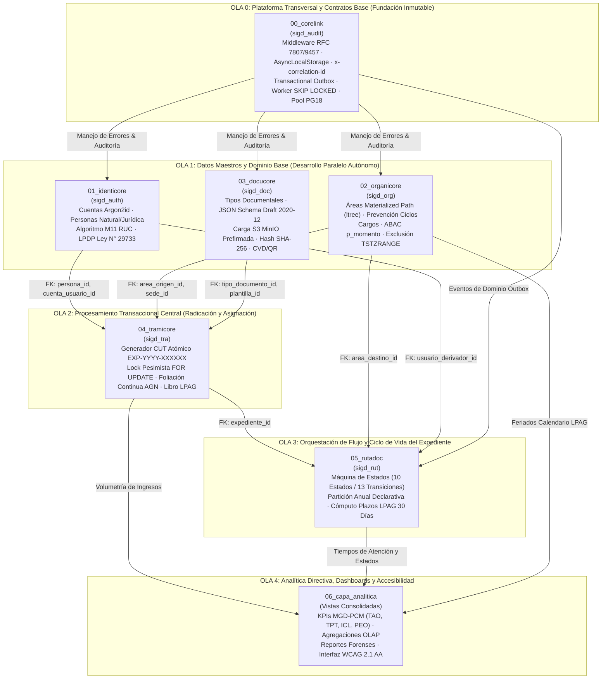

# GUÍA MAESTRA DE ARQUITECTURA: ORDEN DE IMPLEMENTACIÓN MODULAR EN PARALELO
## Sistema Integral de Gestión Documentaria (SIGD) · IESTP "Suiza" (Pucallpa, Perú)
**Programa de Estudios:** Desarrollo de Sistemas de Información (PE DSI) — Semestre 2026-2  
**Código Documental:** `SIGD-ARQ-PARALLEL-WAVE-2026`  
**Autor:** Dirección de Arquitectura de Software, Base de Datos & Auditoría Técnica  
**Estado:** VINCULANTE Y OBLIGATORIO PARA LOS 6 GRUPOS DE TRABAJO BACKEND  

> 📌 **DOCUMENTO CANÓNICO DE GOBERNANZA TÉCNICA:**  
> Este documento establece la secuencia formal del **Grafo Acíclico Dirigido (DAG)** para el desarrollo, migración DDL y pruebas automatizadas en **PostgreSQL 18** y **Node.js / Express 5 con TypeScript 5.9**. Resuelve de manera definitiva las colisiones de llaves foráneas y los cuellos de botella entre los 22 desarrolladores backend del IESTP "Suiza".
>
> 🔗 **Documentos Complementarios Vinculantes:**
> - 📑 [Informe de Auditoría Consolidada de Backend del SIGD](INFORME_AUDITORIA_CONSOLIDADA_BACKEND_SIGD.md)
> - 📊 [Plan de Mejora Integral a Nivel Backend](Plan_de_mejora_nivel_backend_SIGD.md)
> - 🖥️ [Guía Maestra de Arquitectura Frontend en Paralelo](../../frontend/docs/00_ARQUITECTURA_ORDEN_IMPLEMENTACION_PARALELO.md)
> - 🗂️ [Portal Maestro de Documentación Técnica Backend](README.md)

---

## 📑 ÍNDICE GENERAL EXHAUSTIVO

1. [Diagnóstico Forense de la Desincronización Académica vs. Grafo de Dependencias](#1-diagnóstico-forense-de-la-desincronización-académica-vs-grafo-de-dependencias)
   - 1.1 La Inversión Arquitectónica de la Secuencia Lineal (M1 al M6)
   - 1.2 Análisis de Bloqueos Relacionales: Claves Foráneas y Ciclos
   - 1.3 Solución Mediante Ordenamiento Topológico (DAG)
2. [Modelo Rector de 5 Olas (Waves) para Desarrollo Colaborativo en Paralelo](#2-modelo-rector-de-5-olas-waves-para-desarrollo-colaborativo-en-paralelo)
   - 2.1 Grafo Acíclico Dirigido (Diagrama Mermaid)
   - 2.2 Flujo de Propagación de Entidades y Llaves Primarias
3. [Matriz Canónica de Alineamiento: Backend ↔ Frontend ↔ Equipos](#3-matriz-canónica-de-alineamiento-backend--frontend--equipos)
4. [Especificación Técnica Exhaustiva por Módulo y Orden de Precedencia](#4-especificación-técnica-exhaustiva-por-módulo-y-orden-de-precedencia)
   - [4.0 Ola 0 / Prioridad 0: Módulo 00 — CoreLink (`00_corelink/`)](#40-ola-0--prioridad-0-módulo-00--corelink-00_corelink)
   - [4.1 Ola 1 / Prioridad 1A: Módulo 01 — IdentiCore (`01_identicore/`)](#41-ola-1--prioridad-1a-módulo-01--identicore-01_identicore)
   - [4.2 Ola 1 / Prioridad 1B: Módulo 02 — OrganiCore (`02_organicore/`)](#42-ola-1--prioridad-1b-módulo-02--organicore-02_organicore)
   - [4.3 Ola 1 / Prioridad 1C: Módulo 03 — DocuCore (`03_docucore/`)](#43-ola-1--prioridad-1c-módulo-03--docucore-03_docucore)
   - [4.4 Ola 2 / Prioridad 2: Módulo 04 — TramiCore (`04_tramicore/`)](#44-ola-2--prioridad-2-módulo-04--tramicore-04_tramicore)
   - [4.5 Ola 3 / Prioridad 3: Módulo 05 — RutaDoc (`05_rutadoc/`)](#45-ola-3--prioridad-3-módulo-05--rutadoc-05_rutadoc)
   - [4.6 Ola 4 / Prioridad 4: Módulo 06 — Capa Analítica y Tableros Directivos](#46-ola-4--prioridad-4-módulo-06--capa-analítica-y-tableros-directivos)
5. [Estrategia de Desacoplamiento: Protocolo de Contratos, Stubs y Fixtures](#5-estrategia-de-desacoplamiento-protocolo-de-contratos-stubs-y-fixtures)
   - 5.1 Contratos Tipados TypeScript en `backend/src/shared/types/`
   - 5.2 Semilla Determinista de Pruebas (`tests/fixtures/01_schema_fixtures_test.sql`)
   - 5.3 Aislamiento mediante Testcontainers y k6
6. [Secuencia Canónica de Despliegue DDL en PostgreSQL 18](#6-secuencia-canónica-de-despliegue-ddl-en-postgresql-18)
7. [Reglas Vinculantes de Gobernanza Git y Convenciones de Commits](#7-reglas-vinculantes-de-gobernanza-git-y-convenciones-de-commits)

---

## 1. DIAGNÓSTICO FORENSE DE LA DESINCRONIZACIÓN ACADÉMICA VS. GRAFO DE DEPENDENCIAS

### 1.1 La Inversión Arquitectónica de la Secuencia Lineal (M1 al M6)
En la conformación original del taller de desarrollo del SIGD, los seis módulos fueron numerados de forma empírica y aislada entre los sub-equipos de estudiantes:
* **Grupo 1:** RutaDoc (Trazabilidad y Flujos de Expedientes)
* **Grupo 2:** TramiCore (Trámite, Radicación y Código CUT)
* **Grupo 3:** OrganiCore (Estructura Orgánica y Jerarquías)
* **Grupo 4:** IdentiCore (Identidad, Cuentas y Seguridad)
* **Grupo 5:** DocuCore (Documentos, Formularios y Storage)
* **Grupo 6:** CoreLink (Integración, Plataforma y Middleware)

Esta numeración académica inducía una **inversión arquitectónica severa** que imposibilitaba la compilación relacional y la ejecución de pruebas de integración continua:
1. **El Bloqueo Relacional de RutaDoc (Módulo 1 Original):**  
   Para registrar una derivación en la tabla `sigd_rut.movimiento_tramite`, se requiere de manera estricta y obligatoria la existencia previa de:
   - `expediente_id` $\rightarrow$ Clave foránea hacia `sigd_tra.expediente` (creada por TramiCore).
   - `area_origen_id` y `area_destino_id` $\rightarrow$ Claves foráneas hacia `sigd_org.area` (creadas por OrganiCore).
   - `usuario_remitente_id` y `usuario_destinatario_id` $\rightarrow$ Claves foráneas hacia `sigd_auth.cuenta_usuario` (creadas por IdentiCore).  
   Al ser colocado el Grupo 1 en la primera posición sin que existieran los esquemas de las Olas 1 y 2, el equipo se vio obligado a emplear tipos desacoplados `VARCHAR(64)` provisionales, creando un prototipo experimental (v0.1) que no podía ser validado en base de datos real con integridad referencial.

2. **El Aislamiento de CoreLink (Módulo 6 Original):**  
   Al posicionarse al final de la lista, los grupos 1 al 5 diseñaron sus controladores y modelos sin un estándar común de serialización de errores ni trazabilidad transaccional. Esto generó respuestas heterogéneas (`{ error: "...", status: 500 }`, `{ ok: false, msg: "..." }`), colisiones de códigos de error y la omisión del identificador de correlación `X-Correlation-ID`.

### 1.2 Análisis de Bloqueos Relacionales: Claves Foráneas y Ciclos
El modelo conceptual del SIGD presenta un flujo unidireccional de datos. Una entidad transaccional no puede nacer antes que sus catálogos maestros:

$$\text{Plataforma CoreLink} \longrightarrow \text{Maestros (Auth, Org, Doc)} \longrightarrow \text{Transacción (TramiCore)} \longrightarrow \text{Flujo (RutaDoc)} \longrightarrow \text{Analítica Directiva}$$

Cualquier intento de perturbar este orden induce:
- Violaciones de clave foránea (`SQLSTATE 23503: foreign_key_violation`).
- Errores de resolución de tipos de datos (`type "ltree" does not exist`, `type "uuid" mismatch`).
- Imposibilidad de ejecutar scripts de carga masiva de pruebas sin desactivar restricciones de integridad (`SET CONSTRAINTS ALL DEFERRED`).

### 1.3 Solución Mediante Ordenamiento Topológico (DAG)
La reorganización de `backend/docs/` aplica un **ordenamiento topológico** formal sobre el grafo de dependencias de esquemas en PostgreSQL 18. Cada módulo ha sido prefijado (`00_` a `05_`) indicando su nivel de profundidad en el DAG, garantizando que todo script SQL y contrato TypeScript consuma únicamente elementos declarados en capas inferiores o paralelas.

---

## 2. MODELO RECTOR DE 5 OLAS (WAVES) PARA DESARROLLO COLABORATIVO EN PARALELO

### 2.1 Grafo Acíclico Dirigido (Diagrama Mermaid)



### 2.2 Flujo de Propagación de Entidades y Llaves Primarias
1. **Capa `sigd_audit` (Ola 0):** Provee los tipos base `UUIDv7`, funciones de sellado de tiempo UTC (`CLOCK_TIMESTAMP()`) y la tabla unificada de eventos outbox (`evento_outbox`).
2. **Capas `sigd_auth`, `sigd_org`, `sigd_doc` (Ola 1):** Producen las identidades maestras (`persona.id`, `area.area_id`, `tipo_documento.id`). No poseen dependencias entre sí y pueden implementarse y probarse en paralelo al 100%.
3. **Capa `sigd_tra` (Ola 2):** Aglutina las identidades maestras en la creación del expediente, consumiendo `persona_id` y `area_id` para emitir el CUT formal inmutable.
4. **Capa `sigd_rut` (Ola 3):** Opera sobre el `expediente_id` ya consolidado para gestionar los traslados y el ciclo de vida documental.
5. **Capa Analítica (Ola 4):** Lee sobre réplicas o vistas materializadas de `sigd_tra` y `sigd_rut`, realizando agregaciones sin introducir contención de bloqueos sobre la base de datos transaccional.

---

## 3. MATRIZ CANÓNICA DE ALINEAMIENTO: BACKEND ↔ FRONTEND ↔ EQUIPOS

```
+---------------------------------------------------------------------------------------------------------------------------------------------------+
|                                      MATRIZ MAESTRA DE SINCRONIZACIÓN FULL-STACK DEL SIGD (IESTP "SUIZA")                                         |
+-----+---------------------------+------------------+---------------------------------------+------------------+-----------------------------------+
| OLA | CARPETA BACKEND / ESQUEMA | SUB-EQUIPO BACK  | CARPETA FRONTEND CORRESPONDIENTE      | SUB-EQUIPO FRONT | ÉPICA & CASOS DE USO INTEGRADOS   |
+-----+---------------------------+------------------+---------------------------------------+------------------+-----------------------------------+
| **0**| **`00_corelink/`**        | Grupo 6          | `src/shared/api/`, `src/shared/ui/`   | Transversal      | **Plataforma Común:**             |
|     | Esquema: `sigd_audit`     | Urquia (Líder),  | Interceptores Axios (JWT, RFC 7807),  | Urquia (Líder    | Errores estándar RFC 7807/9457,   |
|     | Base de datos y tests TS  | Vargas, Gatica,  | Tokens de diseño Tailwind CSS 4,      | General)         | Correlation-ID, AsyncLocalStorage,|
|     |                           | Barbaran         | Layouts estructurales (MainLayout)    |                  | Transactional Outbox y Worker.    |
+-----+---------------------------+------------------+---------------------------------------+------------------+-----------------------------------+
| **1A**| **`01_identicore/`**     | Grupo 4          | `01_registro-usuarios-casilla/`       | Grupo 2          | **EP-01 & EP-05 (Identidad):**    |
|     | Esquema: `sigd_auth`      | Jhonatan (Líder),| Wizard Registro, Validación DNI/RUC,  | Matías Zumaeta   | Login institucional, personas     |
|     | Modelo polimórfico v2.0   | Gato, Maxin,     | Selector Ubigeo Ucayali/SIAGIE,       | (Líder), Sergio, | naturales y jurídicas, SUNARP,    |
|     |                           | Cristiam Macedo  | Casilla Electrónica Ley N° 29733      | Ángel, Carito    | hash Argon2id, tokens y Casilla.  |
+-----+---------------------------+------------------+---------------------------------------+------------------+-----------------------------------+
| **1B**| **`02_organicore/`**     | Grupo 3          | `02_administracion-seguridad-auditoria/` Grupo 4          | **EP-05 (Organigrama & Admin):**  |
|     | Esquema: `sigd_org`       | Isack (LÍDER),   | **7 pantallas en React 19 (PR #75):** | Jhonatan (Líder),| Jerarquía institucional `ltree`,  |
|     | Path `ltree` & ABAC       | Willfredo,       | Árbol de Áreas, Cargos, Matriz RBAC,  | Gato, Maxin,     | prevención de ciclos en triggers, |
|     |                           | Bartra           | Bitácora forense, Calendario LPAG     | Cristiam Macedo  | evaluación ABAC en `p_momento`.   |
+-----+---------------------------+------------------+---------------------------------------+------------------+-----------------------------------+
| **1C**| **`03_docucore/`**       | Grupo 5          | `03_flujo-validez-legal/`             | Grupo 5          | **EP-02 & EP-04 (Documental):**   |
|     | Esquema: `sigd_doc`       | Adriano (Líder), | Proyector de Resoluciones, Plantillas | Adriano (Líder), | Catálogo tipos documentales,      |
|     | JSON Schema & MinIO S3    | Isai,            | dinámicas JSON Schema, Pasarela       | Isai,            | subida directa prefirmada a S3,   |
|     |                           | Mayra            | Refirma RENIEC, Validador CVD / QR    | Mayra            | hash SHA-256, estampa CVD y firma.|
+-----+---------------------------+------------------+---------------------------------------+------------------+-----------------------------------+
| **2**| **`04_tramicore/`**       | Grupo 2          | `04_registro-documentario/`           | Grupo 1          | **EP-01 & EP-02 (Radicación):**   |
|     | Esquema: `sigd_tra`       | Matias (Líder),  | Mesa de Partes Virtual 24x7,          | Patty Marina     | Generador atómico CUT anual       |
|     | Generador CUT concurrente | Serruche,        | Ventanilla Presencial, Cargo Digital  | (Líder), Noelia, | `EXP-YYYY-XXXXXX`, foliado AGN,   |
|     | 26 pruebas verificadas    | Angel Jesus,     | sellado, Regla de Corte 16:30 hrs     | Lucy, Anllely    | Libro Registro LPAG y acumulación.|
|     |                           | Carito Curto     |                                       |                  |                                   |
+-----+---------------------------+------------------+---------------------------------------+------------------+-----------------------------------+
| **3**| **`05_rutadoc/`**         | Grupo 1          | `05_gestion-expedientes/`             | Grupo 3          | **EP-03 (Workflow y Bandejas):**  |
|     | Esquema: `sigd_rut`       | Patty (Líder),   | Bandeja del Servidor de 6 pestañas,   | Isack Vargas     | FSM 10 estados / 13 transiciones, |
|     | FSM & Partición Anual     | Noelia, Lucy,    | Modal Derivación Múltiple, Semáforo   | (Líder),         | partición declarativa de tablas,  |
|     |                           | Anllely          | SLA LPAG 30 días, Clasificador CCD    | Willfredo, Piero | plazos legales y notificaciones.  |
+-----+---------------------------+------------------+---------------------------------------+------------------+-----------------------------------+
| **4**| **`06_capa_analitica`**   | Grupo 6          | `06_reportes-tableros-control/`       | Grupo 6          | **EP-06 (Inteligencia Directiva):**|
|     | Vistas Materializadas     | Urquia (Líder),  | Dashboard Ejecutivo MGD-PCM (TAO,     | Urquia (Líder),  | Indicadores oficiales de gestión, |
|     | y Reportes Forenses       | Vargas, Gatica,  | TPT, ICL, PEO), Gráficos Recharts,    | Vargas, Gatica,  | promedios de atención, filtros    |
|     |                           | Barbaran         | Exportador PDF/Excel, Accesibilidad   | Barbaran         | multicriterio y auditoría total.  |
+-----+---------------------------+------------------+---------------------------------------+------------------+-----------------------------------+
```

---

## 4. ESPECIFICACIÓN TÉCNICA EXHAUSTIVA POR MÓDULO Y ORDEN DE PRECEDENCIA

### 4.0 Ola 0 / Prioridad 0: Módulo 00 — CoreLink (`00_corelink/`)
* **Liderazgo Técnico:** Urquia López (Líder), Vargas Huayunga, Gatica Saavedra, Barbarán Gonzales (*Grupo 6 Backend*).
* **Esquema Relacional:** `sigd_audit` en PostgreSQL 18.
* **Misión Arquitectónica:** Establecer la base transversal inmutable de la plataforma: inyección de contexto asíncrono, middleware unificado de excepciones RFC 7807/RFC 9457, patrón Transactional Outbox y pruebas automatizadas con Testcontainers.

#### Componentes Técnicos y Artefactos en `00_corelink/`:
1. 📄 [`01_especificacion_middleware_rfc7807.md`](00_corelink/01_especificacion_middleware_rfc7807.md):  
   - Define el contrato de error estándar IETF en estructura `ApiProblemDetails` (`type`, `title`, `status`, `detail`, `instance`, `code`, `invalidParams`, `timestamp`, `correlationId`).
   - Mapeo estricto de excepciones de dominio: `ValidationError` (422), `EntityNotFoundError` (404), `ConflictError` (409), `UnauthorizedError` (401), `ForbiddenError` (403) y `DatabaseError` (500).
2. 📄 [`02_arquitectura_auditoria_contexto_asynclocalstorage.md`](00_corelink/02_arquitectura_auditoria_contexto_asynclocalstorage.md):  
   - Propagación determinista de `correlationId`, `userId`, `clientIp` y `userRole` en Node.js mediante `AsyncLocalStorage` sin contaminar las firmas de los servicios de aplicación.
3. 💾 [`06_sigd_audit_esquema_ddl.sql`](00_corelink/06_sigd_audit_esquema_ddl.sql):  
   - Esquema físico `sigd_audit`. Tablas principales:
     * `bitacora_auditoria`: Registro inmutable WORM (*Write Once, Read Many*) de operaciones DML con columnas `id BIGSERIAL`, `fecha_hora TIMESTAMPTZ`, `usuario_id UUID`, `ip_origen INET`, `esquema_tabla VARCHAR(128)`, `operacion VARCHAR(16)`, `datos_anteriores JSONB`, `datos_nuevos JSONB`, `correlation_id UUID`.
     * `evento_outbox`: Tabla de mensajería desacoplada con `id UUID`, `tipo_evento VARCHAR(128)`, `agregado_id UUID`, `payload JSONB`, `creado_en TIMESTAMPTZ`, `procesado_en TIMESTAMPTZ`, `estado VARCHAR(32)`, `intentos INT`.
   - Separación estricta de privilegios: rol `sigd_app` (inserta en outbox y bitácora) vs rol `sigd_worker` (procesa eventos concurrentes con `SELECT ... FOR UPDATE SKIP LOCKED`).
4. 🧪 [`03_suite_pruebas_testcontainers_k6.md`](00_corelink/03_suite_pruebas_testcontainers_k6.md) y [`08_runbook_evidencia_pruebas.md`](00_corelink/08_runbook_evidencia_pruebas.md):  
   - Configuración de pruebas de integración con contenedores reales de PostgreSQL 18 mediante Testcontainers y scripts de carga k6 para validar resiliencia del pool de conexiones.
5. 👥 [`07_evidencia_autorias_y_aprobaciones.md`](00_corelink/07_evidencia_autorias_y_aprobaciones.md):  
   - Documentación forense del PR #79 y resolución de autorías institucionales.
6. 📨 [`09_propuesta_contractual_rutadoc.md`](00_corelink/09_propuesta_contractual_rutadoc.md):  
   - Contrato formal de eventos producidos por RutaDoc hacia el Outbox (`ExpedienteDerivadoEvent`, `ExpedienteObservadoEvent`).

---

### 4.1 Ola 1 / Prioridad 1A: Módulo 01 — IdentiCore (`01_identicore/`)
* **Liderazgo Técnico:** Jhonatan Gonzales (Líder), Brayan Gato, Leonel Rivera Maxin, Cristian Macedo (*Grupo 4 Backend*).
* **Esquema Relacional:** `sigd_auth` en PostgreSQL 18.
* **Misión Arquitectónica:** Proveer la capa central de identidad, autenticación institucional con Argon2id, gestión de sesiones seguras, representación legal y casilla electrónica ciudadana bajo la Ley N° 29733.

#### Componentes Técnicos y Artefactos en `01_identicore/`:
1. 📘 [`01_analisis_identidad_personas_seguridad.md`](01_identicore/01_analisis_identidad_personas_seguridad.md) (Canónico v2.0, 324 líneas):  
   - Modelo polimórfico de personas: tabla base `persona` y extensiones 1:1 `persona_natural` y `persona_juridica`.
   - Algoritmo Módulo 11 para validación de RUC de 11 dígitos (pesos `[5, 4, 3, 2, 7, 6, 5, 4, 3, 2]`).
   - Validación de documentos de identidad (DNI de 8 dígitos, Carnet de Extranjería, Pasaporte).
2. 📐 [`02_modelo_datos_identicore_v2.md`](01_identicore/02_modelo_datos_identicore_v2.md) y [`02_diccionario_datos_identicore_v2.md`](01_identicore/02_diccionario_datos_identicore_v2.md):  
   - Especificación detallada de campos, tipos nativos y cardinalidades.
3. 💾 [`03_esquema_sigd_auth_v2.sql`](01_identicore/03_esquema_sigd_auth_v2.sql):  
   - Esquema físico `sigd_auth`. Tablas:
     * `persona`: `id UUID PRIMARY KEY`, `tipo_persona VARCHAR(16)`, `ubigeo_id VARCHAR(6)`, `direccion VARCHAR(256)`, `telefono VARCHAR(32)`, `correo_principal VARCHAR(128)`.
     * `persona_natural`: `persona_id UUID PRIMARY KEY REFERENCES persona(id)`, `tipo_documento VARCHAR(16)`, `numero_documento VARCHAR(32) UNIQUE`, `nombres VARCHAR(128)`, `apellido_paterno VARCHAR(128)`, `apellido_materno VARCHAR(128)`.
     * `persona_juridica`: `persona_id UUID PRIMARY KEY REFERENCES persona(id)`, `ruc VARCHAR(11) UNIQUE`, `razon_social VARCHAR(256)`, `partida_registral_sunarp VARCHAR(64)`.
     * `cuenta_usuario`: `id UUID PRIMARY KEY REFERENCES persona(id)`, `username VARCHAR(64) UNIQUE`, `password_hash VARCHAR(256)` (Argon2id), `rol_principal VARCHAR(32)`, `estado VARCHAR(16)`, `intentos_fallidos INT`.
     * `sesion_usuario`: Manejo de Refresh Tokens con revocación criptográfica y fingerprint del dispositivo.
     * `consentimiento_datos`: Registro auditable de aceptación de términos según la Ley N° 29733 (IP, fecha/hora, versión de términos).
4. 🧪 [`04_validacion_identicore_v2.md`](01_identicore/04_validacion_identicore_v2.md) y [`05_decisiones_levantamiento_identicore.md`](01_identicore/05_decisiones_levantamiento_identicore.md):  
   - Plan de pruebas V-01 a V-07. **Hito crítico del sprint:** Ejecutar las pruebas pendientes en PostgreSQL real y estandarizar IDs a `UUID`.

---

### 4.2 Ola 1 / Prioridad 1B: Módulo 02 — OrganiCore (`02_organicore/`)
* **Liderazgo Técnico:** Isack Vargas (Líder), Willfredo Soria, Piero Bartra (*Grupo 3 Backend*).
* **Esquema Relacional:** `sigd_org` en PostgreSQL 18.
* **Misión Arquitectónica:** Modelar la estructura orgánica jerárquica del instituto mediante la extensión `ltree`, desacoplar la asignación de cargos institucionales y evaluar determinísticamente las facultades de firma y despacho (ABAC) en función del tiempo (`p_momento`).

#### Componentes Técnicos y Artefactos en `02_organicore/`:
1. 📘 [`01_analisis_areas_roles_permisos.md`](02_organicore/01_analisis_areas_roles_permisos.md) y [`01_analisis_path_abac_encargaturas.md`](02_organicore/01_analisis_path_abac_encargaturas.md):  
   - Análisis de unidades organizativas del IESTP "Suiza" (Dirección General, Jefatura Académica, Áreas de Empleabilidad, Programas de Estudio).
   - Patrón *Materialized Path* con `ltree` (ej. `instituto.direccion_general.jefatura_academica.dsi`).
2. 📐 [`02_modelo_datos_sigd_org.md`](02_organicore/02_modelo_datos_sigd_org.md) y [`02_diccionario_datos_sigd_org.md`](02_organicore/02_diccionario_datos_sigd_org.md):  
   - Modelado conceptual y diccionario de datos completo.
3. 💾 [`03_esquema_sigd_org_v2.sql`](02_organicore/03_esquema_sigd_org_v2.sql):  
   - Esquema físico `sigd_org`. Tablas y estructuras:
     * `area`: `area_id UUID PRIMARY KEY`, `codigo VARCHAR(32) UNIQUE`, `nombre VARCHAR(128)`, `path_jerarquia LTREE NOT NULL`, `nivel_jerarquico INT`, `estado VARCHAR(16)`.
     * Índice GiST sobre `path_jerarquia` (`CREATE INDEX idx_area_path ON sigd_org.area USING GIST (path_jerarquia)`).
     * Trigger de prevención de ciclos de áreas (`06_notas_tecnicas_prevencion_ciclos.md`).
     * `cargo`: `cargo_id UUID PRIMARY KEY`, `area_id UUID REFERENCES area(area_id)`, `denominacion VARCHAR(128)`, `es_titular_despacho BOOLEAN`.
     * `encargatura_area`: Asignación temporal con rango de fechas `vigencia TSTZRANGE NOT NULL` y restricción de exclusión GiST.
     * Función `evaluar_facultad_despacho(p_momento TIMESTAMPTZ, p_area_id UUID, p_usuario_id UUID)`.
4. 🧪 [`04_validacion_organicore_v2.md`](02_organicore/04_validacion_organicore_v2.md) y [`05_validacion_organicore_v2.sql`](02_organicore/05_validacion_organicore_v2.sql):  
   - 14 / 14 pruebas de laboratorio exitosas en log PG18 (validación de caminos, herencia de permisos y encargaturas).

---

### 4.3 Ola 1 / Prioridad 1C: Módulo 03 — DocuCore (`03_docucore/`)
* **Liderazgo Técnico:** Adriano Espinoza (Líder), Isaí Pizango, Mayra García (*Grupo 5 Backend*).
* **Esquema Relacional:** `sigd_doc` en PostgreSQL 18.
* **Misión Arquitectónica:** Gestionar el catálogo documental, plantillas estructuradas dinámicas validadas con JSON Schema Draft 2020-12, carga desacoplada a almacenamiento S3/MinIO mediante URLs prefirmadas y registro de firma digital con validador CVD.

#### Componentes Técnicos y Artefactos en `03_docucore/`:
1. 📘 [`01_analisis_json_schema_storage_s3.md`](03_docucore/01_analisis_json_schema_storage_s3.md) y [`02_reglas_tupa_admisibilidad_v2.md`](03_docucore/02_reglas_tupa_admisibilidad_v2.md):  
   - Análisis de documentos administrativos y académicos (Oficios, Proveídos, Resoluciones Directoriales, Actas de Evaluación, Certificados).
   - Especificación de almacenamiento desacoplado: los archivos binarios residen en MinIO/S3; la base de datos almacena metadatos, hash criptográfico y ubicaciones virtuales.
2. 📐 [`03_modelo_datos_docucore_v2.1_auditoria_corregido.md`](03_docucore/03_modelo_datos_docucore_v2.1_auditoria_corregido.md) y [`04_diccionario_datos_docucore_v2.md`](03_docucore/04_diccionario_datos_docucore_v2.md):  
   - Modelo relacional con soporte nativo de columnas `JSONB`.
3. 💾 [`05_esquema_sigd_doc_jsonb_v6.3_auditoria_corregido.sql`](03_docucore/05_esquema_sigd_doc_jsonb_v6.3_auditoria_corregido.sql):  
   - Esquema físico `sigd_doc`. Tablas:
     * `tipo_documento`: `id UUID PRIMARY KEY`, `codigo VARCHAR(32) UNIQUE`, `nombre VARCHAR(128)`, `categoria VARCHAR(32)`, `dias_atencion_defecto INT`.
     * `plantilla_documental`: `id UUID PRIMARY KEY`, `tipo_documento_id UUID REFERENCES tipo_documento(id)`, `version INT`, `esquema_validacion JSONB NOT NULL` (JSON Schema Draft 2020-12), `cuerpo_plantilla TEXT`.
     * `documento_instancia`: `id UUID PRIMARY KEY`, `tipo_documento_id UUID REFERENCES tipo_documento(id)`, `datos_formulario JSONB NOT NULL`, `storage_path VARCHAR(512)`, `hash_sha256 VARCHAR(64) NOT NULL`, `cvd VARCHAR(16) UNIQUE`.
     * `firma_digital_registro`: Trazabilidad de firma con `certificado_firmante`, `autoridad_certificadora`, `sello_tiempo TIMESTAMPTZ`, `validez_iofe BOOLEAN`.
4. 🧪 [`06_validacion_y_casos_prueba_v2.1_auditoria_corregido.md`](03_docucore/06_validacion_y_casos_prueba_v2.1_auditoria_corregido.md) y [`07_decisiones_y_preguntas_pendientes.md`](03_docucore/07_decisiones_y_preguntas_pendientes.md):  
   - **Hito crítico del sprint:** Ejecución física del hito H4 de validación en base de datos real con MinIO local.

---

### 4.4 Ola 2 / Prioridad 2: Módulo 04 — TramiCore (`04_tramicore/`)
* **Liderazgo Técnico:** Matías Zumaeta (Líder), Sergio Serruche, Ángel Jesús Vásquez, Carito Curto (*Grupo 2 Backend*).
* **Esquema Relacional:** `sigd_tra` en PostgreSQL 18.
* **Misión Arquitectónica:** Radicación y recepción formal de documentos (Ventanilla Presencial y Mesa de Partes Virtual 24x7), generación atómica libre de colisiones del Código Único de Trámite (**CUT**), foliación continua acumulativa conforme a directivas AGN y Libro de Registro LPAG.

#### Componentes Técnicos y Artefactos en `04_tramicore/`:
1. 📘 [`01_analisis_cut_acumulacion_foliado.md`](04_tramicore/01_analisis_cut_acumulacion_foliado.md):  
   - Algoritmo de generación del CUT anual: `EXP-{YYYY}-{CORRELATIVO:06d}` (ej. `EXP-2026-000124`).
   - Acumulación de expedientes según el Art. 160 del TUO de la Ley N° 27444.
   - Foliación física y digital ascendente e inalterable.
2. 📐 [`02_modelo_datos_tramicore_v2.md`](04_tramicore/02_modelo_datos_tramicore_v2.md) y [`02_diccionario_datos_tramicore_v2.md`](04_tramicore/02_diccionario_datos_tramicore_v2.md):  
   - Modelo transaccional central del sistema.
3. 💾 [`03_esquema_sigd_tra_cut_foliado.sql`](04_tramicore/03_esquema_sigd_tra_cut_foliado.sql):  
   - Esquema físico `sigd_tra`. Tablas:
     * `secuencia_cut`: `anio INT PRIMARY KEY`, `ultimo_correlativo INT NOT NULL`.
     * `expediente`: `expediente_id UUID PRIMARY KEY`, `cut VARCHAR(32) UNIQUE NOT NULL`, `anio INT NOT NULL`, `persona_id UUID NOT NULL REFERENCES sigd_auth.persona(id)`, `tipo_procedimiento_id UUID`, `asunto VARCHAR(512)`, `estado VARCHAR(32)`, `total_folios INT NOT NULL DEFAULT 1`, `fecha_radicacion TIMESTAMPTZ NOT NULL`.
     * `documento_expediente`: `id UUID PRIMARY KEY`, `expediente_id UUID NOT NULL REFERENCES expediente(expediente_id)`, `documento_id UUID NOT NULL REFERENCES sigd_doc.documento_instancia(id)`, `folio_desde INT NOT NULL`, `folio_hasta INT NOT NULL`.
     * Trigger atómico `trg_asignar_cut_atomico`: Ejecuta `SELECT ultimo_correlativo FROM sigd_tra.secuencia_cut WHERE anio = NEW.anio FOR UPDATE;` garantizando serialización pesimista que elimina carreras críticas.
4. 🧪 [`06_pruebas_laboratorio_tramicore.sql`](04_tramicore/06_pruebas_laboratorio_tramicore.sql) y [`07_lanzador_pruebas_tramicore.ps1`](04_tramicore/07_lanzador_pruebas_tramicore.ps1):  
   - **26 / 26 Pruebas de laboratorio exitosas en PostgreSQL 18.3** registradas en `logs_pruebas/evidencia_h4.json`. Refutación matemática comprobada contra 500 CUTs concurrentes sin huecos ni saltos.

---

### 4.5 Ola 3 / Prioridad 3: Módulo 05 — RutaDoc (`05_rutadoc/`)
* **Liderazgo Técnico:** Patty Marina (Líder), Noelia Alva, Lucy López, Anllely Melgarejo (*Grupo 1 Backend*).
* **Esquema Relacional:** `sigd_rut` en PostgreSQL 18.
* **Misión Arquitectónica:** Gestionar la máquina de estados finitos (FSM) de la tramitación institucional, trazabilidad del expediente mediante partición declarativa anual, asignación de proveídos, cómputo estricto de plazos LPAG (30 días hábiles) y emisión de alertas de semaforización.

#### Componentes Técnicos y Artefactos en `05_rutadoc/`:
1. 📘 [`01_analisis_dominio_transiciones_rutadoc.md`](05_rutadoc/01_analisis_dominio_transiciones_rutadoc.md) y [`01_analisis_trazabilidad_recepcion_derivacion_atencion.md`](05_rutadoc/01_analisis_trazabilidad_recepcion_derivacion_atencion.md):  
   - Definición de la Máquina de Estados Finitos (FSM) de 10 estados legales: `REGISTRADO`, `RECEPCIONADO`, `DERIVADO`, `EN_TRAMITE`, `PENDIENTE_FIRMA`, `FIRMADO`, `NOTIFICADO`, `OBSERVADO`, `SUBSANADO`, `ARCHIVADO`.
   - Matriz de 13 transiciones autorizadas con guardas de validación.
2. 📐 [`02_modelo_datos_rutadoc_v2.md`](05_rutadoc/02_modelo_datos_rutadoc_v2.md) y [`02_diccionario_datos_rutadoc_v2.md`](05_rutadoc/02_diccionario_datos_rutadoc_v2.md):  
   - Definición del modelo con eliminación de `VARCHAR(64)` provisionales y sustitución obligatoria por `UUID` de `sigd_tra`, `sigd_org` y `sigd_auth`.
3. 💾 [`03_esquema_sigd_rut_particionado.sql`](05_rutadoc/03_esquema_sigd_rut_particionado.sql):  
   - Esquema físico `sigd_rut`. Tablas:
     * `movimiento_tramite`: Tabla particionada declarativamente por rango anual (`PARTITION BY RANGE (fecha_movimiento)`):
       - `movimiento_tramite_2026 PARTITION FOR VALUES FROM ('2026-01-01') TO ('2027-01-01');`
       - Columnas: `movimiento_id UUID`, `expediente_id UUID NOT NULL REFERENCES sigd_tra.expediente(expediente_id)`, `area_origen_id UUID NOT NULL REFERENCES sigd_org.area(area_id)`, `area_destino_id UUID NOT NULL REFERENCES sigd_org.area(area_id)`, `usuario_id UUID NOT NULL REFERENCES sigd_auth.cuenta_usuario(id)`, `estado_anterior VARCHAR(32)`, `estado_nuevo VARCHAR(32)`, `fecha_movimiento TIMESTAMPTZ NOT NULL`, `plazo_dias_habiles INT DEFAULT 30`, `fecha_vencimiento_lpag DATE`.
     * `alerta_plazo_lpag`: Semáforo operativo (`VERDE` $\le 15$ días, `AMARILLO` $16-25$ días, `ROJO` $> 25$ días o vencido).
4. 🧪 [`04_validacion_rutadoc_v2.md`](05_rutadoc/04_validacion_rutadoc_v2.md) y [`05_decisiones_levantamiento_rutadoc.md`](05_rutadoc/05_decisiones_levantamiento_rutadoc.md):  
   - Tareas prioritarias del sprint: conectar formalmente con el Outbox de CoreLink y validar transiciones sobre base de datos poblada con las semillas de las Olas 1 y 2.

---

### 4.6 Ola 4 / Prioridad 4: Módulo 06 — Capa Analítica y Tableros Directivos
* **Liderazgo Técnico:** Urquia López (*Grupo 6*) en coordinación transversal con Jhonatan Gonzales (*Grupo 4*).
* **Misión Arquitectónica:** Consolidar métricas del Modelo de Gestión Documental (PCM), auditoría forense agregada y volumetría de expedientes sin degradar la concurrencia transaccional del motor OLTP.
* **Componentes:**
  - Vistas materializadas analíticas: `vm_kpis_mgd_mensual` con refresco programado en horas no pico.
  - Métricas calculadas:
    * **TAO (Tiempo Promedio de Atención Operativa):** Días hábiles promedio desde la radicación hasta el archivamiento definitivo.
    * **TPT (Tasa de Productividad por Trámite):** Ratio de expedientes resueltos vs expedientes ingresados por área académica.
    * **ICL (Índice de Cumplimiento Legal):** Porcentaje de expedientes atendidos dentro del plazo estricto de la LPAG ($\le 30$ días hábiles).
    * **PEO (Porcentaje de Expedientes Observados):** Tasa de observaciones generadas por deficiencias de requisitos TUPA.

---

## 5. ESTRATEGIA DE DESACOPLAMIENTO: PROTOCOLO DE CONTRATOS, STUBS Y FIXTURES

Para garantizar que los **6 grupos de desarrollo puedan avanzar en simultáneo** sin esperar a que los módulos precedentes estén 100% integrados en staging:

```text
       ┌─────────────────────────────────────────────────────────────┐
       │     Contratos Tipados TypeScript (src/shared/types/)        │
       │   ExpedienteContract │ PersonaContract │ AreaContract       │
       └──────────────────────────────┬──────────────────────────────┘
                                      │
         ┌────────────────────────────┴────────────────────────────┐
         ▼                                                         ▼
┌──────────────────────────────────────┐  ┌──────────────────────────────────────┐
│  Modo Aislado / Desarrollo Inicial   │  │    Modo Integración / Real Staging   │
│  - Fixtures Semilla SQL PG18         │  │  - PostgreSQL 18 con 6 Esquemas DDL  │
│  - Stubs deterministas de testing    │  │  - Testcontainers E2E & K6 Runner    │
│  - Testcontainers aislados por grupo │  │  - Transacciones reales cruzadas     │
└──────────────────────────────────────┘  └──────────────────────────────────────┘
```

1. **Contratos Tipados en `backend/src/shared/types/index.ts`:**  
   Todo intercambio inter-módulos se realiza mediante interfaces TypeScript estables. Ningún módulo importa directamente clases o modelos de otro módulo; se comunican a través de contratos de datos tipados (`ExpedienteContract`, `PersonaNaturalContract`, `AreaLtreeContract`, `EventoEnvelope`).
2. **Semilla Determinista (`backend/tests/fixtures/01_schema_fixtures_test.sql`):**  
   Provee un script SQL ligero con datos semilla inmutables (UUIDs fijos de prueba para el Administrador General, Sedes Centrales, Áreas de DSI y Tipos Documentales TUPA estándar). Permite a los desarrolladores de las Olas 2 y 3 ejecutar suites de integración locales sin requerir que la base de datos completa de las Olas 1A, 1B y 1C esté operativa.
3. **Manejo Centralizado de Excepciones:**  
   Todo controlador captura errores a través del middleware `errorMiddleware` de CoreLink, retornando siempre un payload compatible con RFC 7807 (`ApiProblemDetails`), lo cual asegura la estabilidad absoluta de los contratos con el frontend.

---

## 6. SECUENCIA CANÓNICA DE DESPLIEGUE DDL EN POSTGRESQL 18

El despliegue en cualquier entorno nuevo (desarrollo, pruebas, producción) debe seguir obligatoriamente este orden secuencial para evitar violaciones de clave foránea o extensiones ausentes:

```bash
# Paso 0: Base de datos limpia con extensiones requeridas
psql -d sigd_db -c "CREATE EXTENSION IF NOT EXISTS \"uuid-ossp\";"
psql -d sigd_db -c "CREATE EXTENSION IF NOT EXISTS \"ltree\";"
psql -d sigd_db -c "CREATE EXTENSION IF NOT EXISTS \"btree_gist\";"

# Paso 1: Ola 0 (CoreLink - Auditoría y Outbox)
psql -d sigd_db -f backend/docs/00_corelink/06_sigd_audit_esquema_ddl.sql

# Paso 2: Ola 1A (IdentiCore - Personas, Cuentas y Casilla)
psql -d sigd_db -f backend/docs/01_identicore/03_esquema_sigd_auth_v2.sql

# Paso 3: Ola 1B (OrganiCore - Estructura Orgánica y Jerarquías ltree)
psql -d sigd_db -f backend/docs/02_organicore/03_esquema_sigd_org_v2.sql

# Paso 4: Ola 1C (DocuCore - Tipos Documentales, JSON Schema y CVD)
psql -d sigd_db -f backend/docs/03_docucore/05_esquema_sigd_doc_jsonb_v6.3_auditoria_corregido.sql

# Paso 5: Ola 2 (TramiCore - Radicación, CUT Atómico y Foliación)
psql -d sigd_db -f backend/docs/04_tramicore/03_esquema_sigd_tra_cut_foliado.sql

# Paso 6: Ola 3 (RutaDoc - Trazabilidad y Partición Anual)
psql -d sigd_db -f backend/docs/05_rutadoc/03_esquema_sigd_rut_particionado.sql
```

---

## 7. REGLAS VINCULANTES DE GOBERNANZA GIT Y CONVENCIONES DE COMMITS

1. **Ramas Personales por Desarrollador (`B_*`):**  
   Cada uno de los 22 desarrolladores backend trabaja exclusivamente en su rama personal autorizada (ej. `B_PATTY`, `B_MATIAS`, `B_ISACK`, `B_JHONATAN`, `B_ADRIANO`, `B_URQUIA`). Los PRs deben dirigirse a la rama de integración de su respectiva Ola.
2. **Convención de Commits Semánticos con Prefijo Modular:**  
   Todo commit debe especificar el módulo modificado:
   - `feat(00_corelink): middleware de correlacion asincrona`
   - `fix(01_identicore): correccion algoritmo modulo 11 para ruc`
   - `feat(02_organicore): validacion de caminos ltree con triggers`
   - `feat(03_docucore): contratos presigned url s3 minio`
   - `test(04_tramicore): prueba concurrente 500 hilos generacion cut`
   - `feat(05_rutadoc): particion anual de tabla movimiento tramite`
3. **Prohibición Terminante de Tipos Desacoplados Provisionales:**  
   Queda estrictamente prohibido utilizar `VARCHAR(64)` en sustitución de claves foráneas hacia otros esquemas. Toda relación debe tiparse como `UUID` apuntando a la tabla maestra definitiva.
