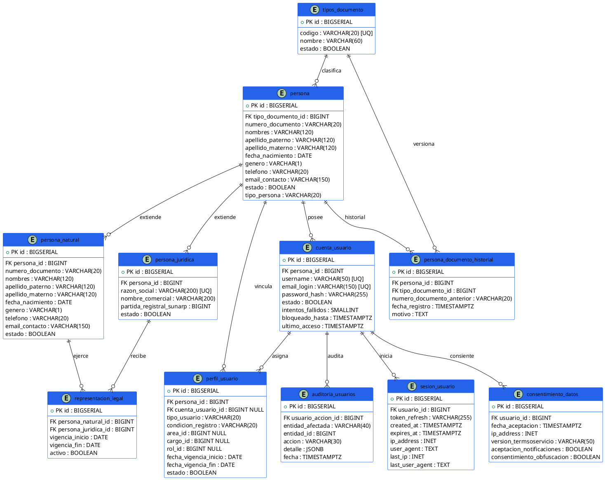

# Modelo de Datos IdentiCore v2.0

> **Implementación actual: BIGSERIAL/BIGINT, según `03_esquema_sigd_auth_v2.sql`.**
> Alineación documental realizada para mantener coherencia con la implementación.
> La decisión queda sujeta a validación de Jair/Grupo 4.
> El modelo es una vista conceptual; la referencia física es el SQL.

## 1. Resumen Ejecutivo
El modelo v2.0 de IdentiCore establece una jerarquía de entidades para la identificación unificada (Personas Naturales y Jurídicas), gestión de cuentas de usuario, sesiones concurrentes, apoderamiento legal y cumplimiento normativo (LPDP / Consentimiento de datos).

## 2. Diagrama de Entidades y Relaciones (PlantUML)

## 3. Notas de alcance
* La especialización `persona` → `persona_natural` / `persona_juridica` es N:1 en SQL; la exclusividad total 1:1 requiere lógica transaccional PENDIENTE.
* `representacion_legal` garantiza dupla única y coherencia temporal básica, no anti-solapamiento por rango.
* `area_id` / `cargo_id` / `rol_id` son referencias conceptuales a OrganiCore, sin FK física.
* Cumplimiento Ley 29733 y bloqueo 5 intentos/15 min son lógica de aplicación, no constraints SQL.
