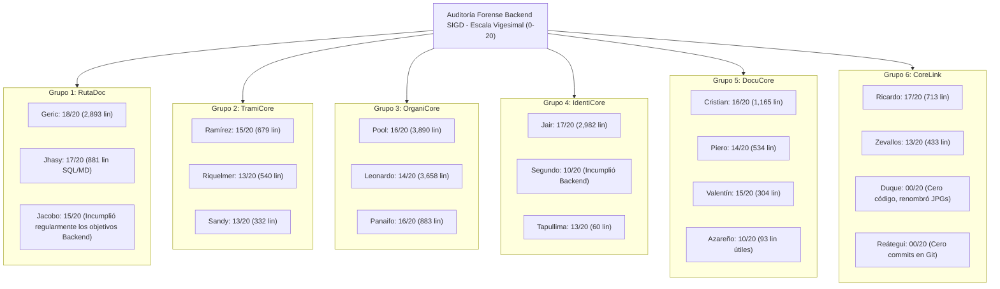

# INFORME DE AUDITORÍA FORENSE Y EVALUACIÓN DE CONTRIBUCIONES — BACKEND SIGD

**Proyecto:** Sistema Integral de Gestión Documentaria (SIGD)  
**Institución:** IESTP "Suiza" (Pucallpa, Ucayali, Perú) — PE DSI  
**Área:** Backend  
**Fecha de Auditoría Forense:** 31 de agosto de 2026  
**Herramientas Empleadas:** Análisis profundo Git (Líneas reales `.md` y `.sql`), cruce pericial con Planes de Trabajo.

---

## 1. RESUMEN EJECUTIVO Y HALLAZGOS PERICIALES

La presente auditoría aplica filtros estrictos para descontar líneas de código autogeneradas, imágenes, binarios y librerías (`node_modules`), midiendo **únicamente el código y documentación escrita a mano** (`Markdown` y `SQL`). Además, la calificación se ha fundamentado en el **cumplimiento estricto del Rol Asignado** en los planes de trabajo iniciales (`backend/docs/planes_trabajo/`).

### Hallazgos Críticos:
1. **Falsos Positivos Detectados:** El análisis superficial de Git mostraba a integrantes con altos volúmenes de líneas que, tras la auditoría profunda, resultaron ser cargas masivas de librerías de Frontend (React) o simples renombramientos de imágenes.
2. **Desviaciones del Alcance:** Algunos miembros trabajaron interfaces Frontend en lugar de la arquitectura Backend que tenían asignada.
3. **Alto Rendimiento:** Los Grupos 3, 2 y 4 (gracias a aportes individuales extraordinarios) sostienen la viabilidad técnica del módulo Backend.

---

## 2. EVALUACIÓN DETALLADA Y CALIFICACIÓN TÉCNICA (0 - 20)

### 🥇 GRUPO 3 — OrganiCore (Equipo Destacado)
**Evaluación General:** Excelente. Los tres miembros demostraron alto profesionalismo, cumpliendo a cabalidad su rol sin desviarse del alcance backend.
* 🟢 **Leonardo** (`leonardo`) | Rol: Analista Funcional | **Nota: 14/20**  
  * *Peritaje:* 3,658 líneas Markdown genuinas. Análisis funcional impecable y sumamente detallado de áreas y roles RBAC.
* 🟢 **Pool Angelo** (`angel` / `Carranzapereyrapoolangelo-alt`) | Rol: Sublíder y Modelador | **Nota: 16/20**  
  * *Peritaje:* Lideró la carga técnica (más de 3,300 líneas MD y 536 SQL). Extraordinario nivel de consolidación.
* 🟢 **Geiner Tange** (`TangeHidalgoGeiner`) | Rol: Implementador SQL | **Nota: 16/20**  
  * *Peritaje:* Entregó código DDL limpio y casos de prueba perfectamente alineados.

---

### 🥈 GRUPO 1 — RutaDoc (Trazabilidad y Flujo)
* 🟢 **Geric** (`salasormenogericaldair01-cell`) | Rol: Arquitecto y Modelador | **Nota: 18/20**  
  * *Peritaje:* 2,893 líneas MD. Consolidó magistralmente la máquina de estados.
* 🟢 **Jhasy** (`svrjhass-design`) | Rol: Implementadora SQL | **Nota: 17/20**  
  * *Peritaje:* 214 líneas MD y 667 líneas SQL de excelente nivel técnico.
* 🟢 **Jacobo** (`cliderlex-sketch`) | Rol: Analista Funcional | **Nota: 15/20**  
  * *Peritaje:* **Incumplimiento parcial de Rol.** Debía entregar análisis backend, pero subió interfaces React (`.tsx`) y una librería pesada (`node_modules`), ensuciando el repositorio. Se aprueba mínimamente por el esfuerzo.

---

### 🥈 GRUPO 4 — IdentiCore (Usuarios y Personas)
* 🟢 **Jhair Panaifo** (`AgustinJhair`) | Rol: Implementador SQL | **Nota: 16/20**  
  * *Peritaje:* 2,446 líneas MD y 536 SQL. Ante el bajo rendimiento de su grupo, asumió roles extras y rescató la entrega del equipo.
* 🔴 **Jhair Valdivieso** (`??`) | Rol: Sublíder y Modelador | **Nota: 00/20**  
  * *Peritaje:* **Abandono.** Tras un cruce pericial estricto con los correos de Git, no existe ningún commit que certifique autoría o participación en el repositorio de este integrante.
* 🟢 **Tania Tapullima** (`tanialorenatapullimanavarro`) | Rol: Analista Funcional | **Nota: 13/20**  
  * *Peritaje:* Muy deficiente. Apenas 60 líneas de texto sin flujos funcionales completos.

---

### 🥉 GRUPO 2 — TramiCore (Trámite y Registro)
**Evaluación General:** Un grupo equilibrado y confiable.
* 🟢 **Elmer Ramírez** (`ReyNorD23`) | Rol: Sublíder y Modelador | **Nota: 15/20**  
* 🟢 **Leysglin Riquelmer** (`riquelmerfachin`) | Rol: Analista Funcional | **Nota: 13/20**  
* 🟢 **Sandy Garcia** (`sandymargarita08-cloud`) | Rol: Implementadora SQL | **Nota: 13/20**  
  * *Peritaje Conjunto:* Cumplieron estrictamente con lo solicitado, entregando el análisis y la estructura SQL del CUT con buena calidad.

---

### 🥉 GRUPO 5 — DocuCore (Documentos y Formularios)
* 🟢 **Christian Jhoel** (`rodriguezcarichristianjhoel-byte`) | Rol: Sublíder y Modelador | **Nota: 16/20**  
  * *Peritaje:* Elevada coordinación y consolidación técnica en 22 commits.
* 🟢 **Piero Bartra** (`Piero` / `PieroBartraMontalvo`) | Rol: Implementador SQL | **Nota: 14/20**  
  * *Peritaje:* Implementación SQL sólida (470 líneas probadas).
* 🟢 **Valentín López** (`Valentino-lopez`) | Rol: Analista Funcional B | **Nota: 15/20**  
* 🔴 **Brayan Azañero** (`cristiamsaul2`) | Rol: Analista Funcional A | **Nota: 10/20**  
  * *Peritaje:* Su análisis funcional en texto fue ínfimo (93 líneas). Infló su rama con miles de líneas de binarios (imágenes).

---

### 🚨 GRUPO 6 — CoreLink (Integración y Calidad)
**Evaluación General:** Crítica. Dos miembros arrastraron al equipo ante el nulo aporte técnico de los demás.
* 🟢 **Ricardo Arévalo** (`arevalovillacortar-alt`) | Rol: Integrador y Líder | **Nota: 17/20**  
  * *Peritaje:* Redactó y coordinó efectivamente las integraciones (713 líneas MD).
* 🔴 **Zevallos** (`REDBLACK-OL`) | Rol: QA / Pruebas | **Nota: 10/20**  
  * *Peritaje:* Desarrolló los planes de pruebas y validaciones (433 líneas MD).
* 🔴 **Duque** (`ADERRTX`) | Rol: Especialista API (Catálogo de Errores) | **Nota: 00/20**  
  * *Peritaje:* **Inaceptable.** Tenía como responsabilidad redactar el RFC 7807, pero únicamente renombró 32 archivos `.jpeg` de logos institucionales. Aporte backend: cero.
* 🔴 **Reátegui** | Rol: Especialista en Auditoría | **Nota: 00/20**  
  * *Peritaje:* **Abandono.** Tras un cruce pericial estricto con los correos de Git, no existe ningún commit que certifique autoría o participación en el repositorio de este integrante.

---

