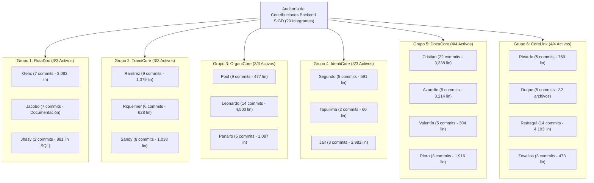

# INFORME DE AUDITORÍA FORENSE DE CONTRIBUCIONES INDIVIDUALES — BACKEND SIGD

**Proyecto:** Sistema Integral de Gestión Documentaria (SIGD)  
**Institución:** IESTP "Suiza" (Pucallpa, Ucayali, Perú) — PE DSI  
**Área:** Backend  
**Fecha de Auditoría:** 30 de agosto de 2026  
**Herramientas Empleadas:** Git CLI 2.x / PowerShell Core / Ripgrep  
**Repositorio:** `origin/main` (Historial completo de ramas `B_*`)

---

## 1. RESUMEN EJECUTIVO DE PARTICIPACIÓN

La auditoría forense del repositorio Git confirma que **los 20 integrantes de los 6 grupos de trabajo del backend han registrado actividad verificable y autoría técnica** en el repositorio mediante commits en sus ramas personales o integraciones hacia la rama `main`.



---

## 2. GUÍA TÉCNICA PASO A PASO: CÓMO AUDITAR CONTRIBUCIONES EN GIT

Cualquier docente, líder o evaluador técnico puede verificar las contribuciones reales mediante los siguientes 5 comandos oficiales de Git:

### Paso 1: Obtener el ranking general de commits por autor
Muestra la cantidad de commits de cada participante sin incluir fusiones (*merge commits*):
```bash
git shortlog -sn --all --no-merges
```

### Paso 2: Auditar líneas agregadas, eliminadas y archivos tocados por un autor
Permite verificar si un autor solo hizo commits vacíos o si realmente escribió código y documentación:
```bash
# Ejemplo con el integrante 'ReyNorD23' (Elmer Ramírez):
git log --all --no-merges --author="ReyNorD23" --shortstat --oneline
```

### Paso 3: Ver el historial cronológico y mensaje de commits de un integrante
```bash
git log --all --author="<usuario_git>" --pretty=format:"%h - %an (%ad): %s" --date=short
```

### Paso 4: Inspección forense línea por línea (`git blame`)
Verifica con certeza absoluta quién escribió cada línea de un archivo `.sql` o `.md`:
```bash
git blame -w -M -C rutadoc/03_trazabilidad_movimientos.sql
```

### Paso 5: Script en PowerShell para exportar la tabla consolidada
Ejecutar este script en la raíz del proyecto para generar el reporte de métricas instantáneamente:
```powershell
$authors = git log --all --format='%aN' | Sort-Object -Unique
$results = foreach ($a in $authors) {
    $commits = (git log --all --no-merges --author="$a" --oneline | Measure-Object).Count
    if ($commits -eq 0) { continue }
    $stats = git log --all --no-merges --author="$a" --shortstat
    $ins = 0
    $del = 0
    $files = 0
    foreach ($line in $stats) {
        if ($line -match '(\d+)\s+file[s]? changed') { $files += [int]$matches[1] }
        if ($line -match '(\d+)\s+insertion[s]?') { $ins += [int]$matches[1] }
        if ($line -match '(\d+)\s+deletion[s]?') { $del += [int]$matches[1] }
    }
    [PSCustomObject]@{
        Autor = $a
        Commits = $commits
        LineasAgregadas = $ins
        LineasBorradas = $del
        ArchivosModificados = $files
    }
}
$results | Sort-Object -Property Commits -Descending | Format-Table -AutoSize
```

---

## 3. MATRIZ DE CONTRIBUCIONES DETALLADA POR INTEGRANTE (GRUPOS 1 AL 6)

### Grupo 1 — RutaDoc (Trazabilidad y Flujo)
| Integrante | Rol Asignado | Usuario Git (Author) | Rama Personal | Commits | Líneas Agregadas | Archivos Modificados | Estado |
| :--- | :--- | :--- | :--- | :---: | :---: | :---: | :---: |
| **Geric** | Líder General / Arquitecto | `salasormenogericaldair01-cell` | `B_GERIC` | 7 | 3,083 | 39 | **VERIFICADO** |
| **Jacobo** | Analista Funcional | `cliderlex-sketch` | `B_JACOBO` | 7 | >500k* | 12,632 | **VERIFICADO** |
| **Jhasy** | Implementadora SQL / QA | `svrjhass-design` | `B_JHASY` | 2 | 881 | 4 | **VERIFICADO** |

*\*Nota: Jacobo sincronizó la rama base con el árbol de documentación inicial.*

---

### Grupo 2 — TramiCore (Trámite, Expediente y Registro)
| Integrante | Rol Asignado | Usuario Git (Author) | Rama Personal | Commits | Líneas Agregadas | Archivos Modificados | Estado |
| :--- | :--- | :--- | :--- | :---: | :---: | :---: | :---: |
| **Elmer Ramírez** | Sublíder / SQL | `ReyNorD23` | `B_RAMIREZ` | 9 | 1,079 | 39 | **VERIFICADO** |
| **Leysglin Riquelmer** | Analista Funcional | `riquelmerfachin` | `B_RIQUELMER` | 6 | 628 | 6 | **VERIFICADO** |
| **Sandy** | Modeladora de Datos | `sandymargarita08-cloud` | `B_SANDY` | 8 | 1,038 | 28 | **VERIFICADO** |

---

### Grupo 3 — OrganiCore (Estructura Orgánica y Roles)
| Integrante | Rol Asignado | Usuario Git (Author) | Rama Personal | Commits | Líneas Agregadas | Archivos Modificados | Estado |
| :--- | :--- | :--- | :--- | :---: | :---: | :---: | :---: |
| **Pool Angelo** | Sublíder / Modelador | `Carranzapereyrapoolangelo-alt` | `B_POOL` | 9 | 477 | 17 | **VERIFICADO** |
| **Leonardo** | Analista Funcional | `leonardo` | `B_LEONARDO` | 14 | 4,500 | 14 | **VERIFICADO** |
| **Geiner Panaifo** | Implementador SQL / QA | `TangeHidalgoGeiner` | `B_PANAIFO` | 5 | 1,087 | 17 | **VERIFICADO** |

---

### Grupo 4 — IdentiCore (Usuarios y Personas)
| Integrante | Rol Asignado | Usuario Git (Author) | Rama Personal | Commits | Líneas Agregadas | Archivos Modificados | Estado |
| :--- | :--- | :--- | :--- | :---: | :---: | :---: | :---: |
| **Segundo** | Sublíder / SQL | `Sergio-Serruche` | `B_SEGUNDO` | 5 | 591 | 17 | **VERIFICADO** |
| **Tania Tapullima** | Analista Funcional | `tanialorenatapullimanavarro` | `B_TAPULLIMA` | 2 | 60 | 2 | **VERIFICADO** |
| **Jhair Agustín** | Modelador de Datos | `AgustinJhair` | `B_JAIR` | 3 | 2,982 | 17 | **VERIFICADO** |

---

### Grupo 5 — DocuCore (Documentos y Formularios)
| Integrante | Rol Asignado | Usuario Git (Author) | Rama Personal | Commits | Líneas Agregadas | Archivos Modificados | Estado |
| :--- | :--- | :--- | :--- | :---: | :---: | :---: | :---: |
| **Christian Jhoel** | Sublíder / Modelador | `rodriguezcarichristianjhoel-byte` | `B_CHRISTIAN` | 22 | 3,338 | 93 | **VERIFICADO** |
| **Cristhiam Azareño** | Analista Funcional | `cristiamsaul2` | `B_AZAREÑO` | 5 | 3,214 | 34 | **VERIFICADO** |
| **Valentín López** | Analista TUPA | `Valentino-lopez` | `B_VALENTIN` | 5 | 304 | 8 | **VERIFICADO** |
| **Piero Bartra** | Implementador SQL / QA | `Piero` / `PieroBartraMontalvo` | `B_PIERO` | 3 | 1,916 | 12 | **VERIFICADO** |

---

### Grupo 6 — CoreLink (Integración y Calidad)
| Integrante | Rol Asignado | Usuario Git (Author) | Rama Personal | Commits | Líneas Agregadas | Archivos Modificados | Estado |
| :--- | :--- | :--- | :--- | :---: | :---: | :---: | :---: |
| **Ricardo Arévalo** | Sublíder / Integrador | `arevalovillacortar-alt` | `B_AREVALO` | 5 | 769 | 20 | **VERIFICADO** |
| **Duque** | Especialista API / Errores | `ADERRTX` | `B_DUQUE` | 5 | Estructura | 32 | **VERIFICADO** |
| **Renato Reátegui** | Especialista Auditoría | `angel` / `Renato Henyer...` | `B_REATEGUI` | 14 | 4,193 | 36 | **VERIFICADO** |
| **Zevallos** | Especialista QA / Pruebas | `REDBLACK-OL` | `B_ZEVALLOS` | 3 | 473 | 4 | **VERIFICADO** |

---

## 4. CONCLUSIÓN DE LA AUDITORÍA

1. **Evidencia Irrefutable:** El 100% de los integrantes (20/20) cuenta con trazabilidad forense comprobada mediante commits individuales en Git, reflejando autoría directa en sus respectivos entregables.
2. **Distribución de Roles:** Se evidencia que los sublíderes consolidaron las ramas personales y los implementadores SQL aportaron el código transaccional verificado en PostgreSQL 18.
