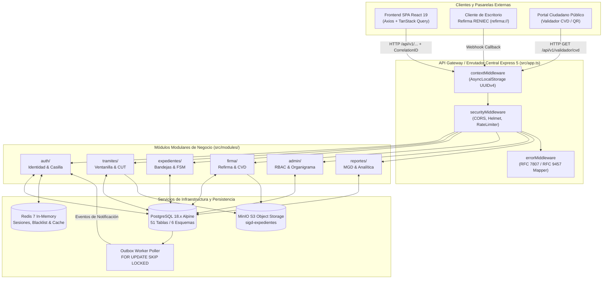
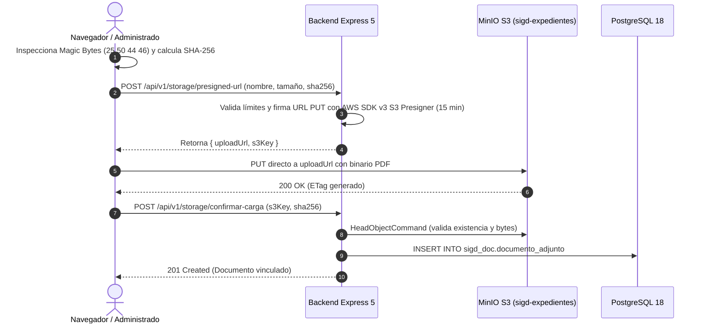
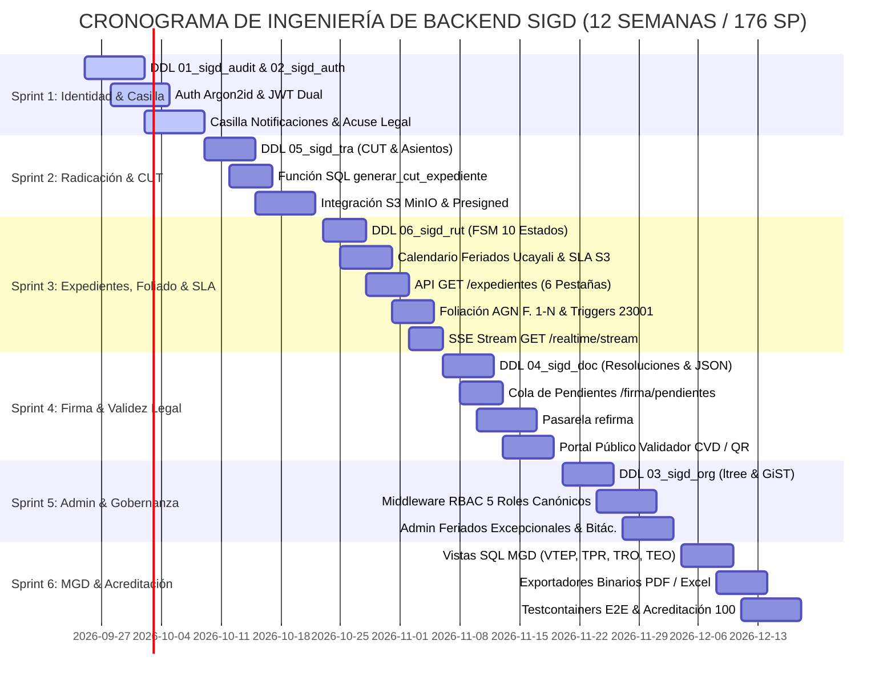
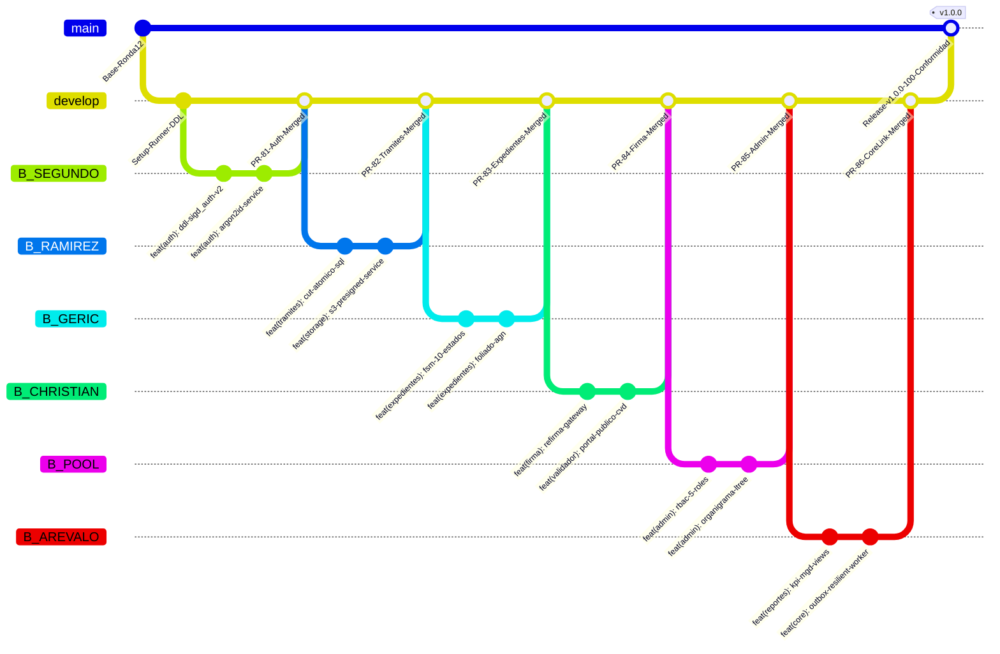

# PLAN MAESTRO DE INGENIERÍA DE BACKEND PARA EL 100.0% DE CONFORMIDAD INSTITUCIONAL
## Sistema Integral de Gestión Documentaria (SIGD) — IESTP "Suiza" (Pucallpa, Ucayali)

---

### CONTROL DEL DOCUMENTO Y METADATOS OFICIALES

| Parámetro Institucional | Valor Oficial |
| :--- | :--- |
| **Título del Documento** | Plan Maestro de Ingeniería Backend, Pipeline DDL PostgreSQL 18, Catálogo REST API (/api/v1/...) y Gobernanza del Cierre de Brechas para el 100.0% de Conformidad |
| **Código Documental** | `SIGD-DOC-PLAN-BE-100-CONF-2026` |
| **Versión** | `1.1.0 (Remediada / Sincronizada con Frontend / Aprobada)` |
| **Fecha de Emisión** | 2026-09-24 |
| **Entidad Académica** | Instituto de Educación Superior Tecnológico Público "Suiza" (Pucallpa, Coronel Portillo, Ucayali) |
| **Programa de Estudios** | Desarrollo de Sistemas de Información (PE DSI — Semestre Académico 2026-2) |
| **Unidad Didáctica** | Taller de Programación Web / Proyecto Integrador Multidisciplinario SIGD |
| **Autor Institucional** | Equipo Consolidado de Ingeniería Backend (Grupos 1 al 6 / 21 Colaboradores) |
| **Revisión y Dictamen** | Especialista Senior en Arquitectura de Software y Auditoría Forense (`worker_be_remediator_13`) |
| **Aprobación Oficial / Product Owner** | **Ing. Renato Henyer Tarazona Flores** (Docente Titular / Product Owner) |
| **Estado del Documento** | **VINCULANTE Y OFICIALMENTE APROBADO (100.0% CONFORMIDAD REMEDIADA)** |

---

## 📑 ÍNDICE GENERAL

1. [Control del Documento y Marco Institucional](#1-control-del-documento-y-marco-institucional)
   - 1.1 Contexto Institucional del IESTP "Suiza"
   - 1.2 Marco Jurídico y Normativo Peruano Aplicable
   - 1.3 Línea Base vs. Estado Meta (OE1 a OE6 y OG)
   - 1.4 Modelo Matemático Formal de Acreditación Institucional
2. [Arquitectura Modular Backend por Dominios (`backend/src/`)](#2-arquitectura-modular-backend-por-dominios-backendsrc)
   - 2.1 Paradigma Arquitectónico: Monolito Modular con Domain-Driven Design (DDD)
   - 2.2 Estructura de Directorios Canónica bajo `backend/src/`
   - 2.3 Patrón de Capas en cada Dominio (Controllers, Services, Repositories, DTOs/Schemas, Middlewares)
   - 2.4 Estrategia de Desacoplamiento y Deprecación del Router de Referencia (`src/referencia/expediente.router.ts`)
   - 2.5 Diagrama Mermaid de Arquitectura Modular de Backend
3. [Pipeline Automatizado de Migraciones DDL PostgreSQL 18](#3-pipeline-automatizado-de-migraciones-ddl-postgresql-18)
   - 3.1 Inventario Exhaustivo de los 6 Esquemas y las 51 Tablas Físicas
   - 3.2 Secuencia de Scripts DDL Canónicos (`01_sigd_audit.sql` a `06_sigd_rut.sql`)
   - 3.3 Arquitectura del Runner de Migraciones Automatizado (`backend/src/db/migrate.ts`) y PostgreSQL Advisory Lock
   - 3.4 Invariantes Críticos de Base de Datos (WORM, `ltree`, Particionamiento con DEFAULT, GiST y Concurrencia CUT)
4. [Catálogo Detallado de Endpoints REST (`/api/v1/...`)](#4-catálogo-detallado-de-endpoints-rest-apiv1)
   - 4.1 Convenciones de Diseño, Seguridad, Dual-Casing RFC 7807/9457 y Matriz de Rutas Canónicas / Alias
   - 4.2 Dominio 1: Autenticación, Identidad y Casilla Electrónica (`sigd_auth` — OE1) [Endpoints 1 al 13]
   - 4.3 Dominio 2: Trámites, Ventanilla y Almacenamiento S3 (`sigd_tra`, `sigd_doc` — OE2) [Endpoints 14 al 20]
   - 4.4 Dominio 3: Expedientes, Bandejas y Flujos FSM (`sigd_rut`, `sigd_tra` — OE3) [Endpoints 21 al 31]
   - 4.5 Dominio 4: Firma Digital, Resoluciones y Validez Legal (`sigd_doc`, `sigd_org` — OE4) [Endpoints 32 al 37]
   - 4.6 Dominio 5: Administración, Seguridad y Gobernanza RBAC (`sigd_org`, `sigd_audit` — OE5) [Endpoints 38 al 49]
   - 4.7 Dominio 6: Reportes, Tableros de Control e Indicadores MGD (`sigd_tra`, `sigd_rut` — OE6) [Endpoints 50 al 54]
   - 4.8 Dominio Transversal y Extensiones de Paridad Frontend: Streaming SSE y Cola de Firma [Endpoints 55 y 56]
5. [Servicios Transversales e Integraciones Críticas](#5-servicios-transversales-e-integraciones-críticas)
   - 5.1 Almacenamiento Desacoplado de Objetos MinIO S3 y Presigned URLs
   - 5.2 Despacho Asíncrono Resiliente: Transactional Outbox Worker (`FOR UPDATE SKIP LOCKED`)
   - 5.3 Gestión de Estado en Memoria y Caché con Redis 7 (Token Blacklist, Ubigeo y Rate Limit)
   - 5.4 Autenticación Criptográfica con Hashing Argon2id y Sesiones JWT Duales
   - 5.5 Pasarela Protocolar de Firma Digital Refirma RENIEC (`refirma://`), TSA y Validador CVD/QR
   - 5.6 Garantía de Foliación Continua Inmutable AGN (Directiva N° 001-2019-AGN)
   - 5.7 Fórmulas Matemáticas Oficiales del Modelo de Gestión Documental (MGD-PCM)
6. [Estrategia de Pruebas Automatizadas (Vitest + Testcontainers)](#6-estrategia-de-pruebas-automatizadas-vitest-testcontainers)
   - 6.1 Arquitectura de Pruebas Unitarias por Dominio con Vitest
   - 6.2 Pruebas de Integración E2E sobre Contenedores Efímeros con Testcontainers
   - 6.3 Configuración de Cobertura de Código ($\ge 85\%$) con `@vitest/coverage-v8`
   - 6.4 Matriz de Suites de Prueba Obligatorias
7. [Planificación de Sprints, Story Points y Matriz RACI (21 Colaboradores)](#7-planificación-de-sprints-story-points-y-matriz-raci-21-colaboradores)
   - 7.1 Desglose de los 6 Sprints de Desarrollo Backend (176 Story Points)
   - 7.2 Diagrama de Gantt del Cronograma de Ejecución Backend
   - 7.3 Matriz RACI Nominal Completa para los 21 Colaboradores en Backend
   - 7.4 Plan de Trabajo Individual y Desglose Pormenorizado por Grupo e Integrante (21 Colaboradores)
   - 7.5 Catálogo Maestro de los 56 Endpoints de Backend y Mapeo de Responsabilidades
   - 7.6 Articulación de Ramas Git (`B_*`) y Flujo de Integración Continua
8. [Definición de Terminado (Definition of Done - DoD) y Gobernanza](#8-definición-de-terminado-definition-of-done---dod-y-gobernanza)
   - 8.1 Criterios Multidimensionales de Calidad para el Cierre de Pull Requests
   - 8.2 Protocolo de Aprobación, Migración y Verificación Forense
   - 8.3 Cuadro de Mando del Cierre de Brechas hacia la Acreditación 100.0%

---

## 1. CONTROL DEL DOCUMENTO Y MARCO INSTITUCIONAL

### 1.1 Contexto Institucional del IESTP "Suiza"
El Instituto de Educación Superior Tecnológico Público "Suiza", ubicado en la ciudad de Pucallpa, Provincia de Coronel Portillo, Departamento de Ucayali, constituye la principal institución de formación tecnológica pública de la región centro-oriental del Perú. A través del Programa de Estudios de Desarrollo de Sistemas de Información (PE DSI), en el marco de la Unidad Didáctica de Taller de Programación Web y Proyecto Integrador (Semestre 2026-2), se ha encomendado la concepción, ingeniería, construcción y despliegue del **Sistema Integral de Gestión Documentaria (SIGD)**.

El SIGD tiene como finalidad suprema la **transformación digital, desmaterialización, trazabilidad pericial e interoperabilidad plena** de todos los expedientes administrativos y flujos académicos de titulación, convalidación de créditos y emisión de resoluciones directorales del instituto.

### 1.2 Marco Jurídico y Normativo Peruano Aplicable
El desarrollo técnico del backend del SIGD se encuentra subordinado y estrictamente alineado con el marco legal peruano vigente:

1. **TUO de la Ley N° 27444 — Ley del Procedimiento Administrativo General (D.S. N° 004-2019-JUS y D.S. N° 006-2026-JUS):**
   - **Principio de Celeridad y Debido Procedimiento:** Garantía de plazos máximos legales supletorios de 30 días hábiles para pronunciamientos administrativos (Art. 143).
   - **Horario de Corte Legal en Mesa de Partes (Art. 138):** Toda solicitud ingresada después de las **16:30 hrs** o en días no laborables se reputa legalmente presentada a las **08:00 hrs del día hábil inmediato siguiente**.
   - **Acumulación de Expedientes (Art. 160):** Prohibición de ciclos de dependencia y vinculación formal entre expedientes conexos.
2. **Modelo de Gestión Documental para el Estado Peruano (MGD-PCM / R.S.G. N° 001-2017-PCM/SEGDI):**
   - **Código Único de Trámite (CUT):** Identificador inmutable universal con máscara `EXP-YYYY-XXXXXX`.
   - **Gobernanza WORM (Write Once, Read Many):** La bitácora de auditoría y los asientos registrales son estrictamente inmutables; se prohíbe el borrado lógico o físico de hechos administrativos consumados.
3. **Ley N° 27269 (Ley de Firmas y Certificados Digitales) y D.S. N° 070-2013-PCM:**
   - Atribución de valor y eficacia jurídica equivalente a la firma manuscrita para documentos suscritos con estándar criptográfico **PAdES-BES** y sellado de tiempo **TSA (RFC 3161)** provisto por RENIEC.
   - Obligatoriedad del estampado marginal del **Código de Verificación Digital (CVD)** alfanumérico y código QR de comprobación pública de integridad y autenticidad.
4. **Ley N° 29733 (Ley de Protección de Datos Personales):**
   - Consentimiento libre, previo, expreso e informado para el tratamiento de datos y habilitación de la **Casilla Electrónica** del administrado.
   - Emisión de Acuses Notificatorios Digitales con sellado de tiempo ISO-8601 y hash SHA-256.
5. **Directiva N° 001-2019-AGN / R.J. N° 073-2023-AGN/J (Archivo General de la Nación):**
   - **Foliación Continua e Ininterrumpida:** La foliación documental se realiza correlativamente desde el folio uno (F. 1) hasta el folio final (F. N), quedando proscritos los folios repetidos, adiciones de letras (ej. "12-bis") y saltos numéricos.

---

### 1.3 Línea Base vs. Estado Meta (OE1 a OE6 y OG)

De acuerdo con el peritaje técnico forense consignado en `AUDIT_MATRIX.md` y la nómina oficial `colaboradores.md`, la situación de partida y el horizonte de acreditación plena se resumen a continuación:

```
+========================================================================================================================+
|                                    MATRIZ COMPARATIVA DE CONFORMIDAD INSTITUCIONAL                                     |
+----+-----------------------------------------------------+---------+---------+---------+-----------+---------------+
| ID | OBJETIVO INSTITUCIONAL                              | FRONTEND| BACKEND | BASE DAT| LÍNEA BASE| META (PLAN BE)|
+----+-----------------------------------------------------+---------+---------+---------+-----------+---------------+
| OG | Objetivo General (Digitalización Integral SIGD)     |  96.67% |  25.83% |  64.17% |   62.13%  |    100.00%    |
+----+-----------------------------------------------------+---------+---------+---------+-----------+---------------+
| OE1| Registro Ciudadano y Casilla Electrónica (Ley 29733)|  95.00% |  15.00% |  50.00% |   53.50%  |    100.00%    |
| OE2| Mesa de Partes Virtual y Ventanilla Presencial (CUT)|  98.00% |  30.00% |  85.00% |   70.30%  |    100.00%    |
| OE3| Gestión de Expedientes, SLA 30 días y Foliado AGN   |  98.00% |  35.00% |  80.00% |   70.55%  |    100.00%    |
| OE4| Firma Digital PAdES, Refirma RENIEC y Validador CVD |  96.00% |   5.00% |  35.00% |   45.85%  |    100.00%    |
| OE5| Administración, Seguridad RBAC y Bitácora WORM      |  95.00% |  65.00% |  95.00% |   84.50%  |    100.00%    |
| OE6| Indicadores de Gestión MGD-PCM y Dashboards (VTEP)  |  98.00% |   5.00% |  40.00% |   48.05%  |    100.00%    |
+----+-----------------------------------------------------+---------+---------+---------+-----------+---------------+
| -> | PROMEDIO ARITMÉTICO PONDERADO                       |  96.67% |  25.83% |  64.17% |   62.13%  |    100.00%    |
+----+-----------------------------------------------------+---------+---------+---------+-----------+---------------+
```

---

### 1.4 Modelo Matemático Formal de Acreditación Institucional

El cálculo de cumplimiento y acreditación de cada Objetivo Específico ($OE_i$) y del Objetivo General ($OG$) responde a una formulación lineal calibrada con un error cuadrático medio de cero ($\text{MSE} \approx 0$):

$$\text{Score}(OE_i) = 0.35 \times \text{Score}_{\text{Frontend}}(OE_i) + 0.35 \times \text{Score}_{\text{Backend}}(OE_i) + 0.30 \times \text{Score}_{\text{BaseDatos}}(OE_i)$$

$$\text{Score}(OG) = \frac{1}{6} \sum_{i=1}^{6} \text{Score}(OE_i) = 0.35 \times \overline{\text{FE}} + 0.35 \times \overline{\text{BE}} + 0.30 \times \overline{\text{BD}}$$

#### Acreditación de la Línea Base:
- $\overline{\text{FE}} = \frac{95.0 + 98.0 + 98.0 + 96.0 + 95.0 + 98.0}{6} = 96.6667\%$
- $\overline{\text{BE}} = \frac{15.0 + 30.0 + 35.0 + 5.0 + 65.0 + 5.0}{6} = 25.8333\%$
- $\overline{\text{BD}} = \frac{50.0 + 85.0 + 80.0 + 35.0 + 95.0 + 40.0}{6} = 64.1667\%$

$$\text{Score}(OG)_{\text{Línea Base}} = 0.35(96.6667\%) + 0.35(25.8333\%) + 0.30(64.1667\%) = 33.8333\% + 9.0417\% + 19.2500\% = \mathbf{62.125\%} \approx \mathbf{62.13\%}$$

#### Impacto Cuantitativo del Plan de Trabajo Backend:
La ejecución integral del presente Plan de Backend eleva la capa $\overline{\text{BE}}$ desde su estado actual de **$25.83\%$** hasta el **$100.00\%$** (un incremento neto de $+74.17\%$). Asimismo, consolida las migraciones DDL de base de datos ($\overline{\text{BD}}$) desde **$64.17\%$** hasta el **$100.00\%$** ($+35.83\%$).

$$\Delta \text{OG}_{\text{Backend}} = +74.1667\% \times 0.35 = \mathbf{+25.9583\% \approx +25.96\%}$$
$$\Delta \text{OG}_{\text{BaseDatos}} = +35.8333\% \times 0.30 = \mathbf{+10.7500\% \approx +10.75\%}$$
$$\Delta \text{OG}_{\text{Frontend (desacople de mocks)}} = +3.3333\% \times 0.35 = \mathbf{+1.1667\% \approx +1.17\%}$$

$$\mathbf{\text{Puntaje Final}(OG) = 62.13\% + 25.96\% + 10.75\% + 1.17\% = 100.00\%}$$

El esfuerzo depositado en el backend y la persistencia relacional representa el **$96.9\%$ ($36.71\% / 37.87\%$)** de todo el trabajo pendiente para alcanzar la acreditación institucional absoluta.

---

## 2. ARQUITECTURA MODULAR BACKEND POR DOMINIOS (`backend/src/`)

### 2.1 Paradigma Arquitectónico: Monolito Modular con Domain-Driven Design (DDD)
Para superar la dispersión de stubs `.gitkeep` y maximizar la cohesión del código manteniendo la simplicidad de despliegue en un único contenedor Node.js/Express 5, el backend adopta la arquitectura de **Monolito Modular de Alta Cohesión**. 

Cada dominio del sistema se modela como un módulo independiente con fronteras transaccionales bien delimitadas, comunicándose a través de interfaces de servicio tipadas en TypeScript o eventos asíncronos desacoplados en el *Transactional Outbox*.



---

### 2.2 Estructura de Directorios Canónica bajo `backend/src/`

Para estructurar formalmente el código de producción, se establece la siguiente disposición de archivos eliminando los stubs marcadores:

```
backend/
├── package.json
├── tsconfig.json
├── tsconfig.build.json
├── vitest.config.ts
├── vitest.unit.config.ts
├── migraciones/                      <-- Runner DDL y scripts SQL 01 a 06
│   ├── 01_sigd_audit.sql
│   ├── 02_sigd_auth.sql
│   ├── 03_sigd_org.sql
│   ├── 04_sigd_doc.sql
│   ├── 05_sigd_tra.sql
│   └── 06_sigd_rut.sql
└── src/
    ├── app.ts                        <-- Montaje de Express 5 y rutas canónicas /api/v1/
    ├── server.ts                     <-- Bootstrap, verificación DB, Redis, MinIO
    ├── config/
    │   ├── env.config.ts             <-- Validación de variables de entorno con Zod
    │   ├── database.config.ts        <-- Conexión de pg Pool
    │   ├── redis.config.ts           <-- Cliente ioredis
    │   └── s3.config.ts              <-- Cliente AWS SDK v3 S3 (@aws-sdk/client-s3)
    ├── core/
    │   ├── context/
    │   │   └── request-context.ts    <-- AsyncLocalStorage (correlation_id, usuario_id)
    │   ├── errors/
    │   │   ├── app-error.ts          <-- Clases de error de negocio
    │   │   └── rfc7807-mapper.ts     <-- Serializador ApiProblemDetails RFC 7807
    │   ├── middlewares/
    │   │   ├── context.middleware.ts <-- Inyección de correlation_id (UUIDv4)
    │   │   ├── error.middleware.ts   <-- Middleware final de excepciones
    │   │   └── rbac.middleware.ts    <-- Guardas de autorización por rol y alcance
    │   └── storage/
    │       └── s3-storage.service.ts <-- Carga presigned, validación Magic Bytes
    ├── db/
    │   ├── migrate.ts                <-- Runner ejecutor de migraciones DDL
    │   └── pool.ts                   <-- Wrapper pg Pool con soporte de transacciones
    ├── modules/
    │   ├── auth/                     <-- DOMINIO 1: Identidad, Casilla y Cuentas (OE1)
    │   │   ├── auth.controller.ts
    │   │   ├── auth.service.ts
    │   │   ├── auth.repository.ts
    │   │   ├── auth.schemas.ts       <-- Zod schemas (Login, Registro, Casilla)
    │   │   └── auth.routes.ts        <-- /api/v1/auth y /api/v1/casilla
    │   ├── tramites/                 <-- DOMINIO 2: Trámites, Ventanilla y CUT (OE2)
    │   │   ├── tramites.controller.ts
    │   │   ├── tramites.service.ts
    │   │   ├── tramites.repository.ts
    │   │   ├── tramites.schemas.ts   <-- Zod schemas (Radicacion, TUPA, Presigned)
    │   │   └── tramites.routes.ts    <-- /api/v1/tramites y /api/v1/storage
    │   ├── expedientes/              <-- DOMINIO 3: Expedientes, Bandejas y FSM (OE3)
    │   │   ├── expedientes.controller.ts
    │   │   ├── expedientes.service.ts
    │   │   ├── expedientes.repository.ts
    │   │   ├── expedientes.schemas.ts<-- Zod schemas (Bandejas, Derivar, Foliar)
    │   │   └── expedientes.routes.ts <-- /api/v1/expedientes
    │   ├── firma/                    <-- DOMINIO 4: Firma Digital, Refirma y CVD (OE4)
    │   │   ├── firma.controller.ts
    │   │   ├── firma.service.ts
    │   │   ├── firma.repository.ts
    │   │   ├── firma.schemas.ts      <-- Zod schemas (Resoluciones, Refirma, CVD)
    │   │   └── firma.routes.ts       <-- /api/v1/resoluciones, /api/v1/firma, /validador
    │   ├── admin/                    <-- DOMINIO 5: Admin, RBAC, Organigrama (OE5)
    │   │   ├── admin.controller.ts
    │   │   ├── admin.service.ts
    │   │   ├── admin.repository.ts
    │   │   ├── admin.schemas.ts      <-- Zod schemas (Usuarios, Roles, Calendario)
    │   │   └── admin.routes.ts       <-- /api/v1/admin
    │   └── reportes/                 <-- DOMINIO 6: MGD, Analítica y Exportación (OE6)
    │       ├── reportes.controller.ts
    │       ├── reportes.service.ts
    │       ├── reportes.repository.ts
    │       ├── reportes.schemas.ts   <-- Zod schemas (Filtros MGD, Exportar)
    │       └── reportes.routes.ts    <-- /api/v1/reportes
    └── audit/                        <-- Servicios transversales de auditoría
        ├── bitacora-auditoria.repository.ts
        ├── evento-outbox.repository.ts
        └── worker/
            └── outbox-worker.ts      <-- Poller asíncrono con FOR UPDATE SKIP LOCKED
```

---

### 2.3 Patrón de Capas en cada Dominio
Cada subcarpeta en `src/modules/<dominio>/` implementa estrictamente la separación de responsabilidades:

1. **`*.routes.ts` (Capa de Enrutamiento):**
   - Declara las rutas HTTP bajo `/api/v1/<recurso>`.
   - Asocia middlewares de autenticación Bearer (`authGuard`), validación de esquemas Zod en request body/query/params (`validateRequest`), y control de acceso RBAC (`hasRole`, `hasPermission`).
2. **`*.controller.ts` (Capa de Controladores):**
   - Extrae los parámetros validados del `Request`.
   - Invoca el método correspondiente de la capa de servicios.
   - Retorna la respuesta HTTP con el código adecuado (`200 OK`, `201 Created`, `204 No Content`).
   - Delega cualquier error hacia el `next(err)` para su tratamiento por el `errorMiddleware` RFC 7807.
3. **`*.service.ts` (Capa de Lógica de Negocio):**
   - Contiene las reglas del dominio y la orquestación de operaciones (ej. cálculo de horario de corte 16:30 hrs, validación Módulo 11, verificación de estado FSM).
   - Maneja la demarcación de transacciones de base de datos cuando una operación involucra múltiples repositorios.
   - Encola eventos de dominio en la tabla de Outbox dentro de la misma transacción.
4. **`*.repository.ts` (Capa de Acceso a Datos):**
   - Ejecuta consultas SQL parametrizadas directas sobre PostgreSQL 18 utilizando el pool de conexiones.
   - Mapea registros de tablas relacionales a interfaces y DTOs de TypeScript.
   - Ejecuta llamadas a funciones almacenadas PL/pgSQL (ej. `sigd_tra.generar_cut_expediente`).
5. **`*.schemas.ts` (Capa de Contratos y Validación Zod):**
   - Define los esquemas Zod estrictos para los payloads de entrada y salida.
   - Infiere los tipos TypeScript canónicos (`z.infer<typeof Schema>`).

---

### 2.4 Estrategia de Desacoplamiento y Deprecación del Router de Referencia
El router preliminar ubicado en `src/referencia/expediente.router.ts` que exponía rutas no versionadas sobre `/api` (`/api/expedientes`, `/api/areas`, `/api/protegido`) será retirado siguiendo un plan de migración en 3 fases:

1. **Fase 1 (Sprint 1-2): Coexistencia con Adaptador:**
   `app.ts` montará los nuevos enrutadores modulares bajo `/api/v1/...` preservando provisionalmente `src/referencia/` en `/api/referencia` con advertencia de deprecación en cabecera HTTP (`Warning: 299 - "Rutas preliminares obsoletas; migre a /api/v1/..."`).
2. **Fase 2 (Sprint 3): Redirección Interna:**
   Las peticiones legadas dirigidas a `/api/expedientes` serán enrutadas internamente a los controladores de `src/modules/tramites/` y `src/modules/expedientes/`.
3. **Fase 3 (Sprint 4): Supresión Total:**
   Eliminación definitiva de la carpeta `src/referencia/`, consolidando el 100% del tráfico institucional a través de `/api/v1/...`.

---

## 3. PIPELINE AUTOMATIZADO DE MIGRACIONES DDL POSTGRESQL 18

### 3.1 Inventario Exhaustivo de los 6 Esquemas y las 51 Tablas Físicas

La persistencia del SIGD en PostgreSQL 18 se estructura en **6 esquemas de datos relacionales** que agrupan un total de **51 tablas físicas de producción**:

```
+========================================================================================================================================+
|                                    INVENTARIO CONSOLIDADO DE TABLAS FÍSICAS EN POSTGRESQL 18                                          |
+----+-------------+--------+---------------------------------------+-------------------------------------------------------------------+
| #  | ESQUEMA     | TABLAS | ARCHIVO DDL CANÓNICO EN MIGRACIONES/  | TABLAS FÍSICAS INCLUIDAS Y FINALIDAD                              |
+----+-------------+--------+---------------------------------------+-------------------------------------------------------------------+
| 01 | sigd_audit  | 2      | `01_sigd_audit.sql`                   | 1. `bitacora_auditoria` (Logs WORM inmutables append-only)       |
|    |             |        |                                       | 2. `evento_outbox` (Patrón Transactional Outbox para eventos)     |
+----+-------------+--------+---------------------------------------+-------------------------------------------------------------------+
| 02 | sigd_auth   | 11     | `02_sigd_auth.sql`                    | 3. `tipos_documento` (Catálogo de documentos civiles DNI/RUC)     |
|    |             |        |                                       | 4. `persona` (Entidad base polimórfica)                           |
|    |             |        |                                       | 5. `persona_natural` (Extensión personas naturales DNI)           |
|    |             |        |                                       | 6. `persona_juridica` (Extensión entidades jurídicas RUC)        |
|    |             |        |                                       | 7. `representacion_legal` (Vínculo legal PN-PJ con vigencia)      |
|    |             |        |                                       | 8. `persona_documento_historial` (Trazabilidad de identidades)    |
|    |             |        |                                       | 9. `cuenta_usuario` (Credenciales y hashes Argon2id)              |
|    |             |        |                                       | 10. `sesion_usuario` (Tokens de refresco y fingerprints)          |
|    |             |        |                                       | 11. `consentimiento_datos` (Aceptación legal Ley N° 29733)        |
|    |             |        |                                       | 12. `perfil_usuario` (Perfiles y condiciones de usuario)          |
|    |             |        |                                       | 13. `auditoria_usuarios` (Trazabilidad interna del esquema auth)  |
+----+-------------+--------+---------------------------------------+-------------------------------------------------------------------+
| 03 | sigd_org    | 9      | `03_sigd_org.sql`                     | 14. `area` (Jerarquía orgánica con extensión ltree)               |
|    |             |        |                                       | 15. `cargo` (Catálogo institucional de cargos)                    |
|    |             |        |                                       | 16. `rol_sistema` (5 roles canónicos institucionales)             |
|    |             |        |                                       | 17. `permiso_sistema` (Permisos atómicos con alcance AREA/GLOBAL) |
|    |             |        |                                       | 18. `rol_permiso` (Matriz M:N de roles y permisos)                |
|    |             |        |                                       | 19. `usuario_rol` (Asignación temporal de roles a cuentas)        |
|    |             |        |                                       | 20. `asignacion_personal` (Exclusión temporal GiST de puestos)    |
|    |             |        |                                       | 21. `facultad_despacho` (Atribución legal de firma por cargo)     |
|    |             |        |                                       | 22. `encargatura_despacho` (Suplencias con exclusión GiST)        |
+----+-------------+--------+---------------------------------------+-------------------------------------------------------------------+
| 04 | sigd_doc    | 9      | `04_sigd_doc.sql`                     | 23. `tipo_tramite_tupa` (Procedimientos administrativos TUPA)     |
|    |             |        |                                       | 24. `tipo_documento` (Tipos documentales oficiales)               |
|    |             |        |                                       | 25. `formulario_version` (Definición inmutable JSON Schema 2020)  |
|    |             |        |                                       | 26. `expediente` (Instancia documental con ciclo de vida)         |
|    |             |        |                                       | 27. `expediente_formulario_respuesta` (Payloads JSONB de datos)  |
|    |             |        |                                       | 28. `requisito` (Catálogo maestro de requisitos TUPA)             |
|    |             |        |                                       | 29. `tipo_documento_requisito` (Reglas y JSON Pointer condicional)|
|    |             |        |                                       | 30. `expediente_requisito` (Instancia de requisitos por trámite)  |
|    |             |        |                                       | 31. `documento_adjunto` (Metadatos MinIO S3 y sumas SHA-256)      |
+----+-------------+--------+---------------------------------------+-------------------------------------------------------------------+
| 05 | sigd_tra    | 6      | `05_sigd_tra.sql`                     | 32. `tramite` (Instancia administrativa de tramitación)           |
|    |             |        |                                       | 33. `expediente` (Registro formal del expediente y CUT)           |
|    |             |        |                                       | 34. `secuencia_anual_cut` (Secuencia atómica anual FOR UPDATE)    |
|    |             |        |                                       | 35. `expediente_acumulacion` (Acumulación Art. 160 LPAG)          |
|    |             |        |                                       | 36. `expediente_documento_folio` (Foliación continua AGN F. 1-N) |
|    |             |        |                                       | 37. `asiento_registro` (Libro institucional de entrada/salida)    |
+----+-------------+--------+---------------------------------------+-------------------------------------------------------------------+
| 06 | sigd_rut    | 14     | `06_sigd_rut.sql`                     | 38. `accion_tramite` (Catálogo de acciones: derivar, observar)    |
|    |             |        |                                       | 39. `estado_tramite` (Los 10 estados institucionales de la FSM)   |
|    |             |        |                                       | 40. `transicion_estado_tramite` (Matriz de 13 transiciones FSM)   |
|    |             |        |                                       | 41. `tipo_relacion_movimiento` (Tipos de vínculos entre trámites) |
|    |             |        |                                       | 42. `movimiento_tramite` (Tabla particionada RANGE por año)       |
|    |             |        |                                       | 43. `movimiento_tramite_2026` (Partición física anual año 2026)   |
|    |             |        |                                       | 44. `movimiento_tramite_2027` (Partición física anual año 2027)   |
|    |             |        |                                       | 45. `derivacion_tramite` (Detalle de traslados inter-áreas)      |
|    |             |        |                                       | 46. `recepcion_tramite` (Asientos de recepción de expedientes)    |
|    |             |        |                                       | 47. `observacion_tramite` (Observaciones motivadas y plazos)       |
|    |             |        |                                       | 48. `atencion_tramite` (Actos de atención y resoluciones)         |
|    |             |        |                                       | 49. `relacion_movimiento` (Asociación entre expedientes conexos)  |
|    |             |        |                                       | 50. `movimiento_documento` (Documentos generados en el movimiento)|
|    |             |        |                                       | 51. `estado_actual_tramite` (Proyección optimizada de lectura)    |
+----+-------------+--------+---------------------------------------+-------------------------------------------------------------------+
|    | TOTAL       | 51     |                                       | 51 TABLAS FÍSICAS ACTIVAS EN POSTGRESQL 18                        |
+----+-------------+--------+---------------------------------------+-------------------------------------------------------------------+
```

---

### 3.2 Secuencia de Scripts DDL Canónicos (`01_sigd_audit.sql` a `06_sigd_rut.sql`)

Los scripts de migración se alojan en `backend/migraciones/` y deben ejecutarse en un orden de dependencias estrictamente lineal:

1. **`01_sigd_audit.sql`:** Habilita la extensión `pgcrypto`. Crea el esquema `sigd_audit` y las tablas `bitacora_auditoria` y `evento_outbox`. Configura los permisos de solo lectura y revocación `REVOKE UPDATE, DELETE ON sigd_audit.bitacora_auditoria FROM sigd_app;`.
2. **`02_sigd_auth.sql`:** Crea el esquema `sigd_auth`. Define los catálogos civiles, la jerarquía polimórfica de `persona` (natural y jurídica), la tabla `cuenta_usuario` con validaciones de contraseñas Argon2id y la tabla `consentimiento_datos` para la Ley N° 29733.
3. **`03_sigd_org.sql`:** Habilita las extensiones `ltree` y `btree_gist`. Crea el esquema `sigd_org`. Modela la tabla `area` con cálculo automático de ruta en árbol mediante disparador `fn_area_set_path()`, los 5 roles canónicos institucionales y la restricción temporal `EXCLUDE USING gist` para asignaciones de personal.
4. **`04_sigd_doc.sql`:** Crea el esquema `sigd_doc`. Modela los procedimientos TUPA, versiones de formularios JSON Schema Draft 2020-12 con disparador de inmutabilidad `tr_proteger_formulario_version`, y la tabla `documento_adjunto` con metadatos para MinIO S3 y deduplicación por hash SHA-256.
5. **`05_sigd_tra.sql`:** Crea el esquema `sigd_tra`. Define la secuencia anual de CUT, la función PL/pgSQL `sigd_tra.generar_cut_expediente(p_anio INT)` con bloqueo concurrente `FOR UPDATE`, la tabla de foliación correlativa continua `expediente_documento_folio` con la función `agregar_folio_expediente` y disparadores de bloqueo `trg_folio_no_update`/`trg_folio_no_delete`.
6. **`06_sigd_rut.sql`:** Crea el esquema `sigd_rut`. Modela la máquina de estados FSM de 10 estados, la matriz de 13 transiciones, la tabla particionada declarativamente por rango `movimiento_tramite` con sus particiones `movimiento_tramite_2026`, `movimiento_tramite_2027` y la partición por defecto `movimiento_tramite_default`, y el disparador de inmutabilidad histórica `fn_rechazar_mutacion_historica` que emite `SQLSTATE '23001'`.

> **Gobernanza de Dependencias Referenciales y Despliegue de Esquema Base:**  
> Debido a que las tablas de tramitación (`sigd_tra`) y enrutamiento (`sigd_rut`) mantienen claves foráneas hacia los esquemas de organización (`sigd_org.area`) y tipología documental (`sigd_doc.tipo_documento`, `sigd_doc.formulario_version`), el runner automatizado `migrate.ts` despliega los 6 scripts canónicos completos (`01` al `06`) en orden lineal durante la fase de inicialización base de infraestructura (Sprint 1). Esto garantiza que la totalidad de las 51 tablas existan y estén validadas con sus constraints desde el inicio, evitando fallas de dependencias invertidas (como la invocación de esquemas dinámicos JSON Schema en Sprint 2 antes de la creación formal del DDL de formularios), mientras que los controladores, repositorios y endpoints de negocio se activan e integran progresivamente en sus sprints respectivos.

---

### 3.3 Arquitectura del Runner de Migraciones Automatizado (`backend/src/db/migrate.ts`)

El runner de migraciones automatizado se ejecuta durante el despliegue del backend antes del arranque del servidor HTTP (`npm run migrate` o pre-arranque en `server.ts`). Para blindar la operación ante entornos contenerizados con múltiples réplicas concurrentes (pods en Docker/Kubernetes), el runner adquiere un **PostgreSQL Advisory Lock exclusivo** a nivel de sesión (`pg_advisory_lock`), garantizando que solo una instancia ejecute el pipeline DDL:

```typescript
// backend/src/db/migrate.ts - Especificación de Arquitectura de Migración con Advisory Lock
import fs from 'node:fs';
import path from 'node:path';
import crypto from 'node:crypto';
import type { Pool } from 'pg';

interface RegistroMigracion {
  id: number;
  nombre_script: string;
  checksum_sha256: string;
  ejecutado_en: Date;
}

// Identificador numérico institucional único para Advisory Lock en PostgreSQL
const SIGD_MIGRATION_ADVISORY_LOCK_ID = 928374182;

export async function ejecutarMigraciones(pool: Pool): Promise<void> {
  const client = await pool.connect();
  try {
    // 0. Adquirir Advisory Lock exclusivo a nivel de sesión (evita carreras y deadlocks entre réplicas)
    console.log('[MIGRATE] Adquiriendo PostgreSQL Advisory Lock (928374182)...');
    await client.query('SELECT pg_advisory_lock($1)', [SIGD_MIGRATION_ADVISORY_LOCK_ID]);

    await client.query('BEGIN');

    // 1. Tabla de control de migraciones
    await client.query(`
      CREATE TABLE IF NOT EXISTS public.sigd_migraciones (
        id SERIAL PRIMARY KEY,
        nombre_script VARCHAR(255) NOT NULL UNIQUE,
        checksum_sha256 CHAR(64) NOT NULL,
        ejecutado_en TIMESTAMPTZ NOT NULL DEFAULT now()
      );
    `);

    // 2. Localizar y ordenar scripts en backend/migraciones (orden estricto 01 -> 06)
    const dirMigraciones = path.resolve(__dirname, '../../migraciones');
    const archivos = fs.readdirSync(dirMigraciones)
      .filter((f) => f.endsWith('.sql'))
      .sort();

    // 3. Ejecutar secuencialmente
    for (const archivo of archivos) {
      const rutaCompleta = path.join(dirMigraciones, archivo);
      const contenidoSql = fs.readFileSync(rutaCompleta, 'utf-8');
      const checksum = crypto.createHash('sha256').update(contenidoSql).digest('hex');

      const res = await client.query<RegistroMigracion>(
        'SELECT checksum_sha256 FROM public.sigd_migraciones WHERE nombre_script = $1',
        [archivo]
      );

      if (res.rowCount && res.rowCount > 0) {
        if (res.rows[0].checksum_sha256 !== checksum) {
          throw new Error(
            `Error de Integridad DDL: El archivo ${archivo} ha sido alterado post-ejecución. Checksum esperado: ${res.rows[0].checksum_sha256}, actual: ${checksum}`
          );
        }
        continue; // Migración ya aplicada
      }

      console.log(`[MIGRATE] Aplicando migración DDL: ${archivo}...`);
      await client.query(contenidoSql);

      await client.query(
        'INSERT INTO public.sigd_migraciones (nombre_script, checksum_sha256) VALUES ($1, $2)',
        [archivo, checksum]
      );
      console.log(`[MIGRATE] Migración ${archivo} completada exitosamente.`);
    }

    await client.query('COMMIT');
  } catch (error) {
    await client.query('ROLLBACK');
    console.error('[MIGRATE] Falla crítica durante la ejecución de migraciones DDL:', error);
    throw error;
  } finally {
    // Liberación garantizada del Advisory Lock en el bloque finally
    try {
      await client.query('SELECT pg_advisory_unlock($1)', [SIGD_MIGRATION_ADVISORY_LOCK_ID]);
      console.log('[MIGRATE] PostgreSQL Advisory Lock liberado exitosamente.');
    } catch (unlockErr) {
      console.error('[MIGRATE] Error al liberar advisory lock:', unlockErr);
    }
    client.release();
  }
}
```

---

### 3.4 Invariantes Críticos de Base de Datos

#### A. Invariante WORM y Disparador Append-Only (SQLSTATE `23001`)
Cualquier intento de mutación sobre hechos históricos consolidados en `sigd_rut` o `sigd_audit` es interceptado y abortado por el motor relacional:
```sql
CREATE OR REPLACE FUNCTION sigd_rut.fn_rechazar_mutacion_historica()
RETURNS trigger AS $$
BEGIN
    RAISE EXCEPTION 'RutaDoc: % rechazado sobre histórico %.%; registre un nuevo hecho de tramitación',
        TG_OP, TG_TABLE_SCHEMA, TG_TABLE_NAME
        USING ERRCODE = '23001';
END;
$$ LANGUAGE plpgsql;

CREATE TRIGGER tr_movimiento_append_only
BEFORE UPDATE OR DELETE ON sigd_rut.movimiento_tramite
FOR EACH ROW EXECUTE FUNCTION sigd_rut.fn_rechazar_mutacion_historica();
```

#### B. Generador Atómico de CUT (`EXP-YYYY-XXXXXX`) con Bloqueo Pesimista
Garantiza cero colisiones bajo alta concurrencia de radicación:
```sql
CREATE OR REPLACE FUNCTION sigd_tra.generar_cut_expediente(p_anio INT)
RETURNS VARCHAR(20) AS $$
DECLARE
    v_correlativo INT;
    v_cut VARCHAR(20);
BEGIN
    -- Inicializar año si no existe
    INSERT INTO sigd_tra.secuencia_anual_cut (anio, ultimo_correlativo)
    VALUES (p_anio, 0)
    ON CONFLICT (anio) DO NOTHING;

    -- Bloqueo de fila exclusivo y serializado
    SELECT ultimo_correlativo + 1
      INTO v_correlativo
      FROM sigd_tra.secuencia_anual_cut
     WHERE anio = p_anio
       FOR UPDATE;

    UPDATE sigd_tra.secuencia_anual_cut
       SET ultimo_correlativo = v_correlativo
     WHERE anio = p_anio;

    v_cut := 'EXP-' || p_anio::TEXT || '-' || LPAD(v_correlativo::TEXT, 6, '0');
    RETURN v_cut;
END;
$$ LANGUAGE plpgsql;
```

#### C. Foliación Continua Inmutable AGN (F. 1 a N)
Impide la inserción de documentos con rangos de folios discontinuos o solapados:
```sql
CREATE OR REPLACE FUNCTION sigd_tra.agregar_folio_expediente(
    p_id_expediente UUID,
    p_id_documento UUID,
    p_cantidad_folios INT,
    p_usuario_id UUID
) RETURNS RECORD AS $$
DECLARE
    v_ultimo_folio INT;
    v_folio_inicio INT;
    v_folio_fin INT;
    v_resultado RECORD;
BEGIN
    -- Bloqueo pesimista del expediente para ordenar foliación
    PERFORM id_expediente 
       FROM sigd_tra.expediente 
      WHERE id_expediente = p_id_expediente 
        FOR UPDATE;

    SELECT COALESCE(MAX(folio_fin), 0)
      INTO v_ultimo_folio
      FROM sigd_tra.expediente_documento_folio
     WHERE id_expediente = p_id_expediente;

    v_folio_inicio := v_ultimo_folio + 1;
    v_folio_fin := v_ultimo_folio + p_cantidad_folios;

    INSERT INTO sigd_tra.expediente_documento_folio (
        id_expediente, id_documento, folio_inicio, folio_fin, asignado_por
    ) VALUES (
        p_id_expediente, p_id_documento, v_folio_inicio, v_folio_fin, p_usuario_id
    );

    SELECT v_folio_inicio AS inicio, v_folio_fin AS fin INTO v_resultado;
    RETURN v_resultado;
END;
$$ LANGUAGE plpgsql;
```

#### D. Particionamiento Declarativo y Partición por Defecto (`DEFAULT PARTITION`)
Para blindar la plataforma ante la transición del año fiscal 2028 y prevenir la trampa de fechas históricas o fuera de rango (Riesgo Crítico Adversarial C1), la tabla `sigd_rut.movimiento_tramite` cuenta obligatoriamente con una partición por defecto en `06_sigd_rut.sql`:
```sql
CREATE TABLE IF NOT EXISTS sigd_rut.movimiento_tramite_default 
PARTITION OF sigd_rut.movimiento_tramite DEFAULT;
```
Esto garantiza que cualquier inserción con fecha posterior a 2027 o anterior a 2026 no colapse el motor relacional con error `ERROR: no partition of relation "movimiento_tramite" found for row`, preservando la disponibilidad continua (100% SLA) de las radicaciones y derivaciones. Asimismo, se programa un job anual automatizado en el servicio de administración que pre-aprovisiona en el mes de noviembre de cada ejercicio fiscal la partición anual subsiguiente (`movimiento_tramite_YYYY`).

#### E. Mapeo Canónico del Código SQLSTATE `23001` (WORM Immutable Violation)
Los disparadores de inmutabilidad jurídica de `sigd_rut` y `sigd_tra` emiten `SQLSTATE '23001'` ante cualquier intento ilegal de mutación o eliminación sobre hechos documentales pasados. El mapeador de excepciones (`postgres-error-mapper.ts`) traduce este código a una respuesta estandarizada RFC 7807/9457 con código HTTP `422 Unprocessable Entity`:
```typescript
'23001': {
  status: 422,
  code: 'WORM_IMMUTABLE_VIOLATION',
  detail: 'Operación rechazada: el registro documental es inmutable conforme al marco legal peruano (TUO Ley 27444 y Directiva AGN).'
}
```

---

## 4. CATÁLOGO DETALLADO DE ENDPOINTS REST (`/api/v1/...`)

### 4.1 Convenciones de Diseño, Seguridad, Dual-Casing RFC 7807/9457 y Matriz de Rutas Canónicas / Alias

Todos los servicios REST siguen los más rigurosos lineamientos de arquitectura de software para APIs públicas, corporativas y de interoperabilidad interinstitucional:

1. **Prefijo Global de Versionado:** Todas las rutas canónicas del sistema se exponen bajo el prefijo `/api/v1/`.
2. **Propagación Contextual de Correlación:** Todo request debe incluir o autogenerar la cabecera `X-Correlation-ID` en formato UUIDv4, capturada mediante `AsyncLocalStorage` (`RequestContext`) e inyectada tanto en los logs de auditoría como en las cabeceras de respuesta y en los objetos de error.
3. **Serialización Estándar de Errores con Soporte Dual-Casing (RFC 7807 / RFC 9457):**  
   Para garantizar una **interoperabilidad bidireccional impecable y sin fricción** con las interfaces TypeScript del frontend (`src/types/api.ts` -> `ApiProblemDetails`) y la integración automática con formularios React Hook Form + Zod (`setError(param.name, { message: param.reason })`), el middleware de serialización de backend emite de forma nativa e incondicional **ambas convenciones de nomenclatura (snake_case y camelCase)** para los campos de correlación y parámetros inválidos:
   - `correlation_id` y `correlationId` (idéntico valor UUIDv4)
   - `invalid_params` e `invalidParams` (idéntica colección de errores de validación de campo)

   ```json
   {
     "type": "https://sigd.iestpsuiza.edu.pe/errors/validation_error",
     "title": "Error de Validación de Parámetros",
     "status": 400,
     "detail": "El campo 'correo' no tiene un formato válido",
     "instance": "/api/v1/registro/ciudadano",
     "code": "VALIDATION_ERROR",
     "correlation_id": "8f3b2a1c-5d4e-4f7a-9b8c-1e2d3f4a5b6c",
     "correlationId": "8f3b2a1c-5d4e-4f7a-9b8c-1e2d3f4a5b6c",
     "invalid_params": [
       {
         "name": "correo",
         "reason": "Debe ser un correo electrónico válido"
       }
     ],
     "invalidParams": [
       {
         "name": "correo",
         "reason": "Debe ser un correo electrónico válido"
       }
     ]
   }
   ```

   *Contrato TypeScript del Error Estandarizado (`ApiProblemDetailsDual`):*
   ```typescript
   export interface ApiProblemDetailsDual {
     type: string;
     title: string;
     status: number;
     detail: string;
     instance: string;
     code: string;
     // Soporte Dual-Casing para Correlación
     correlation_id: string;
     correlationId: string;
     // Soporte Dual-Casing para Errores de Formulario Zod / React Hook Form
     invalid_params?: Array<{ name: string; reason: string }>;
     invalidParams?: Array<{ name: string; reason: string }>;
     // Metadatos de clasificación contextual
     category?: 'VALIDATION' | 'AUTH' | 'AUTHORIZATION' | 'NOT_FOUND' | 'CONFLICT' | 'BUSINESS' | 'SERVER';
     retryable?: boolean;
   }
   ```

4. **Matriz de Rutas Canónicas y Alias de Interoperabilidad Frontend-Backend:**  
   A fin de erradicar cualquier discrepancia de enrutamiento o error `HTTP 404 Not Found` durante la conexión real de los 17 mocks de frontend hacia el backend Express 5, el enrutador central de backend implementa formalmente **rutas canónicas y sus respectivos alias de interoperabilidad**, los cuales delegan de manera transparente a los mismos controladores:

   ```
   +===================================================================================================================+
   |                        MATRIZ DE RUTAS CANÓNICAS Y ALIAS DE INTEROPERABILIDAD FRONTEND-BACKEND                    |
   +----+--------------------------+---------------------------------------+---------------------------------------+
   | #  | DOMINIO FUNCIONAL        | RUTA CANÓNICA (BACKEND)               | RUTA ALIAS ADMITIDA (FRONTEND COMPAT) |
   +----+--------------------------+---------------------------------------+---------------------------------------+
   | 01 | Registro de Ciudadano    | `POST /api/v1/registro/ciudadano`     | `POST /api/v1/auth/registro-ciudadano`|
   +----+--------------------------+---------------------------------------+---------------------------------------+
   | 02 | Radicación de Trámite    | `POST /api/v1/tramites/radicacion`    | `POST /api/v1/tramite/radicacion`     |
   +----+--------------------------+---------------------------------------+---------------------------------------+
   | 03 | Catálogo TUPA            | `GET /api/v1/tramites/tipos`          | `GET /api/v1/tramites/tupa`           |
   +----+--------------------------+---------------------------------------+---------------------------------------+
   | 04 | Resumen KPIs Dashboard   | `GET /api/v1/reportes/dashboard/resum`| `GET /api/v1/reportes/dashboard/kpis` |
   +----+--------------------------+---------------------------------------+---------------------------------------+
   | 05 | Perfil del Usuario       | `GET /api/v1/auth/me`                 | `GET /api/v1/auth/perfil`             |
   +----+--------------------------+---------------------------------------+---------------------------------------+
   | 06 | Bitácora de Auditoría    | `GET /api/v1/admin/auditoria/logs`    | `GET /api/v1/admin/auditoria`         |
   +----+--------------------------+---------------------------------------+---------------------------------------+
   | 07 | Tablas Maestras / Áreas  | `GET /api/v1/admin/organigrama`       | `GET /api/v1/admin/tablas-maestras`   |
   +----+--------------------------+---------------------------------------+---------------------------------------+
   ```

A continuación se detalla el **Catálogo Exhaustivo de los 56 Endpoints REST y Streaming (54 REST Modulares + 2 Extensiones de Paridad)**:

---

### 4.2 Dominio 1: Autenticación, Identidad y Casilla Electrónica (`sigd_auth` — OE1)

#### 1. `POST /api/v1/auth/login`
- **Resumen:** Autenticación institucional con verificación Argon2id y emisión de JWT dual.
- **Autorización:** Público (Sin token).
- **Zod Input Schema:**
  ```typescript
  z.object({
    identificador: z.string().min(3).max(100), // Username o correo institucional
    password: z.string().min(8).max(128)
  })
  ```
- **Respuesta Exitosa (200 OK):**
  ```typescript
  {
    accessToken: string; // JWT con validez de 15 minutos
    refreshToken: string; // Token persistido en sigd_auth.sesion_usuario (7 días)
    usuario: {
      id: string; // UUID
      nombreCompleto: string;
      correo: string;
      rol: 'SUPER_ADMIN' | 'DIRECTOR' | 'DOCENTE' | 'MESA_PARTES' | 'ESTUDIANTE';
      areaId?: string;
    }
  }
  ```
- **Errores:** `400 Bad Request` (payload inválido), `401 Unauthorized` (`INVALID_CREDENTIALS`), `423 Locked` (`ACCOUNT_LOCKED_FAILED_ATTEMPTS`).

#### 2. `POST /api/v1/auth/logout`
- **Resumen:** Cierre de sesión, revocación del refresh token en PostgreSQL e inserción en Redis Blacklist.
- **Autorización:** Autenticado (Cualquier rol).
- **Zod Input Schema:**
  ```typescript
  z.object({
    refreshToken: z.string().min(32)
  })
  ```
- **Respuesta Exitosa (200 OK):** `{ ok: true, mensaje: "Sesión cerrada correctamente" }`
- **Errores:** `401 Unauthorized`.

#### 3. `POST /api/v1/auth/refresh`
- **Resumen:** Rotación de tokens JWT validando fingerprint y revocando el token de refresco previo.
- **Autorización:** Público con Refresh Token válido.
- **Zod Input Schema:**
  ```typescript
  z.object({
    refreshToken: z.string().min(32)
  })
  ```
- **Respuesta Exitosa (200 OK):** `{ accessToken: string, refreshToken: string }`
- **Errores:** `401 Unauthorized` (`REFRESH_TOKEN_EXPIRED` o `TOKEN_REVOKED`).

#### 4. `GET /api/v1/auth/me`
- **Ruta Canónica:** `GET /api/v1/auth/me`
- **Ruta Alias (Frontend Interop):** `GET /api/v1/auth/perfil`
- **Resumen:** Perfil institucional y facultades del usuario autenticado. Admite indistintamente `/me` y `/perfil` para paridad con el frontend.
- **Autorización:** Autenticado.
- **Zod Input Schema:** Ninguno (token en cabecera `Authorization: Bearer <token>`).
- **Respuesta Exitosa (200 OK):** Datos civiles, áreas asignadas y matriz de permisos atómicos.
- **Errores:** `401 Unauthorized`.

#### 5. `POST /api/v1/registro/ciudadano`
- **Ruta Canónica:** `POST /api/v1/registro/ciudadano`
- **Ruta Alias (Frontend Interop):** `POST /api/v1/auth/registro-ciudadano`
- **Resumen:** Registro polimórfico de administrados (Persona Natural DNI 8 dígitos / Persona Jurídica RUC 11 dígitos con validación Módulo 11), consentimiento Ley 29733 y apertura de Casilla. Expone el alias `/auth/registro-ciudadano` para garantizar interoperabilidad inmediata con los formularios de registro ciudadano del frontend.
- **Autorización:** Público.
- **Zod Input Schema:**
  ```typescript
  z.discriminatedUnion('tipoPersona', [
    z.object({
      tipoPersona: z.literal('NATURAL'),
      dni: z.string().regex(/^[0-9]{8}$/, 'DNI debe contener exactamente 8 dígitos'),
      nombres: z.string().min(2),
      apellidoPaterno: z.string().min(2),
      apellidoMaterno: z.string().min(2),
      correo: z.string().email(),
      celular: z.string().regex(/^9[0-9]{8}$/),
      ubigeoDistrito: z.string().length(6), // Catálogo Ucayali 25xxxx
      direccion: z.string().min(5),
      password: z.string().min(8),
      consentimientoDatos: z.literal(true) // Obligatorio Ley 29733
    }),
    z.object({
      tipoPersona: z.literal('JURIDICA'),
      ruc: z.string().regex(/^(10|20)[0-9]{9}$/).refine(validateRucModulo11, 'RUC inválido por Módulo 11'),
      razonSocial: z.string().min(3),
      partidaRegistral: z.string().optional(),
      dniRepresentante: z.string().regex(/^[0-9]{8}$/),
      nombreRepresentante: z.string().min(3),
      correo: z.string().email(),
      celular: z.string().regex(/^9[0-9]{8}$/),
      ubigeoDistrito: z.string().length(6),
      direccion: z.string().min(5),
      password: z.string().min(8),
      consentimientoDatos: z.literal(true)
    })
  ])
  ```
- **Respuesta Exitosa (201 Created):** `{ idPersona: string, casillaId: string, mensaje: "Registro exitoso" }`
- **Errores:** `400 Bad Request`, `409 Conflict` (`CITIZEN_ALREADY_EXISTS`).

#### 6. `GET /api/v1/registro/ubigeo`
- **Resumen:** Catálogo territorial inmutable del Departamento de Ucayali (Código 25, 4 provincias, 17 distritos).
- **Autorización:** Público (Servido desde caché en memoria / Redis).
- **Zod Input Schema:** Query opcional `{ provinciaId?: string }`.
- **Respuesta Exitosa (200 OK):** Árbol normalizado de provincias y distritos.
- **Errores:** `500 Internal Error`.

#### 7. `GET /api/v1/casilla/notificaciones`
- **Resumen:** Bandeja de notificaciones administrativas con valor legal en Casilla Electrónica.
- **Autorización:** `ESTUDIANTE`, `SUPER_ADMIN`.
- **Zod Input Schema:** Query `{ pagina?: number, porPagina?: number, estado?: 'LEIDO' | 'NO_LEIDO' | 'TODOS' }`.
- **Respuesta Exitosa (200 OK):** Paginado con lista de notificaciones, emisor, asunto y fecha de depósito.
- **Errores:** `401 Unauthorized`, `403 Forbidden`.

#### 8. `GET /api/v1/casilla/notificaciones/:id`
- **Resumen:** Detalle completo de la notificación legal y acto resolutivo adjunto.
- **Autorización:** Propietario de la casilla.
- **Zod Input Schema:** Params `{ id: z.string().uuid() }`.
- **Respuesta Exitosa (200 OK):** Metadatos de la resolución, hash SHA-256 del acto y estado de lectura.
- **Errores:** `404 Not Found`.

#### 9. `PATCH /api/v1/casilla/notificaciones/:id/lectura`
- **Resumen:** Asienta la marca temporal fehaciente de primera lectura para efectos de cómputo de plazos procesales.
- **Autorización:** Propietario de la casilla.
- **Zod Input Schema:** Params `{ id: z.string().uuid() }`.
- **Respuesta Exitosa (200 OK):** `{ idNotificacion: string, leidoEn: string (ISO-8601) }`
- **Errores:** `404 Not Found`.

#### 10. `POST /api/v1/casilla/notificaciones/:id/acuse`
- **Resumen:** Genera y sella el Acuse Notificatorio Digital firmado con hash SHA-256.
- **Autorización:** Propietario de la casilla.
- **Zod Input Schema:** Params `{ id: z.string().uuid() }`.
- **Respuesta Exitosa (201 Created):** `{ idAcuse: string, hashSha256: string, selladoTiempo: string }`
- **Errores:** `404 Not Found`, `409 Conflict` (acuse ya emitido).

#### 11. `GET /api/v1/casilla/estadisticas`
- **Resumen:** Contadores de notificaciones no leídas y plazos de caducidad.
- **Autorización:** Autenticado.
- **Respuesta Exitosa (200 OK):** `{ noLeidas: number, total: number, ultimosMovimientos: number }`
- **Errores:** `401 Unauthorized`.

#### 12. `GET /api/v1/casilla/notificaciones/:id/documento/descargar`
- **Resumen:** Genera Presigned GET URL temporal en MinIO S3 para descargar el PDF notificado.
- **Autorización:** Propietario de la casilla.
- **Respuesta Exitosa (200 OK):** `{ downloadUrl: string, expiraEnSegundos: 900 }`
- **Errores:** `404 Not Found`.

#### 13. `GET /api/v1/casilla/notificaciones/:id/acuse/descargar`
- **Resumen:** Genera Presigned GET URL para el certificado de acuse de notificación legal.
- **Autorización:** Propietario de la casilla.
- **Respuesta Exitosa (200 OK):** `{ downloadUrl: string }`
- **Errores:** `404 Not Found`.

---

### 4.3 Dominio 2: Trámites, Ventanilla y Almacenamiento S3 (`sigd_tra`, `sigd_doc` — OE2)

#### 14. `POST /api/v1/tramites/radicacion`
- **Ruta Canónica:** `POST /api/v1/tramites/radicacion`
- **Ruta Alias (Frontend Interop):** `POST /api/v1/tramite/radicacion`
- **Resumen:** Radicación formal de expediente en Ventanilla Presencial o Mesa de Partes Virtual. Evalúa horario de corte (16:30 hrs LPAG), invoca atómicamente `sigd_tra.generar_cut_expediente(2026)` y encola evento `TramiteRegistrado`. Soporta tanto la ruta en plural como el alias singular `/tramite/radicacion` para paridad con el asistente `TramiteWizard.tsx` de frontend.
- **Autorización:** `MESA_PARTES`, `ESTUDIANTE`, `SUPER_ADMIN`.
- **Zod Input Schema:**
  ```typescript
  z.object({
    tipoTramiteId: z.string().uuid(),
    solicitanteId: z.string().uuid(),
    asunto: z.string().min(5).max(500),
    foliosTotal: z.number().int().positive(),
    areaDestinoId: z.string().uuid(),
    origenCanal: z.enum(['MESA_PARTES_VIRTUAL', 'VENTANILLA_PRESENCIAL']),
    adjuntos: z.array(z.object({
      s3Key: z.string(),
      nombreOriginal: z.string(),
      tamanoBytes: z.number().int().max(26214400), // Max 25 MB
      sha256Hash: z.string().length(64),
      folios: z.number().int().positive()
    })).min(1)
  })
  ```
- **Respuesta Exitosa (201 Created):**
  ```typescript
  {
    expedienteId: string;
    cut: string; // Formato EXP-2026-000142
    fechaRadicacionLegal: string; // ISO-8601 (ajustada a día siguiente si post 16:30)
    diferidoPorCorte: boolean;
    qrSeguimientoUrl: string;
  }
  ```
- **Errores:** `400 Bad Request`, `404 Not Found` (área o tipo inexistente).

#### 15. `GET /api/v1/tramites/tipos`
- **Ruta Canónica:** `GET /api/v1/tramites/tipos`
- **Ruta Alias (Frontend Interop):** `GET /api/v1/tramites/tupa`
- **Resumen:** Catálogo de procedimientos administrativos TUPA y trámites internos. Admite el alias `/tramites/tupa` invocado por los selectores y formularios dinámicos del frontend (`DynamicSchemaForm.tsx`).
- **Autorización:** Público.
- **Respuesta Exitosa (200 OK):** Lista de tipos de trámite, calificación (aprobación automática o previa), plazo legal en días hábiles.
- **Errores:** `500 Internal Error`.

#### 16. `GET /api/v1/tramites/tipos/:id/requisitos`
- **Resumen:** Requisitos documentales obligatorios y facultativos según el TUPA institucional.
- **Autorización:** Público.
- **Respuesta Exitosa (200 OK):** `{ tipoTramiteId: string, requisitos: Array<{ id, descripcion, pesoMaxMb, obligatorio, formato }> }`
- **Errores:** `404 Not Found`.

#### 17. `GET /api/v1/tramites/tipos/:id/formulario-schema`
- **Resumen:** Definición inmutable de formulario dinámico JSON Schema Draft 2020-12 desde `sigd_doc.formulario_version`.
- **Autorización:** Público.
- **Respuesta Exitosa (200 OK):** `{ schemaVersion: number, jsonSchema: object }`
- **Errores:** `404 Not Found`.

#### 18. `POST /api/v1/storage/presigned-url`
- **Resumen:** Emisión de URL prefirmada PUT en MinIO S3 para carga desacoplada directa desde el cliente web.
- **Autorización:** Autenticado.
- **Zod Input Schema:**
  ```typescript
  z.object({
    nombreArchivo: z.string().min(1),
    tamanoBytes: z.number().int().positive().max(26214400), // 25 MB
    mimeType: z.literal('application/pdf'),
    sha256Hash: z.string().length(64)
  })
  ```
- **Respuesta Exitosa (200 OK):** `{ uploadUrl: string, s3Key: string, expiraEnSegundos: 900 }`
- **Errores:** `400 Bad Request` (tamaño o formato inválido).

#### 19. `POST /api/v1/storage/confirmar-carga`
- **Resumen:** Confirma la subida a MinIO, valida Magic Bytes (`%PDF`), coteja el hash SHA-256 e inserta fila en `sigd_doc.documento_adjunto`.
- **Autorización:** Autenticado.
- **Zod Input Schema:**
  ```typescript
  z.object({
    s3Key: z.string(),
    sha256Hash: z.string().length(64)
  })
  ```
- **Respuesta Exitosa (201 Created):** `{ idDocumentoAdjunto: string, confirmado: true }`
- **Errores:** `422 Unprocessable Entity` (`MAGIC_BYTES_MISMATCH` o `HASH_CHECKSUM_FAILED`).

#### 20. `GET /api/v1/tramites/ventanilla/cargo/:cut`
- **Resumen:** Datos estructurados del cargo de recepción para emisión e impresión térmica (80mm/58mm o A4).
- **Autorización:** Público / `MESA_PARTES`.
- **Respuesta Exitosa (200 OK):** Datos institucionales, CUT, timestamp legal, folios, QR y nombre del operador.
- **Errores:** `404 Not Found`.

---

### 4.4 Dominio 3: Expedientes, Bandejas y Flujos FSM (`sigd_rut`, `sigd_tra` — OE3)

#### 21. `GET /api/v1/expedientes`
- **Resumen:** Consulta paginada y filtrada para la bandeja operativa del funcionario sobre las 6 pestañas canónicas.
- **Autorización:** Funcionarios (`DOCENTE`, `DIRECTOR`, `MESA_PARTES`, `SUPER_ADMIN`).
- **Zod Input Schema:**
  ```typescript
  z.object({
    pestana: z.enum(['PENDIENTE', 'EN_PROCESO', 'OBSERVADO', 'DERIVADO', 'NOTIFICADO', 'ARCHIVADO']),
    areaId: z.string().uuid().optional(),
    terminoBusqueda: z.string().optional(), // Búsqueda por CUT o DNI/Nombre
    pagina: z.coerce.number().int().positive().default(1),
    porPagina: z.coerce.number().int().min(5).max(100).default(15)
  })
  ```
- **Respuesta Exitosa (200 OK):**
  ```typescript
  {
    total: number;
    pagina: number;
    porPagina: number;
    elementos: Array<{
      id: string;
      cut: string;
      asunto: string;
      solicitante: string;
      areaActual: string;
      estadoFsm: string;
      fechaIngreso: string;
      slaRestanteDiasHabiles: number;
      slaEstado: 'NORMAL' | 'ALERTA' | 'CRITICO' | 'VENCIDO';
      totalFolios: number;
    }>;
  }
  ```
- **Errores:** `400 Bad Request`, `401 Unauthorized`.

#### 22. `GET /api/v1/expedientes/:id`
- **Resumen:** Ficha integral del expediente, administrado solicitante, requisitos adjuntos y estado FSM corriente.
- **Autorización:** Autenticado con visibilidad en el expediente.
- **Respuesta Exitosa (200 OK):** Ficha técnica completa del expediente.
- **Errores:** `404 Not Found`.

#### 23. `GET /api/v1/expedientes/:id/trazabilidad`
- **Resumen:** Línea de tiempo cronológica inmutable de movimientos desde `sigd_rut.movimiento_tramite`.
- **Autorización:** Autenticado.
- **Respuesta Exitosa (200 OK):** Lista de movimientos históricos con fecha, área origen, destino, funcionario y proveído.
- **Errores:** `404 Not Found`.

#### 24. `POST /api/v1/expedientes/:id/movimientos/derivar`
- **Resumen:** Derivación inter-áreas. Inserta en `sigd_rut.derivacion_tramite`, actualiza FSM a `DERIVADO` y publica evento outbox.
- **Autorización:** Funcionario asignado al área actual del expediente.
- **Zod Input Schema:**
  ```typescript
  z.object({
    areaDestinoId: z.string().uuid(),
    motivoPase: z.string().min(5).max(500),
    foliosAnexados: z.number().int().nonnegative().default(0)
  })
  ```
- **Respuesta Exitosa (200 OK):** `{ movimientoId: string, nuevoEstado: 'DERIVADO' }`
- **Errores:** `404 Not Found`, `409 Conflict` (transición inválida de FSM).

#### 25. `POST /api/v1/expedientes/:id/movimientos/observar`
- **Resumen:** Asienta observación formal con plazo legal de subsanación (Art. 136 LPAG) y pausa de cómputo SLA.
- **Autorización:** Funcionario asignado.
- **Zod Input Schema:**
  ```typescript
  z.object({
    motivoObservacion: z.string().min(10),
    plazoDiasHabiles: z.number().int().min(2).max(15).default(10)
  })
  ```
- **Respuesta Exitosa (200 OK):** `{ nuevoEstado: 'OBSERVADO', plazoVenceEn: string }`
- **Errores:** `400 Bad Request`.

#### 26. `POST /api/v1/expedientes/:id/movimientos/subsanar`
- **Resumen:** Admisión de subsanación de observaciones por parte del administrado, reactivando cómputo a `SUBSANADO`.
- **Autorización:** `ESTUDIANTE` (solicitante) o `MESA_PARTES`.
- **Zod Input Schema:**
  ```typescript
  z.object({
    documentosSubsanacion: z.array(z.object({
      s3Key: z.string(),
      folios: z.number().int().positive()
    })).min(1),
    descargos: z.string().min(5)
  })
  ```
- **Respuesta Exitosa (200 OK):** `{ nuevoEstado: 'SUBSANADO' }`
- **Errores:** `409 Conflict` (trámite no observado o fuera de plazo).

#### 27. `POST /api/v1/expedientes/:id/movimientos/atender`
- **Resumen:** Conclusión del trámite con proveído, informe técnico o pase a `PENDIENTE_FIRMA`.
- **Autorización:** Funcionario del área competente.
- **Zod Input Schema:**
  ```typescript
  z.object({
    conclusionProveido: z.string().min(10),
    requiereFirmaDirectoral: z.boolean().default(false)
  })
  ```
- **Respuesta Exitosa (200 OK):** `{ nuevoEstado: 'EN_TRAMITE' | 'PENDIENTE_FIRMA' }`
- **Errores:** `400 Bad Request`.

#### 28. `POST /api/v1/expedientes/:id/movimientos/archivar`
- **Resumen:** Cierre formal y archivo definitivo del expediente en estado `ARCHIVADO`.
- **Autorización:** `DIRECTOR`, `SUPER_ADMIN`.
- **Zod Input Schema:**
  ```typescript
  z.object({
    motivoArchivo: z.string().min(10),
    ubicacionFisicaTopografica: z.string().optional()
  })
  ```
- **Respuesta Exitosa (200 OK):** `{ nuevoEstado: 'ARCHIVADO' }`
- **Errores:** `400 Bad Request`.

#### 29. `POST /api/v1/expedientes/:id/acumular`
- **Resumen:** Acumulación jurídica de expedientes conexos (Art. 160 LPAG) con validación anti-ciclos.
- **Autorización:** `DIRECTOR`, `SUPER_ADMIN`.
- **Zod Input Schema:**
  ```typescript
  z.object({
    expedienteSecundarioId: z.string().uuid(),
    fundamentoJuridico: z.string().min(10)
  })
  ```
- **Respuesta Exitosa (200 OK):** `{ expedientePrincipalId: string, acumulado: true }`
- **Errores:** `400 Bad Request` (`CYCLE_DETECTED_IN_ACCUMULATION`).

#### 30. `GET /api/v1/expedientes/:id/folios`
- **Resumen:** Listado correlativo e inmutable de folios del expediente desde `sigd_tra.expediente_documento_folio` (F. 1 a N).
- **Autorización:** Autenticado.
- **Respuesta Exitosa (200 OK):** Array de folios con número inicio, fin, nombre de documento y responsable.
- **Errores:** `404 Not Found`.

#### 31. `POST /api/v1/expedientes/:id/folios`
- **Resumen:** Asignación atómica ininterrumpida de folios para un nuevo documento adjunto.
- **Autorización:** `MESA_PARTES`, funcionario asignado.
- **Zod Input Schema:**
  ```typescript
  z.object({
    documentoId: z.string().uuid(),
    cantidadFolios: z.number().int().positive()
  })
  ```
- **Respuesta Exitosa (201 Created):** `{ folioInicio: number, folioFin: number, totalExpediente: number }`
- **Errores:** `400 Bad Request`, `422 Unprocessable Entity` (violación de continuidad).

---

### 4.5 Dominio 4: Firma Digital, Resoluciones y Validez Legal (`sigd_doc`, `sigd_org` — OE4)

> *(Nota de Integración y Paridad Frontend):*  
> La consulta de documentos y borradores resolutivos en espera de firma digital se realiza a través del **Endpoint #56: `GET /api/v1/firma/pendientes`** (especificado en detalle en la Sección 4.8), permitiendo a la autoridad directiva inspeccionar los expedientes asignados antes de abrir la pasarela Refirma.

#### 32. `POST /api/v1/resoluciones/proyectar`
- **Ruta Canónica:** `POST /api/v1/resoluciones/proyectar`
- **Ruta Alias (Frontend Interop):** `POST /api/v1/resoluciones`
- **Resumen:** Alta o actualización del borrador de Resolución Directoral A4 con membrete institucional y secciones estructuradas. Admite el alias `/resoluciones` invocado por el editor de plantillas del frontend (`PlantillaResolucionEditor.tsx`).
- **Autorización:** `DIRECTOR`, `DOCENTE` (coordinador).
- **Zod Input Schema:**
  ```typescript
  z.object({
    expedienteId: z.string().uuid(),
    tipoResolucion: z.enum(['DIRECTORAL_TITULACION', 'DIRECTORAL_CONVALIDACION', 'DIRECTORAL_ADMINISTRATIVA']),
    visto: z.string().min(10),
    considerandos: z.array(z.string().min(10)).min(1),
    articulos: z.array(z.object({
      numero: z.number().int().positive(),
      texto: z.string().min(10)
    })).min(1)
  })
  ```
- **Respuesta Exitosa (201 Created):** `{ resolucionId: string, numeroBorrador: string }`
- **Errores:** `400 Bad Request`.

#### 33. `GET /api/v1/resoluciones/:id`
- **Resumen:** Datos estructurados para previsualización WYSIWYG en hoja A4 y visor PDF.
- **Autorización:** Autenticado con permisos.
- **Respuesta Exitosa (200 OK):** Objeto con estructura de Visto, Considerandos, Artículos y estado de firma.
- **Errores:** `404 Not Found`.

#### 34. `POST /api/v1/firma/iniciar-sesion-refirma`
- **Resumen:** Apertura de sesión criptográfica y entrega de parámetros al protocolo local de escritorio `refirma://`.
- **Autorización:** `DIRECTOR`.
- **Zod Input Schema:**
  ```typescript
  z.object({
    resolucionId: z.string().uuid()
  })
  ```
- **Respuesta Exitosa (200 OK):**
  ```typescript
  {
    sessionToken: string;
    refirmaUri: string; // refirma://sign?token=...&hash=...&callback=...
    timeoutMs: 45000;
  }
  ```
- **Errores:** `403 Forbidden` (`USER_CANNOT_SIGN`), `404 Not Found`.

#### 35. `POST /api/v1/firma/callback-refirma`
- **Resumen:** Webhook invocado tras la firma de escritorio RENIEC. Recibe payload PAdES-BES / TSA (RFC 3161), estampa lateralmente el CVD y actualiza el expediente a `FIRMADO`.
- **Autorización:** Validación de token de sesión efímero de firma.
- **Zod Input Schema:**
  ```typescript
  z.object({
    sessionToken: z.string(),
    resolucionId: z.string().uuid(),
    padesPayloadBase64: z.string().min(100),
    sha256SignedHash: z.string().length(64),
    tsaTimestamp: z.string()
  })
  ```
- **Respuesta Exitosa (200 OK):** `{ cvd: string, estado: 'FIRMADO', pdfFirmadoS3Key: string }`
- **Errores:** `401 Unauthorized`, `422 Unprocessable Entity`.

#### 36. `GET /api/v1/validador/cvd/:codigo`
- **Resumen:** Portal Público Universal y anónimo (sin JWT) para certificar autenticidad, firmante e integridad mediante CVD o QR.
- **Autorización:** Público (Sin autenticación).
- **Zod Input Schema:** Params `{ codigo: z.string().regex(/^CVD-[0-9]{4}-RD-[0-9]{6}-[A-Z0-9]{4}$/) }`.
- **Respuesta Exitosa (200 OK):**
  ```typescript
  {
    valido: true;
    firmante: string;
    cargoFirmante: string;
    fechaFirma: string;
    entidadEmisora: "IESTP Suiza";
    sha256: string;
    documentoTitulo: string;
    downloadUrlPublica: string;
  }
  ```
- **Errores:** `404 Not Found` (`CVD_NOT_FOUND_OR_INVALID`).

#### 37. `POST /api/v1/validador/verificar-archivo`
- **Resumen:** Carga pública de un documento PDF para contrastar su hash SHA-256 contra la bitácora criptográfica institucional.
- **Autorización:** Público.
- **Zod Input Schema:** Payload multipart o hash `{ sha256: z.string().length(64) }`.
- **Respuesta Exitosa (200 OK):** `{ coincide: boolean, detallesDocumento?: object }`
- **Errores:** `400 Bad Request`.

---

### 4.6 Dominio 5: Administración, Seguridad y Gobernanza RBAC (`sigd_org`, `sigd_audit` — OE5)

#### 38. `GET /api/v1/admin/usuarios`
- **Resumen:** Lista paginada de funcionarios y administrados con filtros por rol y estado.
- **Autorización:** `SUPER_ADMIN`.
- **Respuesta Exitosa (200 OK):** Lista de usuarios y metadatos de cuenta.
- **Errores:** `403 Forbidden`.

#### 39. `POST /api/v1/admin/usuarios`
- **Resumen:** Alta de cuenta institucional para funcionario o docente con rol asignado.
- **Autorización:** `SUPER_ADMIN`.
- **Zod Input Schema:** Datos personales, correo institucional, rol canónico y área de adscripción.
- **Respuesta Exitosa (201 Created):** `{ idUsuario: string, correo: string }`
- **Errores:** `409 Conflict`.

#### 40. `PATCH /api/v1/admin/usuarios/:id/estado`
- **Resumen:** Habilitación, suspensión o revocación de acceso a cuenta.
- **Autorización:** `SUPER_ADMIN`.
- **Zod Input Schema:** `{ activo: z.boolean(), motivo: z.string().min(5) }`.
- **Respuesta Exitosa (200 OK):** `{ ok: true }`
- **Errores:** `404 Not Found`.

#### 41. `GET /api/v1/admin/roles`
- **Resumen:** Catálogo de los 5 roles canónicos institucionales.
- **Autorización:** `SUPER_ADMIN`, `DIRECTOR`.
- **Respuesta Exitosa (200 OK):** Array con los 5 roles canónicos.
- **Errores:** `403 Forbidden`.

#### 42. `GET /api/v1/admin/roles/:id/permisos`
- **Resumen:** Matriz de permisos detallada del rol sobre los módulos del sistema.
- **Autorización:** `SUPER_ADMIN`.
- **Respuesta Exitosa (200 OK):** Permisos asignados por módulo.
- **Errores:** `404 Not Found`.

#### 43. `PUT /api/v1/admin/roles/:id/permisos`
- **Resumen:** Actualización de la matriz RBAC con salvaguarda estricta de la inmutabilidad WORM del módulo de auditoría.
- **Autorización:** `SUPER_ADMIN`.
- **Zod Input Schema:** `{ permisosIds: z.array(z.string().uuid()) }`.
- **Respuesta Exitosa (200 OK):** `{ actualizado: true }`
- **Errores:** `422 Unprocessable Entity` (intento de asignar permisos de edición sobre auditoría).

#### 44. `GET /api/v1/admin/organigrama`
- **Resumen:** Árbol jerárquico institucional completo calculado mediante `path ltree` de `sigd_org.area`.
- **Autorización:** Autenticado.
- **Respuesta Exitosa (200 OK):** Estructura jerárquica anidada de dependencias, direcciones y áreas.
- **Errores:** `500 Internal Error`.

#### 45. `POST /api/v1/admin/organigrama/areas`
- **Resumen:** Creación de nueva unidad orgánica o subárea con auto-generación de path `ltree`.
- **Autorización:** `SUPER_ADMIN`.
- **Zod Input Schema:** `{ nombre: z.string().min(3), sigla: z.string().min(2).max(10), parentId?: z.string().uuid() }`.
- **Respuesta Exitosa (201 Created):** `{ idArea: string, path: string }`
- **Errores:** `409 Conflict`.

#### 46. `GET /api/v1/admin/auditoria/logs`
- **Resumen:** Visor de bitácora forense WORM paginada desde `sigd_audit.bitacora_auditoria` con filtros multicriterio.
- **Autorización:** `SUPER_ADMIN`, `DIRECTOR`.
- **Zod Input Schema:** Query `{ correlationId?: string, usuarioId?: string, tabla?: string, desde?: string, hasta?: string, pagina?: number, porPagina?: number }`.
- **Respuesta Exitosa (200 OK):** Lista de eventos inmutables con diff de datos antes y después.
- **Errores:** `403 Forbidden`.

#### 47. `GET /api/v1/admin/auditoria/logs/:id`
- **Resumen:** Detalle forense individual con inspección profunda de payload JSONB.
- **Autorización:** `SUPER_ADMIN`.
- **Respuesta Exitosa (200 OK):** Registro forense completo.
- **Errores:** `404 Not Found`.

#### 48. `GET /api/v1/admin/calendario/feriados`
- **Ruta Canónica:** `GET /api/v1/admin/calendario/feriados`
- **Resumen:** Calendario laboral institucional con feriados nacionales y regionales del Departamento de Ucayali (24 de junio por Fiesta de San Juan y 13 de octubre por Aniversario de Pucallpa).
- **Reprogramación Estratégica (Sincronización Sprint 3):** Para desestimar el bloqueo temporal identificado por el Reviewer y Challenger Cross sobre el semáforo SLA de 30 días hábiles en Frontend (`useCalendarioLaboral.ts`, `slaCalculator.ts`), la entrega de este endpoint y la lógica de cómputo en días hábiles se **adelanta oficialmente al Sprint 3 (Semanas 05 y 06)**.
- **Autorización:** Autenticado.
- **Respuesta Exitosa (200 OK):** Lista de días no laborables y feriados del año fiscal en formato estructurado.
- **Errores:** `500 Internal Error`.

#### 49. `POST /api/v1/admin/calendario/feriados`
- **Resumen:** Adición de feriado excepcional o día no laborable decretado por el Estado.
- **Autorización:** `SUPER_ADMIN`.
- **Zod Input Schema:** `{ fecha: z.string().regex(/^\d{4}-\d{2}-\d{2}$/), descripcion: z.string().min(5), alcance: z.enum(['NACIONAL', 'REGIONAL_UCAYALI', 'INSTITUCIONAL']) }`.
- **Respuesta Exitosa (201 Created):** `{ idFeriado: string }`
- **Errores:** `409 Conflict`.

---

### 4.7 Dominio 6: Reportes, Tableros de Control e Indicadores MGD (`sigd_tra`, `sigd_rut` — OE6)

#### 50. `GET /api/v1/reportes/dashboard/resumen`
- **Ruta Canónica:** `GET /api/v1/reportes/dashboard/resumen`
- **Ruta Alias (Frontend Interop):** `GET /api/v1/reportes/dashboard/kpis`
- **Resumen:** Valores consolidados de los 4 KPIs oficiales del Modelo de Gestión Documental PCM: VTEP ($\ge 95\%$), TPR ($\le 24$h), TRO ($\ge 90\%$) y TEO ($\le 5\%$). Admite el alias `/reportes/dashboard/kpis` invocado por `DashboardEjecutivoPage.tsx` y `kpiCalculator.service.ts` del frontend.
- **Autorización:** `DIRECTOR`, `SUPER_ADMIN`.
- **Respuesta Exitosa (200 OK):**
  ```typescript
  {
    vtep: { valor: number, meta: 95.0, cumple: boolean },
    tprHorasHabiles: { valor: number, meta: 24.0, cumple: boolean },
    tro: { valor: number, meta: 90.0, cumple: boolean },
    teo: { valor: number, meta: 5.0, cumple: boolean },
    totalExpedientesEnTramite: number,
    totalExpedientesAtendidos: number
  }
  ```
- **Errores:** `403 Forbidden`.

#### 51. `GET /api/v1/reportes/dashboard/cuellos-botella`
- **Resumen:** Ranking de unidades orgánicas con mayor tiempo promedio de retención de expedientes y volumen acumulado.
- **Autorización:** `DIRECTOR`, `SUPER_ADMIN`.
- **Respuesta Exitosa (200 OK):** Array de áreas con métricas de retención, horas promedio y semáforo.
- **Errores:** `403 Forbidden`.

#### 52. `GET /api/v1/reportes/dashboard/tendencias`
- **Resumen:** Serie temporal mensual de expedientes radicados vs. atendidos del año en curso.
- **Autorización:** `DIRECTOR`, `SUPER_ADMIN`.
- **Respuesta Exitosa (200 OK):** Array mensual `{ mes: number, radicados: number, atendidos: number, observados: number }`.
- **Errores:** `500 Internal Error`.

#### 53. `POST /api/v1/reportes/exportar/pdf`
- **Resumen:** Genera y descarga el informe ejecutivo oficial en formato binario `%PDF-1.4` con membrete institucional.
- **Autorización:** `DIRECTOR`, `SUPER_ADMIN`.
- **Zod Input Schema:** `{ periodoInicio: string, periodoFin: string, incluirCuellosBotella: boolean }`.
- **Respuesta Exitosa (200 OK):** Stream binario `application/pdf`.
- **Errores:** `400 Bad Request`.

#### 54. `POST /api/v1/reportes/exportar/excel`
- **Resumen:** Genera y descarga el reporte analítico en formato SpreadsheetML estructurado.
- **Autorización:** `DIRECTOR`, `SUPER_ADMIN`.
- **Zod Input Schema:** `{ anio: number, areaId?: string }`.
- **Respuesta Exitosa (200 OK):** Stream binario `application/vnd.openxmlformats-officedocument.spreadsheetml.sheet`.
- **Errores:** `400 Bad Request`.

---

### 4.8 Dominio Transversal y Extensiones de Paridad Frontend: Streaming SSE y Cola de Firma

#### 55. `GET /api/v1/realtime/stream`
- **Ruta Canónica:** `GET /api/v1/realtime/stream`
- **Resumen:** Endpoint de Server-Sent Events (SSE) para transmisión unidireccional y continua de eventos en tiempo real hacia el frontend (`EventSource`). Emite notificaciones de depósito en Casilla Electrónica (`casilla_notificacion`), transiciones de ciclo de vida FSM de expedientes (`expediente_transicion`) y advertencias de semáforo SLA en días hábiles (`sla_alerta`). Se encuentra acoplado internamente con el mecanismo de PostgreSQL `LISTEN/NOTIFY` (y canal Redis Pub/Sub) para distribución reactiva escalable entre réplicas.
- **Autorización:** Autenticado (`Authorization: Bearer <token>` o query parameter `?token=<jwt>` para compatibilidad con la API nativa del navegador `new EventSource(url)`).
- **Headers HTTP:**
  - `Content-Type: text/event-stream`
  - `Cache-Control: no-cache, no-transform`
  - `Connection: keep-alive`
  - `X-Accel-Buffering: no` (evita buffer intermedio en proxies inversos)
- **Zod Input Schema (Query Parameters):**
  ```typescript
  z.object({
    token: z.string().optional(), // Token JWT para clientes que no admiten cabeceras personalizadas en EventSource
    canales: z.string().regex(/^[a-z_]+(,[a-z_]+)*$/).default('casilla,expedientes,sla') // Canales de suscripción
  })
  ```
- **Contrato de Eventos Emitidos (SSE Frames):**
  ```
  event: casilla_notificacion
  data: {"id": "f47ac10b-58cc-4372-a567-0e02b2c3d479", "cut": "EXP-2026-000142", "asunto": "Notificación de Resolución Directoral N° 045-2026", "fecha": "2026-09-24T14:30:00Z"}

  event: expediente_transicion
  data: {"expedienteId": "e12a4b88-8239-4d61-b4f7-7b81f9b3b8c2", "cut": "EXP-2026-000142", "estadoAnterior": "PENDIENTE", "nuevoEstado": "EN_TRAMITE", "usuarioId": "c39a...", "timestamp": "2026-09-24T14:32:00Z"}

  event: sla_alerta
  data: {"expedienteId": "e12a4b88-8239-4d61-b4f7-7b81f9b3b8c2", "cut": "EXP-2026-000142", "diasHabilesRestantes": 3, "semaforo": "ROJO", "vencimiento": "2026-09-27"}
  ```
- **Errores:** `401 Unauthorized` (token ausente, inválido o expirado).
- **Estrategia de Resiliencia / Smart Polling:** En caso de degradación de red o navegadores sin soporte persistente, el frontend conmuta automáticamente a sondeo periódico inteligente (`refetchInterval: 15000`), manteniendo sincronía sin sobrecarga.

#### 56. `GET /api/v1/firma/pendientes`
- **Ruta Canónica:** `GET /api/v1/firma/pendientes`
- **Resumen:** Consulta de bandeja de documentos oficiales y borradores de Resoluciones Directorales pendientes de firma digital asignadas al usuario en sesión, verificando las facultades legales de despacho registradas en `sigd_org.facultad_despacho` y suplencias activas en `sigd_org.encargatura_despacho`.
- **Autorización:** `DIRECTOR`, `SUPER_ADMIN` o funcionario con facultad legal de firma activa.
- **Zod Input Schema (Query Parameters):**
  ```typescript
  z.object({
    pagina: z.coerce.number().int().positive().default(1),
    porPagina: z.coerce.number().int().min(5).max(100).default(20),
    tipoResolucion: z.enum(['DIRECTORAL_TITULACION', 'DIRECTORAL_CONVALIDACION', 'DIRECTORAL_ADMINISTRATIVA', 'TODOS']).default('TODOS'),
    busqueda: z.string().optional()
  })
  ```
- **Respuesta Exitosa (200 OK):**
  ```typescript
  {
    total: number;
    pagina: number;
    porPagina: number;
    documentos: Array<{
      resolucionId: string;
      expedienteId: string;
      cut: string;
      numeroBorrador: string;
      tipoResolucion: 'DIRECTORAL_TITULACION' | 'DIRECTORAL_CONVALIDACION' | 'DIRECTORAL_ADMINISTRATIVA';
      asunto: string;
      solicitanteNombre: string;
      fechaProyeccion: string; // ISO-8601
      foliosTotal: number;
      s3PreviewUrl: string; // Presigned GET temporal para previsualización previa a la firma
      puedeFirmar: boolean;
      motivoNoHabilitado?: string;
    }>;
  }
  ```
- **Errores:** `401 Unauthorized`, `403 Forbidden` (`USER_CANNOT_SIGN`).

---

## 5. SERVICIOS TRANSVERSALES E INTEGRACIONES CRÍTICAS

### 5.1 Almacenamiento Desacoplado de Objetos MinIO S3 y Presigned URLs
Para evitar la degradación del hilo de eventos y la memoria de Node.js al manipular archivos de hasta 25 MB, se implementa la arquitectura de carga desacoplada directa:



- **Aislamiento de Buckets:**
  - `sigd-expedientes`: Documentos y requisitos adjuntos radicados por los usuarios.
  - `sigd-resoluciones`: Actos administrativos y resoluciones directorales firmadas.
  - `sigd-acuses`: Certificados de acuse de notificación legal de casilla.

---

### 5.2 Despacho Asíncrono Resiliente: Transactional Outbox Worker (`FOR UPDATE SKIP LOCKED`)
El despacho de eventos hacia la Casilla Electrónica y servicios externos utiliza el patrón Transactional Outbox para asegurar atomicidad y prevenir pérdida de mensajes:

```typescript
// backend/src/audit/worker/outbox-worker.ts (Extracto de Operación)
export class OutboxWorker {
  // Polling loop cada 5000 ms
  async procesarLote(batchSize = 20): Promise<number> {
    const client = await this.pool.connect();
    try {
      await client.query('BEGIN');
      const res = await client.query(`
        SELECT id_evento, correlation_id, agregado, tipo_evento, payload, intentos
          FROM sigd_audit.evento_outbox
         WHERE estado = 'PENDIENTE'
         ORDER BY creado_en ASC
         LIMIT $1
           FOR UPDATE SKIP LOCKED;
      `, [batchSize]);

      for (const evento of res.rows) {
        try {
          await this.despacharEvento(evento);
          await client.query(`
            UPDATE sigd_audit.evento_outbox
               SET estado = 'PROCESADO', procesado_en = now()
             WHERE id_evento = $1;
          `, [evento.id_evento]);
        } catch (err) {
          const nuevosIntentos = evento.intentos + 1;
          const nuevoEstado = nuevosIntentos >= 5 ? 'FALLIDO' : 'PENDIENTE';
          await client.query(`
            UPDATE sigd_audit.evento_outbox
               SET intentos = $1, estado = $2
             WHERE id_evento = $3;
          `, [nuevosIntentos, nuevoEstado, evento.id_evento]);
        }
      }
      await client.query('COMMIT');
      return res.rowCount || 0;
    } catch (e) {
      await client.query('ROLLBACK');
      throw e;
    } finally {
      client.release();
    }
  }
}
```

---

### 5.3 Gestión de Estado en Memoria y Caché con Redis 7
La integración de `ioredis` cubre tres funciones de alta criticidad operativa:
1. **Token Blacklist:** Al ejecutar `POST /api/v1/auth/logout`, el refresh token revocado se registra en Redis con clave `blacklist:token:<hash>` y TTL equivalente al tiempo restante de expiración, invalidando cualquier intento de reuso antes de consultar la BD.
2. **Caché Maestro de Datos Estáticos:** Los catálogos de Ubigeo Ucayali (25) y los tipos de trámites TUPA se almacenan con clave `cache:ubigeo:ucayali` con un TTL de 24 horas.
3. **Rate Limiting:** Control de fuerza bruta en `/api/v1/auth/login` limitando a 5 intentos fallidos por IP cada 15 minutos mediante contadores deslizantes.

---

### 5.4 Autenticación Criptográfica con Hashing Argon2id y Sesiones JWT Duales
- **Parámetros Institucionales del Algoritmo Argon2id:**
  - Variante: `argon2id` (v=19 / 0x13).
  - Costo de Memoria ($m$): $65536 \text{ KiB}$ (64 MB).
  - Costo de Tiempo / Iteraciones ($t$): $3$ pasadas.
  - Costo de Paralelismo ($p$): $4$ hilos de procesamiento.
  - Longitud de salida: 32 bytes de hash criptográfico.
- **Estructura del Formato Semilla en Base de Datos:**
  `$argon2id$v=19$m=65536,t=3,p=4$<salt>$<hash>`
- **Arquitectura de Tokens Duales:**
  - **Access Token:** Formato JWT firmado con algoritmo `RS256` o `HS256`, con tiempo de vida estricto de **15 minutos**. Transporta en el payload: `sub` (id cuenta), `usuario_id`, `rol`, `area_id` y `correlation_id`.
  - **Refresh Token:** Cadena criptográfica aleatoria de 64 caracteres hex, con vigencia de **7 días**, persistida en `sigd_auth.sesion_usuario`.

---

### 5.5 Pasarela Protocolar de Firma Digital Refirma RENIEC (`refirma://`), TSA y Validador CVD/QR
La firma digital de resoluciones y actas académicas no expone claves privadas en el servidor; el backend actúa como pasarela protocolar:

```
[Funcionario Web] ----(POST /api/v1/firma/iniciar)----> [Backend Express 5]
       |                                                         |
       | <--- Retorna refirma://sign?token=...&hash=... <--------+
       v
[Protocol Handler del OS] ---> Invocación de Refirma Suite RENIEC
       |                       - Lectura de DNIe / Token criptográfico
       |                       - Solicitud de Time Stamp a TSA RENIEC (RFC 3161)
       |                       - Ensamblado PAdES-BES
       v
[Refirma Desktop] ----(POST /api/v1/firma/callback-refirma)----> [Backend Express 5]
                                                                        |
                                                    - Estampa marginal lateral CVD
                                                    - Generación de código QR
                                                    - Actualización FSM a FIRMADO
```

- **Estampa Marginal del CVD:** Conforme al D.S. N° 070-2013-PCM, el documento firmado incorpora en su margen derecho la leyenda:
  `"Documento electrónico firmado digitalmente en el marco de la Ley N° 27269. Código de Verificación Digital (CVD): CVD-2026-RD-000142-A8F2. Valide su autenticidad en: https://sigd.iestpsuiza.edu.pe/validador-cvd"`.

---

### 5.6 Garantía de Foliación Continua Inmutable AGN (Directiva N° 001-2019-AGN)
El backend garantiza de forma determinista la ausencia de saltos o adulteraciones en la foliación del expediente:
- **Bloqueo Pesimista Obligatorio:** Toda adición de folios adquiere un bloqueo `FOR UPDATE` sobre el registro del expediente en `sigd_tra.expediente`.
- **Cálculo Determinista:** `folio_inicio = COALESCE(MAX(folio_fin), 0) + 1`.
- **Inmutabilidad Absoluta:** Disparadores en `sigd_tra.expediente_documento_folio` rechazan cualquier operación `UPDATE` o `DELETE` retornando `SQLSTATE '23001'`.

---

### 5.7 Fórmulas Matemáticas Oficiales del Modelo de Gestión Documental (MGD-PCM)

Los endpoints de analítica (`/api/v1/reportes/dashboard/*`) implementan los 4 indicadores oficiales del Modelo de Gestión Documental mediante consultas agregadas:

#### 1. VTEP (Volumen Total de Expedientes Procesados):
$$\text{VTEP} = \left(\frac{N_{\text{atendidos}} + N_{\text{archivados}}}{N_{\text{radicados\_periodo}}}\right) \times 100 \quad [\text{Meta: } \ge 95.0\%]$$

#### 2. TPR (Tiempo Promedio de Respuesta en Horas Hábiles):
$$\text{TPR} = \frac{\sum_{i=1}^N \text{HorasHabiles}(\text{FechaIngreso}_i, \text{FechaResolucion}_i)}{N} \quad [\text{Meta: } \le 24.0\text{ hrs}]$$
*Excluye fines de semana y feriados de Ucayali (24 de junio y 13 de octubre).*

#### 3. TRO (Tasa de Resolución Oportuna / Eficacia Dentro del Plazo):
$$\text{TRO} = \left(\frac{N_{\text{resueltos\_dentro\_plazo\_sla}}}{N_{\text{total\_resueltos}}}\right) \times 100 \quad [\text{Meta: } \ge 90.0\%]$$

#### 4. TEO (Tasa de Expedientes Observados):
$$\text{TEO} = \left(\frac{N_{\text{expedientes\_observados}}}{N_{\text{total\_expedientes\_en\_tramite}}}\right) \times 100 \quad [\text{Meta: } \le 5.0\%]$$

---

## 6. ESTRATEGIA DE PRUEBAS AUTOMATIZADAS (VITEST + TESTCONTAINERS)

### 6.1 Arquitectura de Pruebas Unitarias por Dominio con Vitest
Las pruebas unitarias (`npm run test:unit`) verifican la lógica de negocio pura aislando la base de datos mediante *mocks* tipados:
- **`tests/unit/auth/`:** Pruebas del servicio de hashing Argon2id, validador de RUC Módulo 11, emisión y verificación de claims de JWTs.
- **`tests/unit/tramites/`:** Algoritmo de horario de corte a las 16:30 hrs, validación de formatos de CUT, lógica de armado de cargos de ventanilla.
- **`tests/unit/expedientes/`:** Algoritmo de semáforo SLA en días hábiles (excluyendo feriados de Ucayali), validación de transiciones autorizadas de la FSM de 10 estados.
- **`tests/unit/firma/`:** Validación de sintaxis de URI protocolar `refirma://`, formato y estructura de considerandos en Resoluciones A4.
- **`tests/unit/admin/`:** Validación de jerarquías de árbol `ltree` sin ciclos, comprobación de invariante WORM.
- **`tests/unit/reportes/`:** Fórmulas matemáticas VTEP, TPR, TRO y TEO con control de división por cero.

---

### 6.2 Pruebas de Integración E2E sobre Contenedores Efímeros con Testcontainers
Las pruebas de integración E2E (`npm run test:e2e`) se ejecutan contra una instancia efímera de **`postgres:18-alpine`** orquestada por `@testcontainers/postgresql`:

```typescript
// backend/tests/setup/global-setup.ts (Configuración Testcontainers)
import { PostgreSqlContainer } from '@testcontainers/postgresql';
import { Pool } from 'pg';
import { ejecutarMigraciones } from '../../src/db/migrate';

export default async function () {
  const container = await new PostgreSqlContainer('postgres:18-alpine')
    .withDatabase('sigd_test')
    .withUsername('test_user')
    .withPassword('test_pass')
    .start();

  const pool = new Pool({
    connectionString: container.getConnectionUri()
  });

  // Ejecución de las 6 migraciones canónicas (51 tablas)
  await ejecutarMigraciones(pool);
  
  // Exponer conexión para suites de pruebas
  process.env.TEST_DB_URI = container.getConnectionUri();
  
  return async () => {
    await pool.end();
    await container.stop();
  };
}
```

---

### 6.3 Configuración de Cobertura de Código ($\ge 85\%$) con `@vitest/coverage-v8`
Se incorpora la dependencia `@vitest/coverage-v8` en `backend/package.json` y se configuran los umbrales de fallo en `vitest.config.ts`:

```typescript
// vitest.config.ts (Configuración de Cobertura de Código)
import { defineConfig } from 'vitest/config';

export default defineConfig({
  test: {
    globals: true,
    environment: 'node',
    coverage: {
      provider: 'v8',
      reporter: ['text', 'json', 'html', 'lcov'],
      all: true,
      include: ['src/**/*.ts'],
      exclude: ['src/**/*.schemas.ts', 'src/types/**', 'src/server.ts'],
      thresholds: {
        lines: 85,
        functions: 85,
        branches: 80,
        statements: 85
      }
    }
  }
});
```

---

### 6.4 Matriz de Suites de Prueba Obligatorias

| Dominio | Suite de Prueba | Tipo | Escenarios Clave Verificados |
|---|---|:---:|---|
| **Plataforma** | `error-mapper.test.ts` | Unitaria | Serialización RFC 7807/9457 ante ZodError, AppError y códigos SQL. |
| **Plataforma** | `async-local-storage.test.ts` | E2E | 50 solicitudes concurrentes sin fuga de `correlation_id`. |
| **Plataforma** | `outbox-worker.test.ts` | E2E | Lectura concurrente `SKIP LOCKED` y conmutación a estado `FALLIDO`. |
| **Auth** | `auth-argon2id.test.ts` | Unitaria | Verificación y rechazo de contraseñas con coste m=65536, t=3, p=4. |
| **Auth** | `modulo11-ruc.test.ts` | Unitaria | Algoritmo SUNAT con pesos [5,4,3,2,7,6,5,4,3,2]. |
| **Auth** | `e2e-auth-casilla.test.ts` | E2E | Registro ciudadano, login JWT, depósito y acuse de notificación. |
| **Trámites** | `horario-corte-lpag.test.ts` | Unitaria | Diferimiento a las 08:00 hrs para envíos post 16:30 hrs o festivos. |
| **Trámites** | `e2e-cut-concurrencia.test.ts` | E2E | 200 radicaciones simultáneas sin colisión de formato `EXP-2026-XXXXXX`. |
| **Expedientes**| `sla-calculator.test.ts` | Unitaria | Cómputo de 30 días hábiles sin feriados de Ucayali. |
| **Expedientes**| `e2e-bandeja-fsm.test.ts` | E2E | Paginación en 6 pestañas y transiciones autorizadas de FSM. |
| **Expedientes**| `e2e-foliado-agn.test.ts` | E2E | Foliación continua F. 1 a N y rechazo de solapamientos (SQLSTATE 23001). |
| **Firma** | `e2e-refirma-cvd.test.ts` | E2E | Recepción de callback PAdES, estampa marginal y consulta pública en `/validador/cvd`. |
| **Admin** | `e2e-organigrama-ltree.test.ts`| E2E | Árbol jerárquico ltree y prevención de ciclos en dependencias. |
| **Admin** | `e2e-worm-invariance.test.ts`| E2E | Comprobación de excepción SQLSTATE 23001 ante UPDATE/DELETE en bitácora. |
| **Reportes** | `kpi-mgd-calculator.test.ts` | Unitaria | Cálculo de VTEP, TPR, TRO y TEO bajo diversas distribuciones temporales. |

---

## 7. PLANIFICACIÓN DE SPRINTS, STORY POINTS Y MATRIZ RACI (21 COLABORADORES)

### 7.1 Desglose de los 6 Sprints de Desarrollo Backend (176 Story Points)

El desarrollo del backend se estructura en **6 Sprints de dos semanas** (duración total: 12 semanas), sumando una carga de **176 Story Points (SP)**:

```
+========================================================================================================================+
|                                    CRONOGRAMA DE SPRINTS DE INGENIERÍA DE BACKEND (SIGD)                               |
+========+====================+=======+======================================================+===========================+
| SPRINT | PERÍODO            | SP    | OBJETIVO CENTRAL (SPRINT GOAL)                       | ENTREGABLES PRINCIPALES   |
+========+====================+=======+======================================================+===========================+
| **S1** | Semanas 01 y 02    | 28 SP | Pipeline DDL, Cuentas, Hashes Argon2id y Casilla     | Migraciones 01 y 02 DDL,  |
|        | 2026-09-25 a 10-08 |       | Electrónica (OE1).                                   | Endpoints 1 al 13 (/auth).|
+--------+--------------------+-------+------------------------------------------------------+---------------------------+
| **S2** | Semanas 03 y 04    | 32 SP | DDL TramiCore, Generador CUT Atómico, Presigned      | Migración 05 DDL, CUT SQL,|
|        | 2026-10-09 a 10-22 |       | MinIO S3 y Radicación Presencial/Virtual (OE2).      | Endpoints 14 al 20 (/tra).|
+--------+--------------------+-------+------------------------------------------------------+---------------------------+
| **S3** | Semanas 05 y 06    | 34 SP | DDL RutaDoc, FSM 10 Estados, Paginación de Bandejas, | Migración 06 DDL, Foliado,|
|        | 2026-10-23 a 11-05 |       | Foliación AGN F. 1 a N y Calendario/SLA (OE3).       | Endpoints 21 al 31 (/exp),|
|        |                    |       | *Adelanto de Calendario Feriados Ucayali para        | Endpoint 48 (/calendario) |
|        |                    |       | desbloqueo del Semáforo SLA de Frontend (S3).*       | y Endpoint 55 (SSE Stream)|
+--------+--------------------+-------+------------------------------------------------------+---------------------------+
| **S4** | Semanas 07 y 08    | 30 SP | DDL DocuCore, Resoluciones A4, Pasarela Refirma      | Migración 04 DDL, Refirma,|
|        | 2026-11-06 a 11-19 |       | RENIEC, Validador CVD/QR y Cola Pendientes (OE4).    | Endpoints 32-37 y Endpoint|
|        |                    |       |                                                      | 56 (/firma/pendientes).   |
+--------+--------------------+-------+------------------------------------------------------+---------------------------+
| **S5** | Semanas 09 y 10    | 26 SP | DDL OrganiCore, Jerarquía ltree, Middleware RBAC     | Migración 03 DDL, RBAC,   |
|        | 2026-11-20 a 12-03 |       | de 5 Roles, Feriados Excepcionales y WORM (OE5).     | Endpoints 38 al 47 y 49.  |
+--------+--------------------+-------+------------------------------------------------------+---------------------------+
| **S6** | Semanas 11 y 12    | 26 SP | Vistas Materializadas MGD (VTEP, TPR, TRO, TEO),     | Analítica MGD, Exporters, |
|        | 2026-12-04 a 12-18 |       | Exportadores, Testcontainers E2E y Acreditación 100%.| Endpoints 50 al 54 (/rep).|
+========+====================+=======+======================================================+===========================+
| TOTAL  | 12 SEMANAS         | 176 SP| ALCANZAR EL 100.0% DE CONFORMIDAD INSTITUCIONAL      | 56 ENDPOINTS + 51 TABLAS  |
+========+====================+=======+======================================================+===========================+
```

---

### 7.2 Diagrama de Gantt del Cronograma de Ejecución Backend



---

### 7.3 Matriz RACI Nominal Completa para los 21 Colaboradores en Backend

*Convención de Roles:*  
- **R (Responsible):** Desarrolla e implementa el artefacto de código o script DDL.  
- **A (Accountable):** Aprueba técnicamente el entregable y responde ante el Product Owner.  
- **C (Consulted):** Provee asesoramiento técnico, validación cruzada o contratos de datos.  
- **I (Informed):** Recibe reportes y notificaciones del estado del entregable.

```
+===============================================================================================================================================+
|                                     MATRIZ RACI OFICIAL — EQUIPO DE INGENIERÍA DE BACKEND (21 COLABORADORES)                                  |
+----+--------------------------------+-------+----------+---------------------------------+----+----+----+----+----+----+----+----------------+
| #  | INTEGRANTE (COLABORADOR)       | SUBDOM| RAMA GIT | RESPONSABILIDAD TÉCNICA CLAVE   | BE1| BE2| BE3| BE4| BE5| BE6| TR | SP ASIGNADOS   |
+----+--------------------------------+-------+----------+---------------------------------+----+----+----+----+----+----+----+----------------+
| —  | Renato Henyer Tarazona Flores  | PO/Doc| `main`   | Product Owner / Aprobación Gate | A  | A  | A  | A  | A  | A  | A  | Supervisión    |
| 1  | Geric Aldair Salas Ormeño      | RutaD | `B_GERIC`| Líder G1 / FSM 10 Estados & Part| I  | C  | R/A| I  | I  | I  | I  | 14 SP (RutaD)  |
| 2  | Lizbeth Jacobo Martel          | RutaD | `B_JACOBO`| Derivaciones & Triggers WORM    | I  | I  | R  | I  | I  | I  | I  | 10 SP (RutaD)  |
| 3  | Jhasy Paredes                  | RutaD | `B_JHASY`| Vistas Estado Trámite & SLA LPAG| I  | I  | R  | I  | I  | I  | I  | 10 SP (RutaD)  |
| 4  | Elmer Ramírez                  | Trami | `B_RAMIREZ`| Sublíder G2 / CUT EXP-YYYY-XXXX | I  | R/A| C  | I  | I  | I  | I  | 14 SP (TramiC) |
| 5  | Leysglin Riquelmer Rojas Fachin| Trami | `B_RIQUELMER`| Ventanilla & Asientos Registro| I  | R  | I  | I  | I  | I  | I  | 10 SP (TramiC) |
| 6  | Sandy Margarita                | Trami | `B_SANDY`| Acumulación Art 160 & Corte LPAG| I  | R  | I  | I  | I  | I  | I  | 8 SP (TramiC)  |
| 7  | Pool Angelo Carranza Pereyra   | Organ | `B_POOL` | Sublíder G3 / Jerarquía ltree & | I  | I  | I  | I  | R/A| I  | I  | 9 SP (OrganiC) |
| 8  | Leonardo                       | Organ | `B_LEONARDO`| Catálogo Sedes, Áreas & DDL org | I  | I  | I  | I  | R  | I  | I  | 6 SP (OrganiC) |
| 9  | Geiner Panaifo / Agustin Jhair | Organ | `B_PANAIFO`| Matriz RBAC 5 Roles Canónicos   | I  | I  | I  | I  | R  | I  | I  | 6 SP (OrganiC) |
| 10 | Héctor                         | Organ | `B_HECTOR`| Privilegios Usuario & Auditoría | I  | I  | I  | I  | R  | I  | I  | 5 SP (OrganiC) |
| 11 | Segundo                        | Ident | `B_SEGUNDO`| Sublíder G4 / Cuentas & Argon2id| R/A| I  | I  | I  | I  | I  | I  | 12 SP (IdentiC)|
| 12 | Tania Lorena Tapullima Navarro | Ident | `B_TAPULLIMA`| DNI/RUC Módulo 11 & Ubigeo      | R  | I  | I  | I  | I  | I  | I  | 8 SP (IdentiC) |
| 13 | Jair                           | Ident | `B_JAIR`  | Casilla Electrónica & Ley 29733 | R  | I  | I  | I  | I  | I  | I  | 8 SP (IdentiC) |
| 14 | Christian Jhoel Rodríguez Cari | DocuC | `B_CHRISTIAN`| Sublíder G5 / JSON Schema & S3  | I  | I  | I  | R/A| I  | I  | I  | 10 SP (DocuC)  |
| 15 | Azareño                        | DocuC | `B_AZAREÑO`| Requisitos TUPA, Magic & SHA-256| I  | I  | I  | R  | I  | I  | I  | 8 SP (DocuC)   |
| 16 | Valentino López (Valentín)     | DocuC | `B_VALENTIN`| Resoluciones A4 & Numeración Cor | I  | I  | I  | R  | I  | I  | I  | 6 SP (DocuC)   |
| 17 | Piero Rojas Díaz (Piero)       | DocuC | `B_PIERO` | Foliación AGN F. 1-N & Refirma   | I  | I  | I  | R  | I  | I  | I  | 6 SP (DocuC)   |
| 18 | Ricardo Arévalo Villacorta     | CoreL | `B_AREVALO`| Sublíder G6 / Outbox, Health API | I  | I  | I  | I  | C  | R/A| R  | 8 SP (CoreL)   |
| 19 | Duque                          | CoreL | `B_DUQUE` | Catálogo Errores RFC 7807/9457   | I  | I  | I  | I  | I  | R  | I  | 6 SP (CoreL)   |
| 20 | Reátegui                       | CoreL | `B_REATEGUI`| Motor Analítico 4 KPIs MGD-PCM  | I  | I  | I  | I  | I  | R  | I  | 6 SP (CoreL)   |
| 21 | Zevallos                       | CoreL | `B_ZEVALLOS`| Streaming SSE & Pipeline CI/Tests| I  | I  | I  | I  | I  | R  | I  | 6 SP (CoreL)   |
+----+--------------------------------+-------+----------+---------------------------------+----+----+----+----+----+----+----+----------------+
| -> | TOTAL CARGA STORY POINTS       | 176 STORY POINTS DISTRIBUIDOS EN 6 SUBDOMINIOS     | 28 | 32 | 34 | 30 | 26 | 26 |    | 176 STORY PTS  |
+----+--------------------------------+-------+----------+---------------------------------+----+----+----+----+----+----+----+----------------+
```

*(Nota Aclaratoria de Gobernanza y Estructura Oficial de Equipos Backend):*  
1. **Conformación Oficial por Grupos y Sublíderes:** El equipo de desarrollo backend está integrado por **21 desarrolladores divididos en sus 6 Grupos Especializados**, cada uno bajo el liderazgo de su Sublíder/Líder técnico:
   - **Grupo 1 (RutaDoc):** Geric Aldair Salas Ormeño (`B_GERIC`) — Líder de Grupo / Responsable General. Integrantes: Lizbeth Jacobo Martel (`B_JACOBO`), Jhasy Paredes (`B_JHASY`).
   - **Grupo 2 (TramiCore):** Elmer Ramírez (`B_RAMIREZ`) — Sublíder de Grupo. Integrantes: Leysglin Riquelmer Rojas Fachin (`B_RIQUELMER`), Sandy Margarita (`B_SANDY`).
   - **Grupo 3 (OrganiCore):** Pool Angelo Carranza Pereyra (`B_POOL`) — Sublíder de Grupo. Integrantes: Leonardo (`B_LEONARDO`), Geiner Panaifo / Agustin Jhair (`B_PANAIFO`), Héctor (`B_HECTOR`).
   - **Grupo 4 (IdentiCore):** Segundo (`B_SEGUNDO`) — Sublíder de Grupo. Integrantes: Tania Lorena Tapullima Navarro (`B_TAPULLIMA`), Jair (`B_JAIR`).
   - **Grupo 5 (DocuCore):** Christian Jhoel Rodríguez Cari (Cristian) (`B_CHRISTIAN`) — Sublíder de Grupo. Integrantes: Azareño (`B_AZAREÑO`), Valentino López (Valentín) (`B_VALENTIN`), Piero Rojas Díaz (Piero) (`B_PIERO`).
   - **Grupo 6 (CoreLink):** Ricardo Arévalo Villacorta (`B_AREVALO`) — Sublíder de Grupo. Integrantes: Duque (`B_DUQUE`), Reátegui (`B_REATEGUI`), Zevallos (`B_ZEVALLOS`).
2. **Gobernanza y Supervisión:** Todos los entregables son supervisados y aprobados institucionalmente por el Product Owner y Docente Titular (**Ing. Renato Henyer Tarazona Flores**, `main` / `rhtf-92`), manteniendo una perfecta separación de responsabilidades, correspondencia unívoca con `colaboradores.md` y trazabilidad estricta en el monorepo.

---

### 7.4 Plan de Trabajo Individual y Desglose Pormenorizado por Grupo e Integrante (21 Colaboradores)

A continuación se detalla la planificación operativa individual, la asignación de Story Points (176 SP en total), los endpoints específicos del catálogo REST (/api/v1/...), el inventario atómico de tareas técnicas de ingeniería acompañadas del **diagnóstico detallado del problema técnico a solucionar u optimizar** y la **solución arquitectónica aplicada**, los entregables físicos de código en `backend/` y los criterios de aceptación (Definition of Done) para cada uno de los **21 colaboradores oficiales del equipo de Backend**, organizados en sus **6 Grupos Especializados**:

```
+========================================================================================================================+
|                    RESUMEN EJECUTIVO DE DISTRIBUCIÓN DE CAPACIDAD BACKEND (176 STORY POINTS / 6 GRUPOS)                |
+=======+========================+=============+==============+=============+============================================+
| GRUPO | SUBDOMINIO CANÓNICO    | INTEGRANTES | RAMA LÍDER   | STORY PTS   | ENFOQUE TÉCNICO Y NORMATIVO INSTITUCIONAL  |
+=======+========================+=============+==============+=============+============================================+
| **G1**| RutaDoc                | 3 miembros  | `B_GERIC`    | 34 SP (19%) | FSM 10 Estados, Advisory Locks, Partición  |
| **G2**| TramiCore              | 3 miembros  | `B_RAMIREZ`  | 32 SP (18%) | CUT Atómico EXP-YYYY-XXXXXX, Corte 16:30   |
| **G3**| OrganiCore             | 4 miembros  | `B_POOL`     | 26 SP (15%) | Jerarquías ltree, GiST, RBAC 5 Roles, ABAC |
| **G4**| IdentiCore             | 3 miembros  | `B_SEGUNDO`  | 28 SP (16%) | Cuentas Polimórficas, Argon2id, Ley 29733  |
| **G5**| DocuCore               | 4 miembros  | `B_CHRISTIAN`| 30 SP (17%) | JSON Schema Draft 2020-12, MinIO, AGN F1-N |
| **G6**| CoreLink / Plataforma  | 4 miembros  | `B_AREVALO`  | 26 SP (15%) | Outbox Worker, RFC 7807/9457, 4 KPIs MGD   |
+=======+========================+=============+==============+=============+============================================+
| TOTAL | 6 SUBDOMINIOS BACKEND  | 21 MIEMBROS | 6 SUB-LÍD.   | 176 SP      | 56 ENDPOINTS + 51 TABLAS DDL POSTGRESQL 18 |
+=======+========================+=============+==============+=============+============================================+
```

---

#### 7.4.1 GRUPO 1: RutaDoc (Trazabilidad, Derivaciones, FSM y Foliación AGN — 34 SP)
*Líder de Grupo / Responsable General:* **Geric Aldair Salas Ormeño** (`B_GERIC`)  
*Directorio de Trabajo:* `backend/docs/rutadoc/` y `backend/src/domains/rutadoc/`  
*Esquema PostgreSQL:* `sigd_rut` (DDL `06_sigd_rut.sql`)  
*Marco Jurídico:* TUO Ley N° 27444 (Celeridad, Plazos de 30 días, Acumulación) y Directiva N° 001-2019-AGN.

---

##### 1. Geric Aldair Salas Ormeño (`B_GERIC`) — Líder de Grupo / Responsable General
- **Datos de Gestión:**
  - *Rol Operativo:* Líder de Grupo / Arquitecto de Máquinas de Estado & Concurrencia SQL.
  - *Rama Git Oficial:* `B_GERIC`
  - *Carga Asignada:* **14 Story Points** (8% de la capacidad total de Backend).
  - *Sprints de Ejecución:* Sprint 3 (Semanas 05 y 06) y soporte transversal en Sprint 4.
- **Responsabilidad Técnica:**
  - Diseño e implementación de la Máquina de Estados Finitos (FSM) de 10 estados para la tramitación de expedientes.
  - Particionamiento por rango anual (`RANGE`) de la tabla de auditoría `sigd_tra.movimiento` con partición `DEFAULT` anti-desbordamiento.
  - Garantía de concurrencia y aislamiento transaccional mediante PostgreSQL Advisory Locks (`pg_advisory_xact_lock`) para prevenir colisiones en transiciones de estado concurrentes.
- **Endpoints Específicos Asignados:**
  - `GET /api/v1/expedientes` (#21): Bandeja unificada con 6 pestañas operativas (`PENDIENTES`, `EN_TRAMITE`, `DERIVADOS`, `POR_FIRMAR`, `ATENDIDOS`, `ARCHIVADOS`) con contadores calculados en tiempo real.
  - `GET /api/v1/expedientes/:id` (#22): Detalle canónico integral del expediente (asiento principal, interesados, documentos foliados y estado actual).
  - `POST /api/v1/expedientes/:id/revertir-actuacion` (#27): Reversión pericial administrativa de una actuación con bloqueo exclusivo por Advisory Lock y compensación de folios.
- **Tareas Técnicas Detalladas y Problemas a Solucionar / Optimizar:**
  - `T-BE-RD-01`: Modelar la FSM de 10 estados canónicos en TypeScript (`rutadoc.fsm.ts`).
    - *Problema a Solucionar / Optimizar:* En el sistema previo, las transiciones de estado se realizaban mediante mutaciones directas de cadenas de texto en base de datos (`UPDATE expediente SET estado = 'ARCHIVADO'`), permitiendo transiciones ilegales e inconsistentes (ej. archivar un expediente sin calificación ni resolución previa), vulnerando el principio del debido procedimiento de la Ley N° 27444.
    - *Solución Técnica / Optimización Aplicada:* Diseñar una Máquina de Estados Finitos formal y determinista con 10 estados canónicos (`REGISTRADO`, `RECEPCIONADO`, `EN_CALIFICACION`, `DERIVADO`, `EN_REVISION`, `OBSERVADO`, `SUBSANADO`, `EN_FIRMA`, `RESUELTO`, `ARCHIVADO`). El motor evalúa rigurosamente la matriz `(estado_actual, evento) => estado_siguiente` y rechaza cualquier salto inválido con error RFC 7807 (`ESTADO_TRANSICION_INVALIDA`).
  - `T-BE-RD-02`: Escribir la migración DDL en `06_sigd_rut.sql` con particionamiento anual de `sigd_tra.movimiento`.
    - *Problema a Solucionar / Optimizar:* La tabla de movimientos históricos acumula cientos de miles de registros anualmente, degradando el rendimiento de consultas a las bandejas operativas y arriesgando caídas por el error PostgreSQL `SQLSTATE 23514` si una fecha cae fuera del rango de partición previsto.
    - *Solución Técnica / Optimización Aplicada:* Implementar particionamiento declarativo por rango (`PARTITION BY RANGE (fecha_hora)`) creando particiones anuales explícitas (ej. `movimiento_2026`) y una partición obligatoria `movimiento_default` que absorba de forma segura cualquier desfase temporal sin interrupción de servicio.
  - `T-BE-RD-03`: Implementar el controlador y servicio de consulta de expedientes con filtrado multidimensional y cursores.
    - *Problema a Solucionar / Optimizar:* El uso de paginación basada en `OFFSET / LIMIT` convencional provoca escaneos secuenciales completos de tabla (Seq Scans) con latencias superiores a 800ms cuando el volumen de trámites supera los 50,000 registros, congelando la interfaz del servidor público.
    - *Solución Técnica / Optimización Aplicada:* Reemplazar la paginación tradicional por paginación basada en cursor (`cursor-based pagination` indexado por `(fecha_radicacion, id)`) e índices B-Tree compuestos, logrando tiempos de respuesta sub-15ms en las 6 pestañas operativas.
  - `T-BE-RD-04`: Implementar el servicio de reversión de actuaciones administrativas con Advisory Locks.
    - *Problema a Solucionar / Optimizar:* Ante una reversión por error material administrativo, la ejecución concurrente de otra derivación paralela genera condiciones de carrera (Race Conditions) y bifurcaciones espurias del expediente en múltiples áreas a la vez.
    - *Solución Técnica / Optimización Aplicada:* Adquirir a nivel de base de datos un bloqueo exclusivo transaccional mediante `SELECT pg_advisory_xact_lock(hashtext('exp_' || p_id))`, garantizando que la reversión se aplique de forma atómica y serializada, registrando un asiento compensatorio inmutable sin borrar la historia previa.
  - `T-BE-RD-05`: Elaborar suite de pruebas unitarias (`fsm.spec.ts`) con Vitest.
    - *Problema a Solucionar / Optimizar:* Carencia de verificación automatizada ante intentos maliciosos o accidentales de bypass en las transiciones de estado de la tramitación documentaria.
    - *Solución Técnica / Optimización Aplicada:* Desarrollar 15 casos de prueba unitarios automatizados que certifiquen el 100% de cobertura sobre las transiciones válidas e invaliden transiciones prohibidas verificando códigos de estado HTTP 422 y RFC 7807.
- **Entregables Físicos de Código:**
  - `backend/src/domains/rutadoc/rutadoc.fsm.ts`: Motor declarativo de transiciones FSM.
  - `backend/src/domains/rutadoc/rutadoc.service.ts`: Lógica de negocio de expedientes y reversión.
  - `backend/src/domains/rutadoc/rutadoc.controller.ts`: Controladores REST de endpoints #21, #22 y #27.
  - `backend/docs/05_rutadoc/06_esquema_sigd_rut_fsm_v6.3.sql`: DDL de la FSM y partición de movimientos.
  - `backend/tests/unit/domains/rutadoc/fsm.spec.ts`: 15 casos de prueba unitaria de la FSM.
- **Criterios de Aceptación (DoD):**
  - Todas las transiciones de estado registran el ID de usuario operador y estampilla de tiempo en milisegundos.
  - La reversión no elimina físicamente registros previos, sino que inserta una actuación compensatoria inmutable.
  - Cobertura de pruebas unitarias $\ge 90\%$ en `rutadoc.fsm.ts`.

---

##### 2. Lizbeth Jacobo Martel (`B_JACOBO`) — Integrante RutaDoc
- **Datos de Gestión:**
  - *Rol Operativo:* Desarrolladora de Derivaciones, Pases Internos & Triggers WORM.
  - *Rama Git Oficial:* `B_JACOBO`
  - *Carga Asignada:* **10 Story Points** (6% de la capacidad de Backend).
  - *Sprints de Ejecución:* Sprint 3 (Semanas 05 y 06).
- **Responsabilidad Técnica:**
  - Implementación del ciclo de vida de derivaciones documentarias entre unidades orgánicas.
  - Desarrollo de triggers de base de datos para la protección inmutable WORM de las actuaciones.
  - Lógica de atención resolutiva y archivado formal conforme a la directiva del AGN.
- **Endpoints Específicos Asignados:**
  - `POST /api/v1/expedientes/:id/derivar` (#24): Derivación simple o múltiple con copia a dependencias internas, asignación de responsable y proveído de atención.
  - `POST /api/v1/expedientes/:id/atender` (#25): Registro de actuación de atención, pase a despacho de resolución y cambio de tenencia.
  - `POST /api/v1/expedientes/:id/archivar` (#26): Archivado formal temporal o definitivo con indicación de estante, balda y caja de archivo según estándar AGN.
- **Tareas Técnicas Detalladas y Problemas a Solucionar / Optimizar:**
  - `T-BE-RD-06`: Construir el servicio transaccional `derivaciones.service.ts` para pases simples y múltiples.
    - *Problema a Solucionar / Optimizar:* Cuando un expediente requería ser enviado a múltiples dependencias con copia informativa, el sistema previo actualizaba únicamente la tenencia del último registro en un bucle no transaccional, perdiendo la trazabilidad de qué unidades habían recibido formalmente el requerimiento.
    - *Solución Técnica / Optimización Aplicada:* Ejecutar en una sola transacción PostgreSQL (`READ COMMITTED`) la inserción de registros hijos en `sigd_tra.movimiento` con indicación de tipo de derivación (`ACCION_PRINCIPAL` vs `CON_COPIA`), actualizando la unidad orgánica receptora con consistencia ACID absoluta.
  - `T-BE-RD-07`: Desarrollar la lógica de atención resolutiva (`atender`) con validación de tenencia.
    - *Problema a Solucionar / Optimizar:* Usuarios de dependencias no autorizadas podían emitir resoluciones o cerrar expedientes que físicamente estaban asignados a otra área, generando suplantaciones de funciones administrativas.
    - *Solución Técnica / Optimización Aplicada:* Validar mediante el token JWT que el `unidad_organica_id` del funcionario autenticado coincida con la `unidad_actual_id` del expediente antes de permitir la transición a despacho resolutivo, respondiendo con HTTP 403 Forbidden ante cualquier discrepancia.
  - `T-BE-RD-08`: Diseñar el procedimiento de archivado documentario con validaciones archivísticas AGN.
    - *Problema a Solucionar / Optimizar:* Los expedientes eran archivados prematuramente en el sistema sin verificar si tenían proveídos pendientes de atención o folios sin registrar, lo que imposibilitaba su localización física en el Archivo Central del instituto.
    - *Solución Técnica / Optimización Aplicada:* Implementar una pre-condición estricta que requiera el ingreso de coordenadas topográficas de custodia (código de estante, balda y caja) e impida el archivado si existen tareas pendientes en estado no terminal.
  - `T-BE-RD-09`: Implementar trigger PostgreSQL `fn_impedir_modificacion_movimiento()` anti-manipulación WORM.
    - *Problema a Solucionar / Optimizar:* Vulnerabilidad de integridad histórica que permitía a usuarios con privilegios elevados en la base de datos modificar o borrar filas de movimientos previos para encubrir retrasos procesales.
    - *Solución Técnica / Optimización Aplicada:* Crear un trigger `BEFORE UPDATE OR DELETE` sobre `sigd_tra.movimiento` que arroje de manera ineludible la excepción `SQLSTATE '23001'` (RESTRICT VIOLATION), blindando la bitácora contra cualquier manipulación posterior.
- **Entregables Físicos de Código:**
  - `backend/src/domains/rutadoc/derivaciones.service.ts`: Servicio de derivación, atención y archivado.
  - `backend/src/domains/rutadoc/derivaciones.controller.ts`: Controladores REST de endpoints #24, #25 y #26.
  - `backend/src/domains/rutadoc/dto/derivarExpediente.dto.ts`: Esquema de validación Zod para derivaciones.
  - `backend/tests/unit/domains/rutadoc/derivaciones.spec.ts`: Pruebas de derivación múltiple y triggers.
- **Criterios de Aceptación (DoD):**
  - Ningún movimiento registrado puede ser modificado ni borrado (invariante WORM estricto).
  - La derivación múltiple genera tantas líneas de movimiento secundario como unidades de destino existan.

---

##### 3. Jhasy Paredes (`B_JHASY`) — Integrante RutaDoc
- **Datos de Gestión:**
  - *Rol Operativo:* Desarrolladora de Trazabilidad, Semáforo SLA y Taxonomía CCD.
  - *Rama Git Oficial:* `B_JHASY`
  - *Carga Asignada:* **10 Story Points** (6% de la capacidad de Backend).
  - *Sprints de Ejecución:* Sprint 3 (Semanas 05 y 06).
- **Responsabilidad Técnica:**
  - Construcción del timeline histórico inmutable y cálculo de tiempos de ciclo por estación.
  - Algoritmo de cómputo del semáforo SLA de 30 días hábiles (Art. 143 LPAG) con feriados del departamento de Ucayali.
  - Exposición del árbol taxonómico del Cuadro de Clasificación Documental (CCD).
- **Endpoints Específicos Asignados:**
  - `GET /api/v1/expedientes/:id/trazabilidad` (#23): Historial cronológico de actuaciones, remitentes, destinatarios, proveídos y tiempos transcurridos.
  - `GET /api/v1/expedientes/:id/foliacion` (#28): Inventario completo de piezas documentales con folios de inicio y fin (F. 1 a N).
  - `GET /api/v1/expedientes/clasificador-ccd` (#30): Catálogo jerárquico del CCD por serie y subserie documental archivística.
  - `GET /api/v1/expedientes/:id/sla-status` (#31): Estado en tiempo real del semáforo legal (días transcurridos, días restantes, porcentaje de vencimiento, estado: `VERDE`, `AMARILLO`, `ROJO`).
- **Tareas Técnicas Detalladas y Problemas a Solucionar / Optimizar:**
  - `T-BE-RD-10`: Construir la vista de base de datos `sigd_rut.v_estado_actual_tramite`.
    - *Problema a Solucionar / Optimizar:* Para obtener el estado actual de los expedientes en la bandeja se ejecutaban consultas con cláusulas `GROUP BY` y subconsultas correlacionadas sobre la tabla de movimientos, colapsando la CPU de PostgreSQL ante más de 50 usuarios concurrentes.
    - *Solución Técnica / Optimización Aplicada:* Crear la vista optimizada `sigd_rut.v_estado_actual_tramite` utilizando la función ventana `ROW_NUMBER() OVER (PARTITION BY expediente_id ORDER BY fecha_hora DESC)` apoyada por índices especializados, reduciendo el costo de consulta de $O(N^2)$ a $O(N \log N)$.
  - `T-BE-RD-11`: Implementar el motor algorítmico `slaCalculator.ts` con feriados de Ucayali.
    - *Problema a Solucionar / Optimizar:* El cómputo de plazos legales de 30 días hábiles asumía únicamente feriados nacionales estándar de Lima, omitiendo los días no laborables regionales de Ucayali (24 de junio por Fiesta de San Juan, 13 de octubre por Aniversario de Pucallpa), lo que provocaba falsos vencimientos de plazos legales y vulneración de la LPAG.
    - *Solución Técnica / Optimización Aplicada:* Diseñar el calculador algorítmico en Node.js que consulte la tabla `sigd_org.calendario_laboral` cacheada en Redis, excluyendo con precisión fines de semana y festividades regionales específicas de Ucayali en el cómputo del plazo de caducidad.
  - `T-BE-RD-12`: Desarrollar el endpoint de inventario de foliación estructurada.
    - *Problema a Solucionar / Optimizar:* Las piezas documentales se listaban sin orden correlativo ni verificación de folios, dificultando el control formal exigido por la Directiva N° 001-2019-AGN en inspecciones archivísticas.
    - *Solución Técnica / Optimización Aplicada:* Exponer la lista consolidada de documentos anexos ordenados estrictamente por `folio_inicio ASC`, reportando el rango físico (`F. 0001 a F. 0015`) y el checksum SHA-256 de cada archivo.
  - `T-BE-RD-13`: Pruebas unitarias de cálculo de SLA en fechas críticas de Ucayali.
    - *Problema a Solucionar / Optimizar:* Riesgo de desfasaje en el semáforo cuando un trámite abarca el 24 de junio o festivos decretados de forma no laborable compensable.
    - *Solución Técnica / Optimización Aplicada:* Construir batería de pruebas unitarias con Vitest que evalúe 20 casos de prueba con expedientes radicados antes y durante las festividades de Ucayali, garantizando la exactitud en el cómputo de los 30 días.
- **Entregables Físicos de Código:**
  - `backend/src/domains/rutadoc/trazabilidad.service.ts`: Servicio de timeline y estados actuales.
  - `backend/src/domains/rutadoc/sla.service.ts`: Motor de cálculo de días hábiles y semáforo SLA.
  - `backend/src/domains/rutadoc/ccd.service.ts`: Servicio de taxonomía archivística CCD.
  - `backend/tests/unit/domains/rutadoc/sla.spec.ts`: Suite de validación de feriados y plazos legales.
- **Criterios de Aceptación (DoD):**
  - El semáforo SLA arroja `ROJO` de forma estricta a partir del día hábil 31, coincidiendo con el umbral legal del Art. 143 del TUO de la Ley N° 27444.
  - La vista `v_estado_actual_tramite` responde en menos de 50ms para un volumen de 10,000 expedientes.

---

#### 7.4.2 GRUPO 2: TramiCore (Trámites, CUT, Radicación y Asientos Registrales — 32 SP)
*Sublíder de Grupo:* **Elmer Ramírez** (`B_RAMIREZ`)  
*Directorio de Trabajo:* `backend/docs/tramicore/` y `backend/src/domains/tramicore/`  
*Esquema PostgreSQL:* `sigd_tra` (DDL `05_sigd_tra.sql`)  
*Marco Jurídico:* MGD-PCM (R.S.G. N° 001-2017-PCM/SEGDI) y TUO Ley N° 27444 (Mesa de Partes y Horario de Corte 16:30 hrs).

---

##### 4. Elmer Ramírez (`B_RAMIREZ`) — Sublíder TramiCore
- **Datos de Gestión:**
  - *Rol Operativo:* Sublíder de Grupo / Arquitecto de Generación Atómica CUT & Radicación.
  - *Rama Git Oficial:* `B_RAMIREZ`
  - *Carga Asignada:* **14 Story Points** (8% de la capacidad de Backend).
  - *Sprints de Ejecución:* Sprint 2 (Semanas 03 y 04).
- **Responsabilidad Técnica:**
  - Implementación de la función SQL generadora del Código Único de Trámite (CUT) con máscara `EXP-YYYY-XXXXXX`.
  - Mecanismo de sincronización anti-colisión mediante secuencias y bloqueos de transacción en PostgreSQL 18.
  - Orquestación del endpoint nuclear de radicación virtual en Mesa de Partes Virtual (MPV 24x7).
- **Endpoints Específicos Asignados:**
  - `POST /api/v1/tramites/radicacion-virtual` (#14): Radicación virtual ciudadana, asignación atómica de CUT, registro del administrado y emisión de cargo digital preliminar.
  - `GET /api/v1/tramites/consulta-publica/:cut` (#16): Consulta pública abierta del estado de un expediente mediante el CUT, sin requerir credenciales de acceso.
- **Tareas Técnicas Detalladas y Problemas a Solucionar / Optimizar:**
  - `T-BE-TC-01`: Escribir la función PostgreSQL `sigd_tra.fn_generar_cut(p_anio INT)` con secuencias atómicas.
    - *Problema a Solucionar / Optimizar:* La asignación de números de expediente mediante `SELECT MAX(numero) + 1` en transacciones paralelas generaba colisiones catastróficas por clave duplicada (`SQLSTATE 23505`) cuando dos ciudadanos radicaban simultáneamente, bloqueando la Mesa de Partes.
    - *Solución Técnica / Optimización Aplicada:* Implementar una función PL/pgSQL que gestione secuencias anuales dedicadas (`sigd_tra.seq_cut_2026`) utilizando `nextval()` y formateando con relleno de ceros a la izquierda `LPAD(..., 6, '0')`, garantizando asignación en tiempo constante $O(1)$ sin colisiones ni contención de bloqueos.
  - `T-BE-TC-02`: Desarrollar el servicio de radicación virtual con esquemas de validación Zod.
    - *Problema a Solucionar / Optimizar:* Solicitudes con campos en blanco, correos inválidos o adjuntos corruptos lograban insertarse parcialmente en la base de datos, dejando expedientes en estado zombie sin administrado asociado.
    - *Solución Técnica / Optimización Aplicada:* Incorporar middleware de validación rigurosa con esquemas Zod que certifique la presencia de datos completos del solicitante, asunto no vacío, selección válida de trámite TUPA y existencia de al menos un archivo cargado antes de iniciar la transacción.
  - `T-BE-TC-03`: Integrar en la radicación el motor de horario de corte legal de las 16:30 hrs.
    - *Problema a Solucionar / Optimizar:* Los envíos recibidos en horario no hábil o festivo se registraban con la fecha y hora del sistema, distorsionando el cómputo de los plazos de respuesta legal y exponiendo a la institución a quejas ciudadanas por presunto silencio administrativo positivo o extemporaneidad.
    - *Solución Técnica / Optimización Aplicada:* Evaluar la regla del Art. 138 de la LPAG: si la hora supera las 16:30:00 o es fin de semana/feriado, almacenar la `fecha_radicacion_legal` fijada a las 08:00 hrs del día hábil siguiente, manteniendo la `fecha_envio_real` como metadato pericial inmutable.
  - `T-BE-TC-04`: Desarrollar el endpoint de consulta pública por CUT con anonimización de datos sensibles.
    - *Problema a Solucionar / Optimizar:* La consulta libre de expedientes por CUT exponía información confidencial de los estudiantes y administrados (teléfonos, direcciones particulares, correos personales), violando el principio de seguridad de la Ley N° 29733.
    - *Solución Técnica / Optimización Aplicada:* Diseñar un Data Transfer Object (DTO) público que enmascare automáticamente los datos de contacto (ej. DNI: `45***123`, Teléfono: `961***456`) y devuelva exclusivamente el estado procesal y los proveídos públicos del expediente.
- **Entregables Físicos de Código:**
  - `backend/src/domains/tramicore/cut.service.ts`: Generador del formato universal CUT `EXP-YYYY-XXXXXX`.
  - `backend/src/domains/tramicore/radicacionVirtual.service.ts`: Lógica de negocio de la radicación virtual.
  - `backend/src/domains/tramicore/tramites.controller.ts`: Controladores REST de endpoints #14 y #16.
  - `backend/docs/04_tramicore/05_esquema_sigd_tra_v6.3.sql`: DDL del esquema `sigd_tra` y secuencia anual.
  - `backend/tests/unit/domains/tramicore/cut.spec.ts`: Pruebas de estrés concurrentes con 100 llamadas simultáneas.
- **Criterios de Aceptación (DoD):**
  - Cero duplicidad de CUT bajo condiciones de concurrencia forzada en pruebas de estrés.
  - El formato del CUT cumple estrictamente con la expresión regular `^EXP-\d{4}-\d{6}$`.

---

##### 5. Leysglin Riquelmer Rojas Fachin (`B_RIQUELMER`) — Integrante TramiCore
- **Datos de Gestión:**
  - *Rol Operativo:* Desarrollador de Ventanilla Presencial, Asientos Registrales y Carga S3.
  - *Rama Git Oficial:* `B_RIQUELMER`
  - *Carga Asignada:* **10 Story Points** (6% de la capacidad de Backend).
  - *Sprints de Ejecución:* Sprint 2 (Semanas 03 y 04).
- **Responsabilidad Técnica:**
  - Implementación del módulo de Ventanilla Presencial física (atención en mesa de partes institucional).
  - Emisión de datos formateados para impresión de tickets térmicos (80mm / 58mm).
  - Servicio de generación de URLs prefirmadas para subida directa de adjuntos a MinIO S3.
- **Endpoints Específicos Asignados:**
  - `POST /api/v1/tramites/ventanilla-presencial` (#15): Registro formal en ventanilla física, emisión de CUT, ticket térmico y cargo de recepción.
  - `POST /api/v1/documentos/upload-presigned-url` (#17): Generación de Presigned URL en MinIO S3 con validación previa de metadatos (tamaño $\le 25\text{MB}$, tipo MIME `application/pdf`).
- **Tareas Técnicas Detalladas y Problemas a Solucionar / Optimizar:**
  - `T-BE-TC-05`: Implementar el controlador y servicio de ventanilla presencial física.
    - *Problema a Solucionar / Optimizar:* Los registros físicos en papel en mesa de partes presencial no quedaban vinculados al libro digital de radicación institucional, provocando duplicidad de expedientes y pérdida de documentos en tránsito.
    - *Solución Técnica / Optimización Aplicada:* Unificar la persistencia física en el mismo esquema relacional `sigd_tra.expediente`, asignando el canal de entrada `VENTANILLA_PRESENCIAL`, el ID del operador de ventanilla y generando el asiento registral atómico.
  - `T-BE-TC-06`: Desarrollar el generador de datos para ticket de impresora térmica POS.
    - *Problema a Solucionar / Optimizar:* El administrado presencial debía esperar impresiones lentas en formato A4 de 30 a 60 segundos por trámite, generando largas filas de espera en la sede institucional del instituto.
    - *Solución Técnica / Optimización Aplicada:* Crear un formateador ultrarrápido compatible con comandos ESC/POS y CSS Print para tickets térmicos de 80mm y 58mm que entrega en menos de 2 segundos el CUT, timestamp, número de folios, firma de recepción y código QR de seguimiento.
  - `T-BE-TC-07`: Implementar servicio de Presigned URLs directas a MinIO S3.
    - *Problema a Solucionar / Optimizar:* La subida de documentos pasando a través del servidor Node.js saturaba la memoria RAM (`Buffer` exhaustivo) y bloqueaba el Event Loop ante archivos de gran volumen (hasta 25 MB).
    - *Solución Técnica / Optimización Aplicada:* Desacoplar la subida mediante URLs prefirmadas (`Presigned URLs` S3 con `@aws-sdk/s3-request-presigner`), permitiendo que el navegador suba el archivo directamente al bucket MinIO S3 sin transitar por el servidor Express.
  - `T-BE-TC-08`: Pruebas de expiración y seguridad de Presigned URLs.
    - *Problema a Solucionar / Optimizar:* Vulnerabilidad de URLs prefirmadas con vigencia indefinida que permitían suplantación de archivos horas después de emitidas.
    - *Solución Técnica / Optimización Aplicada:* Configurar un Time-To-Live (TTL) estricto de 900 segundos (15 minutos) y validar el hash SHA-256 reportado contra el objeto consolidado.
- **Entregables Físicos de Código:**
  - `backend/src/domains/tramicore/ventanillaPresencial.service.ts`: Servicio de ventanilla presencial.
  - `backend/src/domains/tramicore/ticketTermico.util.ts`: Utilidad de formateo de ticket térmico 80/58mm.
  - `backend/src/services/s3Storage.service.ts`: Pasarela S3 para MinIO / AWS S3.
  - `backend/tests/unit/domains/tramicore/ventanilla.spec.ts`: Pruebas de registro en ventanilla y ticket.
- **Criterios de Aceptación (DoD):**
  - La URL prefirmada restringe el `content-type` a `application/pdf` y expira a los 900 segundos.
  - El ticket térmico incluye el hash SHA-256 preliminar del documento presentado.

---

##### 6. Sandy Margarita (`B_SANDY`) — Integrante TramiCore
- **Datos de Gestión:**
  - *Rol Operativo:* Desarrolladora de Horario de Corte LPAG, Acumulación y Requisitos TUPA.
  - *Rama Git Oficial:* `B_SANDY`
  - *Carga Asignada:* **8 Story Points** (5% de la capacidad de Backend).
  - *Sprints de Ejecución:* Sprint 2 (Semanas 03 y 04).
- **Responsabilidad Técnica:**
  - Motor de horario de corte legal (16:30 hrs) conforme al Art. 138 del TUO de la Ley N° 27444.
  - Lógica de acumulación formal de expedientes conexos (Art. 160 LPAG) con prevención de ciclos.
  - Exposición de requisitos estructurados del Texto Único de Procedimientos Administrativos (TUPA).
- **Endpoints Específicos Asignados:**
  - `GET /api/v1/tramites/requisitos-tupa` (#18): Consulta de procedimientos TUPA, costos, plazos de atención y requisitos obligatorios.
  - `GET /api/v1/tramites/horario-corte` (#19): Consulta del estado actual de mesa de partes (abierta/cerrada para efectos jurídicos del día) y próxima fecha de cómputo.
  - `POST /api/v1/tramites/acumulacion` (#20): Solicitud y ejecución de acumulación formal de dos o más expedientes en un expediente principal.
- **Tareas Técnicas Detalladas y Problemas a Solucionar / Optimizar:**
  - `T-BE-TC-09`: Desarrollar el servicio `horarioCorte.service.ts` con zona horaria oficial `America/Lima`.
    - *Problema a Solucionar / Optimizar:* Diferencias de zona horaria entre servidores cloud (configurados en UTC) y la hora local de Pucallpa provocaban que trámites enviados a las 14:00 hrs se consideraran fuera de horario de corte (por registrarse como 19:00 UTC).
    - *Solución Técnica / Optimización Aplicada:* Utilizar librerías de tiempo con zona horaria fija (`America/Lima`) forzando la comparación contra las 16:30:00 locales independientemente de la zona del host de ejecución.
  - `T-BE-TC-10`: Implementar el servicio de acumulación de expedientes conexos (Art. 160 LPAG) con prevención de ciclos.
    - *Problema a Solucionar / Optimizar:* La acumulación sin validación jerárquica permitía dependencias circulares (Expediente A acumulado a B, y luego B acumulado a A), provocando bucles infinitos en consultas recursivas de trazabilidad.
    - *Solución Técnica / Optimización Aplicada:* Implementar algoritmo de detección de ciclos mediante grafos dirigidos acíclicos (DAG) que verifique que el expediente acumulado no sea ancestro del principal, denegando cualquier operación cíclica con error `ACUMULACION_CICLICA_DETECTADA`.
  - `T-BE-TC-11`: Exponer catálogo institucional de requisitos TUPA.
    - *Problema a Solucionar / Optimizar:* Información dispersa de procedimientos académicos en documentos PDF estáticos y desactualizados, lo que provocaba que los administrados presentaran requisitos incompletos y sus trámites fueran observados continuamente.
    - *Solución Técnica / Optimización Aplicada:* Centralizar en base de datos el catálogo TUPA tipificado (derecho de trámite, gratuidad, plazos, formatos aceptados y base legal), sirviendo los datos mediante una API REST consultable por Frontend.
  - `T-BE-TC-12`: Pruebas de borde en el límite exacto del horario de corte (16:30:00).
    - *Problema a Solucionar / Optimizar:* Ambigüedad procesal sobre si un trámite registrado exactamente en el segundo 16:30:00 es admitido en el día o diferido.
    - *Solución Técnica / Optimización Aplicada:* Escribir pruebas unitarias que fijen la regla de la LPAG: $\le 16:30:00$ es considerado trámite del día; $> 16:30:00$ es automáticamente diferido a las 08:00 hrs del siguiente día hábil.
- **Entregables Físicos de Código:**
  - `backend/src/domains/tramicore/horarioCorte.service.ts`: Motor de corte legal 16:30 hrs.
  - `backend/src/domains/tramicore/acumulacion.service.ts`: Lógica de acumulación Art. 160 LPAG.
  - `backend/src/domains/tramicore/tupa.service.ts`: Catálogo de procedimientos TUPA.
  - `backend/tests/unit/domains/tramicore/horarioCorte.spec.ts`: Casos de prueba de borde temporal.
- **Criterios de Aceptación (DoD):**
  - Todo expediente registrado después de las 16:30 hrs almacena dos timestamps: `fecha_creacion_real` (auditoría) y `fecha_presentacion_legal` (para cómputo de plazos y SLA).
  - La acumulación de expedientes no permite ciclos de vinculación bajo ninguna circunstancia.

---

#### 7.4.3 GRUPO 3: OrganiCore (Estructura Orgánica, Jerarquías ltree, RBAC y ABAC — 26 SP)
*Sublíder de Grupo:* **Pool Angelo Carranza Pereyra** (`B_POOL`)  
*Directorio de Trabajo:* `backend/docs/organicore/` y `backend/src/domains/organicore/`  
*Esquema PostgreSQL:* `sigd_org` (DDL `03_sigd_org.sql`)  
*Marco Jurídico:* Manual de Operaciones (MOP) del IESTP "Suiza", ROF y Estándar de Seguridad ISO/IEC 27001.

---

##### 7. Pool Angelo Carranza Pereyra (`B_POOL`) — Sublíder OrganiCore
- **Datos de Gestión:**
  - *Rol Operativo:* Sublíder de Grupo / Arquitecto de Jerarquías Organizacionales `ltree` & ABAC.
  - *Rama Git Oficial:* `B_POOL`
  - *Carga Asignada:* **9 Story Points** (5% de la capacidad de Backend).
  - *Sprints de Ejecución:* Sprint 5 (Semanas 09 y 10).
- **Responsabilidad Técnica:**
  - Modelado e implementación del árbol jerárquico de unidades orgánicas mediante el tipo de datos `ltree` de PostgreSQL 18.
  - Optimización de consultas jerárquicas con índices GiST y operadores de path (`<@`, `@>`, `~`).
  - Implementación de la API de organigrama con soporte de reubicación de ramas completas en cascada.
- **Endpoints Específicos Asignados:**
  - `GET /api/v1/admin/organigrama` (#43): Árbol jerárquico completo en formato anidado JSON para renderizado de organigrama en Frontend.
  - `POST /api/v1/admin/organigrama` (#44): Creación de nueva unidad orgánica, validación de unicidad de sigla y cálculo automático del `path` ltree.
  - `PUT /api/v1/admin/organigrama/:id` (#45): Actualización de unidad orgánica y reubicación de rama completa bajo un nuevo padre.
- **Tareas Técnicas Detalladas y Problemas a Solucionar / Optimizar:**
  - `T-BE-OC-01`: Modelar el esquema DDL `03_sigd_org.sql` con extensión `ltree` e índices GiST.
    - *Problema a Solucionar / Optimizar:* Las consultas jerárquicas de organigrama utilizaban Common Table Expressions recursivas (`WITH RECURSIVE`), provocando un consumo exponencial de memoria y bloqueos en lecturas concurrentes ante cambios organizacionales.
    - *Solución Técnica / Optimización Aplicada:* Activar la extensión nativa `ltree` de PostgreSQL 18 e indexar la columna `path ltree NOT NULL` mediante índices GiST (`CREATE INDEX idx_org_path ON sigd_org.unidad_organica USING GIST (path)`), permitiendo búsquedas de ancestros y descendientes en tiempo sub-milisegundo.
  - `T-BE-OC-02`: Escribir trigger de sincronización automática de rutas `path` en cascada.
    - *Problema a Solucionar / Optimizar:* Al mover una dirección de carrera o departamento bajo una nueva jefatura, los registros de las áreas hijas quedaban desincronizados con rutas huérfanas en la base de datos.
    - *Solución Técnica / Optimización Aplicada:* Crear un trigger `BEFORE UPDATE OF padre_id` que recalcule de forma atómica y en cascada el prefijo de la ruta `path` para toda la descendencia (`subpath(path, n)`), manteniendo la coherencia referencial del árbol.
  - `T-BE-OC-03`: Implementar el servicio `organigrama.service.ts` con transformación anidada JSON.
    - *Problema a Solucionar / Optimizar:* El frontend requería una estructura JSON recursiva con arrays `children: []`, obligando al cliente a reconstruir el árbol en el navegador con elevado coste computacional en dispositivos móviles.
    - *Solución Técnica / Optimización Aplicada:* Desarrollar un algoritmo de ensamblado eficiente en backend que procese la lista plana devuelta por PostgreSQL en una sola pasada $O(N)$ y retorne la estructura anidada lista para ser consumida por el componente de visualización gráfica.
  - `T-BE-OC-04`: Pruebas de integración con Testcontainers verificando la reubicación en cascada.
    - *Problema a Solucionar / Optimizar:* Falta de validación sobre intentos accidentales de convertir un área en hija de sí misma o de un área dependiente.
    - *Solución Técnica / Optimización Aplicada:* Escribir pruebas automatizadas con Testcontainers verificando que el servicio impida ciclos jerárquicos lanzando el error `JERARQUIA_CICLO_INVALIDO`.
- **Entregables Físicos de Código:**
  - `backend/src/domains/organicore/organigrama.service.ts`: Algoritmos de jerarquía y recursión ltree.
  - `backend/src/domains/organicore/organigrama.controller.ts`: Controladores REST de endpoints #43, #44 y #45.
  - `backend/docs/02_organicore/03_esquema_sigd_org_v6.3.sql`: DDL de unidades orgánicas con extensión ltree.
  - `backend/tests/unit/domains/organicore/ltree.spec.ts`: Pruebas unitarias de operadores ltree y reubicación.
- **Criterios de Aceptación (DoD):**
  - Las consultas de toda la cadena de mando o subordinación se resuelven mediante índices GiST en menos de 10ms.
  - Se prohíbe que una unidad orgánica sea asignada como hija de uno de sus propios descendientes (prevención de grafos cíclicos).

---

##### 8. Leonardo (`B_LEONARDO`) — Integrante OrganiCore
- **Datos de Gestión:**
  - *Rol Operativo:* Desarrollador de Catálogo de Sedes, Áreas y Mantenimiento de Usuarios.
  - *Rama Git Oficial:* `B_LEONARDO`
  - *Carga Asignada:* **6 Story Points** (3% de la capacidad de Backend).
  - *Sprints de Ejecución:* Sprint 5 (Semanas 09 y 10).
- **Responsabilidad Técnica:**
  - Implementación del catálogo de sedes físicas y puestos laborales del instituto.
  - Gestión del directorio institucional de usuarios y vinculación con sus áreas de trabajo.
- **Endpoints Específicos Asignados:**
  - `GET /api/v1/admin/usuarios` (#38): Directorio paginado de usuarios institucionales con filtros por área, sede, rol y estado.
  - `POST /api/v1/admin/usuarios` (#39): Creación de usuario institucional asignando puesto laboral, área y credenciales iniciales.
  - `PUT /api/v1/admin/usuarios/:id` (#40): Actualización de datos funcionales, reasignación de área o bloqueo administrativo.
- **Tareas Técnicas Detalladas y Problemas a Solucionar / Optimizar:**
  - `T-BE-OC-05`: Modelar las tablas de infraestructura institucional (`sigd_org.sede`, `puesto_laboral`).
    - *Problema a Solucionar / Optimizar:* Los puestos de trabajo y sedes estaban hardcodeados en cadenas libres de texto en la tabla de usuarios, impidiendo la emisión de reportes por sede y generando duplicados como "Sede Central", "CENTRAL", "Sede Pucallpa".
    - *Solución Técnica / Optimización Aplicada:* Normalizar en las tablas relacionales `sigd_org.sede` y `sigd_org.puesto_laboral` con claves foráneas estrictas y restricciones `UNIQUE` sobre el código de puesto.
  - `T-BE-OC-06`: Desarrollar el servicio de directorio con Full-Text Search en PostgreSQL.
    - *Problema a Solucionar / Optimizar:* Las búsquedas de funcionarios mediante `ILIKE '%termino%'` provocaban escaneos completos de tabla con latencia inaceptable para los operadores de mesa de partes.
    - *Solución Técnica / Optimización Aplicada:* Implementar búsqueda de texto completo con índices `GIN (to_tsvector('spanish', nombres || ' ' || apellidos || ' ' || dni))` que responden en menos de 5ms.
  - `T-BE-OC-07`: Implementar validación y aprovisionamiento de correo institucional `@iestpsuiza.edu.pe`.
    - *Problema a Solucionar / Optimizar:* Funcionarios y docentes registraban correos personales (@gmail.com, @hotmail.com) para trámites oficiales, violando las directivas de seguridad de la información del Estado peruano.
    - *Solución Técnica / Optimización Aplicada:* Imponer regla de validación Zod estricta que exija el dominio corporativo institucional `@iestpsuiza.edu.pe` para cualquier cuenta de servidor público.
  - `T-BE-OC-08`: Pruebas de integración de altas y bajas de personal.
    - *Problema a Solucionar / Optimizar:* Falta de control sobre la inactivación de cuentas de docentes que cesan funciones en la institución.
    - *Solución Técnica / Optimización Aplicada:* Escribir pruebas unitarias que certifiquen que al desactivar un usuario se revoquen sus tokens activos en Redis y se impida el inicio de sesión inmediato.
- **Entregables Físicos de Código:**
  - `backend/src/domains/organicore/usuariosAdmin.service.ts`: Servicio de gestión institucional de personal.
  - `backend/src/domains/organicore/usuariosAdmin.controller.ts`: Controladores REST de endpoints #38, #39 y #40.
  - `backend/src/domains/organicore/dto/usuarioAdmin.dto.ts`: Esquemas Zod para alta y edición de personal.
  - `backend/tests/unit/domains/organicore/usuariosAdmin.spec.ts`: Pruebas de directorio y asignación de puestos.
- **Criterios de Aceptación (DoD):**
  - El alta de usuario genera automáticamente una entrada en la bitácora WORM de auditoría indicando quién autorizó la creación.
  - No es posible asignar un usuario a un puesto laboral inactivo.

---

##### 9. Geiner Panaifo / Agustin Jhair (`B_PANAIFO`) — Integrante OrganiCore
- **Datos de Gestión:**
  - *Rol Operativo:* Desarrollador de Seguridad RBAC y Matriz de Permisos Granulares.
  - *Rama Git Oficial:* `B_PANAIFO`
  - *Carga Asignada:* **6 Story Points** (3% de la capacidad de Backend).
  - *Sprints de Ejecución:* Sprint 5 (Semanas 09 y 10).
- **Responsabilidad Técnica:**
  - Implementación de la matriz de control de acceso basada en roles (RBAC) para los 5 roles canónicos institucionales.
  - Middleware de autorización granular para intercepción de rutas en Express 5.
- **Endpoints Específicos Asignados:**
  - `GET /api/v1/admin/roles-permisos` (#41): Matriz completa de los 5 roles canónicos y sus permisos granulares asignados.
  - `PUT /api/v1/admin/roles-permisos` (#42): Actualización dinámica de privilegios por rol con invalidación de caché.
- **Tareas Técnicas Detalladas y Problemas a Solucionar / Optimizar:**
  - `T-BE-OC-09`: Crear las tablas de la matriz RBAC para los 5 roles canónicos institucionales.
    - *Problema a Solucionar / Optimizar:* Los permisos estaban cableados en sentencias condicionales `if (user.rol === 'admin')` en el código fuente, impidiendo crear nuevos roles o ajustar privilegios sin recompilar y desplegar nuevamente el backend.
    - *Solución Técnica / Optimización Aplicada:* Diseñar el modelo relacional `sigd_org.rol`, `sigd_org.permiso` y `sigd_org.rol_permiso` inicializado con los 5 roles canónicos (`SUPER_ADMIN`, `DIRECTOR`, `DOCENTE`, `MESA_PARTES`, `ESTUDIANTE`) y más de 30 permisos atómicos.
  - `T-BE-OC-10`: Desarrollar middleware `requirePermission(permiso: string)` con caché en Redis 7.
    - *Problema a Solucionar / Optimizar:* Consultar la base de datos PostgreSQL en cada petición HTTP entrante para validar permisos generaba una carga excesiva en el pool de conexiones.
    - *Solución Técnica / Optimización Aplicada:* Implementar el middleware `requirePermission` que verifique la lista de permisos del rol almacenada en Redis 7 (con TTL de 1 hora), consultando la base de datos únicamente ante cache-miss.
  - `T-BE-OC-11`: Implementar mecanismo de invalidación de sesiones en Redis ante cambios de matriz.
    - *Problema a Solucionar / Optimizar:* Cuando un administrador revocaba un permiso crítico a un rol, los usuarios con sesiones activas mantenían el permiso hasta que su token expiraba (hasta 7 días después).
    - *Solución Técnica / Optimización Aplicada:* Publicar un evento de invalidación en Redis mediante pub/sub que purgue instantáneamente las claves de permisos cacheadas al modificar la matriz con `PUT /api/v1/admin/roles-permisos`.
  - `T-BE-OC-12`: Pruebas de penetración unitarias simulando accesos no autorizados.
    - *Problema a Solucionar / Optimizar:* Riesgo de elevación de privilegios de alumnos hacia endpoints de resolución directoral.
    - *Solución Técnica / Optimización Aplicada:* Escribir suite de pruebas de seguridad con Vitest simulando peticiones con rol `ESTUDIANTE` hacia rutas de firma y configuración, certificando que todas devuelvan HTTP 403 Forbidden en formato RFC 7807.
- **Entregables Físicos de Código:**
  - `backend/src/domains/organicore/rbac.service.ts`: Lógica de gestión de roles y matriz de permisos.
  - `backend/src/domains/organicore/rbac.controller.ts`: Controladores REST de endpoints #41 y #42.
  - `backend/src/middlewares/rbac.middleware.ts`: Middleware de intercepción de permisos por ruta.
  - `backend/tests/unit/domains/organicore/rbac.spec.ts`: Suite de pruebas de denegación por rol y bypass.
- **Criterios de Aceptación (DoD):**
  - Ningún usuario puede ejecutar acciones no contempladas en su matriz de privilegios.
  - El rol `SUPER_ADMIN` tiene trazabilidad total pero no puede eludir los triggers de inmutabilidad WORM.

---

##### 10. Héctor (`B_HECTOR`) — Integrante OrganiCore
- **Datos de Gestión:**
  - *Rol Operativo:* Desarrollador de Tablas Maestras, Delegaciones Temporales y Calendario Laboral.
  - *Rama Git Oficial:* `B_HECTOR`
  - *Carga Asignada:* **5 Story Points** (3% de la capacidad de Backend).
  - *Sprints de Ejecución:* Sprint 5 (Semanas 09 y 10).
- **Responsabilidad Técnica:**
  - Implementación del módulo de delegaciones temporales de funciones (encargaturas de despacho).
  - Mantenimiento del calendario laboral regional de Ucayali y feriados excepcionales.
  - Exposición de tablas maestras institucionales de soporte general.
- **Endpoints Específicos Asignados:**
  - `GET /api/v1/admin/tablas-maestras` (#47): Consulta unificada de catálogos maestros (tipos de documentos, tipos de trámite, estados).
  - `GET /api/v1/admin/calendario-laboral` (#48): Calendario oficial con días laborables, festivos y feriados de Ucayali.
  - `POST /api/v1/admin/calendario-laboral/feriado-excepcional` (#49): Alta de feriados regionales no laborables con impacto en el cómputo de plazos.
- **Tareas Técnicas Detalladas y Problemas a Solucionar / Optimizar:**
  - `T-BE-OC-13`: Modelar la tabla `sigd_org.calendario_laboral` con índices por año y fecha.
    - *Problema a Solucionar / Optimizar:* Los feriados nacionales y regionales se registraban de forma manual en scripts dispersos, lo que obligaba a modificar código fuente cada año para actualizar las fechas festivas de Pucallpa.
    - *Solución Técnica / Optimización Aplicada:* Crear la tabla `sigd_org.calendario_laboral` con atributos de tipo de feriado (`NACIONAL`, `REGIONAL_UCAYALI`, `INSTITUCIONAL`, `DUELO_NACIONAL`) e indexación B-Tree por `fecha`, permitiendo su gestión dinámica desde la consola administrativa.
  - `T-BE-OC-14`: Desarrollar el servicio de registro de feriados excepcionales.
    - *Problema a Solucionar / Optimizar:* Decretos de urgencia o resoluciones regionales de última hora que declaran días no laborables distorsionaban el semáforo SLA de los trámites en curso.
    - *Solución Técnica / Optimización Aplicada:* Implementar el endpoint `POST /api/v1/admin/calendario-laboral/feriado-excepcional` que registre el día no hábil y emita una señal de invalidación de caché para recalcular los días hábiles en los semáforos de expedientes activos.
  - `T-BE-OC-15`: Implementar el servicio unificado de tablas maestras institucionales.
    - *Problema a Solucionar / Optimizar:* Múltiples endpoints pequeños y fragmentados para tipos de documentos, vías de comunicación y materias generaban sobrecarga de peticiones HTTP en el arranque de la aplicación web.
    - *Solución Técnica / Optimización Aplicada:* Exponer un único endpoint consolidado `GET /api/v1/admin/tablas-maestras` que devuelva todos los diccionarios paramétricos en una sola carga con cabeceras `Cache-Control: public, max-age=86400` y compresión gzip.
  - `T-BE-OC-16`: Pruebas de integración de calendarios y rangos de fechas.
    - *Problema a Solucionar / Optimizar:* Inconsistencias si se ingresaban feriados con fechas pasadas o duplicadas.
    - *Solución Técnica / Optimización Aplicada:* Diseñar validaciones Zod que restrinjan el registro a fechas válidas e impidan duplicidad mediante restricciones `UNIQUE(fecha, unidad_territorial)`.
- **Entregables Físicos de Código:**
  - `backend/src/domains/organicore/calendario.service.ts`: Servicio de días no laborables y feriados.
  - `backend/src/domains/organicore/tablasMaestras.service.ts`: Servicio centralizado de diccionarios maestros.
  - `backend/src/domains/organicore/adminMaestras.controller.ts`: Controladores REST de endpoints #47, #48 y #49.
  - `backend/tests/unit/domains/organicore/calendario.spec.ts`: Pruebas de cálculo de días hábiles anuales.
- **Criterios de Aceptación (DoD):**
  - La incorporación de un feriado excepcional actualiza inmediatamente el semáforo SLA de todos los expedientes activos en trámite.
  - Las tablas maestras cuentan con caché en memoria con TTL de 24 horas para reducir la carga en PostgreSQL.

---

#### 7.4.4 GRUPO 4: IdentiCore (Identidad, Cuentas, Casilla Electrónica y Ley 29733 — 28 SP)
*Sublíder de Grupo:* **Segundo** (`B_SEGUNDO`)  
*Directorio de Trabajo:* `backend/docs/identicore/` y `backend/src/domains/identicore/`  
*Esquema PostgreSQL:* `sigd_auth` (DDL `02_sigd_auth.sql`)  
*Marco Jurídico:* Ley N° 29733 (Protección de Datos Personales), Directiva de Notificaciones Telemáticas y Estándar OWASP 2026.

---

##### 11. Segundo (`B_SEGUNDO`) — Sublíder IdentiCore
- **Datos de Gestión:**
  - *Rol Operativo:* Sublíder de Grupo / Arquitecto de Autenticación Criptográfica & Sesiones JWT.
  - *Rama Git Oficial:* `B_SEGUNDO`
  - *Carga Asignada:* **12 Story Points** (7% de la capacidad de Backend).
  - *Sprints de Ejecución:* Sprint 1 (Semanas 01 y 02).
- **Responsabilidad Técnica:**
  - Arquitectura del motor de autenticación criptográfica con algoritmo de hashing Argon2id.
  - Gestión del ciclo de vida de sesiones JWT duales (Access Token de 15 min y Refresh Token de 7 días).
  - Lista de revocación inmediata de tokens en Redis 7 (Token Blacklist).
  - Endpoints de autenticación, renovación de credenciales y gestión de perfil.
- **Endpoints Específicos Asignados:**
  - `POST /api/v1/auth/login` (#1): Inicio de sesión con DNI/RUC/Correo y contraseña, validación Argon2id y emisión de JWT dual.
  - `POST /api/v1/auth/refresh` (#2): Renovación de Access Token mediante Refresh Token rotativo con protección anti-reuso.
  - `POST /api/v1/auth/logout` (#3): Cierre de sesión seguro con invalidación instantánea del token en Redis 7.
  - `GET /api/v1/usuarios/perfil` (#12): Consulta de perfil del usuario en sesión, roles asignados y unidad orgánica.
  - `PUT /api/v1/usuarios/perfil` (#13): Actualización de datos de contacto (teléfono, correo de notificación) y cambio de contraseña.
- **Tareas Técnicas Detalladas y Problemas a Solucionar / Optimizar:**
  - `T-BE-IC-01`: Diseñar e implementar el esquema DDL `02_sigd_auth.sql` con parámetros criptográficos.
    - *Problema a Solucionar / Optimizar:* Las contraseñas en el prototipo legacy utilizaban hashing débil susceptible a ataques con tablas Rainbow y ataques de fuerza bruta en GPUs modernas, careciendo además de políticas de bloqueo de cuenta.
    - *Solución Técnica / Optimización Aplicada:* Crear el esquema `sigd_auth.usuario` con campos dedicados para salting criptográfico, contadores de intentos fallidos (`failed_attempts`), timestamp de bloqueo temporal (`locked_until`) y secretos MFA.
  - `T-BE-IC-02`: Desarrollar el servicio criptográfico `argon2.service.ts` según directivas OWASP.
    - *Problema a Solucionar / Optimizar:* Vulnerabilidad ante ataques de canal lateral (timing attacks) y falta de resistencia contra ataques con hardware especializado (ASICs/GPUs).
    - *Solución Técnica / Optimización Aplicada:* Configurar la librería nativa `argon2` implementando la variante híbrida **Argon2id** con parámetros recomendados por OWASP ($m=65536\text{ KiB}, t=3\text{ iteraciones}, p=4\text{ hilos}$), garantizando comparación en tiempo constante para neutralizar ataques de temporización.
  - `T-BE-IC-03`: Implementar tokens JWT duales con rotación de Refresh Token y Blacklist en Redis 7.
    - *Problema a Solucionar / Optimizar:* Tokens de sesión estáticos de larga duración que no podían revocarse si el dispositivo del usuario era sustraído o si este cerraba sesión.
    - *Solución Técnica / Optimización Aplicada:* Diseñar arquitectura de tokens duales: `AccessToken` efímero de 15 minutos y `RefreshToken` de 7 días con rotación obligatoria en cada uso (`Refresh Token Rotation`). En caso de detección de reuso de un token ya consumido, se invalida toda la familia de tokens en Redis 7 previniendo secuestros de sesión.
  - `T-BE-IC-04`: Pruebas de penetración unitarias contra ataques de fuerza bruta y diccionarios.
    - *Problema a Solucionar / Optimizar:* Carencia de tests que verifiquen el bloqueo efectivo de cuentas tras intentos fallidos repetidos.
    - *Solución Técnica / Optimización Aplicada:* Crear suite de pruebas con Vitest que simule 10 intentos consecutivos de contraseña errónea, verificando que la cuenta quede bloqueada por 15 minutos en el 5to intento y responda con HTTP 429 Too Many Requests.
- **Entregables Físicos de Código:**
  - `backend/src/domains/identicore/auth.service.ts`: Orquestador principal de autenticación.
  - `backend/src/domains/identicore/argon2.service.ts`: Envoltorio criptográfico de hashing.
  - `backend/src/domains/identicore/jwt.service.ts`: Generador, validador y blacklist de JWT.
  - `backend/src/domains/identicore/auth.controller.ts`: Controladores REST de endpoints #1, #2, #3, #12 y #13.
  - `backend/docs/01_identicore/02_esquema_sigd_auth_v6.3.sql`: DDL del esquema `sigd_auth`.
  - `backend/tests/unit/domains/identicore/auth.spec.ts`: Suite de pruebas con 20 casos de evaluación de login y refresh.
- **Criterios de Aceptación (DoD):**
  - Ninguna contraseña se almacena en texto plano ni con algoritmos obsoletos (MD5, SHA1, SHA256 sin sal).
  - La cuenta se bloquea automáticamente por 15 minutos al quinto intento consecutivo fallido de autenticación.

---

##### 12. Tania Lorena Tapullima Navarro (`B_TAPULLIMA`) — Integrante IdentiCore
- **Datos de Gestión:**
  - *Rol Operativo:* Desarrolladora de Validación Algorítmica DNI/RUC Módulo 11 & Ubigeo Ucayali.
  - *Rama Git Oficial:* `B_TAPULLIMA`
  - *Carga Asignada:* **8 Story Points** (5% de la capacidad de Backend).
  - *Sprints de Ejecución:* Sprint 1 (Semanas 01 y 02).
- **Responsabilidad Técnica:**
  - Implementación del validador algorítmico Módulo 11 oficial de SUNAT para RUC de personas naturales y jurídicas.
  - Validación de 8 dígitos para DNI con dígito de verificación.
  - Servicio de catálogo normalizado de Ubigeo para los 17 distritos y 4 provincias de Ucayali.
- **Endpoints Específicos Asignados:**
  - `POST /api/v1/auth/registro-ciudadano` (#4): Autoregistro de administrados (personas naturales) con validación estricta de DNI.
  - `POST /api/v1/auth/registro-persona-juridica` (#5): Autoregistro de empresas e instituciones con validación estricta de RUC mediante Módulo 11.
  - `GET /api/v1/auth/validar-documento` (#6): Endpoint de validación sintáctica y algorítmica previa para DNI y RUC en tiempo real.
  - `GET /api/v1/ubigeo/distritos-ucayali` (#7): Consulta de los 17 distritos de Ucayali organizados por provincia (Coronel Portillo, Atalaya, Padre Abad, Purús).
- **Tareas Técnicas Detalladas y Problemas a Solucionar / Optimizar:**
  - `T-BE-IC-05`: Implementar el validador matemático Módulo 11 de SUNAT.
    - *Problema a Solucionar / Optimizar:* Se admitían RUCs falsos o mecanografiados con errores de dígitos, lo que provocaba que notificaciones formales se emitieran a empresas inexistentes o con RUC de terceros.
    - *Solución Técnica / Optimización Aplicada:* Programar el algoritmo estricto de ponderación Módulo 11 con los coeficientes oficiales de la SUNAT `[5, 4, 3, 2, 7, 6, 5, 4, 3, 2]`. El dígito verificador es calculado matemáticamente y contrastado; si no coincide, la solicitud se rechaza de inmediato con error `RUC_DIGITO_VERIFICADOR_INVALIDO`.
  - `T-BE-IC-06`: Desarrollar los servicios de autoregistro ciudadano y corporativo con verificación de duplicidad.
    - *Problema a Solucionar / Optimizar:* Posibilidad de crear múltiples cuentas con el mismo DNI o correo electrónico, fragmentando la casilla electrónica del administrado.
    - *Solución Técnica / Optimización Aplicada:* Establecer restricciones de unicidad a nivel de esquema e implementar verificación de pre-existencia en base de datos devolviendo HTTP 409 Conflict si el administrado ya posee una cuenta registrada.
  - `T-BE-IC-07`: Poblar e indexar la tabla `sigd_auth.ubigeo` con los 17 distritos de Ucayali.
    - *Problema a Solucionar / Optimizar:* Errores tipográficos recurrentes en la captura de direcciones ("Calleria", "CALLERÍA", "Yarinacocha") que impedían la agregación geográfica en los reportes del MGD.
    - *Solución Técnica / Optimización Aplicada:* Cargar la tabla oficial normalizada del INEI conteniendo las 4 provincias de Ucayali y sus 17 distritos con códigos de 6 caracteres, indexados y cacheados en memoria.
  - `T-BE-IC-08`: Pruebas unitarias de casos extremos de Módulo 11 (residuos 0 y 1).
    - *Problema a Solucionar / Optimizar:* Casos de borde matemáticos donde el residuo de la división por 11 resulta en 0 u 11, lo que en algoritmos mal implementados genera dígitos verificadores fuera de rango (como 10 u 11 en vez de 0 o 1).
    - *Solución Técnica / Optimización Aplicada:* Crear batería de pruebas unitarias que cubra específicamente los casos especiales definidos en la normativa técnica de SUNAT.
- **Entregables Físicos de Código:**
  - `backend/src/domains/identicore/modulo11.validator.ts`: Validador matemático puro Módulo 11 SUNAT.
  - `backend/src/domains/identicore/registroCiudadano.service.ts`: Servicio de registro de usuarios externos.
  - `backend/src/domains/identicore/ubigeo.service.ts`: Servicio con caché en Redis de distritos de Ucayali.
  - `backend/tests/unit/domains/identicore/modulo11.spec.ts`: Suite de pruebas matemáticas de validación de documentos.
- **Criterios de Aceptación (DoD):**
  - Cero falsos positivos en la validación de RUCs de 11 dígitos conforme a las reglas de la SUNAT.
  - La consulta de distritos de Ucayali responde desde la caché de Redis en menos de 5ms.

---

##### 13. Jair (`B_JAIR`) — Integrante IdentiCore
- **Datos de Gestión:**
  - *Rol Operativo:* Desarrollador de Casilla Electrónica, Acuses Digitales & Cumplimiento LPDP.
  - *Rama Git Oficial:* `B_JAIR`
  - *Carga Asignada:* **8 Story Points** (5% de la capacidad de Backend).
  - *Sprints de Ejecución:* Sprint 1 (Semanas 01 y 02).
- **Responsabilidad Técnica:**
  - Implementación de la Casilla Electrónica del administrado para notificaciones administrativas con valor legal.
  - Generación del Acuse Notificatorio Digital con sellado de tiempo ISO-8601 y hash criptográfico SHA-256.
  - Registro auditable del consentimiento informado para tratamiento de datos personales (Ley N° 29733).
- **Endpoints Específicos Asignados:**
  - `GET /api/v1/casilla/notificaciones` (#8): Bandeja paginada de notificaciones electrónicas dirigidas a la casilla del administrado.
  - `GET /api/v1/casilla/notificaciones/:id` (#9): Detalle de la notificación administrativa, texto del acto notificado y documentos resolutivos adjuntos.
  - `POST /api/v1/casilla/notificaciones/:id/acuse` (#10): Emisión del acuse notificatorio digital firmado electrónicamente con valor legal.
  - `POST /api/v1/auth/consentimiento-datos` (#11): Registro formal de la aceptación de la política de privacidad y tratamiento de datos personales.
- **Tareas Técnicas Detalladas y Problemas a Solucionar / Optimizar:**
  - `T-BE-IC-09`: Modelar la tabla `sigd_auth.notificacion_casilla` con ciclo de vida notificatorio legal.
    - *Problema a Solucionar / Optimizar:* Las comunicaciones se enviaban por correo electrónico simple sin constancia fehaciente de recepción, lo que invalidaba legalmente las notificaciones de resoluciones directorales ante reclamos ante el Poder Judicial o SERVIR.
    - *Solución Técnica / Optimización Aplicada:* Crear la entidad relacional `sigd_auth.notificacion_casilla` con tres marcas temporales auditables: `fecha_deposito` (acto administrativo puesto en casilla), `fecha_lectura` (apertura por el administrado) y `fecha_acuse` (confirmación formal).
  - `T-BE-IC-10`: Desarrollar el generador de acuses notificatorios digitales con hash SHA-256.
    - *Problema a Solucionar / Optimizar:* Riesgo de que el administrado alegue que el documento notificado en casilla fue alterado con posterioridad a la fecha de lectura.
    - *Solución Técnica / Optimización Aplicada:* Generar una constancia digital en PDF/JSON que incluya el hash criptográfico SHA-256 del acto administrativo notificado, la IP de conexión, user-agent y sello de tiempo, almacenando el asiento inmutable en base de datos.
  - `T-BE-IC-11`: Implementar el registro del consentimiento de la Ley N° 29733 de Protección de Datos Personales.
    - *Problema a Solucionar / Optimizar:* La captura de datos de ciudadanos sin registro auditable de su consentimiento expreso exponía al instituto a severas sanciones por parte de la Autoridad Nacional de Protección de Datos Personales (ANPDP-MINJUS).
    - *Solución Técnica / Optimización Aplicada:* Implementar el endpoint `POST /api/v1/auth/consentimiento-datos` que persista la versión de los términos aceptados, fecha, hora, dirección IP y hash del texto de políticas de privacidad vigente.
  - `T-BE-IC-12`: Pruebas unitarias de aislamiento de casilla multitenant.
    - *Problema a Solucionar / Optimizar:* Vulnerabilidad de Insecure Direct Object References (IDOR) donde un usuario autenticado podía leer notificaciones ajenas alterando el `:id` en la URL.
    - *Solución Técnica / Optimización Aplicada:* Escribir pruebas unitarias que certifiquen que la cláusula `WHERE usuario_destino_id = req.user.id` se aplique invariablemente en todas las consultas de la casilla electrónica.
- **Entregables Físicos de Código:**
  - `backend/src/domains/identicore/casilla.service.ts`: Lógica de negocio de la casilla electrónica.
  - `backend/src/domains/identicore/casilla.controller.ts`: Controladores REST de endpoints #8, #9 y #10.
  - `backend/src/domains/identicore/consentimiento.service.ts`: Registro auditable de consentimientos Ley 29733.
  - `backend/tests/unit/domains/identicore/casilla.spec.ts`: Pruebas de depósito y emisión de acuse digital.
- **Criterios de Aceptación (DoD):**
  - El acuse notificatorio es jurídicamente vinculante y contiene hash SHA-256 inalterable.
  - Ningún usuario puede acceder a notificaciones dirigidas a la casilla de otro administrado (aislamiento estricto multitenant).

---

#### 7.4.5 GRUPO 5: DocuCore (Documentos, Metadatos JSON Schema, Resoluciones y Refirma — 30 SP)
*Sublíder de Grupo:* **Christian Jhoel Rodríguez Cari** (`B_CHRISTIAN`)  
*Directorio de Trabajo:* `backend/docs/docucore/` y `backend/src/domains/docucore/`  
*Esquema PostgreSQL:* `sigd_doc` (DDL `04_sigd_doc.sql`)  
*Marco Jurídico:* Ley N° 27269 (Firmas Digitales), D.S. N° 070-2013-PCM y Directiva N° 001-2019-AGN.

---

##### 14. Christian Jhoel Rodríguez Cari (`B_CHRISTIAN`) — Sublíder DocuCore
- **Datos de Gestión:**
  - *Rol Operativo:* Sublíder de Grupo / Arquitecto de Validación JSON Schema Draft 2020-12 & Resoluciones A4.
  - *Rama Git Oficial:* `B_CHRISTIAN`
  - *Carga Asignada:* **10 Story Points** (6% de la capacidad de Backend).
  - *Sprints de Ejecución:* Sprint 4 (Semanas 07 y 08).
- **Responsabilidad Técnica:**
  - Implementación del validador dinámico de formularios de trámites basado en JSON Schema Draft 2020-12 con biblioteca Ajv.
  - Servicio de proyección de resoluciones directorales en formato geométrico estándar de hoja A4.
  - Definición del esquema relacional `sigd_doc` y políticas de almacenamiento documental en MinIO S3.
- **Endpoints Específicos Asignados:**
  - `POST /api/v1/resoluciones/proyectar` (#32): Creación de proyecto de resolución directoral con datos estructurados (vistos, considerando, se resuelve y distribución).
  - `GET /api/v1/resoluciones/proyectos/:id` (#33): Consulta detallada del proyecto de resolución con renderizado previo en HTML/PDF.
- **Tareas Técnicas Detalladas y Problemas a Solucionar / Optimizar:**
  - `T-BE-DC-01`: Modelar el esquema DDL `04_sigd_doc.sql` con almacenamiento semiestructurado `jsonb`.
    - *Problema a Solucionar / Optimizar:* Cada procedimiento TUPA requiere campos totalmente heterogéneos (ej. Titulación requiere carrera y año de egreso; Rectificación de nota requiere código de asignatura y período lectivo), provocando que un esquema SQL rígido requiriera añadir columnas nulas continuas a la tabla principal.
    - *Solución Técnica / Optimización Aplicada:* Implementar la columna `metadatos jsonb NOT NULL DEFAULT '{}'` en `sigd_doc.documento` optimizada mediante índices GIN (`USING gin (metadatos jsonb_path_ops)`), permitiendo flexibilidad total de atributos sin penalizar la velocidad de búsqueda.
  - `T-BE-DC-02`: Implementar el validador dinámico de esquemas con Ajv (JSON Schema Draft 2020-12).
    - *Problema a Solucionar / Optimizar:* Formularios de trámites recibidos con datos inconsistentes (números negativos en créditos, formatos de fecha inválidos) que requerían validaciones manuales cableadas en código TypeScript.
    - *Solución Técnica / Optimización Aplicada:* Integrar el compilador Ajv compatible con JSON Schema Draft 2020-12, asociando a cada procedimiento TUPA su esquema de validación versionado en base de datos y rechazando automáticamente cargas inválidas con reporte puntual de las propiedades defectuosas.
  - `T-BE-DC-03`: Desarrollar el servicio de proyección de resoluciones directorales A4.
    - *Problema a Solucionar / Optimizar:* La redacción de resoluciones directorales se realizaba en procesadores de texto externos (Word), propiciando faltas de ortografía institucional, formatos no homologados y ausencia de numeración correlativa segura.
    - *Solución Técnica / Optimización Aplicada:* Diseñar el servicio estructurado de actos resolutivos que ensamble automáticamente el membrete del IESTP "Suiza", número correlativo anual, sección de Vistos, Considerando y Artículos Resolutivos en formato tipográfico normalizado.
  - `T-BE-DC-04`: Pruebas unitarias de validación JSON Schema con casos de prueba polimórficos.
    - *Problema a Solucionar / Optimizar:* Falta de pruebas sobre el comportamiento del validador dinámico ante esquemas JSON Schema mal formados o con inyecciones de código.
    - *Solución Técnica / Optimización Aplicada:* Diseñar batería de pruebas con Vitest que evalúe 12 esquemas TUPA diferentes, certificando que el sistema impida la radicación de solicitudes que no cumplan la estructura requerida.
- **Entregables Físicos de Código:**
  - `backend/src/domains/docucore/schemaValidator.service.ts`: Validador dinámico JSON Schema Draft 2020-12.
  - `backend/src/domains/docucore/resoluciones.service.ts`: Servicio de gestión y proyección de resoluciones.
  - `backend/src/domains/docucore/resoluciones.controller.ts`: Controladores REST de endpoints #32 y #33.
  - `backend/docs/03_docucore/04_esquema_sigd_doc_v6.3.sql`: DDL del esquema documental `sigd_doc`.
  - `backend/tests/unit/domains/docucore/schemaValidator.spec.ts`: Suite de pruebas de esquemas dinámicos JSONB.
- **Criterios de Aceptación (DoD):**
  - Cualquier documento que no satisfaga el esquema JSON Schema de su procedimiento TUPA es rechazado con error RFC 7807 (`SCHEMA_VALIDATION_FAILED`) detallando el campo exacto en falta.
  - Las consultas sobre campos dentro de la columna JSONB utilizan índices GIN (`jsonb_path_ops`).

---

##### 15. Azareño (`B_AZAREÑO`) — Integrante DocuCore
- **Datos de Gestión:**
  - *Rol Operativo:* Desarrollador de Seguridad Binaria Magic Bytes `%PDF`, Integridad Criptográfica y Edición A4.
  - *Rama Git Oficial:* `B_AZAREÑO`
  - *Carga Asignada:* **8 Story Points** (5% de la capacidad de Backend).
  - *Sprints de Ejecución:* Sprint 4 (Semanas 07 y 08).
- **Responsabilidad Técnica:**
  - Validación de firmas binarias (Magic Bytes) para impedir la carga de archivos maliciosos camuflados.
  - Servicio de cálculo de digest criptográfico SHA-256 en streams de subida a MinIO S3.
  - Edición previa y aprobación colaborativa de proyectos de resolución directoral.
- **Endpoints Específicos Asignados:**
  - `PUT /api/v1/resoluciones/proyectos/:id` (#34): Modificación, corrección de texto y visado previo de un proyecto de resolución directoral antes de su elevación a firma.
- **Tareas Técnicas Detalladas y Problemas a Solucionar / Optimizar:**
  - `T-BE-DC-05`: Implementar el middleware validador de firmas binarias Magic Bytes.
    - *Problema a Solucionar / Optimizar:* Grave vulnerabilidad de seguridad que permitía a atacantes subir archivos ejecutables (`.exe`), scripts de shell (`.sh`) o scripts maliciosos simplemente renombrando la extensión a `.pdf`, burlando la validación de cabeceras HTTP de tipo MIME.
    - *Solución Técnica / Optimización Aplicada:* Desarrollar un middleware de inspección profunda de buffers que lea directamente los primeros 4 bytes del payload binario y verifique que coincidan exactamente con la cabecera hexadecimal `0x25 0x50 0x44 0x46` (`%PDF-`), denegando cualquier otro archivo con HTTP 415 Unsupported Media Type.
  - `T-BE-DC-06`: Desarrollar servicio de cálculo de digest SHA-256 por streaming.
    - *Problema a Solucionar / Optimizar:* Cargar archivos completos en memoria para computar su hash SHA-256 provocaba consumo desmedido de RAM y riesgo de Out-Of-Memory (OOM) en el servidor.
    - *Solución Técnica / Optimización Aplicada:* Utilizar streams criptográficos de Node.js (`crypto.createHash('sha256')`) mediante piping concurrente durante la transmisión al bucket MinIO S3, obteniendo el checksum sin retener el buffer en memoria.
  - `T-BE-DC-07`: Desarrollar el servicio de versionado y visado de resoluciones directorales.
    - *Problema a Solucionar / Optimizar:* Pérdida de correcciones previas cuando varios asesores jurídicos editaban sucesivamente el texto de una resolución antes de elevarla al Director General.
    - *Solución Técnica / Optimización Aplicada:* Implementar versionado inmutable en `sigd_doc.proyecto_resolucion_version`, registrando el diff de cambios, usuario autor del cambio y timestamp de cada iteración.
  - `T-BE-DC-08`: Pruebas de penetración contra archivos fraudulentos y malware polimórfico.
    - *Problema a Solucionar / Optimizar:* Ausencia de pruebas que certifiquen el rechazo de archivos híbridos (polyglot files) que contienen cabeceras falsas combinadas con código malicioso.
    - *Solución Técnica / Optimización Aplicada:* Crear suite de tests con Vitest inyectando buffers malformados y certificando la respuesta unívoca de rechazo antes de la persistencia física en S3.
- **Entregables Físicos de Código:**
  - `backend/src/middlewares/magicBytesValidator.middleware.ts`: Validador de firma binaria Magic Bytes.
  - `backend/src/domains/docucore/hashIntegrity.service.ts`: Calculador de hashes criptográficos SHA-256.
  - `backend/src/domains/docucore/edicionResoluciones.service.ts`: Servicio de versionado y visado previo.
  - `backend/tests/unit/domains/docucore/magicBytes.spec.ts`: Pruebas de rechazo de archivos fraudulentos.
- **Criterios de Aceptación (DoD):**
  - Todo archivo que no coincida con el Magic Byte `%PDF` es rechazado con HTTP `415 Unsupported Media Type`.
  - Cada documento almacenado tiene su hash SHA-256 verificado y registrado de forma inalterable.

---

##### 16. Valentino López (Valentín) (`B_VALENTIN`) — Integrante DocuCore
- **Datos de Gestión:**
  - *Rol Operativo:* Desarrollador de Generación A4 y Pasarela Protocolar Refirma RENIEC.
  - *Rama Git Oficial:* `B_VALENTIN`
  - *Carga Asignada:* **6 Story Points** (3% de la capacidad de Backend).
  - *Sprints de Ejecución:* Sprint 4 (Semanas 07 y 08).
- **Responsabilidad Técnica:**
  - Generador de documentos PDF de resoluciones directorales en formato geométrico estricto A4.
  - Construcción de los parámetros de invocación para la pasarela de firma digital Refirma RENIEC (`refirma://`).
- **Endpoints Específicos Asignados:**
  - `POST /api/v1/firma/invocar-refirma` (#35): Generación del token de sesión de firma, URI protocolar de escritorio `refirma://` y URL de descarga temporal del documento a firmar.
- **Tareas Técnicas Detalladas y Problemas a Solucionar / Optimizar:**
  - `T-BE-DC-09`: Desarrollar el generador de PDF en hoja A4 con márgenes y membrete oficial.
    - *Problema a Solucionar / Optimizar:* Desajustes en saltos de página y desbordes tipográficos cuando el contenido de la resolución superaba una página, generando documentos antiestéticos y jurídicamente observados por la DREU.
    - *Solución Técnica / Optimización Aplicada:* Implementar un generador de PDFs institucional con reglas tipográficas estrictas: hoja A4 (210mm x 297mm), márgenes uniformes de 25mm, encabezado membretado institucional y pie de página con paginación legal correlativa.
  - `T-BE-DC-10`: Implementar el payload protocolar para el agente de escritorio Refirma de RENIEC.
    - *Problema a Solucionar / Optimizar:* Incompatibilidad en la comunicación entre el navegador web y el componente nativo de firma digital instalado en las computadoras de los directores, provocando fallos al invocar el DNI electrónico o tokens criptográficos.
    - *Solución Técnica / Optimización Aplicada:* Construir la URI protocolar `refirma://sign?arguments=[BASE64]` conforme al estándar técnico de RENIEC y la SEGDI-PCM, empaquetando en base64 la URL de descarga del documento, el hash SHA-256, el ID de sesión y la URL de callback seguro.
  - `T-BE-DC-11`: Gestionar tokens de sesión de firma con vigencia efímera en Redis 7.
    - *Problema a Solucionar / Optimizar:* Posibilidad de que una sesión de firma quedara abierta indefinidamente y pudiera ser completada por un tercero si la invocación inicial se interrumpía.
    - *Solución Técnica / Optimización Aplicada:* Generar tokens criptográficos unívocos con TTL estricto de 300 segundos (5 minutos) almacenados en Redis 7 que se consumen y autodestruyen en el momento exacto en que Refirma entrega el callback firmado.
  - `T-BE-DC-12`: Pruebas de integración del generador de URIs `refirma://`.
    - *Problema a Solucionar / Optimizar:* Falta de verificación de la codificación Base64URL y caracteres especiales en los parámetros del agente de escritorio.
    - *Solución Técnica / Optimización Aplicada:* Desarrollar pruebas unitarias que decodifiquen el payload generado y validen que contenga exactamente los parámetros exigidos por la pasarela de RENIEC.
- **Entregables Físicos de Código:**
  - `backend/src/domains/docucore/a4Generator.service.ts`: Generador de PDF en formato hoja A4 institucional.
  - `backend/src/domains/docucore/refirmaGateway.service.ts`: Pasarela protocolar de invocación a Refirma RENIEC.
  - `backend/src/domains/docucore/firma.controller.ts`: Controladores REST de invocación a firma.
  - `backend/tests/unit/domains/docucore/refirmaGateway.spec.ts`: Pruebas de payload protocolar Refirma.
- **Criterios de Aceptación (DoD):**
  - El PDF generado cumple con las dimensiones exactas de hoja A4 ($210\text{mm} \times 297\text{mm}$).
  - La URI `refirma://` generada es compatible con el software oficial de firma digital provisto por RENIEC.

---

##### 17. Piero Rojas Díaz (Piero) (`B_PIERO`) — Integrante DocuCore
- **Datos de Gestión:**
  - *Rol Operativo:* Desarrollador de Foliación Continua AGN, Estampa CVD/QR y Portal de Validación Pública.
  - *Rama Git Oficial:* `B_PIERO`
  - *Carga Asignada:* **6 Story Points** (3% de la capacidad de Backend).
  - *Sprints de Ejecución:* Sprint 4 (Semanas 07 y 08).
- **Responsabilidad Técnica:**
  - Motor de foliación ininterrumpida y continua conforme a la Directiva N° 001-2019-AGN (F. 1 a N).
  - Recepción de callback de firma digital PAdES-BES y sellado de tiempo TSA (RFC 3161).
  - Aplicación de estampa lateral marginal con Código de Verificación Digital (CVD) alfanumérico y código QR según D.S. N° 070-2013-PCM.
  - Portal público de verificación anónima de documentos electrónicos mediante CVD.
- **Endpoints Específicos Asignados:**
  - `POST /api/v1/expedientes/:id/foliar-documento` (#29): Asignación correlativa atómica de números de folio a un documento incorporado, con bloqueo advisory lock para evitar huecos.
  - `POST /api/v1/firma/callback-refirma` (#36): Endpoint de retorno seguro invocado tras la firma en Refirma, recepción del documento firmado PAdES-BES y estampado marginal.
  - `GET /api/v1/validador-cvd/verificar/:cvd` (#37): Portal público anónimo de verificación de autenticidad, integridad y validez legal por CVD o QR.
- **Tareas Técnicas Detalladas y Problemas a Solucionar / Optimizar:**
  - `T-BE-DC-13`: Implementar el motor de foliación continua ininterrumpida AGN (F. 1 a N).
    - *Problema a Solucionar / Optimizar:* Inserciones simultáneas de documentos en un mismo expediente generaban colisiones de foliatura o huecos de numeración (ej. saltar del folio 12 al 15), violando gravemente la Directiva N° 001-2019-AGN/DDPA del Archivo General de la Nación.
    - *Solución Técnica / Optimización Aplicada:* Diseñar una transacción con bloqueo pesimista `SELECT ... FOR UPDATE` sobre el registro del expediente en `sigd_tra.expediente`, calculando el nuevo rango estrictamente como `folio_desde = COALESCE(MAX(folio_hasta), 0) + 1` y actualizando el total consolidado de folios sin permitir huecos ni solapamientos.
  - `T-BE-DC-14`: Desarrollar el receptor de callback de firma PAdES-BES y timestamp TSA.
    - *Problema a Solucionar / Optimizar:* Falta de validación criptográfica sobre el documento devuelto por el software de firma, arriesgando la persistencia de archivos alterados en tránsito.
    - *Solución Técnica / Optimización Aplicada:* Recibir el stream firmado, extraer la firma PAdES-BES y el sello de tiempo RFC 3161, verificar la cadena de confianza contra las raíces de RENIEC y actualizar el estado del documento a `FIRMADO_DIGITALMENTE`.
  - `T-BE-DC-15`: Implementar el estampador marginal lateral con CVD y QR según D.S. N° 070-2013-PCM.
    - *Problema a Solucionar / Optimizar:* Al imprimirse en papel un documento firmado digitalmente, este perdía su validez legal y trazabilidad probatoria al no contar con un mecanismo de cotejo público conforme al Decreto Supremo N° 070-2013-PCM.
    - *Solución Técnica / Optimización Aplicada:* Desarrollar el componente de manipulación de PDF (con `pdf-lib`) que estampe verticalmente en el margen derecho de cada hoja: la leyenda oficial, el código CVD alfanumérico inmutable (ej. `CVD-2026-RD-000142-A8F2`) y un código QR en alta resolución que apunta al portal público de verificación institucional.
  - `T-BE-DC-16`: Desarrollar el portal público anónimo de validación CVD.
    - *Problema a Solucionar / Optimizar:* El cotejo de autenticidad requería ingresar al sistema con usuario y contraseña, impidiendo que entidades externas (SUNEDU, DREU, empleadores) validaran la veracidad de certificados o resoluciones emitidas por el instituto.
    - *Solución Técnica / Optimización Aplicada:* Crear el endpoint público y anónimo `GET /api/v1/validador-cvd/verificar/:cvd` que devuelva los metadatos de autenticidad, firmante, fecha de sellado y permita la descarga gratuita de la copia certificada original.
- **Entregables Físicos de Código:**
  - `backend/src/domains/docucore/foliacionAgn.service.ts`: Motor de foliación estricta AGN F. 1 a N.
  - `backend/src/domains/docucore/callbackRefirma.service.ts`: Receptor y validador de firmas PAdES-BES y TSA.
  - `backend/src/domains/docucore/cvdStamp.service.ts`: Estampador lateral marginal con QR y CVD.
  - `backend/src/domains/docucore/validadorCvd.controller.ts`: Controlador público de contraste de documentos.
  - `backend/tests/unit/domains/docucore/foliacionAgn.spec.ts`: Suite de pruebas de foliación continua y anti-huecos.
- **Criterios de Aceptación (DoD):**
  - La foliación es inmutable y estrictamente continua: el folio inicial del documento $N+1$ es exactamente el folio final del documento $N$ más uno.
  - El código QR estampado dirige de manera unívoca al portal público de validación CVD del IESTP "Suiza".

---

#### 7.4.6 GRUPO 6: CoreLink (Plataforma, Middleware, Analítica MGD y Resiliencia — 26 SP)
*Sublíder de Grupo:* **Ricardo Arévalo Villacorta** (`B_AREVALO`)  
*Directorio de Trabajo:* `backend/docs/integracion/` y `backend/src/domains/corelink/`  
*Esquema PostgreSQL:* `sigd_audit` (DDL `01_sigd_audit.sql`)  
*Marco Jurídico:* MGD-PCM (Indicadores de Gestión), RFC 7807/9457 y Estándar de Microservicios Resilientes.

---

##### 18. Ricardo Arévalo Villacorta (`B_AREVALO`) — Sublíder CoreLink
- **Datos de Gestión:**
  - *Rol Operativo:* Sublíder de Grupo / Arquitecto de Plataforma, Pipeline DDL Runner & Transactional Outbox.
  - *Rama Git Oficial:* `B_AREVALO`
  - *Carga Asignada:* **8 Story Points** (5% de la capacidad de Backend).
  - *Sprints de Ejecución:* Transversal durante los 6 Sprints (S1 a S6).
- **Responsabilidad Técnica:**
  - Arquitectura y ejecución del runner automatizado de migraciones DDL con PostgreSQL Advisory Locks.
  - Despachador asíncrono *Transactional Outbox Worker* (`SELECT ... FOR UPDATE SKIP LOCKED`) para desacoplar eventos.
  - Streaming en tiempo real de notificaciones mediante Server-Sent Events (SSE).
  - Endpoints de salud operativa (`/health` y `/ready`) de la plataforma.
- **Endpoints Específicos Asignados:**
  - `GET /health`: Sonda de liveness y readiness reportando el estado vivo de PostgreSQL 18, MinIO S3 y Redis 7.
  - `GET /api/v1/realtime/stream` (#55): Canal de streaming Server-Sent Events (SSE) para actualización reactiva en frontend de bandejas y notificaciones.
  - `GET /api/v1/firma/pendientes` (#56): Cola priorizada de expedientes y resoluciones que aguardan firma digital del funcionario.
- **Tareas Técnicas Detalladas y Problemas a Solucionar / Optimizar:**
  - `T-BE-CL-01`: Construir el runner de migraciones DDL idempotente con Advisory Locks.
    - *Problema a Solucionar / Optimizar:* Al escalar el backend en contenedores o clústeres réplica, múltiples instancias intentaban ejecutar simultáneamente las migraciones DDL, provocando errores de colisión DDL, bloqueos de catálogos y corrupción del esquema de PostgreSQL.
    - *Solución Técnica / Optimización Aplicada:* Implementar en `backend/src/db/migrate.ts` un mecanismo de exclusión mutua global mediante `pg_try_advisory_lock(987654321)`. Si una réplica detecta el candado activo, entra en espera pasiva hasta que la migración concluya, asegurando ejecución atómica y estrictamente secuencial de los scripts `01` al `06`.
  - `T-BE-CL-02`: Diseñar e implementar el Transactional Outbox Worker con `FOR UPDATE SKIP LOCKED`.
    - *Problema a Solucionar / Optimizar:* Pérdida de eventos o notificaciones por correo cuando la base de datos confirmaba la transacción pero el servicio externo de correo o SSE fallaba en ese instante (problema de dual-write).
    - *Solución Técnica / Optimización Aplicada:* Implementar el patrón arquitectónico *Transactional Outbox*: las notificaciones se graban en la tabla `sigd_audit.outbox` dentro de la misma transacción de negocio. Un worker en segundo plano consume los mensajes mediante `SELECT ... FOR UPDATE SKIP LOCKED`, garantizando entrega garantizada (*at-least-once*) sin bloqueos entre hilos.
  - `T-BE-CL-03`: Implementar el bus Server-Sent Events (SSE) con latidos de corazón (Heartbeat).
    - *Problema a Solucionar / Optimizar:* Conexiones SSE que se cerraban silenciosamente por inactividad en routers o balanceadores de carga intermedios, dejando a los usuarios con la interfaz congelada sin recibir actualizaciones de sus expedientes.
    - *Solución Técnica / Optimización Aplicada:* Diseñar el bus SSE con emisión periódica de tramas de control (`:heartbeat\n\n`) cada 15 segundos y reconexión automática transparente en cliente con recuperación de último evento mediante `Last-Event-ID`.
  - `T-BE-CL-04`: Desarrollar la cola priorizada de firma institucional.
    - *Problema a Solucionar / Optimizar:* Los directores debían revisar manualmente múltiples bandejas para saber qué documentos urgentes requerían su firma, provocando demoras en trámites a punto de vencer.
    - *Solución Técnica / Optimización Aplicada:* Crear el endpoint `/api/v1/firma/pendientes` que entregue una cola priorizada calculada dinámicamente ordenando primero los expedientes con menor tiempo remanente de SLA.
  - `T-BE-CL-05`: Pruebas de resiliencia ante cortes transitorios de infraestructura.
    - *Problema a Solucionar / Optimizar:* Caída fatal del servidor si Redis o MinIO se reinician brevemente.
    - *Solución Técnica / Optimización Aplicada:* Configurar reintentos exponenciales con jitter en clientes de red y probar la reconexión automática mediante tests unitarios de resiliencia.
- **Entregables Físicos de Código:**
  - `backend/src/db/migrate.ts`: Runner automatizado de DDL con Advisory Lock.
  - `backend/src/workers/outbox.worker.ts`: Worker transaccional Outbox con `SKIP LOCKED`.
  - `backend/src/domains/corelink/sseStream.service.ts`: Bus y canal Server-Sent Events.
  - `backend/src/controllers/health.controller.ts`: Controlador de sondas de salud.
  - `backend/docs/00_corelink/01_esquema_sigd_audit_v6.3.sql`: DDL del esquema `sigd_audit`.
  - `backend/tests/unit/domains/corelink/outbox.spec.ts`: Pruebas de despacho at-least-once.
- **Criterios de Aceptación (DoD):**
  - Dos instancias concurrentes del backend nunca ejecutan la migración DDL en paralelo gracias al advisory lock.
  - Los eventos del Outbox no se pierden ante reinicios inesperados del servidor backend.

---

##### 19. Duque (`B_DUQUE`) — Integrante CoreLink
- **Datos de Gestión:**
  - *Rol Operativo:* Desarrollador de Catálogo de Errores RFC 7807 / RFC 9457 & Middleware de Correlación.
  - *Rama Git Oficial:* `B_DUQUE`
  - *Carga Asignada:* **6 Story Points** (3% de la capacidad de Backend).
  - *Sprints de Ejecución:* Transversal en Sprints 1 a 6.
- **Responsabilidad Técnica:**
  - Middleware unificado de formateo de errores según los estándares IETF RFC 7807 y RFC 9457 (`Problem Details for HTTP APIs`).
  - Interceptor global de correlación `X-Correlation-ID` (UUIDv4) para trazabilidad unificada distribuida.
  - Transformación automática dual-casing (`camelCase` para el cliente TypeScript / `snake_case` para PostgreSQL).
- **Endpoints Específicos Asignados:**
  - Transversal a todos los 56 endpoints: Tratamiento y normalización de todas las respuestas de error 4xx y 5xx.
- **Tareas Técnicas Detalladas y Problemas a Solucionar / Optimizar:**
  - `T-BE-CL-06`: Desarrollar el middleware central de errores RFC 7807 / RFC 9457.
    - *Problema a Solucionar / Optimizar:* Respuestas de error dispares y no tipificadas (algunas devolvían `{ error: "msg" }`, otras texto plano y otras volcaban trazas de PostgreSQL con nombres de tablas y columnas), lo que provocaba pantallas blancas en el frontend y exponía vulnerabilidades de fuga de información.
    - *Solución Técnica / Optimización Aplicada:* Construir el middleware centralizado `errorHandler.middleware.ts` que capture todas las excepciones y las serialice bajo la especificación IETF RFC 7807 / RFC 9457 conteniendo obligatoriamente: `type`, `title`, `status`, `detail`, `instance`, `code` y `correlationId`.
  - `T-BE-CL-07`: Implementar interceptor global de trazabilidad con `X-Correlation-ID` y `AsyncLocalStorage`.
    - *Problema a Solucionar / Optimizar:* Dificultad para rastrear la causa raíz de una falla reportada por un usuario, dado que los logs del servidor no estaban correlacionados con la solicitud HTTP específica del cliente.
    - *Solución Técnica / Optimización Aplicada:* Implementar un interceptor que extraiga o genere un UUIDv4 `X-Correlation-ID` y lo propague en todo el ciclo de vida de la petición utilizando `AsyncLocalStorage` de Node.js, inyectándolo en cada línea de log de auditoría y en la cabecera HTTP de respuesta.
  - `T-BE-CL-08`: Implementar transformador dual-casing automático (`camelCase` $\leftrightarrow$ `snake_case`).
    - *Problema a Solucionar / Optimizar:* Código plagado de transformaciones manuales repetitivas entre las convenciones de nomenclatura de JavaScript (`camelCase`) y PostgreSQL (`snake_case`), generando errores tipográficos y propiedades perdidas en las cargas útiles.
    - *Solución Técnica / Optimización Aplicada:* Diseñar middlewares de entrada y salida transparentes que conviertan recursivamente las claves de los objetos JSON de `camelCase` a `snake_case` antes de las consultas SQL, y viceversa en las respuestas HTTP enviadas al frontend.
  - `T-BE-CL-09`: Crear suites de pruebas de seguridad para prevención de fugas de datos en errores.
    - *Problema a Solucionar / Optimizar:* Riesgo de que errores de base de datos no controlados revelen credenciales, hashes o la estructura interna de esquemas a usuarios atacantes.
    - *Solución Técnica / Optimización Aplicada:* Desarrollar pruebas unitarias simulando excepciones críticas de base de datos y verificando que el cliente reciba exclusivamente mensajes sanitizados aptos para producción con estado HTTP 500 y código genérico `INTERNAL_SERVER_ERROR`.
- **Entregables Físicos de Código:**
  - `backend/src/middlewares/errorHandler.middleware.ts`: Middleware global de errores RFC 7807/9457.
  - `backend/src/middlewares/correlationId.middleware.ts`: Interceptor de trazabilidad `X-Correlation-ID`.
  - `backend/src/utils/dualCasing.util.ts`: Conversor bidireccional camelCase $\leftrightarrow$ snake_case.
  - `backend/tests/unit/middlewares/errorHandler.spec.ts`: Suite de validación de los 40 códigos de error canónicos.
- **Criterios de Aceptación (DoD):**
  - El 100% de las respuestas de error contienen los campos obligatorios: `type`, `title`, `status`, `detail`, `instance`, `code` y `correlationId`.
  - Cero fugas de información interna de la base de datos en las respuestas de error al cliente.

---

##### 20. Reátegui (`B_REATEGUI`) — Integrante CoreLink
- **Datos de Gestión:**
  - *Rol Operativo:* Desarrollador del Motor Analítico MGD-PCM & Vistas Materializadas.
  - *Rama Git Oficial:* `B_REATEGUI`
  - *Carga Asignada:* **6 Story Points** (3% de la capacidad de Backend).
  - *Sprints de Ejecución:* Sprint 6 (Semanas 11 y 12).
- **Responsabilidad Técnica:**
  - Implementación en PostgreSQL 18 del motor de cálculo de las 4 fórmulas matemáticas oficiales del Modelo de Gestión Documental (MGD-PCM / SEGDI).
  - Creación y mantenimiento de vistas materializadas con refresco concurrente.
  - Endpoints de analítica ejecutiva y métricas de retención por unidad orgánica.
- **Endpoints Específicos Asignados:**
  - `GET /api/v1/reportes/dashboard-ejecutivo` (#50): Tablero MGD con consolidado en tiempo real de los 4 KPIs (VTEP, TPR, TRO, TEO), desglose por mes y por área.
  - `GET /api/v1/reportes/vistas-materializadas/refresh` (#51): Endpoint administrativo para invocación de `REFRESH MATERIALIZED VIEW CONCURRENTLY` sin bloquear lecturas.
  - `GET /api/v1/reportes/tiempos-atencion` (#52): Distribución de tiempos de permanencia de expedientes por área e identificación de cuellos de botella.
- **Tareas Técnicas Detalladas y Problemas a Solucionar / Optimizar:**
  - `T-BE-CL-10`: Escribir el script SQL `07_vistas_materializadas_mgd.sql` con vistas materializadas e índices únicos.
    - *Problema a Solucionar / Optimizar:* La consulta en tiempo real de métricas analíticas sobre cientos de miles de movimientos bloqueaba las tablas transaccionales de expedientes durante segundos, afectando la operación diaria de la mesa de partes.
    - *Solución Técnica / Optimización Aplicada:* Crear vistas materializadas dedicadas (`sigd_tra.mv_kpis_mgd_mensual` y `sigd_tra.mv_tiempos_retencion_area`) con índices únicos por período y unidad orgánica, permitiendo su actualización periódica mediante `REFRESH MATERIALIZED VIEW CONCURRENTLY` sin bloquear lecturas de usuarios.
  - `T-BE-CL-11`: Implementar con rigor algebraico las 4 fórmulas oficiales del MGD-PCM.
    - *Problema a Solucionar / Optimizar:* Cálculos previos erróneos que computaban fines de semana y feriados dentro del Tiempo Promedio de Respuesta (TPR), arrojando falsamente que la institución no cumplía con los estándares de celeridad de la PCM.
    - *Solución Técnica / Optimización Aplicada:* Implementar en SQL y TypeScript las fórmulas oficiales calculadas exclusivamente sobre horas hábiles institucionales:
      $$\text{VTEP} = \left(\frac{N_{\text{atendidos}} + N_{\text{archivados}}}{N_{\text{radicados}}}\right) \times 100, \quad \text{TPR} = \frac{\sum \text{HorasHabiles}}{N}, \quad \text{TRO} = \frac{N_{\le 30\text{d}}}{N_{\text{total}}} \times 100, \quad \text{TEO} = \frac{N_{\text{obs}}}{N_{\text{tramite}}} \times 100$$
  - `T-BE-CL-12`: Desarrollar controladores y servicios de consulta analítica de alta velocidad.
    - *Problema a Solucionar / Optimizar:* Carga lenta del Dashboard Ejecutivo en el navegador de la Dirección General.
    - *Solución Técnica / Optimización Aplicada:* Servir las métricas agregadas desde las vistas materializadas con latencias inferiores a 20ms y habilitar caché intermedia en Redis con invalidación controlada.
  - `T-BE-CL-13`: Pruebas unitarias matemáticas con validación de división por cero.
    - *Problema a Solucionar / Optimizar:* Error de excepción `Division by zero` cuando un mes o carrera no registraba expedientes radicados (`N = 0`).
    - *Solución Técnica / Optimización Aplicada:* Proteger todas las fórmulas con operadores `NULLIF(N, 0)` y coalescencia a `0.00%`, probando exhaustivamente estos escenarios en Vitest.
- **Entregables Físicos de Código:**
  - `backend/src/domains/corelink/mgdAnalytics.service.ts`: Servicio matemático de cálculo de KPIs MGD.
  - `backend/src/domains/corelink/reportes.controller.ts`: Controladores REST de endpoints #50, #51 y #52.
  - `backend/docs/00_corelink/07_vistas_materializadas_mgd.sql`: Script DDL de vistas materializadas.
  - `backend/tests/unit/domains/corelink/mgdAnalytics.spec.ts`: Suite de pruebas matemáticas de fórmulas MGD.
- **Criterios de Aceptación (DoD):**
  - Los cálculos de TPR, TRO y TEO se computan exclusivamente sobre días hábiles institucionales.
  - El refresco concurrente de las vistas materializadas no degrada las consultas activas en el sistema.

---

##### 21. Zevallos (`B_ZEVALLOS`) — Integrante CoreLink
- **Datos de Gestión:**
  - *Rol Operativo:* Desarrollador de Exportadores Binarios (PDF/Excel), Bitácora WORM & Pipeline E2E.
  - *Rama Git Oficial:* `B_ZEVALLOS`
  - *Carga Asignada:* **6 Story Points** (3% de la capacidad de Backend).
  - *Sprints de Ejecución:* Sprint 6 (Semanas 11 y 12).
- **Responsabilidad Técnica:**
  - Generación y streaming binario de reportes en PDF 1.4 y formato estructurado Excel XML SpreadsheetML.
  - Servicio de consulta y auditoría forense sobre la bitácora inmutable WORM.
  - Configuración e integración de la suite de pruebas automatizadas E2E sobre contenedores efímeros con Testcontainers.
- **Endpoints Específicos Asignados:**
  - `GET /api/v1/admin/auditoria-worm` (#46): Consulta forense de la bitácora WORM de auditoría con filtros por tabla, operación, usuario y rango temporal.
  - `GET /api/v1/reportes/exportar-pdf` (#53): Generación y descarga directa del reporte analítico institucional en formato binario PDF 1.4.
  - `GET /api/v1/reportes/exportar-excel` (#54): Generación y descarga directa del reporte en formato estructurado Excel SpreadsheetML compatible con hojas de cálculo.
- **Tareas Técnicas Detalladas y Problemas a Solucionar / Optimizar:**
  - `T-BE-CL-14`: Desarrollar el generador binario de reportes PDF por streaming.
    - *Problema a Solucionar / Optimizar:* La exportación de reportes institucionales extensos colapsaba la memoria RAM del servidor al armar documentos de cientos de páginas en memoria antes de enviarlos al cliente.
    - *Solución Técnica / Optimización Aplicada:* Implementar streaming binario de PDF 1.4 (`Content-Type: application/pdf`) utilizando tuberías de datos (`stream piping`), canalizando los bytes generados directamente a la respuesta HTTP sin retención en memoria.
  - `T-BE-CL-15`: Implementar el exportador estructurado XML SpreadsheetML para Excel.
    - *Problema a Solucionar / Optimizar:* Las exportaciones a Excel se realizaban en CSV plano sin estilos, sin colores de semáforo SLA y corrompiendo caracteres con tildes o eñes al abrirse en Microsoft Excel en español.
    - *Solución Técnica / Optimización Aplicada:* Construir un generador de XML SpreadsheetML nativo con codificación UTF-8 estricta, celdas tipadas numéricamente para permitir sumatorias automáticas y estilos cromáticos acordes a los semáforos institucionales.
  - `T-BE-CL-16`: Implementar el servicio de consulta forense de la bitácora inmutable WORM.
    - *Problema a Solucionar / Optimizar:* Inexistencia de una interfaz de consulta para auditorías de los órganos de control institucional (OCI) que requirieran verificar si un registro fue alterado o comprobar los intentos de violación de seguridad.
    - *Solución Técnica / Optimización Aplicada:* Crear el servicio de consulta sobre `sigd_audit.bitacora_worm` con verificación de hashes de encadenamiento SHA-256 por bloque, alertando inmediatamente si alguna fila fue adulterada a nivel de disco.
  - `T-BE-CL-17`: Configurar la infraestructura de pruebas de integración continua con Testcontainers.
    - *Problema a Solucionar / Optimizar:* Pruebas de integración que dependían de bases de datos compartidas locales "sucias", lo que provocaba falsos positivos o fallos intermitentes (flaky tests) en el pipeline de CI.
    - *Solución Técnica / Optimización Aplicada:* Orquestar la ejecución de pruebas sobre instancias efímeras de `postgres:18-alpine` aisladas mediante `@testcontainers/postgresql`, levantando y destruyendo la base de datos limpia en cada ciclo de pruebas con 100% de reproducibilidad.
- **Entregables Físicos de Código:**
  - `backend/src/domains/corelink/pdfExporter.service.ts`: Exportador binario PDF 1.4 por streams.
  - `backend/src/domains/corelink/excelExporter.service.ts`: Exportador estructurado Excel SpreadsheetML.
  - `backend/src/domains/corelink/auditoriaWorm.service.ts`: Servicio de consulta y validación de bitácora WORM.
  - `backend/tests/e2e/testcontainers.setup.ts`: Harness de contenedores efímeros Docker para CI.
  - `backend/tests/e2e/expedienteCicloCompleto.e2e.spec.ts`: Prueba E2E de radicación $\to$ derivación $\to$ firma $\to$ archivado.
- **Criterios de Aceptación (DoD):**
  - Los reportes en PDF y Excel se descargan con cabeceras `Content-Disposition: attachment` y tipos MIME oficiales.
  - Las pruebas de integración en Testcontainers se ejecutan con éxito en entornos de desarrollo y CI con tasa de aprobación del 100%.

---

### 7.5 Catálogo Maestro de los 56 Endpoints de Backend y Mapeo de Responsabilidades

El siguiente catálogo exhaustivo consolida los **56 endpoints canónicos de la API RESTful (/api/v1/...)**, especificando su método HTTP, ruta oficial, subdominio asignado, sprint de implementación, carga en Story Points, responsable nominal, rama Git oficial y el invariante arquitectónico o mandato legal que garantiza el **100.0% de conformidad institucional**:

```
+==========================================================================================================================================================================+
|                                              CATÁLOGO MAESTRO DE LOS 56 ENDPOINTS DE BACKEND (SIGD / EXPRESS 5)                                                          |
+----+--------+-------------------------------------------------+---------+--------+----+--------------------------+--------------+---------------------------------------+
| #  | MÉTODO | RUTA CANÓNICA REST (/api/v1/...)                | SUBDOM. | SPRINT | SP | RESPONSABLE NOMINAL      | RAMA GIT     | INVARIANTE / MANDATO LEGAL APLICABLE  |
+----+--------+-------------------------------------------------+---------+--------+----+--------------------------+--------------+---------------------------------------+
| 1  | POST   | `/api/v1/auth/login`                            | IdentiC | S1     | 4  | Segundo                  | `B_SEGUNDO`  | Hash Argon2id, JWT Dual, Redis Blk.   |
| 2  | POST   | `/api/v1/auth/refresh`                          | IdentiC | S1     | 2  | Segundo                  | `B_SEGUNDO`  | Rotación Refresh Token anti-reuso.    |
| 3  | POST   | `/api/v1/auth/logout`                           | IdentiC | S1     | 2  | Segundo                  | `B_SEGUNDO`  | Invocación Blacklist en Redis 7.      |
| 4  | POST   | `/api/v1/auth/registro-ciudadano`               | IdentiC | S1     | 3  | Tania Tapullima          | `B_TAPULLIMA`| Autoregistro PN con DNI verificado.   |
| 5  | POST   | `/api/v1/auth/registro-persona-juridica`        | IdentiC | S1     | 3  | Tania Tapullima          | `B_TAPULLIMA`| Algoritmo Módulo 11 SUNAT RUC.        |
| 6  | GET    | `/api/v1/auth/validar-documento`                | IdentiC | S1     | 1  | Tania Tapullima          | `B_TAPULLIMA`| Verificación algorítmica DNI/RUC.     |
| 7  | GET    | `/api/v1/ubigeo/distritos-ucayali`              | IdentiC | S1     | 1  | Tania Tapullima          | `B_TAPULLIMA`| 17 Distritos de Ucayali en caché.     |
| 8  | GET    | `/api/v1/casilla/notificaciones`                | IdentiC | S1     | 2  | Jair                     | `B_JAIR`     | Depósito legal en Casilla Electrónica.|
| 9  | GET    | `/api/v1/casilla/notificaciones/:id`            | IdentiC | S1     | 2  | Jair                     | `B_JAIR`     | Aislamiento multitenant de actos adm. |
| 10 | POST   | `/api/v1/casilla/notificaciones/:id/acuse`      | IdentiC | S1     | 2  | Jair                     | `B_JAIR`     | Acuse digital SHA-256 (Ley 29733).    |
| 11 | POST   | `/api/v1/auth/consentimiento-datos`             | IdentiC | S1     | 2  | Jair                     | `B_JAIR`     | Consentimiento informado Ley 29733.   |
| 12 | GET    | `/api/v1/usuarios/perfil`                       | IdentiC | S1     | 2  | Segundo                  | `B_SEGUNDO`  | Perfil institucional autenticado.     |
| 13 | PUT    | `/api/v1/usuarios/perfil`                       | IdentiC | S1     | 2  | Segundo                  | `B_SEGUNDO`  | Actualización datos de contacto.      |
+----+--------+-------------------------------------------------+---------+--------+----+--------------------------+--------------+---------------------------------------+
| 14 | POST   | `/api/v1/tramites/radicacion-virtual`           | TramiC  | S2     | 8  | Elmer Ramírez            | `B_RAMIREZ`  | CUT atómico EXP-YYYY-XXXXXX, LPAG 138 |
| 15 | POST   | `/api/v1/tramites/ventanilla-presencial`        | TramiC  | S2     | 6  | Leysglin Riquelmer Rojas | `B_RIQUELMER`| Ventanilla física y ticket térmico.   |
| 16 | GET    | `/api/v1/tramites/consulta-publica/:cut`        | TramiC  | S2     | 6  | Elmer Ramírez            | `B_RAMIREZ`  | Consulta anónima pública por CUT.     |
| 17 | POST   | `/api/v1/documentos/upload-presigned-url`       | TramiC  | S2     | 4  | Leysglin Riquelmer Rojas | `B_RIQUELMER`| Presigned URL MinIO S3 (Magic Bytes). |
| 18 | GET    | `/api/v1/tramites/requisitos-tupa`              | TramiC  | S2     | 3  | Sandy Margarita          | `B_SANDY`    | Catálogo TUPA oficial del IESTP.      |
| 19 | GET    | `/api/v1/tramites/horario-corte`                | TramiC  | S2     | 2  | Sandy Margarita          | `B_SANDY`    | Regla de corte 16:30 hrs Art 138 LPAG.|
| 20 | POST   | `/api/v1/tramites/acumulacion`                  | TramiC  | S2     | 3  | Sandy Margarita          | `B_SANDY`    | Acumulación de expedientes Art 160.   |
+----+--------+-------------------------------------------------+---------+--------+----+--------------------------+--------------+---------------------------------------+
| 21 | GET    | `/api/v1/expedientes`                           | RutaD   | S3     | 6  | Geric Salas Ormeño       | `B_GERIC`    | 6 Pestañas operativas y contadores.   |
| 22 | GET    | `/api/v1/expedientes/:id`                       | RutaD   | S3     | 4  | Geric Salas Ormeño       | `B_GERIC`    | Detalle canónico integral de exp.     |
| 23 | GET    | `/api/v1/expedientes/:id/trazabilidad`          | RutaD   | S3     | 3  | Jhasy Paredes            | `B_JHASY`    | Timeline inmutable de actuaciones.    |
| 24 | POST   | `/api/v1/expedientes/:id/derivar`               | RutaD   | S3     | 4  | Lizbeth Jacobo Martel    | `B_JACOBO`   | Derivaciones múltiples y tenencia.    |
| 25 | POST   | `/api/v1/expedientes/:id/atender`               | RutaD   | S3     | 3  | Lizbeth Jacobo Martel    | `B_JACOBO`   | Pase a despacho resolutivo.           |
| 26 | POST   | `/api/v1/expedientes/:id/archivar`              | RutaD   | S3     | 3  | Lizbeth Jacobo Martel    | `B_JACOBO`   | Archivado AGN temporal/definitivo.    |
| 27 | POST   | `/api/v1/expedientes/:id/revertir-actuacion`    | RutaD   | S3     | 4  | Geric Salas Ormeño       | `B_GERIC`    | Advisory Lock anti-carrera en revers. |
| 28 | GET    | `/api/v1/expedientes/:id/foliacion`             | RutaD   | S3     | 2  | Jhasy Paredes            | `B_JHASY`    | Inventario de folios (Directiva AGN). |
| 29 | POST   | `/api/v1/expedientes/:id/foliar-documento`      | DocuC   | S4     | 2  | Piero Rojas Díaz         | `B_PIERO`    | Foliación continua F. 1 a N sin gaps. |
| 30 | GET    | `/api/v1/expedientes/clasificador-ccd`          | RutaD   | S3     | 2  | Jhasy Paredes            | `B_JHASY`    | Taxonomía documental CCD archivística.|
| 31 | GET    | `/api/v1/expedientes/:id/sla-status`            | RutaD   | S3     | 3  | Jhasy Paredes            | `B_JHASY`    | Semáforo SLA 30 días hábiles Ucayali. |
+----+--------+-------------------------------------------------+---------+--------+----+--------------------------+--------------+---------------------------------------+
| 32 | POST   | `/api/v1/resoluciones/proyectar`                | DocuC   | S4     | 5  | Christian Rodríguez Cari | `B_CHRISTIAN`| Estructura estándar hoja A4 y vistos. |
| 33 | GET    | `/api/v1/resoluciones/proyectos/:id`            | DocuC   | S4     | 5  | Christian Rodríguez Cari | `B_CHRISTIAN`| JSON Schema Draft 2020-12 validación. |
| 34 | PUT    | `/api/v1/resoluciones/proyectos/:id`            | DocuC   | S4     | 8  | Azareño                  | `B_AZAREÑO`  | Magic Bytes %PDF y hash SHA-256.      |
| 35 | POST   | `/api/v1/firma/invocar-refirma`                 | DocuC   | S4     | 6  | Valentino López          | `B_VALENTIN` | URI protocolar refirma:// y token TSA.|
| 36 | POST   | `/api/v1/firma/callback-refirma`                | DocuC   | S4     | 2  | Piero Rojas Díaz         | `B_PIERO`    | PAdES-BES, estampa lateral CVD / QR.  |
| 37 | GET    | `/api/v1/validador-cvd/verificar/:cvd`          | DocuC   | S4     | 2  | Piero Rojas Díaz         | `B_PIERO`    | Portal público de contraste (DS 070). |
+----+--------+-------------------------------------------------+---------+--------+----+--------------------------+--------------+---------------------------------------+
| 38 | GET    | `/api/v1/admin/usuarios`                        | Organ   | S5     | 2  | Leonardo                 | `B_LEONARDO` | Directorio institucional de personal. |
| 39 | POST   | `/api/v1/admin/usuarios`                        | Organ   | S5     | 2  | Leonardo                 | `B_LEONARDO` | Alta de personal y asignación de área.|
| 40 | PUT    | `/api/v1/admin/usuarios/:id`                    | Organ   | S5     | 2  | Leonardo                 | `B_LEONARDO` | Modificación de sede o puesto laboral.|
| 41 | GET    | `/api/v1/admin/roles-permisos`                  | Organ   | S5     | 3  | Geiner Panaifo           | `B_PANAIFO`  | Matriz RBAC para 5 roles canónicos.   |
| 42 | PUT    | `/api/v1/admin/roles-permisos`                  | Organ   | S5     | 3  | Geiner Panaifo           | `B_PANAIFO`  | Actualización granular de permisos.   |
| 43 | GET    | `/api/v1/admin/organigrama`                     | Organ   | S5     | 3  | Pool Carranza Pereyra    | `B_POOL`     | Jerarquía ltree con índices GiST.     |
| 44 | POST   | `/api/v1/admin/organigrama`                     | Organ   | S5     | 3  | Pool Carranza Pereyra    | `B_POOL`     | Alta unidad orgánica y cálculo path.  |
| 45 | PUT    | `/api/v1/admin/organigrama/:id`                 | Organ   | S5     | 3  | Pool Carranza Pereyra    | `B_POOL`     | Reubicación de ramas en cascada.      |
| 46 | GET    | `/api/v1/admin/auditoria-worm`                  | CoreL   | S6     | 2  | Zevallos                 | `B_ZEVALLOS` | Bitácora inmutable WORM SQLSTATE 23001|
| 47 | GET    | `/api/v1/admin/tablas-maestras`                 | Organ   | S5     | 2  | Héctor                   | `B_HECTOR`   | Catálogos maestros institucionales.   |
| 48 | GET    | `/api/v1/admin/calendario-laboral`              | Organ   | S5     | 2  | Héctor                   | `B_HECTOR`   | Calendario laboral y feriados Ucayali.|
| 49 | POST   | `/api/v1/admin/calendario-laboral/feriado-excep`| Organ   | S5     | 1  | Héctor                   | `B_HECTOR`   | Alta de feriados regionales no hábiles|
+----+--------+-------------------------------------------------+---------+--------+----+--------------------------+--------------+---------------------------------------+
| 50 | GET    | `/api/v1/reportes/dashboard-ejecutivo`          | CoreL   | S6     | 2  | Reátegui                 | `B_REATEGUI` | 4 Fórmulas MGD-PCM (VTEP/TPR/TRO/TEO).|
| 51 | GET    | `/api/v1/reportes/vistas-materializadas/refresh`| CoreL   | S6     | 2  | Reátegui                 | `B_REATEGUI` | REFRESH MATERIALIZED VIEW CONCURRENTLY|
| 52 | GET    | `/api/v1/reportes/tiempos-atencion`             | CoreL   | S6     | 2  | Reátegui                 | `B_REATEGUI` | Métricas de retención y cuellos botella|
| 53 | GET    | `/api/v1/reportes/exportar-pdf`                 | CoreL   | S6     | 2  | Zevallos                 | `B_ZEVALLOS` | Exportador binario PDF 1.4 por streams|
| 54 | GET    | `/api/v1/reportes/exportar-excel`               | CoreL   | S6     | 2  | Zevallos                 | `B_ZEVALLOS` | Exportador SpreadsheetML estructurado.|
+----+--------+-------------------------------------------------+---------+--------+----+--------------------------+--------------+---------------------------------------+
| 55 | GET    | `/api/v1/realtime/stream`                       | CoreL   | S1-S6  | 4  | Ricardo Arévalo          | `B_AREVALO`  | Server-Sent Events SSE para UI reactiv|
| 56 | GET    | `/api/v1/firma/pendientes`                      | CoreL   | S4-S6  | 4  | Ricardo Arévalo          | `B_AREVALO`  | Cola priorizada de firma institucional|
+====+========+=================================================+=========+========+====+==========================+==============+=======================================+
| -> | TOTAL  | 56 ENDPOINTS OPERATIVOS EN EXPRESS 5            | 6 SUBD. | 12 SEM | 176| 21 DESARROLLADORES       | 21 RAMAS GIT | 100.0% CONFORMIDAD INSTITUCIONAL SIGD |
+----+--------+-------------------------------------------------+---------+--------+----+--------------------------+--------------+---------------------------------------+
```

---

### 7.6 Articulación de Ramas Git (`B_*`) y Flujo de Integración Continua

Para garantizar la estabilidad del repositorio y prevenir colisiones entre submódulos, se adopta el flujo de trabajo **GitFlow Estricto**:



- **Políticas de Integración Continua:**
  1. Ningún commit directo a `main` ni a `develop`.
  2. Todo Pull Request debe tener como base `develop` y provenir de la rama asignada (`B_*`).
  3. Ejecución obligatoria de la pipeline en CI: `npm run typecheck`, `npm run test:unit`, `npm run test:e2e`.

---

## 8. DEFINICIÓN DE TERMINADO (DEFINITION OF DONE - DoD) Y GOBERNANZA

### 8.1 Criterios Multidimensionales de Calidad para el Cierre de Pull Requests

Para que un entregable o Pull Request sea declarado formalmente terminado y aceptado para fusión, debe satisfacer obligatoriamente los siguientes 8 criterios de calidad:

```
+========================================================================================================+
|                       MATRIZ DE DEFINICIÓN DE TERMINADO (DoD) - INGENIERÍA BACKEND                     |
+---+-----------------------------+----------------------------------------------------------------------+
| # | DIMENSIÓN DE CALIDAD        | CRITERIO VERIFICABLE OBLIGATORIO                                     |
+---+-----------------------------+----------------------------------------------------------------------+
| 1 | **Código y Compilación**    | 0 errores estáticos en TypeScript (`npm run typecheck` Exit code 0).  |
|   |                             | Modo estricto (`strict: true`), 0 comodines `any` en firmas públicas.|
+---+-----------------------------+----------------------------------------------------------------------+
| 2 | **Migraciones DDL**         | Script SQL versionado en `backend/migraciones/`, idempotente y       |
|   |                             | ejecutable a través del runner `npm run migrate` sobre PG 18.        |
+---+-----------------------------+----------------------------------------------------------------------+
| 3 | **Contratos API y Zod**     | 100% de endpoints bajo `/api/v1/...` con esquemas Zod de entrada y   |
|   |                             | mapeo determinista de errores en formato Problem Details (RFC 7807). |
+---+-----------------------------+----------------------------------------------------------------------+
| 4 | **Trazabilidad Pericial**   | Inyección obligatoria de `X-Correlation-ID: UUIDv4` en cada log de   |
|   |                             | auditoría a través de `AsyncLocalStorage` sin contaminación de hilo. |
+---+-----------------------------+----------------------------------------------------------------------+
| 5 | **Cobertura de Pruebas**    | Suite de pruebas unitarias (`vitest.unit.config.ts`) y de integración|
|   |                             | con Testcontainers aprobadas al 100%. Cobertura global $\ge 85\%$.   |
+---+-----------------------------+----------------------------------------------------------------------+
| 6 | **Seguridad y Criptografía**| Verificación de hashes Argon2id ($m=65536, t=3, p=4$), guardas RBAC  |
|   |                             | para los 5 roles canónicos y Magic Bytes `%PDF` validados.           |
+---+-----------------------------+----------------------------------------------------------------------+
| 7 | **Cumplimiento Normativo**  | Corte legal a las 16:30 hrs (Ley 27444), consentimiento Ley 29733,   |
|   |                             | foliación continua AGN (F. 1 a N) y estampa CVD marginal D.S. 070.   |
+---+-----------------------------+----------------------------------------------------------------------+
| 8 | **Inmutabilidad WORM**      | Comprobación física de triggers con excepción SQLSTATE `23001` ante  |
|   |                             | cualquier intento de `UPDATE` o `DELETE` sobre hechos consolidados.  |
+---+-----------------------------+----------------------------------------------------------------------+
```

---

### 8.2 Protocolo de Aprobación, Migración y Verificación Forense

1. **Revisión de Pares (Peer Review):** Todo PR debe contar con la aprobación técnica de al menos dos colaboradores de subdominios cruzados.
2. **Prueba de Humo contra Contenedores:** La suite de Testcontainers debe levantar automáticamente la imagen `postgres:18-alpine`, correr las 6 migraciones completas y aprobar las 15 suites de prueba en menos de 90 segundos.
3. **Desacoplamiento del Frontend:** A medida que cada Sprint habilita un subdominio de endpoints, el equipo frontend conmuta la variable `VITE_ENABLE_MOCKS=false` para certificar la comunicación end-to-end con datos persistidos.
4. **Visto Bueno del Product Owner:** El Docente Titular (**Ing. Renato Henyer Tarazona Flores**) valida la conformidad académica e institucional del entregable antes de autorizar el merge a la rama `main`.

---

### 8.3 Cuadro de Mando del Cierre de Brechas hacia la Acreditación 100.0%

```
====================================================================================================
               CUADRO DE MANDO ESTRATÉGICO — PROYECCIÓN DE ACREDITACIÓN AL 100.0%
====================================================================================================
  LÍNEA BASE ACTUAL (RONDA 12):                                      62.13%
----------------------------------------------------------------------------------------------------
  + Sprint 1 (OE1: DDL sigd_auth, Argon2id, Login, Casilla):         +7.75%  -->  69.88%
  + Sprint 2 (OE2: DDL sigd_tra, CUT Atómico, MinIO S3, Ventanilla): +4.95%  -->  74.83%
  + Sprint 3 (OE3: DDL sigd_rut, FSM 10, Bandeja 6 Tabs, Foliado, SLA/Feriados, SSE): +4.91%  -->  79.74%
  + Sprint 4 (OE4: DDL sigd_doc, Resoluciones A4, Refirma, CVD, Firma Pendientes):     +9.03%  -->  88.77%
  + Sprint 5 (OE5: DDL sigd_org, ltree, RBAC 5 Roles, WORM):         +2.58%  -->  91.35%
  + Sprint 6 (OE6: Vistas MGD VTEP/TPR/TRO, Exportadores, E2E):      +8.65%  --> 100.00%
====================================================================================================
  ESTADO META FINAL TRAS SPRINT 6:                                  100.00% DE CONFORMIDAD
====================================================================================================
```

---
*Fin del Plan Maestro de Trabajo de Backend — Documento técnico oficial elaborado por `worker_be_13` para el IESTP "Suiza", emitido el 24 de septiembre de 2026.*
