# PLAN DE MEJORA INTEGRAL Y BLUEPRINT DE ARQUITECTURA BACKEND — SIGD
## Sistema Integral de Gestión Documentaria para el IESTP "Suiza" (Pucallpa, Perú)

**Documento:** Diagnóstico de Ingeniería, Evaluación por Grupos, Mejoras Contundentes y Blueprint Arquitectural  
**Rol del Autor:** Arquitecto de Software Senior & Desarrollador Fullstack Senior  
**Destinatarios:** Equipo de Desarrollo Backend, Líderes de Módulo (Grupos 1 al 6), Docencia y Dirección Académica del Programa de Estudios de Desarrollo de Sistemas de Información (PE DSI)  
**Fecha:** 30 de agosto de 2026  
**Versión:** 2.0.0 — Reingeniería Consolidada y Formato Visual Mermaid  
**Ubicación:** `/backend/docs/Plan_de_mejora_nivel_backend_SIGD.md`

---

## 📑 ÍNDICE GENERAL

1. [Resumen Ejecutivo y Visión Arquitectural](#1-resumen-ejecutivo-y-visión-arquitectural)
2. [Diagnóstico Técnico y Observaciones Críticas por Grupo (Grupos 1 al 6)](#2-diagnóstico-técnico-y-observaciones-críticas-por-grupo)
   - 2.1. Grupo 1 — RutaDoc (Trazabilidad, Recepción, Derivación y Atención)
   - 2.2. Grupo 2 — TramiCore (Trámite, Expediente y Libro de Registro)
   - 2.3. Grupo 3 — OrganiCore (Estructura Orgánica, Roles y Permisos)
   - 2.4. Grupo 4 — IdentiCore (Personas, Cuentas y Usuarios)
   - 2.5. Grupo 5 — DocuCore (Documentos, Requisitos y Formularios)
   - 2.6. Grupo 6 — CoreLink (Integración, Calidad y Contratos de API)
3. [Mejoras Contundentes Propuestas por Grupo de Trabajo](#3-mejoras-contundentes-propuestas-por-grupo-de-trabajo)
4. [Alineamiento Normativo Obligatorio (Sector Público y Gobierno Digital - Perú)](#4-alineamiento-normativo-obligatorio-sector-público-y-gobierno-digital---perú)
   - 4.1. Modelo de Gestión Documental (MGD - PCM / SGTD)
   - 4.2. Cómputo de Plazos Administrativos y Horario de Corte (TUO Ley N° 27444)
   - 4.3. Firma Digital X.509, Sellado de Tiempo y Código de Verificación Digital (CVD)
   - 4.4. Protección de Datos Personales (Ley N° 29733) y Privacidad por Diseño
5. [Blueprint de Arquitectura Global en Mermaid](#5-blueprint-de-arquitectura-global-en-mermaid)
   - 5.1. Arquitectura en Capas: Monolito Modular con Clean Architecture
   - 5.2. Modelo de Datos Consolidado: DER Unificado en 6 Esquemas PostgreSQL
   - 5.3. Flujo de Vida E2E del Trámite y Expediente
   - 5.4. Máquina de Estados Finita de Trazabilidad
   - 5.5. Motor de Plazos y Reglas de Corte Horario (LPAG)
   - 5.6. Arquitectura de Almacenamiento Desacoplado MinIO/S3
   - 5.7. Flujo de Firma Digital, CVD y Sellado de Tiempo
   - 5.8. Matriz de Estandarización de Tipos de Datos y Claves Intermodulares
   - 5.9. Flujo de Datos Transversal del Documento Digital (MinIO $\to$ Expediente $\to$ Foliado $\to$ Movimiento)
6. [Diseño Técnico de la Capa de Aplicación en TypeScript (Node.js 24 + Express 5)](#6-diseño-técnico-de-la-capa-de-aplicación-en-typescript)
7. [Roadmap de Implementación en 6 Fases (Gantt Chart)](#7-roadmap-de-implementación-en-6-fases)
8. [Matriz de Riesgos Técnicos, Mitigaciones y Criterios de Aceptación](#8-matriz-de-riesgos-técnicos-mitigaciones-y-criterios-de-aceptación)

---

## 1. RESUMEN EJECUTIVO Y VISIÓN ARQUITECTURAL

El **Sistema Integral de Gestión Documentaria (SIGD)** del **IESTP "Suiza"** (Pucallpa, Ucayali) es la plataforma tecnológica central destinada a digitalizar, tramitar, despachar, firmar y archivar los actos administrativos, trámites estudiantiles y solicitudes institucionales de la entidad pública, bajo los principios de **cero papel, inmutabilidad, trazabilidad forense, celeridad y validez legal**.

Tras la sincronización y auditoría exhaustiva de la documentación generada por los 6 grupos de trabajo del backend en `/backend/docs/`, se constata un logro académico y metodológico sobresaliente: **todos los subgrupos han cumplido con sus entregables documentales, modelos relacionales, esquemas preliminares SQL y matrices de pruebas (100% de conformidad)**.

No obstante, desde la perspectiva de un **Arquitecto de Software Senior y Desarrollador Fullstack Senior**, se detectan discrepancias de diseño, riesgos de escalabilidad, duplicidad de conceptos y falta de una capa de aplicación unificada en TypeScript. Este documento presenta el diagnóstico riguroso grupo por grupo, las soluciones definitivas de ingeniería y el blueprint arquitectural integral respaldado por diagramas visuales en Mermaid.

---

## 2. DIAGNÓSTICO TÉCNICO Y OBSERVACIONES CRÍTICAS POR GRUPO

```mermaid
flowchart TB
    Root["Evaluación de Arquitectura Backend SIGD"]

    subgraph G1["Grupo 1: RutaDoc (Trazabilidad)"]
        G1_Obs["Obs: Hipertrofia de triggers PL/pgSQL y contención"]
        G1_Sol["Mejora: State Pattern TS + Outbox + Particionado"]
        G1_Obs --> G1_Sol
    end

    subgraph G2["Grupo 2: TramiCore (Trámite y Registro)"]
        G2_Obs["Obs: Relación 1 a 1 rígida y falta estándar CUT PCM"]
        G2_Sol["Mejora: Generador CUT + Acumulación LPAG + Foliado AGN"]
        G2_Obs --> G2_Sol
    end

    subgraph G3["Grupo 3: OrganiCore (Estructura Orgánica)"]
        G3_Obs["Obs: Recursión en parent_id y confusión Rol vs Cargo"]
        G3_Sol["Mejora: Materialized Path O(1) + ABAC + Encargaturas"]
        G3_Obs --> G3_Sol
    end

    subgraph G4["Grupo 4: IdentiCore (Identidad y Usuarios)"]
        G4_Obs["Obs: Modelo mixto de Personas y hash inseguro"]
        G4_Sol["Mejora: Persona Natural/Jurídica + Argon2id + Casilla Ley 29733"]
        G4_Obs --> G4_Sol
    end

    subgraph G5["Grupo 5: DocuCore (Documentos y Formularios)"]
        G5_Obs["Obs: Antipatrón EAV relacional y adjuntos locales"]
        G5_Sol["Mejora: JSON Schema/JSONB + Storage S3 Presigned URLs"]
        G5_Obs --> G5_Sol
    end

    subgraph G6["Grupo 6: CoreLink (Integración y Calidad)"]
        G6_Obs["Obs: Errores sin middleware y falta de Testcontainers"]
        G6_Sol["Mejora: RFC 7807 Middleware + AsyncLocalStorage + Testcontainers"]
        G6_Obs --> G6_Sol
    end

    Root --> G1
    Root --> G2
    Root --> G3
    Root --> G4
    Root --> G5
    Root --> G6
```

---

### 2.1. Grupo 1 — RutaDoc (Trazabilidad, Recepción, Derivación y Atención)
* **Puntos Fuertes:** Diseño de inmutabilidad estricta (*Event Sourcing* relacional), proyecciones atómicas a `estado_actual_tramite`, control de transiciones válidas con exclusión temporal GiST y suite de 13 pruebas automatizadas en PostgreSQL 18.
* **Observaciones de Experto:**
  1. **Hipertrofia de Triggers PL/pgSQL:** La orquestación completa de validaciones de negocio (`trg_validar_movimiento`, `trg_actualizar_estado_actual`, `trg_validar_compatibilidad_detalle`) reside dentro del motor de base de datos. Esto convierte a PostgreSQL en un cuello de botella computacional monolítico, impidiendo el escalamiento horizontal del backend y dificultando las pruebas unitarias en TypeScript con mocks.
  2. **Contención por Bloqueos Concurrente:** El uso de `pg_advisory_xact_lock` a nivel de base de datos completa durante transiciones concurrentes puede ocasionar encolamiento de hilos y deadlocks bajo ráfagas intensas de despacho.
  3. **Falta de Desacoplamiento de Eventos (Transactional Outbox):** Las derivaciones y atenciones requieren notificar a usuarios externos e internos (correos, WebSockets, casillas). Ejecutar estas notificaciones dentro del trigger o endpoint síncrono acopla la transacción de base de datos a servicios externos lentos o propensos a caídas.

---

### 2.2. Grupo 2 — TramiCore (Trámite, Expediente y Libro de Registro)
* **Puntos Fuertes:** Rigor en la diferenciación conceptual entre *Trámite* (solicitud abstracta), *Expediente* (carpeta acumulativa), *Documento* (sustento físico/digital) y *Asiento de Registro* (asiento legal inmutable numerado correlativamente).
* **Observaciones de Experto:**
  1. **Esquema Relacional Rígido 1:1:** En el SQL propuesto (`03_tramite_expediente_registro.sql`), la relación entre trámite y expediente se modela como 1 a 1 inflexible. En el marco del TUO de la Ley N° 27444 (Art. 160), la administración pública exige **Acumulación de Expedientes conexos** (varios trámites fusionados en un solo expediente principal o un expediente que genera piezas separadas).
  2. **Formato del Código Único de Trámite (CUT):** No sigue la codificación estándar de la Secretaría de Gobierno y Transformación Digital (SGTD - PCM), que exige formato homogéneo anual con código de entidad (`EXP-2026-000104`) y verificación de integridad.
  3. **Ausencia de Control de Folios Oficiales (Foliado AGN):** No modela la foliatura progresiva de los documentos acumulados en el expediente (desde el folio 1 hasta el folio $N$), omitiendo las directivas del Archivo General de la Nación (AGN) para expedientes electrónicos.

---

### 2.3. Grupo 3 — OrganiCore (Estructura Orgánica, Roles y Permisos)
* **Puntos Fuertes:** Estructura de áreas, cargos, roles y permisos RBAC; análisis de prevención de accesos indebidos y documentación técnica detallada en el paquete de Panaifo.
* **Observaciones de Experto:**
  1. **Incompatibilidad de Jerarquías por Recursión Simple (`parent_id`):** Almacenar el organigrama únicamente con una clave foránea auto-referenciada obliga a ejecutar consultas `WITH RECURSIVE` cada vez que el sistema necesita verificar si un usuario de la "Oficina X" tiene jerarquía sobre la "Unidad Y" para derivar o visar documentos.
  2. **Confusión entre Roles de Sistema (RBAC) y Atribuciones de Firma Administrativa:** Un usuario puede tener el rol de sistema "Operador de Mesa de Partes" pero ostentar la encargatura transitoria de "Director General", facultándolo legalmente a firmar resoluciones. El modelo mezcla permisos de software con facultades legales de despacho.
  3. **Falta de Manejo Formal de Encargaturas/Suplencias:** No modela la asignación temporal de funciones con documento legal de sustento (Resolución Directoral) ni la delegación de firma por vacaciones, licencias o comisiones de servicio.

---

### 2.4. Grupo 4 — IdentiCore (Personas, Cuentas y Usuarios)
* **Puntos Fuertes:** Desacoplamiento correcto entre la entidad física `persona` y la entidad lógica de acceso `cuenta_usuario`, permitiendo que una persona exista sin cuenta en el sistema (ej. ciudadano que tramita solo por ventanilla).
* **Observaciones de Experto:**
  1. **Limitaciones en Personas Jurídicas y Representación Legal:** La tabla `persona` mezcla personas naturales con empresas e instituciones. No se modela la relación de representación legal (Representante Legal / Apoderado con poder inscrito en SUNARP), esencial cuando una empresa privada o institución pública tramita ante el IESTP Suiza.
  2. **Almacenamiento de Credenciales y Sesiones Inseguro:** El SQL borrador solo reserva `password_hash VARCHAR(255)` sin definir el algoritmo moderno recomendado (Argon2id), carece de control de intentos fallidos, bloqueo automático temporal de cuenta y soporte para Autenticación de Doble Factor (TOTP / 2FA).
  3. **Omisión de Consentimiento Expreso (Ley N° 29733):** La ley peruana exige que todo usuario que cree una casilla digital acepte explícitamente la política de privacidad y autorice el tratamiento de sus datos personales y la recepción de notificaciones electrónicas.

---

### 2.5. Grupo 5 — DocuCore (Documentos, Requisitos y Formularios)
* **Puntos Fuertes:** Clasificación de tipos documentales, versionado de formularios y catálogo de validaciones para la admisibilidad de expedientes en borrador.
* **Observaciones de Experto:**
  1. **Antipatrón EAV (Entity-Attribute-Value) en Formularios Dinámicos:** Modelar formularios mediante tablas relacionales fragmentadas (`formulario`, `campo_formulario`, `opcion_campo`, `respuesta_formulario`) genera explosión de `JOINs`, bloqueos transaccionales y problemas de rendimiento en consultas y reportes analíticos.
  2. **Almacenamiento de Adjuntos en Disco Local de la App:** Modelar el adjunto con un campo plano `ruta_archivo VARCHAR(255)` induce al grave antipatrón de guardar archivos en el sistema de archivos del servidor web, haciendo imposible la contenedorización escalable (Docker / Kubernetes) y exponiendo el servidor a ataques de subida de archivos maliciosos (*Arbitrary File Upload*).
  3. **Falta de Validación de Tipos MIME Reales (*Magic Bytes*):** Validar solo la extensión del archivo (`.pdf`, `.docx`) es una vulnerabilidad crítica; se requiere validar los primeros bytes binarios del archivo (*Magic Numbers*) y calcular su hash SHA-256 criptográfico inmutable.

---

### 2.6. Grupo 6 — CoreLink (Integración, Calidad y Contratos de API)
* **Puntos Fuertes:** Estandarización de endpoints RESTful, catálogo uniforme de errores conforme a RFC 7807 y definición clara de matrices de contratos intermodulares.
* **Observaciones de Experto:**
  1. **Falta de Implementación de Middleware Global de Excepciones:** El catálogo de errores está documentado pero no existe el middleware en Express 5 que capture errores de PostgreSQL (violaciones de unicidad `23505`, llaves foráneas `23503`, excepciones de negocio `P0001`) y validaciones de esquema Zod para serializarlos automáticamente a RFC 7807 / RFC 9457.
  2. **Ausencia de Propagación de Contexto Asíncrono (`AsyncLocalStorage`):** No se contempla cómo fluirá el `correlation_id`, el ID de usuario autenticado y la dirección IP a través de los casos de uso y repositorios para la bitácora de auditoría forense sin ensuciar los parámetros de cada función.
  3. **Falta de Infraestructura de Pruebas de Integración con Base de Datos Real:** Las pruebas de integración no deben depender de bases de datos locales compartidas, sino de contenedores Docker efímeros gestionados automáticamente mediante **Testcontainers**.

---

## 3. MEJORAS CONTUNDENTES PROPUESTAS POR GRUPO DE TRABAJO

| Grupo | Mejora Contundente de Arquitectura | Impacto Técnico y Operativo |
| :--- | :--- | :--- |
| **G1: RutaDoc** | **1.** Trasladar la máquina de estados a la Capa de Dominio en TypeScript (*State Pattern*).<br>**2.** Mantener en PostgreSQL solo restricciones de inmutabilidad y llaves compuestas.<br>**3.** Implementar *Transactional Outbox Pattern* para eventos de derivación y notificación asíncrona.<br>**4.** Particionamiento de la tabla `movimiento_tramite` por año fiscal (`PARTITION BY RANGE`). | ⚡ **10x mayor concurrencia**, transacciones ultrarrápidas, eliminación de bloqueos globales y capacidad de testing unitario puro sin base de datos. |
| **G2: TramiCore** | **1.** Implementar generador transaccional seguro de Código Único de Trámite (**CUT**) conforme al MGD-PCM.<br>**2.** Agregar entidad `expediente_acumulacion` para soportar acumulación/desacumulación formal (Art. 160 LPAG).<br>**3.** Módulo de foliado digital continuo (`expediente_folio`) que garantice correlatividad de páginas. | 📜 Cumplimiento legal estricto con la PCM y el AGN. Soporte para trámites complejos multiexpediente sin pérdida de trazabilidad. |
| **G3: OrganiCore** | **1.** Estructura híbrida de organigrama mediante *Materialized Path* indexado (`path = '/1/4/12/'`).<br>**2.** Desacoplar Cargo Institucional de Rol de Sistema y crear tabla `facultad_despacho`.<br>**3.** Módulo de Suplencias y Encargaturas temporales (`encargatura_despacho`) con rango de fechas y sustento legal. | 🔍 Consultas de jerarquía y subordinación en $O(1)$ sin recursión. Delegación formal de firmas y auditoría legal perfecta. |
| **G4: IdentiCore** | **1.** Modelo polimórfico de Personas: `persona_natural` y `persona_juridica` con tabla `persona_representacion`.<br>**2.** Autenticación segura con **Argon2id**, control de fuerza bruta y tokens JWT asimétricos (RS256).<br>**3.** Módulo de Casilla Electrónica con aceptación explícita de consentimiento informado (Ley 29733) y ofuscación de datos en portal público. | 🔒 Seguridad bancaria en credenciales, soporte completo para empresas/entidades públicas y blindaje legal en protección de datos personales. |
| **G5: DocuCore** | **1.** Reemplazar el antipatrón EAV por **JSON Schema (Draft 2020-12) + `JSONB`** en PostgreSQL con índices GIN.<br>**2.** Arquitectura de almacenamiento de archivos desacoplada con **MinIO / S3** mediante *Presigned URLs* directas.<br>**3.** Validación de binarios mediante *Magic Bytes* y cálculo de hash criptográfico SHA-256 inmutable. | 🚀 Eliminación de 4 tablas innecesarias, velocidad de carga instantánea de formularios dinámicos y almacenamiento masivo seguro sin sobrecargar el servidor web. |
| **G6: CoreLink** | **1.** Middleware global de traducción de excepciones a estándar **RFC 7807 / RFC 9457**.<br>**2.** Propagación de trazabilidad distribuida mediante `AsyncLocalStorage` de Node.js.<br>**3.** Pipeline de pruebas de integración automatizadas con **Testcontainers** y pruebas de carga con **k6**. | 🛠️ Estandarización total de respuestas, observabilidad de punta a punta en milisegundos y aseguramiento de calidad automatizado en CI/CD. |

---

## 4. ALINEAMIENTO NORMATIVO OBLIGATORIO (SECTOR PÚBLICO Y GOBIERNO DIGITAL - PERÚ)

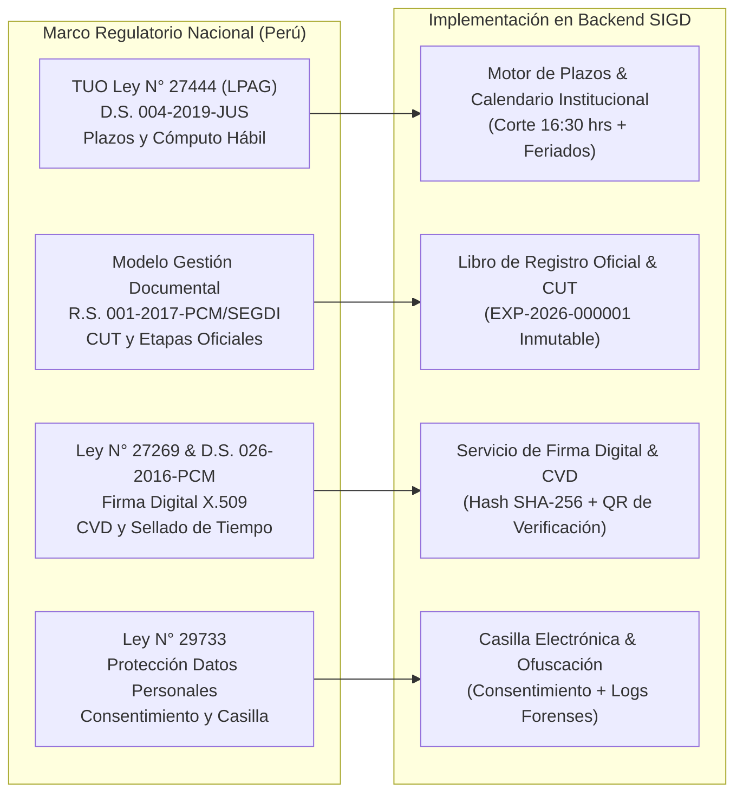

### 4.1. Modelo de Gestión Documental (MGD - PCM / SGTD)
* **Código Único de Trámite (CUT):** Identificador nacional irrepetible generado al momento del registro formal.
* **Componentes del MGD:**
  1. *Recepción:* Mesa de Partes Presencial y Mesa de Partes Virtual con cargo de recepción digital.
  2. *Emisión:* Elaboración de documentos de respuesta vinculados a la actuación administrativa.
  3. *Despacho y Distribución:* Traslado interno y externo con confirmación explícita de entrega.
  4. *Seguimiento:* Trazabilidad no repudiable en tiempo real.
  5. *Archivo:* Conservación y foliado conforme a las normas del Archivo General de la Nación.

### 4.2. Cómputo de Plazos Administrativos y Horario de Corte (TUO Ley N° 27444)
* **Días Hábiles:** Los plazos de tramitación se computan únicamente en días hábiles (lunes a viernes, excluyendo feriados nacionales y días no laborables decretados por el Gobierno).
* **Horario de Corte de Mesa de Partes:**
  * Documentos ingresados de lunes a viernes entre **08:00 hrs y 16:30 hrs**: Se consideran presentados en el mismo día hábil.
  * Documentos ingresados después de las **16:30 hrs** o en días inhábiles: Se registran formalmente con fecha y hora del **primer día hábil siguiente a las 08:00 hrs**, garantizando el debido cómputo de términos legales.

### 4.3. Firma Digital X.509, Sellado de Tiempo y Código de Verificación Digital (CVD)
* **Validez Legal:** Conforme a la Ley N° 27269, la firma digital con certificado digital X.509 acreditado ante INDECOPI tiene la misma validez y eficacia jurídica que la firma manuscrita.
* **Código de Verificación Digital (CVD):** Todo documento emitido por el SIGD debe incorporar una cadena alfanumérica única calculada a partir del hash SHA-256 del documento final y un código QR que permita a cualquier ciudadano verificar su autenticidad e integridad en la URL pública institucional (`https://sigd.iestpsuiza.edu.pe/verificar?cvd=...`).

---

## 5. BLUEPRINT DE ARQUITECTURA GLOBAL EN MERMAID

### 5.1. Arquitectura en Capas: Monolito Modular con Clean Architecture

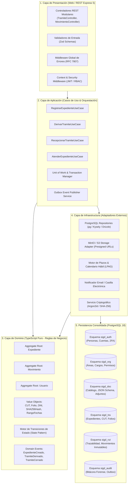

---

### 5.2. Modelo de Datos Consolidado: DER Unificado en 6 Esquemas PostgreSQL

```mermaid
erDiagram
    %% ESQUEMA: sigd_auth
    PERSONA ||--o| PERSONA_NATURAL : "es"
    PERSONA ||--o| PERSONA_JURIDICA : "es"
    PERSONA ||--o| CUENTA_USUARIO : "posee"
    CUENTA_USUARIO ||--o{ SESION_USUARIO : "inicia"
    PERSONA_JURIDICA ||--o{ REPRESENTACION_LEGAL : "representada_por"
    PERSONA_NATURAL ||--o{ REPRESENTACION_LEGAL : "actua_como"

    %% ESQUEMA: sigd_org
    AREA ||--o{ AREA : "contiene (parent_id)"
    AREA ||--o{ CARGO : "dispone"
    CARGO ||--o{ ASIGNACION_PERSONAL : "asignado_a"
    CUENTA_USUARIO ||--o{ ASIGNACION_PERSONAL : "ejerce"
    ROL ||--o{ ROL_PERMISO : "incluye"
    PERMISO ||--o{ ROL_PERMISO : "pertenece"
    CUENTA_USUARIO ||--o{ USUARIO_ROL : "tiene"
    ROL ||--o{ USUARIO_ROL : "otorgado_a"

    %% ESQUEMA: sigd_doc
    TIPO_DOCUMENTO ||--o{ FORMULARIO_VERSION : "define"
    FORMULARIO_VERSION ||--o{ REQUISITO_TUPA : "exige"
    DOCUMENTO_ADJUNTO ||--o{ EXPEDIENTE_DOCUMENTO : "sustenta"

    %% ESQUEMA: sigd_tra
    TRAMITE ||--o{ EXPEDIENTE : "genera"
    EXPEDIENTE ||--o{ ASIENTO_REGISTRO : "asienta_en"
    EXPEDIENTE ||--o{ EXPEDIENTE_DOCUMENTO : "contiene"
    EXPEDIENTE ||--o{ EXPEDIENTE_ACUMULACION : "acumula"

    %% ESQUEMA: sigd_rut
    EXPEDIENTE ||--o{ MOVIMIENTO_TRAMITE : "registra_historial"
    MOVIMIENTO_TRAMITE ||--o| DERIVACION_DETALLE : "extiende_si_deriva"
    MOVIMIENTO_TRAMITE ||--o| RECEPCION_DETALLE : "extiende_si_recibe"
    MOVIMIENTO_TRAMITE ||--o| ATENCION_DETALLE : "extiende_si_atiende"
    MOVIMIENTO_TRAMITE ||--o| OBSERVACION_DETALLE : "extiende_si_observa"
    EXPEDIENTE ||--|| ESTADO_ACTUAL_PROYECCION : "proyecta_estado"

    %% ESQUEMA: sigd_audit
    CUENTA_USUARIO ||--o{ BITACORA_AUDITORIA : "ejecuta_accion"
    MOVIMIENTO_TRAMITE ||--o{ EVENTO_OUTBOX : "despacha"
```

---

### 5.3. Flujo de Vida E2E del Trámite y Expediente

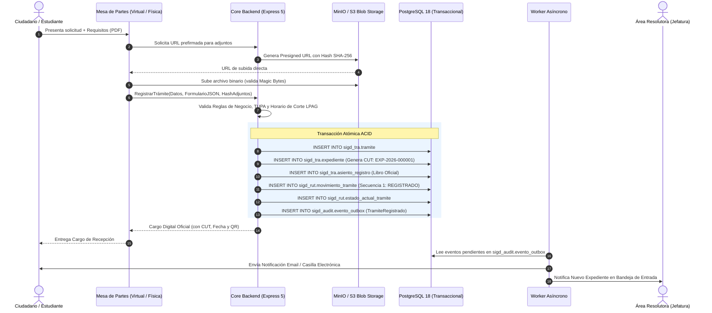

---

### 5.4. Máquina de Estados Finita de Trazabilidad

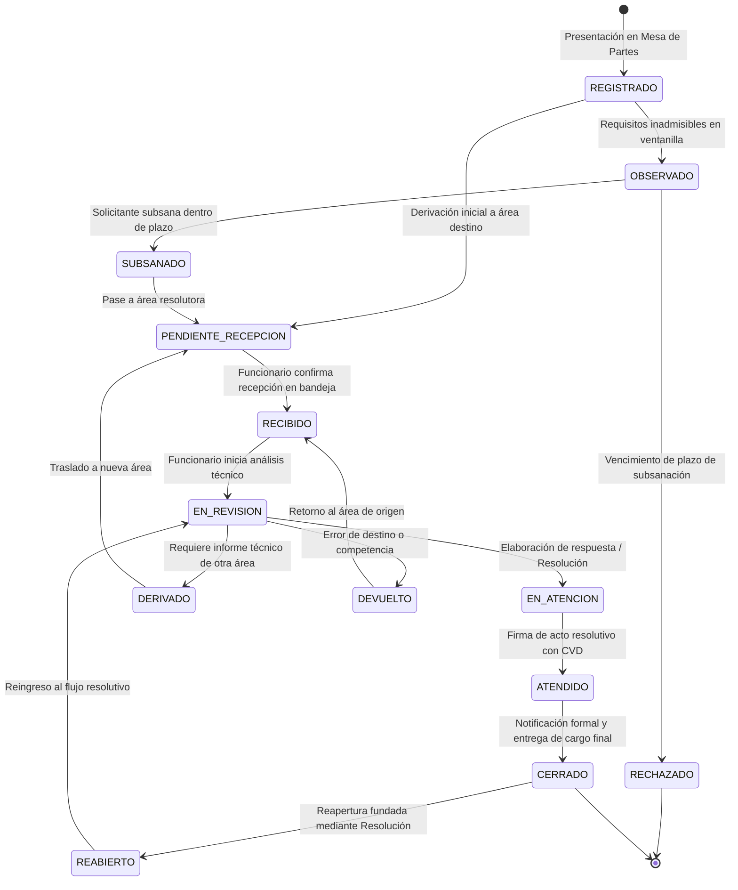

---

### 5.5. Motor de Plazos y Reglas de Corte Horario (LPAG)

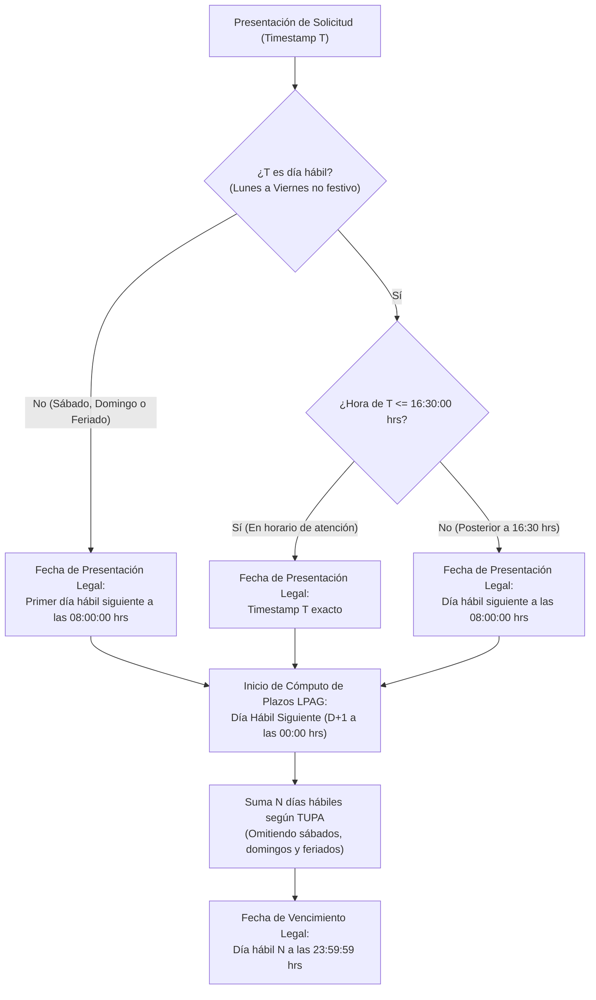

---

### 5.6. Arquitectura de Almacenamiento Desacoplado MinIO/S3

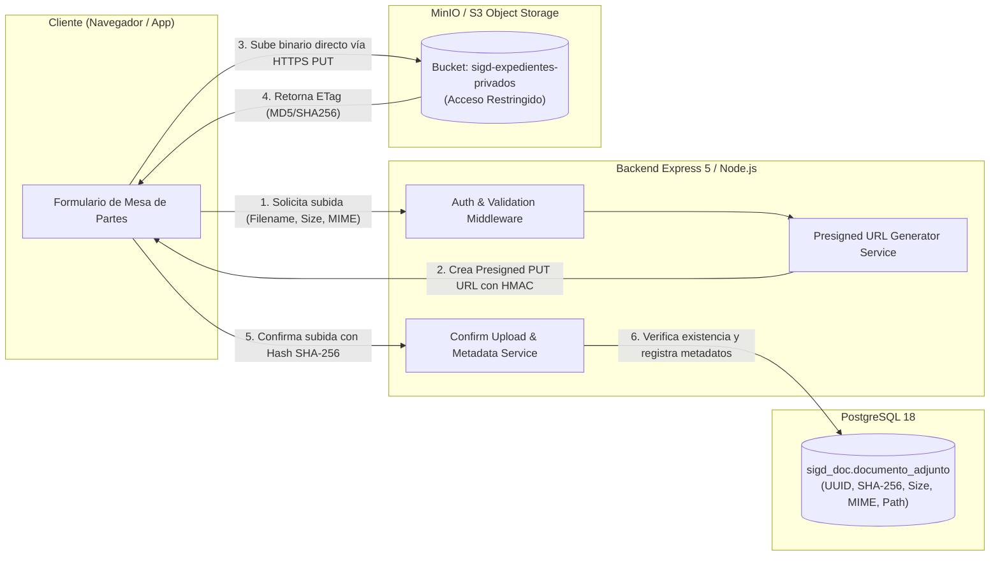

---

### 5.7. Flujo de Firma Digital, CVD y Sellado de Tiempo

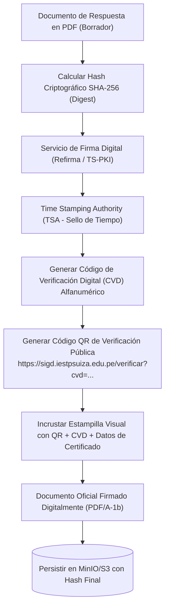

---

### 5.8. Matriz de Estandarización de Tipos de Datos y Claves Intermodulares

Para resolver las discrepancias entre esquemas (donde unos grupos utilizaban `BIGSERIAL`, otros `INT` y otros `VARCHAR(64)`), se establece el estándar homogéneo corporativo para los 6 esquemas:

| Esquema / Dominio | Entidad Principal | Clave Primaria Técnica (PK) | Código de Negocio Visible (UK) | Relaciones Cruzadas (FKs Hacia Otros Esquemas) |
| :--- | :--- | :---: | :---: | :--- |
| `sigd_auth` (IdentiCore) | `persona` / `cuenta_usuario` | `UUID` (`gen_random_uuid()`) | `numero_documento` (DNI/RUC) | Ninguna (Esquema Raíz de Identidad). |
| `sigd_org` (OrganiCore) | `area` / `cargo` / `rol` | `UUID` (`gen_random_uuid()`) | `codigo_area` (`SEC_ACAD`, `DIR_GEN`) | `cuenta_usuario_id UUID` $\to$ `sigd_auth.cuenta_usuario(id)`. |
| `sigd_doc` (DocuCore) | `tipo_documento` / `documento_adjunto` | `UUID` (`gen_random_uuid()`) | `codigo_tipo` (`FUT_01`, `CERT_02`) | `usuario_subida_id UUID` $\to$ `sigd_auth.cuenta_usuario(id)`. |
| `sigd_tra` (TramiCore) | `expediente` / `asiento_registro` | `UUID` (`gen_random_uuid()`) | `codigo_cut` (`EXP-2026-000001`) | `solicitante_id UUID` $\to$ `sigd_auth.persona(id)`. |
| `sigd_rut` (RutaDoc) | `movimiento_tramite` | `UUID` (`gen_random_uuid()`) | `numero_secuencia` (1, 2, 3...) | `expediente_id UUID` $\to$ `sigd_tra.expediente(id)`<br>`area_id UUID` $\to$ `sigd_org.area(id)`<br>`usuario_id UUID` $\to$ `sigd_auth.cuenta_usuario(id)`. |
| `sigd_audit` (CoreLink) | `bitacora_auditoria` / `evento_outbox` | `UUID` (`gen_random_uuid()`) | `correlation_id` (UUIDv4) | `usuario_id UUID` $\to$ `sigd_auth.cuenta_usuario(id)`. |

> [!IMPORTANT]
> **Convención Global de Fechas:** Todo campo de fecha/hora en la base de datos se declara estrictamente como **`TIMESTAMPTZ`** con zona horaria `America/Lima` (`UTC-5`), asegurando consistencia matemática en el cómputo de días hábiles.

---

### 5.9. Flujo de Datos Transversal del Documento Digital (MinIO $\to$ Expediente $\to$ Foliado $\to$ Movimiento)

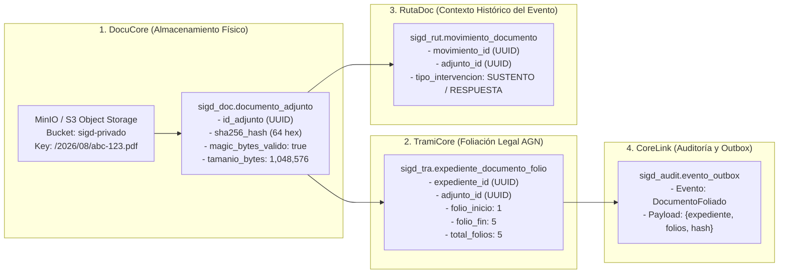

---

## 6. DISEÑO TÉCNICO DE LA CAPA DE APLICACIÓN EN TYPESCRIPT

Para reemplazar la estructura vacía en `/backend/src/`, se establece la siguiente estructura de carpetas bajo los principios de **Clean Architecture y Monolito Modular**:

```
backend/src/
├── config/                               # Variables de entorno validadas con Zod (env.ts, database.ts)
├── shared/                               # Componentes transversales del sistema
│   ├── domain/                           # Clases base: AggregateRoot, Entity, ValueObject, DomainEvent
│   ├── application/                      # UnitOfWork, IEventPublisher, Result<T, E>
│   ├── infrastructure/                   # Pool de PostgreSQL, Logger (Pino), AsyncLocalStorage Context
│   └── presentation/                     # ErrorHandlerMiddleware (RFC 7807), AuthMiddleware, ValidateMiddleware
│
└── modules/                              # Módulos desacoplados del sistema
    ├── auth_identity/                    # Grupo 4: IdentiCore (Cuentas, Personas, Sesiones, 2FA)
    │   ├── domain/                       # Entidades Persona, CuentaUsuario, VO Dni, PasswordHash
    │   ├── application/                  # Use Cases: AutenticarUsuario, RegistrarPersona, ActivarCasilla
    │   ├── infrastructure/               # PostgresAccountRepository, Argon2Hasher, JwtService
    │   └── presentation/                 # AuthController, IdentityRouter, AuthValidators
    │
    ├── organization/                     # Grupo 3: OrganiCore (Áreas, Cargos, Roles, Permisos)
    │   ├── domain/                       # Entidad Area, Cargo, Asignacion, Jerarquía Path
    │   ├── application/                  # Use Cases: CrearArea, AsignarResponsable, DelegarFirma
    │   ├── infrastructure/               # PostgresAreaRepository, RBACPermissionChecker
    │   └── presentation/                 # OrganizationController, OrgRouter
    │
    ├── document_catalog/                 # Grupo 5: DocuCore (Tipos Documentales, JSON Schema, Adjuntos)
    │   ├── domain/                       # Entidad TipoDocumento, FormularioVersion, JSONSchemaValueObject
    │   ├── application/                  # Use Cases: CrearTipoDocumento, ValidarPayloadFormulario, GenerarPresignedUrl
    │   ├── infrastructure/               # PostgresDocRepository, MinioS3StorageAdapter, AjvJsonSchemaValidator
    │   └── presentation/                 # DocumentCatalogController, DocRouter
    │
    ├── tramites_expedientes/             # Grupo 2: TramiCore (Expedientes, CUT, Asiento de Registro)
    │   ├── domain/                       # AggregateRoot Expediente, VO CodigoUnicoTramite, AsientoRegistro
    │   ├── application/                  # Use Cases: AperturarExpediente, AcumularExpedientes, FoliarDocumento
    │   ├── infrastructure/               # PostgresExpedienteRepository, CUTSequenceGenerator
    │   └── presentation/                 # TramiteController, TramiteRouter
    │
    ├── trazabilidad_rutas/               # Grupo 1: RutaDoc (Movimientos, Transiciones, Proyecciones)
    │   ├── domain/                       # AggregateRoot Movimiento, StatePattern, TransitionRules
    │   ├── application/                  # Use Cases: DerivarExpediente, RecepcionarBandeja, AtenderTramite
    │   ├── infrastructure/               # PostgresMovimientoRepository, PostgresProyeccionRepository
    │   └── presentation/                 # TrazabilidadController, RutasRouter
    │
    └── integration_audit/                # Grupo 6: CoreLink (Bitácora Forense, Outbox Worker, Health)
        ├── application/                  # OutboxWorkerProcessor, AuditTrailService
        ├── infrastructure/               # PostgresAuditRepository, PostgresOutboxRepository
        └── presentation/                 # HealthCheckController, MetricsController
```

---

## 7. ROADMAP DE IMPLEMENTACIÓN EN 6 FASES

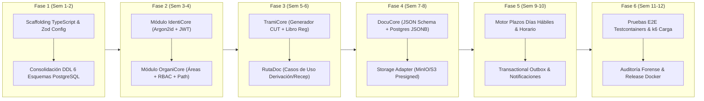

---

## 8. MATRIZ DE RIESGOS TÉCNICOS, MITIGACIONES Y CRITERIOS DE ACEPTACIÓN

| Riesgo Técnico Identificado | Nivel | Estrategia de Mitigación Arquitectural | Criterio de Aceptación Global |
| :--- | :---: | :--- | :--- |
| **Contención y Deadlocks en numeración de CUT concurrente** | **Crítico** | Uso de secuencias independientes de PostgreSQL y bloqueos pesimistas de fila corta (`SELECT ... FOR UPDATE` sobre la secuencia anual). | Generación concurrente garantizada de 1,000 CUTs sin colisiones ni duplicados. |
| **Cómputo erróneo de plazos por feriados y horarios de corte** | **Alto** | Servicio `CalendarioHabilService` con tabla de feriados parametrizable y regla estricta de corte a las 16:30 hrs. | 100% de expedientes presentados post-16:30 hrs computan legalmente a las 08:00 hrs del día hábil siguiente. |
| **Pérdida de archivos o inconsistencia entre base de datos y Storage** | **Alto** | Patrón de confirmación en dos fases (*Two-Phase Commit* de metadatos) y cálculo de hash SHA-256 antes de persistir la referencia. | Ningún registro en `sigd_doc.documento_adjunto` sin binario correspondiente validado en MinIO/S3. |
| **Falla en envío de notificaciones por caída de servicios externos** | **Medio** | *Transactional Outbox Pattern* con reintentos exponenciales y cola de mensajes fallidos (*Dead Letter Queue*). | Cero pérdida de notificaciones; entrega garantizada ante intermitencias de red. |
| **Vulnerabilidad de acceso a expedientes confidenciales** | **Crítico** | Control de acceso contextual (ABAC): el usuario solo accede si pertenece al área asignada o es el titular solicitante. | Pruebas de penetración automatizadas con 0 brechas de escalamiento horizontal de privilegios. |

---

*Plan Maestro y Blueprint de Ingeniería Backend SIGD — Aprobado para ejecución y desarrollo.*
