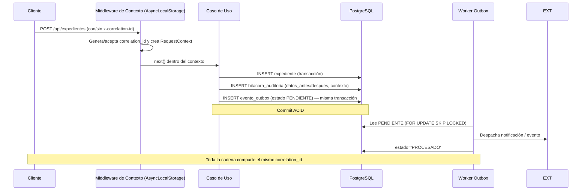

# ARQUITECTURA DE AUDITORÍA FORENSE, TRAZABILIDAD CON CONTEXTO Y TRANSACTIONAL OUTBOX
## Grupo 6 "CoreLink" · Integración, Calidad y Pruebas del Backend — SIGD

**Proyecto:** Sistema Integral de Gestión Documentaria (SIGD)
**Institución:** IESTP "Suiza" (Pucallpa, Ucayali, Perú) — PE DSI
**Área:** Backend — CoreLink
**Responsable del entregable:** Reátegui · `B_REATEGUI`
**Documento:** `02_arquitectura_auditoria_contexto_asynclocalstorage.md`
**Fecha:** 3 de septiembre de 2026
**Versión:** 1.1 (Fase 2 — Levantamiento de Observaciones · Revisión de documentación)

> [!NOTE]
> Este documento es una **especificación de referencia**. No contiene instrucciones ejecutables ni
> código listo para correr; describe de forma completa y detallada las estructuras de datos, las
> reglas de inmutabilidad, la máquina de estados de eventos y el flujo del worker que los equipos
> deben implementar para garantizar la observabilidad y auditoría forense del backend SIGD.

---

## 1. Propósito y Problema que Resuelve

Definir la arquitectura de **observabilidad y auditoría forense** del SIGD. El problema que resuelve
es doble:

1. **Propagar el contexto de cada solicitud** (`correlation_id`, `usuario_id`, `ip_origen`,
   `user_agent`) a través de todas las capas de la aplicación **sin ensuciar las firmas** de casos de
   uso, servicios y repositorios.
2. **Registrar de forma inmutable** cada mutación de datos en la bitácora forense
   `sigd_audit.bitacora_auditoria`, y **despachar de forma asíncrona** los eventos de integración
   mediante el patrón *Transactional Outbox* (`sigd_audit.evento_outbox`).

Sin esta arquitectura, cada módulo implementaría auditoría por su cuenta, el `correlation_id` no
viajaría de punta a punta, y las notificaciones/eventos se perderían ante caídas de servicios externos.

### 1.1. Propuesta de valor
- Auditoría **inmutable** (append-only): imposible modificar o borrar el historial forense.
- Trazabilidad total: con el `correlation_id` es posible reconstruir toda la cadena de una solicitud.
- **Cero pérdida de eventos**: se elimina la fragilidad de envíos directos ante fallas de red.
- Registro de datos antes/después en formato `JSONB` para cualquier auditoría de cambios.

---

## 2. Alcance y Elementos Fuera de Alcance

### Dentro del alcance
- Contrato de uso de `AsyncLocalStorage` de Node.js para la trazabilidad de solicitudes HTTP.
- Especificación completa del esquema `sigd_audit.bitacora_auditoria` con almacenamiento `JSONB`.
- Arquitectura del procesador asíncrono (worker) para la tabla `sigd_audit.evento_outbox`
  (Transactional Outbox Pattern).
- Reglas de integración del contexto con la bitácora de auditoría.

### Fuera de alcance
- Middleware de errores RFC 7807 (entregable 01 — Azareño).
- Pruebas de integración Testcontainers / k6 (entregable 03 — Zevallos).
- Contratos intermodulares y matriz Productor-Consumidor (entregable 04 — Ricardo).

---

## 3. Definiciones Necesarias

| Término | Definición |
| :--- | :--- |
| **AsyncLocalStorage** | API de Node.js que mantiene estado asíncrono a lo largo de toda la pila de llamadas de una solicitud, sin pasarlo por parámetros. |
| **`correlation_id`** | UUIDv4 que identifica de forma única toda la cadena de operaciones de una solicitud. |
| **Bitácora forense** | Registro inmutable de auditoría que documenta los datos antes/después de cada mutación (`sigd_audit.bitacora_auditoria`). |
| **Transactional Outbox** | Patrón que escribe eventos dentro de la misma transacción de negocio en `evento_outbox` y luego los despacha de forma asíncrona por un worker. |
| **Append-only** | Política de solo-escritura: los registros de auditoría no se editan ni eliminan. |
| **Dead Letter Queue (DLQ)** | Cola de eventos fallidos derivados a revisión manual tras agotar los reintentos automáticos. |

---

## 4. Propagación de Contexto con AsyncLocalStorage

### 4.1. Contrato del contexto

El contexto de solicitud es **la fuente de verdad de trazabilidad** definida en el entregable 01
(Azareño). Este documento lo **reutiliza** como insumo para la auditoría. Sus portadores son:

| Campo | Tipo | Descripción |
| :--- | :--- | :--- |
| `correlation_id` | string (UUIDv4) | Identificador único de la solicitud completa. |
| `usuario_id` | string \| null | Identidad autenticada del usuario que ejecuta la mutación. |
| `ip_origen` | string | IP del cliente que originó la solicitud. |
| `user_agent` | string | Cliente (navegador/aplicación) que originó la solicitud. |

### 4.2. Cómo se propaga

- Un middleware de Express crea el almacén al inicio de cada solicitud y ejecuta `next()` dentro de él.
- Los casos de uso, servicios y repositorios obtienen el contexto mediante la lectura del almacén
  (getStore), **sin recibir estos datos por parámetros**.
- Cada solicitud tiene su propio almacén aislado; no son variables globales.
- Para procesos que no provienen de HTTP (workers), el contexto puede ser `undefined`; el consumidor
  debe decidir su tratamiento (por ejemplo, registrar el evento como operación de sistema).

### 4.3. Consumo transparente para auditoría

Cuando un caso de uso o repositorio va a registrar una mutación en la bitácora o un evento de
integración, debe **leer el contexto** y transmitirle los valores al repositorio de auditoría en el
mismo momento de la operación. El objeto de contexto consumido por la bitácora tiene la siguiente
forma documental:

```json
{
  "correlation_id": "8f4c2a10-7b21-4d55-8f2a-1c9d3e7b5a01",
  "usuario_id": "3a1b2c3d-0000-0000-0000-000000000001",
  "ip_origen": "190.42.1.13",
  "user_agent": "Mozilla/5.0 (Windows NT 10.0; Win64; x64)"
}
```

> La Especificación del middleware de contexto (orden de registro, política del header
> `x-correlation-id`, flujo de autenticación que puebla `usuario_id`) está documentada en la sección 8
> del entregable 01.

---

## 5. Especificación de la Bitácora Forense `sigd_audit.bitacora_auditoria`

### 5.1. Propósito y características

- **Registro inmutable (append-only)** de todas las mutaciones `INSERT`, `UPDATE` y `DELETE` sobre los
  datos de negocio.
- Conserva el **antes** (`datos_antes`) y el **después** (`datos_despues`) de cada cambio en formato
  `JSONB`, permitiendo reconstruir estados históricos.
- Cada fila queda ligada al `correlation_id`, al usuario, a la IP y al `user_agent` que originaron la
  operación (tomados del contexto de la sección 4).
- Pertenece al esquema `sigd_audit`, conforme al estándar consolidado del Plan de Mejora Backend SIGD.

### 5.2. Estructura de la tabla (`bitacora_auditoria`)

| Columna | Tipo | Restricción / Default | Descripción |
| :--- | :--- | :--- | :--- |
| `id_auditoria` | UUID | `NOT NULL`, PK, default `gen_random_uuid()` | Identificador interno del registro de auditoría. |
| `correlation_id` | UUID | `NOT NULL`, default `gen_random_uuid()` | Identificador único de la solicitud completa (debe venir del contexto). |
| `usuario_id` | UUID | NULL | Identidad del usuario que ejecutó la operación. FK → `sigd_auth.cuenta_usuario(id)`. |
| `ip_origen` | INET | NULL | Dirección IP del cliente (tipo de red nativo de PostgreSQL). |
| `user_agent` | VARCHAR(512) | NULL | Cliente que originó la solicitud. |
| `esquema` | VARCHAR(64) | `NOT NULL` | Esquema afectado (p. ej. `sigd_tra`, `sigd_doc`). |
| `tabla` | VARCHAR(64) | `NOT NULL` | Tabla afectada (p. ej. `expediente`, `movimiento`). |
| `operacion` | VARCHAR(16) | `NOT NULL`, CHECK en (`INSERT`, `UPDATE`, `DELETE`) | Tipo de mutación registrada. |
| `datos_antes` | JSONB | NULL | Estado previo de la fila (NULL para `INSERT`). |
| `datos_despues` | JSONB | `NOT NULL` | Estado posterior de la fila (para `DELETE` puede ser el estado previo a eliminación). |

### 5.3. Reglas y restricciones obligatorias

- `operacion` solo admite `INSERT`, `UPDATE` y `DELETE` (control a nivel de base de datos).
- `id_auditoria` y `correlation_id` son generados en la BD como UUID; el `correlation_id` de la
  bitácora debe **coincidir** con el del contexto de la solicitud.
- `correlation_id` debe estar indexado para permitir reconstruir la cadena completa de una solicitud.
- La FK de `usuario_id` hacia `sigd_auth.cuenta_usuario(id)` garantiza integridad referencial de la
  identidad (el esquema `sigd_auth` es responsabilidad del módulo IdentiCore).

### 5.4. Política de inmutabilidad

- La bitácora es de **solo escritura**: los registros no deben editarse ni eliminarse.
- A nivel de roles de base de datos debe revocarse `UPDATE` y `DELETE` a la cuenta de aplicación,
  dejando únicamente `INSERT` y `SELECT`.
- Ningún caso de uso de negocio debe poder manipular la bitácora directamente; solo a través del
  repositorio de auditoría.

### 5.5. Índices de consulta forense recomendados

| Índice sugerido | Columnas / Opción | Propósito |
| :--- | :--- | :--- |
| `idx_bitacora_correlation_id` | `(correlation_id)` | Reconstruir la cadena completa de una solicitud. |
| `idx_bitacora_usuario` | `(usuario_id)` | Consultas forenses por usuario. |
| `idx_bitacora_fecha` | `(fecha_hora)` | Consultas por rango de tiempo. |
| `idx_bitacora_tabla` | `(esquema, tabla)` | Auditar una entidad específica. |
| `idx_bitacora_jsonb` | `GIN (datos_despues)` | Búsquedas sobre el contenido JSON de los cambios. |

> **Decisión registrada:** los nombres de índice y el tamaño de columna `user_agent` (512) están en
> estado `PROPUESTO`; deben confirmarse al implementar, manteniendo la semántica aquí descrita.

---

## 6. Especificación del Transactional Outbox `sigd_audit.evento_outbox`

### 6.1. Propósito

- Escribir los eventos de integración/notificación **dentro de la misma transacción** de negocio, de
  modo que la mutación y su evento sean **atómicos** (commit o rollback juntos).
- Asegurar **cero pérdida de notificaciones** aunque el envío a servicios externos (email, casilla,
  sistema de bandeja) falle en el momento: el evento queda persistido y se despacha después.

### 6.2. Estructura de la tabla (`evento_outbox`)

| Columna | Tipo | Restricción / Default | Descripción |
| :--- | :--- | :--- | :--- |
| `id_evento` | UUID | `NOT NULL`, PK, default `gen_random_uuid()` | Identificador interno del evento. |
| `correlation_id` | UUID | `NOT NULL` | Correlación de la solicitud que originó el evento (del contexto). |
| `agregado` | VARCHAR(64) | `NOT NULL` | Agregado que produjo el evento (p. ej. `expediente`, `movimiento`). |
| `tipo_evento` | VARCHAR(64) | `NOT NULL` | Nombre del evento de dominio (p. ej. `TramiteRegistrado`). |
| `payload` | JSONB | `NOT NULL` | Cuerpo del evento a despachar (datos + claves de idempotencia). |
| `estado` | VARCHAR(16) | `NOT NULL`, default `PENDIENTE`, CHECK en (`PENDIENTE`, `PROCESADO`, `FALLIDO`) | Ciclo de vida del evento. |
| `intentos` | SMALLINT | `NOT NULL`, default `0` | Número de reintentos de despacho realizados. |
| `creado_en` | TIMESTAMPTZ | `NOT NULL`, default `now()` | Momento de creación del evento (dentro de la transacción). |
| `procesado_en` | TIMESTAMPTZ | NULL | Momento en que se confirmó el despacho. |

### 6.3. Máquina de estados del evento

| Estado | Significado | Transiciones permitidas |
| :--- | :--- | :--- |
| `PENDIENTE` | Evento persistido en la transacción, esperando despacho. | → `PROCESADO` (éxito) o → `FALLIDO` (fallo persistente). |
| `PROCESADO` | Entregado y confirmado por el servicio externo. Estado final. | Ninguna. |
| `FALLIDO` | Agotó los reintentos; requiere revisión manual (dead-letter). Estado final. | Ninguna (solo revisión manual fuera del flujo). |

**Reglas de transición:**
- Los casos de uso **solo insertan** eventos en estado `PENDIENTE`; jamás los actualizan.
- Únicamente el **worker outbox** modifica `estado, intentos, procesado_en`.
- No se permite reencolar un `PROCESADO`; la idempotencia la garantiza el consumidor con las claves
  del `payload`.

### 6.4. Flujo del worker outbox (diagrama documental)

```mermaid
sequenceDiagram
    participant UC as Caso de Uso (Transacción)
    participant DB as PostgreSQL
    participant OUT as Worker Outbox (Asíncrono)
    participant EXT as Servicio Externo (Email / Casilla)

    UC->>DB: INSERT negocio (expediente, movimiento, etc.)
    UC->>DB: INSERT sigd_audit.evento_outbox (misma transacción)
    Note over UC,DB: Commit ACID: datos + evento quedan atómicos

    OUT->>DB: SELECT estado='PENDIENTE' (lote, FOR UPDATE SKIP LOCKED)
    OUT->>EXT: Envía notificación / evento
    OUT->>DB: UPDATE estado='PROCESADO', procesado_en=now()
    alt Falla el envío
        OUT->>DB: incrementa intentos; aplica backoff exponencial
        OUT->>EXT: reintento con backoff exponencial
        Note over OUT,EXT: Si supera el máximo de intentos → estado='FALLIDO' (Dead Letter Queue)
    end
```

### 6.5. Comportamiento esperado del worker (contrato)

1. **Lote:** consultar un lote de eventos `PENDIENTE` (tamaño recomendado ≈ 100) ordenados por
   `creado_en`.
2. **Concurrencia segura:** usar `FOR UPDATE SKIP LOCKED` para que dos instancias del worker no
   procesen el mismo evento (evita doble envío).
3. **Despacho:** enviar al destino externo (email, casilla, publicador de eventos).
4. **Confirmación:** marcar `PROCESADO` y fijar `procesado_en` **solo tras la confirmación** del
   destino; no antes.
5. **Falla transitoria:** incrementar `intentos`, dejar en `PENDIENTE` y reintentar con **backoff
   exponencial** (esperas crecientes entre reintentos).
6. **Falla persistente:** al superar el máximo de intentos configurado, pasar a `FALLIDO` y derivar el
   evento a una **Dead Letter Queue** para revisión manual.
7. **Idempotencia del consumidor:** el `payload` debe incluir el `correlation_id` y la clave de negocio
   afectada, de modo que el receptor pueda detectar e ignorar duplicados en caso de reintento.

### 6.6. Índice recomendado

| Índice sugerido | Columnas | Propósito |
| :--- | :--- | :--- |
| `idx_outbox_estado_fecha` | `(estado, creado_en)` | Barrido eficiente del worker por orden de creación y estado. |

---

## 7. Flujo de Auditoría y Notificación de Extremo a Extremo

Diagrama documental de referencia (el middleware de contexto es del entregable 01):



**Pasos del flujo:**

1. El cliente envía una solicitud a `POST /api/expedientes`, opcionalmente con el header
   `x-correlation-id`.
2. El middleware de contexto genera o acepta el `correlation_id` e inicializa el `RequestContext`.
3. El caso de uso crea el expediente; en la **misma transacción** el repositorio:
   - registra la mutación en `bitacora_auditoria` (con `datos_antes`/`datos_despues` y el contexto), y
   - escribe el evento en `evento_outbox` con estado `PENDIENTE`.
4. El worker outbox lee el evento `PENDIENTE`, despacha la notificación al área destino y lo marca
   `PROCESADO`.
5. Toda la cadena queda trazable con el mismo `correlation_id`.

---

## 8. Guía de Avance para los Equipos (Lista de Verificación)

1. [ ] **Crear el esquema `sigd_audit`** (DDL) con las tablas `bitacora_auditoria` y `evento_outbox`
       según las secciones 5 y 6.
2. [ ] **Configurar los defaults `gen_random_uuid()`** (requiere la extensión adecuada en PostgreSQL).
3. [ ] **Crear los índices** de las secciones 5.5 y 6.6.
4. [ ] **Aplicar la política de inmutabilidad:** revocar `UPDATE`/`DELETE` sobre la bitácora al rol de
       aplicación.
5. [ ] **Implementar el repositorio de auditoría** que consuma el contexto de la sección 4 y persista
       en la bitácora dentro de la transacción de negocio.
6. [ ] **Implementar el repositorio outbox** que inserte el evento en la misma transacción (nunca en
       transacción separada).
7. [ ] **Implementar el worker outbox** con lote, `FOR UPDATE SKIP LOCKED`, backoff exponencial y
       dead-letter. Consumir el contexto `undefined` de forma tolerante (eventos de sistema).
8. [ ] **Garantizar idempotencia** en el consumidor externo (correlation_id + clave de negocio).
9. [ ] **Validar el esquema** con la suite del entregable 03 (casos E2E-06 y E2E-07).

---

## 9. Criterios de Aceptación de la Especificación

| # | Criterio | Cumple |
| :---: | :--- | :---: |
| 1 | El esquema define la bitácora forense inmutable con `datos_antes`/`datos_despues` en `JSONB`. | ✅ |
| 2 | La bitácora se integra con el contexto (`correlation_id`, `usuario_id`, `ip_origen`, `user_agent`) de forma transparente. | ✅ |
| 3 | `evento_outbox` implementa el patrón Transactional Outbox con escritura atómica. | ✅ |
| 4 | El worker especifica lote, `FOR UPDATE SKIP LOCKED`, confirmación previa a `PROCESADO`, backoff exponencial y dead-letter. | ✅ |
| 5 | Se garantiza cero pérdida de notificaciones ante fallas de los servicios externos. | ✅ |
| 6 | La documentación queda lista para que los equipos implementen sin ambigüedad. | ✅ |

---

## 10. Dependencias y Decisiones

- **Dependencia (Azareño):** el `RequestContext` se complementa con la especificación del middleware
  RFC 7807 (`01_especificacion_middleware_rfc7807.md`), que lo usa para poblar `correlation_id` en las
  respuestas de error. Este documento **consume** ese contrato para la auditoría.
- **Dependencia (Zevallos):** la reproducibilidad de las migraciones y el comportamiento de outbox y
  bitácora se validan en la suite Testcontainers (`03_suite_pruebas_testcontainers_k6.md`, casos
  E2E-06 y E2E-07).
- **Decisiones registradas:**
  - El esquema consolida la nomenclatura `sigd_*` del Plan de Mejora (reemplaza variantes anteriores
    como `sigd_identi`, `sigd_tramite`, etc.).
  - `usuario_id` es **nullable** porque existen operaciones legítimas sin sesión de usuario
    (registros de sistema, migraciones, integraciones máquina-a-máquina).
  - `evento_outbox` no se limpia automáticamente; la retención es una decisión operativa posterior.
- **Taxonomía:** `CONFIRMADO` — patrón Transactional Outbox y esquema base; `PROPUESTO` — índices y
  tamaño de columna `user_agent`; `EJEMPLO` — payloads mostrados.

---

*Documento elaborado por Reátegui (`B_REATEGUI`) como entregable de Fase 2 — Levantamiento de
Observaciones del Grupo 6 CoreLink. Revisión 1.1: convertido a especificación de documentación pura,
sin código ejecutable, para guiar a los equipos de implementación.*