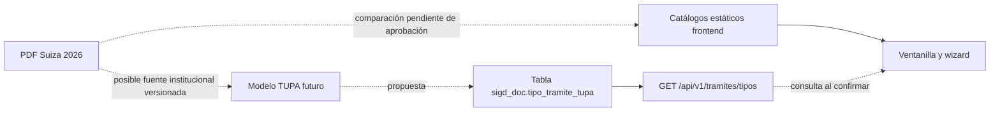

# CP-GERIC-004 — Auditoría del TUPA 2026 del IESTP «Suiza»

## 1. Información general

- Responsable de la revisión: Geric Aldair Salas Ormeño, `B_GERIC`.
- Modalidad: auditoría documental y de código; **no se implementó ni cambió el TUPA**.
- Criterios de certeza: **CONFIRMADO** (visible en PDF o código), **PARCIAL** (semejanza sin identidad contractual), **INFERENCIA** (conclusión razonada) y **PENDIENTE DE VERIFICACIÓN** (falta decisión o prueba).
- Estado de esta auditoría: **PENDIENTE DE DECISIÓN DEL PROFESOR**.

## 2. Objetivo

Identificar diferencias demostrables entre las tarifas y conceptos del TUPA 2026 del IESTP «Suiza» y los catálogos que muestra actualmente el SIGD. Este informe no autoriza cobros, cambios de código ni ampliaciones de alcance.

## 3. Fuente oficial

Se leyó el archivo local `TUPA_2026_IESTP_Suiza.pdf` (6 páginas; SHA-256 `377DD8E14B8806F2030B5374120AB9B4FE17640BB98086E10C1A9A4431A33622`). Su encabezado identifica al IESTP «Suiza», la Dirección Regional de Educación de Ucayali, TUPA 2026 y UIT S/5,500.00 (p. 1). El PDF no está versionado en este repositorio; su hash permite identificar la copia cotejada.

Referencias comprobadas: prácticas iniciales y EFSRT por módulo (p. 1); alquileres y ventas (pp. 2–3); expedición de título, certificado de seis semestres y total de titulación (p. 4); matrícula, convalidación y traslados (p. 5).

## 4. Evidencia del repositorio

| Evidencia | Certeza | Archivo y líneas |
| --- | --- | --- |
| Existe el catálogo `PROCEDIMIENTOS_TUPA_2026` con requisitos, derecho de pago y plazo en texto. | CONFIRMADO | `frontend/src/data/tupaPasco2026.ts:1-13` |
| Ventanilla presencial importa directamente ese catálogo, lo presenta como opciones y muestra el derecho de pago. La propia pantalla indica «Fuente: TUPA 2026 del IESTP Pasco». | CONFIRMADO | `frontend/src/pages/tramite/VentanillaPresencialPage.tsx:4,318-320,368-375` |
| El mock del wizard transforma el mismo catálogo, pero su uso localizado en esta búsqueda fue la prueba M2; no se encontró importación productiva de `TRAMITES_TUPA_MOCK`. | CONFIRMADO | `frontend/src/mocks/tramitesTupaMock.ts:22,53-82`; `frontend/src/tests/m2/tramiteTupaCatalog.test.ts:3` |
| El wizard mantiene otra lista estática con códigos `TUPA-01` a `TUPA-05`. Al confirmar una radicación intenta consultar la API de tipos y, si no encuentra correspondencia, puede tomar el primer tipo o usar el UUID fijo de respaldo. | CONFIRMADO | `frontend/src/components/tramite/WizardSteps/StepDocumentos.tsx:41-71`; `StepConfirmacion.tsx:121-145` |
| Existe el catálogo backend `GET /api/v1/tramites/tipos` y su alias `/api/v1/tramites/tupa`; devuelve filas vigentes de `sigd_doc.tipo_tramite_tupa`. | CONFIRMADO | `backend/src/domains/tramicore/tramites.controller.ts:64-88`; montaje en `backend/src/app.ts:185` |
| La migración 04 carga solo tres tipos iniciales. El código `TUPA-02` designa título en la BD, pero constancia en la lista estática del wizard; `TUPA-03` designa convalidación en BD, pero título en el wizard. | CONFIRMADO | `backend/migraciones/04_sigd_doc.sql:261-267`; `StepDocumentos.tsx:47-55` |

El archivo `frontend/docs/04_registro-documentario/documentacion/TUPA/tupa.md:1-7` identifica expresamente otro TUPA como **IESTP Pasco**. Por ello está confirmada una inconsistencia territorial entre ese catálogo frontend y el PDF Suiza. No se afirma cómo ni por quién fue incorporado el catálogo.

## 5. Hallazgos confirmados

1. La ventanilla presencial puede mostrar importes de un catálogo identificado como Pasco. No son importes verificados del TUPA Suiza.
2. El endpoint de catálogo **sí existe**; una propuesta futura debe evaluar su contrato y datos, no presentarlo como ausente.
3. El backend no almacena monto, porcentaje UIT, rubro, requisitos estructurados ni año de tarifa en `tipo_tramite_tupa`. El campo `vigente` es booleano y `plazo_dias` sí expresa plazo.
4. Hay más de una lista de procedimientos en el frontend y sus códigos no siempre tienen el mismo significado que los seeds backend.
5. El PDF presenta `TOTAL PROCESO TITULACIÓN S/917.50` (p. 4). La suma de los 14 importes listados allí da S/917.50. **No es un procedimiento individual llamado «Derecho de titulación»** ni una autorización automática para cobrar ese total en una sola operación.

## 6. Matriz de comparación

La columna «monto actual» transcribe lo que muestra el catálogo frontend identificado como Pasco; no implica equivalencia de unidad de cobro. **PARCIAL** significa que el nombre es parecido, pero el alcance o la unidad del concepto difieren.

| Procedimiento/concepto en PDF Suiza | Monto PDF | Representación actual verificada | Monto actual | Estado |
| --- | ---: | --- | --- | --- |
| Certificado de Estudios Superiores (6 semestres), p. 4 | S/124.00 | «Certificado de estudios» por semestre, `tupaPasco2026.ts:15-18` | S/11.00 por semestre; S/2.00 adicional indicado | PARCIAL |
| Convalidación entre Planes de Estudios, p. 5 | S/46.50 | «Convalidación de estudios interna y externa» por asignatura, `tupaPasco2026.ts:23-27` | S/25.00 interna; S/30.00 externa por asignatura | PARCIAL |
| Expedición de Título, p. 4 | S/105.00 | «Derecho de titulación» lista varias tasas sin monto único, `tupaPasco2026.ts:85-89` | No comparable | PARCIAL |
| Prácticas Iniciales, p. 1 | S/35.00 | Sin equivalencia exacta demostrada. Existen «Constancia de aprobación de prácticas» y otros trámites relacionados, pero son conceptos distintos. | No comparable | PENDIENTE DE VERIFICACIÓN |
| EFSRT por módulo, p. 1 | S/46.50 | Sin equivalencia exacta demostrada. «Convalidación de informes de prácticas empresariales» cobra por nivel, no por módulo EFSRT. | No comparable | PENDIENTE DE VERIFICACIÓN |
| Matrículas, p. 5 | S/200.00 | Variantes de matrícula: «regular - invicto», «repitente - reentrante» y otras, `tupaPasco2026.ts:306-327` | S/80.00 regular; otras variantes tienen otros importes | PARCIAL |
| Traslado Interno, p. 5 | S/309.00 | «Traslado interno», `tupaPasco2026.ts:144-148,297-301` | S/100.00 | CONFIRMADO |
| Traslado Externo, p. 5 | S/412.00 | «Traslado externo», `tupaPasco2026.ts:151-155`; hay otras variantes externas en `:279-292` | S/150.00 | CONFIRMADO |

Las dos últimas filas muestran una diferencia de tarifa para **etiquetas iguales**; la homologación jurídica del trámite y su aplicabilidad al SIGD requieren aprobación institucional. «Prácticas Iniciales», EFSRT y «Constancia de aprobación de prácticas» no se equiparan.

## 7. Rubros oficiales

- **Servicios académicos / documentarios:** el PDF agrupa proceso de titulación y otros servicios académicos en pp. 4–6; incluye certificados, matrícula, convalidaciones y traslados. Algunos son conceptos de pago dentro de un proceso, no necesariamente trámites independientes.
- **Actividades productivas / ingresos propios:** pp. 1–3 presentan proyectos productivos, venta de bienes y otros servicios; incluyen alquiler de auditorio y aulas, venta de mangos, patos, porcinos y ganado. Figurar en el PDF no demuestra que deban ser expedientes administrativos del SIGD.

## 8. Alcance dudoso

**PENDIENTE DE VERIFICACIÓN:** decidir con el profesor si el SIGD debe gestionar únicamente trámites académicos/documentarios, o también alquileres y ventas de actividades productivas. También debe precisarse si los cobros por EFSRT y prácticas son solicitudes documentarias, operaciones de tesorería o ambas cosas. El informe no asume integración de esos rubros.

## 9. Modelo de datos actual

`backend/migraciones/04_sigd_doc.sql:16-29` define `sigd_doc.tipo_tramite_tupa` con UUID, código, denominación, descripción, unidad orgánica, `plazo_dias`, silencio administrativo, base legal y `vigente`.

| Atributo requerido para catálogo tarifario | Soporte actual |
| --- | --- |
| Monto en soles y porcentaje de UIT | No hay columnas. |
| Rubro/categoría | No hay columna. |
| Requisitos | Solo podría escribirse texto libre en `descripcion`; no hay estructura de requisitos. |
| Vigencia/año | Hay `vigente` booleano; no hay año ni intervalo de vigencia. |
| Plazo | Sí, `plazo_dias` con validación positiva. |

El endpoint lee esta tabla (`tramites.controller.ts:66-84`) y no retorna tarifas ni requisitos estructurados. No se comprobó aquí una respuesta productiva con un TUPA Suiza completo.

## 10. Posibles estrategias — propuestas, no implementadas

- **PLAN A — Corrección estática frontend:** sustituir los datos expuestos por una matriz Suiza aprobada, manteniendo explícitas las unidades de cobro. Solo sería una solución local de interfaz y exige resolver equivalencias antes de editar.
- **PLAN B — Catálogo servido por backend:** aprovechar `GET /api/v1/tramites/tipos` o `/tramites/tupa`, acordar códigos y datos canónicos, y conectar ambas pantallas a una respuesta versionada. El endpoint existe, pero su tabla actual no contiene tarifas.
- **PLAN C — Modelo TUPA completo:** definir con responsables de DocuCore/TramiCore un modelo de rubros, importes, UIT, requisitos, vigencia y reglas de cobro, con migración y revisión institucional propias.

Ningún plan queda autorizado por este documento. **No se autoriza Plan A todavía.**

## 11. Cambios posibles — NO autorizados

Tras una decisión del profesor podrían revisarse la lista estática de ventanilla, la del wizard, los seeds y el contrato del catálogo, la correspondencia de códigos y las pruebas. Esta auditoría no modifica frontend, backend, SQL, datos ni migraciones.

## 12. Preguntas para el profesor

1. ¿Qué conceptos del PDF son trámites que deben poder iniciarse en SIGD y cuáles son solo ingresos de tesorería o actividades productivas?
2. ¿Se deben incluir alquiler de auditorio/aulas y venta de mangos, patos, porcinos o ganado?
3. ¿Cuál es la equivalencia aprobada entre certificado de 6 semestres y certificado por semestre, convalidación entre planes y por asignatura, prácticas iniciales, EFSRT y constancia de prácticas?
4. ¿Qué conceptos del proceso de titulación son exigibles juntos y cuáles son alternativas? El PDF muestra dos conceptos de examen de S/57.00 cada uno dentro del total S/917.50.
5. ¿Quién aprueba y publica futuras versiones del catálogo, sus tarifas y fecha de vigencia? ¿Debe la UI mostrar costos informativos o iniciar cobros?

## 13. Riesgos

- **CONFIRMADO:** ventanilla muestra fuente Pasco y tarifas diferentes a las del PDF Suiza en conceptos de nombre similar.
- **CONFIRMADO:** los códigos `TUPA-02` y `TUPA-03` significan cosas diferentes en wizard y seeds backend; la selección de respaldo del primer tipo puede radicar con un tipo no elegido si falla la correspondencia.
- **PARCIAL:** una sustitución solo visual dejaría BD/API sin tarifas, vigencia y requisitos; no resolvería la fuente canónica.
- **PENDIENTE DE VERIFICACIÓN:** el PDF local no está versionado aquí; debe acordarse cómo conservar una copia institucional aprobada y su fecha de aplicación.

## 14. Evidencia visual

Las barras muestran **solo dos etiquetas comparables por nombre**; `█` representa aproximadamente S/25 y la cifra escrita es el dato exacto. No representan el catálogo completo.

```text
Traslado interno  PDF Suiza     ████████████        S/309.00
                  UI actual     ████                S/100.00
Traslado externo  PDF Suiza     ████████████████    S/412.00
                  UI actual     ██████              S/150.00
```



## 15. Estado final

**PENDIENTE DE DECISIÓN DEL PROFESOR.** Los importes y rubros citados se cotejaron contra el PDF local identificado por SHA-256; las representaciones actuales se cotejaron contra código. La equivalencia jurídica, el alcance funcional y la estrategia de implementación siguen abiertos. No se implementó ningún cambio de TUPA.
