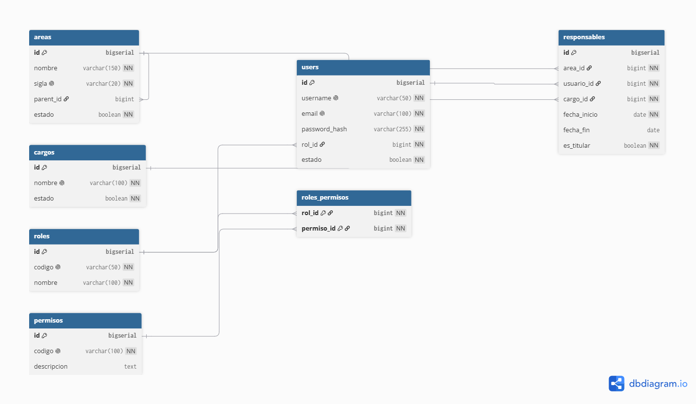

# Justificación del Modelo de Datos - Módulo de Organización y Permisos

## 1. Arquitectura General
El modelo de datos para el módulo de Organización, Roles y Permisos está optimizado para el motor PostgreSQL, garantizando el cumplimiento de la estructura institucional de forma flexible y con soporte integral para el control de acceso basado en roles (RBAC)[cite: 2].

## 2. Decisiones de Diseño

### 2.1 Jerarquía Orgánica (Tabla `areas`)
Para representar el organigrama institucional completo (Gerencias, Direcciones, Oficinas y Sub-áreas) sin limitar los niveles de profundidad[cite: 2, 3]:
* Se implementó un modelo **autorreferenciado** mediante la clave foránea `parent_id`[cite: 2].
* Las unidades principales poseen `parent_id` en `NULL`[cite: 2].
* Esto simplifica la navegación del árbol organizacional usando consultas recursivas (CTE)[cite: 2].

### 2.2 Desacoplamiento entre Cargo y Rol
Se mantiene una estricta separación entre el **Cargo** (ámbito nominal/contractual) y el **Rol** (perfil dentro del sistema)[cite: 2]:
* **`cargos`**: Registra la función administrativa (ej. *Especialista en Archivo*, *Director*)[cite: 2].
* **`roles`**: Define las facultades en el software (ej. *Operador de Trámite*, *Administrador*)[cite: 2].
* *Sustento*: Permite gestionar interinatos o suplencias otorgando permisos de sistema sin alterar la contratación laboral del usuario[cite: 2].

### 2.3 Historial de Responsabilidades (Tabla `responsables`)
Para garantizar la trazabilidad de firmas, vistos buenos y aprobaciones en expedientes a lo largo del tiempo[cite: 2]:
* Se maneja un registro histórico en la tabla `responsables` con campos de vigencia (`fecha_inicio`, `fecha_fin`)[cite: 1, 2].
* Permite diferenciar entre responsables titulares e interinos mediante la bandera `es_titular`[cite: 1].

### 2.4 Matriz Granular de Seguridad (`roles`, `permisos`, `roles_permisos`)
* Descompone las acciones en permisos atómicos (`codigo`)[cite: 1, 2].
* La relación N:M desacopla la lógica del backend, haciendo posible redefinir perfiles mediante configuración de base de datos sin alterar código fuente[cite: 2].

## 3. Diagrama Entidad-Relación (ER)

El siguiente diagrama refleja la estructura de entidades y sus relaciones para el módulo[cite: 2]:

[cite: 2]