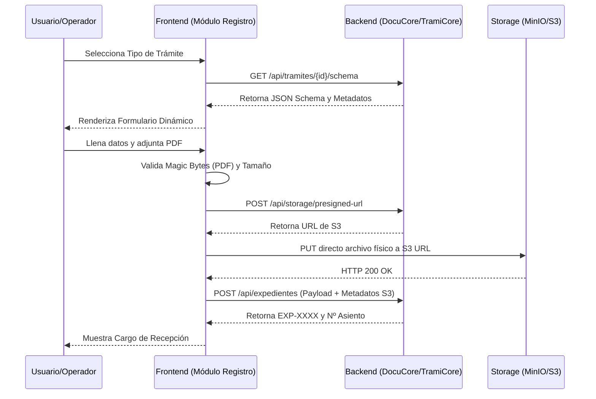

# Propuesta de Módulo Frontend: Registro Documentario
**Proyecto:** Sistema Integral de Gestión Documentaria (SIGD) - IESTP SUIZA
**Área:** Frontend
**Módulo:** Registro Documentario (Mesa de Partes Presencial y Virtual)

---

## 1. Visión General del Módulo

El módulo de **Registro Documentario** es el punto de entrada de la información al SIGD. A nivel frontend, este módulo debe unificar las capacidades expuestas por los subsistemas de backend **TramiCore** (gestión del expediente y libro de registro) y **DocuCore** (formularios dinámicos mediante `JSON Schema` y almacenamiento desacoplado en S3/MinIO). 

El objetivo es proveer interfaces intuitivas, rápidas y seguras tanto para el **Administrado/Ciudadano** (Mesa de Partes Virtual) como para el **Operador de Mesa de Partes** (Atención Presencial).

---

## 2. Tecnologías y Estrategias Clave

Para alinearse con la arquitectura moderna planteada en el backend, el frontend deberá implementar las siguientes estrategias:

### 2.1. Renderizado de Formularios Dinámicos (JSON Schema)
- **Estrategia:** Ya que DocuCore elimina los formularios rígidos (antipatrón EAV) en favor de `JSON Schema (Draft 2020-12)`, el frontend no debe hardcodear pantallas de registro.
- **Implementación:** Se recomienda utilizar librerías generadoras de UI a partir de esquemas (ej. `react-jsonschema-form` para React o equivalentes en Vue/Angular). Esto permitirá que cuando un Administrador cree un nuevo trámite TUPA en el backend, el frontend dibuje el formulario automáticamente.

### 2.2. Arquitectura de Carga de Archivos Desacoplada (MinIO / S3)
- **Estrategia:** El frontend **NO** enviará los archivos pesados (PDFs, anexos) al servidor Node/Python del SIGD. 
- **Implementación (Presigned URLs):**
  1. El cliente selecciona el archivo.
  2. El frontend solicita al backend una URL prefirmada (*Presigned URL*).
  3. El frontend sube el archivo directamente a MinIO/S3 usando el método `PUT`.
  4. Una vez exitoso, el frontend envía únicamente los metadatos (`s3_key`, `nombre`, etc.) en el payload de creación del trámite.

### 2.3. Seguridad y Validación en el Cliente (Magic Bytes y SHA-256)
- Para mejorar la experiencia de usuario (UX) y evitar consumo innecesario de red, el frontend debe leer los primeros bytes del archivo seleccionado (usando `FileReader` o `Blob.slice()`) para verificar que su firma hexadecimal corresponda a un PDF (`25 50 44 46` - *Magic Bytes*), rechazando ejecutables antes de la carga.
- El cálculo del hash **SHA-256** se puede computar en el frontend vía `Web Crypto API` para contrastarlo posteriormente con el que calcule el backend, asegurando la inmutabilidad de los folios adjuntos.

---

## 3. Arquitectura de Vistas (Pantallas)

### 3.1. Portal del Administrado (Mesa de Partes Virtual)
Dirigido al ciudadano o estudiante externo.
*   **Vista de Catálogo TUPA/No TUPA:** Un buscador amigable que lista los trámites disponibles (ej. Certificado de Estudios, Licencia).
*   **Vista de Formulario de Solicitud:** Renderizado basado en `JSON Schema`.
*   **Zona de Carga de Archivos (Drag & Drop):** Componente visual interactivo. Límite de validación cliente: máximo 25MB por archivo, solo formato PDF/A.
*   **Pantalla de Éxito (Cargo Virtual):** Muestra de forma destacada el **Código Visible de Expediente** (ej. `EXP-2026-000104`) y el correlativo del Libro de Registro. Opción de imprimir o descargar el comprobante en PDF.

### 3.2. Dashboard del Operador (Mesa de Partes Presencial)
Dirigido al personal de la institución.
*   **Vista de Registro Asistido:** Permite registrar un trámite a nombre de un tercero. Incluye un buscador de personas integrado con el módulo **Identicore (Grupo 4)**. Si el ciudadano no existe, se captura su DNI/Nombre sin exigirle creación de credenciales.
*   **Bandeja de Recepción y Calificación:** Lista de expedientes recién ingresados (estado `REGISTRADO`).
*   **Vista de Validación Formal:** 
    *   Integración de un **Visor PDF en línea** para leer el documento presentado sin descargarlo.
    *   **Acciones:** 
        *   **Derivar:** Pasa a estado `EN_TRAMITE` y se envía al área de destino.
        *   **Observar:** Cambia a `OBSERVADO` si hay errores, permitiendo registrar el motivo de subsanación (plazo legal de 48 hrs).
*   **Anulación de Asiento (Acción Protegida):** Pantalla para marcar un registro como `anulado = true` pidiendo el motivo formal, asegurando que se preserva el historial del correlativo.

---

## 4. Flujo de Interacción Propuesto (Componentes Frontend)

---

## 5. Consideraciones de Experiencia de Usuario (UX)

1.  **Manejo de Estados de Carga:** Al subir archivos directamente a S3, el componente `S3Uploader` debe tener una barra de progreso real (usando el evento `onUploadProgress` de Axios/XHR).
2.  **Prevención de Doble Envío:** Deshabilitar el botón de envío y mostrar un *spinner* para evitar concurrencia que pueda generar intentos de duplicidad, aunque TramiCore ya maneje concurrencia con secuencias nativas transaccionales.
3.  **Accesibilidad (a11y):** Asegurar contraste de colores e inputs con etiquetas semánticas, vital por ser un sistema orientado a una institución pública.
4.  **Notificaciones Toast:** Feedback visual si un esquema JSON no pasa la validación local (Ej. falta un campo obligatorio o el RUC es inválido) antes de tocar el servidor.
