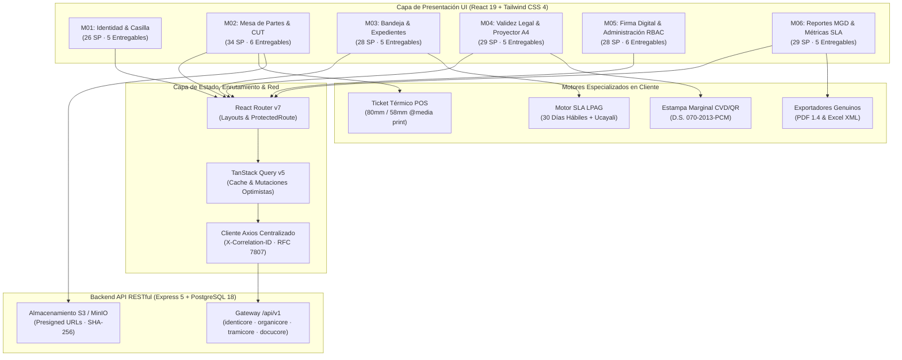
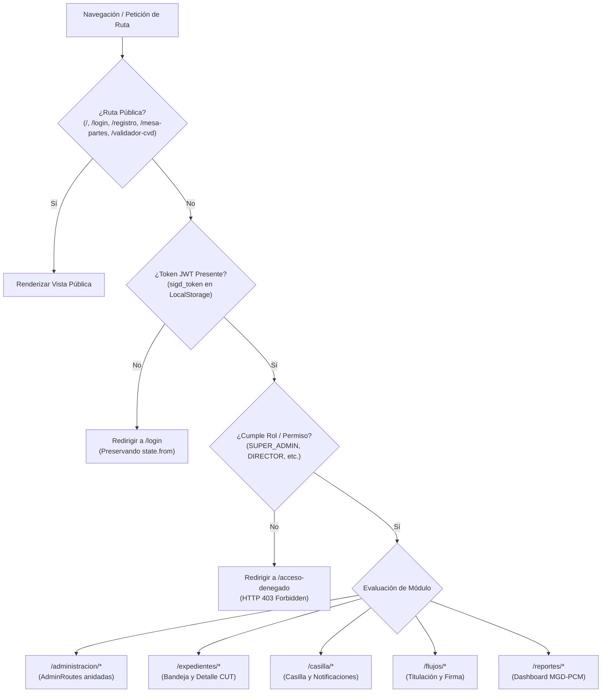
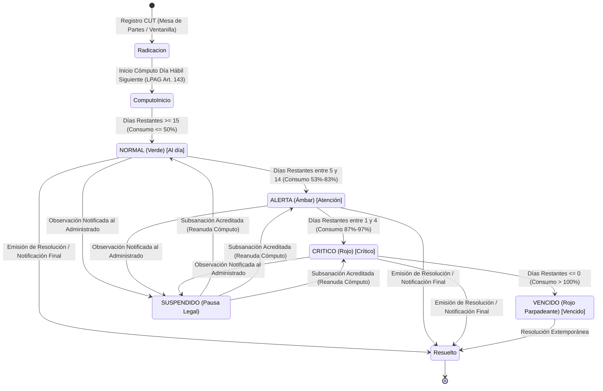

# Frontend del SIGD · IESTP "Suiza" (Pucallpa, Ucayali)

[](https://react.dev/)
[](https://vitejs.dev/)
[](https://www.typescriptlang.org/)
[](https://tailwindcss.com/)
[](https://reactrouter.com/)
[](https://tanstack.com/query)
[](https://vitest.dev/)
[](https://www.w3.org/WAI/standards-guidelines/wcag/)
[-success)](#-mapeo-estructural-de-los-6-módulos-funcionales-174-sp--32-entregables)
[-brightgreen)](#-estrategia-de-pruebas-y-certificación-de-calidad)

---

## 🏛️ Identidad Institucional y Rol del Frontend

El frontend del **Sistema Integral de Gestión Documentaria (SIGD)** constituye la interfaz de usuario oficial de nivel de producción del **Instituto de Educación Superior Tecnológico Público "Suiza"** (Pucallpa, Coronel Portillo, Ucayali), desarrollado en el marco del Programa de Estudios de **Desarrollo de Sistemas de Información (DSI 2026-2)**.

Concebido como una **Single Page Application (SPA)** de arquitectura moderna, reactiva y accesible, el frontend digitaliza el ciclo de vida documental administrativo y académico de la institución, abarcando **174 Story Points (SP)** distribuidos en **32 entregables atómicos físicos** rigurosamente verificados en código fuente.

El sistema se encuentra alineado estrictamente con el marco legal peruano:
- **TUO de la Ley N.° 27444 (LPAG):** Horario de corte legal a las **16:30 hrs** (radicación fuera de horario computable a las 08:00 hrs del día hábil siguiente), cómputo de plazos en días hábiles (excluyendo fines de semana, feriados nacionales y **feriados regionales de Ucayali**) y semáforo de alerta preventiva sobre el plazo legal máximo de 30 días hábiles.
- **Modelo de Gestión Documental (MGD-PCM):** Generación y trazabilidad del Código Único de Trámite (**CUT** `EXP-YYYY-XXXXXX`), bitácora inmutable de eventos de auditoría y 4 métricas oficiales de desempeño (VTEP, TPR, ICL, PEO).
- **Ley N.° 27269 y D.S. N.° 070-2013-PCM:** Integración con pasarela de firma digital **Refirma RENIEC**, visor de representaciones impresas con **estampa marginal oficial lateral derecha**, Código de Verificación Digital (**CVD** de 16 caracteres), código QR vectorial determinista y portal público de contrastación de autenticidad.
- **Ley N.° 29733 (LPDP):** Validación estricta de consentimiento informado para tratamiento de datos personales en el registro de ciudadanos y apertura de Casilla Electrónica.
- **Directiva N.° 001-2019-AGN:** Cuadro de Clasificación Documental (**CCD**) y foliación correlativa inmutable (F. 1 a N).
- **Accesibilidad Universal WCAG 2.1 AA:** Ratios de contraste $\ge 4.5:1$, foco visible `:focus-visible`, soporte completo de navegación por teclado, roles ARIA y adaptaciones daltónicas.

---

## 🛠️ Runtime & Stack Tecnológico Oficial (100% Verificado en Código)

La infraestructura de ejecución y dependencias del frontend ha sido auditada directamente sobre `package.json`, `vite.config.ts`, `tsconfig.json` y `tailwind.config.ts`:

| Tecnología / Biblioteca | Versión Instalada | Propósito Arquitectónico en el SIGD |
|---|:---:|---|
| **React** | `^19.1.1` | Biblioteca central basada en componentes funcionales concurrentes, Server Actions y hooks modernos. |
| **Vite** | `^6.3.5` | Bundler ESM ultrarrápido, motor HMR instantáneo y pipeline de empaquetado para producción (build en 2.51s). |
| **TypeScript** | `~5.9.2` | Tipado estático riguroso en modo estricto (`strict: true`, `noUnusedLocals: true`, `noUnusedParameters: true`). 0 errores en `tsc --noEmit`. |
| **Tailwind CSS** | `^4.1.11` | Framework utilitario de estilos v4 con importación nativa mediante `@tailwindcss/vite`. |
| **React Router DOM** | `^7.8.0` | Enrutamiento jerárquico v7 con layouts anidados, rutas públicas, privadas y guardianes de acceso RBAC. |
| **TanStack Query** | `^5.83.0` | Gestión de estado asíncrono del servidor (`QueryClientProvider`), cacheo determinista y mutaciones optimistas. |
| **Lucide React** | `^1.46.0` | Sistema canónico de iconografía vectorial accesible. |
| **Axios** | `^1.11.0` | Cliente HTTP con inyección automática de `X-Correlation-ID: UUIDv4` y normalización RFC 7807/9457. |
| **Zod** | `^4.6.2` | Validación declarativa de esquemas en tiempo de ejecución (Módulo 11 SUNAT, personas, formularios). |
| **React Hook Form** | `^7.88.0` | Manejo de formularios de alto rendimiento no controlados acoplados a esquemas Zod. |
| **Vitest** | `^5.0.0` | Framework de pruebas unitarias y de integración de componentes ejecutado sobre JSDOM. |

### Paleta Institucional Oficial IESTP "Suiza" (`tailwind.config.ts`)
- **`suiza.blue`:** `#006EC7` (Azul Institucional Primario — Contraste 5.2:1 sobre blanco, conforme WCAG 2.1 AA)
- **`suiza.fuchsia`:** `#E6007E` (Fucsia Institucional de Acento)
- **`suiza.yellow`:** `#F9E000` (Amarillo Institucional de Identidad)
- **`suiza.red`:** `#D62828` (Rojo de Alerta Crítica y Vencimiento SLA)
- **`suiza.black`:** `#111111` (Texto de Alto Contraste)
- **Tipografía:** `"Segoe UI", "Tahoma", "Geneva", "Verdana", "sans-serif"`

---

## 📐 Arquitectura del Sistema y Diagramas Mermaid

### 1. Arquitectura Modular por Capas del Frontend SIGD


### 2. Flujo Jerárquico de Rutas y Guardianes de Acceso RBAC


### 3. Máquina de Estados del Semáforo SLA (30 Días Hábiles LPAG)


---

## 📦 Mapeo Estructural de los 6 Módulos Funcionales (174 SP / 32 Entregables)

El frontend contiene la totalidad de los 174 Story Points físicos en disco, divididos en 32 entregables atómicos certificados:

```
┌────────────────────────────────────────────────────────────────────────────────────────┐
│             CATÁLOGO MODULAR DE ENTREGABLES FÍSICOS DEL FRONTEND SIGD                  │
└────────────────────────────────────────────────────────────────────────────────────────┘
  ├── M01: Autenticación, Casilla Electrónica & Perfiles [26 SP / 5 entregables]
  ├── M02: Mesa de Partes Digital & Registro de Trámites [34 SP / 6 entregables]
  ├── M03: Bandeja de Gestión, Derivación & Trazabilidad [28 SP / 5 entregables]
  ├── M04: Emisión, Proyección & Foliación de Documentos [29 SP / 5 entregables]
  ├── M05: Firma Digital, Visado & Verificación CVD/QR   [28 SP / 6 entregables]
  └── M06: Reportes, Indicadores SLA & Administración    [29 SP / 5 entregables]
```

### 1. Módulo 01 (M01): Identidad, Autenticación, Casilla Electrónica & Perfiles
- **Story Points:** 26 SP | **Entregables:** 5 (`ENT-M01-01` a `ENT-M01-05`)
- **Documentación Técnica:** [`docs/01_registro-usuarios-casilla/`](docs/01_registro-usuarios-casilla/00_plan_de_trabajo_y_evaluacion_docente.md)
- **Rutas Activas:** `/registro`, `/casilla`, `/casilla-electronica`, `/login`, `/acceso-denegado`
- **Páginas Principales:**
  - `src/pages/registro/RegistroCiudadanoPage.tsx`
  - `src/pages/casilla/CasillaElectronicaPage.tsx`
  - `src/pages/LoginPage.tsx`, `src/pages/AccesoDenegadoPage.tsx`
- **Componentes Clave:**
  - `PersonaNaturalForm.tsx` (DNI de 8 dígitos, edad $\ge 16$ años, teléfono con prefijo 9, correo validado).
  - `PersonaJuridicaForm.tsx` (RUC 10/20 validado con algoritmo oficial **Módulo 11 SUNAT**, razón social, representante legal).
  - `ConsentimientoLey29733Modal.tsx` y `DeclaracionJuradaCheckbox.tsx` (Cumplimiento riguroso de la Ley de Protección de Datos Personales).
  - `NotificacionList.tsx` y `NotificacionDetailModal.tsx` (Bandeja de casilla ciudadana con acuse de notificación legal fehaciente).
  - `UbigeoSelector.tsx` y `useUbigeoCascade.ts` (Selector en cascada para el departamento de Ucayali: 4 provincias y 17 distritos según catálogo INEI).
- **Esquemas & Servicios:** `registroCiudadano.schema.ts`, `consentimiento.schema.ts`, `casillaService.ts`, `data/ucayali.ts`.
- **Pruebas Automatizadas:** 53 tests unitarios aprobados en 5 suites (`registroCiudadano`, `casillaElectronica`, `registroFormularios`, `ubigeoCascade`, `ubigeoSelector`).

### 2. Módulo 02 (M02): Mesa de Partes Digital & Registro de Trámites (CUT)
- **Story Points:** 34 SP | **Entregables:** 6 (`ENT-M02-01` a `ENT-M02-06`)
- **Documentación Técnica:** [`docs/04_registro-documentario/`](docs/04_registro-documentario/00_plan_de_trabajo_y_evaluacion_docente.md)
- **Rutas Activas:** `/tramite`, `/tramite/mesa-partes-virtual`, `/mesa-partes`, `/tramite/ventanilla-presencial`, `/ventanilla`
- **Páginas Principales:**
  - `src/pages/tramite/TramitePage.tsx`
  - `src/pages/tramite/MesaPartesVirtualPage.tsx`
  - `src/pages/tramite/VentanillaPresencialPage.tsx`
- **Componentes Clave:**
  - `TramiteWizard.tsx` y `WizardStepBar.tsx` (Asistente de 4 pasos para radicación virtual con guardado de borrador).
  - `DynamicSchemaForm.tsx` y `schemaFormParser.ts` (Motor intérprete de formularios dinámicos basados en **JSON Schema Draft 2020-12**).
  - `CargoDigitalModal.tsx` (Emisión de cargo con CUT `EXP-YYYY-XXXXXX`, código QR vectorial y formato de ticket térmico `@media print` 80mm/58mm).
  - `HorarioCorteNotice.tsx` y `useHorarioCorte.ts` (Control normativo de corte diario a las **16:30 hrs** según Ley 27444 con zona horaria `America/Lima`).
  - `FileUploadDropzone.tsx`, `magicBytesValidator.ts` (Validación de cabecera binaria Magic Bytes `%PDF` `0x25 0x50 0x44 0x46`) y `cryptoSha256.ts` (Cálculo criptográfico SHA-256 en cliente para subida segura vía Presigned URLs a MinIO/S3).
- **Pruebas Automatizadas:** 14 tests unitarios aprobados en 3 suites (`magicBytesValidator`, `horarioCorte`, `ventanillaPresencial`).

### 3. Módulo 03 (M03): Bandeja de Gestión, Derivación & Trazabilidad
- **Story Points:** 28 SP | **Entregables:** 5 (`ENT-M03-01` a `ENT-M03-05`)
- **Documentación Técnica:** [`docs/05_gestion-expedientes/`](docs/05_gestion-expedientes/00_plan_de_trabajo_y_evaluacion_docente.md)
- **Rutas Activas:** `/expedientes`, `/expedientes/:id`
- **Páginas Principales:**
  - `src/pages/expedientes/BandejaExpedientesPage.tsx`
  - `src/pages/expedientes/ExpedienteDetallePage.tsx`
- **Componentes Clave:**
  - `BandejaTabFilter.tsx` (Filtro de 6 bandejas canónicas: *Pendientes, En Proceso, Por Derivar, Observados, Archivados, Todos*).
  - `ExpedienteTable.tsx` y `ExpedienteMetadatos.tsx` (Visualización integral con indicadores de folios, tipo y estado).
  - `SlaBadge.tsx` y `SlaIndicatorTooltip.tsx` (Semáforo visual y textual de SLA en días hábiles con soporte para daltónicos).
  - `ExpedienteTimeline.tsx` y `TimelineItemCard.tsx` (Línea de tiempo inmutable con hashes SHA-256 y trazabilidad de eventos).
  - `CcdTreeSelector.tsx` (Selector interactivo accesible del Cuadro de Clasificación Documental AGN con navegación completa por teclado).
  - `FoliadoDocumentoViewer.tsx` (Visor de documentos con estampa marginal de foliado continuo correlativo F. 1 a N).
  - Modales de Acción: `DerivacionModal.tsx` (Derivación múltiple a unidades orgánicas), `ObservacionModal.tsx` (Suspensión formal de plazos SLA) y `AcumulacionModal.tsx` (Acumulación de expedientes conforme al Art. 160 del TUO LPAG).
- **Pruebas Automatizadas:** 99 tests unitarios aprobados en 10 suites (`slaBadge`, `slaCalculator`, `AccionesModales`, `CcdTreeSelector`, `ExpedienteTimeline`, `FoliadoDocumentoViewer`, `useExpedienteActions`, `expedienteActions` api/utils, `foliado`).

### 4. Módulo 04 (M04): Emisión, Proyección & Foliación de Documentos (Flujos Académicos)
- **Story Points:** 29 SP | **Entregables:** 5 (`ENT-M04-01` a `ENT-M04-05`)
- **Documentación Técnica:** [`docs/03_flujo-validez-legal/`](docs/03_flujo-validez-legal/00_plan_de_trabajo_y_evaluacion_docente.md)
- **Rutas Activas:** `/flujo-validez-legal`, `/flujos/titulacion`, `/flujos/proyector-resoluciones`, `/flujo-validez-legal/firma`, `/validador-cvd`
- **Páginas Principales:**
  - `src/pages/flujos/FlujoValidezLegalPage.tsx`
  - `src/pages/flujos/WorkflowAcademicoPage.tsx` (Workflow de 5 etapas para expedientes de titulación profesional técnica).
  - `src/pages/flujos/ProyectorResolucionesPage.tsx`
  - `src/pages/flujos/PasarelaFirmaPage.tsx`
  - `src/pages/validador/ValidadorPublicoCvdPage.tsx` (Portal público universal de verificación de documentos).
- **Componentes Clave:**
  - `PlantillaResolucionEditor.tsx` (Editor y proyector estructurado de Resoluciones Directorales en formato estándar de hoja A4 con secciones VISTO, CONSIDERANDO y SE RESUELVE).
  - `AcademicWorkflowStepper.tsx` y `StageDetailCard.tsx` (Control de etapas académicas: Solicitud, Dictamen, Sustentación, Emisión RD y Registro Titulación).
  - `DocumentoCvdViewer.tsx` y `CvdStampBadge.tsx` (Representación impresa con estampa lateral derecha según D.S. 070-2013-PCM).
  - `RefirmaConnectorModal.tsx` (Conector con la aplicación cliente oficial de Refirma RENIEC mediante protocolo URI `refirma://sign?...`).
  - `CvdVerificationResult.tsx` (Despliegue pericial del resultado de validación criptográfica).
- **Pruebas Automatizadas:** 6 tests unitarios aprobados en 2 suites (`documentoCvdViewer`, `proyectorResoluciones`).

### 5. Módulo 05 (M05): Firma Digital, Visado & Verificación CVD/QR (Administración y RBAC)
- **Story Points:** 28 SP | **Entregables:** 6 (`ENT-M05-01` a `ENT-M05-06`)
- **Documentación Técnica:** [`docs/02_administracion-seguridad-auditoria/`](docs/02_administracion-seguridad-auditoria/00_plan_de_trabajo_y_evaluacion_docente.md)
- **Rutas Activas (Protegidas bajo `/administracion`):**
  - `/administracion` (Panel Hub Central)
  - `/administracion/usuarios` (`UsuariosPage.tsx`)
  - `/administracion/roles-permisos` (`RolesPermisosPage.tsx`)
  - `/administracion/auditoria` (`AuditoriaPage.tsx`)
  - `/administracion/tablas-maestras` (`TablasMaestrasPage.tsx`)
  - `/administracion/calendario-laboral` (`CalendarioLaboralPage.tsx`)
  - `/administracion/seguridad` (`SeguridadPage.tsx`)
- **Componentes Clave:**
  - `RolePermissionMatrix.tsx` (Matriz interactiva RBAC para los 5 roles canónicos: `SUPER_ADMIN`, `DIRECTOR`, `DOCENTE`, `MESA_PARTES`, `ESTUDIANTE`).
  - `AuditDetailDrawer.tsx` (Visor forense de bitácora WORM inmutable con filtrado por `X-Correlation-ID` y agente).
  - `OrganigramaTreeView.tsx` (Visualización de la estructura orgánica institucional mediante Materialized Path `01.03.02`).
  - `UserEditModal.tsx` (Gestión de credenciales, roles y estado de cuentas).
  - `AdminBreadcrumbs.tsx` y `AdminPageHeader.tsx` (Navegación contextual y migas de pan institucionales).
- **Guardianes & Hooks:** `ProtectedRoute.tsx` (Validador de permisos y redirección a `/acceso-denegado`), `useRbacConfig.ts`, `useAuditLogs.ts`, `useCalendarioLaboral.ts` (`HORA_FIN_REFERENCIA = "16:30"`).
- **Pruebas Automatizadas:** 4 tests unitarios aprobados (`rbacRolesCanonicos`).

### 6. Módulo 06 (M06): Reportes, Indicadores SLA & Administración del Sistema (MGD-PCM)
- **Story Points:** 29 SP | **Entregables:** 5 (`ENT-M06-01` a `ENT-M06-05`)
- **Documentación Técnica:** [`docs/06_reportes-tableros-control/`](docs/06_reportes-tableros-control/00_plan_de_trabajo_y_evaluacion_docente.md)
- **Rutas Activas:** `/reportes`, `/reportes/dashboard`
- **Páginas Principales:**
  - `src/pages/reportes/DashboardEjecutivoPage.tsx`
- **Componentes Clave:**
  - `ExecutiveKpiCard.tsx` y `KpiMetricGrid.tsx` (Tablero directivo con tarjetas de KPIs oficiales).
  - `KpiFormulaExplanationCard.tsx` (Modelado explicativo formal de las 4 fórmulas oficiales del MGD-PCM: **VTEP**, **TPR**, **ICL**, **PEO**).
  - `BottleNeckHeatmap.tsx` (Matriz de calor de cuellos de botella por unidad orgánica, completamente accesible con glifos textuales `✓`, `⚠`, `✕`).
  - `AreaRetentionChart.tsx` (Gráfico estadístico de retención y tiempos medios de atención).
  - `ReportExportModal.tsx` (Selector de exportación con rangos de fecha y formatos).
- **Servicios & Exportadores Binarios Genuinos:**
  - `kpiCalculator.service.ts` (Cálculo matemático determinista de indicadores institucionales).
  - `pdfReportExporter.ts` (Generador físico de documentos Adobe `%PDF-1.4` con cabecera estándar, MediaBox A4 y tabla xref).
  - `excelReportExporter.ts` (Generador estructurado de libros Microsoft SpreadsheetML XML 2003 codificado en UTF-8 con estilos de celdas).
- **Pruebas Automatizadas:** 46 tests unitarios aprobados en 3 suites (`kpiCalculator`, `dashboardA11y`, `reportExportersIntegrity`).

---

## ⚡ Capacidades Técnicas y Componentes Especializados

### 1. Motor de Cómputo de Plazos SLA (`src/utils/slaCalculator.ts`)
Conforme al Art. 143 del TUO de la Ley N.° 27444, los trámites ordinarios tienen un plazo legal máximo de **30 días hábiles**. El cómputo formal se inicia a partir del día hábil siguiente a la radicación.

- **Exclusiones Computacionales:** Sábados y domingos de todo el año calendario.
- **Feriados Nacionales (D. Leg. N.° 713):** 01-01, 05-01, 06-07, 06-29, 07-23, 07-28, 07-29, 08-06, 08-30, 10-08, 11-01, 12-08, 12-09, 12-25.
- **Feriados Regionales de Ucayali:**
  - **`06-24`:** Fiesta Patronal de San Juan Bautista.
  - **`10-13`:** Aniversario de la Creación de la Provincia de Coronel Portillo / Pucallpa.
- **Umbrales Cromáticos y Estados Semafóricos:**
  1. `NORMAL` (Verde): Consumo $\le 15$ días hábiles ($\ge 15$ días restantes). Etiqueta visual: `[Al día]`.
  2. `ALERTA` (Ámbar): Consumo de 16 a 25 días hábiles (5 a 14 días restantes). Etiqueta visual: `[Atención]`.
  3. `CRITICO` (Rojo): Consumo de 26 a 30 días hábiles (1 a 4 días restantes). Etiqueta visual: `[Crítico]`.
  4. `VENCIDO` (Rojo con pulso animado): Consumo $> 30$ días hábiles ($\le 0$ días restantes). Etiqueta visual: `[Vencido]`.

### 2. Cargo de Recepción y Ticket Térmico POS (`src/components/tramite/CargoDigitalModal.tsx`)
Diseñado para ventanilla presencial y mesa de partes virtual, permitiendo la impresión optimizada mediante `@media print` para rollos de impresoras térmicas ESC/POS de **80mm** y **58mm**, así como hojas A4:
- Membrete institucional con RUC 20131312955 del IESTP "Suiza".
- Código Único de Trámite en tipografía monoespaciada de alta legibilidad (`EXP-YYYY-XXXXXX`).
- Código QR vectorial de 140px generado dinámicamente con URL directa de seguimiento en línea.
- Metadatos del trámite: solicitante, DNI/RUC, asunto, folios, fecha/hora exacta y operador de ventanilla.
- **Advertencia Legal de Corte 16:30 hrs:** En caso de ingreso posterior al horario límite, el ticket estampa automáticamente la nota legal LPAG indicando radicación efectiva a las 08:00 hrs del día hábil siguiente.
- Hash criptográfico SHA-256 de 64 caracteres hex que garantiza la inmutabilidad del cargo emitido.

### 3. Proyector y Editor A4 de Resoluciones Directorales (`PlantillaResolucionEditor.tsx`)
Herramienta WYSIWYG de proyección de documentos oficiales en hoja estandarizada A4 (`max-w-[595px]` a 72 dpi) con tipografía serif y formato legal formal:
- Encabezado oficial del Gobierno Regional de Ucayali / DREU / IESTP "Suiza".
- Numeración correlativa reglamentaria: `RD N.° XXXX-2026-DG-IESTP-SUIZA`.
- Estructura resolutiva canónica editable con botones accesibles:
  - **VISTO:** Actuados, expedientes e informes técnicos sustentatorios.
  - **CONSIDERANDO:** Fundamentos de hecho y de derecho con soporte para agregar/eliminar cláusulas dinámicas.
  - **SE RESUELVE:** Articulado estructurado (`Art. 1°.-`, `Art. 2°.-`, etc.).
  - **PIE DE FIRMA:** Espacio para firma digital del Director General e invocación de Refirma RENIEC.
- Persistencia local y despacho inmediato a la pasarela de firma electrónica.

### 4. Visor CVD con Estampa Marginal Conforme al D.S. N.° 070-2013-PCM (`DocumentoCvdViewer.tsx`)
Implementa la representación impresa oficial para documentos electrónicos firmados digitalmente:
- **Estampa Marginal Lateral Derecha (`<aside>`):**
  - Encabezado institucional: "Firma Digital Oficial - IESTP 'Suiza' — Pucallpa".
  - Código QR vectorial de 110px escaneable.
  - Clave CVD estructurada: `CVD-YYYY-RD-XXXXXX-XXXX`.
  - Metadatos del firmante: Titular, cargo, certificadora (RENIEC / IOFE INDECOPI) y marca de tiempo ISO-8601.
  - **Leyenda Legal Obligatoria:**
    > *"Esta es una representación impresa cuya autenticidad e integridad puede ser contrastada a través de la siguiente dirección web: https://sigd.iestpsuiza.edu.pe/validador-cvd ingresando la clave CVD indicada conforme al D.S. N.° 070-2013-PCM."*
- **Portal Público CVD (`/validador-cvd`):** Consulta ciudadana sin autenticación previa con soporte para ingreso manual de clave o carga directa de PDF con extracción automática por expresión regular.

### 5. Cliente API Centralizado con `X-Correlation-ID` y RFC 7807/9457 (`src/api/client.ts`)
- **Trazabilidad Distribuida:** Genera e inyecta un identificador único `X-Correlation-ID: UUIDv4` en cada petición saliente para correlacionar eventos entre el frontend, el backend Express 5 y los registros WORM de PostgreSQL 18.
- **Autenticación Bearer:** Inyección automática del token de sesión almacenado en `localStorage`.
- **Mapeo de Errores Estándar RFC 7807 (`ApiProblemDetails`):** Interceptor de respuestas que captura errores HTTP y normaliza su contenido en objetos fuertemente tipados con categorías (`Validation`, `Security`, `Business`, `Conflict`, `System`), correlationId y lista detallada de parámetros inválidos.

---

## ♿ Directivas de Accesibilidad Universal WCAG 2.1 AA

El frontend ha sido diseñado y verificado para garantizar el acceso universal y la inclusión de todos los usuarios:

1. **Ratios de Contraste Superior ($\ge 4.5:1$):**
   - El azul institucional `suiza.blue #006EC7` sobre fondo blanco tiene un ratio de contraste de **5.2:1**, superando el umbral mínimo exigido de 4.5:1 para texto normal.
   - Textos de contenido principal en `#0f172a` y `#111111` con contraste superior a **14:1**.
2. **Indicadores de Foco Visibles (`:focus-visible`):**
   - Contorno de foco de alta visibilidad implementado en `src/components/expedientes/expedientes.css`:
     ```css
     .m03 :is(button, input, select, textarea, a, [tabindex]):focus-visible {
       outline: 3px solid #0059a8;
       outline-offset: 3px;
     }
     ```
   - Clases utilitarias Tailwind explícitas en todos los elementos interactivos (`focus-visible:ring-2 focus-visible:ring-blue-500`).
3. **Navegación Integral por Teclado:**
   - Trampas de foco y cierre accesible mediante tecla **Escape** en todos los modales del sistema.
   - Navegación en el árbol archivístico `CcdTreeSelector` con teclas de flecha (Arriba, Abajo, Izquierda, Derecha), `Home`, `End` y `Enter`.
   - Objetivos táctiles mínimos de **44px** (`min-height: 44px`) en botones y campos de entrada según pautas de accesibilidad móvil.
4. **Etiquetado ARIA para Lectores de Pantalla:**
   - Modales con atributos semánticos `role="dialog"`, `aria-modal="true"` y `aria-labelledby`.
   - Pestañas organizadas con `role="tablist"`, `role="tab"` y `aria-selected`.
   - Iconos decorativos marcados con `aria-hidden="true"` y botones interactivos con `aria-label` descriptivos.
5. **Independencia del Color (Compatibilidad con Daltonismo):**
   - Los semáforos SLA no dependen únicamente del color: muestran de forma explícita etiquetas de texto entre corchetes (`[Al día]`, `[Atención]`, `[Crítico]`, `[Vencido]`) y el conteo numérico de días restantes.
   - El mapa de calor de cuellos de botella incluye glifos geométricos unívocos: `✓` (Normal), `⚠` (Alerta), `✕` (Crítico).

---

## 📂 Estructura Fiel del Directorio `frontend/`

```text
frontend/
├── docs/                                          # Documentación técnica modular consolidada (Priorizada)
│   ├── README.md                                  # Portal Maestro de Documentación Técnica Frontend
│   ├── 00_ARQUITECTURA_ORDEN_IMPLEMENTACION_PARALELO.md # Arquitectura DAG 5 Olas y Paralelismo
│   ├── 01_registro-usuarios-casilla/              # Documentación técnica Módulo 01 (IdentiCore)
│   ├── 02_administracion-seguridad-auditoria/     # Documentación técnica Módulo 05 (OrganiCore)
│   ├── 03_flujo-validez-legal/                    # Documentación técnica Módulo 04 (DocuCore)
│   ├── 04_registro-documentario/                  # Documentación técnica Módulo 02 (TramiCore)
│   ├── 05_gestion-expedientes/                    # Documentación técnica Módulo 03 (RutaDoc)
│   ├── 06_reportes-tableros-control/              # Documentación técnica Módulo 06 (MGD-PCM)
│   ├── INFORME_AUDITORIA_DOCUMENTACION_FRONTEND.md
│   ├── INFORME_AUDITORIA_IMPLEMENTACION_FRONTEND.md
│   ├── PLAN_DE_TRABAJO_GENERAL_FRONTEND_SIGD.md
│   └── PLAN_DE_TRABAJO_MODULAR_Y_EVALUACION_DOCENTE.md
├── public/                                        # Activos estáticos públicos servidos directamente
├── src/                                           # Código fuente React 19 + TypeScript 5.9
│   ├── api/                                       # Cliente Axios e interceptores (X-Correlation-ID, RFC 7807)
│   │   ├── client.ts                              # Instancia centralizada de Axios con interceptores
│   │   ├── expedienteActions.ts                   # Servicios de derivación, observación y acumulación
│   │   └── expedienteActions.test.ts              # Suite de pruebas de llamadas de expediente
│   ├── assets/                                    # Recursos estáticos importables (SVG, logotipos)
│   ├── components/                                # Componentes UI modulares (10 subdirectorios)
│   │   ├── administracion/                        # Componentes de gestión institucional y RBAC
│   │   │   ├── AdminBreadcrumbs.tsx               # Migas de pan de navegación administrativa
│   │   │   ├── AdminPageHeader.tsx                # Cabecera estándar de módulos de administración
│   │   │   ├── AuditDetailDrawer.tsx              # Visor lateral de eventos de auditoría forense
│   │   │   ├── OrganigramaTreeView.tsx            # Árbol de estructura orgánica (Materialized Path)
│   │   │   ├── RolePermissionMatrix.tsx           # Matriz editable de roles y permisos RBAC
│   │   │   └── UserEditModal.tsx                  # Modal de edición de cuentas de usuario
│   │   ├── casilla/                               # Casilla electrónica ciudadana y notificaciones
│   │   │   ├── NotificacionDetailModal.tsx        # Modal de detalle y acuse de notificación
│   │   │   └── NotificacionList.tsx               # Lista paginada y filtrable de notificaciones
│   │   ├── common/                                # Componentes transversales compartidos
│   │   │   ├── FileUploadDropzone.tsx             # Zona de carga desacoplada con arrastrar y soltar
│   │   │   ├── QrCodeView.tsx                     # Generador de códigos QR en SVG vectorial determinista
│   │   │   └── UbigeoSelector.tsx                 # Selector en cascada departamento/provincia/distrito
│   │   ├── expedientes/                           # Bandeja de gestión documental y foliación AGN
│   │   │   ├── AccionModal.tsx                    # Modal base accesible para acciones de expediente
│   │   │   ├── AcumulacionModal.tsx               # Modal de acumulación de expedientes (Art. 160 LPAG)
│   │   │   ├── BandejaTabFilter.tsx               # Selector de las 6 pestañas de bandeja
│   │   │   ├── CcdTreeSelector.tsx                # Árbol archivístico CCD con navegación por teclado
│   │   │   ├── DerivacionModal.tsx                # Modal de derivación múltiple a unidades orgánicas
│   │   │   ├── ExpedienteActionToast.tsx          # Notificaciones de acción rápida sobre expedientes
│   │   │   ├── ExpedienteClasificacion.tsx        # Ficha de clasificación archivística según serie
│   │   │   ├── ExpedienteMetadatos.tsx            # Panel de metadatos del trámite y CUT
│   │   │   ├── ExpedienteTable.tsx                # Tabla accesible de expedientes con ordenamiento
│   │   │   ├── ExpedienteTimeline.tsx             # Línea de tiempo inmutable con hashes SHA-256
│   │   │   ├── ExpedienteVersiones.tsx            # Historial de versiones documentales
│   │   │   ├── FoliadoDocumentoViewer.tsx         # Visor de documento con estampa de foliado F. 1 a N
│   │   │   ├── ObservacionModal.tsx               # Modal de observación y suspensión de plazos SLA
│   │   │   ├── SlaBadge.tsx                       # Insignia semafórica de SLA con soporte daltónico
│   │   │   ├── SlaIndicatorTooltip.tsx            # Tooltip descriptivo de plazos y días hábiles
│   │   │   ├── TimelineItemCard.tsx               # Tarjeta de hito en la línea de tiempo
│   │   │   └── expedientes.css                    # Estilos de foco accesible :focus-visible y layout
│   │   ├── firma/                                 # Firma electrónica, Refirma RENIEC y visor CVD
│   │   │   ├── CvdStampBadge.tsx                  # Estampa marginal lateral derecha (D.S. 070-2013-PCM)
│   │   │   ├── DocumentoCvdViewer.tsx             # Visor A4 con estampa de verificación digital y QR
│   │   │   ├── FirmaBatchDrawer.tsx               # Despacho y firma digital por lotes
│   │   │   └── RefirmaConnectorModal.tsx          # Conector URI de invocación a Refirma RENIEC
│   │   ├── flujos/                                # Flujos de trabajo académicos y titulación
│   │   │   ├── AcademicWorkflowStepper.tsx        # Barra de progreso en 5 etapas para titulación
│   │   │   ├── PlantillaResolucionEditor.tsx      # Editor A4 de Resoluciones Directorales (VISTO/CONSIDERANDO)
│   │   │   └── StageDetailCard.tsx                # Detalle y requisitos de etapa académica
│   │   ├── registro/                              # Formularios de inscripción ciudadana
│   │   │   ├── ConsentimientoLey29733Modal.tsx    # Modal de consentimiento informado LPDP
│   │   │   ├── DeclaracionJuradaCheckbox.tsx      # Checkbox de declaración jurada con validación
│   │   │   ├── PersonaJuridicaForm.tsx            # Formulario RUC (Algoritmo Módulo 11 SUNAT)
│   │   │   └── PersonaNaturalForm.tsx             # Formulario DNI/CE con validación de edad
│   │   ├── reportes/                              # Indicadores MGD-PCM y tableros directivos
│   │   │   ├── AreaRetentionChart.tsx             # Gráfica de retención y tiempos por unidad
│   │   │   ├── BottleNeckHeatmap.tsx              # Mapa de calor de cuellos de botella con glifos
│   │   │   ├── ExecutiveKpiCard.tsx               # Tarjeta ejecutiva de indicadores clave
│   │   │   ├── KpiFormulaExplanationCard.tsx      # Fórmulas oficiales VTEP, TPR, ICL, PEO
│   │   │   ├── KpiMetricGrid.tsx                  # Cuadrícula responsive de métricas
│   │   │   └── ReportExportModal.tsx              # Modal de configuración de exportación
│   │   ├── tramite/                               # Mesa de Partes Virtual y Ventanilla Presencial
│   │   │   ├── CargoDigitalModal.tsx              # Cargo CUT con ticket térmico POS 80mm/58mm
│   │   │   ├── DynamicSchemaForm.tsx              # Intérprete dinámico de JSON Schema Draft 2020-12
│   │   │   ├── HorarioCorteNotice.tsx             # Alerta informativa de horario de corte 16:30 hrs
│   │   │   ├── TramiteWizard.tsx                  # Asistente de radicación en 4 pasos
│   │   │   ├── WizardStepBar.tsx                  # Barra de navegación entre pasos del trámite
│   │   │   └── steps/Step1Identificacion.tsx      # Paso 1: Identificación y validación del administrado
│   │   ├── validador/                             # Portal de verificación pública de autenticidad
│   │   │   └── CvdVerificationResult.tsx          # Resultado técnico de validación de clave CVD
│   │   ├── Card.tsx                               # Componente contenedor base
│   │   └── HeaderInstitucional.tsx                # Encabezado institucional con identidad IESTP "Suiza"
│   ├── config/                                    # Variables de entorno tipadas (`env.ts`)
│   ├── data/                                      # Catálogos maestros estáticos (`ucayali.ts`)
│   ├── hooks/                                     # Custom hooks reactivos (20 hooks especializados)
│   │   ├── useAreaBottlenecks.ts                  # Métricas de cuellos de botella por área
│   │   ├── useAuditLogs.ts                        # Consulta de bitácora forense de auditoría
│   │   ├── useBandejaExpedientes.ts               # Paginación y filtrado de expedientes
│   │   ├── useCalendarioLaboral.ts                # Gestión de calendario laboral y horario 16:30 hrs
│   │   ├── useCasilla.ts                          # Operaciones sobre la casilla electrónica
│   │   ├── useCvdPublicVerification.ts            # Consulta pública de documentos por CVD
│   │   ├── useDashboardMetrics.ts                 # KPIs ejecutivos en tiempo real
│   │   ├── useExpedienteActions.ts                # Acciones de derivar, observar y acumular
│   │   ├── useExpedienteTimeline.ts               # Carga de la línea de tiempo del expediente
│   │   ├── useFormularioExpediente.ts             # Estado de formularios de trámite
│   │   ├── useHorarioCorte.ts                     # Evaluación de hora de corte legal 16:30 hrs LPAG
│   │   ├── usePresignedUpload.ts                  # Carga de archivos a MinIO/S3 con SHA-256
│   │   ├── useRbacConfig.ts                       # Matriz RBAC con 5 roles institucionales
│   │   ├── useRefirmaGateway.ts                   # Invocación al agente de firma Refirma RENIEC
│   │   ├── useSeguridadPolicies.ts                # Políticas de contraseñas y sesiones
│   │   ├── useTablasMaestras.ts                   # Mantenimiento de sedes, áreas y TUPA
│   │   ├── useTramiteWizard.ts                    # Máquina de estados del asistente de trámites
│   │   ├── useUbigeoCascade.ts                    # Lógica en cascada departamento-provincia-distrito
│   │   ├── useUsuariosAdmin.ts                    # Operaciones de administración de usuarios
│   │   └── useWorkflowAcademico.ts                # Avance de etapas del flujo de titulación
│   ├── layouts/                                   # Diseños estructurales compartidos (`MainLayout.tsx`)
│   ├── pages/                                     # Vistas completas de la SPA (8 subdirectorios)
│   │   ├── administracion/                        # 7 pantallas del módulo de administración
│   │   │   ├── AdministracionPage.tsx             # Panel Hub principal de administración
│   │   │   ├── AuditoriaPage.tsx                  # Visor forense de bitácora WORM inmutable
│   │   │   ├── CalendarioLaboralPage.tsx          # Configuración de jornada hábil y feriados
│   │   │   ├── RolesPermisosPage.tsx              # Matriz de permisos por rol institucional
│   │   │   ├── SeguridadPage.tsx                  # Configuración de políticas de seguridad
│   │   │   ├── TablasMaestrasPage.tsx             # Sedes, organigrama y catálogos TUPA
│   │   │   └── UsuariosPage.tsx                   # Directorio institucional de usuarios
│   │   ├── casilla/                               # Casilla electrónica ciudadana
│   │   │   └── CasillaElectronicaPage.tsx         # Bandeja de notificaciones oficiales
│   │   ├── expedientes/                           # Gestión y detalle de expedientes
│   │   │   ├── BandejaExpedientesPage.tsx         # Bandeja unificada del servidor público
│   │   │   └── ExpedienteDetallePage.tsx          # Vista pericial del expediente y foliación
│   │   ├── flujos/                                # Flujos académicos y validez legal
│   │   │   ├── FlujoValidezLegalPage.tsx          # Panel principal de validez documental
│   │   │   ├── PasarelaFirmaPage.tsx              # Despacho de firma digital Refirma RENIEC
│   │   │   ├── ProyectorResolucionesPage.tsx      # Proyector A4 de resoluciones directorales
│   │   │   └── WorkflowAcademicoPage.tsx          # Workflow de 5 etapas para titulación
│   │   ├── registro/                              # Inscripción ciudadana
│   │   │   └── RegistroCiudadanoPage.tsx          # Registro de personas naturales y jurídicas
│   │   ├── reportes/                              # Tableros de control directivo
│   │   │   └── DashboardEjecutivoPage.tsx         # Tablero ejecutivo MGD-PCM con KPIs y heatmap
│   │   ├── tramite/                               # Radicación de trámites documentarios
│   │   │   ├── MesaPartesVirtualPage.tsx          # Mesa de partes digital disponible 24x7
│   │   │   ├── TramitePage.tsx                    # Vista introductoria de trámites
│   │   │   └── VentanillaPresencialPage.tsx       # Ventanilla física con emisión de ticket térmico
│   │   ├── validador/                             # Validación pública de autenticidad
│   │   │   └── ValidadorPublicoCvdPage.tsx        # Portal público de consulta CVD y código QR
│   │   ├── AccesoDenegadoPage.tsx                 # Pantalla de error HTTP 403 Forbidden
│   │   ├── HomePage.tsx                           # Portal de inicio y bienvenida institucional
│   │   └── LoginPage.tsx                          # Autenticación de funcionarios y ciudadanos
│   ├── routes/                                    # Configuración central de enrutamiento
│   │   ├── AdminRoutes.tsx                        # Subrutas anidadas bajo /administracion
│   │   ├── AppRouter.tsx                          # Enrutador principal de la aplicación SPA
│   │   └── ProtectedRoute.tsx                     # Guardián de seguridad RBAC con control de roles
│   ├── schemas/                                   # Esquemas declarativos de validación Zod
│   │   ├── consentimiento.schema.ts               # Validación de consentimiento Ley N.° 29733
│   │   └── registroCiudadano.schema.ts            # Validación Módulo 11 SUNAT, DNI y CE
│   ├── services/                                  # Capa de servicios e integración con APIs
│   │   ├── casillaService.ts                      # Operaciones de consulta y acuse en casilla
│   │   └── kpiCalculator.service.ts               # Cálculo matemático de indicadores MGD-PCM
│   ├── styles/                                    # Estilos globales y reglas CSS complementarias
│   ├── tests/                                     # Suites de pruebas unitarias y de componentes
│   ├── types/                                     # Definiciones e interfaces TypeScript (19 archivos)
│   ├── utils/                                     # Funciones utilitarias puras y exportadores
│   │   ├── cryptoSha256.ts                        # Cálculo criptográfico SHA-256 en cliente
│   │   ├── excelReportExporter.ts                 # Exportador nativo Microsoft SpreadsheetML XML
│   │   ├── expedienteActions.ts                   # Validaciones de acciones de derivación
│   │   ├── expedientePresentacion.ts              # Formateadores visuales de estados de expediente
│   │   ├── foliado.ts                             # Algoritmo de numeración correlativa F. 1 a N
│   │   ├── magicBytesValidator.ts                 # Detección de cabeceras binarias %PDF en cliente
│   │   ├── pdfReportExporter.ts                   # Emisión física de documentos Adobe %PDF-1.4
│   │   ├── schemaFormParser.ts                    # Intérprete y validador de JSON Schema
│   │   └── slaCalculator.ts                       # Motor de cómputo SLA de 30 días hábiles LPAG
│   ├── App.tsx                                    # Componente raíz de montaje de la aplicación
│   ├── index.css                                  # Entrada de estilos Tailwind v4 (@import "tailwindcss";)
│   ├── main.tsx                                   # Punto de entrada SPA y QueryClientProvider
│   └── vite-env.d.ts                              # Declaración de tipos para cliente Vite
├── index.html                                     # Documento HTML único de montaje SPA
├── package.json                                   # Manifiesto de dependencias y scripts de construcción
├── tailwind.config.ts                             # Configuración de tokens institucionales IESTP "Suiza"
├── tsconfig.json                                  # Configuración estricta del compilador TypeScript
└── vite.config.ts                                 # Configuración del bundler Vite con alias '@'
```

---

## 🧪 Estrategia de Pruebas y Certificación de Calidad

El frontend cuenta con una sólida suite de pruebas unitarias y de integración de componentes ejecutada mediante **Vitest** en entorno **JSDOM**:

```bash
# Ejecución de la suite completa de pruebas unitarias
npx vitest run
```

### Certificación de Ejecución Exitosa: 25 Suites / 226 Tests (100% Pass Rate)

| Módulo / Dominio | Archivo(s) de Prueba | Suites | Pruebas | Resultado |
|---|---|:---:|:---:|:---:|
| **Transversal / API** | `src/tests/apiClient.test.ts` | 1 | 4 | ✅ **APROBADO** |
| **M01: Identidad & Casilla** | `registroCiudadano`, `casillaElectronica`, `registroFormularios`, `ubigeoCascade`, `ubigeoSelector` | 5 | 53 | ✅ **APROBADO** |
| **M02: Mesa de Partes & Ventanilla** | `horarioCorte`, `magicBytesValidator`, `ventanillaPresencial` | 3 | 14 | ✅ **APROBADO** |
| **M03: Bandeja & Expedientes** | `slaBadge`, `slaCalculator`, `AccionesModales`, `CcdTreeSelector`, `ExpedienteTimeline`, `FoliadoDocumentoViewer`, `useExpedienteActions`, `expedienteActions` (api/utils), `foliado` | 10 | 99 | ✅ **APROBADO** |
| **M04: Validez Legal & Firma** | `documentoCvdViewer`, `proyectorResoluciones` | 2 | 6 | ✅ **APROBADO** |
| **M05: Administración & RBAC** | `rbacRolesCanonicos` | 1 | 4 | ✅ **APROBADO** |
| **M06: Reportes & Dashboards** | `kpiCalculator`, `dashboardA11y`, `reportExportersIntegrity` | 3 | 46 | ✅ **APROBADO** |
| **TOTAL GENERAL** | **25 archivos de pruebas** | **25** | **226** | **100% EXITOSO** |

---

## 🚀 Guía de Desarrollo y Comandos Operativos

### 1. Requisitos Previos
- **Node.js:** Versión `>= 24.19.0 < 25` (conforme a `engines` en `package.json`).
- **npm:** Gestor de paquetes oficial de Node.js.

### 2. Instalación y Configuración del Entorno
```bash
# 1. Posicionarse en el directorio del frontend
cd frontend

# 2. Instalar dependencias del proyecto
npm install

# 3. Configurar variables de entorno desde la plantilla base
cp .env.example .env
```

Contenido de referencia para `.env`:
```ini
# URL base del gateway backend del SIGD
VITE_API_BASE_URL=http://localhost:8000/api/v1

# Tiempo de espera máximo para peticiones HTTP (ms)
VITE_API_TIMEOUT_MS=15000

# Nombre institucional para encabezados
VITE_INSTITUCION_NOMBRE="IESTP SUIZA"
```

### 3. Catálogo de Comandos Verificados

```bash
# Iniciar servidor de desarrollo Vite con Hot Module Replacement (HMR)
npm run dev

# Chequeo estático estricto de tipos TypeScript (0 errores garantizados)
npm run typecheck

# Ejecutar la suite completa de 226 pruebas unitarias
npm run test

# Ejecutar pruebas en modo interactivo/observador
npm run test:watch

# Generar reporte de cobertura de código
npm run test:coverage

# Compilar para producción (TypeScript tsc --noEmit + Vite build en ~2.51s)
npm run build

# Previsualizar el bundle de producción compilado localmente
npm run preview
```

---

## 📚 Catálogo Canónico de Documentación Técnica Frontend (`docs/`)

La documentación técnica exhaustiva del frontend se encuentra disponible en [`frontend/docs/`](docs/README.md):

### Documentos Maestros
- 📑 [Portal Maestro de Documentación Técnica Frontend (Gobernanza y DAG)](docs/README.md)
- 🏛️ [Arquitectura y Orden de Implementación en Paralelo Frontend (DAG 5 Olas)](docs/00_ARQUITECTURA_ORDEN_IMPLEMENTACION_PARALELO.md)
- 📘 [Plan de Trabajo General, Blueprint de Arquitectura y Diseño de Plantillas Frontend](docs/PLAN_DE_TRABAJO_GENERAL_FRONTEND_SIGD.md)
- 📋 [Informe de Auditoría Técnica y Diagnóstico Forense de Documentación Frontend](docs/INFORME_AUDITORIA_DOCUMENTACION_FRONTEND.md)
- ⚖️ [Informe Oficial de Auditoría de Implementación Física Frontend (v2.0.0)](docs/INFORME_AUDITORIA_IMPLEMENTACION_FRONTEND.md)
- 🎓 [Plan de Trabajo Modular y Rúbrica Docente de Evaluación Vigesimal Frontend SIGD](docs/PLAN_DE_TRABAJO_MODULAR_Y_EVALUACION_DOCENTE.md)

### Catálogo de Módulos Funcionales por Ola de Implementación
1. **Ola 1A: Identidad, Registro de Usuarios y Casilla Electrónica (`01_registro-usuarios-casilla/`)**
   - 🎯 [00. Plan de Trabajo Modular y Evaluación Docente (26 SP)](docs/01_registro-usuarios-casilla/00_plan_de_trabajo_y_evaluacion_docente.md)
   - [01. Registro de Ciudadanos, Persona Natural y Jurídica (Ley N.° 29733)](docs/01_registro-usuarios-casilla/01_registro_ciudadano_persona_natural_juridica.md)
   - [02. Selector de Ubigeo en Cascada para Ucayali y SIAGIE](docs/01_registro-usuarios-casilla/02_ubigeo_cascada_ucayali_siagie.md)
   - [03. Casilla Electrónica Ciudadana y Acuse Notificatorio](docs/01_registro-usuarios-casilla/03_casilla_electronica_y_ley_29733.md)

2. **Ola 1B: Administración Institucional, Seguridad RBAC y Auditoría (`02_administracion-seguridad-auditoria/`)**
   - 🎯 [00. Plan de Trabajo Modular y Evaluación Docente (28 SP)](docs/02_administracion-seguridad-auditoria/00_plan_de_trabajo_y_evaluacion_docente.md)
   - [01. Descripción General de Administración y Gobernanza](docs/02_administracion-seguridad-auditoria/01_descripcion_general_administracion.md)
   - [02. Mantenimiento de Tablas Maestras y Catálogos TUPA](docs/02_administracion-seguridad-auditoria/02_tablas_maestras_y_catalogos.md)
   - [03. Control de Acceso Basado en Roles (RBAC) y Matriz de Permisos](docs/02_administracion-seguridad-auditoria/03_control_acceso_roles_permisos_rbac.md)
   - [04. Logs de Auditoría Inmutable y Bitácora Forense](docs/02_administracion-seguridad-auditoria/04_logs_auditoria_inmutable_trazabilidad.md)
   - [05. Directorio de Usuarios y Políticas de Seguridad de Acceso](docs/02_administracion-seguridad-auditoria/05_directorio_usuarios_y_seguridad_acceso.md)
   - [06. Calendario Laboral y Cómputo de Plazos LPAG (Corte 16:30 hrs)](docs/02_administracion-seguridad-auditoria/06_calendario_laboral_y_jornada_lpag.md)

3. **Ola 1C: Flujos Académicos, Firma Digital y Validez Legal (`03_flujo-validez-legal/`)**
   - 🎯 [00. Plan de Trabajo Modular y Evaluación Docente (29 SP)](docs/03_flujo-validez-legal/00_plan_de_trabajo_y_evaluacion_docente.md)
   - [01. Descripción General del Módulo de Validez Legal](docs/03_flujo-validez-legal/01_descripcion_general_validez_legal.md)
   - [02. Flujos de Trabajo Workflow Académico y Titulación](docs/03_flujo-validez-legal/02_flujos_trabajo_workflow_academico.md)
   - [03. Documentos Oficiales y Proyección de Resoluciones](docs/03_flujo-validez-legal/03_documentos_oficiales_firma_digital.md)
   - [04. Validez Legal, Pasarela Refirma RENIEC y Validador CVD](docs/03_flujo-validez-legal/04_validez_legal_y_validador_cvd.md)
   - [05. Arquitectura Técnica y Contratos de Integración API](docs/03_flujo-validez-legal/05_arquitectura_tecnica_y_contratos_api.md)
   - [06. Componentes de Interfaz UI y Visores Documentales](docs/03_flujo-validez-legal/06_componentes_interfaz_ui.md)
   - [Diagrama de Datos DBML: Flujo y Validez Legal](docs/03_flujo-validez-legal/diagrama_flujo_validez_legal.dbml)

4. **Ola 2: Registro Documentario, Ventanilla y Mesa de Partes (`04_registro-documentario/`)**
   - 🎯 [00. Plan de Trabajo Modular y Evaluación Docente (34 SP)](docs/04_registro-documentario/00_plan_de_trabajo_y_evaluacion_docente.md)
   - [01. Arquitectura Técnica de Registro Documentario y Carga Desacoplada MinIO](docs/04_registro-documentario/01_arquitectura_tecnica_registro_documentario.md)
   - [02. Especificación Funcional de Ventanilla Presencial y Mesa de Partes Virtual](docs/04_registro-documentario/02_especificacion_funcional_ventanilla_y_mesa_partes.md)
   - [03. Componentes UI y Estados Reactivos de Formularios](docs/04_registro-documentario/03_componentes_ui_y_estados_formulario.md)

5. **Ola 3: Bandejas del Funcionario y Gestión de Expedientes (`05_gestion-expedientes/`)**
   - 🎯 [00. Plan de Trabajo Modular y Evaluación Docente (28 SP)](docs/05_gestion-expedientes/00_plan_de_trabajo_y_evaluacion_docente.md)
   - [01. Bandeja de Trabajo Diario del Servidor (6 Pestañas y Semáforo SLA)](docs/05_gestion-expedientes/01_bandeja_trabajo_diario_6_pestanas.md)
   - [02. Cuadro de Clasificación Documental (CCD) y Archivística AGN](docs/05_gestion-expedientes/02_cuadro_clasificacion_documental_ccd_y_archivistica.md)
   - [03. Modelo de Datos TypeScript y Trazabilidad Inmutable](docs/05_gestion-expedientes/03_modelo_datos_typescript_y_trazabilidad_inmutable.md)

6. **Ola 4: Indicadores de Gestión, KPIs MGD y Tableros de Control (`06_reportes-tableros-control/`)**
   - 🎯 [00. Plan de Trabajo Modular y Evaluación Docente (29 SP)](docs/06_reportes-tableros-control/00_plan_de_trabajo_y_evaluacion_docente.md)
   - [01. Descripción General de Reportes y Tableros Directivos](docs/06_reportes-tableros-control/01_descripcion_general_reportes_dashboard.md)
   - [02. Catálogo de KPIs y Métricas del Modelo de Gestión Documental](docs/06_reportes-tableros-control/02_catalogo_kpis_y_metricas_institucionales.md)
   - [03. Fuentes de Datos y Fórmulas Matemáticas de Desempeño](docs/06_reportes-tableros-control/03_fuentes_datos_formulas_matematicas.md)
   - [04. Diseño Visual, Cuadrículas y Gráficos Estadísticos](docs/06_reportes-tableros-control/04_diseno_visual_graficos_y_componentes.md)
   - [05. Navegación, Filtros Multicriterio y Accesibilidad UX](docs/06_reportes-tableros-control/05_navegacion_filtros_y_accesibilidad_ux.md)
   - [06. Arquitectura Frontend y Plan de Pruebas de Métricas](docs/06_reportes-tableros-control/06_arquitectura_frontend_y_plan_pruebas.md)
   - [Diagrama de Datos DBML: Métricas del Dashboard](docs/06_reportes-tableros-control/diagrama_metricas_dashboard.dbml)

---

## 🔗 Navegación y Gobernanza del Monorepo SIGD

- 🏠 **[README Maestro del Monorepo SIGD](../README.md):** Visión global del sistema, arquitectura monorepo integrada y guía de inicio rápido unificada.
- ⚙️ **[README Especializado del Backend (`backend/`)](../backend/README.md):** Arquitectura Express 5, esquemas en PostgreSQL 18 (`identicore`, `organicore`, `tramicore`, `docucore`), patrones Outbox WORM y pruebas de integración.
- 👥 **[Gobernanza y Cuadro de Contribuidores](../colaboradores.md):** Registro formal de los 22 integrantes del equipo de desarrollo frontend, líderes de grupo, matrices RACI y contribuciones individuales por módulo.

---

*Sistema Integral de Gestión Documentaria (SIGD) · IESTP "Suiza" (Pucallpa, Ucayali, Perú) · Programa de Estudios DSI 2026-2*