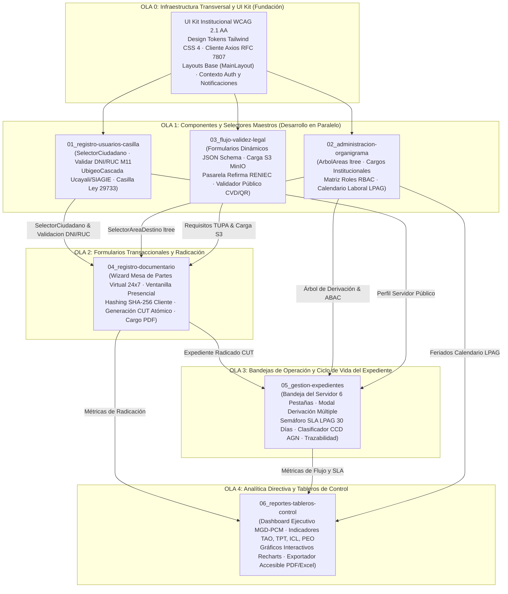

# GUÍA MAESTRA DE ARQUITECTURA: ORDEN DE IMPLEMENTACIÓN FRONTEND EN PARALELO
## Sistema Integral de Gestión Documentaria (SIGD) · IESTP "Suiza" (Pucallpa, Perú)
**Programa de Estudios:** Desarrollo de Sistemas de Información (PE DSI) — Semestre 2026-2  
**Código Documental:** `SIGD-FRONT-PARALLEL-WAVE-2026`  
**Autor:** Dirección de Arquitectura Frontend, UX/UI & Auditoría Técnica  
**Estado:** VINCULANTE Y OBLIGATORIO PARA LOS 6 GRUPOS DE TRABAJO FRONTEND  

> 📌 **DOCUMENTO CANÓNICO DE GOBERNANZA TÉCNICA FRONTEND:**  
> Este documento establece la secuencia formal del **Grafo Acíclico Dirigido (DAG)** para el desarrollo de componentes, layouts y vistas SPA en **React 19**, **TypeScript 5.9**, **Tailwind CSS 4**, **React Router v7** y **TanStack Query v5**. Resuelve de manera definitiva el acoplamiento de formularios y los cuellos de botella entre los 21 desarrolladores frontend del IESTP "Suiza".
>
> 🔗 **Documentos Complementarios Vinculantes:**
> - 📘 [Plan de Trabajo General, Blueprint de Arquitectura y Plantillas Frontend](PLAN_DE_TRABAJO_GENERAL_FRONTEND_SIGD.md)
> - 📋 [Informe de Auditoría Técnica y Diagnóstico Forense Frontend](INFORME_AUDITORIA_DOCUMENTACION_FRONTEND.md)
> - 🎓 [Plan de Trabajo Modular y Rúbrica Docente de Evaluación Vigesimal](PLAN_DE_TRABAJO_MODULAR_Y_EVALUACION_DOCENTE.md)
> - 🏛️ [Guía Maestra de Arquitectura Backend en Paralelo](../../backend/docs/00_ARQUITECTURA_ORDEN_IMPLEMENTACION_PARALELO.md)
> - 🗂️ [Portal Maestro de Documentación Técnica Frontend](README.md)

---

## 📑 ÍNDICE GENERAL EXHAUSTIVO

1. [Diagnóstico de Dependencias de Componentes y Desacoplamiento de Interfaz](#1-diagnóstico-de-dependencias-de-componentes-y-desacoplamiento-de-interfaz)
   - 1.1 El Bloqueo Tradicional de Formularios Transaccionales sin Selectores Maestros
   - 1.2 La Jerarquía de Composición UI: Átomos, Moléculas, Organismos y Vistas
   - 1.3 Solución Mediante DAG de Componentes y Props Contracts
2. [Modelo Rector de 5 Olas (Waves) para Desarrollo Frontend en Paralelo](#2-modelo-rector-de-5-olas-waves-para-desarrollo-frontend-en-paralelo)
   - 2.1 Grafo Acíclico Dirigido de Componentes (Diagrama Mermaid)
   - 2.2 Flujo de Propagación de Estados y Eventos de Interfaz
3. [Matriz Canónica de Sincronización: Frontend ↔ Backend ↔ Equipos](#3-matriz-canónica-de-sincronización-frontend--backend--equipos)
4. [Especificación Técnica Exhaustiva de Componentes, Vistas y Precedencia por Ola](#4-especificación-técnica-exhaustiva-de-componentes-vistas-y-precedencia-por-ola)
   - [4.0 Ola 0 / Prioridad 0: Fundación Común (UI Kit, Tokens, Axios RFC 7807, Layouts)](#40-ola-0--prioridad-0-fundación-común-ui-kit-tokens-axios-rfc-7807-layouts)
   - [4.1 Ola 1 / Prioridad 1A: Módulo 01 — Registro de Usuarios, Identidad y Casilla (`01_registro-usuarios-casilla/`)](#41-ola-1--prioridad-1a-módulo-01--registro-de-usuarios-identidad-y-casilla-01_registro-usuarios-casilla)
   - [4.2 Ola 1 / Prioridad 1B: Módulo 02 — Administración Institucional, RBAC y Auditoría (`02_administracion-seguridad-auditoria/`)](#42-ola-1--prioridad-1b-módulo-02--administración-institucional-rbac-y-auditoría-02_administracion-seguridad-auditoria)
   - [4.3 Ola 1 / Prioridad 1C: Módulo 03 — Flujos Académicos, Firma Digital y Validez Legal (`03_flujo-validez-legal/`)](#43-ola-1--prioridad-1c-módulo-03--flujos-académicos-firma-digital-y-validez-legal-03_flujo-validez-legal)
   - [4.4 Ola 2 / Prioridad 2: Módulo 04 — Registro Documentario, Ventanilla y Mesa de Partes (`04_registro-documentario/`)](#44-ola-2--prioridad-2-módulo-04--registro-documentario-ventanilla-y-mesa-de-partes-04_registro-documentario)
   - [4.5 Ola 3 / Prioridad 3: Módulo 05 — Bandejas del Funcionario y Gestión de Expedientes (`05_gestion-expedientes/`)](#45-ola-3--prioridad-3-módulo-05--bandejas-del-funcionario-y-gestión-de-expedientes-05_gestion-expedientes)
   - [4.6 Ola 4 / Prioridad 4: Módulo 06 — Indicadores de Gestión, KPIs MGD y Tableros Directivos (`06_reportes-tableros-control/`)](#46-ola-4--prioridad-4-módulo-06--indicadores-de-gestión-kpis-mgd-y-tableros-directivos-06_reportes-tableros-control)
5. [Estrategia de Mocking y Server State con TanStack React Query v5](#5-estrategia-de-mocking-y-server-state-con-tanstack-react-query-v5)
   - 5.1 Definición de Contratos de Props y Tipos TypeScript (`src/types/`)
   - 5.2 Hooks Reactivos con Fixtures JSON Locales (`VITE_ENABLE_MOCKS=true`)
   - 5.3 Mapeo Centralizado de Excepciones RFC 7807 a Toasts Accesibles
6. [Criterios de Accesibilidad Universal (WCAG 2.1 AA) y Regla LPAG 16:30 hrs](#6-criterios-de-accesibilidad-universal-wcag-21-aa-y-regla-lpag-1630-hrs)
7. [Rúbrica Pedagógica de Evaluación Vigesimal (174 Story Points)](#7-rúbrica-pedagógica-de-evaluación-vigesimal-174-story-points)
8. [Reglas Vinculantes de Gobernanza Git y Convenciones de Commits](#8-reglas-vinculantes-de-gobernanza-git-y-convenciones-de-commits)

---

## 1. DIAGNÓSTICO DE DEPENDENCIAS DE COMPONENTES Y DESACOPLAMIENTO DE INTERFAZ

### 1.1 El Bloqueo Tradicional de Formularios Transaccionales sin Selectores Maestros
En la construcción de aplicaciones Single Page Applications (SPA) de alta complejidad administrativa, la creación de vistas transaccionales sin componentes de selección maestros genera un acoplamiento crítico:
* **El Caso de la Mesa de Partes Virtual (Módulo 4):**  
  El formulario de ingreso documental requiere tres selectores que pertenecen a otros subdominios:
  1. *Búsqueda y Registro del Administrado:* Consulta en vivo de DNI/RUC o creación express de cuenta (perteneciente a `01_registro-usuarios-casilla`).
  2. *Destino Institucional:* Selector jerárquico del área de destino en cascada (perteneciente a `02_administracion-seguridad-auditoria`).
  3. *Requisitos y Plantilla TUPA:* Selección del trámite con descarga de plantillas oficiales y validación esquemática (perteneciente a `03_flujo-validez-legal`).
* Si el equipo de Mesa de Partes (Grupo 1) programaba su pantalla antes de que los componentes maestros existiesen, se veía forzado a crear selectores simulados con estructuras incompatibles, obligando a una costosa refactorización posterior.

### 1.2 La Jerarquía de Composición UI: Átomos, Moléculas, Organismos y Vistas
El SIGD adopta una arquitectura basada en **Atomic Design**:
$$\text{Tokens / Átomos (Ola 0)} \longrightarrow \text{Selectores Maestros (Ola 1)} \longrightarrow \text{Wizards Transaccionales (Ola 2)} \longrightarrow \text{Bandejas de Despacho (Ola 3)} \longrightarrow \text{Dashboards (Ola 4)}$$

### 1.3 Solución Mediante DAG de Componentes y Props Contracts
Al modelar el desarrollo como un Grafo Acíclico Dirigido, cada componente expone un contrato de propiedades (`Props Contract`) estrictamente tipado con TypeScript. Esto permite que los sub-equipos puedan importar stubs funcionales que devuelven estructuras idénticas a las que posteriormente entregarán las vistas integradas.

---

## 2. MODELO RECTOR DE 5 OLAS (WAVES) PARA DESARROLLO FRONTEND EN PARALELO

### 2.1 Grafo Acíclico Dirigido de Componentes (Diagrama Mermaid)



### 2.2 Flujo de Propagación de Estados y Eventos de Interfaz
1. **Ola 0:** Establece el tema institucional, los estilos globales de Tailwind CSS 4 y el cliente HTTP de Axios con manejo de correlación y errores.
2. **Ola 1:** Expone componentes autónomos que no dependen de la existencia de expedientes: modales de login, selectores de personas, árboles de áreas y previsualizadores de firmas.
3. **Ola 2:** Agrupa los selectores de la Ola 1 dentro del formulario paso a paso (*Wizard*) de radicación, gestionando la subida desacoplada a MinIO y el sellado del cargo.
4. **Ola 3:** Despliega el entorno de gestión diaria del servidor, consumiendo el CUT generado en la Ola 2 y permitiendo la derivación y despacho.
5. **Ola 4:** Renderiza tableros de control ejecutivos y tablas multicriterio agregadas para la toma de decisiones directivas.

---

## 3. MATRIZ CANÓNICA DE SINCRONIZACIÓN: FRONTEND ↔ BACKEND ↔ EQUIPOS

```
+-------------------------------------------------------------------------------------------------------------------------------------------------------+
|                                    MATRIZ MAESTRA DE INTEGRACIÓN FRONTEND ↔ BACKEND (IESTP "SUIZA")                                                   |
+-----+-----------------------------------------+---------------------+-------------------------------+---------------------------------+-------+
| OLA | CARPETA FRONTEND / VISTAS               | MÓDULO BACKEND      | SUB-EQUIPO RESPONSABLE        | PANTALLAS CLAVE Y COMPONENTES   | SP    |
+-----+-----------------------------------------+---------------------+-------------------------------+---------------------------------+-------+
| **0**| **`src/shared/` & `src/components/ui/`**| **`00_corelink/`**  | Transversal                   | Design Tokens institucional,    | —     |
|     | Design System, Axios con RFC 7807,      | `sigd_audit`        | Urquia López (Líder General)  | interceptor `X-Correlation-ID`, |       |
|     | Layouts (MainLayout, Sidebar, Navbar)   |                     |                               | componentes Button, Input, Modal|       |
+-----+-----------------------------------------+---------------------+-------------------------------+---------------------------------+-------+
| **1A**| **`01_registro-usuarios-casilla/`**   | **`01_identicore/`**| Grupo 2 (Frontend) / G4 (Back)| `WizardRegistroCiudadano.tsx`,  | 26 SP |
|     | Login, Registro Ciudadano, Casilla      | `sigd_auth`         | Matías Zumaeta (Líder),       | `SelectorUbigeoCascada.tsx`,    |       |
|     | Digital, Selector de Ubigeo en Cascada  |                     | Serruche, Angel Jesus, Curto  | `CasillaElectronicaBandeja.tsx` |       |
+-----+-----------------------------------------+---------------------+-------------------------------+---------------------------------+-------+
| **1B**| **`02_administracion-seguridad-auditoria/`** **`02_organicore/`**| Grupo 4 (Frontend) / G3 (Back)| **7 pantallas en React 19:**    | 28 SP |
|     | Árbol de Áreas, Cargos Institucionales, | `sigd_org`          | Jhonatan Gonzales (Líder),    | Hub Admin, Usuarios, RBAC,      |       |
|     | Directorio de Personal, Matriz RBAC     |                     | Gato, Maxin, Cristiam Macedo  | Bitácora WORM, Calendario LPAG  |       |
+-----+-----------------------------------------+---------------------+-------------------------------+---------------------------------+-------+
| **1C**| **`03_flujo-validez-legal/`**          | **`03_docucore/`**  | Grupo 5 (Frontend) / G5 (Back)| `GeneradorFormulariosJSON.tsx`, | 29 SP |
|     | Diseñador Formularios Dinámicos JSON,   | `sigd_doc`          | Adriano Espinoza (Líder),     | `ProyectorResoluciones.tsx`,    |       |
|     | Carga S3 Prefirmada, Validador CVD/QR   |                     | Isaí, Mayra                   | `ValidadorPublicoCVDPage.tsx`   |       |
+-----+-----------------------------------------+---------------------+-------------------------------+---------------------------------+-------+
| **2**| **`04_registro-documentario/`**         | **`04_tramicore/`** | Grupo 1 (Frontend) / G2 (Back)| `MesaPartesVirtualPage.tsx`,    | 34 SP |
|     | Mesa de Partes Virtual, Ventanilla,     | `sigd_tra`          | Patricia Marina (Patty Líder),| `VentanillaPresencialPage.tsx`, |       |
|     | Emisión de Cargo Digital, Catálogo TUPA |                     | Noelia, Lucy, Anllely         | `DropzoneCargaMinIO.tsx`, Cargo |       |
+-----+-----------------------------------------+---------------------+-------------------------------+---------------------------------+-------+
| **3**| **`05_gestion-expedientes/`**           | **`05_rutadoc/`**   | Grupo 3 (Frontend) / G1 (Back)| `BandejaServidorPage.tsx` 6 tabs| 28 SP |
|     | Bandeja 6 Pestañas, Modal Derivación,   | `sigd_rut`          | Isack Vargas (Líder),         | `ModalDerivacionExpediente.tsx`,|       |
|     | Historial Movimientos, Semáforo SLA     |                     | Willfredo Soria, Piero Bartra | `SemaforoPlazoLPAGBadge.tsx`    |       |
+-----+-----------------------------------------+---------------------+-------------------------------+---------------------------------+-------+
| **4**| **`06_reportes-tableros-control/`**     | Capa Analítica      | Grupo 6 (Frontend) / G6 (Back)| `DashboardEjecutivoMGDPage.tsx`,| 29 SP |
|     | Dashboard KPIs MGD-PCM (TAO, TPT, ICL), | Vistas Agregadas    | Clider Urquia (Líder),        | `GraficosRecharts.tsx`,         |       |
|     | Accesibilidad Universal WCAG 2.1 AA     |                     | Vargas, Gatica, Barbaran      | `ExportadorReportes.tsx`        |       |
+-----+-----------------------------------------+---------------------+-------------------------------+---------------------------------+-------+
|TOTAL| 6 Módulos Funcionales + Plataforma Base | 6 Esquemas PG18     | 21 Estudiantes Frontend PE DSI| 32 Entregables Atómicos         | 174 SP|
+-----+-----------------------------------------+---------------------+-------------------------------+---------------------------------+-------+
```

---

## 4. ESPECIFICACIÓN TÉCNICA EXHAUSTIVA DE COMPONENTES, VISTAS Y PRECEDENCIA POR OLA

### 4.0 Ola 0 / Prioridad 0: Fundación Común (UI Kit, Tokens, Axios RFC 7807, Layouts)
* **Liderazgo Técnico:** Fernando Urquia López (*Líder General*) en coordinación transversal con todos los líderes de grupo.
* **Directorio de Código:** `src/shared/`, `src/api/`, `src/components/`, `src/layouts/`.
* **Misión Arquitectónica:** Suministrar el andamiaje transversal: cliente HTTP robusto, tratamiento automatizado de errores, tokens de estilo institucional y navegación base.

#### Componentes Clave:
1. `src/api/client.ts`:  
   - Instancia tipada de Axios con interceptor de solicitud que inyecta automáticamente el token JWT Bearer (`Authorization: Bearer <token>`) y cabecera de rastreo `X-Correlation-ID`.
   - Interceptor de respuesta que captura payloads compatibles con RFC 7807 (`ApiProblemDetails`) y despacha alertas accesibles Toast automáticas para códigos 400, 401, 403, 404, 409 y 422.
2. `src/layouts/MainLayout.tsx`:  
   - Layout SPA responsivo con barra superior (`Navbar`), barra lateral colapsable (`Sidebar`) con control de roles (RBAC) y contenedor de vistas con breadcrumbs dinámicos.
3. **Design Tokens en Tailwind CSS 4:**  
   - Paleta cromática oficial del IESTP "Suiza":
     * Azul Institucional Primario: `#1E3A8A` (Tailwind `blue-900`)
     * Verde Amazónico Secundario: `#059669` (Tailwind `emerald-600`)
     * Rojo Estado / Alerta: `#DC2626` (Tailwind `red-600`)
     * Fondo Neutro de Trabajo: `#F8FAFC` (Tailwind `slate-50`)
     * Contraste garantizado $\ge 4.5:1$ sobre texto normal.

---

### 4.1 Ola 1 / Prioridad 1A: Módulo 01 — Registro de Usuarios, Identidad y Casilla (`01_registro-usuarios-casilla/`)
* **Liderazgo Técnico:** Matías Zumaeta (Líder), Sergio Serruche, Ángel Jesús Vásquez, Carito Curto (*Grupo 2 Frontend*).
* **Carga Académica:** 26 Story Points (5 entregables atómicos).
* **Sincronización Backend:** Esquema `sigd_auth` (IdentiCore).
* **Misión Arquitectónica:** Proveer la interfaz para la identificación de administrados, validación de identidad en línea, selector geográfico territorial y la Casilla Electrónica oficial con validez jurídica bajo la Ley N° 29733.

#### Artefactos y Especificaciones en `01_registro-usuarios-casilla/`:
1. 🎯 [`00_plan_de_trabajo_y_evaluacion_docente.md`](01_registro-usuarios-casilla/00_plan_de_trabajo_y_evaluacion_docente.md):  
   - Desglose de tareas: autenticación, validación DNI/RUC, selector Ubigeo, bandeja de casilla y consentimiento de datos.
2. 👤 [`01_registro_ciudadano_persona_natural_juridica.md`](01_registro-usuarios-casilla/01_registro_ciudadano_persona_natural_juridica.md):  
   - Componente `WizardRegistroCiudadano.tsx`: asistente de 3 pasos (Tipo de Persona $\rightarrow$ Validación de Identidad $\rightarrow$ Credenciales y Consentimiento).
   - Componente `ValidadorDocumentoIdentidad.tsx`: consulta en vivo con debounce (300 ms) para DNI (8 dígitos) y RUC (11 dígitos, algoritmo Módulo 11).
   - Captura de consentimiento informado obligatorio (Ley N° 29733) con modal de términos y condiciones.
3. 🗺️ [`02_ubigeo_cascada_ucayali_siagie.md`](01_registro-usuarios-casilla/02_ubigeo_cascada_ucayali_siagie.md):  
   - Componente `SelectorUbigeoCascada.tsx`: cuatro selectores anidados (Departamento $\rightarrow$ Provincia $\rightarrow$ Distrito $\rightarrow$ Centro Poblado) con caché en memoria de las 4 provincias de Ucayali (Coronel Portillo, Atalaya, Padre Abad, Purús) y homologación con códigos INEI/SIAGIE.
4. 📬 [`03_casilla_electronica_y_ley_29733.md`](01_registro-usuarios-casilla/03_casilla_electronica_y_ley_29733.md):  
   - Componente `CasillaElectronicaBandeja.tsx`: buzón de notificaciones administrativas con estado de lectura, cómputo del acuse formal de recibo con marca temporal legal y visor de cédulas notificatorias.

---

### 4.2 Ola 1 / Prioridad 1B: Módulo 02 — Administración Institucional, RBAC y Auditoría (`02_administracion-seguridad-auditoria/`)
* **Liderazgo Técnico:** Jhonatan Gonzales (Líder), Brayan Gato, Leonel Rivera Maxin, Cristian Macedo (*Grupo 4 Frontend*).
* **Carga Académica:** 28 Story Points (6 entregables atómicos).
* **Sincronización Backend:** Esquema `sigd_org` (OrganiCore).
* **Misión Arquitectónica:** Gestionar la gobernanza institucional: sedes, organigrama jerárquico `ltree`, perfiles y permisos RBAC, bitácora forense de eventos inmutables y cómputo de plazos LPAG con corte diario a las 16:30 hrs.

#### Artefactos y Especificaciones en `02_administracion-seguridad-auditoria/`:
1. 🎯 [`00_plan_de_trabajo_y_evaluacion_docente.md`](02_administracion-seguridad-auditoria/00_plan_de_trabajo_y_evaluacion_docente.md):  
   - Desglose de pantallas, rúbrica de calificación y avance verificado.
2. 🏛️ [`01_descripcion_general_administracion.md`](02_administracion-seguridad-auditoria/01_descripcion_general_administracion.md):  
   - Panel Hub principal (`AdministracionPage.tsx`), navegación modular de gobernanza y directivas DSI.
3. 🗂️ [`02_tablas_maestras_y_catalogos.md`](02_administracion-seguridad-auditoria/02_tablas_maestras_y_catalogos.md):  
   - Pantalla `TablasMaestrasPage.tsx`: gestión interactiva del árbol de áreas (representación visual del path `ltree` con nodos colapsables), sedes del instituto, cargos y procedimientos TUPA.
4. 🛡️ [`03_control_acceso_roles_permisos_rbac.md`](02_administracion-seguridad-auditoria/03_control_acceso_roles_permisos_rbac.md):  
   - Pantalla `RolesPermisosPage.tsx`: matriz bidimensional de roles vs permisos granulares (Crear, Editar, Derivar, Firmar, Despachar, Archivar).
5. 📜 [`04_logs_auditoria_inmutable_trazabilidad.md`](02_administracion-seguridad-auditoria/04_logs_auditoria_inmutable_trazabilidad.md):  
   - Pantalla `AuditoriaPage.tsx`: visor de bitácora forense con filtros por `x-correlation-id`, usuario, entidad afectada, IP y rango de fechas.
6. 👥 [`05_directorio_usuarios_y_seguridad_acceso.md`](02_administracion-seguridad-auditoria/05_directorio_usuarios_y_seguridad_acceso.md):  
   - Pantallas `UsuariosPage.tsx` y `SeguridadPage.tsx`: control de ciclo de vida de usuarios institucionales, bloqueo por intentos fallidos y políticas de contraseñas seguras.
7. 📅 [`06_calendario_laboral_y_jornada_lpag.md`](02_administracion-seguridad-auditoria/06_calendario_laboral_y_jornada_lpag.md):  
   - Pantalla `CalendarioLaboralPage.tsx`: calendario interactivo de feriados y días inhábiles con regla estricta de corte diario a las 16:30 hrs conforme al TUO de la Ley N° 27444.

> ⭐ **Logro Técnico Institucional Verificado:** El Módulo 02 cuenta con sus **7 pantallas plenamente codificadas e integradas en React 19** (`src/pages/administracion/`, PR #75, commit `4ec0c3a`), sirviendo de modelo de referencia arquitectónica para el resto de grupos.

---

### 4.3 Ola 1 / Prioridad 1C: Módulo 03 — Flujos Académicos, Firma Digital y Validez Legal (`03_flujo-validez-legal/`)
* **Liderazgo Técnico:** Adriano Espinoza (Líder), Isaí Pizango, Mayra García (*Grupo 5 Frontend*).
* **Carga Académica:** 29 Story Points (5 entregables atómicos + DBML).
* **Sincronización Backend:** Esquema `sigd_doc` (DocuCore).
* **Misión Arquitectónica:** Gestionar el ciclo de vida de los documentos oficiales con validez jurídica: renderizado reactivo de formularios dinámicos guiados por JSON Schema, proyección de resoluciones, integración con la pasarela de firma digital Refirma RENIEC y verificación pública mediante CVD y código QR.

#### Artefactos y Especificaciones en `03_flujo-validez-legal/`:
1. 🎯 [`00_plan_de_trabajo_y_evaluacion_docente.md`](03_flujo-validez-legal/00_plan_de_trabajo_y_evaluacion_docente.md):  
   - Plan modular y asignación nominal de entregables.
2. 📋 [`01_descripcion_general_validez_legal.md`](03_flujo-validez-legal/01_descripcion_general_validez_legal.md) y 🎓 [`02_flujos_trabajo_workflow_academico.md`](03_flujo-validez-legal/02_flujos_trabajo_workflow_academico.md):  
   - Mapeo de trámites académicos: expedientes de titulación profesional técnica, convalidación de unidades didácticas, rectificación de matrícula y certificados modulares.
3. 📝 [`03_documentos_oficiales_firma_digital.md`](03_flujo-validez-legal/03_documentos_oficiales_firma_digital.md):  
   - Componente `GeneradorFormulariosJSON.tsx`: motor dinámico que interpreta esquemas JSON Schema Draft 2020-12 y genera inputs validados con Zod en tiempo real.
   - Componente `ProyectorResolucionesDirectorales.tsx`: editor enriquecido con estructura formal (Visto, Considerando, Se Resuelve) y previsualización PDF/A instantánea.
4. 🔏 [`04_validez_legal_y_validador_cvd.md`](03_flujo-validez-legal/04_validez_legal_y_validador_cvd.md):  
   - Componente `PasarelaRefirmaModal.tsx`: protocolo de invocación a la pasarela de firma digital acreditada (IOFE / RENIEC) con verificación de certificado digital y estampado de sello de tiempo criptográfico.
   - Pantalla `ValidadorPublicoCVDPage.tsx`: portal público de consulta de autenticidad documental mediante Código de Verificación Digital (CVD) de 16 caracteres alfanuméricos y escaneo de código QR.
5. 🔌 [`05_arquitectura_tecnica_y_contratos_api.md`](03_flujo-validez-legal/05_arquitectura_tecnica_y_contratos_api.md) y 🖥️ [`06_componentes_interfaz_ui.md`](03_flujo-validez-legal/06_componentes_interfaz_ui.md):  
   - Contratos OpenAPI 3.1 y visor integrado `VisorPDFIntegrado.tsx` basado en `react-pdf` con controles de zoom, rotación y verificación de capas de firma digital.
6. 📊 [`diagrama_flujo_validez_legal.dbml`](03_flujo-validez-legal/diagrama_flujo_validez_legal.dbml):  
   - Modelo relacional en DBML para el almacenamiento de plantillas, metadatos y registros de firma.

---

### 4.4 Ola 2 / Prioridad 2: Módulo 04 — Registro Documentario, Ventanilla y Mesa de Partes (`04_registro-documentario/`)
* **Liderazgo Técnico:** Patricia Marina (Líder), Noelia Alva, Lucy López, Anllely Melgarejo (*Grupo 1 Frontend*).
* **Carga Académica:** 34 Story Points (6 entregables atómicos).
* **Sincronización Backend:** Esquema `sigd_tra` (TramiCore).
* **Misión Arquitectónica:** Construir los puntos de entrada formal al sistema: Mesa de Partes Virtual (MPV 24x7) y Ventanilla Presencial de Atención al Ciudadano, integrando carga desacoplada a MinIO con cálculo de hash criptográfico en cliente, foliación automática y emisión de cargo digital sellado con el CUT institucional.

#### Artefactos y Especificaciones en `04_registro-documentario/`:
1. 🎯 [`00_plan_de_trabajo_y_evaluacion_docente.md`](04_registro-documentario/00_plan_de_trabajo_y_evaluacion_docente.md):  
   - Plan de trabajo y criterios vigesimales de evaluación.
2. ☁️ [`01_arquitectura_tecnica_registro_documentario.md`](04_registro-documentario/01_arquitectura_tecnica_registro_documentario.md):  
   - Arquitectura desacoplada de subida directa a S3/MinIO: el frontend solicita una URL prefirmada (`PUT presigned URL`), calcula el hash SHA-256 del archivo en el cliente mediante la API Web Crypto nativa y realiza el upload directo sin sobrecargar el servidor de Node.js.
3. 📥 [`02_especificacion_funcional_ventanilla_y_mesa_partes.md`](04_registro-documentario/02_especificacion_funcional_ventanilla_y_mesa_partes.md):  
   - Flujo de Ventanilla Presencial: atención rápida en ventanilla física, escaneo inmediato de recaudos y foliación continua.
   - Flujo de Mesa de Partes Virtual 24x7: regla estricta de horario hábil. Si el documento ingresa pasadas las **16:30 hrs** o en día inhábil, se activa un banner legal advirtiendo que el cargo se registrará formalmente con fecha y hora del siguiente día hábil institucional.
4. 🧩 [`03_componentes_ui_y_estados_formulario.md`](04_registro-documentario/03_componentes_ui_y_estados_formulario.md):  
   - Pantalla `MesaPartesVirtualPage.tsx` implementada como un Wizard interactivo de 4 pasos:
     * *Paso 1: Remitente:* Embebe el `SelectorCiudadano` (Ola 1A).
     * *Paso 2: Datos del Trámite:* Asunto, área de destino mediante `SelectorAreaDestino` (Ola 1B) y selección de procedimiento TUPA.
     * *Paso 3: Documento y Anexos:* `DropzoneCargaMinIO.tsx` con barras de progreso individuales y validación de tipos MIME autorizados (PDF, ZIP).
     * *Paso 4: Confirmación y Cargo:* Vista previa del Cargo Oficial sellado con Código Único de Trámite (`EXP-YYYY-XXXXXX`) y botón de descarga directa.

---

### 4.5 Ola 3 / Prioridad 3: Módulo 05 — Bandejas del Servidor y Gestión de Expedientes (`05_gestion-expedientes/`)
* **Liderazgo Técnico:** Isack Vargas (Líder), Willfredo Soria, Piero Bartra (*Grupo 3 Frontend*).
* **Carga Académica:** 28 Story Points (5 entregables atómicos).
* **Sincronización Backend:** Esquema `sigd_rut` (RutaDoc).
* **Misión Arquitectónica:** Proveer el entorno de trabajo operativo diario para docentes, coordinadores y directivos del IESTP "Suiza": bandeja de 6 pestañas de despacho, semáforo de plazos legales de 30 días hábiles (LPAG), derivación múltiple con copias y clasificación archivística según directivas del Archivo General de la Nación (AGN).

#### Artefactos y Especificaciones en `05_gestion-expedientes/`:
1. 🎯 [`00_plan_de_trabajo_y_evaluacion_docente.md`](05_gestion-expedientes/00_plan_de_trabajo_y_evaluacion_docente.md):  
   - Asignación de Story Points y rúbrica de desempeño.
2. 🗃️ [`01_bandeja_trabajo_diario_6_pestanas.md`](05_gestion-expedientes/01_bandeja_trabajo_diario_6_pestanas.md):  
   - Pantalla `BandejaServidorPage.tsx` con navegación por 6 pestañas accesibles:
     * `Recibidos`: Documentos ingresados pendientes de apertura formal.
     * `Pendientes`: Expedientes aceptados en espera de atención.
     * `En Trámite`: Expedientes con proveídos o informes en redacción.
     * `Para Despacho / Firma`: Documentos proyectados listos para estampa digital.
     * `Archivados`: Expedientes resueltos conforme al CCD.
     * `Derivados`: Trazabilidad de documentos remitidos a otras áreas.
   - Componente `SemaforoPlazoLPAGBadge.tsx`: indicador de criticidad de plazo legal LPAG:
     * 🟢 **Verde:** Plazo holgado ($\le 15$ días hábiles transcurridos).
     * 🟡 **Amarillo:** Plazo de advertencia ($16$ a $25$ días hábiles transcurridos).
     * 🔴 **Rojo:** Plazo crítico o vencido ($> 25$ días hábiles transcurridos).
3. 📚 [`02_cuadro_clasificacion_documental_ccd_y_archivistica.md`](05_gestion-expedientes/02_cuadro_clasificacion_documental_ccd_y_archivistica.md):  
   - Componente `ClasificadorCCDArbol.tsx`: taxonomía de series y subseries documentales según directivas del AGN y control inmutable de la foliación correlativa.
4. 🧬 [`03_modelo_datos_typescript_y_trazabilidad_inmutable.md`](05_gestion-expedientes/03_modelo_datos_typescript_y_trazabilidad_inmutable.md):  
   - Componente `ModalDerivacionExpediente.tsx`: formulario modal accesible con selección de destino, tipo de derivación (Original o Copia) y redacción del proveído.
   - Componente `LineaTiempoTrazabilidad.tsx`: visualización gráfica secuencial e inmutable de todos los movimientos y firmas del expediente.

---

### 4.6 Ola 4 / Prioridad 4: Módulo 06 — Indicadores de Gestión, KPIs MGD y Tableros Directivos (`06_reportes-tableros-control/`)
* **Liderazgo Técnico:** Fernando Urquia López (Líder), Lloner Vargas, Daniel Gatica, Christian Barbarán (*Grupo 6 Frontend*).
* **Carga Académica:** 29 Story Points (5 entregables atómicos + DBML).
* **Sincronización Backend:** Capa Analítica Global.
* **Misión Arquitectónica:** Implementar el portal de inteligencia institucional para la Dirección General y Jefaturas del instituto: paneles de control gerencial con visualizaciones estadísticas interactivas de las métricas del Modelo de Gestión Documental de la PCM, filtros multidimensionales y exportación accesible en PDF y Excel.

#### Artefactos y Especificaciones en `06_reportes-tableros-control/`:
1. 🎯 [`00_plan_de_trabajo_y_evaluacion_docente.md`](06_reportes-tableros-control/00_plan_de_trabajo_y_evaluacion_docente.md):  
   - Plan modular y criterios de evaluación.
2. 📊 [`01_descripcion_general_reportes_dashboard.md`](06_reportes-tableros-control/01_descripcion_general_reportes_dashboard.md) y 📈 [`02_catalogo_kpis_y_metricas_institucionales.md`](06_reportes-tableros-control/02_catalogo_kpis_y_metricas_institucionales.md):  
   - Implementación del catálogo oficial de KPIs del Modelo de Gestión Documental (MGD-PCM):
     * **TAO (Tiempo Promedio de Atención Operativa):** Latencia en días hábiles entre ingreso y resolución.
     * **TPT (Tasa de Productividad por Trámite):** Porcentaje de eficacia resolutiva por servidor y por área.
     * **ICL (Índice de Cumplimiento Legal):** Porcentaje de trámites atendidos dentro de los 30 días hábiles LPAG.
     * **PEO (Porcentaje de Expedientes Observados):** Tasa de rechazos o subsanaciones requeridas.
3. 🧮 [`03_fuentes_datos_formulas_matematicas.md`](06_reportes-tableros-control/03_fuentes_datos_formulas_matematicas.md):  
   - Fórmulas matemáticas formales para promedios ponderados y exclusión de feriados mediante cruce con el calendario institucional.
4. 🎨 [`04_diseno_visual_graficos_y_componentes.md`](06_reportes-tableros-control/04_diseno_visual_graficos_y_componentes.md):  
   - Pantalla `DashboardEjecutivoMGDPage.tsx`: cuadrícula reactiva con tarjetas de métricas KPI y gráficos interactivos construidos con Recharts (líneas de tendencia histórica, barras comparativas de carga por programa de estudios y donas de estado documental).
5. ♿ [`05_navegacion_filtros_y_accesibilidad_ux.md`](06_reportes-tableros-control/05_navegacion_filtros_y_accesibilidad_ux.md):  
   - Filtros multicriterio por sede, carrera profesional, tipo de documento y rango de fechas.
   - Componente `ExportadorReportes.tsx`: exportación directa a Excel y generación de reportes ejecutivos en PDF.
6. ⚙️ [`06_arquitectura_frontend_y_plan_pruebas.md`](06_reportes-tableros-control/06_arquitectura_frontend_y_plan_pruebas.md) y 📊 [`diagrama_metricas_dashboard.dbml`](06_reportes-tableros-control/diagrama_metricas_dashboard.dbml):  
   - Arquitectura de renderizado optimizado con virtualización de filas para listas grandes y modelo de datos DBML para agregaciones analíticas.

---

## 5. ESTRATEGIA DE MOCKING Y SERVER STATE CON TANSTACK REACT QUERY V5

Para garantizar que los **6 grupos de desarrollo avancen con total autonomía** sin depender de que los endpoints del backend estén desplegados en staging:

```text
               ┌──────────────────────────────────────────────────┐
               │         Contrato de Datos TypeScript             │
               │   src/types/[modulo].ts & Esquemas de Zod        │
               └────────────────────────┬─────────────────────────┘
                                        │
         ┌──────────────────────────────┴──────────────────────────────┐
         ▼                                                             ▼
┌──────────────────────────────────────┐             ┌──────────────────────────────────────┐
│  Modo Stubs / Desarrollo Aislado     │             │    Modo Integración / Staging Real   │
│  - Fixtures JSON locales tipados     │             │  - Cliente HTTP Axios tipado         │
│  - Retardo de red simulado (300 ms)  │             │  - Endpoints REST PostgreSQL 18      │
│  - Simulación de errores RFC 7807    │             │  - Tratamiento real de sesiones JWT  │
└──────────────────────────────────────┘             └──────────────────────────────────────┘
```

1. **Definición de Contratos de Props y Tipos TypeScript (`src/types/`):**  
   Cada módulo expone sus contratos de datos (`CiudadanoContract`, `AreaLtreeContract`, `ExpedienteTramiteContract`). Toda interacción de componentes se realiza mediante interfaces estrictas, prohibiendo el uso del tipo `any`.
2. **Hooks Reactivos con Fixtures JSON (`VITE_ENABLE_MOCKS=true`):**  
   Los hooks personalizados (`useExpedientes`, `useAreas`, `useTramite`) comprueban la variable de entorno. En modo de desarrollo, retornan datos desde archivos de prueba locales simulando latencia de red y respuestas de error RFC 7807.
3. **Mapeo Centralizado de Excepciones RFC 7807 a Toasts Accesibles:**  
   Cualquier error retornado por la API (`ApiProblemDetails`) es interceptado globalmente en `src/api/client.ts`, proyectando un Toast accesible con el mensaje oficial sin requerir que cada programador escriba lógica de parseo en cada formulario.

---

## 6. CRITERIOS DE ACCESIBILIDAD UNIVERSAL (WCAG 2.1 AA) Y REGLA LPAG 16:30 HRS

La totalidad de los componentes y pantallas desarrolladas deben satisfacer obligatoriamente los lineamientos de gobierno digital y accesibilidad:

1. **Contraste de Color:** Mínimo de **4.5:1** para texto normal y **3:1** para componentes gráficos y botones sobre el fondo institucional.
2. **Navegación Total por Teclado:** Foco visual nítido mediante anillo de enfoque (`focus-visible:ring-2 focus-visible:ring-primary-500`) en todos los controles interactivos, botones y enlaces. Secuencia lógica de tabulación (`Tab` y `Shift+Tab`) y cierre de modales con tecla `Escape`.
3. **Semántica WAI-ARIA:** Modales con atributos `role="dialog"` y `aria-modal="true"`, botones con `aria-label` descriptivos para lectores de pantalla (NVDA, JAWS) y tablas de datos con encabezados `scope="col"`.
4. **Regla de Corte LPAG 16:30 hrs:** Banners informativos visibles y dinámicos que calculan la hora local del navegador y notifican al administrado si su trámite será procesado con fecha del día hábil siguiente.

---

## 7. RÚBRICA PEDAGÓGICA DE EVALUACIÓN VIGESIMAL (174 STORY POINTS)

El rendimiento de los 21 estudiantes de frontend se evalúa conforme a la directiva pedagógica del **Plan de Trabajo Modular y Rúbrica Docente**, aplicando la escala vigesimal peruana (**0 a 20**):

$$\text{Nota Final} = \left( \frac{\text{Story Points Completados}}{\text{Story Points Asignados}} \times 14 \right) + \text{Calidad de Código y Tipado (0-3)} + \text{Accesibilidad WCAG y UX (0-3)}$$

### Distribución de Carga por Módulo y Grupo Académico:

| Sub-Equipo | Líder de Grupo | Módulo Asignado | Carga (SP) | Entregables Evaluados |
| :---: | :--- | :--- | :---: | :---: |
| **Grupo 1** | Patricia Marina | `04_registro-documentario` (TramiCore UI) | **34 SP** | 6 entregables atómicos |
| **Grupo 2** | Matías Zumaeta | `01_registro-usuarios-casilla` (IdentiCore UI) | **26 SP** | 5 entregables atómicos |
| **Grupo 3** | Isack Vargas | `05_gestion-expedientes` (RutaDoc UI) | **28 SP** | 5 entregables atómicos |
| **Grupo 4** | Jhonatan Gonzales | `02_administracion-seguridad-auditoria` (OrganiCore UI) | **28 SP** | 6 entregables atómicos (**7 pantallas React 19 completas**) |
| **Grupo 5** | Adriano Espinoza | `03_flujo-validez-legal` (DocuCore UI) | **29 SP** | 5 entregables atómicos + DBML |
| **Grupo 6** | Fernando Urquia | `06_reportes-tableros-control` (Analítica UI) | **29 SP** | 5 entregables atómicos + DBML |
| **TOTAL** | **6 Sub-Equipos** | **Ecosistema Completo Frontend SIGD** | **174 SP** | **32 Entregables Atómicos** |

---

## 8. REGLAS VINCULANTES DE GOBERNANZA GIT Y CONVENCIONES DE COMMITS

1. **Ramas Personales por Desarrollador (`F_*`):**  
   Cada uno de los 21 desarrolladores frontend trabaja exclusivamente en su rama personal autorizada (ej. `F_MATIAS`, `F_SERGIO`, `F_JESUS`, `F_CURTO`, `F_RIVERA`, `F_CRISTIAM`, `F_ISAI`, `F_MAYRA`, `F_ANLLELY`, `F_NOELIA`, `F_SORIA`, `F_BARTRA`, `F_URQUIA`, `F_VARGAS`, `F_GATICA`, `F_BARBARAN`).
2. **Convención de Commits Semánticos:**  
   Todo commit debe identificar el módulo o componente modificado:
   - `feat(01_registro-usuarios-casilla): selector ubigeo ucayali con debounce`
   - `feat(02_administracion-seguridad-auditoria): matriz rbac interactiva con react 19`
   - `feat(03_flujo-validez-legal): motor de renderizado json schema draft 2020-12`
   - `feat(04_registro-documentario): calculo sha-256 en cliente para dropzone minio`
   - `feat(05_gestion-expedientes): bandeja de 6 pestanas con semaforo lpag`
   - `feat(06_reportes-tableros-control): graficos recharts para tao y tpt directivo`
3. **Prohibición de `any` en TypeScript:**  
   Todo dato debe tiparse mediante contratos estrictos en `src/types/`. Los Pull Requests que contengan declaraciones con tipo `any` serán rechazados automáticamente en la revisión de pares.
