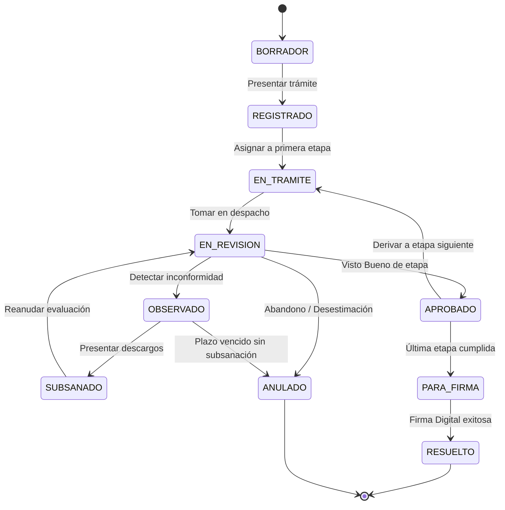

| Metadato | Detalle Institucional |
| :--- | :--- |
| **Código Documental** | SIGD-DOC-FLUJO-VALIDEZ-LEGAL-02 |
| **Módulo** | flujo-validez-legal / Flujo Interno de Trabajo y Validez Legal |
| **Versión** | 1.0.0-PROD |
| **Fecha de Aprobación** | 2026-09-05 |
| **Autores Reconocidos** | Adriano David Espinoza Ramírez, Isaí, Mayra |
| **Estado de Homologación** | Aprobado — Alineado a LPAG Ley N° 27444 y React 19 |

# 02. Flujos de Trabajo (Workflow Académico-Administrativo)

## 1. Introducción y Enfoque de Dominio IESTP

El Módulo de Flujos de Trabajo automatiza la circulación de expedientes y actuaciones documentarias dentro del IESTP "Suiza". A diferencia de un gestor de correspondencia plana, el SIGD implementa un enrutador inteligente que refleja fielmente la gobernanza institucional y los requisitos académicos de la educación técnica superior:

1. **Secretaría Académica:** Unidad encargada de la verificación de méritos formativos, planes de estudios, créditos acumulados, horas de Prácticas Preprofesionales / Experiencias Formativas en Situaciones Reales de Trabajo (EFSRT) y constancias de no adeudo de libros o instrumentos de taller.
2. **Dirección de Administración:** Unidad responsable de la fiscalización financiera, verificación de comprobantes de pago de tasas oficiales en la cuenta del Banco de la Nación institucional y constancia de no adeudo de bienes patrimoniales.
3. **Dirección General:** Máxima autoridad ejecutiva del instituto, facultada por la Ley de Institutos y Escuelas de Educación Superior (Ley N° 30512) para emitir Resoluciones Directorales, visar actas oficiales y conferir títulos en nombre de la Nación.

---

## 2. Tipología de Procedimientos Modelados

| Código Procedimiento | Tipo de Trámite | Instancias / Secuencia Obligatoria | Documento Resolutivo Final | SLA Estándar |
| :--- | :--- | :--- | :--- | :--- |
| **PROC-ACA-01** | Solicitud de Título Profesional Técnico | Mesa de Partes → Sec. Académica → Administración → Dirección General | Resolución Directoral de Titulación + Diploma | 30 días hábiles |
| **PROC-ACA-02** | Certificado Oficial de Estudios | Mesa de Partes → Sec. Académica → Administración → Dirección General | Certificado Oficial en Papel de Seguridad / PDF con CVD | 7 días hábiles |
| **PROC-ACA-03** | Acta Consolidada de Evaluación Semestral | Docente / Coordinación de Carrera → Sec. Académica → Dirección General | Acta Oficial de Calificaciones con Firma Digital | 5 días hábiles |
| **PROC-ADM-04** | Resolución Directoral General (Ingreso, Convalidación, Licencia) | Área Gestora → Sec. Académica → Administración → Asesoría Jurídica → Dirección General | Resolución Directoral Numerada | 15 días hábiles |
| **PROC-ACA-05** | Constancia de Egresado / Matrícula | Mesa de Partes → Sec. Académica → Administración | Constancia Digital con Código QR | 3 días hábiles |

---

## 3. Arquitectura del Recorrido: Solicitud de Título Profesional Técnico

El siguiente diagrama detalla la interacción paso a paso en el trámite más crítico del instituto:

```text
               INICIO: Administrado presenta solicitud vía Web o Ventanilla
                                       │
                                       ▼
                       [Mesa de Partes / Ventanilla]
                       • Verifica requisitos de admisibilidad
                       • Genera Código Único de Trámite (CUT)
                                       │ deriva
                                       ▼
                       [Etapa 1: Secretaría Académica]
                       • Verifica plan de estudios y notas aprobatorias
                       • Valida EFSRT / Prácticas Preprofesionales
                       • Valida constancia de idioma extranjero y TIC
                                       │ aprueba
                                       ▼
                       [Etapa 2: Administración]
                       • Verifica tasa de titulación (Banco de la Nación)
                       • Valida constancia de no adeudo financiero institucional
                                       │ aprueba
                                       ▼
                       [Etapa 3: Dirección General]
                       • Revisa dictamen favorable conjunto
                       • Emite y firma digitalmente la Resolución Directoral
                       • Suscribe el Diploma / Título en formato digital
                                       │
                                       ▼
                 FIN: Expedición con Validez Legal y Notificación a Casilla
```

*Regla de Invarianza:* Si en cualquier etapa se identifica una inconformidad (p. ej., discrepancia de créditos o falta de voucher), el trámite se transfiere al estado `OBSERVADO` con notificación inmediata al administrado, otorgando un plazo perentorio de subsanación de hasta diez (10) días hábiles (Art. 136 LPAG).

---

## 4. Máquina de Estados Finitos (FSM de 10 Estados)

El ciclo de vida de todo trámite se rige estrictamente por una máquina de estados determinista compuesta por 10 estados formales:



### Definición Detallada de Estados

1. **`BORRADOR`:** El usuario solicitante o la unidad interna está componiendo la solicitud y cargando requisitos previos. No genera CUT oficial.
2. **`REGISTRADO`:** El expediente ingresó formalmente por Mesa de Partes Presencial o Virtual; cuenta con CUT (`EXP-YYYY-XXXXXX`) y fecha/hora cierta sellada.
3. **`EN_TRAMITE`:** El expediente ha sido despachado y se encuentra en la cola de asignación de la unidad orgánica correspondiente.
4. **`EN_REVISION`:** Un especialista o directivo de la unidad ha abierto el expediente para su análisis técnico, legal o académico.
5. **`OBSERVADO`:** Se constató omisión formal o sustancial. Se emite Pliego de Observaciones y se congela el plazo SLA de la entidad.
6. **`SUBSANADO`:** El administrado ingresó los documentos correctivos requeridos. El expediente retorna al evaluador para comprobación.
7. **`APROBADO`:** La etapa operativa actual emitió opinión técnica favorable y firmó la visación correspondiente.
8. **`PARA_FIRMA`:** Se generó el documento oficial en PDF/A y se encuentra en la bandeja criptográfica de la autoridad titular.
9. **`RESUELTO` / `FINALIZADO`:** Acto administrativo promulgado con firma digital, sello de tiempo y CVD público. Trámite concluido con eficacia jurídica.
10. **`ANULADO` / `CANCELADO`:** Trámite extinguido por desistimiento formal del administrado, caducidad del plazo de subsanación o improcedencia insubsanable.

---

## 5. Parámetros de Plazos y Cómputo de Términos (LPAG Ley N° 27444)

Conforme a los Arts. 142 y siguientes del TUO de la Ley N° 27444:

1. **Días Hábiles:** El cómputo de términos se efectúa exclusivamente en días hábiles (lunes a viernes), excluyendo feriados nacionales, días no laborables decretados por el Gobierno Central y festividades locales de la Región Ucayali (p. ej., San Juan, Aniversario de Pucallpa).
2. **Horario de Operación Institucional:** La jornada oficial rige de **08:00 a 17:00 horas (Zona horaria `America/Lima`)**.
3. **Corte de Recepción Diaria (16:30 hrs):** Todo trámite o subsanación ingresado después de las **16:30 horas** de un día hábil se considera formalmente presentado a las **08:00 horas del día hábil inmediato siguiente** a efectos del inicio del cómputo de plazos.
4. **Alertas Semafóricas de Plazo:**
   - **Verde (En plazo):** Consumo < 60% del SLA configurado.
   - **Ámbar (Próximo a vencer):** Consumo entre 60% y 85% del SLA.
   - **Rojo (Vencido / En riesgo de silencio administrativo):** Consumo > 85% o fecha límite sobrepasada.

---

## 6. Especificación de la Bandeja de Trabajo (Inbox)

La interfaz de usuario implementa el patrón **Bandeja de Despacho Asignado** articulado con los permisos RBAC del usuario autenticado:

* **Pestañas Operativas del Inbox:**
  1. *Pendientes:* Trámites en estado `EN_TRAMITE` o `EN_REVISION` asignados al área.
  2. *Observados:* Expedientes con pliego emitido en espera de subsanación externa.
  3. *Para Firma:* Documentos listos para suscripción con certificado digital.
  4. *Históricos / Atendidos:* Archivo pasivo de expedientes resueltos o derivados.
* **Acciones Contextuales en Cabecera de Expediente:**
  - `[Tomar en Revisión]`: Transiciona a `EN_REVISION` y bloquea la edición simultánea por otros operadores.
  - `[Derivar]`: Abre modal de transferencia con selección de unidad de destino y proveído de trámite.
  - `[Observar]`: Despliega formulario tipificado de inconsistencias y fija plazo normativo de subsanación.
  - `[Aprobar y Continuar]`: Registra visto bueno y transiciona a la siguiente fase o a `PARA_FIRMA`.
  - `[Rechazar / Declarar Improcedente]`: Requiere informe legal o académico adjunto debidamente visado.
