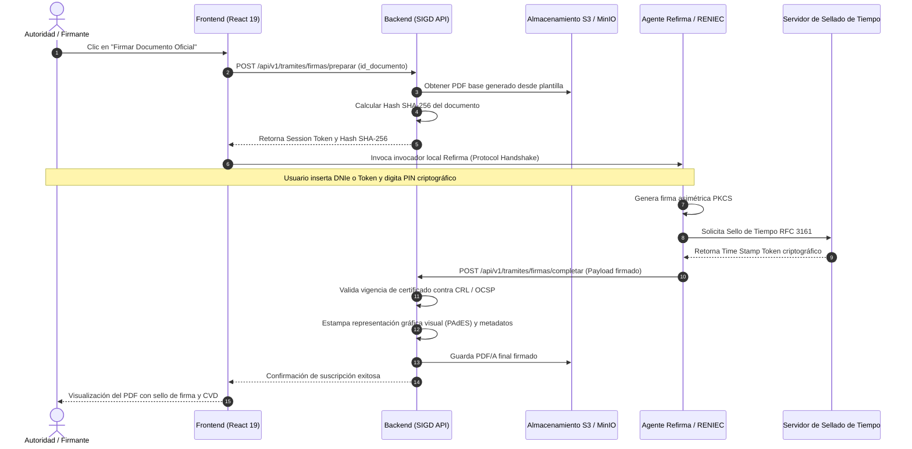

| Metadato | Detalle Institucional |
| :--- | :--- |
| **Código Documental** | SIGD-DOC-FLUJO-VALIDEZ-LEGAL-03 |
| **Módulo** | flujo-validez-legal / Flujo Interno de Trabajo y Validez Legal |
| **Versión** | 1.0.0-PROD |
| **Fecha de Aprobación** | 2026-09-05 |
| **Autores Reconocidos** | Adriano David Espinoza Ramírez, Isaí, Mayra |
| **Estado de Homologación** | Aprobado — Alineado a LPAG Ley N° 27444 y React 19 |

# 03. Documentos Oficiales y Firma Digital

## 1. Introducción y Marco Normativo

Una vez superadas las etapas de revisión y validación administrativa del flujo de trabajo, el sistema genera de forma automatizada los documentos oficiales pertinentes y les confiere plena eficacia jurídica mediante **firma digital**. En las instituciones públicas peruanas, la validez del acto administrativo emitido por medios electrónicos está sujeta al estricto cumplimiento de la Ley N° 27269 (Ley de Firmas y Certificados Digitales), su Reglamento aprobado por D.S. N° 052-2008-PCM y los lineamientos de interoperabilidad de la Infraestructura Oficial de Firma Electrónica (IOFE) administrada por INDECOPI.

---

## 2. Tipología de Actos Administrativos y Documentos Oficiales

En el IESTP "Suiza", los actos y certificaciones oficiales suscritos digitalmente se clasifican en las siguientes categorías:

| Tipo de Documento | Base Legal / Competencia | Firmantes Obligatorios | Efecto Jurídico | Formato Final |
| :--- | :--- | :--- | :--- | :--- |
| **Resolución Directoral (RD)** | Art. 30 Ley N° 30512 | Director(a) General | Acto resolutivo de máxima jerarquía; confiere títulos, designa comisiones, aprueba planes y resuelve recursos. | PDF/A-1b con firma PAdES-BES / PAdES-T |
| **Acta Consolidada de Evaluación** | Directiva Académica DREU / MINEDU | Docente Titular + Secretaria(o) Académica(o) + Director(a) General | Certifica la regularidad del proceso de evaluación y las calificaciones finales del semestre. | PDF/A-1b multifirma criptográfica |
| **Certificado Modular / de Estudios** | Lineamientos Académicos Generales MINEDU | Secretaria(o) Académica(o) + Director(a) General | Acredita competencias técnicas adquiridas y notas históricas con valor transferible interinstitucional. | PDF/A-1b con CVD y código QR |
| **Oficio / Memorando Múltiple** | TUO Ley N° 27444 | Jefes de Área / Directores | Comunicación administrativa oficial externa o interna entre unidades del instituto. | PDF/A-1b firma titular de área |

---

## 3. Diferenciación Jurídica y Criptográfica

| Dimensión | Firma Electrónica Simple | Firma Digital Acreditada (IOFE) |
| :--- | :--- | :--- |
| **Mecanismo Técnico** | Datos biométricos, trazos en pantalla táctil, claves de usuario y contraseñas. | Criptografía asimétrica de clave pública (RSA 2048+ / ECC), resumen criptográfico SHA-256. |
| **Garantía de Integridad** | No garantiza detección certera de modificaciones posteriores. | Detección matemática infalible: cualquier alteración de un bit invalida la firma. |
| **No Repudio** | Débil; requiere peritaje informático y no genera presunción legal. | Absoluto; amparado por presunción legal *iuris tantum* (Art. 5 Ley 27269). |
| **Acreditación** | Proveedores no regulados. | Certificado emitido por Entidad de Certificación acreditada (RENIEC / INDECOPI). |

---

## 4. Integración con Refirma RENIEC y Certificados Oficiales

El SIGD adopta el componente de firma digital **Refirma** (suministrado por el Registro Nacional de Identificación y Estado Civil - RENIEC) o componentes de proveedores acreditados por INDECOPI, garantizando compatibilidad con:

1. **DNI electrónico (DNIe):** Tarjeta inteligente ISO 7816 con chip criptográfico que contiene el certificado de autenticación y firma de la persona natural.
2. **Certificados Digitales en Token USB / Software:** Certificados corporativos o de funcionario público emitidos bajo el estándar X.509 v3 con vigencia anual.
3. **Servicio de Sellado de Tiempo (Time Stamping Authority - TSA):** Inserta en el archivo de firma una marca temporal criptográfica emitida por una entidad acreditada, certificando la fecha y hora oficial nacional de la suscripción.

---

## 5. Diagrama de Secuencia: Proceso Criptográfico de Firma Digital

El siguiente diagrama detalla la arquitectura de integración sin exposición de claves privadas en el navegador:



---

## 6. Representación Gráfica de la Firma (Estampado Visual PDF)

Conforme a la normativa nacional, la firma digital es invisible criptográficamente por naturaleza (estructura binaria embebida en el PDF). Sin embargo, para efectos de legibilidad humana y copias impresas, el sistema inserta una **Representación Gráfica Oficial** en el margen o pie de página del documento:

```text
┌────────────────────────────────────────────────────────────────────────┐
│  ╔══════════════════════════════════════════════════════════════════╗  │
│  ║  FIRMA DIGITAL — IESTP "SUIZA"                                   ║  │
│  ║  Firmante: LIC. JULIO CÉSAR MORI PAREDES                         ║  │
│  ║  Cargo: Director General                                         ║  │
│  ║  Motivo: Autor del Acto Administrativo / Aprobación Institucional ║  │
│  ║  Fecha/Hora: 2026-09-05 11:42:15 -05:00                          ║  │
│  ║  Entidad Emisora: Entidad de Certificación del Estado Peruano    ║  │
│  ║  CVD: CVD-2026-RD-000412-892F                                    ║  │
│  ╚══════════════════════════════════════════════════════════════════╝  │
└────────────────────────────────────────────────────────────────────────┘
```

---

## 7. Requisitos de Seguridad e Invariantes Técnicos

1. **Aislamiento de Claves Privadas:** En ningún caso el frontend solicita, intercepta ni almacena la clave privada o el PIN del usuario firmante. La autenticación y operación criptográfica ocurren en el hardware seguro (DNIe / Token) o en el contenedor cifrado del agente de firma.
2. **Inmutabilidad del Hash:** El backend valida que el hash SHA-256 del documento firmado coincida exactamente con el hash del documento presentado en la vista previa del frontend antes de emitir la resolución.
3. **Control de Versiones:** Cada firma incrementa la versión documental en base de datos. En actas multifirma, cada suscriptor añade una firma secuencial PAdES sin invalidar la anterior.
