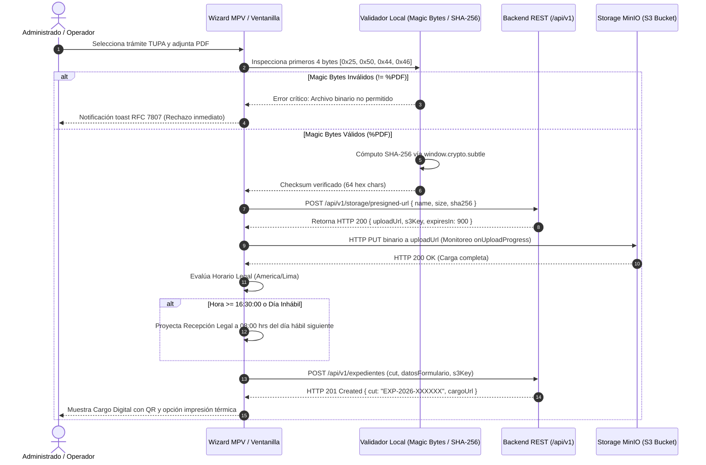

# PLAN DE TRABAJO MODULAR Y EVALUACIÓN DOCENTE: MÓDULO 2
## Registro Documentario, Ventanilla Presencial y Mesa de Partes Virtual (MPV 24x7)
### Sistema Integral de Gestión Documentaria (SIGD) — IESTP "Suiza" (Pucallpa, Ucayali)

---

### METADATOS DEL MÓDULO Y GOBERNANZA DOCENTE
- **Código de Documento:** `SIGD-DOC-M02-PLAN-EVAL-2026`
- **Versión:** `1.0.0 (Edición Modular Definitiva)`
- **Fecha de Emisión:** `2026-09-05`
- **Ciclo Académico:** `2026-2` | **Programa:** `Desarrollo de Sistemas de Información (DSI)`
- **Unidad Didáctica:** `Taller de Programación Web / Proyecto Integrador SIGD`
- **Docente Titular / Product Owner:** `Ing. Renato Henyer Tarazona Flores`
- **Sub-equipo Asignado (Grupo 1):**
  - **Líder de Grupo:** `Patricia Marina (Patty)` (Git: `patricia-marina` / `patriciamarina287` / `F_PATRICIA`)
  - **Desarrolladora UI Kit (Magic Bytes / Cripto / S3):** `Lucy Panduro Ramos` (Git: `panduroramoslucy-ops` / `F_PANDURO`)
  - **Desarrolladora Frontend (Wizard MPV de 4 Pasos):** `Anllely Melgarejo V.` (Git: `Anllely-melgarejo` / `F_ANLLELY`)
  - **Desarrolladora Frontend (Requisitos TUPA y Horario LPAG):** `Noelia Alva` (Git: `noelia-alva` / `F_NOELIA`)
- **Carga de Trabajo Asignada:** `34 Story Points (SP)` distribuidos en 6 entregables atómicos
- **Ubicación Canónica:** `frontend/docs/registro-documentario/00_plan_de_trabajo_y_evaluacion_docente.md`
- **Documento Maestro Institucional:** [PLAN_DE_TRABAJO_MODULAR_Y_EVALUACION_DOCENTE.md](../PLAN_DE_TRABAJO_MODULAR_Y_EVALUACION_DOCENTE.md)

---

## 1. ALCANCE TÉCNICO Y ESPECIFICACIÓN FUNCIONAL DEL MÓDULO 2

El Módulo 2 constituye el núcleo operativo de recepción, calificación formal y radicación de solicitudes en el SIGD. Administra la doble modalidad de ingreso documental: la **Ventanilla Única Presencial** (asistida por operadores en sede Pucallpa) y la **Mesa de Partes Virtual (MPV)** con atención ininterrumpida las 24 horas del día.

Su arquitectura frontend implementa tres requerimientos de máxima exigencia técnica y jurídica:
1. **Regla de Corte LPAG 16:30 hrs:** Evaluación continua de la jornada administrativa según el Art. 138 del TUO de la Ley N° 27444.
2. **Motor Dinámico de Formularios:** Generación reactiva de interfaces a partir de esquemas JSON Schema (Draft 2020-12).
3. **Carga Desacoplada a MinIO/S3:** Subida directa mediante URLs prefirmadas PUT, previa validación binaria de *Magic Bytes* (`%PDF`) y cómputo de resumen criptográfico SHA-256 en cliente.



### 1.1. Componentes Clave de Arquitectura Frontend
1. **Asistente Wizard de 4 Pasos (`src/components/tramite/TramiteWizard.tsx`):**
   - **Paso 1: Identificación:** Carga de datos del solicitante o apoderado con verificación previa de registro en Módulo 1.
   - **Paso 2: Selección de Trámite:** Catálogo TUPA institucional agrupado por familias (Académico, Administrativo, Mesa de Partes Libre).
   - **Paso 3: Formulario Dinámico y Requisitos:** Renderizado reactivo de campos requeridos y componentes de carga de expedientes.
   - **Paso 4: Resumen, Declaración Jurada y Radicación:** Vista preliminar del expediente consolidado, aceptación de términos y envío atómico.
2. **Motor Dinámico JSON Schema Draft 2020-12 (`src/components/tramite/DynamicSchemaForm.tsx`):**
   - Intérprete desacoplado (`src/utils/schemaFormParser.ts`) que procesa la especificación JSON del trámite descargada vía `GET /api/v1/tipos-documentos/:id/formulario-schema`.
   - Soporte para widgets dinámicos: texto simple, números con rango, selects dependientes, fechas con bloqueo de fines de semana y campos de archivo.
   - Validación reactiva sin `any`, emitiendo payload normalizado `Record<string, unknown>` estructurado para PostgreSQL `JSONB`.
3. **Uploader Desacoplado MinIO con Magic Bytes y SHA-256 (`src/components/common/FileUploadDropzone.tsx`):**
   - `magicBytesValidator.ts`: Extrae `file.slice(0, 4)` y verifica la secuencia binaria `[0x25, 0x50, 0x44, 0x46]` (`%PDF`).
   - `cryptoSha256.ts`: Emplea `window.crypto.subtle.digest('SHA-256', arrayBuffer)` para generar el hash inmutable del documento.
   - `usePresignedUpload.ts`: Gestiona el ciclo de vida de la carga a MinIO con barra de progreso porcentual, reintentos exponenciales y aborto controlado (`AbortController`).
4. **Evaluador de Horario de Corte LPAG 16:30 hrs (`src/components/tramite/HorarioCorteNotice.tsx`):**
   - Hook `useHorarioCorte.ts` sincronizado con la hora de red (`America/Lima`).
   - Si la radicación ocurre a partir de las **16:30:00 hrs**, o durante sábados, domingos o feriados de Ucayali:
     - Se informa al administrado mediante un banner preventivo de nivel advertencia (color ámbar WCAG AA).
     - El cargo estampa: `fechaHoraEnvioTecnico` (tiempo real) y `fechaHoraRecepcionOficial` (**08:00:00 hrs del día hábil inmediato posterior**).
5. **Ventanilla Presencial y Emisión de Cargo Dual (`src/pages/tramite/VentanillaPresencialPage.tsx`):**
   - Módulo asistido para el operador institucional con atajos de teclado y autocompletado de administrados frecuentes.
   - **Ticket Térmico POS (80mm / 58mm):** Generado mediante hoja de estilos `@media print` optimizada para impresoras térmicas ESC/POS, conteniendo CUT en código de barras Code128 y QR.
   - **Constancia A4 Oficial:** Documento formal descargable en PDF con código QR y enlace de validación.

---

## 2. CONTRATOS DE INTEGRACIÓN API REST (CANÓNICOS)

El Módulo 2 se integra con los microservicios de almacenamiento y tramitación a través de las siguientes rutas:

| Método | Endpoint URI | Descripción | Request Payload | Response (200 / 201) | Manejo RFC 7807 |
|:---:|---|---|---|---|---|
| `GET` | `/api/v1/tipos-documentos/:id/formulario-schema` | Obtiene JSON Schema del trámite TUPA | Param `id` | `JsonSchemaDraft2020_12` | `404 Not Found` |
| `POST` | `/api/v1/storage/presigned-url` | Genera URL PUT prefirmada hacia MinIO | `PresignedUrlRequestDTO` | `{ uploadUrl, s3Key, expiresIn }` | `400 Bad Request`, `422 Invalid Checksum` |
| `POST` | `/api/v1/expedientes` | Radicación formal y asignación de CUT | `RegistrarExpedienteRequestDTO` | `{ cut, fechaRecepcion, cargoUrl }` | `400 Bad Request`, `409 Conflict`, `422 Unprocessable` |
| `PATCH` | `/api/v1/asientos/:id/anular` | Anulación justificada de asiento registral | `{ motivoAnulacion: string }` | `{ idAsiento, anulado: true }` | `401 Unauthorized`, `403 Forbidden` |

---

## 3. TABLA DE ENTREGABLES ATÓMICOS DE EVALUACIÓN DOCENTE

Matriz de entregables para la calificación del Grupo 1 (34 Story Points):

| Código | Nombre del Entregable | Estudiantes Responsables | Artefactos Concretos en Repositorio | Criterios de Aceptación Objetivos (DoD) | Evidencia Demostrable | Peso % | SP |
|:---:|---|---|---|---|---|:---:|:---:|
| `ENT-M02-01` | **Asistente Wizard de Tramitación de 4 Pasos** | Anllely Melgarejo (R/A)<br>Patricia Marina (R) | `src/components/tramite/TramiteWizard.tsx`<br>`src/components/tramite/WizardStepBar.tsx`<br>`src/hooks/useTramiteWizard.ts`<br>`src/types/tramiteWizard.ts` | 1. Flujo secuencial de 4 pasos con validación bloqueante antes de avanzar.<br>2. Persistencia reactiva del borrador en memoria ante cambios de paso.<br>3. Barra de progreso accesible con indicadores semánticos WCAG 2.1 AA.<br>4. Botones Anterior, Siguiente y Finalizar con gestión de estados de carga. | Wizard operativo en navegador; transición fluida sin pérdida de estado; feedback de error por paso. | 20% | 5 |
| `ENT-M02-02` | **Motor Dinámico de Formularios JSON Schema (Draft 2020-12)** | Patricia Marina (R/A)<br>Lucy Panduro Ramos (C) | `src/components/tramite/DynamicSchemaForm.tsx`<br>`src/utils/schemaFormParser.ts`<br>`src/types/jsonSchema.ts` | 1. Intérprete que renderiza controles UI a partir de esquema JSON descargado de API.<br>2. Soporte para textos, números, selects, fechas y combos anidados.<br>3. Integración con React Hook Form sin uso de `any`.<br>4. Emisión de datos estructurados para columna PostgreSQL `JSONB`. | Formulario que cambia instantáneamente al alternar tipo de trámite TUPA en la UI. | 20% | 8 |
| `ENT-M02-03` | **Carga Desacoplada MinIO/S3 con Magic Bytes y SHA-256** | Lucy Panduro Ramos (R/A)<br>Patricia Marina (R) | `src/components/common/FileUploadDropzone.tsx`<br>`src/hooks/usePresignedUpload.ts`<br>`src/utils/magicBytesValidator.ts`<br>`src/utils/cryptoSha256.ts` | 1. Validación estricta de Magic Bytes `%PDF` (`0x25, 0x50, 0x44, 0x46`) en los primeros 4 bytes del buffer.<br>2. Cómputo local de hash SHA-256 con Web Crypto API.<br>3. Solicitud de URL prefirmada PUT y carga directa a MinIO con barra de progreso.<br>4. Cancelación controlada de subida vía `AbortController`. | Rechazo inmediato al subir archivo `.exe` o `.docx` renombrado a `.pdf`; log con hash SHA-256 verificado. | 25% | 8 |
| `ENT-M02-04` | **Mesa de Partes Virtual con Control de Horario de Corte 16:30 hrs LPAG** | Noelia Alva (R/A)<br>Patricia Marina (R) | `src/pages/tramite/MesaPartesVirtualPage.tsx`<br>`src/components/tramite/HorarioCorteNotice.tsx`<br>`src/hooks/useHorarioCorte.ts` | 1. Verificación automática de la hora oficial peruana (`America/Lima`).<br>2. Si hora $\ge$ 16:30 hrs o día inhábil, despliegue obligatorio de banner ámbar de notificación legal.<br>3. Cálculo exacto de proyección de fecha legal a las 08:00 hrs del día hábil inmediato siguiente (Art. 138 Ley 27444).<br>4. Inclusión de ambos timestamps en la radicación. | Simulación en vivo de hora > 16:30 mostrando el aviso legal; verificación de fecha hábil siguiente. | 15% | 5 |
| `ENT-M02-05` | **Ventanilla Presencial y Generación de Cargo CUT con QR** | Noelia Alva (R/A)<br>Anllely Melgarejo (R) | `src/pages/tramite/VentanillaPresencialPage.tsx`<br>`src/components/tramite/CargoDigitalModal.tsx`<br>`src/components/common/QrCodeView.tsx`<br>`src/types/cargoOficial.ts` | 1. Formulario de atención rápida para operador en ventanilla.<br>2. Generación y visualización del CUT (`EXP-YYYY-XXXXXX`).<br>3. Modal de cargo oficial con código QR dinámico de 200x200px legible por smartphone.<br>4. Estilos de impresión térmica `@media print` para tickets de 80mm/58mm. | Impresión de ticket térmico probada en diálogo de navegador; escaneo de QR funcional hacia URL institucional. | 10% | 5 |
| `ENT-M02-06` | **Suite de Pruebas Automatizadas de Carga y Horario LPAG M2** | Lucy Panduro Ramos (R/A)<br>Anllely Melgarejo (R) | `src/tests/m2/magicBytesValidator.test.ts`<br>`src/tests/m2/horarioCorte.test.ts`<br>`src/tests/m2/tramiteWizard.test.tsx` | 1. Pruebas unitarias de Magic Bytes: buffer legítimo `%PDF` aprobado, buffers falsos rechazados.<br>2. Pruebas unitarias de corte LPAG: 16:29 hrs (mismo día) vs 16:30 hrs (día hábil siguiente).<br>3. Pruebas de integración del wizard de 4 pasos con Vitest.<br>4. Cobertura $\ge 80\%$ sin advertencias. | Ejecución limpia de `npm test` con reporte de cobertura al 100% en verde. | 10% | 3 |
| **TOTAL** | **MÓDULO 1 (GRUPO 1) CONSOLIDADO** | **Grupo 1 Frontend** | **Conjunto de Artefactos de Grupo 1** | **Cumplimiento Integral de Criterios DoD y Ley 27444** | **Demostración en Vivo + Ficha Docente** | **100%** | **34 SP** |

---

## 4. RÚBRICA DE EVALUACIÓN VIGESIMAL DOCENTE (00 A 20 PUNTOS)

### 4.1. Criterios Analíticos por Dimensión
```
[00.0 - 10.9] DEFICIENTE | [11.0 - 13.9] REGULAR | [14.0 - 17.9] BUENO | [18.0 - 20.0] EXCELENTE
```

| Dimensión | Excelente (18.0 - 20.0) | Bueno (14.0 - 17.9) | Regular (11.0 - 13.9) | Deficiente (00.0 - 10.9) |
|---|---|---|---|---|
| **D1: Arquitectura Frontend y Wizard (30% / 6.0 pts)** | **5.4 – 6.0 pts:** Wizard de 4 pasos modular con persistencia limpia; motor JSON Schema robusto que interpreta tipos complejos; UI Kit con Dropzone accesible; cero recargas de página. | **4.2 – 5.3 pts:** Wizard funcional de 4 pasos; formulario dinámico operativo para tipos básicos; Dropzone integrado con feedback visual. | **3.3 – 4.1 pts:** Wizard con pérdida parcial de estado al retroceder; formulario dinámico rígido; componentes acoplados en más de 400 líneas. | **0.0 – 3.2 pts:** Wizard inoperativo o roto; código que no compila; incapacidad de procesar esquemas JSON dinámicos. |
| **D2: Integración REST y Carga MinIO/S3 (30% / 6.0 pts)** | **5.4 – 6.0 pts:** Flujo de carga S3 desacoplado perfecto: validación de cabecera $\rightarrow$ SHA-256 $\rightarrow$ Presigned URL $\rightarrow$ PUT binario con barra porcentual; radicación atómica con CUT; manejo tipado RFC 7807. | **4.2 – 5.3 pts:** Carga S3 mediante Presigned URL operativa; SHA-256 calculado; radicación funcional; manejo de errores estándar. | **3.3 – 4.1 pts:** Carga a S3 síncrona sin monitoreo de progreso; no calcula SHA-256 o lo hace en backend; errores genéricos en toast. | **0.0 – 3.2 pts:** Subida directa multipart por el servidor sin S3; endpoints rotos; omisión de URLs prefirmadas. |
| **D3: Regla de Corte 16:30 y Magic Bytes (20% / 4.0 pts)** | **3.6 – 4.0 pts:** Horario de corte 16:30 hrs LPAG evaluado con precisión de segundos; proyección estricta a 08:00 hrs de día hábil; validación estricta de Magic Bytes (`%PDF`) en cliente; impresión térmica y QR funcionales. | **2.8 – 3.5 pts:** Horario de corte 16:30 hrs operativo; proyección a día hábil correcta; validación de Magic Bytes básica; cargo con QR visible. | **2.2 – 2.7 pts:** Horario de corte con desfase horario (ej. 17:00 hrs) o no excluye feriados; validación solo por extensión `.pdf`; cargo sin QR. | **0.0 – 2.1 pts:** Omisión absoluta de la regla de corte 16:30 hrs (acepta trámites extemporáneos como inmediatos); acepta archivos ejecutables renombrados. |
| **D4: Calidad TypeScript, Pruebas y Git (20% / 4.0 pts)** | **3.6 – 4.0 pts:** Tipado 100% estricto sin tipo `any`; tipos de JSON Schema y S3 bien definidos; suite Vitest $\ge 80\%$ de cobertura; commits atómicos con autoría de las 6 integrantes. | **2.8 – 3.5 pts:** Tipado estricto con excepciones mínimas; pruebas unitarias cubriendo carga y horario (50%-79%); historial Git consistente. | **2.2 – 2.7 pts:** Uso recurrente de `any` en el motor de esquemas; pruebas automatizadas escasas (<50%); commits desbalanceados. | **0.0 – 2.1 pts:** Código plagado de `any`; sin pruebas unitarias; repositorio sin actividad trazable del sub-equipo. |

### 4.2. Penalizaciones Técnicas Específicas de M2
- **`PEN-02` (-2.0 pts):** Incumplimiento del horario de corte LPAG 16:30 hrs (no alertar ni proyectar la fecha legal).
- **`PEN-03` (-2.0 pts):** Omisión de la validación de Magic Bytes (`%PDF`) o ausencia de cómputo del hash SHA-256 en cliente.
- **`PEN-05` (-4.0 pts):** Regresiones de compilación TypeScript (`tsc --noEmit`) o excepciones fatales en runtime.
- **`PEN-06` (-1.0 pt c/u, máx -3.0 pts):** Uso de `any` en los tipos de esquemas dinámicos o DTOs de expediente.

---

## 5. INSTRUMENTO DOCENTE DE EVALUACIÓN INDIVIDUAL (FICHA TÉCNICA)

```markdown
====================================================================================================
               INSTITUTO DE EDUCACIÓN SUPERIOR TECNOLÓGICO PÚBLICO "SUIZA"
           PROGRAMA DE ESTUDIOS: DESARROLLO DE SISTEMAS DE INFORMACIÓN (DSI 2026-2)
       FICHA DOCENTE DE EVALUACIÓN MODULAR: M02 - REGISTRO DOCUMENTARIO Y MESA DE PARTES
====================================================================================================

1. DATOS DE LA ESTUDIANTE Y ENTREGABLES
   - Estudiante Evaluada: _________________________________________________________________________
   - Rol en Grupo 1:    [ ] Líder (Patricia Marina)   [ ] UI Kit / Magic Bytes (Lucy Panduro)
                         [ ] Wizard MPV (Anllely Melgarejo)   [ ] TUPA y Corte LPAG (Noelia Alva)
   - Entregable(s) a Calificar: [ ] ENT-M02-01  [ ] ENT-M02-02  [ ] ENT-M02-03  [ ] ENT-M02-04  [ ] ENT-M02-05  [ ] ENT-M02-06
   - Total Story Points Evaluados: _________ SP   |   Fecha de Sustentación: _____ / _____ / 2026

2. EVALUACIÓN POR DIMENSIONES (00 a 20 pts)
   +-------------------------------------------------------------+----------+--------+-------------+
   | Dimensión Evaluada                                          | Peso (%) | Nota   | Ponderado   |
   +-------------------------------------------------------------+----------+--------+-------------+
   | D1: Arquitectura Frontend, Wizard y Motor JSON Schema       |   30%    | [    ] | [         ] |
   | D2: Integración REST, Carga MinIO/S3 y Manejo RFC 7807      |   30%    | [    ] | [         ] |
   | D3: Regla de Corte LPAG 16:30 hrs y Magic Bytes (%PDF)      |   20%    | [    ] | [         ] |
   | D4: Calidad TypeScript 5.9, Pruebas Vitest y Commits Git    |   20%    | [    ] | [         ] |
   +-------------------------------------------------------------+----------+--------+-------------+
   | SUB-TOTAL PONDERADO (0.0 a 20.0):                                      |        | [         ] |
   +------------------------------------------------------------------------+--------+-------------+

3. PENALIZACIONES APLICADAS
   [ ] PEN-02: Incumplimiento de regla de corte LPAG 16:30 hrs        (-2.0 pts)
   [ ] PEN-03: Omisión de Magic Bytes (%PDF) o hash SHA-256           (-2.0 pts)
   [ ] PEN-05: Regresión de compilación TypeScript                    (-4.0 pts)
   [ ] PEN-06: Uso injustificado de comodín 'any' (__ casos)          (-1.0 pt c/u)
   TOTAL DEDUCCIÓN:                                                                    [-       ]

4. CALIFICACIÓN FINAL Y ACTA
   ┌───────────────────────────────────────────────────────────────────────────────────────────────┐
   │ NOTA FINAL VIGESIMAL (Sub-total - Penalizaciones):                             [         ]     │
   ├───────────────────────────────────────────────────────────────────────────────────────────────┤
   │ ESTADO: [ ] EXCELENTE (18-20)   [ ] BUENO (14-17.9)   [ ] REGULAR (11-13.9)   [ ] DEFICIENTE  │
   │ CONDICIÓN: [ ] APROBADO (>= 13.0)                     [ ] DESAPROBADO (< 13.0)                │
   └───────────────────────────────────────────────────────────────────────────────────────────────┘

5. OBSERVACIONES Y RECOMENDACIONES DOCENTES:
   ________________________________________________________________________________________________

______________________________________               ______________________________________
 Firma del Docente Evaluador (PO)                     Firma de la Estudiante Evaluada
 Ing. Renato Henyer Tarazona Flores
```

---

## 6. HOJA DE RUTA Y PLAN DE SPRINTS DEL SUB-EQUIPO M2

- **Sprint 1 (Semanas 1-2):**
  - Implementación del utilitario criptográfico `magicBytesValidator.ts` e inspección de cabeceras binarias.
  - Implementación de `cryptoSha256.ts` con Web Crypto API.
  - Creación del hook `useHorarioCorte.ts` con cálculo de días hábiles y hora límite 16:30 hrs.
- **Sprint 2 (Semanas 3-4):**
  - Desarrollo del Wizard interactivo de 4 pasos (`TramiteWizard.tsx`).
  - Construcción del parser de esquemas `schemaFormParser.ts` para JSON Schema Draft 2020-12.
  - Conexión del uploader `FileUploadDropzone.tsx` con Presigned URLs de MinIO/S3.
- **Sprint 3 (Semanas 5-6):**
  - Desarrollo de la interfaz de Ventanilla Presencial (`VentanillaPresencialPage.tsx`).
  - Implementación de plantillas de impresión térmica de 80mm y modal con código QR.
  - Suite completa de pruebas en Vitest (`ENT-M02-06`) y sustentación docente.

---

## 7. NAVEGACIÓN Y ENLACES CRUZADOS
- [01_arquitectura_tecnica_registro_documentario.md](01_arquitectura_tecnica_registro_documentario.md): Especificación técnica de JSON Schema, S3 y protocolos de subida.
- [02_especificacion_funcional_ventanilla_y_mesa_partes.md](02_especificacion_funcional_ventanilla_y_mesa_partes.md): Flujos funcionales de ventanilla presencial y virtual.
- [03_componentes_ui_y_estados_formulario.md](03_componentes_ui_y_estados_formulario.md): Árbol de componentes React, Dropzone y modales.
- [Volver al Plan Maestro Institucional](../PLAN_DE_TRABAJO_MODULAR_Y_EVALUACION_DOCENTE.md)
