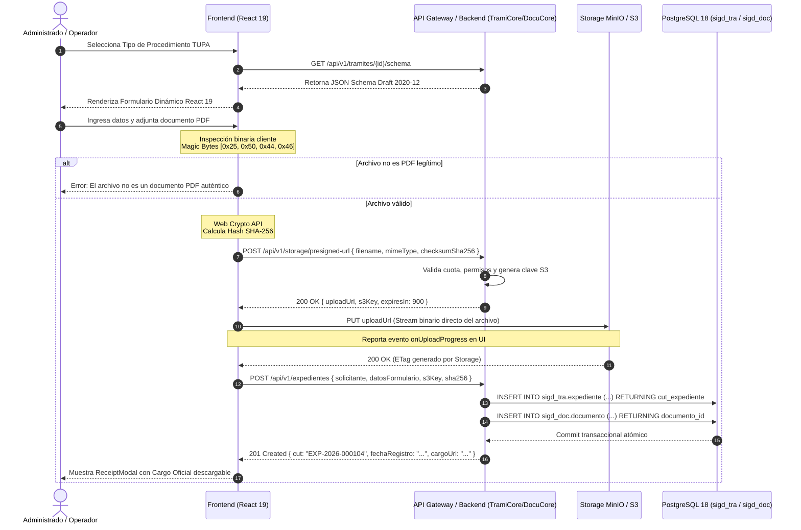

# Arquitectura Técnica e Integración de Almacenamiento Desacoplado — Registro Documentario

| Metadato | Detalle Institucional |
| :--- | :--- |
| **Código Documental** | SIGD-DOC-REGDOC-01 |
| **Módulo** | registro-documentario / Arquitectura Técnica e Integración de Almacenamiento Desacoplado |
| **Versión** | 1.0.0-PROD |
| **Fecha de Aprobación** | 2026-09-05 |
| **Autores Reconocidos** | Patricia Marina (Patty), Noelia Alva, Lucy Panduro Ramos, Anllely Melgarejo |
| **Estado de Homologación** | Aprobado — Alineado a LPAG Ley N° 27444 y React 19 |

---

## 1. Visión General y Objetivos de Ingeniería

El módulo de **Registro Documentario** constituye la puerta de entrada canónica para todo documento, solicitud o expediente administrativo dirigido al Instituto de Educación Superior Tecnológico Público "Suiza" (IESTP "Suiza" — Pucallpa). A nivel de arquitectura de software frontend, este subsistema unifica de forma desacoplada y reactiva las capacidades provistas por dos microservicios nucleares del backend:

1. **DocuCore:** Motor de formulación documental dinámica gobernado por especificaciones `JSON Schema (Draft 2020-12)` y gestor de almacenamiento distribuido de objetos (MinIO / S3).
2. **TramiCore:** Núcleo de ciclo de vida del trámite, generación atómica del Código Único de Trámite (`EXP-YYYY-XXXXXX`), foliación progresiva conforme al Archivo General de la Nación (AGN) y libro de registro oficial.

La arquitectura técnica garantiza un rendimiento óptimo de red, alta seguridad en la ingesta de binarios y una experiencia de usuario (UX) resiliente tanto para la atención ciudadana en la Mesa de Partes Virtual como para la atención asistida en Ventanilla Presencial.

---

## 2. Erradicación del Antipatrón EAV y Formularios Dinámicos

### 2.1. Fundamentación Arquitectónica

Los sistemas de gestión documentaria heredados solían persistir y renderizar campos variables mediante el antipatrón *Entity-Attribute-Value (EAV)* o a través de interfaces estáticas "cableadas" (*hardcoded*) en el cliente web. Dicha aproximación introducía fricción operativa: la adición de un nuevo procedimiento en el Texto Único de Procedimientos Administrativos (TUPA) requería el despliegue de nuevas versiones del frontend y migraciones complejas en la base de datos.

En el SIGD, el frontend adopta un paradigma de **Meta-UI Dinámica**:
- Los tipos de trámite, requisitos y campos obligatorios son definidos centralizadamente en el backend como esquemas formales bajo el estándar **JSON Schema Draft 2020-12**.
- El frontend en React 19 consume el esquema vía API REST y proyecta automáticamente los controles de interfaz correspondientes empleando un motor de renderizado declarativo (`@rjsf/core` adaptado a Tailwind CSS 4 y el UI Kit institucional).

```
   ┌─────────────────────────────────────────────────────────┐
   │                  Backend (DocuCore)                     │
   │  Catálogo TUPA / Procedimientos / Requisitos Oficiales  │
   └────────────────────────────┬────────────────────────────┘
                                │ JSON Schema (Draft 2020-12)
                                ▼
   ┌─────────────────────────────────────────────────────────┐
   │                 Frontend (React 19)                     │
   │      Motor Dinámico de Renderizado Declarativo          │
   │     [ Input DNI ] [ Select Programa ] [ Dropzone PDF ]   │
   └─────────────────────────────────────────────────────────┘
```

### 2.2. Esquema de Ejemplo: Solicitud de Certificado de Estudios

A continuación se detalla la estructura formal de un esquema devuelto por el endpoint `GET /api/v1/tramites/{id}/schema`:

```json
{
  "$schema": "https://json-schema.org/draft/2020-12/schema",
  "$id": "https://sigd.iestpsuiza.edu.pe/schemas/tramites/tupa-04-certificado.json",
  "title": "Solicitud de Certificado Oficial de Estudios",
  "description": "Procedimiento TUPA N° 04 - IESTP Suiza",
  "type": "object",
  "required": [
    "programaEstudios",
    "periodoIngreso",
    "periodoEgreso",
    "motivoSolicitud",
    "comprobantePagoOperacion"
  ],
  "properties": {
    "programaEstudios": {
      "type": "string",
      "title": "Programa de Estudios",
      "enum": [
        "Desarrollo de Sistemas de Información",
        "Enfermería Técnica",
        "Construcción Civil",
        "Mecánica Automotriz",
        "Contabilidad"
      ]
    },
    "periodoIngreso": {
      "type": "string",
      "title": "Año de Ingreso",
      "pattern": "^(19|20)[0-9]{2}$"
    },
    "periodoEgreso": {
      "type": "string",
      "title": "Año de Egreso o Último Periodo Cursado",
      "pattern": "^(19|20)[0-9]{2}$"
    },
    "motivoSolicitud": {
      "type": "string",
      "title": "Finalidad del Certificado",
      "minLength": 10,
      "maxLength": 250
    },
    "comprobantePagoOperacion": {
      "type": "string",
      "title": "Número de Operación Banco de la Nación",
      "pattern": "^[0-9]{6,10}$"
    }
  }
}
```

---

## 3. Arquitectura de Carga Desacoplada a MinIO / AWS S3

### 3.1. Eliminación del Cuello de Botella en el Servidor de Aplicaciones

La transferencia de archivos pesados (solicitudes con anexos, expedientes foliados de hasta 25 MB) directamente a través del servidor API Node.js/Python degrada la memoria del proceso e incrementa exponencialmente los tiempos de respuesta. 

Para solventar esta limitación, el SIGD implementa un flujo de **carga desacoplada mediante URLs Prefirmadas (Presigned URLs)** utilizando el método HTTP `PUT`:

1. El usuario selecciona el documento principal o anexo en la interfaz web.
2. El cliente ejecuta validaciones de seguridad local (Magic Bytes y cómputo de hash SHA-256).
3. El frontend solicita al backend un enlace de subida temporal (`POST /api/v1/storage/presigned-url`), especificando el nombre original, peso y checksum SHA-256.
4. El backend genera la URL prefirmada contra el bucket de almacenamiento institucional (`sigd-expedientes`) con expiración estricta de **900 segundos (15 minutos)** y firma AWS SigV4.
5. El cliente web realiza la transferencia binaria directa desde el navegador hacia MinIO/S3 mediante una petición `PUT`, reportando el progreso en tiempo real mediante `onUploadProgress`.
6. Una vez confirmada la subida por el storage (HTTP 200 OK), el frontend envía únicamente la metadata transaccional (`s3_key`, hash, folios, solicitante) al endpoint de registro de expedientes (`POST /api/v1/expedientes`).

---

## 4. Seguridad y Validación en el Cliente: Magic Bytes y Web Crypto SHA-256

### 4.1. Verificación de Magic Bytes (`%PDF`)

La extensión de archivo (`.pdf`) y el encabezado `Content-Type: application/pdf` provisto por el sistema operativo son fácilmente manipulables. Para prevenir la inyección de software malicioso, binarios ejecutables o scripts enmascarados, el frontend inspecciona los primeros 4 bytes del archivo antes de iniciar cualquier conexión con el almacenamiento remoto.

- **Secuencia Magic Byte para PDF:** `25 50 44 46` (correspondiente a los caracteres ASCII `%PDF`).

#### Implementación en TypeScript:

```typescript
/**
 * Valida que los primeros 4 bytes del archivo correspondan estrictamente
 * a la firma binaria de un documento PDF (%PDF -> 0x25, 0x50, 0x44, 0x46).
 * 
 * @param file Archivo obtenido mediante el input file o dropzone
 * @returns Promesa booleana (true si es un PDF válido, false si es inválido)
 */
export async function validatePdfMagicBytes(file: File): Promise<boolean> {
  // Se leen únicamente los primeros 4 bytes del archivo binario
  const headerSlice = file.slice(0, 4);
  const buffer = await headerSlice.arrayBuffer();
  const bytes = new Uint8Array(buffer);

  // Verificación de la secuencia hexadecimal 25 50 44 46
  return (
    bytes[0] === 0x25 && // '%'
    bytes[1] === 0x50 && // 'P'
    bytes[2] === 0x44 && // 'D'
    bytes[3] === 0x46    // 'F'
  );
}
```

### 4.2. Cómputo Criptográfico SHA-256 con Web Crypto API

Para garantizar la **inmutabilidad** y el principio de **no repudio**, el frontend calcula de manera local la huella digital SHA-256 del documento mediante la API nativa de criptografía del navegador (`window.crypto.subtle`), evitando dependencias externas pesadas.

#### Implementación en TypeScript:

```typescript
/**
 * Computa la huella criptográfica SHA-256 del archivo provisto
 * utilizando la Web Crypto API nativa del navegador.
 * 
 * @param file Archivo seleccionado por el usuario
 * @returns Cadena hexadecimal en minúsculas del hash SHA-256
 */
export async function computeFileSha256(file: File): Promise<string> {
  const fileBuffer = await file.arrayBuffer();
  const hashBuffer = await window.crypto.subtle.digest('SHA-256', fileBuffer);
  const hashArray = Array.from(new Uint8Array(hashBuffer));
  
  // Conversión a cadena hexadecimal de 64 caracteres
  const hashHex = hashArray
    .map((byte) => byte.toString(16).padStart(2, '0'))
    .join('');
    
  return hashHex;
}
```

---

## 5. Diagrama de Secuencia de Integración Integral

El siguiente diagrama detalla la interacción transaccional entre el administrado, los componentes frontend, la API institucional, el almacenamiento MinIO/S3 y la base de datos relacional PostgreSQL 18:



---

## 6. Contratos de Integración de Endpoints

### 6.1. Solicitud de URL Prefirmada
- **Endpoint:** `POST /api/v1/storage/presigned-url`
- **Headers:** `Authorization: Bearer <jwt>`, `Content-Type: application/json`

#### Request Payload:
```json
{
  "nombreArchivo": "solicitud_estudios_2026.pdf",
  "mimeType": "application/pdf",
  "tamanoBytes": 2451920,
  "checksumSha256": "e3b0c44298fc1c149afbf4c8996fb92427ae41e4649b934ca495991b7852b855",
  "categoria": "EXPEDIENTE_INGRESO"
}
```

#### Response (HTTP 200 OK):
```json
{
  "uploadUrl": "https://storage.iestpsuiza.edu.pe/sigd-expedientes/2026/09/exp_8f1b2c9.pdf?X-Amz-Algorithm=AWS4-HMAC-SHA256&...",
  "s3Key": "2026/09/exp_8f1b2c9.pdf",
  "expiresIn": 900,
  "requiredHeaders": {
    "Content-Type": "application/pdf"
  }
}
```

### 6.2. Registro Atómico de Expediente
- **Endpoint:** `POST /api/v1/expedientes`
- **Headers:** `Content-Type: application/json`, `X-Correlation-ID: <uuidv4>`

#### Request Payload:
```json
{
  "tipoProcedimientoId": "TUPA-04",
  "solicitante": {
    "tipoPersona": "NATURAL",
    "tipoDocumento": "DNI",
    "numeroDocumento": "47891234",
    "nombres": "Juan Carlos",
    "apellidos": "Pérez Huamán",
    "correo": "jperez@estudiantes.iestpsuiza.edu.pe",
    "celular": "961234567"
  },
  "datosFormulario": {
    "programaEstudios": "Desarrollo de Sistemas de Información",
    "periodoIngreso": "2023",
    "periodoEgreso": "2025",
    "motivoSolicitud": "Trámite de prácticas pre-profesionales y titulación",
    "comprobantePagoOperacion": "894120"
  },
  "documentoPrincipal": {
    "s3Key": "2026/09/exp_8f1b2c9.pdf",
    "nombreOriginal": "solicitud_estudios_2026.pdf",
    "tamanoBytes": 2451920,
    "hashSha256": "e3b0c44298fc1c149afbf4c8996fb92427ae41e4649b934ca495991b7852b855",
    "totalFolios": 3
  }
}
```

#### Response (HTTP 201 Created):
```json
{
  "cut": "EXP-2026-000104",
  "numeroAsiento": 104,
  "fechaHoraRegistro": "2026-09-05T10:45:12-05:00",
  "estado": "REGISTRADO",
  "areaDestino": "Secretaría Académica",
  "cargoDigital": {
    "cargoUrl": "https://storage.iestpsuiza.edu.pe/sigd-cargos/2026/09/cargo_EXP-2026-000104.pdf",
    "codigoVerificacion": "CVD-8941-2026-X4"
  }
}
```

### 6.3. Tratamiento Tipado de Errores RFC 7807 (Problem Details)

En caso de fallo en validación de reglas de negocio, el backend responde con estructura estándar RFC 7807 que es interceptada por el cliente Axios:

```json
{
  "type": "https://sigd.iestpsuiza.edu.pe/errors/hash-mismatch",
  "title": "Discrepancia en Integridad Criptográfica",
  "status": 409,
  "detail": "El hash SHA-256 computado en el servidor tras la carga en S3 no coincide con el checksum reportado por el cliente.",
  "instance": "/api/v1/expedientes",
  "invalidParams": [
    {
      "name": "checksumSha256",
      "reason": "Corrupción de datos detectada durante la transferencia física."
    }
  ]
}
```
