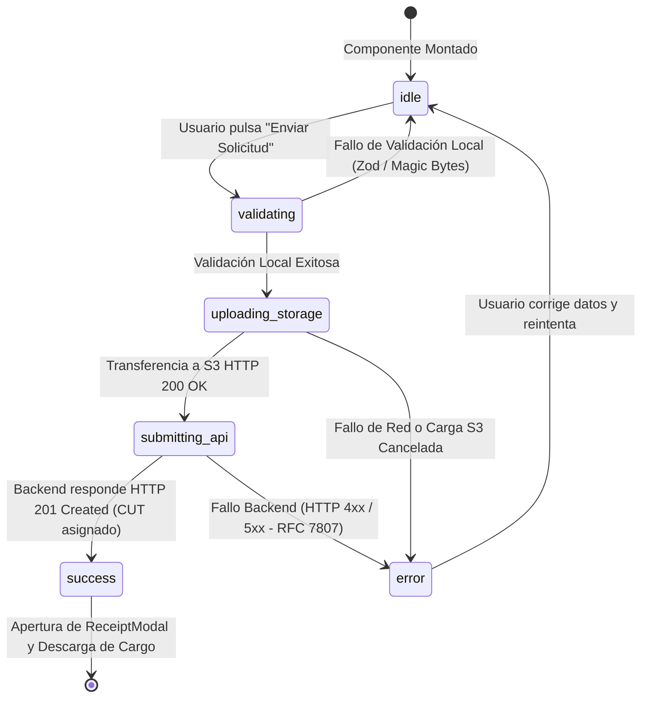

# Componentes de Interfaz de Usuario y Máquina de Estados React 19 — Registro Documentario

| Metadato | Detalle Institucional |
| :--- | :--- |
| **Código Documental** | SIGD-DOC-REGDOC-03 |
| **Módulo** | registro-documentario / Componentes de Interfaz de Usuario y Máquina de Estados React 19 |
| **Versión** | 1.0.0-PROD |
| **Fecha de Aprobación** | 2026-09-05 |
| **Autores Reconocidos** | Lucy Panduro Ramos, Patricia Marina (Patty), Noelia Alva, Anllely Melgarejo |
| **Estado de Homologación** | Aprobado — Alineado a LPAG Ley N° 27444 y React 19 |

---

## 1. Visión General de la Capa de Presentación

La interfaz del módulo de **Registro Documentario** ha sido concebida bajo los estándares modernos de **React 19**, **TypeScript 5.9** y **Tailwind CSS 4**, orientada al cumplimiento riguroso de la accesibilidad digital para el sector público (WCAG 2.1 AA) y la arquitectura Feature-Sliced Design (*Domain-Driven UI*).

El módulo provee una experiencia reactiva, fluida y con retroalimentación en tiempo real para el administrado y el operador institucional, garantizando la eliminación de fallos por concurrencia, doble pulsación o transferencias binarias no autorizadas.

---

## 2. Árbol y Jerarquía de Componentes

La arquitectura de interfaz organiza los elementos en una jerarquía declarativa y altamente cohesionada:

```
RegistroDocumentarioPage (Layout & Contenedor Principal)
│
├── StepperWizardHeader (Indicador de progreso de 4 pasos)
│
├── RegisterForm (Formulario maestro con react-hook-form y Zod)
│   ├── DatosSolicitanteSection
│   │   ├── TipoDocumentoSelector (DNI / RUC / CE / Pasaporte)
│   │   ├── DocumentoIdentidadInput (Validación con máscara)
│   │   ├── NombresRazónSocialInput
│   │   ├── CorreoElectronicoInput
│   │   └── TelefonoCelularInput
│   │
│   ├── DatosTramiteSection
│   │   ├── TipoProcedimientoSelect (Catálogo TUPA / No TUPA)
│   │   ├── TipoDocumentoSelect (Solicitud, Oficio, Carta, Memo, etc.)
│   │   ├── AsuntoTextarea (Contador de caracteres 0/250)
│   │   ├── CantidadFoliosInput (Control numérico entero)
│   │   ├── AreaDestinoSelect (Organigrama IESTP Suiza)
│   │   └── PrioridadRadioGroup (Normal, Urgente, Muy Urgente)
│   │
│   ├── FileUploadZone (Zona de carga y validación PDF/A)
│   │   ├── DropzoneArea (Eventos Drag & Drop)
│   │   ├── UploadProgressBar (Progreso reactivo onUploadProgress)
│   │   └── FileListPreview (Visor preliminar, hash y eliminación)
│   │
│   └── DeclaracionJuradaSection (Checkbox obligatorio Ley N° 27444)
│
├── ReceiptModal (Modal bloqueante de confirmación de registro)
│   ├── CUTDisplayBadge (Código visible EXP-YYYY-XXXXXX)
│   ├── SelloTiempoLegalBlock (Fecha y hora oficial)
│   ├── QRCodeCanvas (Enlace de consulta pública)
│   └── ActionButtonToolbar (Descargar PDF A4 / Imprimir Ticket)
│
└── DataTable (Bandeja de Trámites Recientes para Operador)
    ├── FilterToolbar (Buscador CUT, fecha, estado)
    ├── TableBody (Listado reactivo con TanStack Query v5)
    ├── StatusBadge (Pendiente, En Trámite, Observado, Atendido, Archivados)
    └── TablePaginationControls
```

---

## 3. Especificación Detallada de Componentes Clave

### 3.1. Formulario Principal (`RegisterForm`)
- **Gestor de Formulario:** Integración de `react-hook-form` acoplado al validador de esquemas `zod` para chequeo estático y en tiempo de ejecución.
- **Comportamiento:** Persiste borradores provisionales en `sessionStorage` para mitigar pérdidas accidentales de datos ante cierres imprevistos de pestaña.

### 3.2. Zona de Carga de Archivos (`FileUploadZone`)
> ⚠️ **Directiva de Normalización Técnica:** En versiones preliminares de trabajo se sugirió admitir extensiones `.docx`. Esta especificación **restringe y homogeniza de manera estricta el formato admisible a `PDF/A`** (formato estándar de preservación digital a largo plazo según las directivas del Modelo de Gestión Documental de la PCM y el Archivo General de la Nación). No se admiten procesadores de texto ni formatos editables.

- **Capacidades Operativas:**
  - Inspección binaria client-side: Ejecución inmediata de `validatePdfMagicBytes()` verificando `25 50 44 46`. Si no coincide, rechaza el archivo sin invocar a la red.
  - Cómputo asíncrono de huella digital SHA-256 en navegador mediante `window.crypto.subtle`.
  - Despliegue de porcentaje de carga en tiempo real (0% a 100%) enlazado al evento `onUploadProgress` de Axios/Fetch hacia la URL prefirmada de MinIO/S3.
  - Botón de remoción de archivo antes del envío definitivo, cancelando la subida si está en progreso mediante `AbortController`.

### 3.3. Modal de Confirmación y Cargo (`ReceiptModal`)
- **Accesibilidad:** Modal con foco bloqueante (*trap focus*), cierre seguro mediante tecla `Escape`, `role="dialog"` y `aria-modal="true"`.
- **Elementos Desplegados:**
  - Código Único de Trámite (`EXP-YYYY-XXXXXX`) con botón de copiado rápido al portapapeles.
  - Número correlativo de Asiento Registral del Libro Oficial.
  - Resumen de folios y código hash SHA-256 abreviado para verificación de integridad.
  - Botones de acción directa:
    1. *Descargar Cargo PDF (Formato A4)* con firma digital y CVD.
    2. *Imprimir Comprobante Térmico (Ticket POS 80mm)* optimizado mediante hoja de estilos `@media print`.

### 3.4. Bandeja de Gestión para Operador (`DataTable`)
- Diseñado para el personal de Ventanilla Presencial del IESTP Suiza.
- Presenta columnas ordenables: CUT, Fecha/Hora Ingreso, Solicitante (DNI/RUC - Nombre), Asunto, Tipo Documento, Folios, Destino y Estado.
- **Badges Semánticos de Estado:**
  - `REGISTRADO`: Azul Institucional (`bg-blue-100 text-blue-800 border-blue-300`).
  - `EN_TRAMITE`: Amarillo / Ámbar (`bg-amber-100 text-amber-800 border-amber-300`).
  - `OBSERVADO`: Naranja Alerta (`bg-orange-100 text-orange-800 border-orange-300`).
  - `ATENDIDO`: Verde Éxito (`bg-emerald-100 text-emerald-800 border-emerald-300`).
  - `ARCHIVADO`: Gris Neutro (`bg-slate-100 text-slate-800 border-slate-300`).

---

## 4. Catálogo de Campos y Reglas de Validación

| Identificador del Campo | Etiqueta en UI | Tipo de Control | Reglas de Validación (Cliente) | Expresión Regular / Criterio | Mensaje de Error Amigable |
|---|---|---|---|---|---|
| `tipo_persona` | Tipo de Solicitante | Selector Radio | Obligatorio | `NATURAL \| JURIDICA` | Seleccione si es Persona Natural o Jurídica. |
| `tipo_documento` | Tipo de Documento | Dropdown Select | Obligatorio | `DNI \| RUC \| CE \| PASAPORTE` | Seleccione un documento de identidad válido. |
| `numero_documento` | Número de Identidad | Input Numérico | Obligatorio, longitud exacta según tipo | DNI: `^[0-9]{8}$`<br/>RUC: `^(10\|20)[0-9]{9}$` | El DNI debe tener 8 dígitos numéricos (o 11 para RUC). |
| `nombres_razon_social` | Nombres y Apellidos / Razón Social | Input Texto | Obligatorio, trim automático | `^[A-Za-zÁÉÍÓÚáéíóúÑñ\s\.\-]{3,120}$` | Ingrese el nombre completo o razón social (mínimo 3 caracteres). |
| `correo_electronico` | Correo Electrónico | Input Email | Obligatorio, estándar RFC 5322 | `^[a-zA-Z0-9._%+-]+@[a-zA-Z0-9.-]+\.[a-zA-Z]{2,}$` | Ingrese un correo electrónico válido para recibir notificaciones. |
| `telefono_celular` | Teléfono Celular | Input Teléfono | Obligatorio, 9 dígitos comenzando en 9 | `^9[0-9]{8}$` | Ingrese un número de celular de 9 dígitos que inicie con 9. |
| `tipo_tramite_id` | Procedimiento | Dropdown Buscador | Obligatorio | Catálogo TUPA vigente | Seleccione el procedimiento o trámite a solicitar. |
| `tipo_documento_presentado` | Tipo de Documento | Dropdown Select | Obligatorio | `SOLICITUD \| OFICIO \| CARTA \| MEMO \| EXPEDIENTE` | Seleccione la tipología del documento ingresado. |
| `asunto` | Asunto de la Solicitud | Textarea | Obligatorio, min 10 max 250 | Mínimo 10 caracteres | El asunto debe describir claramente el trámite (10 a 250 letras). |
| `cantidad_folios` | Número de Folios | Input Numérico | Obligatorio, entero positivo | Entero $\ge 1$ | La cantidad de folios debe ser un número entero mayor o igual a 1. |
| `oficina_destino_id` | Área / Oficina de Destino | Dropdown Select | Obligatorio | Catálogo de Unidades Orgánicas | Seleccione el área responsable de atender el trámite. |
| `archivo_principal` | Documento Principal | File Dropzone | Obligatorio, formato PDF/A, máx 25 MB | Magic Bytes: `25 50 44 46` | Debe adjuntar el documento principal en formato PDF (máx. 25 MB). |
| `declaracion_jurada` | Declaración de Veracidad | Checkbox | Obligatorio (marcado) | `checked === true` | Debe aceptar la declaración de veracidad conforme a la Ley N° 27444. |

---

## 5. Máquina de Estados Finita de la Interfaz (UI FSM)

Para prevenir condiciones de carrera, bloqueos o reenvíos accidentales por doble clic, el flujo de interacción de la pantalla de registro se rige bajo una **Máquina de Estados Finita (FSM)**:



### 5.1. Comportamiento en Cada Estado
- **`idle`:** Controles activos y editables. El botón de envío se encuentra habilitado una vez que se completan los campos obligatorios.
- **`validating`:** Chequeo instantáneo en memoria de sintaxis y Magic Bytes binarios. No genera llamadas de red hacia el servidor.
- **`uploading_storage`:** Se deshabilita la totalidad del formulario. Se presenta una barra de progreso lineal de subida directa a MinIO/S3. Si el usuario cancela, se anula la petición mediante `AbortController` y se retorna a `idle`.
- **`submitting_api`:** Archivo binario cargado en el bucket. El botón de envío se transforma en un indicador de actividad (*spinner*) con el texto *"Generando Código de Expediente..."*. Todos los campos quedan en modo sólo lectura para evitar modificaciones concurrentes.
- **`success`:** Se despliega el `ReceiptModal`. Se emite un sonido sutil de confirmación, se reproduce la animación de éxito y se desbloquea la descarga del comprobante oficial.
- **`error`:** Se proyecta un componente `AlertNotification` estilizado con los detalles del error RFC 7807 devuelto por el servidor (o el fallo de conexión), manteniendo intactos todos los textos previamente redactados por el usuario para evitar reescritura.

---

## 6. Directivas de Accesibilidad Institucional (WCAG 2.1 AA)

Por tratarse de una plataforma pública de educación superior técnica, la interfaz cumple estrictamente con el nivel **AA** de las directrices WCAG 2.1:

1. **Relación de Contraste Cromático:**
   - Todo texto sobre fondo blanco o gris claro mantiene un contraste mínimo de **4.6:1** (Azul Institucional `#006EC7` sobre fondo blanco `#FFFFFF` alcanza una relación de **5.1:1**, superando el mínimo requerido).
   - Los elementos secundarios y textos de apoyo en escala de grises utilizan `#4B5563` (contraste de **7.0:1**).
2. **Navegación Integral por Teclado:**
   - Secuencia lógica de tabulación (`tabindex` natural) en todo el recorrido del Stepper Wizard.
   - Accionamiento de botones y casillas de verificación mediante teclas `Space` y `Enter`.
   - Cierre de modales y diálogos emergentes con tecla `Escape`.
   - Retención del foco interactivo dentro de los modales (*Focus Trap*).
3. **Indicadores de Enfoque Visual:**
   - Todos los inputs, selectores y botones presentan un contorno de foco visible de alto contraste mediante la clase Tailwind `focus:ring-2 focus:ring-[#006EC7] focus:ring-offset-2`.
4. **Semántica ARIA para Lectores de Pantalla:**
   - Errores de validación vinculados a su campo mediante `aria-describedby="error-{field-id}"` y marcado con `aria-invalid="true"`.
   - Zonas de actualización dinámica (barra de progreso y alertas) configuradas con `aria-live="polite"` y `role="status"` para anunciar los cambios a usuarios con discapacidad visual.
