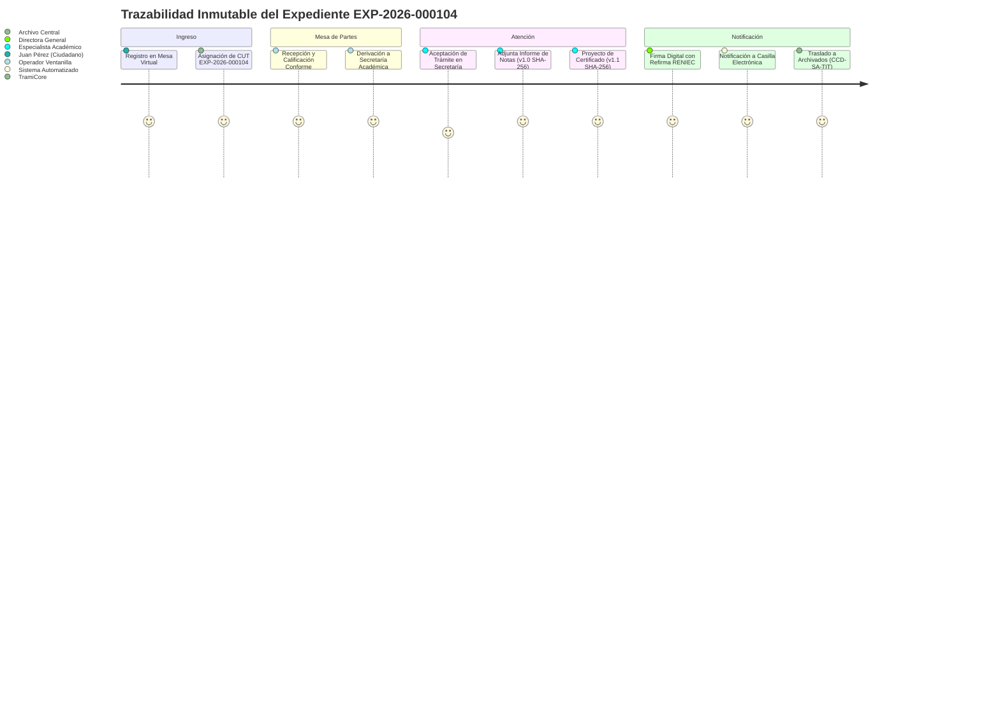

# Modelo de Datos TypeScript 5.9 y Trazabilidad Inmutable — Gestión de Expedientes

| Metadato | Detalle Institucional |
| :--- | :--- |
| **Código Documental** | SIGD-DOC-GESTEXP-03 |
| **Módulo** | gestion-expedientes / Modelo de Datos TypeScript 5.9 y Trazabilidad Inmutable |
| **Versión** | 1.0.0-PROD |
| **Fecha de Aprobación** | 2026-09-05 |
| **Autores Reconocidos** | Isack Vargas, Willfredo Soria, Piero Bartra Montalvo |
| **Estado de Homologación** | Aprobado — Alineado a LPAG Ley N° 27444 y React 19 |

---

## 1. Visión General del Modelo de Dominio

El módulo de **Gestión de Expedientes** fundamenta su arquitectura en interfaces fuertemente tipadas bajo **TypeScript 5.9**, garantizando consistencia semántica entre el frontend de React 19 y los esquemas relacionales de **PostgreSQL 18** en los esquemas `sigd_tra`, `sigd_doc` y `sigd_audit`.

El diseño técnico sigue dos directrices inquebrantables:
1. **Inmutabilidad y No Repudio:** Ningún documento ni evento del expediente puede ser sobrescrito o eliminado físicamente; todo cambio genera un nuevo nodo inmutable con sello de tiempo y huella criptográfica SHA-256.
2. **Cómputo Legal Estricto:** Toda medición de tiempos de respuesta se calcula en días hábiles administrativos según el TUO de la Ley N° 27444, sincronizada con el calendario laboral del IESTP "Suiza".

---

## 2. Contratos y Modelos de Datos en TypeScript 5.9

A continuación se definen los contratos TypeScript exportables que rigen la gestión de expedientes:

```typescript
/**
 * Clasificación archivística según el Cuadro de Clasificación Documental (CCD).
 * Se formaliza el Fondo Documental canónico IESTP_SUIZA.
 */
export interface ClasificacionCCD {
  /** Fondo Documental oficial institucional */
  fondo: 'IESTP_SUIZA';
  /** Sección o unidad orgánica responsable (ej. 'SECRETARIA_ACADEMICA') */
  seccion: string;
  /** Serie documental reglamentaria (ej. 'TITULACION_PROFESIONAL') */
  serieDocumental: string;
  /** Código unificado de la serie archivística (ej. 'CCD-SA-TIT') */
  codigoSerie: string;
}

/**
 * Representa una versión inmutable de un documento adjunto o proyectado.
 */
export interface VersionDocumento {
  /** Identificador único de versión (ej. 'v1.0', 'v1.1') */
  versionId: string;
  /** Número correlativo incremental */
  numeroVersion: number;
  /** Nombre del archivo original */
  nombreArchivo: string;
  /** Clave o URL de almacenamiento seguro en MinIO / S3 */
  urlArchivo: string;
  /** Identificador del autor que emitió o modificó la versión */
  autorCambioId: string;
  /** Nombre legible del funcionario responsable */
  autorCambioNombre: string;
  /** Marca temporal en formato ISO 8601 */
  fechaRegistro: string;
  /** Justificación de la creación de la nueva versión */
  motivoModificacion: string;
  /** Huella criptográfica SHA-256 calculada localmente para auditoría de inmutabilidad */
  hashIntegridad: string;
}

/**
 * Metadatos documentales avanzados para indexación y búsqueda semántica.
 */
export interface MetadatosAvanzados {
  /** Tipología jurídica o administrativa del documento principal */
  tipoDocumentoPrincipal: 
    | 'OFICIO' 
    | 'INFORME' 
    | 'CARTA' 
    | 'RESOLUCION_DIRECTORAL' 
    | 'SOLICITUD' 
    | 'PROVEIDO'
    | 'EXPEDIENTE_EXTERNO';
  /** Etiquetas semánticas para búsqueda temática y filtrado rápido */
  palabrasClave: string[];
  /** Identificador del usuario que originó el trámite */
  creadorId: string;
  /** Nombre completo del originador */
  creadorNombre: string;
  /** Identificador del funcionario actualmente responsable de la instrucción */
  responsableAsignadoId?: string;
  /** Nombre legible del funcionario asignado */
  responsableAsignadoNombre?: string;
}

/**
 * Información del solicitante o administrado (modelo polimórfico).
 */
export interface SolicitanteExpediente {
  tipoPersona: 'NATURAL' | 'JURIDICA';
  tipoDocumento: 'DNI' | 'RUC' | 'CE' | 'PASAPORTE';
  numeroDocumento: string;
  nombreOrazonSocial: string;
  correoNotificacion: string;
  telefonoContacto: string;
}

/**
 * Entidad maestra del Expediente en el SIGD.
 */
export interface ExpedienteSGD {
  /** UUID primario en base de datos */
  id: string;
  /** Código Único de Trámite con formato estricto EXP-YYYY-XXXXXX */
  codigoExpediente: string;
  /** Resumen ejecutivo del petitorio */
  asunto: string;
  /** Sujeto procesal que presenta la solicitud */
  solicitante: SolicitanteExpediente;
  /** Taxonomía archivística CCD */
  clasificacionCCD: ClasificacionCCD;
  /** Metadatos para búsqueda avanzada */
  metadatos: MetadatosAvanzados;
  /** Área u oficina donde se originó el ingreso */
  areaOrigen: string;
  /** Unidad orgánica que actualmente custodia y tramita el expediente */
  areaActual: string;
  /** Estado del flujo de trabajo dentro de la FSM institucional */
  estadoFlujo: 
    | 'PENDIENTE' 
    | 'EN_PROCESO' 
    | 'OBSERVADO' 
    | 'DERIVADO' 
    | 'NOTIFICADO' 
    | 'ARCHIVADO';
  /** Nivel de prioridad procesal */
  prioridad: 'NORMAL' | 'URGENTE' | 'MUY_URGENTE';
  /** Fecha de ingreso formal al sistema (ISO 8601) */
  fechaIngreso: string;
  /** Marca de tiempo de la última actuación registrada */
  fechaUltimoMovimiento: string;
  /** Colección histórica de versiones documentales sin sobreescritura */
  versionesDocumentos: VersionDocumento[];
  /** Total de folios acumulados según protocolo AGN */
  cantidadFolios: number;
}

/**
 * Detalle de pase o derivación entre unidades orgánicas.
 */
export interface DetalleDerivacion {
  derivacionId: string;
  expedienteId: string;
  areaOrigenId: string;
  areaDestinoId: string;
  usuarioRemitenteId: string;
  usuarioAsignadoId?: string;
  fechaDerivacion: string;
  plazoAtencionDias: number;
  estadoDerivacion: 'PENDIENTE_RECEPCION' | 'ACEPTADO' | 'RECHAZADO';
  proveidoInstruccion: string;
  observacionDevolucion?: string;
}

/**
 * Bitácora de auditoría inmutable y eventos del expediente.
 */
export interface BitacoraEventoExpediente {
  eventoId: string;
  expedienteId: string;
  tipoEvento: 
    | 'CREACION' 
    | 'RECEPCION' 
    | 'VERSION_ADJUNTA' 
    | 'DERIVACION' 
    | 'OBSERVACION' 
    | 'SUBSANACION' 
    | 'NOTIFICACION' 
    | 'ARCHIVADO' 
    | 'DESARCHIVADO';
  timestamp: string;
  usuarioId: string;
  usuarioNombre: string;
  areaNombre: string;
  estadoAnterior?: string;
  estadoNuevo: string;
  descripcionDetallada: string;
  hashTransaccion: string;
}

/**
 * Control y cómputo de plazos legales del expediente.
 */
export interface HistorialPlazosExpediente {
  expedienteId: string;
  fechaIngresoSistema: string;
  fechaLimiteAtencion: string;
  diasHabilesRestantes: number;
  alertaVencimiento: 'NORMAL' | 'ADVERTENCIA' | 'VENCIDO';
}
```

---

## 3. Política de Versionado No Destructivo con Huella SHA-256

Para garantizar que ningún funcionario u operador pueda alterar retrospectivamente un documento incorporado a un expediente:

1. **Inmutabilidad en Almacenamiento:** El bucket S3/MinIO se encuentra configurado con políticas de inmutabilidad *Object Lock (WORM - Write Once, Read Many)* para el prefijo de expedientes.
2. **Generación de Nuevas Versiones:** 
   - Cuando se requiere corregir un informe o agregar un pliego de observaciones, el usuario sube un nuevo archivo.
   - El sistema calcula el hash SHA-256 del nuevo archivo y crea un nuevo registro `VersionDocumento` (`v1.1`, `v1.2`, etc.).
   - La versión anterior (`v1.0`) permanece intacta, visible y accesible en la pestaña de historial documental del expediente.
3. **Cálculo de Integridad:** Se contrastan de forma periódica las huellas SHA-256 persistidas en la base de datos con los archivos en almacenamiento de objetos para detectar cualquier corrupción o adulteración no autorizada.

---

## 4. Algoritmo de Cómputo de Plazos en Días Hábiles (Ley N° 27444)

El Artículo 145 del TUO de la Ley N° 27444 estipula que los plazos administrativos se computan en **días hábiles consecutivos**, excluyendo sábados, domingos y feriados oficiales declarados por el Estado o por la autoridad institucional.

### Implementación en TypeScript:

```typescript
/**
 * Catálogo referencial de feriados nacionales y días no laborables
 * aplicables a la región Ucayali y al IESTP Suiza durante el año lectivo 2026.
 */
export const FERIADOS_INSTITUCIONALES_2026: string[] = [
  '2026-01-01', // Año Nuevo
  '2026-04-02', // Jueves Santo
  '2026-04-03', // Viernes Santo
  '2026-05-01', // Día del Trabajo
  '2026-06-24', // Fiesta de San Juan (Feriado Regional Ucayali)
  '2026-06-29', // San Pedro y San Pablo
  '2026-07-28', // Fiestas Patrias
  '2026-07-29', // Fiestas Patrias
  '2026-08-06', // Batalla de Junín
  '2026-08-30', // Santa Rosa de Lima
  '2026-10-08', // Combate de Angamos
  '2026-11-01', // Todos los Santos
  '2026-12-08', // Inmaculada Concepción
  '2026-12-09', // Batalla de Ayacucho
  '2026-12-25', // Navidad
];

/**
 * Calcula los días hábiles transcurridos o restantes entre dos fechas,
 * excluyendo sábados, domingos y días feriados oficiales.
 * 
 * @param fechaInicio Fecha inicial de cómputo (ISO 8601 o Date)
 * @param fechaFin Fecha final o plazo límite
 * @param feriados Lista de fechas festivas en formato 'YYYY-MM-DD'
 * @returns Número entero de días hábiles computados
 */
export function calculateBusinessDays(
  fechaInicio: Date | string,
  fechaFin: Date | string,
  feriados: string[] = FERIADOS_INSTITUCIONALES_2026
): number {
  let current = new Date(fechaInicio);
  const end = new Date(fechaFin);
  let businessDays = 0;

  // Normalización a medianoche para evitar desfases de horario
  current.setHours(0, 0, 0, 0);
  end.setHours(0, 0, 0, 0);

  const isReverse = current > end;
  const step = isReverse ? -1 : 1;

  while (isReverse ? current > end : current < end) {
    current.setDate(current.getDate() + step);
    const dayOfWeek = current.getDay(); // 0 = Domingo, 6 = Sábado
    const dateString = current.toISOString().slice(0, 10);

    const isWeekend = dayOfWeek === 0 || dayOfWeek === 6;
    const isHoliday = feriados.includes(dateString);

    if (!isWeekend && !isHoliday) {
      businessDays += step;
    }
  }

  return businessDays;
}

/**
 * Evalúa el nivel de alerta SLA en función de los días hábiles restantes.
 */
export function getSlaAlertStatus(
  diasHabilesRestantes: number
): 'NORMAL' | 'ADVERTENCIA' | 'VENCIDO' {
  if (diasHabilesRestantes < 0) {
    return 'VENCIDO';
  }
  if (diasHabilesRestantes <= 2) {
    return 'ADVERTENCIA'; // Menor o igual a 48 horas hábiles
  }
  return 'NORMAL';
}
```

---

## 5. Visualización del Timeline Inmutable en React 19

En el detalle del expediente, el historial de eventos se proyecta mediante un componente de línea de tiempo (*Timeline*) reactivo que consume la bitácora inmutable:


