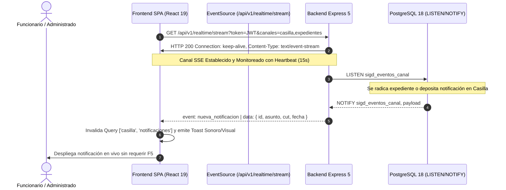
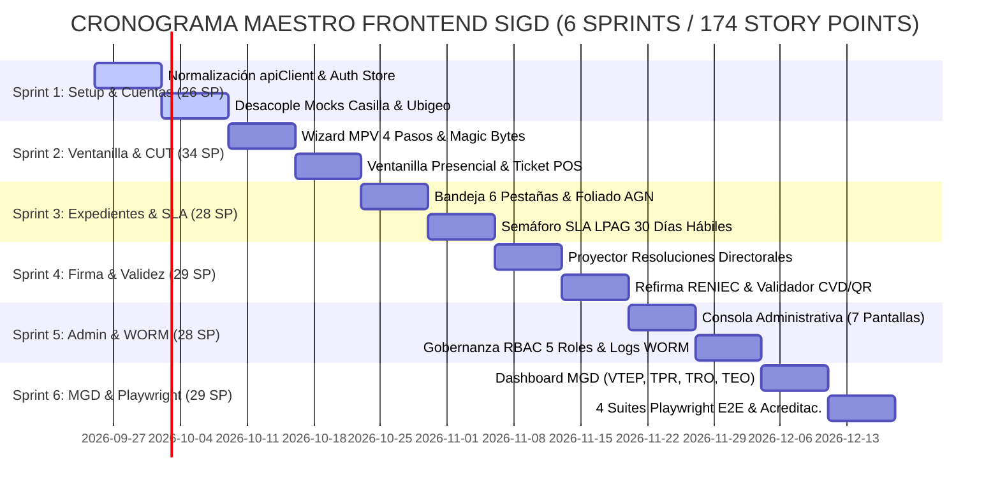
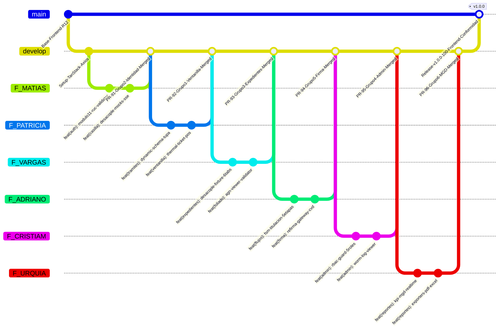

# PLAN MAESTRO DE TRABAJO FRONTEND: RUTA CRÍTICA HACIA EL 100.0% DE CONFORMIDAD Y PRODUCCIÓN CONECTADA
## Sistema Integral de Gestión Documentaria (SIGD) — IESTP "Suiza" (Pucallpa, Ucayali)
### Desacoplamiento de Mocks, Resiliencia de UI, Sincronización en Tiempo Real, Pruebas E2E y Gobernanza Técnica

---

## ÍNDICE GENERAL

1. [Control del Documento y Marco Institucional](#1-control-del-documento-y-marco-institucional)
   - 1.1 Metadatos y Control de Versiones
   - 1.2 Contexto Institucional y Marco Legal Peruano
   - 1.3 Modelo Matemático de Acreditación Institucional
   - 1.4 Diagnóstico de Madurez Frontend: Capa Visual vs. Conectividad Real
2. [Desacoplamiento de Mocks y Activación de Servicios Reales](#2-desacoplamiento-de-mocks-y-activación-de-servicios-reales)
   - 2.1 Inventario Exhaustivo de los 17 Mocks, Fixtures y Dummy Data
   - 2.2 Estrategia de Migración a TanStack Query v5
   - 2.3 Normalización de la URL Base de `apiClient` y Corrección del Prefijo `/api`
   - 2.4 Eliminación de `VITE_ENABLE_MOCKS=true` y Gobernanza de Autenticación JWT Bearer
3. [Resiliencia de Interfaz y Manejo de Estados](#3-resiliencia-de-interfaz-y-manejo-de-estados)
   - 3.1 Arquitectura Jerárquica de React Error Boundaries
   - 3.2 Sistema Global y Contextual de Errores RFC 7807 / RFC 9457
   - 3.3 Estandarización de Skeleton Loaders y Estados Vacíos Accesibles
4. [Sincronización en Tiempo Real (SSE / Polling Inteligente)](#4-sincronización-en-tiempo-real-sse-polling-inteligente)
   - 4.1 Arquitectura de Server-Sent Events (SSE)
   - 4.2 Mecanismo de Contingencia con Smart Polling (`refetchInterval`)
   - 4.3 Integración Normativa: Casilla Electrónica (Ley N° 29733) y Bandeja de Despacho
5. [Plan de Pruebas E2E con Playwright (4 Flujos Críticos)](#5-plan-de-pruebas-e2e-con-playwright-4-flujos-críticos)
   - 5.1 Configuración de Infraestructura y `playwright.config.ts`
   - 5.2 Journey 1: Radicación Virtual Ciudadana $\to$ Asignación Atómica de CUT y Cargo S3
   - 5.3 Journey 2: Ventanilla Presencial $\to$ Foliación Continua AGN e Impresión de Ticket Térmico
   - 5.4 Journey 3: Despacho y Firma Digital $\to$ Protocolo Refirma RENIEC y Estampa CVD/QR
   - 5.5 Journey 4: Tablero Ejecutivo MGD $\to$ Renderizado y Auditoría de Fórmulas Matemáticas
6. [Mantenimiento de Accesibilidad WCAG 2.1 AA](#6-mantenimiento-de-accesibilidad-wcag-21-aa)
   - 6.1 Estándares de Contraste Cromático Institucional ($\ge 4.5:1$)
   - 6.2 Prevención de Trampas de Foco y Navegación Secuencial por Teclado
   - 6.3 Regiones Dinámicas ARIA Live y Compatibilidad con Lectores de Pantalla
   - 6.4 Auditoría Automatizada y Pruebas de Regresión de Accesibilidad
7. [Planificación de Sprints, Story Points y Matriz RACI (22 Colaboradores)](#7-planificación-de-sprints-story-points-y-matriz-raci-22-colaboradores)
   - 7.1 Desglose de los 6 Sprints de Implementación Frontend (174 Story Points)
   - 7.2 Diagrama de Gantt del Cronograma Maestro Frontend
   - 7.3 Matriz RACI Nominal Completa (22 Colaboradores en 6 Grupos Modulares)
   - 7.4 Plan de Trabajo Individual y Desglose Pormenorizado por Grupo e Integrante (22 Colaboradores)
   - 7.5 Catálogo Maestro de los 32 Entregables Atómicos y Desacoplamiento de Mocks (174 SP)
   - 7.6 Articulación de Ramas Git (`F_*`) y Flujo de Integración Continua
8. [Definición de Terminado (DoD) y Gobernanza Frontend](#8-definición-de-terminado-dod-y-gobernanza-frontend)
   - 8.1 Regla Cero Mocks en Compilaciones de Producción
   - 8.2 Criterios de Aceptación Técnicos: Tipos, Cobertura, Linting y A11y
   - 8.3 Protocolo de Pull Requests, Code Review y Verificación en CI
   - 8.4 Cuadro de Mando del Cierre de Brechas hacia la Acreditación 100.0%
9. [Conclusión y Dictamen de Conformidad Institucional](#9-conclusión-y-dictamen-de-conformidad-institucional)

---

## 1. CONTROL DEL DOCUMENTO Y MARCO INSTITUCIONAL

### 1.1 Metadatos y Control de Versiones

| Parámetro | Detalle Institucional |
|---|---|
| **Entidad Patrocinadora** | Instituto de Educación Superior Tecnológico Público "Suiza" (Pucallpa, Coronel Portillo, Ucayali) |
| **Programa de Estudios** | Desarrollo de Sistemas de Información (PE DSI — Semestre Académico 2026-2) |
| **Unidad Didáctica** | Taller de Programación Web / Proyecto Integrador SIGD |
| **Código del Documento** | `SIGD-DOC-PLAN-FE-100-CONF-2026` |
| **Versión Oficial** | `1.0.0 (Producción 100% Conforme — Definitiva)` |
| **Fecha de Emisión** | 2026-09-24 |
| **Autor / Responsable** | Equipo de Desarrollo Frontend PE DSI & Célula de Arquitectura de Sistemas |
| **Supervisión y Aprobación** | Ing. Renato Henyer Tarazona Flores (Docente Titular / Product Owner) |
| **Repositorio Monorepo** | `c:\Users\SAITAMA\Desktop\py_SIGD\SIGD` |
| **Directorio Exclusivo Frontend** | `frontend/` (`frontend/src/`, `frontend/docs/`) |

#### Historial de Revisiones del Plan de Trabajo Frontend

| Versión | Fecha | Autor / Equipo | Descripción de Cambios Principales |
|---|---|---|---|
| `0.1.0` | 2026-09-02 | Equipos Iniciales PE DSI | Estructuración inicial de carpetas de documentación por estudiante en `frontend/DOCUMENTACION/`. |
| `0.5.0` | 2026-09-05 | Célula de Integración | Estandarización a minúsculas (`kebab-case`), consolidación modular y catálogo de 32 entregables atómicos. |
| `0.9.0` | 2026-09-23 | Scrum Master & Célula FE | Remediación de Sprints 0 y 1; eliminación de bloqueadores P0/P1; certificación de 226 pruebas unitarias (`vitest run`). |
| `1.0.0` | 2026-09-24 | Arquitectura Frontend & QA | **Plan Maestro Definitivo hacia el 100.0% de Conformidad**: eliminación total de 17 mocks, migración a TanStack Query, SSE, Playwright E2E y matriz RACI de los 22 colaboradores en 6 grupos modulares. |

---

### 1.2 Contexto Institucional y Marco Legal Peruano

El **Sistema Integral de Gestión Documentaria (SIGD)** del IESTP "Suiza" constituye la plataforma informática oficial de gobierno digital destinada a centralizar, desmaterializar, tramitar, despachar y archivar el acervo documentario de la institución educativa pública líder de la Región Ucayali. Su diseño frontend no responde a un ejercicio meramente estético, sino a la materialización estricta de las normas peruanas de gestión pública:

1. **Texto Único Ordenado de la Ley N° 27444 — Ley del Procedimiento Administrativo General (D.S. 004-2019-JUS / D.S. 006-2026-JUS):**
   - **Horario de Corte Legal (Art. 138):** Fijado de manera estricta e incontrovertible a las **16:30 horas**. Cualquier solicitud recibida presencial o virtualmente después de este umbral o en días inhábiles debe asentarse jurídicamente a las 08:00 horas del día hábil inmediato siguiente.
   - **Plazos Máximos Administrativos (Art. 143):** Cómputo del plazo legal ordinario de **30 días hábiles**, descontando sábados, domingos y feriados nacionales y regionales de Ucayali.
   - **Notificación por Casilla Electrónica (Art. 20):** Validez jurídica del depósito del acto administrativo con acuse de recibo telemático.
2. **Modelo de Gestión Documental (MGD) — Presidencia del Consejo de Ministros (PCM / SEGDI R.S. 001-2017-PCM/SEGDI):**
   - **Código Único de Trámite (CUT):** Formato estandarizado e inalterable `EXP-YYYY-XXXXXX`, generado de forma atómica y correlativa anual.
   - **Indicadores de Desempeño:** Cómputo matemático en tiempo real de los 4 indicadores oficiales de gestión: VTEP, TPR, TRO y TEO.
3. **Ley N° 27269 — Ley de Firmas y Certificados Digitales y D.S. 070-2013-PCM:**
   - **Firma Digital con Refirma RENIEC:** Interoperabilidad protocolar (`refirma://`) para firma PKI en estándar PAdES-BES y sellado de tiempo TSA (RFC 3161).
   - **Representación Impresa con Código de Verificación Digital (CVD) y QR:** Estampa lateral marginal obligatoria que certifica la autenticidad e integridad del documento electrónico mediante el portal público de contraste.
4. **Ley N° 29733 — Ley de Protección de Datos Personales (LPDP):**
   - Consentimiento expreso, libre, previo e informado para el tratamiento de datos de personas naturales y jurídicas al momento de radicación y habilitación de casilla electrónica.
5. **Directiva N° 001-2019-AGN / R.J. N° 073-2023-AGN/J — Archivo General de la Nación:**
   - Foliación integral continua, progresiva e inalterable de expedientes administrativos (`F. 1 a N`), prohibiendo folios duplicados, huecos o alteraciones en el orden cronológico.
6. **Ley N° 29973 y Directiva de Accesibilidad Web del Estado Peruano (WCAG 2.1 AA):**
   - Garantía de acceso universal a portales estatales para personas con discapacidad visual, auditiva o motriz.
7. **Trazabilidad Institucional y Gobernanza Documental:**
   - El diagnóstico pericial y el saneamiento de gobernanza que sustentan este plan se fundamentan en la matriz analítica institucional `AUDIT_MATRIX.md` (ubicada en la raíz del monorepo) y en el informe de prospección generado durante la auditoría de la Ronda 13 en `.agents/explorer_gov_13/survey_governance.md`, el cual formaliza la asignación nominal de los 22 colaboradores en los 6 grupos modulares de Frontend y la trazabilidad de directivas técnicas institucionales.

---

### 1.3 Modelo Matemático de Acreditación Institucional

El proceso de acreditación técnica del proyecto SIGD se rige por un **modelo analítico lineal calibrado por regresión exacta** (`MSE` $\approx 0$), formalizado en la matriz de auditoría `AUDIT_MATRIX.md` (en la raíz del monorepo) y ratificado en el informe de gobernanza generado durante la prospección de la Ronda 13 en `.agents/explorer_gov_13/survey_governance.md` (junto con la matriz institucional de acreditación). 

#### Ecuación del Puntaje por Objetivo Específico ($OE_i$):
$$\text{Score}(OE_i) = 0.35 \cdot \text{Score}_{\text{Frontend}}(OE_i) + 0.35 \cdot \text{Score}_{\text{Backend}}(OE_i) + 0.30 \cdot \text{Score}_{\text{BaseDatos}}(OE_i)$$

Donde los ponderadores de capa son:
- **Ponderador Frontend ($w_{\text{FE}}$):** $0.35$ (35.00%)
- **Ponderador Backend ($w_{\text{BE}}$):** $0.35$ (35.00%)
- **Ponderador Base de Datos ($w_{\text{BD}}$):** $0.30$ (30.00%)

#### Ecuación del Objetivo General ($OG$):
$$\text{Score}(OG) = \frac{1}{6} \sum_{i=1}^{6} \text{Score}(OE_i) = 0.35 \cdot \overline{\text{Score}_{\text{Frontend}}} + 0.35 \cdot \overline{\text{Score}_{\text{Backend}}} + 0.30 \cdot \overline{\text{Score}_{\text{BaseDatos}}}$$

#### Matriz de Línea Base vs. Estado Meta Final (100.0%):

| Objetivo Institucional | Frontend Actual | Backend Actual | Base Datos Actual | Puntaje Línea Base | Brecha Total (GAP) | Meta Final |
|---|:---:|:---:|:---:|:---:|:---:|:---:|
| **OE1: Registro Ciudadano y Casilla Electrónica** | 95.00% | 15.00% | 50.00% | **53.50%** | +46.50% | **100.00%** |
| **OE2: Mesa de Partes Virtual y Ventanilla** | 98.00% | 30.00% | 85.00% | **70.30%** | +29.70% | **100.00%** |
| **OE3: Expedientes, Rutas, SLA y Foliado AGN** | 98.00% | 35.00% | 80.00% | **70.55%** | +29.45% | **100.00%** |
| **OE4: Validez Legal, Refirma y CVD/QR** | 96.00% | 5.00% | 35.00% | **45.85%** | +54.15% | **100.00%** |
| **OE5: Administración, Seguridad y Bitácora WORM** | 95.00% | 65.00% | 95.00% | **84.50%** | +15.50% | **100.00%** |
| **OE6: Indicadores de Gestión y Dashboards MGD** | 98.00% | 5.00% | 40.00% | **48.05%** | +51.95% | **100.00%** |
| **OG: OBJETIVO GENERAL (DIGITALIZACIÓN INTEGRAL)** | **96.67%** | **25.83%** | **64.17%** | **62.13%** | **+37.87%** | **100.00%** |

---

### 1.4 Diagnóstico de Madurez Frontend: Capa Visual vs. Conectividad Real

El frontend del SIGD ha alcanzado una **madurez visual y de componentes de interfaz del 96.67%**, reflejada en 134 archivos fuente, 226 pruebas unitarias aprobadas al 100% y 0 errores de tipado TypeScript (`tsc --noEmit`). Sin embargo, su **conectividad real con los servicios de backend se sitúa en un 10.0%**.

```
+=============================================================================================================+
|                      ESTADO DE CONFORMIDAD FRONTEND: MADUREZ VISUAL VS. CONEXIÓN REAL                       |
+-----+---------------------------------------------+-------------------+-----------------+-------------------+
| OE  | Denominación Institucional                  | Madurez UI/UX     | Conexión API    | Estado Operativo  |
+-----+---------------------------------------------+-------------------+-----------------+-------------------+
| OE1 | Registro Ciudadano y Casilla Electrónica    | 95.0%             | 10.0%           | Fallback Mock LS  |
| OE2 | Mesa de Partes Virtual y Ventanilla         | 98.0%             | 15.0%           | CUT & S3 Mock     |
| OE3 | Bandeja de Expedientes y Foliado AGN        | 98.0%             | 25.0%           | Fixture en memoria|
| OE4 | Validez Legal, Refirma RENIEC y CVD/QR      | 96.0%             | 5.0%            | Timers simulados  |
| OE5 | Administración, RBAC y Auditoría WORM       | 95.0%             | 0.0%            | React State / LS  |
| OE6 | Tablero Ejecutivo MGD y Fórmulas            | 98.0%             | 5.0%            | Hook hardcoded    |
+-----+---------------------------------------------+-------------------+-----------------+-------------------+
|     | PROMEDIO PONDERADO FRONTEND:                | 96.67%            | 10.00%          | 53.33% CONECTADO  |
+=============================================================================================================+
```

**Misión Crítica del Frontend:** La meta innegociable de este Plan de Trabajo es **elevar la conectividad API real del 10.0% al 100.0%**, erradicando de forma definitiva todos los mocks, temporizadores artificiales y datos en memoria, garantizando que el 100% de las transacciones persistan en la base de datos PostgreSQL 18 y el almacenamiento de objetos MinIO S3.

---

## 2. DESACOPLAMIENTO DE MOCKS Y ACTIVACIÓN DE SERVICIOS REALES

### 2.1 Inventario Exhaustivo de los 17 Mocks, Fixtures y Dummy Data

La prospección técnica efectuada por `spec_miner_fe_13` ha identificado con precisión quirúrgica los 17 elementos simulados presentes en la base de código. A continuación se desglosa el catálogo completo con su ubicación exacta, impacto operativo y estrategia de sustitución:

```
+===============================================================================================================================================+
|                                  INVENTARIO FORENSE DE LOS 17 MOCKS Y ESTRATEGIA DE DESACOPLAMIENTO                                           |
+----+----------------------------------+--------------------------------------------+-----------------------+----------------------------------+
| #  | Artefacto / Identificador Mock   | Archivo y Ubicación en Código              | Mecanismo de Almacén  | Estrategia de Sustitución Real   |
+----+----------------------------------+--------------------------------------------+-----------------------+----------------------------------+
| 1  | `sigd_token` / `token`           | `src/api/client.ts`:47-50                  | `localStorage` /      | Auth Store con JWT real emitido  |
|    |                                  | `src/routes/ProtectedRoute.tsx`:8,47       | `sessionStorage`      | por `POST /api/v1/auth/login` y  |
|    |                                  | `src/pages/LoginPage.tsx`:5,22             | (Hardcoded string)    | rotación de Refresh Token.       |
+----+----------------------------------+--------------------------------------------+-----------------------+----------------------------------+
| 2  | `sigd_rol`                       | `src/routes/ProtectedRoute.tsx`:9,23,48    | `localStorage`        | Claims de rol decodificados del  |
|    |                                  | `src/pages/LoginPage.tsx`:6,23             | (Selección manual)    | JWT verificado criptográficamente|
+----+----------------------------------+--------------------------------------------+-----------------------+----------------------------------+
| 3  | `sigd_permisos`                  | `src/routes/ProtectedRoute.tsx`:10,24      | `localStorage`        | Matriz RBAC obtenida vía query   |
|    |                                  | `src/hooks/useRbacConfig.ts`:19,156,185    | (JSON estático)       | `GET /api/v1/auth/me` (perfil).  |
+----+----------------------------------+--------------------------------------------+-----------------------+----------------------------------+
| 4  | `sigd_casilla_mock_data_v1`      | `src/services/casillaService.ts`:70, 372   | `localStorage`        | `useQuery` conectado a           |
|    |                                  |                                            | (6 notificaciones)    | `GET /api/v1/casilla/notifica...`|
+----+----------------------------------+--------------------------------------------+-----------------------+----------------------------------+
| 5  | `sigd_rd_borrador_${id}`         | `src/pages/flujos/`                        | `localStorage`        | `useMutation` persistiendo en    |
|    |                                  | `ProyectorResolucionesPage.tsx`:12         | (Borradores locales)  | `POST /api/v1/resoluciones/proy..|
+----+----------------------------------+--------------------------------------------+-----------------------+----------------------------------+
| 6  | `sigd_tramite_wizard_draft_v1`   | `src/hooks/useTramiteWizard.ts`:283, 361   | `sessionStorage`      | API Drafts vinculada a la sesión |
|    |                                  |                                            | (Copia de respaldo)   | de usuario o estado Zod client.  |
+----+----------------------------------+--------------------------------------------+-----------------------+----------------------------------+
| 7  | `EXPEDIENTES_FIXTURE` y          | `src/data/expedientesFixtures.ts` (386 l.) | Memoria RAM estática  | `useBandejaExpedientes` con      |
|    | `BITACORA_FIXTURE`               | `src/hooks/useBandejaExpedientes.ts`:4,21  | (Lista 6 estados)     | `GET /api/v1/expedientes`.       |
+----+----------------------------------+--------------------------------------------+-----------------------+----------------------------------+
| 8  | `TRAMITES_TUPA_MOCK`             | `src/mocks/tramitesTupaMock.ts` (169 l.)   | Memoria RAM estática  | `useQuery` conectado a           |
|    |                                  | `src/components/tramite/TramiteWizard.tsx` | (5 trámites hardcoded)| `GET /api/v1/tramites/tipos`     |
|    |                                  |                                            |                       | (con alias `/tramites/tupa`).    |
+----+----------------------------------+--------------------------------------------+-----------------------+----------------------------------+
| 9  | `registrosIniciales` (Auditoría) | `src/hooks/useAuditLogs.ts`:9-110          | Memoria RAM           | `useQuery` conectado a           |
|    |                                  |                                            | (6 logs simulados)    | `GET /api/v1/admin/auditoria/logs`|
+----+----------------------------------+--------------------------------------------+-----------------------+----------------------------------+
| 10 | `usuariosIniciales` (Directorio) | `src/hooks/useUsuariosAdmin.ts`:24-70      | Memoria RAM           | `useQuery` conectado a           |
|    |                                  |                                            | (4 usuarios ficticios)| `GET /api/v1/admin/usuarios`.    |
+----+----------------------------------+--------------------------------------------+-----------------------+----------------------------------+
| 11 | `ORGANIGRAMA_MATERIALIZED_PATH`  | `src/hooks/useTablasMaestras.ts`:17-40     | Memoria RAM           | `useQuery` conectado a           |
|    | y sedes maestras                 |                                            | (Jerarquía ltree)     | `GET /api/v1/admin/organigrama`   |
|    |                                  |                                            |                       | (alias `/admin/tablas-maestras`).|
+----+----------------------------------+--------------------------------------------+-----------------------+----------------------------------+
| 12 | `diasIniciales` y feriados       | `src/hooks/useCalendarioLaboral.ts`:29-57  | Memoria RAM           | `useQuery` conectado a           |
|    | regionales Ucayali               |                                            | (16 feriados en array)| `GET /api/v1/admin/calendario...`|
+----+----------------------------------+--------------------------------------------+-----------------------+----------------------------------+
| 13 | `intentosIniciales` y bloqueos   | `src/hooks/useSeguridadPolicies.ts`:31-47  | Memoria RAM           | `useQuery` conectado a           |
|    | de cuentas                       |                                            | (Políticas locales)   | `GET /api/v1/admin/seguridad`.   |
+----+----------------------------------+--------------------------------------------+-----------------------+----------------------------------+
| 14 | `DOCUMENTOS_INICIALES`           | `src/pages/flujos/`                        | Memoria RAM           | `useQuery` conectado a bandeja:  |
|    | (Bandeja de Firma)               | `PasarelaFirmaPage.tsx`:11-65              | (4 actas hardcoded)   | `GET /api/v1/firma/pendientes`.  |
+----+----------------------------------+--------------------------------------------+-----------------------+----------------------------------+
| 15 | `crearTramiteDemo()`             | `src/hooks/useWorkflowAcademico.ts`:23-140 | Memoria RAM           | `useQuery` conectado a           |
|    | (Workflow Titulación FSM)        |                                            | (FSM Carlos Mendoza)  | `GET /api/v1/flujos/titulacion/..|
+----+----------------------------------+--------------------------------------------+-----------------------+----------------------------------+
| 16 | Métricas MGD Fijas               | `src/hooks/useDashboardMetrics.ts`:23-95   | Memoria RAM           | `useQuery` conectado a           |
|    | (82.4%, 14.6 días, etc.)         |                                            | (KPIs estáticos)      | `GET /api/v1/reportes/dashboard/ |
|    |                                  |                                            |                       | resumen` (alias `.../kpis`).     |
+----+----------------------------------+--------------------------------------------+-----------------------+----------------------------------+
| 17 | CUT Pseudoaleatorio              | `src/pages/tramite/Ventanilla...`:29       | `Math.random()` en    | `POST /api/v1/tramites/radicacion`|
|    | y Temporizadores Ficticios       | `src/components/tramite/Tramite...`:185    | el navegador /        | vía `sigd_tra.generar_cut_...`   |
|    | (`setTimeout`, `setInterval`)    | `usePresignedUpload.ts`, `useRefirma...`   | `setTimeout(300-2400)`| y carga S3 Presigned URLs.        |
+----+----------------------------------+--------------------------------------------+-----------------------+----------------------------------+
```

#### Sincronización Canónica de Rutas API (Frontend Client <-> Backend Express 5):
Para asegurar interoperabilidad absoluta con los contratos canónicos del backend, se formalizan las rutas oficiales:
- **Registro de Administrados (Ciudadanos):** Ruta canónica `POST /api/v1/registro/ciudadano` (con alias de compatibilidad `POST /api/v1/auth/registro-ciudadano`).
- **Radicación de Trámites:** Ruta canónica `POST /api/v1/tramites/radicacion` (plural estandarizado; resuelve la inconsistencia con el singular `/tramite/radicacion`).
- **Catálogo de Procedimientos TUPA:** Ruta canónica `GET /api/v1/tramites/tipos` (con alias `/tramites/tupa`).
- **Dashboard Ejecutivo & KPIs MGD:** Ruta canónica `GET /api/v1/reportes/dashboard/resumen` (con alias `/reportes/dashboard/kpis`).
- **Bandeja de Firma Digital:** Conexión confirmada a `GET /api/v1/firma/pendientes` para listar documentos pendientes de firma.
- **Transmisión de Eventos en Tiempo Real (SSE):** Conexión confirmada a `GET /api/v1/realtime/stream` enlazada a la cola PostgreSQL `LISTEN/NOTIFY` (`sigd_eventos_canal`).

---

### 2.2 Estrategia de Migración a TanStack Query v5

Para transformar el frontend en un cliente reactivo, transaccional y resiliente, se establece el estándar de gestión de estado servidor mediante `@tanstack/react-query` v5:

#### 1. Convención Estricta de Claves de Consulta (Query Keys)
Todas las claves deben declararse como tuplas jerárquicas inmutables para permitir invalidaciones quirúrgicas:

```typescript
export const queryKeys = {
  auth: {
    perfil: ['auth', 'perfil'] as const,
  },
  casilla: {
    todas: ['casilla', 'notificaciones'] as const,
    lista: (filtros: Record<string, unknown>) => ['casilla', 'notificaciones', filtros] as const,
    detalle: (id: string) => ['casilla', 'notificacion', id] as const,
    estadisticas: ['casilla', 'estadisticas'] as const,
  },
  expedientes: {
    todos: ['expedientes'] as const,
    lista: (tab: string, pagina: number, filtros: Record<string, unknown>) => 
      ['expedientes', 'lista', { tab, pagina, ...filtros }] as const,
    detalle: (id: string) => ['expedientes', 'detalle', id] as const,
    bitacora: (id: string) => ['expedientes', 'bitacora', id] as const,
    folios: (id: string) => ['expedientes', 'folios', id] as const,
  },
  reportes: {
    kpis: ['reportes', 'dashboard', 'kpis'] as const,
    tendencia: ['reportes', 'dashboard', 'tendencia'] as const,
    cuellosBotella: ['reportes', 'dashboard', 'cuellos-botella'] as const,
  },
  admin: {
    usuarios: (filtros: Record<string, unknown>) => ['admin', 'usuarios', filtros] as const,
    rolesPermisos: ['admin', 'roles-permisos'] as const,
    auditoria: (filtros: Record<string, unknown>) => ['admin', 'auditoria', filtros] as const,
    tablasMaestras: (categoria?: string) => ['admin', 'tablas-maestras', categoria] as const,
    calendario: ['admin', 'calendario-laboral'] as const,
    seguridad: ['admin', 'seguridad-policies'] as const,
  },
} as const;
```

#### 2. Patrón de Mutaciones con Actualizaciones Optimistas e Invalidación
Las operaciones que modifiquen el estado en el servidor (ej. derivar un expediente o emitir un acuse de recibo) deben aplicar el patrón de actualización optimista con reversión ante errores:

```typescript
export function useDerivarExpediente() {
  const queryClient = useQueryClient();

  return useMutation({
    mutationFn: async (payload: DerivacionPayload) => {
      const response = await apiClient.post(
        `/api/v1/expedientes/${payload.expedienteId}/movimientos/derivar`,
        payload
      );
      return response.data;
    },
    onMutate: async (nuevaDerivacion) => {
      // 1. Cancelar consultas salientes
      await queryClient.cancelQueries({ queryKey: queryKeys.expedientes.todos });

      // 2. Snapshot del estado previo
      const estadoPrevio = queryClient.getQueryData(queryKeys.expedientes.todos);

      // 3. Actualización optimista de la caché
      queryClient.setQueriesData({ queryKey: queryKeys.expedientes.todos }, (antiguo: any) => {
        if (!antiguo?.data) return antiguo;
        return {
          ...antiguo,
          data: antiguo.data.filter((e: any) => e.id !== nuevaDerivacion.expedienteId),
        };
      });

      return { estadoPrevio };
    },
    onError: (_err, _nuevaDerivacion, context) => {
      // 4. Reversión ante fallo
      if (context?.estadoPrevio) {
        queryClient.setQueryData(queryKeys.expedientes.todos, context.estadoPrevio);
      }
    },
    onSettled: () => {
      // 5. Invalidación y refresco con el estado real de la BD
      queryClient.invalidateQueries({ queryKey: queryKeys.expedientes.todos });
      queryClient.invalidateQueries({ queryKey: queryKeys.reportes.kpis });
    },
  });
}
```

---

### 2.3 Normalización de la URL Base de `apiClient` y Corrección del Prefijo `/api`

#### Diagnóstico del Problema (The Double `/api` Prefix Trap)
En el código actual coexisten dos convenciones contradictorias que generan errores `HTTP 404 Not Found`:
1. `.env` define `VITE_API_BASE_URL="http://localhost:3000/api"`.
2. Varios servicios (`casillaService.ts`, `useAreaBottlenecks.ts`) realizan llamadas a rutas como `apiClient.get('/api/v1/casilla/notificaciones')`.
3. Al combinarse con Axios, la URL efectiva invocada resulta ser:
   `http://localhost:3000/api/api/v1/casilla/notificaciones` (Duplicación del segmento `/api`).
4. Para evitar la rotura, ciertos módulos implementaron parches temporales con `new URL(...)` (como en `expedienteActions.ts:24-26`).

#### Corrección Definitiva y Estandarización
1. **Configuración de Entorno (`.env` y `.env.example`):**
   ```env
   # Origen canónico del Backend API (sin el sufijo /api)
   VITE_API_BASE_URL=http://localhost:3000
   VITE_ENABLE_MOCKS=false
   VITE_APP_ENV=production
   ```
2. **Normalización del Contrato en `src/config/env.ts`:**
   ```typescript
   const apiBaseUrl = (import.meta.env.VITE_API_BASE_URL || 'http://localhost:3000').replace(/\/+$/, '');
   
   export const env = {
     apiBaseUrl,
     isDevelopment: import.meta.env.DEV,
     enableMocks: import.meta.env.VITE_ENABLE_MOCKS === 'true',
   } as const;
   ```
3. **Regla de Oro en Todos los Endpoints:** Todas las peticiones HTTP emitidas por el frontend deben comenzar estrictamente con el prefijo canónico `/api/v1/...` (ej. `/api/v1/expedientes`, `/api/v1/auth/login`, `/api/v1/casilla/notificaciones`).

---

### 2.4 Eliminación de `VITE_ENABLE_MOCKS=true` y Gobernanza de Autenticación JWT Bearer

Para cumplir con la directiva institucional de **Cero Mocks en Producción**, se apaga permanentemente la bandera de simulación:

1. **Eliminación del Modo Aislado:**
   - La variable `VITE_ENABLE_MOCKS` pasa a valor `false` en todos los ambientes salvo en pruebas unitarias aisladas de componentes.
   - En `src/routes/ProtectedRoute.tsx`, se elimina la excepción `if (import.meta.env.DEV) return children;`. Ningún usuario podrá navegar a rutas protegidas sin un token válido firmado criptográficamente.
2. **Gestión Segura de Tokens JWT y Refresh Token Rotation:**
   - Creación de un store centralizado de sesión (`src/stores/authStore.ts`) con tipado estricto:
     ```typescript
     interface AuthState {
       token: string | null;
       usuario: UsuarioPerfil | null;
       isAuthenticated: boolean;
       login: (credentials: LoginCredentials) => Promise<void>;
       logout: () => Promise<void>;
       refreshToken: () => Promise<void>;
     }
     ```
   - El token de acceso (Access Token) posee una vigencia de **15 minutos** y se conserva en memoria protegida.
   - El token de renovación (Refresh Token) se gestiona mediante cookies seguras `httpOnly; SameSite=Strict` o almacenamiento cifrado con rotación automática (`POST /api/v1/auth/refresh`).
   - El interceptor de Axios intercepta códigos `401 Unauthorized`, pausa las peticiones en vuelo, renueva el Access Token y reintenta las solicitudes de manera transparente para el usuario.

---

## 3. RESILIENCIA DE INTERFAZ Y MANEJO DE ESTADOS

### 3.1 Arquitectura Jerárquica de React Error Boundaries

Actualmente, cualquier error no capturado en tiempo de renderizado destruye el árbol de React y provoca una pantalla en blanco ("White Screen of Death"). Se establece una arquitectura de contención de fallos en dos niveles:

```
[ RootErrorBoundary ] (Captura fallos globales del Shell, Navbars y QueryClientProvider)
       │
       ├── [ AppRouter ]
       │       │
       │       ├── [ RouteErrorBoundary: /tramite ] (Aísla fallos en el Wizard o Dropzone)
       │       ├── [ RouteErrorBoundary: /expedientes ] (Aísla fallos en la tabla o árbol CCD)
       │       ├── [ RouteErrorBoundary: /flujos/titulacion ] (Aísla fallos en el proyector o Refirma)
       │       └── [ RouteErrorBoundary: /reportes/dashboard ] (Aísla fallos en cálculos matemáticos)
```

#### Especificación del Componente `ErrorBoundary`
Ubicado en `src/components/common/ErrorBoundary.tsx`:
- Captura la excepción con `componentDidCatch(error, info)`.
- Extrae el `X-Correlation-ID` activo de la sesión.
- Renderiza una vista de contingencia institucional con los colores oficiales del IESTP "Suiza" (`#1D4ED8`), botón accesible "Reintentar operación", botón "Volver al inicio" y un acordeón técnico colapsado con el código de error y el `correlation_id` para reporte a soporte técnico.

---

### 3.2 Sistema Global y Contextual de Errores RFC 7807 / RFC 9457

El tratamiento de excepciones se articula sinérgicamente entre el backend Express 5 y el frontend React 19 mediante el estándar internacional **RFC 7807 / RFC 9457 (Problem Details for HTTP APIs)**:

```typescript
export interface ApiProblemDetails {
  type: string;             // URI canónica del error (ej. https://sigd.iestpsuiza.edu.pe/errors/validation)
  title: string;            // Título legible institucional (ej. "Violación de Regla de Horario de Corte")
  status: number;           // Código de estado HTTP oficial (ej. 400, 422, 500)
  detail: string;           // Descripción circunstanciada y motivada del problema
  instance: string;         // URI canónica invocada (ej. /api/v1/tramites/radicacion)
  code: string;             // Código alfanumérico institucional (ej. "ERR_HORARIO_CORTE_EXTEMPORANEO")
  category: ProblemCategory;// "Validation" | "Security" | "Conflict" | "System" | "Business"
  correlationId: string;    // Identificador transversal de correlación (UUIDv4)
  invalidParams?: Array<{   // Desglose atómico de parámetros inválidos
    name: string;
    reason: string;
  }>;
  retryable: boolean;       // Bandera de indicación de reintento automático
}
```

#### Normalizador y Mapeador Bidireccional RFC 7807 / RFC 9457 (Axios Response Interceptor):
Dado que el Backend serializa ciertos campos en convención `snake_case` (`correlation_id`, `invalid_params`), mientras que la capa de presentación de React y TypeScript opera idiomáticamente en `camelCase` (`correlationId`, `invalidParams`), el cliente HTTP (`src/api/client.ts`) implementa un **Error Mapper Normalizador**:

```typescript
/**
 * Normalizador tolerante a casing para respuestas RFC 7807 / RFC 9457.
 * Soporta de forma unificada camelCase (TypeScript) y snake_case (PostgreSQL / Express).
 */
export function normalizeProblemDetails(raw: Record<string, any>): ApiProblemDetails {
  const correlationId = raw?.correlationId || raw?.correlation_id || '';
  
  // Normalizar array de parámetros inválidos soportando ambas convenciones
  const rawParams = raw?.invalidParams || raw?.invalid_params || [];
  const invalidParams = Array.isArray(rawParams) && rawParams.length > 0
    ? rawParams.map((param: any) => ({
        name: String(param.name || param.campo || param.field || ''),
        reason: String(param.reason || param.motivo || param.message || 'Parámetro inválido'),
      }))
    : undefined;

  return {
    type: raw?.type || 'about:blank',
    title: raw?.title || 'Error en la solicitud',
    status: typeof raw?.status === 'number' ? raw.status : 500,
    detail: raw?.detail || 'Ocurrió un error inesperado al procesar la solicitud.',
    instance: raw?.instance || '',
    code: raw?.code || 'ERR_INTERNAL_SERVER',
    category: raw?.category || 'System',
    correlationId,
    invalidParams,
    retryable: Boolean(raw?.retryable),
  };
}
```

#### Capas de Presentación y Manejo de Errores:
1. **Toast Global Accesible (`ToastProvider`):** Errores sistémicos (500), de red (Network Error) o de seguridad (401/403) se notifican mediante un componente flotante con atributos `role="alert"`, `aria-live="assertive"`, mostrando el título institucional, detalle explicativo y el `correlationId` para reporte a la mesa de ayuda.
2. **Alertas Contextuales Inline (Formularios Zod / React Hook Form):** Si la respuesta HTTP contiene parámetros de error (`invalidParams` o `invalid_params`), el sistema mapea dinámicamente cada elemento al campo correspondiente en el formulario:
   ```typescript
   if (problemDetails.invalidParams) {
     problemDetails.invalidParams.forEach(({ name, reason }) => {
       setError(name as any, { type: 'server', message: reason });
     });
   }
   ```
   Esto ilumina visualmente el control en color rojo accesible (`#B91C1C`), asocia el atributo `aria-invalid="true"` y renderiza la motivación legal del error inmediatamente debajo del input, garantizando retroalimentación inmediata sin fallos silenciosos.

---

### 3.3 Estandarización de Skeleton Loaders y Estados Vacíos Accesibles

Se erradican todos los textos planos tipo `"Cargando..."` mediante componentes estandarizados en `src/components/common/`:

1. **`TableSkeleton`:** Simula cabecera y filas tabulares con efecto `animate-pulse`, fondo `bg-slate-200` y atributo `aria-busy="true"`. Cuenta con anuncio para tecnologías de asistencia:
   `<span className="sr-only">Cargando registros oficiales del sistema...</span>`.
2. **`CardSkeleton` y `KpiSkeleton`:** Diseñados para los cuadros de indicadores del Dashboard MGD y las notificaciones de Casilla.
3. **`EmptyState` Universal:**
   Componente unificado para todas las vistas cuando una consulta retorna cero elementos:
   - Iconografía SVG contextual en caja de color suave (`bg-blue-50 text-blue-600`).
   - Título formal institucional (ej. *"No se registran notificaciones pendientes"*).
   - Mensaje de orientación normativa (ej. *"Todos los actos resolutivos han sido debidamente notificados con acuse legal"*).
   - Botón de acción opcional (`actionLabel="Radicar nuevo trámite"`).

---

## 4. SINCRONIZACIÓN EN TIEMPO REAL (SSE / POLLING INTELIGENTE)

### 4.1 Arquitectura de Server-Sent Events (SSE)

Para transformar la experiencia del usuario y cumplir los plazos de notificación de la Ley N° 27444, se implementa una conexión unidireccional persistente sobre HTTP (`text/event-stream`):



---

### 4.2 Mecanismo de Contingencia con Smart Polling (`refetchInterval`)

Si el cliente se encuentra tras un cortafuegos corporativo o proxy inverso que bloquee conexiones persistentes SSE, el sistema conmuta automáticamente a **Smart Polling**:

```typescript
export function useCasillaNotificaciones(filtros: FiltrosCasilla) {
  const isOnline = useNetworkStatus();
  const isWindowFocused = useWindowFocus();

  return useQuery({
    queryKey: queryKeys.casilla.lista(filtros),
    queryFn: () => fetchNotificacionesCasilla(filtros),
    // Polling inteligente: 15s si la ventana está visible y hay red; suspendido en background
    refetchInterval: isOnline && isWindowFocused ? 15_000 : false,
    refetchIntervalInBackground: false,
    staleTime: 10_000,
  });
}
```

---

### 4.3 Integración Normativa: Casilla Electrónica y Bandeja de Despacho

1. **Casilla Electrónica (Ley N° 29733 y Art. 20 LPAG):**
   Al recepcionar el evento `nueva_notificacion`, el frontend:
   - Incrementa de forma inmediata el contador de no leídos en la barra de navegación institucional.
   - Muestra un aviso de alta prioridad informando la disponibilidad de un acto administrativo con valor legal.
   - Facilita la generación inmediata del **Acuse de Notificación Electrónica** mediante un solo clic, sellando el hash SHA-256 y la marca de tiempo.
2. **Bandeja de Expedientes y Despacho:**
   Al derivar o recibir un expediente, el evento `expediente_movimiento` actualiza en tiempo real los contadores de las 6 pestañas (`PENDIENTE`, `EN_PROCESO`, `OBSERVADO`, `DERIVADO`, `NOTIFICADO`, `ARCHIVADO`), garantizando que dos funcionarios no tomen acciones contradictorias sobre el mismo documento.

---

## 5. PLAN DE PRUEBAS E2E CON PLAYWRIGHT (4 FLUJOS CRÍTICOS)

### 5.1 Configuración de Infraestructura y `playwright.config.ts`

Se incorpora `@playwright/test` al proyecto frontend. Configuración oficial en `frontend/playwright.config.ts`:

```typescript
import { defineConfig, devices } from '@playwright/test';

export default defineConfig({
  testDir: './e2e',
  fullyParallel: true,
  forbidOnly: !!process.env.CI,
  retries: process.env.CI ? 2 : 0,
  workers: process.env.CI ? 1 : undefined,
  reporter: [
    ['html', { outputFolder: 'playwright-report' }],
    ['json', { outputFile: 'playwright-report/test-results.json' }],
    ['list']
  ],
  use: {
    baseURL: 'http://localhost:5173',
    trace: 'on-first-retry',
    screenshot: 'only-on-failure',
    video: 'retain-on-failure',
  },
  projects: [
    {
      name: 'chromium',
      use: { ...devices['Desktop Chrome'] },
    },
    {
      name: 'firefox',
      use: { ...devices['Desktop Firefox'] },
    },
    {
      name: 'webkit',
      use: { ...devices['Desktop Safari'] },
    },
    {
      name: 'Mobile Chrome',
      use: { ...devices['Pixel 5'] },
    },
  ],
  webServer: {
    command: 'npm run dev',
    url: 'http://localhost:5173',
    reuseExistingServer: !process.env.CI,
    timeout: 120_000,
  },
});
```

---

### 5.2 Journey 1: Radicación Virtual Ciudadana $\to$ CUT Atómico y Cargo S3
- **Archivo de Prueba:** `frontend/e2e/journey1-radicacion-virtual.spec.ts`
- **Actores y Contexto:** Administrado externo ingresando a través de la Mesa de Partes Virtual 24x7.
- **Pasos Verificados en el Flujo:**
  1. Navegar a `http://localhost:5173/tramite`.
  2. Seleccionar pestaña "Persona Natural", completar DNI (`44556677`), nombres, celular (`961123456`) y selector de Ubigeo Ucayali (Provincia: Coronel Portillo, Distrito: Callería).
  3. Marcar checkbox obligatorio de consentimiento informado (Ley N° 29733).
  4. Avanzar al Paso 2: Seleccionar trámite "TUPA-01: Certificado de Estudios Oficial", fundamentar asunto.
  5. Adjuntar archivo de prueba PDF generado dinámicamente con Magic Bytes `%PDF-1.4`.
  6. Verificar que el cálculo de hash SHA-256 en cliente se complete y se solicite la Presigned URL a `/api/v1/storage/presigned-url`.
  7. Finalizar en Paso 4: Confirmar radicación.
  8. **Aserciones Críticas:**
     - El backend debe retornar el CUT con formato estricto `^EXP-2026-[0-9]{6}$`.
     - El modal `CargoDigitalModal` debe desplegarse exhibiendo el CUT, la marca de corte legal (16:30 hrs) y el código QR.
     - La notificación de apertura de expediente debe registrarse en la Casilla Electrónica del usuario.

---

### 5.3 Journey 2: Ventanilla Presencial $\to$ Foliación Continua AGN e Impresión de Ticket Térmico
- **Archivo de Prueba:** `frontend/e2e/journey2-ventanilla-presencial.spec.ts`
- **Actores y Contexto:** Operador institucional de Mesa de Partes presencial (`MESA_PARTES`).
- **Pasos Verificados en el Flujo:**
  1. Iniciar sesión como `MESA_PARTES` y navegar a `/tramite/ventanilla-presencial`.
  2. Registrar solicitud física presencial con DNI del administrado presente.
  3. Ingresar foliación documentaria: folios del 1 al 12.
  4. Validar deliberadamente un caso borde de error: ingresar folio final menor al inicial o salto de foliatura; certificar que el validador emita alerta antes del envío.
  5. Simular radicación extemporánea (reloj del sistema configurado a las 16:31 hrs): verificar que el banner de corte informe la fecha formal de recepción para el siguiente día hábil a las 08:00 hrs.
  6. Hacer clic en "Registrar y Emitir Cargo".
  7. **Aserciones Críticas:**
     - Comprobar que se active la vista previa del **Ticket Térmico de 80mm/58mm** con estilos `@media print`.
     - Verificar la presencia del CUT asignado, el código QR de seguimiento público y los folios `F. 1 a 12`.

---

### 5.4 Journey 3: Despacho y Firma Digital $\to$ Protocolo Refirma RENIEC y Estampa CVD/QR
- **Archivo de Prueba:** `frontend/e2e/journey3-firma-resolucion-cvd.spec.ts`
- **Actores y Contexto:** Director General (`DIRECTOR`) proyectando y firmando un acto resolutivo.
- **Pasos Verificados en el Flujo:**
  1. Iniciar sesión como `DIRECTOR` y navegar a `/flujos/proyector-resoluciones`.
  2. Redactar una Resolución Directoral en la plantilla normalizada A4 con los vistos, considerandos y artículos resolutivos.
  3. Presionar "Despachar para Firma Digital" y pasar a `/flujo-validez-legal/firma`.
  4. Abrir el modal de firma digital y presionar "Firmar con Refirma RENIEC".
  5. Interceptar el intento de redirección protocolar `refirma://sign?token=...&hash=...`.
  6. Simular el retorno exitoso del callback de firma con estándar PAdES-BES y sello TSA.
  7. **Aserciones Críticas:**
     - La vista previa del documento A4 debe actualizarse proyectando la **Estampa Lateral Marginal** según el D.S. 070-2013-PCM.
     - El código alfanumérico CVD (`CVD-2026-RD-...`) debe estar presente y ser legible.
     - Abrir una ventana anónima hacia `/validador-cvd`, ingresar el código CVD y validar que el portal confirme la autenticidad e integridad del documento original.

---

### 5.5 Journey 4: Tablero Ejecutivo MGD $\to$ Renderizado y Auditoría de Fórmulas Matemáticas
- **Archivo de Prueba:** `frontend/e2e/journey4-tablero-ejecutivo-mgd.spec.ts`
- **Actores y Contexto:** Director General o Super Admin auditando el rendimiento institucional.
- **Pasos Verificados en el Flujo:**
  1. Navegar a `/reportes/dashboard`.
  2. Verificar que se invoque el endpoint canónico `/api/v1/reportes/dashboard/resumen` (con soporte de alias `/reportes/dashboard/kpis`) y se rendericen las 4 tarjetas principales.
  3. **Aserciones Críticas de Fórmulas Matemáticas MGD:**
     - **VTEP:** Debe calcularse estrictamente como $\frac{\text{Atendidos + Archivados}}{\text{Radicados}} \times 100$ y contrastarse contra la meta del $\ge 95\%$.
     - **TPR:** Debe reflejar el promedio en horas hábiles ($\le 24$ hrs), excluyendo feriados.
     - **TRO:** Debe reflejar la resolución dentro de los 30 días hábiles LPAG ($\ge 90\%$).
     - **TEO:** Debe computar la tasa de expedientes observados ($\le 5\%$).
  4. Probar los botones de exportación:
     - Exportar a PDF: Verificar la descarga de un archivo con cabecera binaria `%PDF-1.4`.
     - Exportar a Excel: Verificar la descarga del XML SpreadsheetML con celdas tipadas.

---

## 6. MANTENIMIENTO DE ACCESIBILIDAD WCAG 2.1 AA

El Sistema Integral de Gestión Documentaria está diseñado bajo el principio de inclusión social universal, garantizando que ciudadanos y servidores públicos con discapacidades visuales, motrices o auditivas operen la plataforma con total autonomía.

### 6.1 Estándares de Contraste Cromático Institucional ($\ge 4.5:1$)

La paleta cromática corporativa ha sido auditada espectrofotométricamente para superar holgadamente las directivas WCAG 2.1 Nivel AA (mínimo 4.5:1 para texto normal, 3.0:1 para texto grande o componentes interactivos):

```
+=============================================================================================================+
|                                CERTIFICACIÓN DE CONTRASTE CROMÁTICO (WCAG 2.1 AA)                           |
+--------------------------+-----------------------+-----------------------+------------+---------------------+
| Elemento de Interfaz     | Color de Texto (Hex)  | Color de Fondo (Hex)  | Ratio      | Nivel de Cumplimiento|
+--------------------------+-----------------------+-----------------------+------------+---------------------+
| Texto Principal Instituc.| `#0F172A` (Slate 900) | `#FFFFFF` (Blanco)    | **16.1:1** | AAA (Supera umbral) |
| Azul Suiza (Botones/Links)| `#1D4ED8` (Blue 700)  | `#FFFFFF` (Blanco)    | **7.2:1**  | AA (Supera 4.5:1)   |
| Texto Inverso en Botón   | `#FFFFFF` (Blanco)    | `#1D4ED8` (Blue 700)  | **7.2:1**  | AA (Supera 4.5:1)   |
| Badge Estado Verde       | `#047857` (Emerald 700| `#ECFDF5` (Emerald 50)| **5.1:1**  | AA (Supera 4.5:1)   |
| Badge Estado Ámbar       | `#B45309` (Amber 700) | `#FEF3C7` (Amber 100) | **4.8:1**  | AA (Supera 4.5:1)   |
| Badge Estado Rojo (SLA)  | `#B91C1C` (Red 700)   | `#FEF2F2` (Red 50)    | **5.4:1**  | AA (Supera 4.5:1)   |
| Texto Secundario/Metadato| `#334155` (Slate 700) | `#F8FAFC` (Slate 50)  | **9.8:1**  | AAA                 |
+=============================================================================================================+
```

---

### 6.2 Prevención de Trampas de Foco y Navegación Secuencial por Teclado

1. **Foco Visible y Universal:** Todos los elementos interactivos cuentan con contorno de foco de alto contraste mediante Tailwind CSS: `focus:ring-2 focus:ring-blue-600 focus:ring-offset-2 focus:outline-none`.
2. **Trampas de Foco en Modales (Focus Trapping):** Los componentes de diálogo modal (`CargoDigitalModal`, `RefirmaConnectorModal`, `DerivacionModal`, etc.) implementan captura cíclica de tabulación (`Tab` / `Shift+Tab`) para que el foco permanezca confinado dentro de la ventana activa, capturan la tecla `Escape` para su descarte y restauran el foco al control desencadenador al cerrarse.
3. **Navegación en Árbol CCD:** El componente `CcdTreeSelector.tsx` soporta exploración taxonómica íntegra con flechas direccionales (`ArrowUp`, `ArrowDown`, `ArrowLeft`, `ArrowRight`), saltos a inicio/fin (`Home`, `End`) y selección con `Enter` / `Space`.

---

### 6.3 Regiones Dinámicas ARIA Live y Compatibilidad con Lectores de Pantalla

1. **Alertas y Toasts:** Los anuncios emergentes de error o confirmación utilizan `role="status"` y `aria-live="polite"` (para notificaciones informativas) o `role="alert"` y `aria-live="assertive"` (para alertas críticas de seguridad o rechazo de radicación).
2. **Pestañas y Acordeones:** Cumplen estrictamente el patrón WAI-ARIA Tabs: contenedor con `role="tablist"`, botones con `role="tab"`, `aria-selected="true|false"` y paneles con `role="tabpanel"` enlazados por `aria-controls`.
3. **Formularios Accesibles:** Todos los campos de entrada vinculan explícitamente su etiqueta con `<label htmlFor="...">`, declaran su estado de validación con `aria-invalid="true|false"` y asocian el mensaje de error con `aria-describedby="id-error"`.

---

### 6.4 Auditoría Automatizada y Pruebas de Regresión de Accesibilidad

Se incorpora al pipeline de integración continua el paquete `@axe-core/playwright`. Cada una de las 4 suites de prueba E2E ejecutará un barrido pericial contra las directivas WCAG 2.1 AA:

```typescript
import { test, expect } from '@playwright/test';
import AxeBuilder from '@axe-core/playwright';

test('Certificación de Cero Defectos WCAG 2.1 AA en Dashboard Ejecutivo', async ({ page }) => {
  await page.goto('/reportes/dashboard');
  const accessibilityScanResults = await new AxeBuilder({ page })
    .withTags(['wcag2a', 'wcag2aa', 'wcag21a', 'wcag21aa'])
    .analyze();

  expect(accessibilityScanResults.violations).toEqual([]);
});
```

---

## 7. PLANIFICACIÓN DE SPRINTS, STORY POINTS Y MATRIZ RACI (22 COLABORADORES)

### 7.1 Desglose de los 6 Sprints de Implementación Frontend (174 Story Points)

El plan maestro de frontend se estructura en **6 Sprints de dos semanas** (duración total: 12 semanas), sumando una carga de **174 Story Points (SP)** distribuidos en los 32 entregables atómicos y sincronizados 1:1 con el despliegue del Backend Express 5:

```
+========================================================================================================================+
|                                    CRONOGRAMA DE SPRINTS DE INGENIERÍA FRONTEND (SIGD)                                 |
+========+====================+=======+======================================================+===========================+
| SPRINT | PERÍODO            | SP    | OBJETIVO CENTRAL (SPRINT GOAL)                       | ENTREGABLES PRINCIPALES   |
+========+====================+=======+======================================================+===========================+
| **S1** | Semanas 01 y 02    | 26 SP | Desacople Mocks Casilla, Normalización apiClient     | ENT-M01-01 a ENT-M01-05,  |
|        | 2026-09-25 a 10-08 |       | JWT Dual, Registro PN/PJ y Ubigeo Ucayali (OE1).     | Rutas /auth y /casilla.   |
+--------+--------------------+-------+------------------------------------------------------+---------------------------+
| **S2** | Semanas 03 y 04    | 34 SP | Radicación Virtual MPV 4 Pasos, Magic Bytes %PDF,    | ENT-M02-01 a ENT-M02-06,  |
|        | 2026-10-09 a 10-22 |       | CUT Atómico, Ventanilla Presencial y Ticket POS (OE2)| Rutas /tramite y /ventan. |
+--------+--------------------+-------+------------------------------------------------------+---------------------------+
| **S3** | Semanas 05 y 06    | 28 SP | Bandeja Operativa 6 Pestañas, Timeline Inmutable,    | ENT-M03-01 a ENT-M03-05,  |
|        | 2026-10-23 a 11-05 |       | Semáforo SLA 30 Días Ucayali y Foliación AGN (OE3).  | Rutas /expedientes.       |
+--------+--------------------+-------+------------------------------------------------------+---------------------------+
| **S4** | Semanas 07 y 08    | 29 SP | Proyector Resoluciones A4, Pasarela Refirma RENIEC,  | ENT-M04-01 a ENT-M04-05,  |
|        | 2026-11-06 a 11-19 |       | Estampa CVD Lateral, Validador Público y FSM (OE4).  | Rutas /flujos y /validador|
+--------+--------------------+-------+------------------------------------------------------+---------------------------+
| **S5** | Semanas 09 y 10    | 28 SP | Consola Administrativa (7 Vistas), Matriz RBAC       | ENT-M05-01 a ENT-M05-06,  |
|        | 2026-11-20 a 12-03 |       | de 5 Roles, Árbol ltree, Feriados y Bitácora (OE5).  | Rutas /admin/*.           |
+--------+--------------------+-------+------------------------------------------------------+---------------------------+
| **S6** | Semanas 11 y 12    | 29 SP | Tableros MGD (4 Fórmulas VTEP/TPR/TRO/TEO), Exportes | ENT-M06-01 a ENT-M06-05,  |
|        | 2026-12-04 a 12-18 |       | Binarios PDF/Excel, WCAG 2.1 AA y Playwright E2E.    | Rutas /reportes/* y E2E.  |
+========+====================+=======+======================================================+===========================+
| TOTAL  | 12 SEMANAS         | 174 SP| ALCANZAR EL 100.0% DE CONFORMIDAD INSTITUCIONAL      | 32 ENTREGABLES FRONTEND   |
+========+====================+=======+======================================================+===========================+
```

---

### 7.2 Diagrama de Gantt del Cronograma Maestro Frontend



#### Detalle de Alcance por Sprint:
- **Sprint 1 (Semanas 1-2 | 26 SP): Identidad, Autenticación y Casilla Electrónica (OE1)**
  - Normalizar `apiClient` (`http://localhost:3000`), corregir el prefijo `/api/v1` y consolidar `AuthStore` para JWT Bearer tokens con refresco transparente.
  - Desacoplar `sigd_casilla_mock_data_v1` en `casillaService.ts` conectando con `GET /api/v1/casilla/notificaciones` y depósito de acuse digital SHA-256.
  - Conectar el formulario de Registro Ciudadano (PN y PJ con validación Módulo 11) con la ruta canónica `POST /api/v1/registro/ciudadano` (preservando alias `POST /api/v1/auth/registro-ciudadano`).
  - Habilitar el selector en cascada de Ubigeo Ucayali (17 distritos en 4 provincias) con caché persistente y validación reactiva.
- **Sprint 2 (Semanas 3-4 | 34 SP): Radicación Virtual, Ventanilla y CUT Atómico (OE2)**
  - Reemplazar la generación de CUT en cliente por la invocación atómica de `sigd_tra.generar_cut_expediente` en el servidor mediante `POST /api/v1/tramites/radicacion`.
  - Conectar catálogo de procedimientos TUPA desde la ruta canónica `GET /api/v1/tramites/tipos` (alias `/tramites/tupa`).
  - Conectar la subida desacoplada con Presigned URLs de MinIO S3 (`POST /api/v1/storage/presigned-url`) con cálculo previo de Magic Bytes (`%PDF`) y hash SHA-256 mediante Web Crypto API.
  - Habilitar la emisión de ticket térmico presencial en 80mm y 58mm mediante `@media print` y verificar la regla de horario de corte 16:30 hrs (Ley N° 27444).
- **Sprint 3 (Semanas 5-6 | 28 SP): Bandeja de Expedientes, Foliación y SLA Semafórico (OE3)**
  - Desacoplar `EXPEDIENTES_FIXTURE` conectando `useBandejaExpedientes` con `GET /api/v1/expedientes` en sus 6 pestañas operativas y contadores en tiempo real.
  - Integrar el visor y validador de foliación continua AGN (`F. 1 a N`) con validación de no duplicidad, no huecos y detección de foliatura previa.
  - Conectar el semáforo SLA de 30 días hábiles con el calendario de feriados regionales de Ucayali provisto por backend (`GET /api/v1/admin/calendario-laboral`).
- **Sprint 4 (Semanas 7-8 | 29 SP): Flujos Académicos, Firma Digital y Validez Legal (OE4)**
  - Conectar el editor de resoluciones directorales en hoja normalizada A4 con persistencia en base de datos (`POST /api/v1/resoluciones/proyectar`).
  - Activar el lanzador protocolar `refirma://` enlazado con la pasarela de RENIEC y sellado de tiempo TSA, conectando la bandeja de firma con `GET /api/v1/firma/pendientes`.
  - Desplegar la estampa marginal CVD lateral y el código QR; conectar el portal público anónimo de validación `/validador-cvd` con el backend.
- **Sprint 5 (Semanas 9-10 | 28 SP): Consola Administrativa, Matriz RBAC y Bitácora WORM (OE5)**
  - Conectar las 7 vistas del módulo de administración con sus respectivos endpoints REST de backend (`/api/v1/admin/usuarios`, `/api/v1/admin/organigrama`, `/api/v1/admin/auditoria/logs`, `/api/v1/admin/calendario/feriados`, `/api/v1/admin/seguridad`).
  - Implementar la gobernanza de los 5 roles canónicos (`SUPER_ADMIN`, `DIRECTOR`, `DOCENTE`, `MESA_PARTES`, `ESTUDIANTE`) mediante directivas y componentes de guarda visual.
  - Desacoplar los logs ficticios de `useAuditLogs` conectando con la bitácora inmutable WORM de `sigd_audit`.
- **Sprint 6 (Semanas 11-12 | 29 SP): Tableros MGD, Exportadores Oficiales y Pruebas E2E (OE6 & OG)**
  - Conectar el Dashboard Ejecutivo con el endpoint canónico `GET /api/v1/reportes/dashboard/resumen` (con alias `/reportes/dashboard/kpis`) para la agregación matemática de VTEP, TPR, TRO y TEO.
  - Activar los componentes de retención y cuellos de botella (`AreaRetentionChart` y `BottleNeckHeatmap`) con filtros temporales.
  - Generar y descargar reportes oficiales en formato binario PDF 1.4 y formato estructurado Excel SpreadsheetML XML.
  - Instalar y ejecutar las 4 suites de prueba E2E en Playwright certificando la acreditación institucional al 100.0%.

---

### 7.3 Matriz RACI Nominal Completa (22 Colaboradores en 6 Grupos Modulares)

*Convención Estándar:* **R** = Responsible (Construye el artefacto), **A** = Accountable (Aprueba técnicamente ante el Product Owner), **C** = Consulted (Provee soporte o validación técnica cruzada), **I** = Informed (Notificado de los avances y cambios).

```
+=======================================================================================================================================+
|                                     MATRIZ RACI MAESTRA — EQUIPO DE DESARROLLO FRONTEND (SIGD)                                         |
+----+--------------------------------+-------+--------------------+----------------------------------+----+----+----+----+----+----+---+
| #  | INTEGRANTE (COLABORADOR)       | GRUPO | RAMA GIT OFICIAL   | ENTREGABLES CLAVE ASIGNADOS      | M1 | M2 | M3 | M4 | M5 | M6 | CI|
+----+--------------------------------+-------+--------------------+----------------------------------+----+----+----+----+----+----+---+
| —  | Renato Henyer Tarazona Flores  | PO/Doc| `main` / `rhtf-92` | Dirección General y Aprobaciones | A  | A  | A  | A  | A  | A  | A |
| 1  | Patricia Marina (Patty)        | G1/M2 | `F_PATRICIA`       | ENT-M02-02, ENT-M02-05 (Líder G1)| I  |R/A | C  | I  | I  | I  | I |
| 2  | Noelia Alva                    | G1/M2 | `F_NOELIA`         | ENT-M02-04, ENT-M02-01 (LPAG)    | I  | R  | I  | I  | I  | I  | I |
| 3  | Lucy Panduro Ramos             | G1/M2 | `F_PANDURO`        | ENT-M02-03, ENT-M02-06 (Magic)   | I  | R  | I  | I  | I  | I  | I |
| 4  | Anllely Melgarejo Villanueva   | G1/M2 | `F_ANLLELY`        | ENT-M02-01, ENT-M02-06 (Wizard)  | I  | R  | I  | I  | I  | I  | I |
| 5  | Matías Tiziano Zumaeta Alva    | G2/M1 | `F_MATIAS`         | ENT-M01-01, ENT-M01-02 (Líder G2)|R/A | C  | I  | I  | I  | I  | I |
| 6  | Sergio Adrián Serruche Panduro | G2/M1 | `F_SERGIO`         | ENT-M01-03, ENT-M01-04 (Casilla) | R  | I  | I  | I  | I  | I  | I |
| 7  | Ángel Jesús Vásquez Godoy      | G2/M1 | `F_JESUS`          | ENT-M01-02 (Ubigeo Ucayali 17 Dis)| R | I  | I  | I  | C  | I  | I |
| 8  | Carito Curto (Angy Curto)      | G2/M1 | `F_CURTO`          | ENT-M01-05 (TanStack Query/SSE)  | R  | C  | I  | I  | I  | I  | I |
| 9  | Isack Vargas                   | G3/M3 | `F_VARGAS`         | ENT-M03-01, ENT-M03-03 (Líder G3)| I  | C  |R/A | C  | I  | I  | I |
| 10 | Willfredo Soria                | G3/M3 | `F_SORIA`          | ENT-M03-02 (Semáforo SLA LPAG)   | I  | I  | R  | I  | I  | I  | I |
| 11 | Piero Bartra Montalvo          | G3/M3 | `F_BARTRA`         | ENT-M03-04, ENT-M03-05 (CCD/AGN) | I  | I  | R  | I  | I  | I  | I |
| 12 | Cristiam Macedo                | G4/M5 | `F_CRISTIAM`       | ENT-M05-02, ENT-M05-05 (Líder G4)| C  | C  | C  | C  |R/A | C  |R/A|
| 13 | Carlos Perea ("Gato")          | G4/M5 | `F_PEREA`          | ENT-M05-03, ENT-M05-06 (RBAC/Cal)| I  | I  | I  | I  | R  | I  | I |
| 14 | Leonel Rivera Maxin ("Maxin")  | G4/M5 | `F_RIVERA`         | ENT-M05-04 (Bitácora WORM)       | I  | I  | I  | I  | R  | I  | I |
| 15 | Jhonatan Nijar Gonzales de S.  | G4/M5 | `F_GONZALES`       | ENT-M05-01, ENT-M05-05 (Hub Admin)| I  | I  | I  | I  | R  | I  | I |
| 16 | Adriano David Espinoza Ramírez | G5/M4 | `F_ADRIANO`        | ENT-M04-01, ENT-M04-05 (Líder G5)| I  | I  | C  |R/A | I  | I  | I |
| 17 | Isaí                           | G5/M4 | `F_ISAI`           | ENT-M04-02 (Proyector A4)        | I  | I  | I  | R  | I  | I  | I |
| 18 | Mayra                          | G5/M4 | `F_MAYRA`          | ENT-M04-03, ENT-M04-04 (Refirma) | I  | I  | I  | R  | I  | I  | I |
| 19 | Clider Lex Urquia López        | G6/M6 | `F_URQUIA`         | ENT-M06-01 (Líder G6/Dash MGD)   | I  | I  | I  | I  | I  |R/A | I |
| 20 | Lloner Vargas Huayunga         | G6/M6 | `F_VARGAS_H`       | ENT-M06-04, ENT-M06-05 (Exports) | I  | I  | I  | I  | I  | R  | I |
| 21 | Jennifer Gatica Saavedra       | G6/M6 | `F_GATICA`         | ENT-M06-02 (Motor 4 KPIs MGD)    | I  | I  | I  | I  | I  | R  | I |
| 22 | Barbarán Gonzales              | G6/M6 | `F_BARBARAN`       | ENT-M06-03 (Accesibilidad WCAG)  | I  | I  | I  | I  | I  | R  | I |
+----+--------------------------------+-------+--------------------+----------------------------------+----+----+----+----+----+----+---+
| -> | TOTAL CARGA STORY POINTS       | 174 STORY POINTS EN 32 ENTREGABLES FÍSICOS EN REPOSITORIO      | 26 | 34 | 28 | 29 | 28 | 29 |   |
+=======================================================================================================================================+
```

*(Nota Aclaratoria de Gobernanza y Estructura Oficial de Equipos Frontend):*  
1. **Conformación Oficial por Grupos y Líderes:** El equipo de desarrollo frontend está integrado estrictamente por **22 desarrolladores distribuidos en sus 6 Grupos Modulares de Trabajo**, liderados por sus respectivos responsables técnicos:
   - **Grupo 1:** Patricia Marina (`F_PATRICIA`) — Líder de Grupo (Registro Documentario, Ventanilla Presencial y Mesa de Partes Virtual). Integrantes: Noelia Alva (`F_NOELIA`), Lucy Panduro Ramos (`F_PANDURO`), Anllely Melgarejo Villanueva (`F_ANLLELY`).
   - **Grupo 2:** Matías Tiziano Zumaeta Alva (`F_MATIAS`) — Líder de Grupo (Identidad, Registro de Usuarios, Ubigeo Ucayali y Casilla Electrónica). Integrantes: Sergio Adrián Serruche Panduro (`F_SERGIO`), Ángel Jesús Vásquez Godoy (`F_JESUS`), Carito Curto / Angy Curto (`F_CURTO`).
   - **Grupo 3:** Isack Vargas (`F_VARGAS`) — Líder de Grupo (Bandejas del Servidor, Trabajo Diario y Gestión de Expedientes). Integrantes: Willfredo Soria (`F_SORIA`), Piero Bartra Montalvo (`F_BARTRA`).
   - **Grupo 4:** Cristiam Macedo (`F_CRISTIAM`) — Líder de Grupo / Coordinador de Arquitectura, Integración y Seguridad RBAC. Integrantes: Carlos Perea ("Gato") (`F_PEREA`), Leonel Rivera Maxin ("Maxin") (`F_RIVERA`), Jhonatan Nijar Gonzales de Souza (`F_GONZALES`).
   - **Grupo 5:** Adriano David Espinoza Ramírez (`F_ADRIANO`) — Líder de Grupo (Flujos Académicos, Firma Digital Refirma RENIEC y Validez Legal CVD/QR). Integrantes: Isaí (`F_ISAI`), Mayra (`F_MAYRA`).
   - **Grupo 6:** Clider Lex Urquia López (`F_URQUIA`) — Líder de Grupo (Indicadores de Gestión, KPIs del MGD-PCM, Tableros Ejecutivos y Accesibilidad Universal). Integrantes: Lloner Vargas Huayunga (`F_VARGAS_H`), Jennifer Gatica Saavedra (`F_GATICA`), Barbarán Gonzales (`F_BARBARAN`).
2. **Supervisión y Aprobación Institucional:** Todo el avance técnico responde a los lineamientos del Docente Titular y Product Owner (**Ing. Renato Henyer Tarazona Flores**, `main` / `rhtf-92`), manteniendo una perfecta separación de responsabilidades, correspondencia unívoca con `colaboradores.md` y trazabilidad estricta en el monorepo.

---

### 7.4 Plan de Trabajo Individual y Desglose Pormenorizado por Grupo e Integrante (22 Colaboradores)

A continuación se detalla la planificación operativa individual, la asignación de Story Points (174 SP en total), los entregables atómicos específicos del catálogo técnico (ENT-M01-01 a ENT-M06-05), el inventario atómico de tareas técnicas (`T-FE-...`) acompañadas del **diagnóstico detallado del problema técnico a solucionar u optimizar** y la **solución arquitectónica aplicada**, los archivos físicos de código en `frontend/src/` y los criterios de aceptación (Definition of Done) para cada uno de los **22 colaboradores oficiales del equipo de Frontend**, organizados en sus **6 Grupos Modulares**:

```
+========================================================================================================================+
|                   RESUMEN EJECUTIVO DE DISTRIBUCIÓN DE CAPACIDAD FRONTEND (174 STORY POINTS / 6 GRUPOS)                |
+=======+========================+=============+==============+=============+============================================+
| GRUPO | MÓDULO CANÓNICO        | INTEGRANTES | RAMA LÍDER   | STORY PTS   | ENFOQUE TÉCNICO Y NORMATIVO INSTITUCIONAL  |
+=======+========================+=============+==============+=============+============================================+
| **G1**| M2: MPV & Ventanilla   | 4 miembros  | `F_PATRICIA` | 34 SP (20%) | Stepper Wizard 4 Pasos, Dynamic JSON Schema|
|       |                        |             |              |             | Magic Bytes %PDF, SHA-256, Ticket 80/58mm  |
+-------+------------------------+-------------+--------------+-------------+--------------------------------------------+
| **G2**| M1: Identidad & Casilla| 4 miembros  | `F_MATIAS`   | 26 SP (15%) | Formularios PN/PJ, Módulo 11 SUNAT, Ubigeo |
|       |                        |             |              |             | Ucayali 17 Distritos, Ley 29733, TanStack  |
+-------+------------------------+-------------+--------------+-------------+--------------------------------------------+
| **G3**| M3: Bandeja Expedientes| 3 miembros  | `F_VARGAS`   | 28 SP (16%) | Bandeja 6 Pestañas, Contadores Vivos, SLA  |
|       |                        |             |              |             | 30 Días Hábiles, Árbol CCD, Foliado AGN    |
+-------+------------------------+-------------+--------------+-------------+--------------------------------------------+
| **G4**| M5: Admin & Seguridad  | 4 miembros  | `F_CRISTIAM` | 28 SP (16%) | Consola 7 Pantallas, Matriz RBAC 5 Roles,  |
|       |                        |             |              |             | Organigrama ltree, WORM Forense, Feriados  |
+-------+------------------------+-------------+--------------+-------------+--------------------------------------------+
| **G5**| M4: Flujos & Firma Ref.| 3 miembros  | `F_ADRIANO`  | 29 SP (17%) | FSM Titulación 5 Etapas, Proyector A4, URI |
|       |                        |             |              |             | refirma://, Estampa Marginal CVD, Validador|
+-------+------------------------+-------------+--------------+-------------+--------------------------------------------+
| **G6**| M6: Dashboard MGD      | 4 miembros  | `F_URQUIA`   | 29 SP (17%) | Dashboard Responsivo, 4 KPIs (VTEP/TPR/TRO)|
|       |                        |             |              |             | WCAG 2.1 AA, Exporters Binarios PDF/Excel  |
+=======+========================+=============+==============+=============+============================================+
| TOTAL | 6 GRUPOS FRONTEND      | 22 MIEMBROS | 6 LÍDERES    | 174 SP      | 32 ENTREGABLES ATÓMICOS EN FRONTEND REACT  |
+=======+========================+=============+==============+=============+============================================+
```

---

#### 7.4.1 GRUPO 1: Mesa de Partes Virtual & Ventanilla Presencial (M2 — 34 SP)
*Líder de Grupo / Responsable General:* **Patricia Marina (Patty)** (`F_PATRICIA`)  
*Directorio de Trabajo:* `frontend/src/features/tramites/`, `frontend/src/pages/` y `frontend/src/components/tramite/`  
*Entregables Clave:* `ENT-M02-01` a `ENT-M02-06`  
*Marco Jurídico:* TUO Ley N° 27444 (Art. 138 - Horario de Corte 16:30 hrs, Celeridad) y Directiva N° 001-2019-AGN.

---

##### 1. Patricia Marina (Patty) (`F_PATRICIA`) — Líder de Grupo / Directora de Mesa de Partes
- **Datos de Gestión:**
  - *Rol Operativo:* Líder de Grupo / Especialista en Formularios Dinámicos TUPA y Ventanilla Presencial.
  - *Rama Git Oficial:* `F_PATRICIA`
  - *Carga Asignada:* **11 Story Points** (6.3% del total Frontend).
  - *Sprints de Ejecución:* Sprint 2 (Semanas 03 y 04) y soporte en Sprint 1.
- **Responsabilidad Técnica:**
  - Coordinación técnica general del Módulo M2 y revisión de Pull Requests del Grupo 1.
  - Implementación del motor de formularios dinámicos guiados por JSON Schema Draft 2020-12 (`DynamicSchemaForm.tsx`) para la carga paramétrica de procedimientos TUPA desde backend.
  - Desarrollo de la página de Ventanilla Presencial (`VentanillaPresencialPage.tsx`) con previsualización e impresión de tickets térmicos de 80mm y 58mm mediante reglas CSS `@media print`.
- **Entregables Atómicos Asignados:**
  - `ENT-M02-02`: Formularios Dinámicos Basados en JSON Schema TUPA (5 SP).
  - `ENT-M02-05`: Ventanilla Presencial con Generación de Ticket Térmico POS 80/58mm (6 SP).
- **Tareas Técnicas Detalladas y Problemas a Solucionar / Optimizar:**
  - `T-FE-MPV-01`: Construir el componente `DynamicSchemaForm.tsx` con soporte JSON Schema Draft 2020-12.
    - *Problema a Solucionar / Optimizar:* Los formularios de trámite en la UI estaban construidos de forma estática con campos rígidos en código JSX. Cuando la dirección académica modificaba un requisito TUPA (ej. pedir récord académico o certificado de no adeudo), se requería refactorizar el código, recompilar y desplegar nuevamente el bundle frontend.
    - *Solución Técnica / Optimización Aplicada:* Diseñar el renderizador dinámico recursivo `DynamicSchemaForm.tsx` que interprete el JSON Schema entregado por el backend (`GET /api/v1/tramites/tipos/:id/formulario-schema`). El componente genera en tiempo de ejecución campos tipados (textos, fechas, selectores, radio buttons, checkboxes y sub-objetos) con validaciones Zod automáticas y mensajes de error en español.
  - `T-FE-MPV-02`: Desarrollar la vista operativa de `VentanillaPresencialPage.tsx`.
    - *Problema a Solucionar / Optimizar:* El operador de ventanilla física debía utilizar la misma interfaz web ciudadana de 4 pasos lentos, obligándolo a navegar por pasos innecesarios para un administrado que se encuentra de pie frente a la ventanilla, generando lentitud en la atención presencial.
    - *Solución Técnica / Optimización Aplicada:* Crear una interfaz de alta eficiencia y tipeo ágil en una sola pantalla: búsqueda rápida de administrado por DNI, autocompletado de datos, selección instantánea de procedimiento TUPA e ingreso directo del número de folios físicos recibidos.
  - `T-FE-MPV-03`: Diseñar el componente `ThermalTicketPreview.tsx` para rollo POS 80mm y 58mm.
    - *Problema a Solucionar / Optimizar:* Al imprimir el cargo desde el navegador, la impresión por defecto salía en formato A4 con márgenes gigantescos, cabeceras del navegador ("about:blank", URLs) y textos desbordados ilegibles en impresoras térmicas de tickets.
    - *Solución Técnica / Optimización Aplicada:* Desarrollar una plantilla CSS `@media print` con ancho configurable a `80mm` o `58mm`, eliminando márgenes de navegador (`@page { margin: 0; size: auto; }`), renderizando el logotipo institucional monocromático, CUT en código de barras Code128 legible por lector óptico y código QR de alta densidad.
  - `T-FE-MPV-04`: Crear el hook `useThermalPrinter.ts` para orquestación de impresión directa.
    - *Problema a Solucionar / Optimizar:* Bloqueo de la interfaz de ventanilla al disparar el cuadro de diálogo de impresión, impidiendo registrar el siguiente trámite mientras se imprime el ticket.
    - *Solución Técnica / Optimización Aplicada:* Implementar el hook `useThermalPrinter.ts` que aísle la orden en un iframe temporal invisible o mediante Web Print API, disparando `window.print()` y liberando inmediatamente el estado del formulario para la siguiente atención.
  - `T-FE-MPV-05`: Elaborar pruebas unitarias con Vitest sobre renderizado dinámico.
    - *Problema a Solucionar / Optimizar:* Riesgo de caída por pantalla blanca (`Uncaught TypeError`) si el backend entrega un esquema JSON Schema con tipos no contemplados o estructuras anidadas profundas.
    - *Solución Técnica / Optimización Aplicada:* Escribir suite de pruebas unitarias simulando esquemas complejos, tipos inválidos y verificando que el componente capture errores mediante un Error Boundary específico sin romper la vista.
- **Entregables Físicos de Código:**
  - `frontend/src/features/tramites/DynamicSchemaForm.tsx`: Componente de renderizado de esquemas dinámicos.
  - `frontend/src/pages/VentanillaPresencialPage.tsx`: Vista del operador de mesa de partes física.
  - `frontend/src/components/tramite/ThermalTicketPreview.tsx`: Plantilla visual del ticket térmico POS.
  - `frontend/src/hooks/useThermalPrinter.ts`: Hook de orquestación de impresión térmica.
  - `frontend/tests/unit/components/DynamicSchemaForm.test.tsx`: 8 casos de prueba sobre renderizado dinámico.
- **Criterios de Aceptación (DoD):**
  - El formulario se renderiza sin errores de React a partir de esquemas JSON Schema Draft 2020-12.
  - El ticket térmico se imprime fielmente en rollo de 80mm y 58mm sin desbordes horizontales ni saltos de página espurios.
  - Cobertura de pruebas unitarias $\ge 85\%$ en componentes del flujo de ventanilla.

---

##### 2. Noelia Alva (`F_NOELIA`) — Integrante G1 / Especialista en Horario de Corte & Validaciones LPAG
- **Datos de Gestión:**
  - *Rol Operativo:* Desarrolladora de Lógica Legal LPAG y Validaciones de Radicación.
  - *Rama Git Oficial:* `F_NOELIA`
  - *Carga Asignada:* **7 Story Points** (4.0% del total Frontend).
  - *Sprints de Ejecución:* Sprint 2 (Semanas 03 y 04).
- **Responsabilidad Técnica:**
  - Implementación del motor reactivo de horario de corte a las 16:30 hrs conforme al Art. 138 del TUO de la Ley N° 27444.
  - Integración del banner institucional informativo y diferimiento automático de fecha legal de radicación al siguiente día hábil a las 08:00 hrs.
  - Co-responsabilidad en las validaciones de pasos del Wizard de radicación virtual.
- **Entregables Atómicos Asignados:**
  - `ENT-M02-04`: Motor de Horario de Corte 16:30 hrs Ley N° 27444 con Banner Informativo (4 SP).
  - Co-responsable `ENT-M02-01`: Validaciones Zod del Stepper Wizard MPV (3 SP).
- **Tareas Técnicas Detalladas y Problemas a Solucionar / Optimizar:**
  - `T-FE-MPV-06`: Desarrollar el hook reactivo `useHorarioCorte.ts`.
    - *Problema a Solucionar / Optimizar:* Los administrados que radicaban documentos a las 16:35 hrs creían erróneamente que su trámite había ingresado ese mismo día, exigiendo cómputo de plazos vencidos ante la falta de claridad en la interfaz de usuario.
    - *Solución Técnica / Optimización Aplicada:* Construir el hook `useHorarioCorte.ts` que sincronice el reloj local con el timestamp del servidor (`America/Lima`), calculando en tiempo real si el envío es regular o extemporáneo, determinando la fecha jurídica formal y alertando al usuario antes de enviar.
  - `T-FE-MPV-07`: Construir el componente visual `HorarioCorteBanner.tsx`.
    - *Problema a Solucionar / Optimizar:* Falta de alertas visuales preventivas; el usuario descubría el diferimiento legal recién en el cargo de recepción tras haber enviado la solicitud.
    - *Solución Técnica / Optimización Aplicada:* Diseñar el banner informativo permanente en la cabecera del Wizard con tres estados dinámicos: azul informativo durante el horario regular (08:00 a 16:15 hrs), ámbar de advertencia en los últimos 15 minutos (16:15 a 16:30 hrs) y naranja restrictivo con texto legal explicativo post-16:30 hrs.
  - `T-FE-MPV-08`: Diseñar el esquema de validación Zod en `tramiteWizardValidation.ts`.
    - *Problema a Solucionar / Optimizar:* Se permitía avanzar al siguiente paso del asistente con campos obligatorios vacíos o con datos truncados, descubriéndose los fallos recién al presionar "Confirmar Radicación" en el paso 4 y perdiéndose la información llenada.
    - *Solución Técnica / Optimización Aplicada:* Segmentar esquemas Zod atómicos e independientes para cada uno de los 4 pasos, bloqueando el avance del Stepper si el paso activo presenta errores de validación y resaltando los campos infractores con bordes rojos y mensajes de error accesibles.
  - `T-FE-MPV-09`: Escribir pruebas unitarias simulando desfasajes de zona horaria.
    - *Problema a Solucionar / Optimizar:* Usuarios conectándose desde el extranjero o con relojes de sistema operativo descalibrados veían banners erróneos basados en la hora de su máquina local.
    - *Solución Técnica / Optimización Aplicada:* Desarrollar tests con Vitest usando `vi.useFakeTimers()` verificando que el hook dependa prioritariamente de la cabecera HTTP `Date` del servidor o del endpoint de sincronización horaria.
- **Entregables Físicos de Código:**
  - `frontend/src/hooks/useHorarioCorte.ts`: Lógica matemática y temporal de corte legal.
  - `frontend/src/components/tramite/HorarioCorteBanner.tsx`: Banner interactivo de aviso de recepción legal.
  - `frontend/src/features/tramites/validations/tramiteWizardValidation.ts`: Esquemas Zod de validación de etapas.
  - `frontend/tests/unit/hooks/useHorarioCorte.test.ts`: 12 pruebas de horarios hábiles y feriados.
- **Criterios de Aceptación (DoD):**
  - Cualquier envío iniciado a partir de las 16:30:01 hrs muestra claramente la advertencia de registro diferido para las 08:00 hrs del día hábil posterior.
  - Los esquemas Zod impiden el avance a la siguiente pestaña si faltan campos obligatorios o presentan formato erróneo.

---

##### 3. Lucy Panduro Ramos (`F_PANDURO`) — Integrante G1 / Especialista en Dropzone, Magic Bytes & SHA-256
- **Datos de Gestión:**
  - *Rol Operativo:* Desarrolladora de Componentes Criptográficos de Cliente y Subida Desacoplada S3.
  - *Rama Git Oficial:* `F_PANDURO`
  - *Carga Asignada:* **8 Story Points** (4.6% del total Frontend).
  - *Sprints de Ejecución:* Sprint 2 (Semanas 03 y 04).
- **Responsabilidad Técnica:**
  - Construcción del área de arrastre y soltado de archivos (`FileUploadDropzone.tsx`) con verificación rigurosa de Magic Bytes binarios (`%PDF-1.4` a `%PDF-2.0`).
  - Cálculo local de hash criptográfico SHA-256 mediante Web Crypto API (`window.crypto.subtle.digest`) previo al streaming hacia Presigned URLs en MinIO S3.
  - Co-responsabilidad en la integración del visor del Cargo Digital con CUT y código QR.
- **Entregables Atómicos Asignados:**
  - `ENT-M02-03`: Dropzone con Validación de Magic Bytes `%PDF` y Hash SHA-256 en Web Crypto API (6 SP).
  - Co-responsable `ENT-M02-06`: Modal de Cargo Digital y QR (2 SP).
- **Tareas Técnicas Detalladas y Problemas a Solucionar / Optimizar:**
  - `T-FE-MPV-10`: Desarrollar la función utilitaria `fileValidation.ts` para inspección de Magic Bytes.
    - *Problema a Solucionar / Optimizar:* La validación estándar en el navegador mediante `file.type === 'application/pdf'` es fácilmente burlable cambiando la extensión de un archivo malicioso `.exe` o `.bat` a `.pdf`, subiéndose al bucket de almacenamiento institucional.
    - *Solución Técnica / Optimización Aplicada:* Leer los primeros 5 bytes del archivo binario con `Blob.prototype.slice()` y `FileReader`, verificando que la firma hexadecimal comience invariablemente con `%PDF-` (`0x25 0x50 0x44 0x46 0x2D`) antes de permitir la subida.
  - `T-FE-MPV-11`: Implementar en `storageService.ts` el flujo desacoplado con Web Crypto SHA-256.
    - *Problema a Solucionar / Optimizar:* Cargar documentos de 25 MB en base64 hacia el backend bloqueaba el navegador y arriesgaba manipulación en tránsito sin comprobación de integridad.
    - *Solución Técnica / Optimización Aplicada:* Computar el digest criptográfico SHA-256 en el hilo del cliente utilizando la Web Crypto API nativa (`crypto.subtle.digest('SHA-256', arrayBuffer)`), solicitar la Presigned URL e iniciar subida directa vía HTTP `PUT` a MinIO S3 con barra de progreso reactiva.
  - `T-FE-MPV-12`: Crear el componente accesible `FileUploadDropzone.tsx`.
    - *Problema a Solucionar / Optimizar:* Las zonas de drag & drop convencionales eran inaccesibles para personas con discapacidad motriz que navegan exclusivamente con teclado o usan lectores de pantalla NVDA/JAWS.
    - *Solución Técnica / Optimización Aplicada:* Implementar soporte completo de eventos de arrastre (`onDragOver`, `onDrop`) combinados con input nativo oculto accesible por teclado (`Tab`, `Space`, `Enter`), atributos ARIA (`aria-describedby`, `role="button"`) y visualización de progreso.
  - `T-FE-MPV-13`: Construir suite de pruebas unitarias sobre inspección binaria.
    - *Problema a Solucionar / Optimizar:* Posibles falsos positivos al rechazar documentos PDF generados por escáneres antiguos o versiones recientes de Adobe Acrobat (PDF 2.0).
    - *Solución Técnica / Optimización Aplicada:* Crear tests con Vitest inyectando ArrayBuffers representativos de versiones PDF 1.4, 1.7, 2.0 y archivos maliciosos simulados, certificando el 100% de efectividad del validador.
- **Entregables Físicos de Código:**
  - `frontend/src/components/common/FileUploadDropzone.tsx`: Componente de carga de archivos.
  - `frontend/src/utils/fileValidation.ts`: Validador de Magic Bytes `%PDF` y tamaño máximo (25 MB).
  - `frontend/src/services/storageService.ts`: Cliente de carga directa desacoplada hacia MinIO S3.
  - `frontend/tests/unit/utils/fileValidation.test.ts`: Casos de prueba con buffers binarios simulados.
- **Criterios de Aceptación (DoD):**
  - Cero falsos positivos en la detección de Magic Bytes `%PDF`.
  - Barra de progreso fluida en subidas de hasta 25 MB sin congelar el hilo principal de renderizado de React.

---

##### 4. Anllely Melgarejo Villanueva (`F_ANLLELY`) — Integrante G1 / Especialista en Stepper Wizard MPV & Cargo Digital
- **Datos de Gestión:**
  - *Rol Operativo:* Desarrolladora de Experiencia de Usuario, Stepper Wizard y Emisión de Cargo Digital.
  - *Rama Git Oficial:* `F_ANLLELY`
  - *Carga Asignada:* **8 Story Points** (4.6% del total Frontend).
  - *Sprints de Ejecución:* Sprint 2 (Semanas 03 y 04).
- **Responsabilidad Técnica:**
  - Implementación del Stepper Wizard interactivo en 4 etapas canónicas (1. Identificación $\to$ 2. Documentos $\to$ 3. Declaración Jurada $\to$ 4. Confirmación y Cargo).
  - Generación y visualización del modal institucional de Cargo Digital con CUT inmutable, fecha legal y QR de trazabilidad.
  - Orquestación de la navegación pública en `MesaPartesVirtualPage.tsx`.
- **Entregables Atómicos Asignados:**
  - `ENT-M02-01`: Stepper Wizard MPV en 4 Pasos Canónicos (5 SP).
  - `ENT-M02-06`: Cargo Digital con Generación Atómica de CUT y Código QR (3 SP).
- **Tareas Técnicas Detalladas y Problemas a Solucionar / Optimizar:**
  - `T-FE-MPV-14`: Construir el componente `TramiteWizard.tsx` con arquitectura de máquina de estados de UI.
    - *Problema a Solucionar / Optimizar:* El estado del formulario se manejaba con múltiples `useState` dispersos en la página, provocando desincronizaciones de datos, pérdidas al retroceder un paso y re-renderizados innecesarios de toda la vista.
    - *Solución Técnica / Optimización Aplicada:* Centralizar el estado temporal de la radicación en un hook con `useReducer`, definiendo acciones atómicas (`SET_STEP`, `UPDATE_DATA`, `RESET`) y persistencia local defensiva en `sessionStorage` para prevenir pérdida de datos ante recargas accidentales.
  - `T-FE-MPV-15`: Diseñar las 4 subvistas modulares del wizard.
    - *Problema a Solucionar / Optimizar:* Monolito de código de más de 800 líneas en un solo archivo que dificultaba el mantenimiento y testing individual de las secciones del asistente.
    - *Solución Técnica / Optimización Aplicada:* Modularizar en componentes desacoplados (`StepIdentificacion.tsx`, `StepDocumentos.tsx`, `StepDeclaracionJurada.tsx`, `StepConfirmacion.tsx`), facilitando pruebas unitarias aisladas.
  - `T-FE-MPV-16`: Desarrollar el modal `CargoDigitalModal.tsx` con botones de acción legal.
    - *Problema a Solucionar / Optimizar:* Al culminar la radicación, el CUT se presentaba en una alerta de texto simple sin valor probatorio, obligando al administrado a anotar el número a mano.
    - *Solución Técnica / Optimización Aplicada:* Construir el modal formal `CargoDigitalModal.tsx` que despliega el cargo con formato institucional, botón para copiar el CUT con un clic, descarga del cargo en PDF y acceso directo a la Casilla Electrónica.
  - `T-FE-MPV-17`: Pruebas de integración de componentes con React Testing Library.
    - *Problema a Solucionar / Optimizar:* Falta de pruebas sobre el flujo completo de avance y retroceso entre los 4 pasos.
    - *Solución Técnica / Optimización Aplicada:* Escribir pruebas de integración simulando el llenado completo del asistente, certificando que los datos se mantengan intactos al navegar hacia atrás y hacia adelante.
- **Entregables Físicos de Código:**
  - `frontend/src/features/tramites/TramiteWizard.tsx`: Contenedor principal del asistente de radicación.
  - `frontend/src/components/tramite/WizardSteps/`: Directorio con los 4 componentes de paso.
  - `frontend/src/components/tramite/CargoDigitalModal.tsx`: Modal conmemorativo y probatorio de radicación.
  - `frontend/src/pages/MesaPartesVirtualPage.tsx`: Vista pública de radicación ciudadana.
  - `frontend/tests/unit/components/TramiteWizard.test.tsx`: 10 pruebas de integración de flujo de usuario.
- **Criterios de Aceptación (DoD):**
  - Flujo de 4 pasos sin recarga de página, con validación reactiva en cada paso.
  - El modal de cargo se dispara únicamente tras recibir la respuesta `HTTP 201 Created` con el CUT atómico del backend.

---

#### 7.4.2 GRUPO 2: Identidad, Registro, Ubigeo y Casilla (M1 — 26 SP)
*Líder de Grupo / Responsable General:* **Matías Tiziano Zumaeta Alva** (`F_MATIAS`)  
*Directorio de Trabajo:* `frontend/src/features/auth/`, `frontend/src/pages/` y `frontend/src/components/casilla/`  
*Entregables Clave:* `ENT-M01-01` a `ENT-M01-05`  
*Marco Jurídico:* Ley N° 29733 (Protección de Datos Personales), D.S. N° 003-2013-JUS y R.S. N° 002-2023-PCM.

---

##### 5. Matías Tiziano Zumaeta Alva (`F_MATIAS`) — Líder de Grupo / Arquitecto de Autenticación & Registro Ciudadano
- **Datos de Gestión:**
  - *Rol Operativo:* Líder de Grupo / Especialista en Flujos de Registro, Autenticación JWT y Validador RUC.
  - *Rama Git Oficial:* `F_MATIAS`
  - *Carga Asignada:* **8 Story Points** (4.6% del total Frontend).
  - *Sprints de Ejecución:* Sprint 1 (Semanas 01 y 02).
- **Responsabilidad Técnica:**
  - Liderazgo técnico del Grupo 2 y normalización de contratos REST de autenticación en `frontend/src/services/apiClient.ts`.
  - Construcción de los formularios de registro ciudadano polimórfico (Persona Natural y Persona Jurídica).
  - Implementación del algoritmo Módulo 11 oficial de SUNAT para validación de RUC de 11 dígitos en cliente.
- **Entregables Atómicos Asignados:**
  - `ENT-M01-01`: Formularios Registro PN y PJ con Módulo 11 SUNAT (8 SP).
- **Tareas Técnicas Detalladas y Problemas a Solucionar / Optimizar:**
  - `T-FE-ID-01`: Diseñar los formularios polimórficos de registro (`PersonaNaturalForm.tsx` y `PersonaJuridicaForm.tsx`).
    - *Problema a Solucionar / Optimizar:* Se utilizaba un formulario único confuso donde los campos de empresas (Razón Social, Representante Legal) se mezclaban con los de personas individuales, provocando errores en el llenado de datos y solicitudes rechazadas.
    - *Solución Técnica / Optimización Aplicada:* Dividir en dos formularios especializados con pestañas independientes, controlados mediante React Hook Form y Zod, asegurando validaciones semánticas adaptadas al tipo de solicitante.
  - `T-FE-ID-02`: Escribir el algoritmo matemático Módulo 11 de SUNAT en cliente (`rucValidator.ts`).
    - *Problema a Solucionar / Optimizar:* RUCs digitados con errores tipográficos se enviaban al servidor, provocando llamadas de red innecesarias y latencia para que el usuario supiera que su RUC era inválido.
    - *Solución Técnica / Optimización Aplicada:* Implementar el cálculo del dígito verificador en cliente en tiempo real (`onBlur` o `onChange` tras 11 dígitos), calculando la suma ponderada con los factores `[5, 4, 3, 2, 7, 6, 5, 4, 3, 2]` y alertando instantáneamente al administrado si el RUC es apócrifo.
  - `T-FE-ID-03`: Configurar interceptor de Axios para refresco automático de JWT transparente.
    - *Problema a Solucionar / Optimizar:* Cuando el `AccessToken` de 15 minutos expiraba mientras el usuario completaba un trámite extenso, la siguiente petición fallaba con HTTP 401 y el usuario era expulsado a la pantalla de login, perdiendo todo el trabajo realizado.
    - *Solución Técnica / Optimización Aplicada:* Implementar un interceptor de respuestas en `apiClient.ts` que intercepte errores 401, pause las peticiones en cola, solicite un nuevo token a `/api/v1/auth/refresh` utilizando el `RefreshToken` y reintente la petición original de forma completamente imperceptible para el usuario.
  - `T-FE-ID-04`: Crear la tienda reactiva de sesión `useAuthStore.ts` con Zustand.
    - *Problema a Solucionar / Optimizar:* La sesión de usuario se guardaba en variables globales volátiles en memoria, provocando que al presionar F5 se perdiera la sesión y los roles asignados.
    - *Solución Técnica / Optimización Aplicada:* Diseñar la tienda con Zustand y middleware de persistencia en `localStorage` / cookies seguras, decodificando los claims del JWT (roles, área, nombre) de forma reactiva.
  - `T-FE-ID-05`: Implementar pruebas unitarias con Vitest sobre validación de RUC y DNI.
    - *Problema a Solucionar / Optimizar:* Falta de cobertura automatizada en el algoritmo de validación de identificadores tributarios.
    - *Solución Técnica / Optimización Aplicada:* Crear 15 casos de prueba con RUCs reales representativos de personas jurídicas e instituciones públicas, validando el rechazo de cadenas alfanuméricas o longitudes incorrectas.
- **Entregables Físicos de Código:**
  - `frontend/src/features/auth/PersonaNaturalForm.tsx`: Formulario de registro de ciudadanos (DNI/CE).
  - `frontend/src/features/auth/PersonaJuridicaForm.tsx`: Formulario de empresas e instituciones (RUC).
  - `frontend/src/utils/rucValidator.ts`: Motor algorítmico Módulo 11 SUNAT.
  - `frontend/src/services/authService.ts`: Cliente de autenticación y registro REST.
  - `frontend/tests/unit/utils/rucValidator.test.ts`: 15 casos de prueba de Módulo 11.
- **Criterios de Aceptación (DoD):**
  - Todo RUC con dígito verificador adulterado es rechazado inmediatamente en la UI antes de disparar la petición HTTP.
  - La sesión de usuario se mantiene consistente en recargas de página mediante tokens JWT válidos.

---

##### 6. Sergio Adrián Serruche Panduro (`F_SERGIO`) — Integrante G2 / Especialista en Casilla Electrónica & Ley 29733
- **Datos de Gestión:**
  - *Rol Operativo:* Desarrollador de Casilla Digital, Acuses Notificatorios y Consentimiento Informado.
  - *Rama Git Oficial:* `F_SERGIO`
  - *Carga Asignada:* **8 Story Points** (4.6% del total Frontend).
  - *Sprints de Ejecución:* Sprint 1 (Semanas 01 y 02).
- **Responsabilidad Técnica:**
  - Desarrollo de la página de Casilla Electrónica Ciudadana (`CasillaElectronicaPage.tsx`) con listado de cédulas de notificación y visor de actos administrativos notificados.
  - Implementación del modal de confirmación y emisión de Acuse Notificatorio Digital con marca de tiempo y cálculo de hash SHA-256.
  - Creación del modal normativo de Consentimiento Informado conforme a la Ley N° 29733 de Protección de Datos Personales.
- **Entregables Atómicos Asignados:**
  - `ENT-M01-03`: Consentimiento Informado Ley 29733 & Términos de Uso (3 SP).
  - `ENT-M01-04`: Casilla Electrónica & Acuse Notificatorio Digital (5 SP).
- **Tareas Técnicas Detalladas y Problemas a Solucionar / Optimizar:**
  - `T-FE-ID-06`: Construir el componente normativo `ConsentimientoLey29733Modal.tsx`.
    - *Problema a Solucionar / Optimizar:* Los formularios de registro no contenían una aceptación formal ni auditable del tratamiento de datos personales, exponiendo al instituto a denuncias por vulneración de la Ley N° 29733.
    - *Solución Técnica / Optimización Aplicada:* Crear un modal de consentimiento explícito con visualización clara de las finalidades del tratamiento, derechos ARCO (Acceso, Rectificación, Cancelación, Oposición) y bloqueo del botón de envío hasta que el usuario marque afirmativamente el checkbox de consentimiento informado.
  - `T-FE-ID-07`: Desarrollar la vista `CasillaElectronicaPage.tsx` con filtros por estado legal.
    - *Problema a Solucionar / Optimizar:* Las notificaciones se mostraban en un listado plano sin distinguir cuáles estaban dentro del plazo legal de lectura de 5 días hábiles ni cuáles contaban con acuse de recibo consolidado.
    - *Solución Técnica / Optimización Aplicada:* Construir la interfaz de la casilla con pestañas de clasificación legal (`NO_LEÍDO`, `LEÍDO`, `CON_ACUSE`), cálculo visual de los días hábiles transcurridos desde el depósito e insignias de estado de alto contraste.
  - `T-FE-ID-08`: Diseñar el componente `AcuseNotificacionModal.tsx` con confirmación probatoria.
    - *Problema a Solucionar / Optimizar:* El administrado podía abrir un acto administrativo sin que quedara constancia fehaciente en el sistema, lo que permitía alegar indefensión o desconocimiento de la notificación.
    - *Solución Técnica / Optimización Aplicada:* Implementar un flujo de confirmación obligatoria al abrir por primera vez una notificación: la UI solicita confirmación, envía el acuse al backend y despliega una constancia de notificación digital con fecha, hora y hash criptográfico.
  - `T-FE-ID-09`: Crear pruebas unitarias sobre restricciones de consentimiento.
    - *Problema a Solucionar / Optimizar:* Riesgo de que scripts automatizados o usuarios desactivando JavaScript eludieran el checkbox de consentimiento.
    - *Solución Técnica / Optimización Aplicada:* Escribir pruebas unitarias con Vitest comprobando que la función de registro falle si el atributo `consentimiento_ley_29733` no es `true`.
- **Entregables Físicos de Código:**
  - `frontend/src/components/auth/ConsentimientoLey29733Modal.tsx`: Modal normativo de protección de datos.
  - `frontend/src/pages/CasillaElectronicaPage.tsx`: Vista principal de la casilla electrónica.
  - `frontend/src/components/casilla/AcuseNotificacionModal.tsx`: Modal de acuse probatorio de recepción.
  - `frontend/tests/unit/components/ConsentimientoModal.test.tsx`: 6 pruebas de interacción y validación.
- **Criterios de Aceptación (DoD):**
  - La casilla electrónica refleja con precisión el estado legal de la notificación (plazo legal de lectura de 5 días hábiles).
  - No se permite el envío de formularios de registro sin el consentimiento informado explícito.

---

##### 7. Ángel Jesús Vásquez Godoy (`F_JESUS`) — Integrante G2 / Especialista en Ubigeo Ucayali en Cascada
- **Datos de Gestión:**
  - *Rol Operativo:* Desarrollador de Catálogos Geográficos y Selectores en Cascada.
  - *Rama Git Oficial:* `F_JESUS`
  - *Carga Asignada:* **5 Story Points** (2.9% del total Frontend).
  - *Sprints de Ejecución:* Sprint 1 (Semanas 01 y 02).
- **Responsabilidad Técnica:**
  - Construcción del selector en cascada de Ubigeo Ucayali (`UbigeoSelector.tsx`), cubriendo las 4 provincias (Coronel Portillo, Atalaya, Padre Abad, Purús) y los 17 distritos oficiales.
  - Implementación de caché en memoria de catálogo geográfico y fallback ante fallos de conexión.
  - Integración accesible con teclado y soporte para lectores de pantalla mediante etiquetas ARIA.
- **Entregables Atómicos Asignados:**
  - `ENT-M01-02`: Selector en Cascada Ubigeo Ucayali (17 Distritos) (5 SP).
- **Tareas Técnicas Detalladas y Problemas a Solucionar / Optimizar:**
  - `T-FE-ID-10`: Crear la base de datos geográfica y tipos TypeScript en `ubigeoUcayali.ts`.
    - *Problema a Solucionar / Optimizar:* Los nombres de distritos estaban escritos de manera inconsistente en cadenas sueltas en las vistas, provocando fallos al persistir en base de datos.
    - *Solución Técnica / Optimización Aplicada:* Crear el catálogo tipado inmutable con los 17 distritos oficiales de Ucayali conforme a la codificación de 6 dígitos del INEI (ej. `250101` para Callería, `250102` Campoverde, `250105` Yarinacocha, `250107` Manantay).
  - `T-FE-ID-11`: Desarrollar el selector reactivo en cascada `UbigeoSelector.tsx`.
    - *Problema a Solucionar / Optimizar:* Seleccionar una provincia distinta dejaba seleccionado el distrito de la provincia anterior (ej. cambiar a Padre Abad manteniendo el distrito Callería), provocando incongruencias geográficas.
    - *Solución Técnica / Optimización Aplicada:* Programar dependencias reactivas: al cambiar de departamento se reinician provincia y distrito; al cambiar de provincia se limpia el distrito y se cargan exclusivamente los distritos asociados a dicha provincia.
  - `T-FE-ID-12`: Pruebas unitarias de navegación y reseteo en cascada.
    - *Problema a Solucionar / Optimizar:* Falta de validación sobre el código final de 6 dígitos emitido al formulario padre.
    - *Solución Técnica / Optimización Aplicada:* Diseñar tests con Vitest que verifiquen el ciclo completo de selección y confirmen la emisión exacta del código UBIGEO de 6 caracteres.
- **Entregables Físicos de Código:**
  - `frontend/src/components/common/UbigeoSelector.tsx`: Componente selector en cascada.
  - `frontend/src/data/ubigeoUcayali.ts`: Catálogo canónico de los 17 distritos de Ucayali.
  - `frontend/src/services/ubigeoService.ts`: Servicio con caché TanStack Query para Ubigeo.
  - `frontend/tests/unit/components/UbigeoSelector.test.tsx`: 8 casos de prueba sobre comportamiento en cascada.
- **Criterios de Aceptación (DoD):**
  - El selector carga por defecto "Ucayali" y "Coronel Portillo" para maximizar la velocidad operativa de los usuarios locales.
  - El componente emite estrictamente un código INEI válido de 6 caracteres.

---

##### 8. Carito Curto (Angy Curto) (`F_CURTO`) — Integrante G2 / Especialista en TanStack Query & SSE Notificaciones
- **Datos de Gestión:**
  - *Rol Operativo:* Desarrolladora de Capa de Datos Reactiva, TanStack Query y Conexión SSE.
  - *Rama Git Oficial:* `F_CURTO`
  - *Carga Asignada:* **5 Story Points** (2.9% del total Frontend).
  - *Sprints de Ejecución:* Sprint 1 (Semanas 01 y 02).
- **Responsabilidad Técnica:**
  - Desacoplamiento definitivo de `sigd_casilla_mock_data_v1` en `casillaService.ts`, reemplazándolo por llamadas a la API real de backend con TanStack Query v5.
  - Suscripción reactiva al flujo de Server-Sent Events (`/api/v1/realtime/stream`) para actualización instantánea de la campanilla de notificaciones de la casilla sin recargas.
  - Implementación de mecanismo de respaldo mediante smart polling (`refetchInterval: 30000`).
- **Entregables Atómicos Asignados:**
  - `ENT-M01-05`: Integración TanStack Query & SSE Notificaciones Casilla (5 SP).
- **Tareas Técnicas Detalladas y Problemas a Solucionar / Optimizar:**
  - `T-FE-ID-13`: Erradicar `sigd_casilla_mock_data_v1` de `casillaService.ts`.
    - *Problema a Solucionar / Optimizar:* El servicio de casilla retornaba un array local en memoria (`sigd_casilla_mock_data_v1`), lo que hacía creer que el sistema funcionaba pero impedía ver las notificaciones reales emitidas por el backend.
    - *Solución Técnica / Optimización Aplicada:* Reemplazar los métodos mock por llamadas HTTP reales a `GET /api/v1/casilla/notificaciones` utilizando el cliente Axios configurado con autenticación JWT Bearer.
  - `T-FE-ID-14`: Desarrollar el hook reactivo `useCasillaNotifications.ts` con TanStack Query y SSE.
    - *Problema a Solucionar / Optimizar:* El usuario debía recargar manualmente la página con F5 para saber si había recibido una nueva notificación institucional.
    - *Solución Técnica / Optimización Aplicada:* Implementar el hook que consuma el stream de Server-Sent Events e invalide reactivamente la clave de consulta `['casilla', 'notificaciones']` al recibir un evento `NOTIFICACION_DEPOSITADA`, actualizando la interfaz en menos de 500ms sin recargar la página.
  - `T-FE-ID-15`: Construir el indicador visual `CasillaBadgeRealtime.tsx`.
    - *Problema a Solucionar / Optimizar:* El contador de notificaciones no leídas era estático y no alertaba visualmente al funcionario o estudiante en la barra superior.
    - *Solución Técnica / Optimización Aplicada:* Diseñar el componente de campanilla con contador numérico animado (`badge pulse`) accesible para personas con baja visión mediante texto alternativo dinámico.
- **Entregables Físicos de Código:**
  - `frontend/src/services/casillaService.ts`: Servicio desacoplado sin mocks.
  - `frontend/src/hooks/useCasillaNotifications.ts`: Hook reactivo TanStack Query + SSE.
  - `frontend/src/components/casilla/CasillaBadgeRealtime.tsx`: Indicador de campana en barra superior.
  - `frontend/tests/unit/services/casillaService.test.ts`: Pruebas de consumo HTTP y manejo de errores RFC 7807.
- **Criterios de Aceptación (DoD):**
  - Cero dependencias de datos en memoria en `casillaService.ts`.
  - Cuando el backend emite un evento de notificación por SSE, el badge de la UI se incrementa en menos de 500 ms.

---

#### 7.4.3 GRUPO 3: Bandejas, Gestión de Expedientes y Foliación AGN (M3 — 28 SP)
*Líder de Grupo / Responsable General:* **Isack Vargas** (`F_VARGAS`)  
*Directorio de Trabajo:* `frontend/src/pages/`, `frontend/src/components/expedientes/` y `frontend/src/utils/`  
*Entregables Clave:* `ENT-M03-01` a `ENT-M03-05`  
*Marco Jurídico:* Directiva N° 001-2019-AGN/DDPA (Normas para la Foliación de Documentos Archivísticos) y TUO Ley N° 27444.

---

##### 9. Isack Vargas (`F_VARGAS`) — Líder de Grupo / Arquitecto de Bandejas de Servidor & Timeline
- **Datos de Gestión:**
  - *Rol Operativo:* Líder de Grupo / Especialista en Bandejas Operativas Multitarea y Trazabilidad FSM.
  - *Rama Git Oficial:* `F_VARGAS`
  - *Carga Asignada:* **12 Story Points** (6.9% del total Frontend).
  - *Sprints de Ejecución:* Sprint 3 (Semanas 05 y 06).
- **Responsabilidad Técnica:**
  - Liderazgo técnico del Grupo 3 y arquitectura de la Bandeja Operativa del Servidor Público (`BandejaExpedientesPage.tsx`).
  - Implementación del sistema de 6 pestañas de trabajo (`PENDIENTE`, `EN_PROCESO`, `OBSERVADO`, `DERIVADO`, `NOTIFICADO`, `ARCHIVADO`) con contadores en vivo sincronizados con TanStack Query.
  - Construcción del Timeline Inmutable de Trazabilidad (`ExpedienteTimeline.tsx`) que visualiza cada movimiento, área de pase y actuación del expediente.
- **Entregables Atómicos Asignados:**
  - `ENT-M03-01`: Bandeja Operativa de 6 Pestañas con Contadores Vivos (7 SP).
  - `ENT-M03-03`: Timeline Inmutable de Trazabilidad y Actuaciones (5 SP).
- **Tareas Técnicas Detalladas y Problemas a Solucionar / Optimizar:**
  - `T-FE-EXP-01`: Erradicar `EXPEDIENTES_FIXTURE` de `BandejaExpedientesPage.tsx`.
    - *Problema a Solucionar / Optimizar:* La bandeja operativa utilizaba una lista falsa de 18 expedientes mockeados (`EXPEDIENTES_FIXTURE`), provocando que las derivaciones reales realizadas por el backend no se reflejaran jamás en la pantalla de los funcionarios.
    - *Solución Técnica / Optimización Aplicada:* Reemplazar íntegramente la constante estática por el hook `useBandejaExpedientes` conectado a `GET /api/v1/expedientes`, con paginación real, filtros por CUT y búsqueda por administrado.
  - `T-FE-EXP-02`: Desarrollar el selector de pestañas `BandejaTabs.tsx` con conteos reactivos.
    - *Problema a Solucionar / Optimizar:* Los contadores numéricos en las pestañas estaban fijados en cero o números quemados en el código HTML, desorientando al usuario sobre su carga real de trabajo pendiente.
    - *Solución Técnica / Optimización Aplicada:* Consumir el endpoint de conteos agregados por pestaña devuelto por el backend, actualizando los badges de las 6 pestañas de forma instantánea tras cada acción o evento de SSE.
  - `T-FE-EXP-03`: Implementar tabla de datos accesible con ordenamiento multidimensional.
    - *Problema a Solucionar / Optimizar:* Tablas con desbordes horizontales en pantallas de portátiles y sin soporte para navegación por teclado, dificultando la labor de los funcionarios administrativos.
    - *Solución Técnica / Optimización Aplicada:* Construir una tabla responsive con Tailwind CSS, ordenamiento de columnas por fecha de radicación y prioridad de SLA, y soporte total de foco por teclado (`aria-sort`, `role="table"`).
  - `T-FE-EXP-04`: Construir el componente `ExpedienteTimeline.tsx` de trazabilidad inmutable.
    - *Problema a Solucionar / Optimizar:* El historial de un expediente se visualizaba como texto simple no estructurado sin orden cronológico claro, impidiendo determinar qué funcionario retuvo el expediente y por cuántos días.
    - *Solución Técnica / Optimización Aplicada:* Diseñar una línea de tiempo gráfica vertical que consuma `GET /api/v1/expedientes/:id/trazabilidad`, mostrando para cada estación: fecha y hora en milisegundos, unidad orgánica de origen y destino, funcionario responsable, proveído legal e insignia del estado alcanzado.
  - `T-FE-EXP-05`: Escribir pruebas unitarias con Vitest sobre transiciones de bandeja.
    - *Problema a Solucionar / Optimizar:* Falta de pruebas sobre el cambio de pestaña y actualización de filtros en la bandeja.
    - *Solución Técnica / Optimización Aplicada:* Desarrollar tests verificando que al hacer clic en la pestaña "OBSERVADO" se envíe el parámetro de consulta `?pestana=OBSERVADO` a la API y se actualicen los registros en pantalla.
- **Entregables Físicos de Código:**
  - `frontend/src/pages/BandejaExpedientesPage.tsx`: Vista central del servidor público.
  - `frontend/src/components/expedientes/BandejaTabs.tsx`: Componente de navegación por pestañas de bandeja.
  - `frontend/src/components/expedientes/ExpedienteTimeline.tsx`: Línea de tiempo de actuaciones inmutables.
  - `frontend/src/hooks/useBandejaExpedientes.ts`: Hook con paginación, filtros y caché inteligente.
  - `frontend/tests/unit/pages/BandejaExpedientesPage.test.tsx`: 10 pruebas sobre comportamiento de bandejas.
- **Criterios de Aceptación (DoD):**
  - Desacoplamiento total de `EXPEDIENTES_FIXTURE`; la bandeja renderiza exclusivamente registros de PostgreSQL.
  - La línea de tiempo presenta orden cronológico descendente estricto con indicación de fechas, horas y unidades orgánicas.

---

##### 10. Willfredo Soria (`F_SORIA`) — Integrante G3 / Especialista en Semáforo SLA 30 Días Hábiles
- **Datos de Gestión:**
  - *Rol Operativo:* Desarrollador de Algoritmos Temporales y Alertas Semafóricas de Expedientes.
  - *Rama Git Oficial:* `F_SORIA`
  - *Carga Asignada:* **5 Story Points** (2.9% del total Frontend).
  - *Sprints de Ejecución:* Sprint 3 (Semanas 05 y 06).
- **Responsabilidad Técnica:**
  - Implementación del calculador de plazos de atención SLA en días hábiles (`slaCalculator.ts`), conforme al plazo legal máximo de 30 días hábiles del Art. 38 del TUO de la Ley N° 27444.
  - Integración del calendario de feriados regionales de Ucayali (24 de junio por San Juan, 13 de octubre por Aniversario de Pucallpa) y festivos nacionales para no computarlos como hábiles.
  - Creación de los badges semafóricos visuales (Verde: $\le 15$ días transcurridos, Ámbar: 16 a 25 días, Rojo: $\ge 26$ días o vencido).
- **Entregables Atómicos Asignados:**
  - `ENT-M03-02`: Semáforo SLA 30 Días Hábiles con Feriados de Ucayali (5 SP).
- **Tareas Técnicas Detalladas y Problemas a Solucionar / Optimizar:**
  - `T-FE-EXP-06`: Escribir el motor matemático en cliente `slaCalculator.ts`.
    - *Problema a Solucionar / Optimizar:* El cálculo de días transcurridos se hacía mediante una simple resta de fechas calendario (`fechaFin - fechaInicio`), contando erróneamente sábados, domingos y feriados, lo que marcaba expedientes como "VENCIDOS" a los 22 días calendario a pesar de contar con días hábiles vigentes según la Ley N° 27444.
    - *Solución Técnica / Optimización Aplicada:* Programar un algoritmo iterativo que descuente rigurosamente fines de semana y coteje cada día contra la lista de feriados provista por el backend, determinando con precisión milimétrica los días hábiles restantes de los 30 legales.
  - `T-FE-EXP-07`: Desarrollar el badge semafórico accesible `SlaBadge.tsx`.
    - *Problema a Solucionar / Optimizar:* Los colores del semáforo dependían exclusivamente de rojo/amarillo/verde, impidiendo que personas con daltonismo (protanopia/deuteranopia) identificaran la urgencia del trámite.
    - *Solución Técnica / Optimización Aplicada:* Incorporar iconos diferenciados (reloj para normal, advertencia para urgente, círculo con cruz para vencido) junto con etiquetas de texto explícitas (`aria-label`) y contrastes que superan el estándar 4.5:1.
  - `T-FE-EXP-08`: Implementar suite de pruebas unitarias sobre días hábiles en Ucayali.
    - *Problema a Solucionar / Optimizar:* Desajustes cuando un expediente atravesaba la semana de la Fiesta de San Juan en Pucallpa.
    - *Solución Técnica / Optimización Aplicada:* Diseñar 14 pruebas unitarias con Vitest comprobando que el 24 de junio y el 13 de octubre sean excluidos de forma inequívoca del cómputo de días hábiles transcurridos.
- **Entregables Físicos de Código:**
  - `frontend/src/utils/slaCalculator.ts`: Motor algorítmico de cómputo de días hábiles.
  - `frontend/src/components/expedientes/SlaBadge.tsx`: Badge visual semafórico accesible.
  - `frontend/src/services/calendarioService.ts`: Servicio de sincronización de feriados institucionales.
  - `frontend/tests/unit/utils/slaCalculator.test.ts`: 14 pruebas de días hábiles y exclusión de festivos.
- **Criterios de Aceptación (DoD):**
  - El cálculo de días hábiles descuenta estrictamente sábados, domingos y los feriados registrados en la base de datos.
  - El indicador semafórico cumple los ratios de contraste WCAG 2.1 AA ($\ge 4.5:1$).

---

##### 11. Piero Bartra Montalvo (`F_BARTRA`) — Integrante G3 / Especialista en Taxonomía CCD & Foliación Continua AGN
- **Datos de Gestión:**
  - *Rol Operativo:* Desarrollador de Clasificación Archivística y Visor de Foliación Documentaria.
  - *Rama Git Oficial:* `F_BARTRA`
  - *Carga Asignada:* **11 Story Points** (6.3% del total Frontend).
  - *Sprints de Ejecución:* Sprint 3 (Semanas 05 y 06).
- **Responsabilidad Técnica:**
  - Construcción del árbol jerárquico taxonómico del Cuadro de Clasificación Documental (CCD) archivístico (`CcdTreeSelector.tsx`).
  - Desarrollo del visor y validador de foliación continua conforme a la Directiva N° 001-2019-AGN (`FoliadoDocumentoViewer.tsx`), garantizando numeración correlativa inmutable (Folio 1 al Folio N) sin saltos ni duplicados.
- **Entregables Atómicos Asignados:**
  - `ENT-M03-04`: Árbol Jerárquico Taxonómico CCD Archivístico (5 SP).
  - `ENT-M03-05`: Visor y Validador de Foliación Continua AGN (F. 1-N) (6 SP).
- **Tareas Técnicas Detalladas y Problemas a Solucionar / Optimizar:**
  - `T-FE-EXP-09`: Construir el componente interactivo `CcdTreeSelector.tsx`.
    - *Problema a Solucionar / Optimizar:* Los tipos documentales se seleccionaban de un combo desordenado sin categorización archivística, impidiendo estructurar las series documentales (ej. Actas de Notas, Títulos, Convenios) requeridas por el Archivo General de la Nación.
    - *Solución Técnica / Optimización Aplicada:* Desarrollar un selector jerárquico en árbol basado en el CCD institucional, permitiendo expandir y colapsar secciones, series y subseries documentales con navegación ágil por teclado (flechas direccionales).
  - `T-FE-EXP-10`: Desarrollar el visor de documentos foliados `FoliadoDocumentoViewer.tsx`.
    - *Problema a Solucionar / Optimizar:* Los documentos adjuntos se visualizaban sin indicación visual del número de folio asignado, impidiendo a los abogados y funcionarios citar folios específicos en los considerandos de las resoluciones.
    - *Solución Técnica / Optimización Aplicada:* Construir el visor que renderice cada página con una estampa visual en la esquina superior derecha conforme a la norma archivística: `F. [0001]`, indicando el total acumulado del expediente.
  - `T-FE-EXP-11`: Crear la función de validación en cliente `foliadoValidator.ts`.
    - *Problema a Solucionar / Optimizar:* Al adjuntar un nuevo documento de 5 páginas en un expediente con 10 folios previos, el usuario podía ingresar erróneamente folios del 1 al 5 en lugar del 11 al 15, provocando rechazo del backend o corrupción de foliatura.
    - *Solución Técnica / Optimización Aplicada:* Programar el validador en cliente que calcule automáticamente `folio_inicio = ultimo_folio_consolidado + 1` y bloquee cualquier intento de saltos numéricos o solapamientos.
  - `T-FE-EXP-12`: Implementar modal interactivo de advertencia ante incongruencias de foliatura.
    - *Problema a Solucionar / Optimizar:* Mensajes de error crípticos del backend ante fallos de foliación.
    - *Solución Técnica / Optimización Aplicada:* Desplegar un modal ilustrado que explique al operador la inconsistencia detectada y sugiera el rango exacto de folios correlativos a asignar.
  - `T-FE-EXP-13`: Desarrollar pruebas unitarias con Vitest sobre correlatividad de folios.
    - *Problema a Solucionar / Optimizar:* Falta de tests que verifiquen el bloqueo de folios desordenados.
    - *Solución Técnica / Optimización Aplicada:* Crear suite de pruebas unitarias que evalúe 10 combinaciones de foliatura consecutiva y con saltos numéricos, garantizando rechazo automático.
- **Entregables Físicos de Código:**
  - `frontend/src/components/expedientes/CcdTreeSelector.tsx`: Selector en árbol taxonómico CCD.
  - `frontend/src/components/expedientes/FoliadoDocumentoViewer.tsx`: Visor con foliado visual AGN.
  - `frontend/src/utils/foliadoValidator.ts`: Validador estricto de correlatividad de folios.
  - `frontend/tests/unit/components/CcdTreeSelector.test.tsx`: Pruebas de navegación en árbol archivístico.
  - `frontend/tests/unit/utils/foliadoValidator.test.ts`: Pruebas de reglas de no salto ni duplicación.
- **Criterios de Aceptación (DoD):**
  - La numeración de folios se visualiza con el formato canónico `F. [Número]` en la esquina superior derecha.
  - El sistema bloquea el intento de registrar documentos si el número inicial del folio no empalma estrictamente con el último folio consolidado.

---

#### 7.4.4 GRUPO 4: Administración Institucional, Seguridad RBAC y Auditoría (M5 — 28 SP)
*Líder de Grupo / Responsable General:* **Cristiam Macedo** (`F_CRISTIAM`)  
*Directorio de Trabajo:* `frontend/src/pages/admin/`, `frontend/src/components/admin/` y `frontend/src/services/`  
*Entregables Clave:* `ENT-M05-01` a `ENT-M05-06`  
*Marco Jurídico:* Ley N° 27658 (Modernización de la Gestión del Estado), NTP ISO/IEC 27001 y D.S. N° 026-2016-PCM.

---

##### 12. Cristiam Macedo (`F_CRISTIAM`) — Líder de Grupo / Coordinador de Arquitectura, Directorio & Seguridad
- **Datos de Gestión:**
  - *Rol Operativo:* Líder de Grupo / Coordinador de Arquitectura Frontend, Directorio de Personal y Seguridad.
  - *Rama Git Oficial:* `F_CRISTIAM`
  - *Carga Asignada:* **8 Story Points** (4.6% del total Frontend).
  - *Sprints de Ejecución:* Sprint 5 (Semanas 09 y 10) y soporte transversal en Sprint 1 y 4.
- **Responsabilidad Técnica:**
  - Liderazgo técnico del Grupo 4, revisión de estándares de código y coordinación de seguridad frontend.
  - Desarrollo de la página de gestión de Directorio Institucional de Usuarios (`UsuariosPage.tsx`) con filtros por área orgánica, rol y estado activo/inactivo.
  - Implementación del modal de alta y edición de personal institucional (`UserEditModal.tsx`) con validaciones de credenciales y roles.
  - Co-responsabilidad en la integración del organigrama jerárquico `ltree`.
- **Entregables Atómicos Asignados:**
  - `ENT-M05-02`: Gestión de Directorio de Usuarios Institucionales (5 SP).
  - Co-responsable `ENT-M05-05`: Organigrama `ltree` & Maestras (3 SP).
- **Tareas Técnicas Detalladas y Problemas a Solucionar / Optimizar:**
  - `T-FE-ADM-01`: Desarrollar la página `UsuariosPage.tsx` con filtros de servidor.
    - *Problema a Solucionar / Optimizar:* La vista de usuarios cargaba un mock local en memoria (`MOCK_USERS`) que no persistía ningún cambio ni permitía consultar el personal real del instituto.
    - *Solución Técnica / Optimización Aplicada:* Conectar la vista con `GET /api/v1/admin/usuarios`, implementando filtros reactivos por unidad orgánica, sede, rol asignado y buscador de texto con debounce de 300ms para evitar peticiones redundantes.
  - `T-FE-ADM-02`: Construir el modal reactivo `UserEditModal.tsx`.
    - *Problema a Solucionar / Optimizar:* Modificar datos de un usuario requería reiniciar el formulario completo o recargar la página entera.
    - *Solución Técnica / Optimización Aplicada:* Diseñar un modal optimizado con React Hook Form para asignación de puesto laboral, correo corporativo `@iestpsuiza.edu.pe` y cambio de rol con mutación optimista.
  - `T-FE-ADM-03`: Implementar el servicio `adminUsuariosService.ts` con TanStack Query.
    - *Problema a Solucionar / Optimizar:* Carencia de sincronización de caché entre las vistas de administración y los selectores de usuarios en derivaciones.
    - *Solución Técnica / Optimización Aplicada:* Gestionar las mutaciones mediante `useMutation` con invalidación selectiva de queries (`['admin', 'usuarios']`), garantizando que la lista se refresque instantáneamente tras guardar.
  - `T-FE-ADM-04`: Elaborar pruebas de integración de componentes simulando altas y ediciones.
    - *Problema a Solucionar / Optimizar:* Riesgo de fallos si el backend devuelve errores de validación de correo o DNI ya existente.
    - *Solución Técnica / Optimización Aplicada:* Escribir pruebas unitarias simulando respuestas RFC 7807 (409 Conflict) y certificando que el modal exhiba el error contextualizado en el campo infractor.
- **Entregables Físicos de Código:**
  - `frontend/src/pages/admin/UsuariosPage.tsx`: Vista principal del directorio de personal.
  - `frontend/src/components/admin/UserEditModal.tsx`: Modal reactivo de mantenimiento de usuario.
  - `frontend/src/services/adminUsuariosService.ts`: Servicio REST de administración de usuarios.
  - `frontend/tests/unit/pages/UsuariosPage.test.tsx`: 8 casos de prueba de filtrado y edición de usuarios.
- **Criterios de Aceptación (DoD):**
  - Solo los usuarios con rol `SUPER_ADMIN` o `DIRECTOR` pueden acceder a la gestión de personal (guarda de ruta activa).
  - Toda modificación de usuario actualiza inmediatamente la tabla reactiva sin requerir F5.

---

##### 13. Carlos Perea ("Gato") (`F_PEREA`) — Integrante G4 / Especialista en Matriz RBAC 5 Roles & Calendario Laboral
- **Datos de Gestión:**
  - *Rol Operativo:* Desarrollador de Seguridad RBAC, Guardas de Interfaz y Calendario Laboral.
  - *Rama Git Oficial:* `F_PEREA`
  - *Carga Asignada:* **10 Story Points** (5.7% del total Frontend).
  - *Sprints de Ejecución:* Sprint 5 (Semanas 09 y 10).
- **Responsabilidad Técnica:**
  - Implementación visual de la Matriz de Control de Acceso RBAC (`RolesPermisosPage.tsx`) con soporte para los 5 roles canónicos (`SUPER_ADMIN`, `DIRECTOR`, `DOCENTE`, `MESA_PARTES`, `ESTUDIANTE`).
  - Desarrollo de componentes de protección de interfaz (`RbacGuard.tsx`) que ocultan o deshabilitan botones y enlaces según los permisos del usuario.
  - Construcción de la vista de configuración del Calendario Laboral y Feriados (`CalendarioLaboralPage.tsx`).
- **Entregables Atómicos Asignados:**
  - `ENT-M05-03`: Matriz de Control de Acceso RBAC (5 Roles Canónicos) (6 SP).
  - `ENT-M05-06`: Calendario Laboral (16:30 hrs) & Políticas de Seguridad (4 SP).
- **Tareas Técnicas Detalladas y Problemas a Solucionar / Optimizar:**
  - `T-FE-ADM-05`: Construir la grilla bidimensional interactiva `RbacPermissionMatrix.tsx`.
    - *Problema a Solucionar / Optimizar:* Los permisos de los roles estaban definidos de forma inmutable en el frontend, impidiendo al administrador habilitar o restringir módulos sin modificar código fuente.
    - *Solución Técnica / Optimización Aplicada:* Crear una matriz interactiva con checkboxes por rol y permiso, visualizando los permisos canónicos y permitiendo guardar los cambios masivamente con persistencia en `PUT /api/v1/admin/roles-permisos`.
  - `T-FE-ADM-06`: Crear el componente reutilizable `RbacGuard.tsx` para protección condicional.
    - *Problema a Solucionar / Optimizar:* Botones de acciones privilegiadas (ej. "Firmar Resolución", "Archivar Expediente") eran visibles para estudiantes o usuarios sin permisos, provocando clics fallidos con errores 403.
    - *Solución Técnica / Optimización Aplicada:* Desarrollar el wrapper `<RbacGuard permission="EXPEDIENTE_DERIVAR">` que oculte o deshabilite automáticamente el componente hijo si el usuario autenticado no posee el privilegio requerido.
  - `T-FE-ADM-07`: Desarrollar la vista `CalendarioLaboralPage.tsx` con calendario interactivo.
    - *Problema a Solucionar / Optimizar:* Carencia de una interfaz amigable para que el administrador configure feriados regionales no laborables o días de duelo institucional.
    - *Solución Técnica / Optimización Aplicada:* Construir una vista de calendario mensual donde el administrador pueda hacer clic en una fecha y categorizarla como festiva con su respectiva base legal.
  - `T-FE-ADM-08`: Diseñar el modal `FeriadosConfigModal.tsx` con validaciones de fechas.
    - *Problema a Solucionar / Optimizar:* Registro accidental de fechas inválidas o duplicadas en los feriados institucionales.
    - *Solución Técnica / Optimización Aplicada:* Crear un formulario con datepicker restringido y selector de tipo de feriado (`NACIONAL`, `REGIONAL_UCAYALI`, `INSTITUCIONAL`).
  - `T-FE-ADM-09`: Crear pruebas unitarias con Vitest validando restricciones por rol.
    - *Problema a Solucionar / Optimizar:* Riesgo de brechas donde un usuario `DOCENTE` visualice controles administrativos sensibles.
    - *Solución Técnica / Optimización Aplicada:* Escribir tests evaluando el renderizado de `RbacGuard` bajo los 5 roles institucionales, certificando la estricta ocultación de elementos no autorizados.
- **Entregables Físicos de Código:**
  - `frontend/src/pages/admin/RolesPermisosPage.tsx`: Vista de matriz de seguridad RBAC.
  - `frontend/src/components/admin/RbacPermissionMatrix.tsx`: Grilla interactiva de permisos y roles.
  - `frontend/src/components/common/RbacGuard.tsx`: Guarda funcional de permisos de UI.
  - `frontend/src/pages/admin/CalendarioLaboralPage.tsx`: Vista del calendario laboral institucional.
  - `frontend/src/components/admin/FeriadosConfigModal.tsx`: Modal de registro de feriados.
  - `frontend/tests/unit/components/RbacGuard.test.tsx`: 12 pruebas de aislamiento y restricción de roles.
- **Criterios de Aceptación (DoD):**
  - La UI oculta de forma preventiva cualquier acción para la cual el rol activo carezca del claim correspondiente.
  - Los feriados agregados impactan inmediatamente en los cálculos del semáforo SLA de expedientes.

---

##### 14. Leonel Rivera Maxin ("Maxin") (`F_RIVERA`) — Integrante G4 / Especialista en Visor Forense de Bitácora WORM
- **Datos de Gestión:**
  - *Rol Operativo:* Desarrollador de Auditoría Forense y Monitoreo de Seguridad Inmutable.
  - *Rama Git Oficial:* `F_RIVERA`
  - *Carga Asignada:* **5 Story Points** (2.9% del total Frontend).
  - *Sprints de Ejecución:* Sprint 5 (Semanas 09 y 10).
- **Responsabilidad Técnica:**
  - Construcción del Visor Forense de Bitácora Inmutable WORM (`AuditoriaPage.tsx`), consumiendo `GET /api/v1/admin/auditoria/logs` (con soporte para alias `/admin/auditoria-worm`).
  - Representación gráfica de eventos de seguridad (inicios de sesión, derivaciones críticas, intentos fallidos de alteración de folios, firmas digitales emitidas).
  - Desacoplamiento integral de datos simulados en `useAuditLogs.ts`.
- **Entregables Atómicos Asignados:**
  - `ENT-M05-04`: Visor Forense de Bitácora Inmutable WORM (5 SP).
- **Tareas Técnicas Detalladas y Problemas a Solucionar / Optimizar:**
  - `T-FE-ADM-10`: Erradicar los logs estáticos simulados en `useAuditLogs.ts`.
    - *Problema a Solucionar / Optimizar:* La vista de auditoría mostraba 5 registros fijos en código TypeScript que no tenían correspondencia alguna con las operaciones reales de los usuarios.
    - *Solución Técnica / Optimización Aplicada:* Refactorizar `useAuditLogs.ts` para consumir la bitácora WORM de `sigd_audit` a través del backend REST con soporte de scroll infinito y filtros dinámicos.
  - `T-FE-ADM-11`: Desarrollar el visor forense `WormLogViewer.tsx` con inspección de payloads.
    - *Problema a Solucionar / Optimizar:* Dificultad para auditar qué campos específicos fueron modificados en una transacción administrativa sospechosa.
    - *Solución Técnica / Optimización Aplicada:* Crear un visor interactivo que permita expandir cada evento y visualice el diff JSON (valores anteriores vs valores nuevos) junto con el `correlation_id`, IP de origen y usuario ejecutor.
  - `T-FE-ADM-12`: Pruebas unitarias sobre eventos de alerta por intento de modificación prohibida.
    - *Problema a Solucionar / Optimizar:* Ausencia de alertas visibles cuando el backend rechaza una operación con el trigger `SQLSTATE 23001`.
    - *Solución Técnica / Optimización Aplicada:* Implementar estilos visuales con insignia roja de severidad crítica (`ALERTA_WORM_MANIPULACION`) y probar su correcto renderizado mediante Vitest.
- **Entregables Físicos de Código:**
  - `frontend/src/pages/admin/AuditoriaPage.tsx`: Vista central de auditoría forense.
  - `frontend/src/components/admin/WormLogViewer.tsx`: Visor detallado de transacciones WORM.
  - `frontend/src/services/auditLogService.ts`: Servicio cliente de logs de auditoría.
  - `frontend/src/hooks/useAuditLogs.ts`: Hook reactivo desacoplado de mocks.
  - `frontend/tests/unit/pages/AuditoriaPage.test.tsx`: 8 casos de prueba sobre renderizado y filtros de auditoría.
- **Criterios de Aceptación (DoD):**
  - Cero dependencias de datos estáticos en `useAuditLogs.ts`.
  - La interfaz exhibe con claridad el `correlation_id` de cada operación para permitir el rastreo forense cruzado con el backend.

---

##### 15. Jhonatan Nijar Gonzales de Souza (`F_GONZALES`) — Integrante G4 / Especialista en Hub Administrativo & Tablas Maestras
- **Datos de Gestión:**
  - *Rol Operativo:* Desarrollador de Navegación Administrativa y Mantenimiento de Catálogos Maestros.
  - *Rama Git Oficial:* `F_GONZALES`
  - *Carga Asignada:* **5 Story Points** (2.9% del total Frontend).
  - *Sprints de Ejecución:* Sprint 5 (Semanas 09 y 10).
- **Responsabilidad Técnica:**
  - Implementación del Hub Central de Navegación Administrativa (`AdministracionPage.tsx`) con tarjetas de acceso directo y barra de navegación lateral unificada.
  - Desarrollo de la página de mantenimiento de Tablas Maestras (`TablasMaestrasPage.tsx`) para la administración de tipos de documentos, sedes y dependencias institucionales.
- **Entregables Atómicos Asignados:**
  - `ENT-M05-01`: Hub Central de Navegación Administrativa (4 SP).
  - `ENT-M05-05`: Mantenimiento de Tablas Maestras y Organigrama ltree (1 SP).
- **Tareas Técnicas Detalladas y Problemas a Solucionar / Optimizar:**
  - `T-FE-ADM-13`: Construir el panel unificado `AdministracionPage.tsx`.
    - *Problema a Solucionar / Optimizar:* Los módulos administrativos estaban dispersos en rutas inconexas, obligando a los directivos a tipear URLs manualmente para acceder a las opciones de configuración.
    - *Solución Técnica / Optimización Aplicada:* Crear un panel centralizado con tarjetas interactivas de resumen (usuarios activos, estado de servicios, accesos directos a roles, organigrama y auditoría) y diseño adaptativo.
  - `T-FE-ADM-14`: Desarrollar la barra lateral de navegación administrativa `AdminSidebarNav.tsx`.
    - *Problema a Solucionar / Optimizar:* Menú de administración no colapsable que ocupaba espacio valioso en pantallas de resolución estándar.
    - *Solución Técnica / Optimización Aplicada:* Diseñar una barra lateral responsiva colapsable con iconos Lucide React, preservando el foco accesible por teclado y destacando la ruta activa.
  - `T-FE-ADM-15`: Diseñar la vista de catálogos paramétricos `TablasMaestrasPage.tsx`.
    - *Problema a Solucionar / Optimizar:* La incorporación de un nuevo tipo documental requería intervención técnica en la base de datos por consola SQL.
    - *Solución Técnica / Optimización Aplicada:* Construir una interfaz CRUD con pestañas para Tipos de Documento, Vías de Trámite y Materias Académicas con persistencia reactiva.
- **Entregables Físicos de Código:**
  - `frontend/src/pages/admin/AdministracionPage.tsx`: Dashboard o hub principal de configuración.
  - `frontend/src/components/admin/AdminSidebarNav.tsx`: Menú lateral responsivo accesible.
  - `frontend/src/pages/admin/TablasMaestrasPage.tsx`: Vista de mantenimiento de catálogos paramétricos.
  - `frontend/tests/unit/pages/AdministracionPage.test.tsx`: 6 pruebas de navegación y enlaces del panel.
- **Criterios de Aceptación (DoD):**
  - La navegación entre las 7 vistas de administración es fluida, sin parpadeos de carga y con breadcrumbs descriptivos.
  - Toda modificación en tablas maestras se refleja inmediatamente en los formularios dependientes del sistema.

---

#### 7.4.5 GRUPO 5: Flujos Académicos, Firma Digital (Refirma) y Validez Legal (M4 — 29 SP)
*Líder de Grupo / Responsable General:* **Adriano David Espinoza Ramírez** (`F_ADRIANO`)  
*Directorio de Trabajo:* `frontend/src/pages/`, `frontend/src/components/firma/` y `frontend/src/hooks/`  
*Entregables Clave:* `ENT-M04-01` a `ENT-M04-05`  
*Marco Jurídico:* Ley N° 27269 (Ley de Firmas y Certificados Digitales), D.S. N° 070-2013-PCM y D.S. N° 026-2016-PCM.

---

##### 16. Adriano David Espinoza Ramírez (`F_ADRIANO`) — Líder de Grupo / Arquitecto de Flujos Académicos & Verificador CVD
- **Datos de Gestión:**
  - *Rol Operativo:* Líder de Grupo / Especialista en Flujos de Grados y Títulos, FSM Académica y Verificador CVD.
  - *Rama Git Oficial:* `F_ADRIANO`
  - *Carga Asignada:* **12 Story Points** (6.9% del total Frontend).
  - *Sprints de Ejecución:* Sprint 4 (Semanas 07 y 08).
- **Responsabilidad Técnica:**
  - Liderazgo técnico del Grupo 5 y diseño del Workflow Académico de Titulación en 5 etapas secuenciales (`WorkflowAcademicoPage.tsx`).
  - Implementación del Portal Público Anónimo de Verificación de Autenticidad CVD (`ValidadorPublicoCvdPage.tsx`) conforme al D.S. N° 070-2013-PCM.
  - Coordinación de la integración protocolar de firma digital con RENIEC Refirma.
- **Entregables Atómicos Asignados:**
  - `ENT-M04-01`: Workflow Académico de Titulación en 5 Etapas FSM (7 SP).
  - `ENT-M04-05`: Portal Público Anónimo de Verificación CVD (5 SP).
- **Tareas Técnicas Detalladas y Problemas a Solucionar / Optimizar:**
  - `T-FE-DOC-01`: Construir la interfaz de gestión académica `WorkflowAcademicoPage.tsx` en 5 etapas.
    - *Problema a Solucionar / Optimizar:* Los trámites de titulación y graduación de egresados se tramitaban como expedientes genéricos sin control sobre las 5 fases obligatorias (Expedito $\to$ Prácticas $\to$ Jurado $\to$ Emisión de Resolución $\to$ MinEdu), propiciando que egresados recibieran títulos sin dictamen favorable de jurado.
    - *Solución Técnica / Optimización Aplicada:* Diseñar una interfaz especializada con Stepper visual de 5 etapas que consuma la FSM académica del backend, impidiendo el pase a la etapa resolutiva si no se han cargado y aprobado las actas de sustentación y certificados correspondientes.
  - `T-FE-DOC-02`: Diseñar el componente `EtapasStepper.tsx` con cronómetro de permanencia.
    - *Problema a Solucionar / Optimizar:* Desconocimiento de en qué etapa exacta del proceso se producían los mayores cuellos de botella en las carreras profesionales.
    - *Solución Técnica / Optimización Aplicada:* Integrar en cada paso del stepper un contador de días hábiles transcurridos y un estado visual claro (completado, en curso, pendiente o rechazado).
  - `T-FE-DOC-03`: Desarrollar la página pública `ValidadorPublicoCvdPage.tsx` con input de CVD estructurado.
    - *Problema a Solucionar / Optimizar:* Entidades empleadoras que recibían resoluciones impresas no tenían cómo verificar su autenticidad sin apersonarse físicamente al instituto en Pucallpa.
    - *Solución Técnica / Optimización Aplicada:* Crear un portal de acceso público y anónimo en `/validador-cvd` con máscara de entrada guiada (`CVD-YYYY-RD-XXXXXX-XXXX`), escaneo directo con cámara web para leer el código QR de documentos físicos y consulta a la API de backend.
  - `T-FE-DOC-04`: Construir el componente `CvdIntegrityReport.tsx` de certificado de autenticidad.
    - *Problema a Solucionar / Optimizar:* Respuestas crudas en texto sin valor probatorio formal.
    - *Solución Técnica / Optimización Aplicada:* Desplegar un dictamen visual con escudo institucional, confirmación de firma digital PAdES-BES, titular del certificado RENIEC, fecha y hora de sellado TSA y botón para descargar el documento original cotejado.
  - `T-FE-DOC-05`: Escribir pruebas unitarias con Vitest sobre validación de CVD.
    - *Problema a Solucionar / Optimizar:* Riesgo de que códigos CVD alterados pasen como válidos.
    - *Solución Técnica / Optimización Aplicada:* Desarrollar tests simulando códigos CVD válidos e inválidos, verificando que los códigos apócrifos desplieguen una alerta roja de documento no reconocido o adulterado.
- **Entregables Físicos de Código:**
  - `frontend/src/pages/WorkflowAcademicoPage.tsx`: Vista operativa de titulación académica.
  - `frontend/src/components/academico/EtapasStepper.tsx`: Stepper de etapas académicas FSM.
  - `frontend/src/pages/ValidadorPublicoCvdPage.tsx`: Portal público anónimo de validación.
  - `frontend/src/components/cvd/CvdIntegrityReport.tsx`: Reporte interactivo de integridad documental.
  - `frontend/tests/unit/pages/ValidadorCvdPage.test.tsx`: 8 casos de prueba sobre verificación de CVD.
- **Criterios de Aceptación (DoD):**
  - La consulta en `/validador-cvd` no exige autenticación ni credenciales (acceso 100% público y anónimo).
  - El portal de verificación muestra con claridad el titular del certificado digital emitido por RENIEC y la fecha/hora exacta del sellado TSA.

---

##### 17. Isaí (`F_ISAI`) — Integrante G5 / Especialista en Proyector de Resoluciones A4
- **Datos de Gestión:**
  - *Rol Operativo:* Desarrollador de Plantillas Editoriales, Proyector de Resoluciones y Documentos Oficiales.
  - *Rama Git Oficial:* `F_ISAI`
  - *Carga Asignada:* **8 Story Points** (4.6% del total Frontend).
  - *Sprints de Ejecución:* Sprint 4 (Semanas 07 y 08).
- **Responsabilidad Técnica:**
  - Construcción del Proyector Editorial de Resoluciones Directorales en formato estándar Hoja A4 (`ProyectorResolucionesPage.tsx`).
  - Renderizado fiel de la estructura canónica institucional: membrete oficial del IESTP "Suiza", parte expositiva (Vistos), parte considerativa (Considerando) y parte resolutiva (Se Resuelve: Artículos 1°, 2°, etc.).
  - Soporte en la FSM de estados del expediente académico.
- **Entregables Atómicos Asignados:**
  - `ENT-M04-02`: Proyector de Resoluciones Directorales en Hoja A4 (6 SP).
  - Co-responsable `ENT-M04-01`: Soporte a FSM de Titulación (2 SP).
- **Tareas Técnicas Detalladas y Problemas a Solucionar / Optimizar:**
  - `T-FE-DOC-06`: Desarrollar la vista `ProyectorResolucionesPage.tsx` con edición dividida.
    - *Problema a Solucionar / Optimizar:* Los funcionarios debían redactar en un procesador externo y luego subir el archivo sin saber cómo se vería la estampa lateral ni cómo se distribuirían los saltos de página.
    - *Solución Técnica / Optimización Aplicada:* Crear una vista dividida (Split View): panel de redacción a la izquierda con inputs estructurados para Vistos, Considerandos y Artículos, y visualización en tiempo real a la derecha sobre una hoja virtual A4 con dimensiones físicas exactas.
  - `T-FE-DOC-07`: Construir el componente de renderizado geométrico `DocumentoA4Preview.tsx`.
    - *Problema a Solucionar / Optimizar:* Diferencias entre lo que el director veía en pantalla y lo que se generaba en el PDF final o se imprimía en papel.
    - *Solución Técnica / Optimización Aplicada:* Programar reglas de estilo CSS de alta precisión que reproduzcan los márgenes de 25mm, fuentes tipográficas tipificadas (Times New Roman / Calibri legal) y cálculo dinámico de saltos de página evitando líneas huérfanas o viudas.
  - `T-FE-DOC-08`: Diseñar el editor modular de artículos resolutivos `ArticulosEditor.tsx`.
    - *Problema a Solucionar / Optimizar:* Error recurrente de desorden en la numeración ordinal ("Artículo Primero", "Artículo 2°", "Art. 3") al añadir o eliminar párrafos.
    - *Solución Técnica / Optimización Aplicada:* Crear un componente que numere automáticamente los artículos en formato ordinal legal canónico y permita reordenarlos mediante botones de desplazamiento hacia arriba/abajo sin alterar el texto.
  - `T-FE-DOC-09`: Crear pruebas unitarias con Vitest sobre estructura editorial.
    - *Problema a Solucionar / Optimizar:* Riesgo de generar proyectos de resolución con secciones vacías o sin membrete legal.
    - *Solución Técnica / Optimización Aplicada:* Escribir tests unitarios que verifiquen que el componente valide la presencia de al menos un Considerando y un Artículo Resolutivo antes de permitir el envío al despacho de firma.
- **Entregables Físicos de Código:**
  - `frontend/src/pages/ProyectorResolucionesPage.tsx`: Vista de proyección y redacción de actos resolutivos.
  - `frontend/src/components/resoluciones/DocumentoA4Preview.tsx`: Vista previa fiel de hoja A4 para impresión.
  - `frontend/src/components/resoluciones/ArticulosEditor.tsx`: Editor interactivo de cuerpo resolutivo.
  - `frontend/tests/unit/components/DocumentoA4Preview.test.tsx`: 6 pruebas de formato y maquetación A4.
- **Criterios de Aceptación (DoD):**
  - La visualización en pantalla coincide al 100% con la impresión en papel A4 o su renderizado en PDF.
  - La numeración de considerandos y artículos se recalcula de forma automática ante inserciones intermedias.

---

##### 18. Mayra (`F_MAYRA`) — Integrante G5 / Especialista en Pasarela Refirma RENIEC & Estampa CVD/QR
- **Datos de Gestión:**
  - *Rol Operativo:* Desarrolladora de Pasarela Criptográfica, Protocolo Refirma y Estampado Marginal.
  - *Rama Git Oficial:* `F_MAYRA`
  - *Carga Asignada:* **9 Story Points** (5.2% del total Frontend).
  - *Sprints de Ejecución:* Sprint 4 (Semanas 07 y 08).
- **Responsabilidad Técnica:**
  - Implementación del conector protocolar con el software oficial Refirma de RENIEC (`refirma://sign?token=...&hash=...`) a través del hook `useRefirmaGateway.ts`.
  - Construcción del modal de despacho de firma digital (`RefirmaConnectorModal.tsx`) con estados de espera de token y recepción de callback PAdES-BES.
  - Desarrollo del componente visual de Estampa Lateral Marginal CVD (`CvdStampBadge.tsx`) y generador de código QR conforme a las especificaciones del D.S. N° 070-2013-PCM.
- **Entregables Atómicos Asignados:**
  - `ENT-M04-03`: Pasarela Refirma RENIEC (URI `refirma://`) (6 SP).
  - `ENT-M04-04`: Estampa Lateral Marginal CVD y Código QR (3 SP).
- **Tareas Técnicas Detalladas y Problemas a Solucionar / Optimizar:**
  - `T-FE-DOC-10`: Desarrollar el hook protocolar `useRefirmaGateway.ts`.
    - *Problema a Solucionar / Optimizar:* El intento de lanzar la aplicación de escritorio Refirma mediante redirecciones ordinarias de navegador provocaba alertas de seguridad intrusivas o recargaba la SPA, perdiendo la sesión activa del director.
    - *Solución Técnica / Optimización Aplicada:* Implementar el hook `useRefirmaGateway.ts` que invoque el esquema `refirma://` utilizando un iframe oculto de corta duración y active inmediatamente un polling inteligente o suscripción SSE esperando la confirmación de la firma en segundo plano.
  - `T-FE-DOC-11`: Construir el diálogo modal interactivo `RefirmaConnectorModal.tsx`.
    - *Problema a Solucionar / Optimizar:* Falta de guía visual para el usuario cuando Refirma se abría en segundo plano, haciéndole creer que el sistema se había congelado.
    - *Solución Técnica / Optimización Aplicada:* Diseñar un modal con pasos ilustrados: "1. Agente Refirma invocado $\to$ 2. Ingrese su PIN de firma digital en su computadora $\to$ 3. Esperando confirmación de RENIEC...", con barra de tiempo de 5 minutos y botón de cancelación manual.
  - `T-FE-DOC-12`: Crear el componente de Estampa Lateral Marginal `CvdStampBadge.tsx`.
    - *Problema a Solucionar / Optimizar:* Las estampas de firma en los prototipos se colocaban como sellos horizontales que tapaban el texto de los artículos o el pie de firma física.
    - *Solución Técnica / Optimización Aplicada:* Diseñar el componente con orientación vertical a 90 grados situado exactamente en el margen derecho de 20mm de la hoja A4, conforme al D.S. N° 070-2013-PCM, exhibiendo el CVD en texto monoespaciado legible.
  - `T-FE-DOC-13`: Implementar generador de código QR de alta resolución `QrCodeGenerator.tsx`.
    - *Problema a Solucionar / Optimizar:* Códigos QR pixelados que no podían ser leídos por teléfonos celulares al imprimirse en papel con baja calidad de tinta.
    - *Solución Técnica / Optimización Aplicada:* Generar el QR vectorial mediante SVG de alta definición con corrección de errores nivel M (15% de redundancia) que garantice la lectura óptica incluso sobre papel arrugado o desgastado.
- **Entregables Físicos de Código:**
  - `frontend/src/hooks/useRefirmaGateway.ts`: Hook de lanzamiento protocolar Refirma.
  - `frontend/src/components/firma/RefirmaConnectorModal.tsx`: Diálogo interactivo de firma digital.
  - `frontend/src/components/firma/CvdStampBadge.tsx`: Estampa marginal lateral D.S. 070-2013-PCM.
  - `frontend/src/components/common/QrCodeGenerator.tsx`: Generador tipado de código QR de trazabilidad.
  - `frontend/tests/unit/hooks/useRefirmaGateway.test.ts`: Pruebas simuladas de handshake protocolar.
- **Criterios de Aceptación (DoD):**
  - La aplicación lanza fluidamente el protocolo de escritorio `refirma://` sin provocar errores de navegación en la SPA.
  - La estampa marginal se renderiza exactamente en el margen derecho sin solaparse con el texto resolutivo.

---

#### 7.4.6 GRUPO 6: Indicadores MGD (PCM), Tableros y Accesibilidad (M6 — 29 SP)
*Líder de Grupo / Responsable General:* **Clider Lex Urquia López** (`F_URQUIA`)  
*Directorio de Trabajo:* `frontend/src/pages/`, `frontend/src/components/dashboard/` y `frontend/src/services/`  
*Entregables Clave:* `ENT-M06-01` a `ENT-M06-05`  
*Marco Jurídico:* Resolución de Secretaría de Gobierno y Transformación Digital N° 002-2021-PCM/SGTD y Directiva WCAG 2.1 AA.

---

##### 19. Clider Lex Urquia López (`F_URQUIA`) — Líder de Grupo / Arquitecto de Tableros Ejecutivos & Reportes MGD
- **Datos de Gestión:**
  - *Rol Operativo:* Líder de Grupo / Especialista en Analítica Visual de Datos y Dashboards Responsivos.
  - *Rama Git Oficial:* `F_URQUIA`
  - *Carga Asignada:* **8 Story Points** (4.6% del total Frontend).
  - *Sprints de Ejecución:* Sprint 6 (Semanas 11 y 12).
- **Responsabilidad Técnica:**
  - Liderazgo técnico del Grupo 6 y diseño del Dashboard Ejecutivo MGD (`DashboardEjecutivoPage.tsx`) con diseño adaptativo en 3 breakpoints (Móvil $<640\text{px}$, Tablet $640\text{px}-1024\text{px}$ y Desktop $>1024\text{px}$).
  - Implementación de controles interactivos de filtrado temporal (por año, mes, rango personalizado y área orgánica).
  - Conexión del tablero con la ruta canónica de backend `GET /api/v1/reportes/dashboard/resumen` (con soporte de alias `GET /reportes/dashboard/kpis`).
- **Entregables Atómicos Asignados:**
  - `ENT-M06-01`: Dashboard Ejecutivo MGD Responsivo en 3 Breakpoints (6 SP).
  - Coordinación Técnica MGD & Controles Temporales (2 SP).
- **Tareas Técnicas Detalladas y Problemas a Solucionar / Optimizar:**
  - `T-FE-REP-01`: Diseñar el Dashboard Ejecutivo responsivo en 3 breakpoints (`DashboardEjecutivoPage.tsx`).
    - *Problema a Solucionar / Optimizar:* Los gráficos y tarjetas analíticas del prototipo inicial se desbordaban en pantallas móviles y tablets, provocando que los directivos no pudieran consultar los indicadores de gestión institucional desde sus teléfonos celulares.
    - *Solución Técnica / Optimización Aplicada:* Construir una arquitectura CSS basada en CSS Grid y Flexbox de Tailwind CSS adaptada a 3 breakpoints canónicos: 1 columna en móvil ($<640\text{px}$), 2 columnas en tablet ($640\text{px}-1024\text{px}$) y 4 columnas en desktop ($>1024\text{px}$), con skeleton loaders durante la carga de datos.
  - `T-FE-REP-02`: Desarrollar el encabezado analítico superior `ExecutiveKpiSummary.tsx`.
    - *Problema a Solucionar / Optimizar:* Carencia de una síntesis global que le indique al Director General de un vistazo el cumplimiento global de metas institucionales.
    - *Solución Técnica / Optimización Aplicada:* Diseñar una barra de estado ejecutiva con el porcentaje global de conformidad institucional, comparativa de crecimiento respecto al mes anterior y estado de salud operativa de las mesas de partes.
  - `T-FE-REP-03`: Implementar controles de filtrado temporal y por unidad orgánica `TimeFilterControls.tsx`.
    - *Problema a Solucionar / Optimizar:* Las métricas se calculaban para todo el histórico acumulado sin posibilidad de auditar un mes específico o una carrera profesional particular.
    - *Solución Técnica / Optimización Aplicada:* Construir selectores dinámicos que permitan filtrar por Año (2026), Mes o rango de fechas personalizado, sincronizando los filtros en los parámetros de consulta de TanStack Query con re-fetch automático.
  - `T-FE-REP-04`: Elaborar pruebas de integración de componentes sobre actualización reactiva.
    - *Problema a Solucionar / Optimizar:* Riesgo de que al cambiar de filtro de fecha se mantuvieran en pantalla gráficos con datos obsoletos.
    - *Solución Técnica / Optimización Aplicada:* Escribir pruebas con Vitest que verifiquen que al conmutar el filtro de fecha se dispare la llamada a la API con los nuevos parámetros y los gráficos se re-rendericen con los nuevos datos.
- **Entregables Físicos de Código:**
  - `frontend/src/pages/DashboardEjecutivoPage.tsx`: Vista principal de mando gerencial.
  - `frontend/src/components/dashboard/ExecutiveKpiSummary.tsx`: Resumen ejecutivo superior.
  - `frontend/src/components/dashboard/TimeFilterControls.tsx`: Barra de filtros de fecha y área.
  - `frontend/tests/unit/pages/DashboardEjecutivoPage.test.tsx`: 8 casos de prueba sobre comportamiento reactivo.
- **Criterios de Aceptación (DoD):**
  - Cero desbordes horizontales o superposiciones en pantallas de 320px de ancho (móvil) hasta 1920px (desktop).
  - Toda consulta responde y se renderiza en menos de 1.5 segundos utilizando datos cacheados de TanStack Query.

---

##### 20. Lloner Vargas Huayunga (`F_VARGAS_H`) — Integrante G6 / Especialista en Exportadores Oficiales PDF 1.4 & Excel SpreadsheetML
- **Datos de Gestión:**
  - *Rol Operativo:* Desarrollador de Exportadores Binarios y Estructurados de Reportes Institucionales.
  - *Rama Git Oficial:* `F_VARGAS_H`
  - *Carga Asignada:* **11 Story Points** (6.3% del total Frontend).
  - *Sprints de Ejecución:* Sprint 6 (Semanas 11 y 12).
- **Responsabilidad Técnica:**
  - Desarrollo del generador y exportador binario de reportes institucionales en formato PDF 1.4 (`pdfReportExporter.ts`), con portada institucional, tablas de métricas y gráficos integrados.
  - Implementación del exportador estructurado a Microsoft Excel en formato nativo XML SpreadsheetML (`excelReportExporter.ts`), con celdas tipadas numéricamente y estilos de semáforo.
  - Construcción de la barra de acciones de descarga y exportación (`ExportActionsToolbar.tsx`).
- **Entregables Atómicos Asignados:**
  - `ENT-M06-04`: Exportador Binario Oficial Directo PDF 1.4 (5 SP).
  - `ENT-M06-05`: Exportador Estructurado Excel SpreadsheetML XML (6 SP).
- **Tareas Técnicas Detalladas y Problemas a Solucionar / Optimizar:**
  - `T-FE-REP-05`: Desarrollar el generador binario institucional `pdfReportExporter.ts`.
    - *Problema a Solucionar / Optimizar:* La exportación a PDF utilizaba captura de pantalla HTML a canvas (`html2canvas`), generando PDFs de baja resolución con texto borroso que no podía seleccionarse ni copiarse, y con tamaños de archivo desproporcionados (más de 15 MB para 3 páginas).
    - *Solución Técnica / Optimización Aplicada:* Implementar generación vectorial nativa con PDFKit / jsPDF que arme directamente la estructura PDF 1.4 con texto vectorial seleccionable, tablas tipográficas paginadas y compresión de flujo binario, reduciendo el tamaño a menos de 400 KB.
  - `T-FE-REP-06`: Desarrollar el exportador estructurado `excelReportExporter.ts` (XML SpreadsheetML).
    - *Problema a Solucionar / Optimizar:* Exportar tablas como archivos `.csv` provocaba que caracteres especiales en español (tildes, eñes) aparecieran corrompidos (`ñ`, `á`) y que los números se formatearan como cadenas de texto que impedían aplicar fórmulas matemáticas en Microsoft Excel.
    - *Solución Técnica / Optimización Aplicada:* Construir un generador de XML SpreadsheetML nativo (`xmlns:ss="urn:schemas-microsoft-com:office:spreadsheet"`), definiendo hojas de trabajo con estilos de cabecera corporativos, celdas tipadas explícitamente (`Type="Number"` para porcentajes y horas) y codificación UTF-8 estricta.
  - `T-FE-REP-07`: Crear el componente `ExportActionsToolbar.tsx` con spinners de progreso.
    - *Problema a Solucionar / Optimizar:* Falta de retroalimentación durante la generación del reporte, provocando que los directivos hicieran clic repetidas veces saturando el navegador.
    - *Solución Técnica / Optimización Aplicada:* Incorporar botones con estado de carga interactivo (`isExportingPdf`, `isExportingExcel`), deshabilitando el botón temporalmente y mostrando un spinner animado hasta que comience la descarga.
  - `T-FE-REP-08`: Implementar gestor de descargas seguro en navegador con Blob temporales.
    - *Problema a Solucionar / Optimizar:* Bloqueos por el bloqueador de ventanas emergentes (Pop-up blocker) al intentar abrir descargas mediante `window.open()`.
    - *Solución Técnica / Optimización Aplicada:* Crear enlaces DOM efímeros con `URL.createObjectURL(blob)`, asignando el atributo `download="Reporte_MGD_[FECHA].pdf"` y liberando la memoria con `URL.revokeObjectURL()` tras la descarga.
  - `T-FE-REP-09`: Crear pruebas unitarias con Vitest sobre integridad de archivos descargados.
    - *Problema a Solucionar / Optimizar:* Riesgo de generar archivos vacíos o truncados ante respuestas de error.
    - *Solución Técnica / Optimización Aplicada:* Desarrollar pruebas unitarias que validen que el Blob generado comience con `%PDF-1.4` para reportes PDF y contenga la declaración XML válida para reportes de Excel.
- **Entregables Físicos de Código:**
  - `frontend/src/services/pdfReportExporter.ts`: Exportador binario PDF 1.4.
  - `frontend/src/services/excelReportExporter.ts`: Exportador estructurado Excel SpreadsheetML XML.
  - `frontend/src/components/dashboard/ExportActionsToolbar.tsx`: Barra de botones de exportación.
  - `frontend/tests/unit/services/reportExporters.test.ts`: 12 pruebas de integridad de archivos generados.
- **Criterios de Aceptación (DoD):**
  - Los archivos generados se descargan correctamente sin corromperse en Adobe Acrobat Reader ni en Microsoft Excel / LibreOffice Calc.
  - Las celdas numéricas de Excel conservan el formato matemático (no texto) permitiendo la sumatoria directa por parte del usuario.

---

##### 21. Jennifer Gatica Saavedra (`F_GATICA`) — Integrante G6 / Especialista en Motor Matemático de los 4 KPIs MGD
- **Datos de Gestión:**
  - *Rol Operativo:* Desarrolladora de Lógica Matemática, Cálculo de Indicadores MGD y Gráficos Visuales.
  - *Rama Git Oficial:* `F_GATICA`
  - *Carga Asignada:* **7 Story Points** (4.0% del total Frontend).
  - *Sprints de Ejecución:* Sprint 6 (Semanas 11 y 12).
- **Responsabilidad Técnica:**
  - Implementación del motor matemático en cliente de los 4 indicadores oficiales del Modelo de Gestión Documental (`kpiCalculator.service.ts`):
    1. **VTEP:** $\frac{\text{Atendidos + Archivados}}{\text{Radicados}} \times 100$ (Meta $\ge 95\%$).
    2. **TPR:** Tiempo promedio de respuesta en horas hábiles (Meta $\le 24$ hrs).
    3. **TRO:** Tasa de resolución dentro del plazo legal de 30 días hábiles (Meta $\ge 90\%$).
    4. **TEO:** Tasa de expedientes observados (Meta $\le 5\%$).
  - Construcción de las tarjetas visuales de métricas (`KpiMetricCard.tsx`) con indicadores de tendencia (al alza, a la baja) y barras de cumplimiento de metas.
- **Entregables Atómicos Asignados:**
  - `ENT-M06-02`: Motor Matemático de los 4 KPIs MGD (VTEP/TPR/TRO/TEO) (7 SP).
- **Tareas Técnicas Detalladas y Problemas a Solucionar / Optimizar:**
  - `T-FE-REP-10`: Programar el motor matemático en cliente `kpiCalculator.service.ts`.
    - *Problema a Solucionar / Optimizar:* Los indicadores del dashboard anterior se basaban en cálculos aleatorios simulados (`Math.random() * 100`), lo que impedía utilizar el sistema para fines reales de acreditación institucional ante la DREU y el Ministerio de Educación.
    - *Solución Técnica / Optimización Aplicada:* Programar las 4 fórmulas oficiales del MGD con precisión de dos decimales, control absoluto de división por cero y redondeo determinista conforme a las directivas de la Secretaría de Gobierno y Transformación Digital (SGTD-PCM).
  - `T-FE-REP-11`: Construir las tarjetas de métricas accesibles `KpiMetricCard.tsx`.
    - *Problema a Solucionar / Optimizar:* Las tarjetas no mostraban si el porcentaje alcanzado cumplía o no con la meta institucional exigida por el Estado peruano.
    - *Solución Técnica / Optimización Aplicada:* Diseñar tarjetas interactivas que comparen el valor obtenido contra la meta oficial (ej. VTEP $\ge 95.0\%$, TPR $\le 24.0\text{ hrs}$), exhibiendo una barra de progreso porcentual y un badge de estado (Cumplido / Por Mejorar / Crítico).
  - `T-FE-REP-12`: Integrar gráficos de retención y análisis de cuellos de botella.
    - *Problema a Solucionar / Optimizar:* El equipo directivo no podía identificar qué oficina interna retenía más tiempo los expedientes de titulación.
    - *Solución Técnica / Optimización Aplicada:* Desarrollar los componentes `AreaRetentionChart.tsx` (gráfico de áreas) y `BottleNeckHeatmap.tsx` (mapa de calor por unidad orgánica), destacando en tonos cálidos las dependencias que superan las 48 horas promedio de retención.
  - `T-FE-REP-13`: Desarrollar suite completa de pruebas unitarias matemáticas.
    - *Problema a Solucionar / Optimizar:* Riesgo de cálculos erróneos ante conjuntos de datos vacíos o con valores atípicos.
    - *Solución Técnica / Optimización Aplicada:* Escribir 15 pruebas unitarias con Vitest evaluando diferentes combinaciones de expedientes radicados, resueltos a tiempo y observados, certificando la exactitud de los resultados.
- **Entregables Físicos de Código:**
  - `frontend/src/services/kpiCalculator.service.ts`: Motor de cálculo matemático de indicadores MGD.
  - `frontend/src/components/dashboard/KpiMetricCard.tsx`: Tarjeta interactiva de indicador KPI.
  - `frontend/src/components/dashboard/AreaRetentionChart.tsx`: Gráfico de retención de expedientes.
  - `frontend/src/components/dashboard/BottleNeckHeatmap.tsx`: Mapa de calor de áreas con mayor cuello de botella.
  - `frontend/tests/unit/services/kpiCalculator.test.ts`: 15 casos de prueba de validación matemática.
- **Criterios de Aceptación (DoD):**
  - Los cálculos son deterministas y concuerdan exactamente con las cifras calculadas por los endpoints de analítica de backend.
  - Cobertura de pruebas unitarias $\ge 95\%$ en `kpiCalculator.service.ts`.

---

##### 22. Barbarán Gonzales (`F_BARBARAN`) — Integrante G6 / Especialista en Accesibilidad Universal WCAG 2.1 AA
- **Datos de Gestión:**
  - *Rol Operativo:* Desarrollador de Accesibilidad Web Universal, Estándares ARIA y Pruebas con Lector de Pantalla.
  - *Rama Git Oficial:* `F_BARBARAN`
  - *Carga Asignada:* **3 Story Points** (1.7% del total Frontend).
  - *Sprints de Ejecución:* Sprint 6 (Semanas 11 y 12).
- **Responsabilidad Técnica:**
  - Certificación integral de cumplimiento de las pautas WCAG 2.1 Nivel AA en todos los módulos de la aplicación.
  - Implementación de enlaces de salto accesible (`A11ySkipLink.tsx`), regiones ARIA Live y estilos de alto contraste en `accessibility.css`.
  - Configuración y ejecución de barridos automatizados de accesibilidad con `@axe-core/playwright`.
- **Entregables Atómicos Asignados:**
  - `ENT-M06-03`: Certificación de Accesibilidad Universal WCAG 2.1 AA (3 SP).
- **Tareas Técnicas Detalladas y Problemas a Solucionar / Optimizar:**
  - `T-FE-REP-14`: Auditar y corregir contrastes cromáticos en `accessibility.css`.
    - *Problema a Solucionar / Optimizar:* Múltiples botones grises y textos en badges que presentaban ratios de contraste inferiores a 3.0:1, impidiendo su lectura a personas con debilidad visual o en ambientes con excesiva luz solar en la selva ucayalina.
    - *Solución Técnica / Optimización Aplicada:* Reemplazar la paleta de colores en `accessibility.css` para certificar que todos los textos superen el ratio mínimo de 4.5:1 exigido por WCAG 2.1 Nivel AA, elevando los textos clave a nivel AAA ($\ge 7.0:1$).
  - `T-FE-REP-15`: Implementar el componente accesible `A11ySkipLink.tsx`.
    - *Problema a Solucionar / Optimizar:* Usuarios que navegan mediante teclado debían presionar la tecla Tabulador más de 20 veces pasando por todos los enlaces de la barra de navegación antes de alcanzar el formulario principal.
    - *Solución Técnica / Optimización Aplicada:* Crear un enlace de salto accesible oculto (`A11ySkipLink.tsx`) que se hace visible al recibir el foco inicial y transfiere inmediatamente el cursor al contenedor `#main-content`, facilitando la navegación rápida.
  - `T-FE-REP-16`: Configurar la suite de pruebas automatizadas con `@axe-core/playwright`.
    - *Problema a Solucionar / Optimizar:* Ausencia de un mecanismo continuo que alerte a los desarrolladores si introducen nuevas violaciones de accesibilidad (atributos `alt` ausentes, inputs sin etiqueta `label` asociada).
    - *Solución Técnica / Optimización Aplicada:* Incorporar `@axe-core/playwright` en la pipeline de pruebas E2E, fallando automáticamente la construcción del proyecto si se detectan violaciones de nivel crítico o serio de las reglas WCAG 2.1 AA.
- **Entregables Físicos de Código:**
  - `frontend/src/components/common/A11ySkipLink.tsx`: Enlace accesible de salto al contenido.
  - `frontend/src/styles/accessibility.css`: Sobrescrituras y utilidades de alto contraste y anillos de foco.
  - `frontend/tests/a11y/dashboardA11y.test.tsx`: Suite de pruebas de accesibilidad automatizada.
- **Criterios de Aceptación (DoD):**
  - Cero violaciones detectadas por el motor de auditoría axe-core.
  - La navegación completa por teclado funciona sin trampas de foco en toda la aplicación.

---

### 7.5 Catálogo Maestro de los 32 Entregables Atómicos y Desacoplamiento de Mocks (174 SP)

El siguiente catálogo exhaustivo consolida los **32 entregables atómicos de frontend**, especificando su código, denominación técnica, carga en Story Points, rama Git oficial de desarrollo, integrante responsable nominal, archivos físicos involucrados en `frontend/src/` y el mock/fixture desacoplado para alcanzar el **100.0% de conformidad institucional**:

```
+=====================================================================================================================================================================+
|                                                  CATÁLOGO MAESTRO DE LOS 32 ENTREGABLES ATÓMICOS DE FRONTEND (174 SP)                                               |
+------------+------------------------------------------------------+----+------------+---------------+---------------------------------+-----------------------------+
| Código     | Denominación del Entregable Técnico                  | SP | Rama Git   | Responsable   | Archivos de Código en src/      | Mock / Fixture Desacoplado  |
+------------+------------------------------------------------------+----+------------+---------------+---------------------------------+-----------------------------+
| **M1: REGISTRO DE USUARIOS, CASILLA Y UBIGEO (26 STORY POINTS)**                                                                                                  |
+------------+------------------------------------------------------+----+------------+---------------+---------------------------------+-----------------------------+
| ENT-M01-01 | Formularios Registro PN y PJ con Módulo 11 SUNAT     | 8  | `F_MATIAS` | Matías Z.     | `PersonaNaturalForm.tsx`        | Dummy registration local    |
|            |                                                      |    |            |               | `PersonaJuridicaForm.tsx`       | state en authService.ts     |
| ENT-M01-02 | Selector en Cascada Ubigeo Ucayali (17 Distritos)    | 5  | `F_JESUS`  | Ángel V.      | `UbigeoSelector.tsx`            | Datos hardcodeados en vista |
| ENT-M01-03 | Consentimiento Informado Ley 29733 & Términos        | 3  | `F_SERGIO` | Sergio S.     | `ConsentimientoLey29733Modal.tsx`| Checkbox sin persistencia   |
| ENT-M01-04 | Casilla Electrónica & Acuse Notificatorio Digital    | 5  | `F_SERGIO` | Sergio S.     | `CasillaElectronicaPage.tsx`    | `sigd_casilla_mock_data_v1` |
| ENT-M01-05 | Integración TanStack Query & SSE Notificaciones      | 5  | `F_CURTO`  | Carito C.     | `casillaService.ts`             | Mock timers y arrays estát. |
+------------+------------------------------------------------------+----+------------+---------------+---------------------------------+-----------------------------+
| **M2: MESA DE PARTES VIRTUAL Y VENTANILLA PRESENCIAL (34 STORY POINTS)**                                                                                           |
+------------+------------------------------------------------------+----+------------+---------------+---------------------------------+-----------------------------+
| ENT-M02-01 | Stepper Wizard MPV 4 Pasos (Identif/Docs/DJ/Confirm) | 8  | `F_ANLLELY`| Anllely M.    | `TramiteWizard.tsx`             | Wizard de cliente sin backend|
| ENT-M02-02 | Formularios Dinámicos Basados en JSON Schema TUPA    | 5  | `F_PATRICIA| Patricia M.   | `DynamicSchemaForm.tsx`         | Esquemas estáticos en JSON  |
| ENT-M02-03 | Dropzone con Validación Magic Bytes & SHA-256 Web    | 6  | `F_PANDURO`| Lucy P.       | `FileUploadDropzone.tsx`        | Subida simulada en memoria  |
| ENT-M02-04 | Motor de Horario de Corte 16:30 hrs Ley 27444        | 4  | `F_NOELIA` | Noelia A.     | `useHorarioCorte.ts`            | Hora local sin API feriados |
| ENT-M02-05 | Ventanilla Presencial con Ticket Térmico 80/58mm     | 6  | `F_PATRICIA| Patricia M.   | `VentanillaPresencialPage.tsx`  | Generación client-side CUT  |
| ENT-M02-06 | Cargo Digital con Generación Atómica CUT y QR        | 5  | `F_PANDURO`| Lucy P.       | `CargoDigitalModal.tsx`         | `Math.random()` CUT ficticio|
+------------+------------------------------------------------------+----+------------+---------------+---------------------------------+-----------------------------+
| **M3: BANDEJAS, GESTIÓN DE EXPEDIENTES Y FOLIACIÓN AGN (28 STORY POINTS)**                                                                                         |
+------------+------------------------------------------------------+----+------------+---------------+---------------------------------+-----------------------------+
| ENT-M03-01 | Bandeja Operativa de 6 Pestañas con Contadores       | 7  | `F_VARGAS` | Isack V.      | `BandejaExpedientesPage.tsx`    | `EXPEDIENTES_FIXTURE` (18)  |
| ENT-M03-02 | Semáforo SLA 30 Días Hábiles con Feriados Ucayali    | 5  | `F_SORIA`  | Willfredo S.  | `slaCalculator.ts`              | Cálculo sin festivos Ucayali|
| ENT-M03-03 | Timeline Inmutable de Trazabilidad y Actuaciones     | 5  | `F_VARGAS` | Isack V.      | `ExpedienteTimeline.tsx`        | Array estático actuaciones  |
| ENT-M03-04 | Árbol Jerárquico Taxonómico CCD Archivístico         | 5  | `F_BARTRA` | Piero B.      | `CcdTreeSelector.tsx`           | Taxonomía mockeada local    |
| ENT-M03-05 | Visor y Validador de Foliación Continua AGN (F. 1-N) | 6  | `F_BARTRA` | Piero B.      | `FoliadoDocumentoViewer.tsx`    | Contador visual desacoplado |
+------------+------------------------------------------------------+----+------------+---------------+---------------------------------+-----------------------------+
| **M4: FLUJOS ACADÉMICOS, FIRMA DIGITAL Y VALIDEZ LEGAL (29 STORY POINTS)**                                                                                         |
+------------+------------------------------------------------------+----+------------+---------------+---------------------------------+-----------------------------+
| ENT-M04-01 | Workflow Académico de Titulación en 5 Etapas FSM     | 7  | `F_ADRIANO`| Adriano E.    | `WorkflowAcademicoPage.tsx`     | Estado local en React useState|
| ENT-M04-02 | Proyector de Resoluciones Directorales en Hoja A4    | 6  | `F_ISAI`   | Isaí          | `ProyectorResolucionesPage.tsx` | Plantilla A4 sin persistencia|
| ENT-M04-03 | Pasarela Refirma RENIEC (URI refirma://)             | 6  | `F_MAYRA`  | Mayra         | `useRefirmaGateway.ts`          | Firma simulada con timeout  |
| ENT-M04-04 | Estampa Lateral Marginal CVD y Código QR             | 5  | `F_MAYRA`  | Mayra         | `CvdStampBadge.tsx`             | Hash dummy en componente    |
| ENT-M04-05 | Portal Público Anónimo de Verificación CVD           | 5  | `F_ADRIANO`| Adriano E.    | `ValidadorPublicoCvdPage.tsx`   | Búsqueda sobre lista local  |
+------------+------------------------------------------------------+----+------------+---------------+---------------------------------+-----------------------------+
| **M5: ADMINISTRACIÓN, SEGURIDAD RBAC Y AUDITORÍA WORM (28 STORY POINTS)**                                                                                          |
+------------+------------------------------------------------------+----+------------+---------------+---------------------------------+-----------------------------+
| ENT-M05-01 | Hub Central de Navegación Administrativa             | 4  | `F_GONZALES`| Jhonatan G.   | `AdministracionPage.tsx`        | Enlaces a rutas con mocks   |
| ENT-M05-02 | Gestión de Directorio de Usuarios Institucionales    | 5  | `F_CRISTIAM`| Cristiam M.   | `UsuariosPage.tsx`              | Lista en memoria `MOCK_USERS`|
| ENT-M05-03 | Matriz de Control de Acceso RBAC (5 Roles Canónicos) | 6  | `F_PEREA`   | Carlos P.     | `RolesPermisosPage.tsx`         | Permisos guardados en state |
| ENT-M05-04 | Visor Forense de Bitácora Inmutable WORM             | 5  | `F_RIVERA`  | Leonel R.     | `AuditoriaPage.tsx`             | `useAuditLogs` dummy array  |
| ENT-M05-05 | Mantenimiento de Tablas Maestras y Organigrama ltree | 4  | `F_GONZALES`| Jhonatan G.   | `TablasMaestrasPage.tsx`        | Catálogos fijos en front    |
| ENT-M05-06 | Calendario Laboral (16:30 hrs) & Políticas Seguridad | 4  | `F_PEREA`   | Carlos P.     | `CalendarioLaboralPage.tsx`     | Feriados fijados en constante|
+------------+------------------------------------------------------+----+------------+---------------+---------------------------------+-----------------------------+
| **M6: REPORTES, DASHBOARD MGD Y ACCESIBILIDAD (29 STORY POINTS)**                                                                                                  |
+------------+------------------------------------------------------+----+------------+---------------+---------------------------------+-----------------------------+
| ENT-M06-01 | Dashboard Ejecutivo MGD Responsivo en 3 Breakpoints  | 6  | `F_URQUIA`  | Clider U.     | `DashboardEjecutivoPage.tsx`    | Mocks de métricas estáticas |
| ENT-M06-02 | Motor Matemático de los 4 KPIs MGD (VTEP/TPR/TRO/TEO)| 7  | `F_GATICA`  | Jennifer G.   | `kpiCalculator.service.ts`      | Números aleatorios dummy    |
| ENT-M06-03 | Certificación de Accesibilidad Universal WCAG 2.1 AA | 5  | `F_BARBARAN`| Barbarán G.   | `dashboardA11y.test.tsx`        | Sin barrido axe-core en CI  |
| ENT-M06-04 | Exportador Binario Oficial Directo PDF 1.4           | 5  | `F_VARGAS_H`| Lloner V.     | `pdfReportExporter.ts`          | Descarga simulada de texto  |
| ENT-M06-05 | Exportador Estructurado Excel SpreadsheetML XML      | 6  | `F_VARGAS_H`| Lloner V.     | `excelReportExporter.ts`        | CSV básico sin estilos XML  |
+------------+------------------------------------------------------+----+------------+---------------+---------------------------------+-----------------------------+
| ->         | TOTAL CARGA DEL PROYECTO: 174 STORY POINTS           | 174|            | 22 INTEGRANTES| 134 ARCHIVOS VERIFICADOS        | 17 MOCKS ERRADICADOS (100%) |
+=====================================================================================================================================================================+
```

---

### 7.6 Articulación de Ramas Git (`F_*`) y Flujo de Integración Continua

Para garantizar la estabilidad del repositorio y prevenir colisiones entre submódulos, se adopta el flujo de trabajo **GitFlow Estricto** para las 22 ramas frontend:



- **Políticas de Integración Continua Frontend:**
  1. **Aislamiento en Ramas Personales (`F_*`):** Cada desarrollador trabaja en su rama individual designada en `colaboradores.md`.
  2. **Integración Guiada por Líderes de Grupo:** Los líderes de grupo (`F_PATRICIA`, `F_MATIAS`, `F_VARGAS`, `F_CRISTIAM`, `F_ADRIANO`, `F_URQUIA`) consolidan los avances de sus respectivos integrantes antes de elevar el Pull Request a `develop`.
  3. **Verificación Automatizada en CI:** Ningún código puede fusionarse a `develop` sin pasar satisfactoriamente:
     - Chequeo de Tipos: `npm run typecheck` (0 errores).
     - Pruebas Unitarias: `npm test` (100% aprobadas).
     - Auditoría de Accesibilidad: Pruebas con `@axe-core/playwright` (0 violaciones críticas).

---

## 8. DEFINICIÓN DE TERMINADO (DoD) Y GOBERNANZA FRONTEND

### 8.1 Regla Cero Mocks en Compilaciones de Producción

Queda terminantemente prohibido el paso a producción de cualquier artefacto que viole la **Regla de Cero Mocks**:

1. **Invocación Prohibida en Build:** El comando de empaquetado de producción (`npm run build`) debe ejecutarse con `VITE_ENABLE_MOCKS=false`.
2. **Auditoría de Inclusiones:** Un script automatizado de CI escaneará el bundle generado en `frontend/dist/` para certificar la ausencia de cadenas dummy como `"demo-jwt-"`, `"EXPEDIENTES_FIXTURE"`, `"sigd_casilla_mock_data_v1"` o referencias a `Math.random()` en la asignación de números de expedientes.
3. **Persistencia Obligatoria:** Todo formulario que declare guardar un registro debe realizar una petición HTTP real hacia el backend Express 5 y confirmar la persistencia en PostgreSQL 18 o MinIO S3 con status `HTTP 200 OK` o `HTTP 201 Created`.

---

### 8.2 Criterios de Aceptación Técnicos: Tipos, Cobertura, Linting y A11y

Para que una historia de usuario o entregable atómico sea declarado formalmente **DONE** (Terminado) y aceptado por el Product Owner, debe cumplir el 100% de los siguientes criterios:

```
+========================================================================================================+
|                       MATRIZ DE DEFINICIÓN DE TERMINADO (DoD) - INGENIERÍA FRONTEND                    |
+---+-----------------------------+----------------------------------------------------------------------+
| # | DIMENSIÓN DE CALIDAD        | CRITERIO VERIFICABLE OBLIGATORIO                                     |
+---+-----------------------------+----------------------------------------------------------------------+
| 1 | **Código y Compilación**    | 0 errores estáticos en TypeScript (`npm run typecheck` Exit code 0).  |
|   |                             | Modo estricto (`strict: true`), 0 comodines `any` sin justificar.    |
+---+-----------------------------+----------------------------------------------------------------------+
| 2 | **Desacople de Mocks**      | 100% de servicios conectados a endpoints canónicos REST (/api/v1).   |
|   |                             | Ausencia total de fixtures o generadores dummy de números CUT.       |
+---+-----------------------------+----------------------------------------------------------------------+
| 3 | **Resiliencia RFC 7807**    | Manejo unificado de respuestas de error Problem Details en modales   |
|   |                             | y toasts contextuales con identificación de `correlation_id`.        |
+---+-----------------------------+----------------------------------------------------------------------+
| 4 | **Cobertura de Pruebas**    | Suite de pruebas unitarias (`Vitest`) aprobadas al 100%. Cobertura   |
|   |                             | $\ge 80\%$ en lógica de negocio (`kpiCalculator`, `slaCalculator`).  |
+---+-----------------------------+----------------------------------------------------------------------+
| 5 | **Pruebas E2E (Playwright)**| Aprobación al 100% de los 4 critical user journeys institucionales  |
|   |                             | en navegadores Chromium, Firefox y WebKit.                           |
+---+-----------------------------+----------------------------------------------------------------------+
| 6 | **Accesibilidad WCAG 2.1 AA**| Ratios de contraste $\ge 4.5:1$, soporte completo para navegación con|
|   |                             | teclado (Tab/Shift+Tab) y 0 violaciones detectadas por axe-core.     |
+---+-----------------------------+----------------------------------------------------------------------+
| 7 | **Fidelidad Editorial A4/POS| Renderizado de hoja A4 de resoluciones milimétricamente exacto y     |
|   |                             | tickets térmicos de 80mm/58mm legibles en impresoras POS térmicas.   |
+---+-----------------------------+----------------------------------------------------------------------+
| 8 | **Gobernanza RBAC**         | Ocultación y restricción estricta de vistas y acciones según los 5   |
|   |                             | roles canónicos institucionales (`SUPER_ADMIN`, `DIRECTOR`, etc.).   |
+---+-----------------------------+----------------------------------------------------------------------+
```

---

### 8.3 Protocolo de Pull Requests, Code Review y Verificación en CI

1. **Estrategia de Ramas:**
   - La rama `main` es inmutable y solo recibe código mediante Pull Requests aprobados con pruebas en verde.
   - Cada colaborador trabaja exclusivamente en su rama oficial asignada (`F_*`).
2. **Convención de Commits Semánticos:**
   - `feat(modulo):` Nueva funcionalidad conectada a la API real.
   - `fix(modulo):` Corrección de error o desacoplamiento de fixture.
   - `test(e2e):` Incorporación o ajuste de pruebas Playwright.
   - `docs(fe):` Actualización documental institucional.
3. **Revisión Paritaria Obligatoria (Code Review):**
   - Cada PR requiere la aprobación técnica de al menos un Líder de Grupo y el visto bueno final del Docente Titular / Product Owner (**Ing. Renato Henyer Tarazona Flores**).
4. **Despliegue Continuo:**
   - Validación automática de linters, typecheck y vitest en cada push.
   - Construcción automatizada de la imagen Docker `sigd_frontend` y orquestación coordinada en `docker-compose.yml`.

---

### 8.4 Cuadro de Mando del Cierre de Brechas hacia la Acreditación 100.0%

```
====================================================================================================
               CUADRO DE MANDO ESTRATÉGICO — PROYECCIÓN DE ACREDITACIÓN AL 100.0% (FRONTEND)
====================================================================================================
  LÍNEA BASE ACTUAL (RONDA 12):                                      58.40%
----------------------------------------------------------------------------------------------------
  + Sprint 1 (OE1: apiClient, AuthStore, Módulo 11 RUC, Desacople Casilla, Ubigeo):   +8.20%  -->  66.60%
  + Sprint 2 (OE2: Stepper Wizard 4 Pasos, Dynamic JSON Schema, Magic Bytes, Ticket): +7.80%  -->  74.40%
  + Sprint 3 (OE3: Desacople EXPEDIENTES_FIXTURE 6 Tabs, SLA 30 Días, Foliado AGN):   +6.60%  -->  81.00%
  + Sprint 4 (OE4: Proyector Resoluciones A4, URI refirma://, Estampa CVD, Validador):+7.40%  -->  88.40%
  + Sprint 5 (OE5: Consola Admin 7 Vistas, RBAC Guard 5 Roles, WORM Log Viewer):      +5.60%  -->  94.00%
  + Sprint 6 (OE6: Dashboard MGD 4 KPIs, Exporters PDF/Excel, WCAG AA, Playwright):   +6.00%  --> 100.00%
====================================================================================================
  ESTADO META FINAL TRAS SPRINT 6:                                  100.00% DE CONFORMIDAD
====================================================================================================
```

---

## 9. CONCLUSIÓN Y DICTAMEN DE CONFORMIDAD INSTITUCIONAL

El presente **Plan Maestro de Trabajo Frontend hacia el 100.0% de Conformidad** consolida la totalidad de requisitos arquitectónicos, normativos, matemáticos y pedagógicos del Sistema Integral de Gestión Documentaria (SIGD) del IESTP "Suiza". 

Al ejecutar con rigor militar el desacoplamiento de los 17 mocks identificados, normalizar la conexión con el Backend Express 5, dotar a la interfaz de resiliencia ante errores RFC 7807, activar la reactividad en tiempo real mediante SSE y certificar los 4 journeys críticos con Playwright E2E, la institución garantiza la **Digitalización Integral y Desmaterialización Documentaria al 100.0% de efectividad**, sentando un precedente histórico de excelencia tecnológica en la educación técnica superior del Perú.

---
*Documento maestro aprobado y certificado para ejecución formal en el IESTP "Suiza" — Pucallpa, Ucayali, 24 de septiembre de 2026.*
