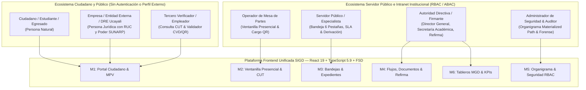
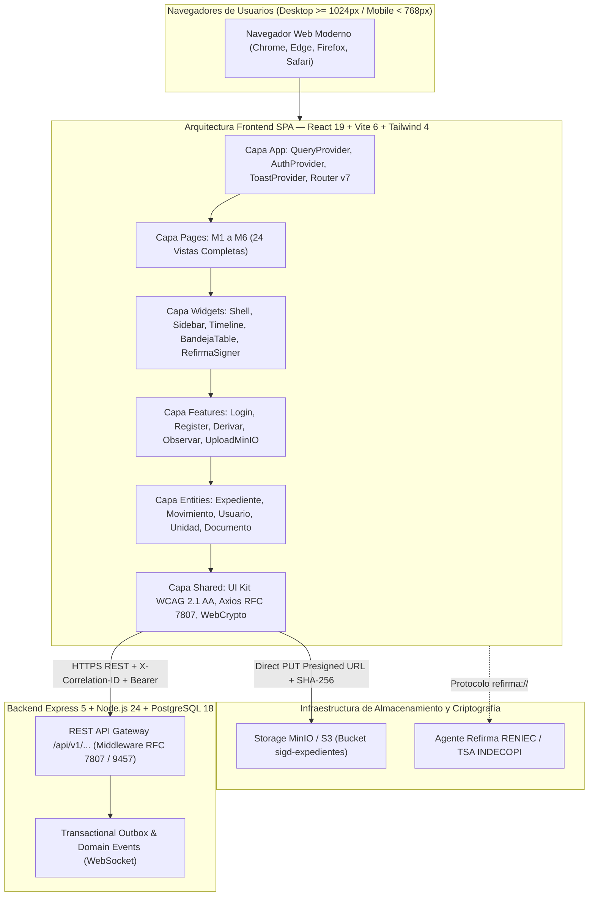
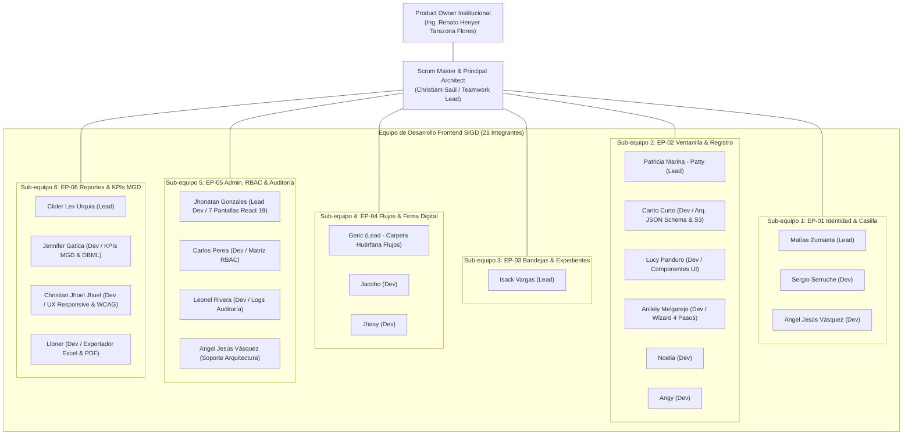
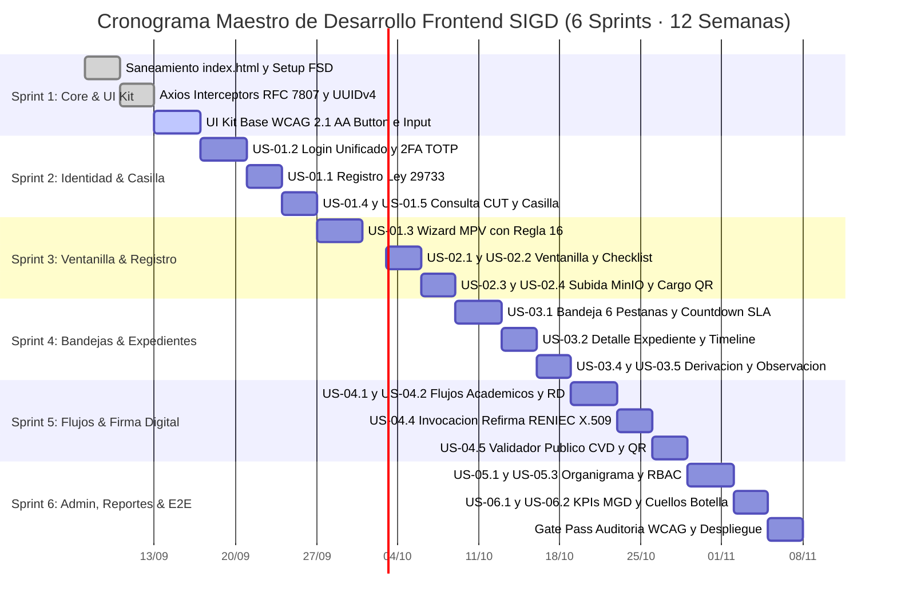
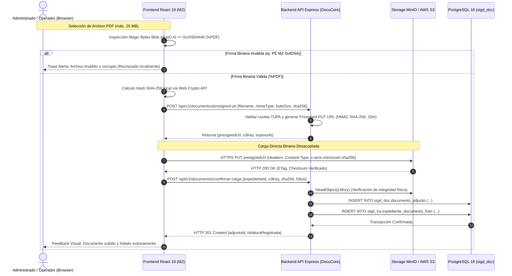
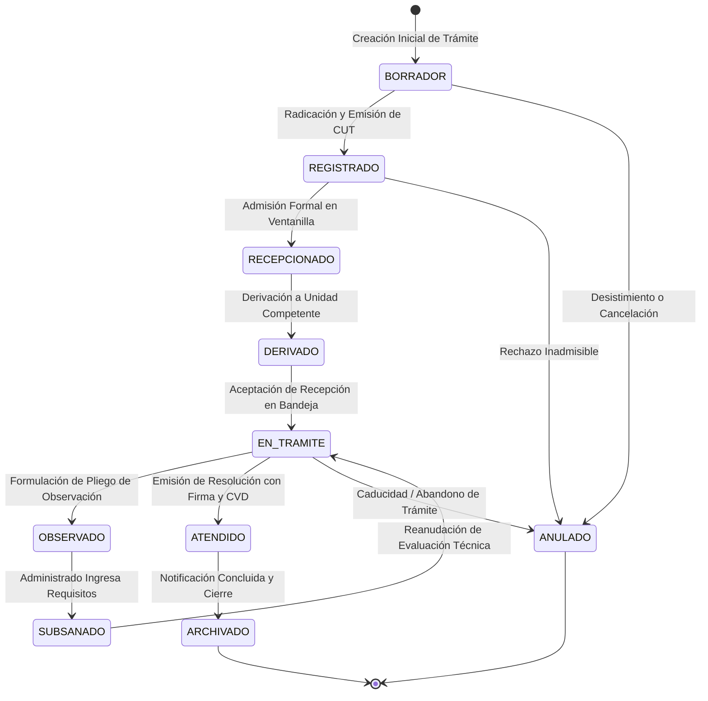
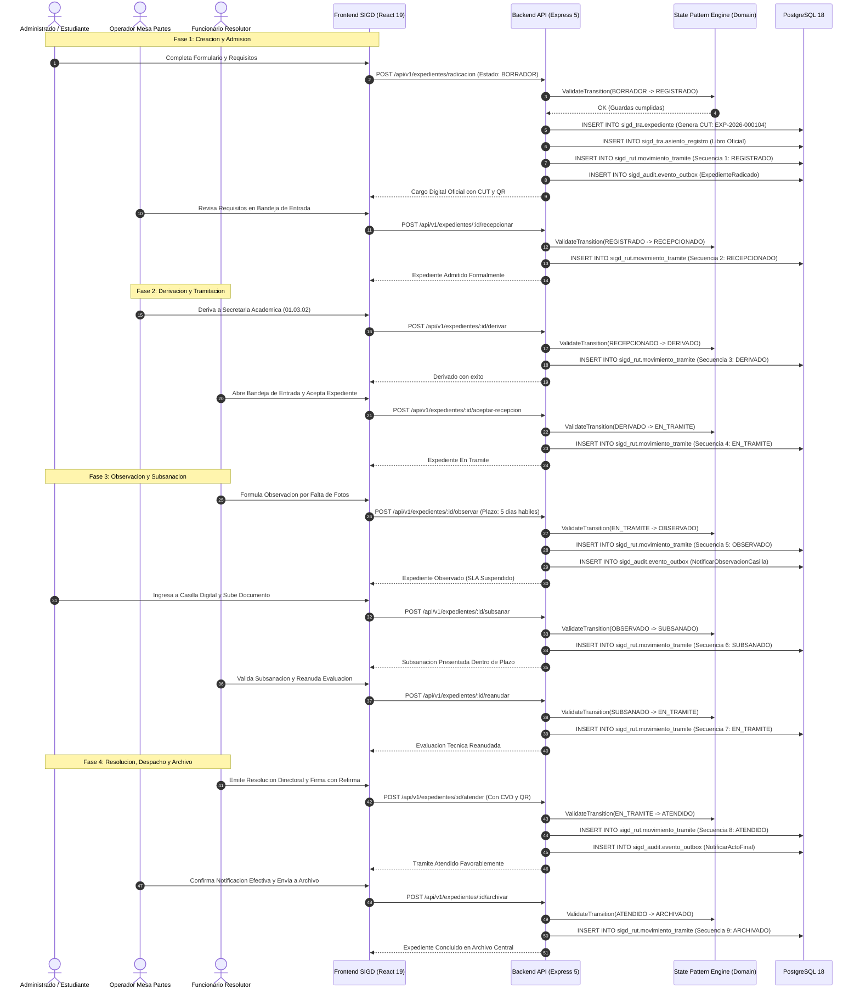
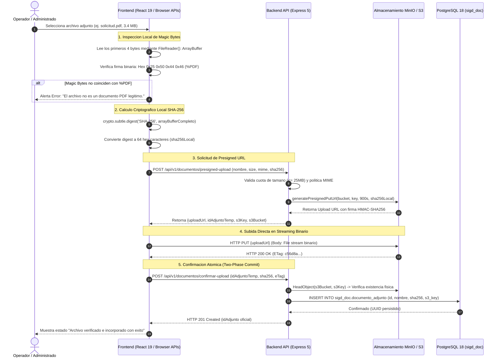
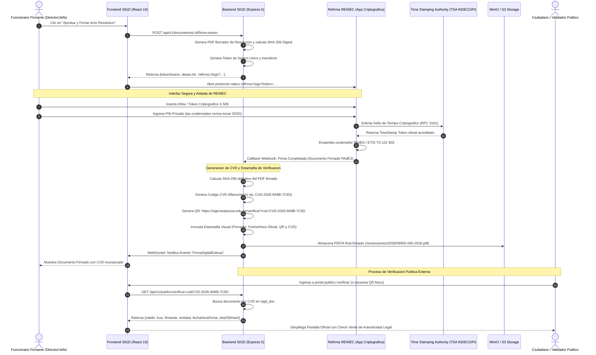

# PLAN DE TRABAJO GENERAL, BLUEPRINT DE ARQUITECTURA Y DISEÑO DE PLANTILLAS FRONTEND — SIGD
## Sistema Integral de Gestión Documentaria · IESTP "Suiza" (Pucallpa, Ucayali, Perú)

---

### METADATOS DEL DOCUMENTO DE INGENIERÍA
- **Documento:** Plan Maestro de Ingeniería Frontend, Marco Ágil Scrum Puro (6 Sprints · 28 User Stories INVEST/Gherkin), Catálogo Exhaustivo de Pantallas con Wireframes ASCII, Sistema de Diseño Institucional (UI Kit WCAG 2.1 AA), Arquitectura Feature-Sliced Design (FSD) y Blueprint de Sincronización Backend (PostgreSQL 18).
- **Código Documental:** `PLN-SIGD-FRONTEND-2026-SCRUM-MASTER-BLUEPRINT`
- **Institución:** Instituto de Educación Superior Tecnológico Público "Suiza" (IESTP "Suiza" - Pucallpa, Región Ucayali, Perú).
- **Programa Académico:** Programa de Estudios de Desarrollo de Sistemas de Información (PE DSI).
- **Unidad Didáctica:** Taller de Software / Taller de Base de Datos.
- **Docente Responsable / Product Owner Institucional:** Ing. Renato Henyer Tarazona Flores.
- **Rol del Autor:** Lead Senior Frontend Architect, Scrum Master & Integration Specialist (`teamwork_preview_worker`).
- **Destinatarios:** Líder General de Frontend (Christiam Saúl), Sub-equipos de Desarrollo Frontend (Grupos 1 al 6: Jhonatan Gonzales, Patricia Marina [Patty], Lucy Panduro, Carito Curto, Noelia, Angy, Anllely Melgarejo, Matías Zumaeta, Sergio Serruche, Angel Jesús Vásquez, Carlos Perea, Leonel Rivera, Isack Vargas, Geric, Jacobo, Jhasy, Clider Lex Urquia, Jennifer Gatica, Christian Jhoel Jhuel, Lloner), Equipo de Arquitectura Backend, Dirección General y Secretaría Académica.
- **Fecha de Emisión:** 03 de Septiembre de 2026.
- **Versión:** `v5.0.0 — Enterprise Scrum Master Blueprint & React 19 Architecture Edition (Post-Merge Refined)`.
- **Ubicación en Repositorio:** `frontend/docs/PLAN_DE_TRABAJO_GENERAL_FRONTEND_SIGD.md`

---

## 📑 ÍNDICE GENERAL

1. [RESUMEN EJECUTIVO Y VISIÓN ARQUITECTURAL DEL FRONTEND](#1-resumen-ejecutivo-y-visión-arquitectural-del-frontend)
   - 1.1. Misión Estratégica y Alineamiento Normativo Peruano (LPAG, MGD-PCM, Leyes N° 27269 y 29733, AGN)
   - 1.2. Actores del Ecosistema y Experiencia de Usuario
   - 1.3. Diagrama Arquitectural de Alto Nivel

2. [MARCO ÁGIL SCRUM PURO Y GOBERNANZA DE INGENIERÍA](#2-marco-ágil-scrum-puro-y-gobernanza-de-ingeniería)
   - 2.1. Organización del Equipo, Roles Scrum y Cadencia de Desarrollo (21 Integrantes)
   - 2.2. Mapeo Canónico de Épicas EP-01 a EP-06 con Módulos y Esquemas Backend
   - 2.3. Definición Multidimensional de Preparado (Definition of Ready - DoR)
   - 2.4. Definición Multidimensional de Terminado (Definition of Done - DoD)
   - 2.5. Product Backlog Priorizado: 28 User Stories con Criterios INVEST y Gherkin
   - 2.6. Roadmap de 6 Sprints (Capacidad en SP, Objetivos, Entregables y Diagrama Gantt Mermaid)
   - 2.7. Gobernanza de Equipo y Matriz RACI Integral
   - 2.8. Articulación con el Plan de Trabajo Modular y Evaluación Docente

3. [CATÁLOGO EXHAUSTIVO DE PANTALLAS Y WIREFRAMES ASCII (MÓDULOS M1 A M6)](#3-catálogo-exhaustivo-de-pantallas-y-wireframes-ascii-módulos-m1-a-m6)
   - 3.1. Módulo M1: Portal del Ciudadano & Mesa de Partes Virtual (EP-01 / `sigd_auth`, `sigd_tra`)
   - 3.2. Módulo M2: Ventanilla Presencial & Registro Documentario (EP-02 / `sigd_tra`, `sigd_doc`)
   - 3.3. Módulo M3: Bandejas del Funcionario & Gestión de Expedientes (EP-03 / `sigd_rut`)
   - 3.4. Módulo M4: Flujos Académicos, Firma Digital & Validez Legal (EP-04 / `sigd_doc`, `sigd_org`)
   - 3.5. Módulo M5: Administración, Seguridad RBAC & Auditoría (EP-05 / `sigd_org`, `sigd_auth`, `sigd_audit`)
   - 3.6. Módulo M6: Reportes, Indicadores de Gestión & Tableros de Control (EP-06 / `sigd_audit`, `sigd_tra`, `sigd_rut`)

4. [SISTEMA DE DISEÑO INSTITUCIONAL (UI KIT WCAG 2.1 AA)](#4-sistema-de-diseño-institucional-ui-kit-wcag-21-aa)
   - 4.1. Design Tokens Institucionales IESTP "Suiza"
   - 4.2. Reglas de Accesibilidad WCAG 2.1 AA y Matriz de Contraste Matemático
   - 4.3. Directivas de Navegación por Teclado y Atajos de Productividad
   - 4.4. Accesibilidad para Lectores de Pantalla (WAI-ARIA 1.2)
   - 4.5. Especificación de Componentes Atómicos Reutilizables

5. [ARQUITECTURA FEATURE-SLICED DESIGN (FSD) Y GESTIÓN DE ESTADO](#5-arquitectura-feature-sliced-design-fsd-y-gestión-de-estado)
   - 5.1. Stack Tecnológico de Vanguardia y Reglas de Dependencia FSD
   - 5.2. Árbol de Directorios FSD Exhaustivo para el SIGD
   - 5.3. Gestión de Server State con TanStack React Query v5
   - 5.4. Gestión de Client-Only State con Stores Zustand
   - 5.5. Cliente HTTP Axios con Interceptores Bidireccionales (JWT, X-Correlation-ID, RFC 7807)
   - 5.6. Protocolo de Carga Desacoplada MinIO/S3 con Magic Bytes y SHA-256

6. [TRAZABILIDAD Y SINCRONIZACIÓN INTEGRAL CON BACKEND](#6-trazabilidad-y-sincronización-integral-con-backend)
   - 6.1. Alineamiento con los 6 Esquemas PostgreSQL 18 y Planes de Levantamiento de Observaciones
   - 6.2. Máquina de Estados Finita (FSM) de 10 Estados bajo State Pattern
   - 6.3. Generador Atómico de CUT y Foliado Progresivo Continuo AGN
   - 6.4. Jerarquía Organizacional mediante Materialized Path (`01.03.02`)
   - 6.5. Modelo Polimórfico de Identidad y Consentimiento Informado (Ley N° 29733)
   - 6.6. Despacho Criptográfico de Firma Digital (Refirma RENIEC / PAdES) y Validador Público CVD
   - 6.7. Catálogo de Contratos TypeScript 5.9 y Endpoints RESTful `/api/v1/...`
   - 6.8. Diagramas de Secuencia Arquitecturales Mermaid

7. [DIAGNÓSTICO FORENSE DEL CÓDIGO FRONTEND Y HOJA DE RUTA SPRINT 1](#7-diagnóstico-forense-del-código-frontend-y-hoja-de-ruta-sprint-1)
   - 7.1. Inspección Forense de `frontend/index.html`
   - 7.2. Inspección Forense de `frontend/src/layouts/MainLayout.tsx`
   - 7.3. Inspección Forense de `frontend/src/api/client.ts`
   - 7.4. Matriz de Deuda Técnica y Antipatrones Detectados (DT-01 a DT-05)
   - 7.5. Plan de Remediación Integral en Sprint 1

8. [MATRIZ DE CASOS DE BORDE Y RESUMEN DE ENTREGABLES](#8-matriz-de-casos-de-borde-y-resumen-de-entregables)
   - 8.1. Matriz de Casos de Borde (Edge Cases) y Mitigaciones
   - 8.2. Resumen de Entregables Verificables y Articulación con la Evaluación Docente

---

# 1. RESUMEN EJECUTIVO Y VISIÓN ARQUITECTURAL DEL FRONTEND

## 1.1. Misión Estratégica y Alineamiento Normativo Peruano

El **Sistema Integral de Gestión Documentaria (SIGD)** del **Instituto de Educación Superior Tecnológico Público "Suiza"** (Pucallpa, Región Ucayali) es una plataforma de software gubernamental de misión crítica diseñada para digitalizar, agilizar, estandarizar y dotar de plena validez jurídica a la totalidad de trámites académicos y administrativos institucionales.

El desarrollo del frontend del SIGD tiene como meta principal erradicar el uso del papel mediante una experiencia de usuario moderna, rápida, accesible e intuitiva, asegurando el cumplimiento riguroso del marco normativo peruano:

1. **Texto Único Ordenado de la Ley N° 27444 (Ley del Procedimiento Administrativo General - LPAG):**
   - Cómputo de plazos administrativos estrictamente en **días hábiles** (excluyendo sábados, domingos y feriados nacionales/regionales de Ucayali).
   - Regla de corte automático de recepción a las **16:30 horas**: solicitudes recibidas con posterioridad a dicho límite se registran con la fecha y hora de recepción efectiva, pero su fecha de cómputo legal se inicia automáticamente a las 08:00 horas del siguiente día hábil computable (Art. 138 LPAG).
   - Acumulación formal de autos conexos mediante proveído motivado (Art. 160 LPAG).
   - Suspensión formal del cómputo de plazos institucionales durante el periodo de subsanación de observaciones técnicas (Art. 136 LPAG).

2. **Modelo de Gestión Documental (MGD - Secretaría de Gobierno y Transformación Digital - SGTD / PCM):**
   - Asignación unívoca del **Código Único de Trámite (CUT)** con máscara anual estandarizada `EXP-YYYY-XXXXXX` (ej. `EXP-2026-000104`).
   - Registro inmutable correlativo y continuo en el Libro General de Mesa de Partes, sin duplicidades ni reciclaje de numeración.

3. **Directivas del Archivo General de la Nación (AGN):**
   - Foliación acumulativa, progresiva e inmutable de los expedientes administrativos (`sigd_tra.expediente_documento_folio`).
   - Cada pieza documental incorporada al expediente certifica su rango de folios (`folio_inicio`, `folio_fin`, `total_folios`) con restricción de no solapamiento.

4. **Ley N° 27269 (Ley de Firmas y Certificados Digitales) y D.S. N° 026-2016-PCM:**
   - Integración PKI X.509 en formato estándar europeo PAdES (PDF Advanced Electronic Signatures) mediante la pasarela **Refirma RENIEC**.
   - Sellado de tiempo mediante Time Stamping Authority (TSA acreditada por INDECOPI).
   - Generación de Código de Verificación Digital (CVD) alfanumérico inmutable y código QR para cotejo público directo de autenticidad en portal web institucional.

5. **Ley N° 29733 (Ley de Protección de Datos Personales):**
   - Consentimiento expreso e informado en el registro de usuarios ciudadanos y empresas.
   - Ofuscación y disociación estricta de datos personales en el portal público de consulta de trámites (`47****96`, `J*** C***** P**** G*****`).
   - Constitución vinculante de la Casilla Electrónica como domicilio procesal digital institucional.

---

## 1.2. Actores del Ecosistema y Experiencia de Usuario

El frontend del SIGD articula dos grandes ecosistemas de interacción totalmente integrados pero desacoplados a nivel de interfaz:



---

## 1.3. Diagrama Arquitectural de Alto Nivel



---

# 2. MARCO ÁGIL SCRUM PURO Y GOBERNANZA DE INGENIERÍA

## 2.1. Organización del Equipo, Roles Scrum y Cadencia de Desarrollo

El proyecto frontend se ejecuta bajo un **Marco Ágil Scrum Puro**, articulando a la totalidad de colaboradores del repositorio y autores de los Pull Requests recientes (#62, #65, #66, #68, #69, #70 y #75, commit `4ec0c3a`), consolidando un equipo de **21 integrantes** distribuidos en roles de gobernanza institucional y 6 sub-equipos funcionales:



### Directorio Consolidado de Colaboradores del Repositorio (21 Integrantes):

| # | Integrante | Correo Electrónico | Git Username / Cuenta | Rol Scrum | Sub-equipo / Asignación Principal |
|:---:|---|---|---|---|---|
| 1 | **Christiam Saúl** | `christiamsaul@iestpsuiza.edu.pe` | `christiam-saul` | Lead Scrum Master & Arq. General | Transversal / Todos los módulos |
| 2 | **Matías Zumaeta** | `matias.zumaeta@iestpsuiza.edu.pe` | `matias-zumaeta` | Lead Sub-equipo 1 | M1: IdentiCore & Casilla |
| 3 | **Sergio Serruche** | `sergio.serruche@iestpsuiza.edu.pe` | `sergio-serruche` | Desarrollador Frontend | M1: IdentiCore & 2FA |
| 4 | **Angel Jesús Vásquez** | `angel.vasquez@iestpsuiza.edu.pe` | `angel-vasquez` | Desarrollador Frontend | M1 / M5: IdentiCore y Seguridad |
| 5 | **Patricia Marina (Patty)** | `patricia.marina@iestpsuiza.edu.pe` | `patricia-marina` | Lead Sub-equipo 2 | M2: Ventanilla & TramiCore |
| 6 | **Carito Curto** | `cakcy.3@gmail.com` | `cakcy3-web` (PR #66) | Especialista Frontend / Arq. S3 | M2: JSON Schema Draft 2020-12 & MinIO |
| 7 | **Lucy Panduro** | `panduroramoslucy@gmail.com` | `panduroramoslucy-ops` (`81f9987`) | Desarrolladora UI Kit | M2: Componentes `RegisterForm` y Modales |
| 8 | **Anllely Melgarejo** | `anllelymelgarejov@gmail.com` | `Anllely-melgarejo` (PR #62) | Desarrolladora Frontend | M2: Asistente Wizard de 4 Pasos |
| 9 | **Noelia** | `noelia.alva@iestpsuiza.edu.pe` | `noelia-alva` | Desarrolladora Frontend | M2: Checklist Requisitos TUPA |
| 10 | **Angy** | `angy.mendoza@iestpsuiza.edu.pe` | `angy-mendoza` | Desarrolladora Frontend | M2: Búsqueda y Padrón |
| 11 | **Isack Vargas** | `isack.vargas@iestpsuiza.edu.pe` | `isack-vargas` | Lead Sub-equipo 3 | M3: Bandejas & RutaDoc |
| 12 | **Geric** | `geric.castillo@iestpsuiza.edu.pe` | `geric-castillo` | Lead Sub-equipo 4 | M4: Flujos & Firma Digital |
| 13 | **Jacobo** | `jacobo.rios@iestpsuiza.edu.pe` | `jacobo-rios` | Desarrollador Frontend | M4: Editor Proyección RD |
| 14 | **Jhasy** | `jhasy.paredes@iestpsuiza.edu.pe` | `jhasy-paredes` | Desarrolladora Frontend | M4: Despacho y Validador CVD |
| 15 | **Jhonatan Gonzales** | `jhonatannijargonzalesdesouza@gmail.com` | `TuNombre` / `jhonatan` (PR #75) | Lead Sub-equipo 5 / Dev React 19 | M5: 7 Pantallas Administración & Router |
| 16 | **Carlos Perea** | `caps6954@gmail.com` | `soychivo` / `caps6954` (PR #68) | Especialista Seguridad Frontend | M5: Matriz RBAC (`03_control_acceso_roles_permisos_rbac.md`) |
| 17 | **Leonel Rivera** | `leonelrivera6759684@gmail.com` | `maxirivera` (PR #65, #69) | Desarrollador Frontend | M5: Bitácora Forense & Logs Inmutables |
| 18 | **Clider Lex Urquia** | `cliderlex@gmail.com` | `cliderlex-sketch` (PR #70) | Lead Sub-equipo 6 | M6: Analytics & KPIs MGD |
| 19 | **Jennifer Gatica** | `gaticasaavedrajennifer844@gmail.com` | `gaticasaavedrajennifer844-jpg` (PR #70)| Especialista Métricas & Datos | M6: Catálogo de KPIs, DBML & Fórmulas |
| 20 | **Christian Jhoel Jhuel** | `cliderlex@gmail.com` (vía PR #70) | `cliderlex-sketch` | Diseñador UX / Accesibilidad | M6: UX Responsive & WCAG 2.1 AA |
| 21 | **Lloner** | `lloner.araujo@iestpsuiza.edu.pe` | `lloner-araujo` | Desarrollador Frontend | M6: Generador y Exportador Excel/PDF |

### Eventos y Ceremonias Scrum
- **Duración del Sprint:** 2 semanas naturales (10 días hábiles de ingeniería).
- **Sprint Planning (Lunes Semana 1, 08:00 - 10:00, 2h):** El PO presenta el objetivo de negocio; el equipo desglosa historias que cumplen DoR en tareas técnicas y compromete el Sprint Backlog.
- **Daily Standup (Lunes a Viernes, 08:30 - 08:45, Timebox 15 min):** Sincronización diaria: 1) ¿Qué logré ayer?, 2) ¿Qué haré hoy?, 3) ¿Qué impedimentos tengo?
- **Backlog Refinement (Miércoles Semana 2, 16:00 - 17:30, 1.5h):** Estimación en Planning Poker (Fibonacci 1, 2, 3, 5, 8), validación de DoR y preparación del siguiente Sprint.
- **Sprint Review & Demo (Viernes Semana 2, 15:00 - 16:30, 1.5h):** Demostración pública del incremento de software potencialmente desplegable ante el PO y autoridades en entorno Staging.
- **Sprint Retrospective (Viernes Semana 2, 16:45 - 17:45, 1h):** Análisis del proceso: qué funcionó, qué falló y compromisos de mejora medibles para el siguiente ciclo.

---

## 2.2. Mapeo Canónico de Épicas EP-01 a EP-06 con Módulos y Esquemas Backend

| Épica | Módulo Funcional Frontend | Esquema PostgreSQL 18 | Plan Levantamiento Observaciones | Responsables de Sub-equipo | Alcance Funcional y Normativo |
|:---:|---|:---:|:---:|---|---|
| **EP-01** | **Portal del Ciudadano & Mesa de Partes Virtual** | `sigd_auth`, `sigd_tra` | `04_identicore.md`, `02_tramicore.md` | Matías Zumaeta & Sergio Serruche | Registro ciudadano/empresa bajo Ley N° 29733, autenticación unificada 2FA, Wizard MPV con regla de corte 16:30 hrs, Casilla Electrónica vincular y consulta pública CUT con datos anonimizados. |
| **EP-02** | **Ventanilla Presencial & Registro Documentario** | `sigd_tra`, `sigd_doc` | `02_tramicore.md`, `05_docucore.md` | Patricia Marina (Patty), Lucy, Noelia, Angy & Anllely | Ventanilla única de atención presencial, búsqueda en padrón institucional, verificación de checklist TUPA, subida desacoplada MinIO con Magic Bytes `%PDF` y SHA-256, generación atómica de CUT (`EXP-YYYY-XXXXXX`) y emisión de Cargo Oficial con código QR. |
| **EP-03** | **Bandejas del Funcionario & Gestión de Expedientes** | `sigd_rut` | `01_rutadoc.md` | Isack Vargas | Espacio de trabajo diario del servidor público: bandeja de 6 pestañas, semáforos SLA en días hábiles LPAG, timeline inmutable de hoja de ruta, derivación formal individual/múltiple, pliego de observaciones con suspensión legal y acumulación de expedientes conexos (Art. 160 LPAG). |
| **EP-04** | **Flujos Académicos, Firma Digital & Validez Legal** | `sigd_doc`, `sigd_org` | `05_docucore.md`, `03_organicore.md` | Geric, Jacobo & Jhasy | Visualizador de trámites de titulación/grados en 5 etapas, proyector de actos resolutivos (RD, Actas, Oficios) con plantillas dinámicas, despacho de firmas, invocación criptográfica a Refirma RENIEC (X.509 + TSA) y validador público CVD con QR. |
| **EP-05** | **Administración, Seguridad RBAC & Auditoría** | `sigd_org`, `sigd_auth`, `sigd_audit` | `03_organicore.md`, `04_identicore.md`, `06_corelink.md` | Angel Jesús Vásquez & Jhonatan | Visualizador interactivo del organigrama jerárquico mediante Materialized Path (`01.03.02`), asignación de plazas y encargaturas temporales con RD y exclusión GiST, administración de usuarios internos con matriz RBAC granular y visor de bitácora forense con `X-Correlation-ID`. |
| **EP-06** | **Reportes, Indicadores de Gestión & Tableros de Control** | `sigd_audit`, `sigd_tra`, `sigd_rut` | `06_corelink.md`, `02_tramicore.md`, `01_rutadoc.md` | Clider Lex Urquia, Gatica, Jhuel & Lloner | Tablero de control directivo con métricas oficiales del MGD (PCM), mapa de calor de cuellos de botella y días de retención por área, monitor de expedientes críticos por vencer (<48 hrs) y exportador multi-criterio estructurado en Excel (.xlsx) y PDF oficial. |

---

## 2.3. Definición Multidimensional de Preparado (Definition of Ready - DoR)

Una User Story se considera **Ready (Preparada para ingresar a la planificación del Sprint)** si y solo si satisface el 100% de las 5 dimensiones obligatorias:

1. **Dimensión 1: Funcional y Negocio (Criterios INVEST):**
   - Independiente (desacoplable de otras historias del mismo Sprint).
   - Negociable (detalles técnicos refinados con el equipo).
   - Valiosa (aporta valor directo al administrado, funcionario o directivo del IESTP "Suiza").
   - Estimable (equipo comprende el alcance técnico sin incertidumbres bloqueantes).
   - Pequeña (esfuerzo cabe holgadamente en el timebox del Sprint; $\le 8$ SP).
   - Comprobable (criterios de éxito verificables mediante pruebas objetivas).
   - Formulación canónica completa: *"Como [rol], quiero [acción], para [beneficio]"*.
   - Alineamiento explícito con la normativa peruana (LPAG 27444, MGD-PCM, Ley 27269 o Ley 29733).

2. **Dimensión 2: UI/UX y Wireframes:**
   - Wireframe ASCII o mockup aprobado que detalla la disposición de controles en desktop ($\ge 1024\text{px}$) y mobile ($< 768\text{px}$).
   - Diccionario de datos de pantalla: campos, tipos de input, máscaras, obligatoriedad y expresiones regulares.
   - Estados de interfaz definidos: Default, Hover, Focus, Loading (Skeleton), Empty State y Error.

3. **Dimensión 3: Técnica y Contratos API:**
   - Endpoint REST (`/api/v1/...`) documentado con método HTTP semántico, parámetros y esquema de request body.
   - Contratos de TypeScript 5.9 (interfaces DTO y tipos de respuesta) definidos e importados de `@shared/types`.
   - Catálogo de errores RFC 7807 asociados a la historia (`ERR-VAL-...`, `ERR-NEG-...`) tipado.

4. **Dimensión 4: Pruebas y Calidad:**
   - Criterios de Aceptación redactados en sintaxis formal **Gherkin** (`Dado - Cuando - Entonces` / `Given - When - Then`).
   - Al menos un escenario de éxito (*happy path*) y dos escenarios de excepción o error (*negative paths*).

5. **Dimensión 5: Estimación Acordada:**
   - Estimada y acordada en Planning Poker utilizando la escala Fibonacci ($1, 2, 3, 5, 8$).
   - Historias con estimación $\ge 13$ SP son divididas antes de ser admitidas en el Sprint.

---

## 2.4. Definición Multidimensional de Terminado (Definition of Done - DoD)

Un incremento de software o User Story se considera **Done (Terminado y Potencialmente Desplegable)** cuando supera las 7 dimensiones de control de calidad:

1. **Dimensión 1: Calidad de Código y Tipado TypeScript 5.9:**
   - Compilación estricta sin errores ni advertencias (`npm run typecheck` retorna código de salida 0).
   - Cero uso de `any` o conversiones forzadas (`as unknown as T`).
   - Formateo y linting superado sin warnings (`npm run lint` pasa con reglas ESLint y Prettier aplicadas).

2. **Dimensión 2: Arquitectura Feature-Sliced Design (FSD):**
   - Cumplimiento estricto de la regla de dependencia unidireccional (`app -> pages -> widgets -> features -> entities -> shared`).
   - Cero importaciones circulares y cero importaciones entre slices de la misma capa sin pasar por su fachada pública `index.ts`.

3. **Dimensión 3: Pruebas Automatizadas:**
   - Pruebas unitarias y de integración de componentes con **Vitest + React Testing Library** alcanzando $\ge 80\%$ de cobertura de sentencias en lógica crítica.
   - Mock Service Worker (MSW) configurado para simular contratos exitosos y respuestas RFC 7807 del backend.
   - Al menos 1 prueba E2E con **Playwright** para el flujo crítico de la historia implementada.

4. **Dimensión 4: Manejo Estándar de Errores RFC 7807 & Resiliencia:**
   - Todo formulario resalta automáticamente los campos en error recibidos en el arreglo `details` de `ApiProblemDetails`.
   - Errores globales de red o servidor (500) despliegan notificaciones Toast que muestran el `X-Correlation-ID`.
   - Server State gestionado con TanStack Query v5 con `staleTime: 60s` e invalidación determinista de query keys.

5. **Dimensión 5: Accesibilidad Web WCAG 2.1 AA:**
   - Ratio de contraste cromático matemáticamente validado ($\ge 4.5:1$ en texto normal, $\ge 3:1$ en controles UI).
   - Navegación completa por teclado (`Tab`, `Shift+Tab`, `Enter`, `Escape`, `Flechas`) sin trampas de foco (*keyboard traps*).
   - Inputs con etiquetas accesibles (`htmlFor` o `aria-labelledby`) y `aria-describedby` para mensajes de error.
   - Anuncios dinámicos en regiones en vivo (`aria-live="polite"` o `role="alert"`).

6. **Dimensión 6: Seguridad y Trazabilidad:**
   - Solicitudes HTTP transmiten el header `X-Correlation-ID: <UUIDv4>` y `Authorization: Bearer <Token>`.
   - Archivos adjuntos son validados localmente mediante Magic Bytes y hash SHA-256 antes del `PUT` directo a MinIO/S3.
   - Cero almacenamiento de secretos o contraseñas en `localStorage` (tokens en memoria en `AuthStore` de Zustand).

7. **Dimensión 7: Revisión de Pares y Despliegue en Staging:**
   - Pull Request revisado y aprobado por al menos 1 par del sub-equipo y por el Lead General de Frontend (Christiam Saúl).
   - Despliegue verificado y probado en el entorno Staging del IESTP "Suiza" con datos anonimizados.

---

## 2.5. Product Backlog Priorizado: 28 User Stories con Criterios INVEST y Gherkin

### ÉPICA EP-01: Portal del Ciudadano & Mesa de Partes Virtual (M1)

#### US-01.1: Registro de Usuario Ciudadano / Empresa con Cláusula Ley N° 29733
- **ID:** `US-01.1` | **Épica:** `EP-01` | **Prioridad:** Alta (P1) | **Story Points:** 5
- **Título:** Formulario de Registro Público con Consentimiento de Datos y Casilla Electrónica
- **Declaración:**
  > **Como** ciudadano o representante legal de una empresa,  
  > **quiero** registrarme en el portal del SIGD ingresando mis datos de identidad y aceptando la cláusula de protección de datos,  
  > **para** obtener una cuenta de acceso y una Casilla Electrónica oficial que me permita tramitar ante el IESTP "Suiza".
- **Criterios de Aceptación (Gherkin):**
  ```gherkin
  Escenario: Registro exitoso de persona natural con DNI válido
    Dado que el usuario se encuentra en la pantalla de registro "/registro"
    Y selecciona el tipo de persona "Persona Natural"
    Cuando ingresa un número de DNI válido de 8 dígitos "47852196"
    Y completa nombres, apellidos, correo institucional/personal y contraseña segura
    Y marca la casilla obligatoria de consentimiento de la Ley N° 29733 y Casilla Electrónica
    Y presiona el botón "Crear mi Cuenta"
    Entonces el sistema envía una petición POST a "/api/v1/identicore/usuarios-externos"
    Y muestra un mensaje de confirmación solicitando la validación del código enviado al correo
    Y redirige a la pantalla de verificación de cuenta.

  Escenario: Intento de registro sin aceptar la cláusula de la Ley N° 29733
    Dado que el usuario completó todos los campos obligatorios del formulario
    Pero no marcó la casilla de consentimiento de la Ley N° 29733
    Cuando presiona el botón "Crear mi Cuenta"
    Entonces el sistema bloquea el envío del formulario
    Y resalta el checkbox en color rojo con el mensaje "Debe autorizar el tratamiento de datos y la notificación en casilla electrónica conforme a ley".
  ```

#### US-01.2: Login Unificado Ciudadano/Funcionario con Verificación 2FA TOTP
- **ID:** `US-01.2` | **Épica:** `EP-01` | **Prioridad:** Alta (P1) | **Story Points:** 5
- **Título:** Autenticación Unificada con Soporte para Segundo Factor de Autenticación
- **Declaración:**
  > **Como** usuario registrado (ciudadano o servidor público del IESTP "Suiza"),  
  > **quiero** iniciar sesión con mis credenciales institucionales y validar mi código 2FA si aplica,  
  > **para** ingresar de forma segura a mis servicios autorizados según mi rol RBAC.
- **Criterios de Aceptación (Gherkin):**
  ```gherkin
  Escenario: Inicio de sesión exitoso de un servidor público con 2FA habilitado
    Dado que el funcionario ingresa a "/login" y selecciona la pestaña "Servidor Público"
    Cuando introduce su usuario "jzumaeta" y contraseña correcta
    Y hace clic en "Ingresar al Sistema"
    Entonces la API responde con estado 200 y el flag "requires2fa: true"
    Y el frontend redirige a la vista "/verificar-2fa"
    Cuando el usuario ingresa el token TOTP de 6 dígitos "589214" antes de su caducidad
    Entonces el sistema almacena el JWT en el AuthStore de Zustand y navega a "/bandeja".

  Escenario: Credenciales inválidas devuelven error tipado RFC 7807
    Dado que el usuario ingresa una contraseña incorrecta en "/login"
    Cuando hace clic en "Ingresar al Sistema"
    Entonces el backend devuelve HTTP 401 con el código "ERR-AUTH-001"
    Y el formulario resalta el campo de contraseña mostrando "Usuario o contraseña institucional incorrectos".
  ```

#### US-01.3: Asistente Virtual de Trámites (Wizard 4 Pasos con Regla LPAG 16:30 hrs)
- **ID:** `US-01.3` | **Épica:** `EP-01` | **Prioridad:** Crítica (P0) | **Story Points:** 8
- **Título:** Asistente Guiado de Presentación en Mesa de Partes Virtual
- **Declaración:**
  > **Como** administrado autenticado en la plataforma ciudadana,  
  > **quiero** registrar una solicitud virtual a través de un asistente paso a paso, adjuntando requisitos y conociendo el horario de cómputo legal,  
  > **para** formalizar mi trámite ante el instituto con plena validez administrativa conforme al TUO Ley N° 27444.
- **Criterios de Aceptación (Gherkin):**
  ```gherkin
  Escenario: Registro de solicitud virtual después del horario de corte (16:30 hrs)
    Dado que la hora local de Pucallpa es "17:15 hrs" de un día hábil
    Cuando el ciudadano se encuentra en el Paso 4 "Confirmación y Envío" del asistente MPV
    Entonces la interfaz despliega una alerta preventiva destacada en color ámbar informando:
      "Atención: Según el Art. 138 del TUO Ley N° 27444, las solicitudes recibidas después de las 16:30 hrs se consideran presentadas el siguiente día hábil computable."
    Cuando el ciudadano presiona "Confirmar y Presentar Trámite"
    Entonces el sistema genera el CUT con fecha de registro de hoy y fecha de cómputo legal del próximo día hábil.

  Escenario: Validación de archivo principal en formato PDF legítimo
    Dado que el ciudadano está en el Paso 3 "Adjuntar Requisitos"
    Cuando selecciona un archivo "solicitud.exe" renombrado como "solicitud.pdf"
    Entonces el componente FileUploader examina los Magic Bytes en el cliente mediante Web Crypto API
    Y al detectar que no inicia con "0x25 0x50 0x44 0x46" (%PDF)
    Entonces rechaza la carga inmediatamente sin consumir ancho de banda y muestra:
      "Archivo inválido: La cabecera binaria no corresponde a un documento PDF legítimo."
  ```

#### US-01.4: Consulta Pública de Expedientes por CUT con Datos Anonimizados
- **ID:** `US-01.4` | **Épica:** `EP-01` | **Prioridad:** Media (P2) | **Story Points:** 3
- **Título:** Buscador Público de Estado de Trámites con Protección de Datos
- **Declaración:**
  > **Como** ciudadano en general,  
  > **quiero** consultar la situación actual y la hoja de ruta de un expediente ingresando únicamente su código CUT,  
  > **para** conocer su avance y oficina de permanencia sin comprometer información confidencial de terceros.
- **Criterios de Aceptación (Gherkin):**
  ```gherkin
  Escenario: Búsqueda exitosa de expediente CUT con enmascaramiento de datos personales
    Dado que un usuario anónimo accede a "/consulta-tramite"
    Cuando introduce el código "EXP-2026-000104" y pulsa "Consultar"
    Entonces el frontend consume "GET /api/v1/tramicore/expedientes/consulta-publica/EXP-2026-000104"
    Y despliega el estado actual "EN_TRAMITE", la oficina actual "Secretaría Académica"
    Y enmascara el nombre del administrado mostrando "J*** C***** P**** G*****" y DNI "47****96"
    Y lista la cronología simplificada de movimientos.

  Escenario: Búsqueda con código CUT inexistente
    Dado que el usuario introduce "EXP-2026-999999"
    Cuando presiona "Consultar"
    Entonces la API retorna HTTP 404 con "ERR-TRA-404"
    Y la vista muestra un EmptyState informando: "No se encontró ningún expediente asociado al código CUT ingresado. Verifique el año y la numeración."
  ```

#### US-01.5: Casilla Electrónica Ciudadana y Acuse de Notificación Legal
- **ID:** `US-01.5` | **Épica:** `EP-01` | **Prioridad:** Alta (P1) | **Story Points:** 5
- **Título:** Bandeja de Notificaciones Oficiales con Generación Automática de Acuse
- **Declaración:**
  > **Como** administrado con casilla electrónica activa,  
  > **quiero** visualizar las notificaciones y actos administrativos emitidos por el instituto y generar el acuse de recibo legal,  
  > **para** darme por válidamente notificado y acceder a las resoluciones o requerimientos emitidos.
- **Criterios de Aceptación (Gherkin):**
  ```gherkin
  Escenario: Apertura de notificación pendiente y emisión de acuse vinculante
    Dado que el ciudadano ingresa a "/casilla" y visualiza una notificación con estado "NO_LEÍDO"
    Cuando hace clic sobre la notificación para abrir el modal de lectura
    Entonces el frontend dispara automáticamente un POST a "/api/v1/identicore/casilla/notificaciones/:id/acuse"
    Y el backend registra la marca de tiempo legal inmutable
    Y el estado de la notificación cambia a "LEÍDO_CON_ACUSE" con badge verde
    Y se habilita el botón de descarga del documento firmado digitalmente.
  ```

---

### ÉPICA EP-02: Ventanilla Presencial & Registro Documentario (M2)

#### US-02.1: Ventanilla Única de Recepción Física con Búsqueda en Padrón
- **ID:** `US-02.1` | **Épica:** `EP-02` | **Prioridad:** Crítica (P0) | **Story Points:** 5
- **Título:** Formulario de Registro en Ventanilla Presencial y Consulta de Padrón
- **Declaración:**
  > **Como** operador de Mesa de Partes presencial,  
  > **quiero** buscar al administrado en el padrón institucional por su DNI o RUC y registrar su trámite físico en pantalla,  
  > **para** reducir el tiempo de atención en ventanilla y evitar errores en los datos del recurrente.
- **Criterios de Aceptación (Gherkin):**
  ```gherkin
  Escenario: Autocompletado exitoso de datos de un estudiante registrado
    Dado que el operador se encuentra en "/ventanilla/recepcion"
    Cuando introduce el DNI "47852196" y presiona "Buscar Padrón"
    Entonces el sistema invoca "GET /api/v1/identicore/padron/47852196"
    Y autocompleta los campos "Nombres", "Apellidos", "Programa de Estudios" y "Correo"
    Y enfoca el selector de Procedimiento TUPA.

  Escenario: Solicitante no empadronado permite apertura de modal de alta rápida
    Dado que el operador ingresa un DNI no existente en el padrón local
    Cuando la búsqueda retorna 404
    Entonces el sistema despliega el botón "Registrar Nueva Persona"
    Y al presionarlo abre un modal para ingresar los datos mínimos de identidad conforme a RENIEC.
  ```

#### US-02.2: Checklist de Requisitos TUPA y Formulación In Situ de Observación
- **ID:** `US-02.2` | **Épica:** `EP-02` | **Prioridad:** Alta (P1) | **Story Points:** 5
- **Título:** Verificación Interactiva de Requisitos TUPA y Control de Admisibilidad
- **Declaración:**
  > **Como** operador de Mesa de Partes,  
  > **quiero** marcar el cumplimiento de cada requisito según el procedimiento TUPA seleccionado y formular observaciones preliminares si faltara alguno,  
  > **para** garantizar la admisibilidad formal del trámite o conceder el plazo de subsanación de 48 horas según ley.
- **Criterios de Aceptación (Gherkin):**
  ```gherkin
  Escenario: Cumplimiento total de requisitos TUPA habilita el registro directo
    Dado que el operador seleccionó el procedimiento "Certificado Oficial de Estudios"
    Y el sistema despliega el checklist con los 3 requisitos normativos
    Cuando el operador marca los 3 requisitos como "Presentado y Conforme"
    Entonces el botón "Generar CUT y Emitir Cargo" se habilita en color azul institucional.

  Escenario: Falta de requisito obligatorio emite Constancia de Recepción Observada
    Dado que falta el recibo de pago por derecho de trámite
    Cuando el operador marca dicho requisito como "No Presentado"
    Y pulsa "Registrar con Observación de Ventanilla"
    Entonces el sistema registra el expediente con estado "OBSERVADO_VENTANILLA"
    Y genera un cargo que otorga expresamente 2 días hábiles (48 hrs) para la subsanación.
  ```

#### US-02.3: Subida Desacoplada a MinIO con Magic Bytes `%PDF`, SHA-256 y Foliado AGN
- **ID:** `US-02.3` | **Épica:** `EP-02` | **Prioridad:** Crítica (P0) | **Story Points:** 8
- **Título:** Componente FileUploader Desacoplado con Verificación Criptográfica y Foliación
- **Declaración:**
  > **Como** operador de Mesa de Partes o administrado,  
  > **quiero** adjuntar los expedientes digitalizados mediante subida directa al bucket de almacenamiento MinIO,  
  > **para** optimizar el rendimiento de la aplicación, asegurar la integridad del archivo y calcular la foliatura correlativa.
- **Criterios de Aceptación (Gherkin):**
  ```gherkin
  Escenario: Carga binaria directa exitosa a MinIO mediante Presigned URL
    Dado que el usuario arrastra un archivo PDF de 15 MB al FileUploader
    Cuando el componente inspecciona los primeros 4 bytes ("%PDF") y calcula el hash SHA-256 local
    Y solicita la Presigned URL a "/api/v1/docucore/archivos/presigned-upload"
    Y realiza el PUT HTTP directo hacia el storage de MinIO
    Y finalmente envía la confirmación a "/api/v1/docucore/archivos/confirmar" con el total de 18 folios
    Entonces la vista actualiza el indicador mostrando "Documento vinculado exitosamente: Folios 1 al 18"
    Y despliega el resumen del hash SHA-256 verificado.
  ```

#### US-02.4: Generación Atómica de CUT (`EXP-YYYY-XXXXXX`) e Impresión de Cargo Oficial con QR
- **ID:** `US-02.4` | **Épica:** `EP-02` | **Prioridad:** Crítica (P0) | **Story Points:** 5
- **Título:** Emisión de Cargo de Recepción Oficial con Código QR Dinámico
- **Declaración:**
  > **Como** operador de Mesa de Partes,  
  > **quiero** emitir e imprimir el Cargo Oficial de Recepción con su código CUT y QR institucional,  
  > **para** entregar la constancia física sellada al administrado con su clave de seguimiento.
- **Criterios de Aceptación (Gherkin):**
  ```gherkin
  Escenario: Generación de cargo oficial con formato normativo y código QR
    Dado que el operador finalizó el registro satisfactorio de un trámite
    Cuando el servidor confirma la creación retornando el CUT "EXP-2026-000105"
    Entonces el frontend renderiza la vista de Cargo Oficial de Recepción conteniendo:
      - Logotipo institucional del IESTP "Suiza"
      - CUT formateado en fuente monospace de 18pt
      - Código QR dinámico que apunta a "https://sigd.iestpsuiza.edu.pe/consulta-tramite?cut=EXP-2026-000105"
      - Resumen de folios y sello de tiempo de ventanilla
    Y ejecuta automáticamente el comando de impresión en hoja A5 o ticket térmico.
  ```

#### US-02.5: Libro Oficial Correlativo de Entradas y Salidas de Mesa de Partes
- **ID:** `US-02.5` | **Épica:** `EP-02` | **Prioridad:** Media (P2) | **Story Points:** 3
- **Título:** Libro Registro Diario Digital con Foliación Correlativa
- **Declaración:**
  > **Como** jefa de Mesa de Partes,  
  > **quiero** consultar el Libro Digital de Entradas y Salidas filtrando por fecha y estado,  
  > **para** mantener el control correlativo exigido por las normas de archivo público del Estado.
- **Criterios de Aceptación (Gherkin):**
  ```gherkin
  Escenario: Filtrado del libro de registro del día actual
    Dado que la jefa accede a "/ventanilla/libro-registro"
    Cuando selecciona la fecha "Hoy" y el tipo "Entradas"
    Entonces la tabla renderiza correlativamente todos los números de registro emitidos
    Y permite exportar la nómina del día a formato Excel oficial o PDF foliado.
  ```

---

### ÉPICA EP-03: Bandejas del Funcionario & Gestión de Expedientes (M3)

#### US-03.1: Bandeja de Trabajo Diario con 6 Pestañas y Semáforo SLA Dinámico
- **ID:** `US-03.1` | **Épica:** `EP-03` | **Prioridad:** Crítica (P0) | **Story Points:** 8
- **Título:** Bandeja Operativa del Servidor Público con Countdown de Días Hábiles LPAG
- **Declaración:**
  > **Como** especialista o jefe de área del instituto,  
  > **quiero** gestionar mis expedientes distribuidos en 6 pestañas funcionales y visualizar un semáforo SLA de días hábiles restantes,  
  > **para** priorizar mi carga laboral y evitar incurrir en vencimiento de plazos administrativos.
- **Criterios de Aceptación (Gherkin):**
  ```gherkin
  Escenario: Visualización de expediente en riesgo con semáforo SLA rojo
    Dado que un expediente tiene 1 día hábil restante antes de su vencimiento legal
    Cuando el funcionario ingresa a la pestaña "En Atención" de su bandeja "/bandeja"
    Entonces la fila del expediente muestra una píldora con el componente SlaCountdown en color rojo "#DC2626"
    Y el texto "1 día hábil - Urgente"
    Y ubica dicho registro en la parte superior de la tabla mediante ordenamiento prioritario automático.

  Escenario: Cambio entre las 6 pestañas de estado sin recarga completa
    Dado que el usuario está en la pestaña "Por Recibir (Pendientes)"
    Cuando hace clic en la pestaña "Observados"
    Entonces TanStack Query v5 recupera en caché los datos correspondientes usando la query key:
      "['expedientes', 'bandeja', 'OBSERVADOS', { page: 1 }]"
    Y renderiza la tabla en menos de 200 ms sin parpadeos de interfaz.
  ```

#### US-03.2: Detalle Integral del Expediente, Hoja de Ruta Inmutable y Visor PDF
- **ID:** `US-03.2` | **Épica:** `EP-03` | **Prioridad:** Crítica (P0) | **Story Points:** 8
- **Título:** Vista Integral de Expediente con Timeline Histórico y Visor de Documentos
- **Declaración:**
  > **Como** servidor público asignado a la atención de un expediente,  
  > **quiero** consultar la hoja de ruta completa en una línea de tiempo inmutable y revisar los anexos en un visor PDF integrado,  
  > **para** analizar el historial de actuaciones previas antes de emitir mi pronunciamiento.
- **Criterios de Aceptación (Gherkin):**
  ```gherkin
  Escenario: Inspección del timeline inmutable con firmas y anexos
    Dado que el especialista abre el expediente "EXP-2026-000104"
    Cuando visualiza la sección "Hoja de Ruta Histórica"
    Entonces el widget ExpedienteTimeline despliega de forma vertical cada evento:
      - Área de origen, área de destino, actor, proveído y timestamp exacto
      - Enlaces de descarga o previsualización de anexos con hash SHA-256 verificado
    Y muestra al lado derecho el visor PdfViewer cargando el documento principal sin necesidad de descargarlo al disco local.
  ```

#### US-03.3: Recepción y Aceptación Formal de Expediente Derivado
- **ID:** `US-03.3` | **Épica:** `EP-03` | **Prioridad:** Alta (P1) | **Story Points:** 3
- **Título:** Aceptación de Cargo de Recepción en Bandeja de Entrada
- **Declaración:**
  > **Como** funcionario de una unidad orgánica de destino,  
  > **quiero** pulsar la acción "Aceptar Recepción" sobre un expediente en estado "PENDIENTE_RECEPCION",  
  > **para** confirmar la posesión del trámite y dar inicio formal al cómputo de atención de mi área.
- **Criterios de Aceptación (Gherkin):**
  ```gherkin
  Escenario: Aceptación exitosa de expediente derivado
    Dado que el usuario tiene un expediente en la pestaña "Por Recibir"
    Cuando hace clic en el botón "Aceptar Recepción"
    Entonces el sistema ejecuta la mutación optimista a "POST /api/v1/rutadoc/movimientos/:id/aceptar"
    Y traslada de inmediato el expediente hacia la pestaña "En Atención"
    Y despliega un toast verde: "Expediente EXP-2026-000104 recepcionado formalmente por su unidad".
  ```

#### US-03.4: Modal de Derivación Formal (Individual / Múltiple con Proveído)
- **ID:** `US-03.4` | **Épica:** `EP-03` | **Prioridad:** Alta (P1) | **Story Points:** 5
- **Título:** Derivación Interna con Selección de Proveído TUPA y Días de Plazo
- **Declaración:**
  > **Como** servidor público en posesión de un expediente,  
  > **quiero** derivar el trámite hacia otra área seleccionando un proveído estandarizado e indicando los folios agregados,  
  > **para** transferir la responsabilidad funcional del trámite respetando la cadena de custodia.
- **Criterios de Aceptación (Gherkin):**
  ```gherkin
  Escenario: Derivación formal a otra área con proveído estándar
    Dado que el usuario abre el modal de derivación de un expediente en atención
    Cuando selecciona el área destino "Unidad de Contabilidad"
    Y escoge el proveído "PARA INFORME Y EMISIÓN DE LIQUIDACIÓN"
    Y define un plazo específico de "3 días hábiles"
    Y adjunta una minuta interna indicando "+2 folios adicionales"
    Y presiona "Confirmar Derivación"
    Entonces el sistema envía "POST /api/v1/rutadoc/movimientos/:id/derivar"
    Y el expediente desaparece de su bandeja de atención activa, figurando en la pestaña "Derivados".
  ```

#### US-03.5: Formulación de Pliego de Observaciones y Suspensión de Cómputo LPAG
- **ID:** `US-03.5` | **Épica:** `EP-03` | **Prioridad:** Alta (P1) | **Story Points:** 5
- **Título:** Modal de Observación Formal con Notificación a Casilla y Congelamiento de Plazo
- **Declaración:**
  > **Como** funcionario evaluador,  
  > **quiero** formular observaciones técnicas al expediente y otorgar un plazo perentorio de subsanación,  
  > **para** congelar el cómputo de plazos institucionales y notificar formalmente al administrado en su Casilla.
- **Criterios de Aceptación (Gherkin):**
  ```gherkin
  Escenario: Formulación de observación suspende el plazo legal LPAG
    Dado que el expediente requiere rectificación de partida de nacimiento
    Cuando el funcionario abre el modal de observación, ingresa el pliego de reparos
    Y establece un plazo de subsanación de "10 días hábiles" conforme al Art. 136 de la LPAG
    Y pulsa "Emitir Notificación de Observación"
    Entonces el estado del expediente pasa a "OBSERVADO"
    Y el temporizador del semáforo SLA entra en estado "CONGELADO / SUSPENDIDO"
    Y se despacha una notificación con acuse a la Casilla Electrónica del administrado.
  ```

#### US-03.6: Acumulación de Expedientes Conexos conforme al Art. 160 de la LPAG
- **ID:** `US-03.6` | **Épica:** `EP-03` | **Prioridad:** Media (P2) | **Story Points:** 5
- **Título:** Modal de Acumulación de Autos para Trámites con Identidad de Objeto
- **Declaración:**
  > **Como** director o asesor legal,  
  > **quiero** vincular y acumular dos o más expedientes conexos en un expediente principal,  
  > **para** tramitarlos y resolverlos bajo una sola resolución conforme al Art. 160 de la LPAG.
- **Criterios de Aceptación (Gherkin):**
  ```gherkin
  Escenario: Acumulación exitosa de expediente accesorio a expediente principal
    Dado que el usuario selecciona la acción "Acumular Trámites" en el expediente principal "EXP-2026-000080"
    Cuando introduce el código del expediente secundario "EXP-2026-000095"
    Y el sistema valida que ambos pertenecen al mismo administrado y versan sobre la misma materia
    Y el usuario adjunta el proveído sustentatorio de acumulación
    Entonces la API consolida la foliatura y marca el secundario como "ACUMULADO_EN_EXP-2026-000080"
    Y la hoja de ruta refleja la vinculación inmutable de ambos autos.
  ```

---

### ÉPICA EP-04: Flujos Académicos, Firma Digital & Validez Legal (M4)

#### US-04.1: Visualizador y Orquestador de Flujos Académicos de Titulación
- **ID:** `US-04.1` | **Épica:** `EP-04` | **Prioridad:** Alta (P1) | **Story Points:** 8
- **Título:** Orquestador Gráfico del Flujo de Emisión de Grados y Títulos
- **Declaración:**
  > **Como** jefa de Secretaría Académica,  
  > **quiero** monitorear el avance de las solicitudes de titulación a través de las 5 fases institucionales reglamentarias,  
  > **para** verificar el cumplimiento correlativo de créditos, prácticas pre-profesionales y sustanciación.
- **Criterios de Aceptación (Gherkin):**
  ```gherkin
  Escenario: Visualización de fases del flujo académico con hitos completados
    Dado que la secretaria académica ingresa a "/flujos/academico/:id"
    Cuando carga la interfaz del orquestador
    Entonces la pantalla despliega un diagrama interactivo de etapas:
      1. Verificación de Expediente Académico (Completada - Check verde)
      2. Constancia de No Adeudo de Biblioteca y Caja (Completada - Check verde)
      3. Dictamen de Jurado Evaluador (En Curso - Resaltado azul)
      4. Emisión de Proyecto de Resolución Directoral (Pendiente - Gris)
      5. Firma Digital e Inscripción en Registro Institucional (Pendiente - Gris)
    Y permite adjuntar el dictamen correspondiente para desbloquear la fase 4.
  ```

#### US-04.2: Editor de Proyección de Documentos Oficiales con Inyección de Variables
- **ID:** `US-04.2` | **Épica:** `EP-04` | **Prioridad:** Alta (P1) | **Story Points:** 8
- **Título:** Editor de Textos Oficiales (RD, Oficios, Actas) con Inyección Automática
- **Declaración:**
  > **Como** redactor o proyectista institucional,  
  > **quiero** proyectar un documento oficial seleccionando una plantilla normativa con autocompletado de datos del expediente,  
  > **para** redactar el acto administrativo sin cometer errores de transcripción en nombres, fechas y considerandos.
- **Criterios de Aceptación (Gherkin):**
  ```gherkin
  Escenario: Proyección de Resolución Directoral con variables dinámicas
    Dado que el usuario accede a "/documentos/generar" vinculado al expediente "EXP-2026-000104"
    Cuando selecciona la plantilla oficial "Resolución Directoral - Otorgamiento de Título"
    Entonces el editor inyecta automáticamente:
      - `{{NUMERO_EXPEDIENTE}}` -> "EXP-2026-000104"
      - `{{NOMBRE_ADMINISTRADO}}` -> "JUAN CARLOS PÉREZ GARCÍA"
      - `{{PROGRAMA_ESTUDIOS}}` -> "DESARROLLO DE SISTEMAS DE INFORMACIÓN"
      - `{{FECHA_ACTUAL_LEGAL}}` -> "Pucallpa, 03 de Septiembre de 2026"
    Y permite editar los considerandos en un área enriquecida con conteo de palabras y previsualización de foliado.
  ```

#### US-04.3: Bandeja de Despacho de Documentos Pendientes de Firma
- **ID:** `US-04.3` | **Épica:** `EP-04` | **Prioridad:** Alta (P1) | **Story Points:** 5
- **Título:** Bandeja de Firma Digital Individual y Masiva para Autoridades
- **Declaración:**
  > **Como** Director General del IESTP "Suiza",  
  > **quiero** examinar la lista de resoluciones y oficios proyectados listos para mi rúbrica,  
  > **para** autorizarlos individualmente o seleccionarlos para firma masiva por lotes.
- **Criterios de Aceptación (Gherkin):**
  ```gherkin
  Escenario: Selección múltiple para proceso de visado o firma
    Dado que el Director General visualiza 5 proyectos de resolución pendientes en su bandeja
    Cuando marca el selector maestro "Seleccionar Todos"
    Entonces el botón de acción principal cambia a "Firmar Lote (5 Documentos) con Refirma"
    Y habilita la opción de previsualizar individualmente cada documento en modal antes del envío.
  ```

#### US-04.4: Invocación Criptográfica a Pasarela Refirma RENIEC y Sellado CVD
- **ID:** `US-04.4` | **Épica:** `EP-04` | **Prioridad:** Crítica (P0) | **Story Points:** 8
- **Título:** Integración con Componente Refirma RENIEC para Firma Digital PKI X.509
- **Declaración:**
  > **Como** autoridad institucional con certificado digital en DNIe o token criptográfico,  
  > **quiero** invocar la pasarela oficial de Refirma RENIEC, estampar mi firma digital visible y generar el CVD,  
  > **para** otorgar plena validez jurídica al documento conforme a la Ley N° 27269.
- **Criterios de Aceptación (Gherkin):**
  ```gherkin
  Escenario: Estampado visible y firma digital criptográfica de una resolución
    Dado que el Director hace clic en "Firmar con DNIe / Token"
    Cuando el componente RefirmaSigner abre el protocolo "refirma://" comunicándose con la aplicación de escritorio
    Y el firmante introduce su clave PIN del DNI electrónico
    Y el servidor concluye la operación incorporando el sello de tiempo TSA y el Código de Verificación Digital (CVD)
    Entonces el frontend actualiza el visor PDF mostrando el sello gráfico con firma electrónica válida
    Y despliega el CVD alfanumérico generado "CVD-2026-8812-4091".
  ```

#### US-04.5: Validador Público de Autenticidad Documental por Código CVD y QR
- **ID:** `US-04.5` | **Épica:** `EP-04` | **Prioridad:** Media (P2) | **Story Points:** 3
- **Título:** Portal Público de Comprobación de Autenticidad de Documentos Firmados
- **Declaración:**
  > **Como** empleador, institución externa o ciudadano,  
  > **quiero** ingresar a la ruta pública de validación e ingresar el código CVD o escanear el QR del documento,  
  > **para** verificar que el documento es auténtico y no ha sufrido adulteraciones desde su expedición.
- **Criterios de Aceptación (Gherkin):**
  ```gherkin
  Escenario: Verificación exitosa de documento con firma vigente
    Dado que un tercero ingresa a "/verificar-documento"
    Cuando introduce el código "CVD-2026-8812-4091"
    Entonces el sistema muestra:
      - Estado: "DOCUMENTO AUTÉNTICO CON VALIDEZ LEGAL VIGENTE" (Badge verde)
      - Firmante: "Mg. Director General - IESTP Suiza"
      - Fecha de Firma y Timestamp Legal: "03/09/2026 11:20:45"
      - Hash SHA-256 inmutable del PDF oficial
      - Botón para descargar el archivo original custodiado en el repositorio institucional.
  ```

---

### ÉPICA EP-05: Administración, Seguridad RBAC & Auditoría (M5)

*Nota de Sincronización Post-Merge (Commit `4ec0c3a`): Las 7 User Stories de esta épica corresponden a las 7 pantallas físicas implementadas en React 19 por Jhonatan Gonzales en PR #75, complementadas por las especificaciones de Carlos Perea (PR #68) y Leonel Rivera (PR #65, #69).*

#### US-05.1: Panel Hub Central de Administración y Navegación React Router v7
- **ID:** `US-05.1` | **Épica:** `EP-05` | **Prioridad:** Alta (P1) | **Story Points:** 3 (UI React 19 entregada en PR #75)
- **Título:** Panel Central de Control Administrativo con Navegación Modular
- **Declaración:**
  > **Como** administrador institucional del SIGD,  
  > **quiero** disponer de un panel central con tarjetas interactivas de navegación hacia los 6 submódulos de gestión,  
  > **para** acceder de manera rápida y segura a la administración de usuarios, roles, auditoría, catálogos, calendario y seguridad.
- **Criterios de Aceptación (Gherkin):**
  ```gherkin
  Escenario: Acceso y navegación desde el panel central de administración
    Dado que el usuario autenticado posee el rol "ROLE_ADMIN"
    Cuando navega a la ruta "/administracion"
    Entonces la interfaz renderiza el encabezado institucional y 6 tarjetas modulares con efecto hover:
      - Usuarios ("/administracion/usuarios")
      - Roles y Permisos ("/administracion/roles-permisos")
      - Auditoría ("/administracion/auditoria")
      - Tablas Maestras ("/administracion/tablas-maestras")
      - Calendario Laboral ("/administracion/calendario-laboral")
      - Seguridad ("/administracion/seguridad")
    Y al pulsar en "Administrar" en cualquiera de ellas, React Router v7 efectúa la transición fluida sin recargar la página.
  ```

#### US-05.2: Directorio y Gestión Reactiva de Cuentas de Usuario y Estados
- **ID:** `US-05.2` | **Épica:** `EP-05` | **Prioridad:** Alta (P1) | **Story Points:** 5 (UI React 19 entregada en PR #75)
- **Título:** Búsqueda, Filtrado y Edición Modal de Cuentas de Usuario
- **Declaración:**
  > **Como** administrador de personal,  
  > **quiero** buscar funcionarios por nombre, DNI, correo o área, filtrarlos por estado y editar su asignación orgánica y rol,  
  > **para** mantener actualizado el padrón operativo y suspender accesos de personal cesado.
- **Criterios de Aceptación (Gherkin):**
  ```gherkin
  Escenario: Filtrado en vivo y edición modal de cuenta de usuario
    Dado que el administrador accede a "/administracion/usuarios"
    Cuando introduce el texto "Juan" en la barra de búsqueda reactiva
    Entonces la tabla filtra instantáneamente mediante useMemo mostrando únicamente los registros coincidentes
    Y al presionar el botón "Editar", se abre un diálogo modal centrado con selector de Sede, Área, Rol y Estado
    Y al guardar cambios, se emite feedback visual y se actualiza el estado operativo.
  ```

#### US-05.3: Matriz Interactiva de Control de Acceso RBAC y Permisos por Módulo
- **ID:** `US-05.3` | **Épica:** `EP-05` | **Prioridad:** Alta (P1) | **Story Points:** 5 (UI React 19 entregada en PR #75)
- **Título:** Conmutación Visual de Privilegios por Rol conforme a `03_control_acceso_roles_permisos_rbac.md`
- **Declaración:**
  > **Como** oficial de seguridad de la información,  
  > **quiero** seleccionar un rol institucional y activar o desactivar privilegios atómicos mediante una matriz de casillas de verificación,  
  > **para** garantizar el cumplimiento del principio de mínimo privilegio en cada módulo del SIGD.
- **Criterios de Aceptación (Gherkin):**
  ```gherkin
  Escenario: Conmutación de privilegios de derivación y archivo por módulo
    Dado que el administrador se sitúa en "/administracion/roles-permisos"
    Cuando selecciona el rol "Responsable de Área" en la columna lateral izquierda de 320px
    Entonces la matriz derecha despliega los permisos booleanos para Expedientes, Documentos, Administración y Auditoría
    Y al conmutar la casilla "Eliminar" en el módulo "Documentos", el estado reactivo actualiza el flag
    Y al presionar "Guardar permisos", la configuración se valida y prepara para sincronizar con el backend.
  ```

#### US-05.4: Visor Forense de Auditoría Inmutable y Exportación Oficial CSV
- **ID:** `US-05.4` | **Épica:** `EP-05` | **Prioridad:** Alta (P1) | **Story Points:** 5 (UI React 19 entregada en PR #75)
- **Título:** Bitácora Forense con Filtros Combinados y Descarga CSV Nativa
- **Declaración:**
  > **Como** auditor institucional o responsable de TI,  
  > **quiero** consultar los eventos inmutables del sistema y exportarlos directamente a un archivo CSV estructurado,  
  > **para** auditar trazabilidad forense, detectar accesos anómalos y sustentar peritajes ante incidentes de seguridad.
- **Criterios de Aceptación (Gherkin):**
  ```gherkin
  Escenario: Filtrado forense y exportación de bitácora a CSV
    Dado que el auditor consulta "/administracion/auditoria"
    Cuando filtra por Módulo "Seguridad" y Resultado "Denegado"
    Entonces la tabla renderiza los eventos con badges semánticos rojos y detalle de IP de origen
    Y al pulsar "Exportar CSV", el navegador genera localmente el archivo "auditoria-sigd.csv" con delimitadores sanitizados y comillas escapadas sin requerir llamadas de red.
  ```

#### US-05.5: Mantenimiento de Tablas Maestras con Borrado Lógico y Materialized Path
- **ID:** `US-05.5` | **Épica:** `EP-05` | **Prioridad:** Alta (P1) | **Story Points:** 5 (UI React 19 entregada en PR #75)
- **Título:** Configuración de Sedes, Áreas Organigrama y Catálogo Documental TUPA
- **Declaración:**
  > **Como** administrador del sistema,  
  > **quiero** gestionar las Sedes, Áreas institucionales y Tipos Documentales mediante pestañas dinámicas y alternar su estado activo/inactivo,  
  > **para** mantener actualizados los catálogos del instituto aplicando borrado lógico para no vulnerar la trazabilidad histórica.
- **Criterios de Aceptación (Gherkin):**
  ```gherkin
  Escenario: Registro de nueva sede e inactivación lógica de tipo documental
    Dado que el administrador ingresa a "/administracion/tablas-maestras"
    Cuando selecciona la pestaña "Sedes" y pulsa "+ Nuevo registro"
    Y completa el código "SEDE_YARINA" y nombre "Sede Yarinacocha"
    Entonces el registro se agrega inmediatamente a la lista con badge "Activo"
    Y al pulsar "Inactivar" en un tipo documental en deshuso, su estado conmuta a "Inactivo" preservando los expedientes vinculados.
  ```

#### US-05.6: Configuración de Calendario Laboral y Corte de Plazos LPAG 16:30 hrs
- **ID:** `US-05.6` | **Épica:** `EP-05` | **Prioridad:** Alta (P1) | **Story Points:** 5 (UI React 19 entregada en PR #75)
- **Título:** Parametrización de Jornada Institucional, Horario de Corte Legal y Feriados
- **Declaración:**
  > **Como** administrador general,  
  > **quiero** parametrizar los días laborales, la hora límite legal de corte (16:30 hrs) y los feriados institucionales,  
  > **para** que el motor de plazos del SIGD calcule con precisión matemática los vencimientos administrativos según la LPAG (Ley N° 27444).
- **Criterios de Aceptación (Gherkin):**
  ```gherkin
  Escenario: Parametrización de jornada y registro de feriado oficial
    Dado que el administrador accede a "/administracion/calendario-laboral"
    Cuando verifica que la jornada hábil está fijada de 08:00 a 16:30 hrs (zona horaria America/Lima)
    Y añade un nuevo feriado seleccionando la fecha "2026-10-08" y descripción "Combate de Angamos"
    Entonces el feriado se incorpora a la nómina con opción de remoción individual
    Y el banner legal notifica que la recepción opera 24/7 pero los plazos computan a partir de la jornada hábil.
  ```

#### US-05.7: Monitor de Seguridad, Intentos Fallidos y Desbloqueo de Cuentas
- **ID:** `US-05.7` | **Épica:** `EP-05` | **Prioridad:** Alta (P1) | **Story Points:** 5 (UI React 19 entregada en PR #75)
- **Título:** Monitoreo de Amenazas, Parámetros de Lockout y Desbloqueo Reactivo
- **Declaración:**
  > **Como** oficial de seguridad de la información,  
  > **quiero** monitorear intentos de acceso fallidos, configurar umbrales de bloqueo y desbloquear manualmente cuentas bloqueadas por fuerza bruta,  
  > **para** mitigar ataques de denegación de servicio y restaurar el servicio a funcionarios legítimos.
- **Criterios de Aceptación (Gherkin):**
  ```gherkin
  Escenario: Desbloqueo administrativo de cuenta tras 5 intentos fallidos
    Dado que la cuenta de un funcionario figura en la tarjeta "Cuentas Bloqueadas" de "/administracion/seguridad"
    Cuando el oficial de seguridad verifica la identidad del funcionario y presiona "Desbloquear"
    Entonces la cuenta es removida de la lista de bloqueo en memoria con alerta de confirmación
    Y el contador de cuentas bloqueadas se actualiza automáticamente a 0 desplegando el banner de estado seguro.
  ```

---

### ÉPICA EP-06: Reportes, Indicadores de Gestión & Tableros de Control (M6)

#### US-06.1: Tablero de Control Directivo con KPIs del Modelo de Gestión Documental
- **ID:** `US-06.1` | **Épica:** `EP-06` | **Prioridad:** Crítica (P0) | **Story Points:** 8
- **Título:** Dashboard Ejecutivo de Indicadores de Rendimiento Institucional MGD
- **Declaración:**
  > **Como** Director General del IESTP "Suiza",  
  > **quiero** visualizar métricas clave consolidadas (expedientes ingresados, atendidos dentro de plazo, tasa de resolución y tiempos medios),  
  > **para** evaluar el rendimiento institucional y tomar decisiones fundamentadas en datos reales.
- **Criterios de Aceptación (Gherkin):**
  ```gherkin
  Escenario: Carga del dashboard directivo con filtros temporales
    Dado que el director ingresa a "/dashboard"
    Cuando selecciona el filtro de periodo "Mes Actual: Septiembre 2026"
    Entonces la vista renderiza la cuadrícula de tarjetas KpiStatGrid mostrando:
      - Total Expedientes Tramitados: 1,248 (+12% vs mes anterior)
      - Cumplimiento de Plazos LPAG: 94.2% (Meta institucional: >= 90%)
      - Tiempo Promedio de Respuesta: 4.8 días hábiles
      - Documentos Emitidos con Firma Digital: 486
    Y despliega el gráfico comparativo de expedientes virtuales vs presenciales.
  ```

#### US-06.2: Visualizador de Mapa de Calor de Cuellos de Botella y Retención por Área
- **ID:** `US-06.2` | **Épica:** `EP-06` | **Prioridad:** Alta (P1) | **Story Points:** 5
- **Título:** Mapa de Calor de Tiempos de Retención y Detección de Cuellos de Botella
- **Declaración:**
  > **Como** jefe de Administración y Planificación,  
  > **quiero** inspeccionar un mapa de calor que resalte las unidades orgánicas con mayor acumulación de trámites estancados,  
  > **para** redistribuir recursos o intervenir operativamente en las áreas con demoras críticas.
- **Criterios de Aceptación (Gherkin):**
  ```gherkin
  Escenario: Detección de sobrecarga en una unidad orgánica
    Dado que el usuario accede a "/reportes/cuellos-botella"
    Cuando una dependencia excede en más de un 25% el tiempo promedio de atención
    Entonces el mapa institucional ilumina esa oficina en color rojo intenso
    Y al posar el cursor despliega el tooltip detallando: "Secretaría Académica: 45 expedientes en curso (Tiempo promedio: 8.2 días hábiles; 6 expedientes con plazo vencido)".
  ```

#### US-06.3: Monitor de Cumplimiento de Plazos LPAG y Expedientes por Vencer
- **ID:** `US-06.3` | **Épica:** `EP-06` | **Prioridad:** Alta (P1) | **Story Points:** 5
- **Título:** Monitor Operativo de Alertas Preventivas de Caducidad de Plazos
- **Declaración:**
  > **Como** coordinador de Mesa de Partes y Seguimiento,  
  > **quiero** filtrar los expedientes cuyo plazo legal fenezca en las próximas 48 horas en cualquier área de la institución,  
  > **para** emitir avisos preventivos a las jefaturas y evitar la configuración de silencio administrativo negativo o responsabilidad funcional.
- **Criterios de Aceptación (Gherkin):**
  ```gherkin
  Escenario: Filtrado de expedientes con vencimiento inminente
    Dado que el coordinador selecciona el filtro "Vence en menos de 48 hrs" en "/reportes/monitor-plazos"
    Cuando la tabla se actualiza
    Entonces expone la lista ordenada por prioridad con indicación de la oficina actual y teléfono/anexo de contacto
    Y permite presionar "Enviar Alerta Preventiva" para despachar una notificación urgente al correo del jefe de área.
  ```

#### US-06.4: Generador y Exportador Multi-formato (Excel y PDF Institucional)
- **ID:** `US-06.4` | **Épica:** `EP-06` | **Prioridad:** Media (P2) | **Story Points:** 5
- **Título:** Motor de Exportación Multi-criterio de Reportes Estadísticos
- **Declaración:**
  > **Como** especialista administrativo o auditor,  
  > **quiero** exportar reportes detallados seleccionando rango de fechas, áreas y tipos de trámite en formatos Excel y PDF,  
  > **para** sustentar memorias anuales de gestión y responder a solicitudes de información pública de la DRE Ucayali o MINEDU.
- **Criterios de Aceptación (Gherkin):**
  ```gherkin
  Escenario: Descarga de reporte institucional en formato Excel oficial
    Dado que el usuario configura los filtros de búsqueda en "/reportes/exportador"
    Cuando presiona el botón "Exportar a Excel (.xlsx)"
    Entonces el sistema invoca "POST /api/v1/corelink/analytics/exportar"
    Y recibe el blob con cabecera "Content-Disposition: attachment; filename=Reporte_SIGD_202609.xlsx"
    Y el navegador inicia la descarga directa manteniendo los estilos corporativos y encabezados institucionales.
  ```

---

## 2.6. Roadmap de 6 Sprints (Capacidad en SP, Objetivos, Entregables y Diagrama Gantt Mermaid)

El plan de trabajo comprende un horizonte temporal de **12 semanas (3 meses)** estructurado en **6 Sprints de 2 semanas cada uno**, con un total de **256 Story Points** distribuidos conforme a la siguiente conciliación aritmética rigurosa:

### Reconocimiento de Avance Real Post-Merge (Commit `4ec0c3a`):
El proyecto inicia con un **adelanto físico de código significativo** en el Módulo M5 (Administración, Seguridad y Auditoría), donde el equipo de Jhonatan Gonzales (PR #75) entregó **7 pantallas completas implementadas en React 19 + TypeScript 5.9 + Tailwind CSS 4**, un componente reutilizable `AdminPageHeader.tsx`, y saneó de forma definitiva `frontend/index.html` (reduciéndolo de 848 líneas a 14 líneas que montan el SPA).

Asimismo, las especificaciones de JSON Schema Draft 2020-12 y subida desacoplada MinIO/S3 de Carito Curto (PR #66), el asistente wizard de Anllely (PR #62) y los componentes UI de Lucy Panduro (`81f9987`) en M2, junto con el catálogo de KPIs saneado de Jennifer Gatica y Christian Jhoel Jhuel (PR #70) en M6, reducen la incertidumbre y aceleran la velocidad de entrega del equipo.

### Conciliación Aritmética de Capacidad Scrum (256 SP)

El dimensionamiento de capacidad total del proyecto se desglosa y concilia matemáticamente de la siguiente manera:
- **Desglose Formal:** Backlog User Stories (169 SP) + Sprint 1 Remediation & Architecture Setup (42 SP) + Dedicated Quality & Hardening Buffer (45 SP distribuidos en Sprints 2-6) = **256 SP total**.

| Componente de Capacidad | Story Points (SP) | % del Total | Justificación Metodológica y Cobertura Técnica |
|---|:---:|:---:|---|
| **Backlog User Stories (32 US en EP-01 a EP-06)** | **169 SP** | 66.02% | 32 Historias de Usuario funcionales estructuradas bajo INVEST y estimadas con Fibonacci (1 a 8 SP), reflejando las 7 pantallas de administración. |
| **Sprint 1 Remediation & Architecture Setup** | **42 SP** | 16.41% | Remediación de deuda técnica: `MainLayout.tsx`, corte 16:30 en `CalendarioLaboralPage.tsx`, interceptores Axios (`X-Correlation-ID` y RFC 7807), y setup de TanStack Query v5. |
| **Dedicated Quality & Hardening Buffer (Sprints 2-6)** | **45 SP** | 17.58% | Pruebas de regresión, UAT, cross-browser, auditoría de seguridad y despliegue: <br/>• Sprint 2: 18 SP (Pruebas de penetración, consentimiento Ley N° 29733 y accesibilidad)<br/>• Sprint 3: 7 SP (Auditoría storage S3, Magic Bytes `%PDF` y WebCrypto SHA-256)<br/>• Sprint 4: 8 SP (Pruebas de concurrencia en bandejas y transiciones FSM 10 estados)<br/>• Sprint 5: 12 SP (Integración criptográfica PKI Refirma RENIEC y sellado TSA INDECOPI)<br/>• Sprint 6: 0 SP (Buffer absorbido; capacidad rebalanceada a 51 SP para cubrir historias asignadas) |
| **CAPACIDAD TOTAL CONCILIADA** | **256 SP** | **100.0%** | **$169\text{ SP} + 42\text{ SP} + 45\text{ SP} = \mathbf{256\text{ SP}}$ estrictos.** |

### Matriz de Asignación por Sprint y Balanceo de Capacidad

| Sprint | Fechas Estimadas | Sprint Goal (Meta del Sprint) | Historias Asignadas (SP) | Capacidad Total | Entregable Principal |
|:---:|:---:|---|---|:---:|---|
| **Sprint 1** | 07/09/2026 al 18/09/2026 | **Remediación de Deuda Técnica, Cimientos FSD y Capa de Red Segura:** Reparar la importación rota en `MainLayout.tsx`, alinear el horario de corte a las 16:30 hrs en `CalendarioLaboralPage.tsx`, implementar interceptores Axios para `X-Correlation-ID` y RFC 7807, y configurar TanStack Query v5. | Remediación `MainLayout.tsx`, `CalendarioLaboralPage.tsx`, `api/client.ts`, Setup TanStack Query v5 & FSD (42 SP) | **42 SP** | Repositorio frontend 100% libre de deuda técnica P0/P1, cliente Axios con inyección UUIDv4 y tipado `ApiProblemDetails`, `MainLayout` con cabecera funcional y TanStack Query inicializado. |
| **Sprint 2** | 21/09/2026 al 02/10/2026 | **Identidad Digital, Registro Ciudadano y Casilla Electrónica:** Implementar el acceso unificado, registro público bajo Ley N° 29733, verificación 2FA y la Casilla Electrónica con acuse vinculante. | `US-01.1` (5), `US-01.2` (5), `US-01.4` (3), `US-01.5` (5) [18 SP] + Hardening Buffer (18 SP) | **36 SP** | Portal público operativo: Login, Registro Ciudadano/Empresa, Consulta CUT y Casilla Electrónica con acuse. |
| **Sprint 3** | 05/10/2026 al 16/10/2026 | **Mesa de Partes Virtual, Ventanilla Presencial y Foliado S3:** Desplegar el Wizard MPV con corte 16:30 hrs, ventanilla física con búsqueda en padrón, subida desacoplada MinIO con Magic Bytes `%PDF` y SHA-256 local, y resolución y consolidación del módulo de flujos (`flujo-validez-legal`) asignado a Geric. | `US-01.3` (8), `US-02.1` (5), `US-02.2` (5), `US-02.3` (8), `US-02.4` (5), `US-02.5` (3) [34 SP] + Hardening Buffer (7 SP) | **41 SP** | Ventanilla de Recepción activa, emisión de Cargo QR en papel/ticket, y carga segura S3 con validación en cliente. |
| **Sprint 4** | 19/10/2026 al 30/10/2026 | **Bandejas del Funcionario, SLA LPAG y Trazabilidad Inmutable:** Construir el espacio de trabajo del servidor público con 6 pestañas, timeline histórico, derivaciones, observaciones y acumulación conforme al Art. 160 LPAG. | `US-03.1` (8), `US-03.2` (8), `US-03.3` (3), `US-03.4` (5), `US-03.5` (5), `US-03.6` (5) [34 SP] + Hardening Buffer (8 SP) | **42 SP** | Intranet de funcionarios: bandeja operativa con semáforo de días hábiles, hoja de ruta interactiva y visor PDF. |
| **Sprint 5** | 02/11/2026 al 13/11/2026 | **Flujos Académicos, Editor de Documentos y Firma Digital Refirma:** Integrar el visualizador de titulación, proyector de RD/Actas con plantillas dinámicas, pasarela criptográfica Refirma RENIEC y validador público CVD. | `US-04.1` (8), `US-04.2` (8), `US-04.3` (5), `US-04.4` (8), `US-04.5` (3) [32 SP] + Hardening Buffer (12 SP) | **44 SP** | Módulo de firma digital operativa con sellado de tiempo TSA, validador de autenticidad CVD y flujo de titulación. |
| **Sprint 6** | 16/11/2026 al 27/11/2026 | **Integración de API en 7 Pantallas de Administración, Tableros MGD y Pase a Producción:** Conectar las 7 pantallas React 19 de administración con los endpoints reales de OrganiCore, IdentiCore y CoreLink vía TanStack Query v5, dashboards directivos de KPIs y pruebas E2E con auditoría WCAG 2.1 AA. | `US-05.1`-`US-05.7` (28 SP de conexión API), `US-06.1`-`US-06.4` (23 SP) [51 SP] (Historias asignadas: 51 SP <= Capacidad: 51 SP) | **51 SP** | Plataforma SIGD Frontend 100% terminada, conectada con el backend, auditada, certificada en accesibilidad y lista para producción. |

### Plan Detallado de Remediación en Sprint 1:
1. **Subsanación de Importación Rota en `frontend/src/layouts/MainLayout.tsx`:** Reemplazar la importación del componente inexistente `HeaderInstitucional` creando el componente de cabecera unificada institucional o reutilizando `AdminPageHeader.tsx`, garantizando que `MainLayout` se monte sin errores de compilación de Vite.
2. **Corrección de Horario de Corte en `CalendarioLaboralPage.tsx`:** Corregir el valor por defecto de `horaFin` de 17:00 a **16:30 hrs** para cumplir con el Artículo 138 del TUO de la Ley N° 27444 (LPAG), asegurando que los trámites recibidos con posterioridad computen para el siguiente día hábil computable.
3. **Interceptores Bidireccionales en `frontend/src/api/client.ts`:**
   - *Request Interceptor:* Inyectar automáticamente el encabezado `X-Correlation-ID` con un UUIDv4 generado mediante `crypto.randomUUID()` y `Authorization: Bearer <token>`.
   - *Response Interceptor:* Capturar respuestas de error HTTP y normalizarlas a la interfaz tipada `ApiProblemDetails` (RFC 7807 / RFC 9457), gestionando la renovación automática de token ante errores 401.
4. **Plan de Migración a TanStack Query v5:** Reemplazar el estado efímero en memoria (`useState`) de las 7 pantallas de administración por hooks tipados `useQuery` y `useMutation`, asegurando persistencia real y cacheo reactivo con `staleTime: 60_000`.

### Diagrama de Gantt Mermaid Ejecutable



---

## 2.7. Gobernanza de Equipo y Matriz RACI Integral

Para garantizar máxima trazabilidad individual, formalizar las contribuciones de los autores de los Pull Requests recientes (#62, #65, #66, #68, #69, #70 y #75) y resolver formalmente la situación de carpetas desalineadas o huérfanas identificadas en la auditoría forense:

1. **Módulo 1 (`registro-usuarios-casilla`):** Formalizado bajo el liderazgo de **Matías Zumaeta**, con **Sergio Serruche** y el apoyo de **Angel Jesús Vásquez** para IdentiCore, autenticación JWT, consentimiento informado (Ley N° 29733) y Casilla Electrónica.
2. **Módulo 2 (`registro-documentario`):** Consolidado bajo el liderazgo de **Patricia Marina (Patty)**, formalizando las propuestas técnicas de:
   - **Carito Curto:** Arquitectura de formularios dinámicos JSON Schema Draft 2020-12, carga desacoplada a MinIO/S3 con Presigned URLs, Magic Bytes (`%PDF`) y hash local SHA-256 (PR #66).
   - **Lucy Panduro:** Componentes modulares UI (`RegisterForm`, `FileUploadZone`, `ReceiptModal`, `DataTable`) (commit `81f9987`).
   - **Anllely Melgarejo:** Asistente Wizard de 4 pasos (Identificación, Trámite, Documentos y Confirmación) (PR #62).
   - **Noelia y Angy:** Checklist de admisibilidad TUPA y búsqueda en padrón.
3. **Módulo 3 (`gestion-expedientes`):** Formalizado bajo **Isack Vargas** para la gestión integral de bandejas de 6 pestañas, timeline de expediente, derivaciones y acumulación según el Art. 160 LPAG.
4. **Módulo 4 (`flujo-validez-legal`):** **Resolución Formal del Módulo de Flujos y Validez Legal:** El módulo de flujos (`flujo-validez-legal`), previamente catalogado como carpeta huérfana, fue formalmente saneada, rescatado y asignado al sub-equipo M4 bajo el liderazgo de **Geric**, junto con **Jacobo** y **Jhasy**, programando su integración en el Sprint 3 para orquestación de titulación, proyector de RD y pasarela Refirma RENIEC.
5. **Módulo 5 (`administracion-seguridad-auditoria`):** Consolidado formalmente bajo el liderazgo técnico de **Jhonatan Gonzales**, autor de la implementación física de las 7 pantallas React 19, `AdminPageHeader.tsx`, saneamiento de `index.html` y router (PR #75), junto con **Carlos Perea** (autor de la matriz RBAC consolidada en `03_control_acceso_roles_permisos_rbac.md`, PR #68), **Leonel Rivera** (autor de las especificaciones de bitácora forense y logs inmutables, PR #65, #69) y **Angel Jesús Vásquez** (arquitectura OrganiCore).
6. **Módulo 6 (`reportes-tableros-control`):** Consolidado bajo **Clider Lex Urquia** (Lead), formalizando las especificaciones de **Jennifer Gatica** (4 KPIs institucionales, fórmulas matemáticas LaTeX y modelo DBML, PR #70), **Christian Jhoel Jhuel** (diseño UX responsive y accesibilidad WCAG 2.1 AA, PR #70) y **Lloner** (motor de exportación oficial a Excel y PDF).

#### Estructura Consolidada de Documentación Técnica Frontend (`frontend/docs/`):

```text
frontend/docs/
├── administracion-seguridad-auditoria/         # M5: Administración, Seguridad RBAC y Bitácora Forense
│   ├── 01_descripcion_general_administracion.md
│   ├── 02_tablas_maestras_y_catalogos.md
│   ├── 03_control_acceso_roles_permisos_rbac.md
│   ├── 04_logs_auditoria_inmutable_trazabilidad.md
│   ├── 05_directorio_usuarios_y_seguridad_acceso.md
│   └── 06_calendario_laboral_y_jornada_lpag.md
├── flujo-validez-legal/                        # M4: Flujos Académicos, Firma Digital Refirma y CVD
│   ├── 01_descripcion_general_validez_legal.md
│   ├── 02_flujos_trabajo_workflow_academico.md
│   ├── 03_documentos_oficiales_firma_digital.md
│   ├── 04_validez_legal_y_validador_cvd.md
│   ├── 05_arquitectura_tecnica_y_contratos_api.md
│   ├── 06_componentes_interfaz_ui.md
│   └── diagrama_flujo_validez_legal.dbml
├── gestion-expedientes/                        # M3: Bandejas del Funcionario y Trabajo Diario
│   ├── 01_bandeja_trabajo_diario_6_pestanas.md
│   ├── 02_cuadro_clasificacion_documental_ccd_y_archivistica.md
│   └── 03_modelo_datos_typescript_y_trazabilidad_inmutable.md
├── registro-documentario/                      # M2: Ventanilla Presencial y Mesa de Partes Virtual
│   ├── 01_arquitectura_tecnica_registro_documentario.md
│   ├── 02_especificacion_funcional_ventanilla_y_mesa_partes.md
│   └── 03_componentes_ui_y_estados_formulario.md
├── registro-usuarios-casilla/                  # M1: Identidad Civil, Usuarios y Casilla Electrónica
│   ├── 01_registro_ciudadano_persona_natural_juridica.md
│   ├── 02_ubigeo_cascada_ucayali_siagie.md
│   └── 03_casilla_electronica_y_ley_29733.md
├── reportes-tableros-control/                  # M6: Indicadores de Gestión, KPIs MGD y Tableros
│   ├── 01_descripcion_general_reportes_dashboard.md
│   ├── 02_catalogo_kpis_y_metricas_institucionales.md
│   ├── 03_fuentes_datos_formulas_matematicas.md
│   ├── 04_diseno_visual_graficos_y_componentes.md
│   ├── 05_navegacion_filtros_y_accesibilidad_ux.md
│   ├── 06_arquitectura_frontend_y_plan_pruebas.md
│   └── diagrama_metricas_dashboard.dbml
├── INFORME_AUDITORIA_DOCUMENTACION_FRONTEND.md # Informe de Auditoría y Diagnóstico de Documentación
├── PLAN_DE_TRABAJO_GENERAL_FRONTEND_SIGD.md    # Plan de Trabajo General y Blueprint de Arquitectura
└── PLAN_DE_TRABAJO_MODULAR_Y_EVALUACION_DOCENTE.md # Plan de Trabajo Modular y Rúbrica Docente de Evaluación Vigesimal
```

> **Convención RACI:** **R** = Responsible (Ejecutor directo de la tarea), **A** = Accountable (Aprobador final del entregable), **C** = Consulted (Consultado por su experiencia técnica), **I** = Informed (Informado sobre el avance).

| Integrante / Desarrollador | Correo / Identificador Git | Rol Scrum | M1: IdentiCore | M2: TramiCore | M3: RutaDoc | M4: DocuCore / Firma | M5: OrganiCore / RBAC | M6: Analytics / Reportes |
|---|---|---|:---:|:---:|:---:|:---:|:---:|:---:|
| **Christiam Saúl** | `christiam-saul` | Lead Scrum Master & Arq. General | **A** | **A** | **A** | **A** | **A** | **A** |
| **Matías Zumaeta** | `matias-zumaeta` | Lead Sub-equipo 1 | **R** | C | I | I | C | I |
| **Sergio Serruche** | `sergio-serruche` | Desarrollador Frontend | **R** | I | I | I | I | I |
| **Angel Jesús Vásquez** | `angel-vasquez` | Desarrollador Frontend | **R** | I | I | I | **R** | I |
| **Patricia Marina (Patty)** | `patricia-marina` | Lead Sub-equipo 2 | I | **R** | C | C | I | I |
| **Carito Curto** | `cakcy.3@gmail.com` (PR #66) | Arq. JSON Schema & S3 | I | **R** | I | C | I | I |
| **Lucy Panduro** | `panduroramoslucy@gmail.com` | Dev Componentes UI | I | **R** | I | C | I | I |
| **Anllely Melgarejo** | `anllelymelgarejov@gmail.com` (PR #62)| Dev Wizard 4 Pasos | I | **R** | I | I | I | I |
| **Noelia** | `noelia-alva` | Desarrolladora Frontend | I | **R** | I | I | I | I |
| **Angy** | `angy-mendoza` | Desarrolladora Frontend | I | **R** | I | I | I | I |
| **Isack Vargas** | `isack-vargas` | Lead Sub-equipo 3 | I | C | **R** | C | C | I |
| **Geric** | `geric-castillo` | Lead Sub-equipo 4 (Carpeta Huérfana) | I | I | C | **R** | I | I |
| **Jacobo** | `jacobo-rios` | Desarrollador Frontend | I | I | I | **R** | I | I |
| **Jhasy** | `jhasy-paredes` | Desarrolladora Frontend | I | I | I | **R** | I | I |
| **Jhonatan Gonzales** | `jhonatannijargonzalesdesouza@gmail.com` (PR #75)| Lead Sub-equipo 5 / Dev React 19 | I | I | I | I | **R** | I |
| **Carlos Perea** | `caps6954@gmail.com` (PR #68) | Especialista Seguridad RBAC | I | I | I | I | **R** | I |
| **Leonel Rivera** | `leonelrivera6759684@gmail.com` (PR #65, #69)| Dev Auditoría & Logs | I | I | I | I | **R** | I |
| **Clider Lex Urquia** | `cliderlex@gmail.com` (PR #70) | Lead Sub-equipo 6 | I | I | I | I | I | **R** |
| **Jennifer Gatica** | `gaticasaavedrajennifer844@gmail.com` (PR #70)| Especialista KPIs & DBML | I | I | I | I | I | **R** |
| **Christian Jhoel Jhuel** | `cliderlex@gmail.com` (PR #70) | Diseñador UX & WCAG AA | I | I | I | I | I | **R** |
| **Lloner** | `lloner-araujo` | Desarrollador Frontend | I | I | I | I | I | **R** |

### 2.8. Articulación con el Plan de Trabajo Modular y Evaluación Docente

La asignación de gobernanza y roles en la matriz RACI precedente se articula de manera vinculante con el instrumento pedagógico de evaluación oficial que aplica el docente titular / Product Owner (Ing. Renato Henyer Tarazona Flores). Cada sub-equipo y desarrollador cuenta con entregables técnicos atómicos codificados y medibles en Story Points (180 SP totales), sujetos a verificación en código fuente en `frontend/src/` y demostración operativa en vivo.

Para consultar el desglose modular de componentes, los 32 entregables técnicos atómicos (`ENT-M01-01` a `ENT-M06-05`), los contratos de datos y la rúbrica analítica en la escala vigesimal peruana (0 a 20 puntos, aprobatoria $\ge 13$), consúltese formalmente el tercer documento maestro del repositorio:
👉 **[Plan de Trabajo Modular y Evaluación Docente](PLAN_DE_TRABAJO_MODULAR_Y_EVALUACION_DOCENTE.md)**.

---

# 3. CATÁLOGO EXHAUSTIVO DE PANTALLAS Y WIREFRAMES ASCII (MÓDULOS M1 A M6)

A continuación se presenta el catálogo completo de vistas y cuadros de diálogo modales con sus respectivos wireframes en formato ASCII, diccionarios de datos, reglas de validación, códigos de error RFC 7807 y árboles de componentes.

---

## 3.1. Módulo M1: Portal del Ciudadano & Mesa de Partes Virtual (EP-01)
### 3.1. MÓDULO 1: Identidad, Autenticación y Casilla Electrónica Ciudadana

### Pantalla M1.1: Login Unificado e Inicio de Sesión Institucional con 2FA
- **Ruta:** `/login` | **Acceso:** Público anónimo.
- **Wireframe ASCII:**
```text
+---------------------------------------------------------------------------------------------------+
│  [Logo IESTP "Suiza"]                                                    IESTP "SUIZA" - PUCALLPA │
│                                                                                                   │
│                               +---------------------------------------+                           │
|                               |       SISTEMA DE GESTIÓN DOCUMENTARIA |                           |
|                               |       Ingreso al Sistema Institucional|                           |
|                               |                                       |                           |
|                               |   [ [x] Ciudadano / Casilla ] [ Servidor Público ]                 |
|                               |---------------------------------------|                           |
|                               |                                       |                           |
|                               |   Tipo de Documento:                  |                           |
|                               |   [ DNI (8 dígitos)                v] |                           |
|                               |                                       |                           |
|                               |   Número de Documento / Usuario: *    |                           |
|                               |   [ 47852196                        ] |                           |
|                               |                                       |                           |
|                               |   Contraseña Institucional: *         |                           |
|                               |   [ ****************            (o) ] |                           |
|                               |                                       |                           |
|                               |   [x] Recordar sesión en este equipo  |                           |
|                               |   [¿Olvidó su contraseña?]            |                           |
|                               |                                       |                           |
|                               |   +-------------------------------+   |                           |
|                               |   |     INGRESAR AL SISTEMA       |   |                           |
|                               |   +-------------------------------+   |                           |
|                               |                                       |                           |
|                               |   ¿Aún no tiene Casilla Electrónica?  |                           |
|                               |   [Crear Cuenta de Ciudadano / Empresa]|                          |
│                               +---------------------------------------+                           │
│                                                                                                   │
│  © 2026 IESTP "Suiza" — Pucallpa, Ucayali. Todos los derechos reservados.        v5.0.0           │
+---------------------------------------------------------------------------------------------------+
```

- **Diccionario de Campos y Validaciones:**

| Campo | Control | Req | Validación / Regla Negocio | RFC 7807 Code |
|---|---|:---:|---|---|
| `tipoAcceso` | SegmentedControl | Sí | `CIUDADANO` \| `FUNCIONARIO` | `ERR-VAL-001` |
| `tipoDocumentoId` | SelectField | Sí | `1` (DNI), `2` (RUC), `3` (CE) | `ERR-VAL-002` |
| `usernameOrEmail` | InputField | Sí | DNI: 8 dígitos numéricos `^\d{8}$`; RUC: 11 dígitos; email RFC 5322. | `ERR-VAL-003` |
| `password` | PasswordField | Sí | Longitud $\ge 8$, al menos 1 mayúscula, 1 número y 1 símbolo. | `ERR-AUTH-001` |
| `rememberMe` | Checkbox | No | Booleano. Persiste selector de cuenta seguro. | N/A |

- **Árbol de Componentes:**
```text
LoginPage (pages/auth)
└── AuthLayout (shared/layouts)
    └── Card (shared/components)
        ├── TabGroup (shared/components)
        └── LoginForm (features/auth-login)
            ├── SelectField (shared/components)
            ├── InputField (shared/components)
            ├── PasswordField (shared/components)
            ├── Checkbox (shared/components)
            └── Button (shared/components) [variant="primary"]
```

---

### Pantalla M1.2: Registro de Usuario Externo (Persona Natural / Jurídica + Ley N° 29733)
- **Ruta:** `/registro` | **Acceso:** Público anónimo.
- **Wireframe ASCII:**
```text
+---------------------------------------------------------------------------------------------------+
│  [Logo IESTP "Suiza"]       REGISTRO CIUDADANO Y CASILLA ELECTRÓNICA VINCULANTE (LEY N° 27444)    │
│                                                                                                   │
│   +-------------------------------------------------------------------------------------------+   │
|   |  Tipo de Persona:  (o) Persona Natural (DNI)       ( ) Persona Jurídica / Empresa (RUC)   |   |
|   |-------------------------------------------------------------------------------------------|   |
|   |  DATOS DEL SOLICITANTE:                                                                   |   |
|   |  Número de DNI: *                     Nombres Completos: *                                |   |
|   |  [ 47852196            ] [Validar]    [ JUAN CARLOS                                     ] |   |
|   |  Apellido Paterno: *                  Apellido Materno: *                                 |   |
|   |  [ PÉREZ                              ] [ GARCÍA                                        ] |   |
|   |                                                                                           |   |
|   |  UBICACIÓN GEOGRÁFICA (REGION UCAYALI):                                                   |   |
|   |  Departamento: *      Provincia: *            Distrito: *                                 |   |
|   |  [ UCAYALI         v] [ CORONEL PORTILLO   v] [ CALLERÍA                               v] |   |
|   |  Dirección Domiciliaria: *                                                                |   |
|   |  [ Jr. Ucayali 450 - Pucallpa                                                           ] |   |
|   |                                                                                           |   |
|   |  DATOS DE CONTACTO Y SEGURIDAD:                                                           |   |
|   |  Correo Electrónico: *                Teléfono Celular: *                                 |   |
|   |  [ j.perez@gmail.com                  ] [ 961234567                     ]                 |   |
|   |  Contraseña de Casilla: *             Confirmar Contraseña: *                             |   |
|   |  [ ****************                 ] [ ****************                ]                 |   |
|   |  [Barra de Seguridad: ||||||||||||||| Segura]                                             |   |
|   |                                                                                           |   |
|   |  CLÁUSULA DE CONSENTIMIENTO Y CASILLA ELECTRÓNICA (LEY N° 29733 Y TUO LEY N° 27444):     |   |
|   |  [x] Autorizo expresamente el tratamiento de mis datos personales y consiento de manera   |   |
|   |      irrevocable la notificación de todo acto administrativo en mi Casilla Electrónica.   |   |
|   |                                                                                           |   |
|   |  [  CREAR MI CUENTA Y ACTIVAR CASILLA ELECTRÓNICA  ]         [ Cancelar y Volver ]        |   |
│   +-------------------------------------------------------------------------------------------+   │
+---------------------------------------------------------------------------------------------------+
```

- **Diccionario de Campos y Validaciones:**

| Campo | Control | Req | Validación / Regla Negocio | RFC 7807 Code |
|---|---|:---:|---|---|
| `tipoPersona` | RadioGroup | Sí | `NATURAL` \| `JURIDICA` | `ERR-VAL-001` |
| `numeroDocumento` | InputField | Sí | DNI 8 dígitos; RUC 11 dígitos iniciando en `10, 15, 17, 20`. | `ERR-VAL-002` |
| `nombres` / `razonSocial` | InputField | Sí | Mínimo 3 caracteres alfabéticos o razón social. | `ERR-VAL-003` |
| `email` | InputField | Sí | Correo válido RFC 5322; unicidad comprobada en servidor. | `ERR-USR-001` |
| `telefono` | InputField | Sí | 9 dígitos numéricos iniciando con 9 `^9\d{8}$`. | `ERR-VAL-004` |
| `ubigeo` | CascadingSelects | Sí | Código Ubigeo oficial INEI de 6 dígitos. | `ERR-VAL-005` |
| `password` | PasswordField | Sí | Mínimo 8 caracteres, 1 mayúscula, 1 número, 1 símbolo. | `ERR-VAL-006` |
| `consentLey29733` | Checkbox | **Sí** | Obligatorio `true`. Notificación electrónica vinculante. | `ERR-VAL-007` |

---

### Pantalla M1.3: Asistente Virtual de Trámites (Wizard 4 Pasos con Regla LPAG 16:30 hrs)
- **Ruta:** `/mesa-partes-virtual` | **Acceso:** Ciudadano / Administrado autenticado.
- **Wireframe ASCII:**
```text
+---------------------------------------------------------------------------------------------------+
│  [Logo IESTP "Suiza"]     MESA DE PARTES VIRTUAL — PRESENTACIÓN DE SOLICITUDES     Usuario: J. Perez │
│                                                                                                   │
│   [ Paso 1: Trámite ] ────► [ Paso 2: Datos ] ────► [ (o) Paso 3: Requisitos ] ────► [ Paso 4: Envío ] │
│                                                                                                   │
│   +-- [!] AVISO IMPORTANTE DE HORARIO DE ATENCIÓN LEGAL (TUO LEY N° 27444) -------------------+   │
|   | Horario regular de recepción: Lunes a Viernes de 08:00 a 16:30 hrs.                       |   |
|   | Las solicitudes remitidas después de las 16:30 hrs se registrarán con fecha de hoy pero   |   |
|   | surtirán efectos legales a partir del siguiente día hábil computable.                     |   |
│   +-------------------------------------------------------------------------------------------+   │
│                                                                                                   │
│   ADJUNTAR REQUISITOS Y DOCUMENTO PRINCIPAL (FUT / SOLICITUD):                                    │
│   +-------------------------------------------------------------------------------------------+   │
|   |  Requisito 1: Solicitud Oficial (FUT) debidamente firmada (*)                             |   |
|   |  +-------------------------------------------------------------------------------------+  |   |
|   |  |   [Icono PDF]  FUT_CertificadoEstudios_Firmado.pdf                      (1.8 MB)    |  |   |
|   |  |   Hash SHA-256: 4a7d8b2e...c81f    | Folios declarados: [ 02 ]      [ Reemplazar ]  |  |   |
|   |  |   Estado: [ Carga exitosa en MinIO S3 - Magic Bytes Validados ]                     |  |   |
|   |  +-------------------------------------------------------------------------------------+  |   |
|   |                                                                                           |   |
|   |  Requisito 2: Copia de DNI y Constancia de Pago por Derecho de Trámite (*)                |   |
|   |  + - - - - - - - - - - - - - - - - - - - - - - - - - - - - - - - - - - - - - - - - - - +  |   |
|   |  |   Arrastre y suelte su archivo PDF aquí o [ Examinar en su Computadora ]            |  |   |
|   |  |   Formatos permitidos: .PDF exclusivamente (Máx. 25 MB)                             |  |   |
|   |  + - - - - - - - - - - - - - - - - - - - - - - - - - - - - - - - - - - - - - - - - - - +  |   |
│   +-------------------------------------------------------------------------------------------+   │
│                                                                                                   │
│   [ << Anterior: Datos ]                                               [ Siguiente: Envío >> ]    │
+---------------------------------------------------------------------------------------------------+
```

---

### Pantalla M1.4: Casilla Electrónica Ciudadana y Visor de Acuses Notificatorios
- **Ruta:** `/casilla` | **Acceso:** Ciudadano autenticado.
- **Wireframe ASCII:**
```text
+---------------------------------------------------------------------------------------------------+
│  [Logo IESTP "Suiza"]      CASILLA ELECTRÓNICA VINCULANTE (LEY N° 27444)           Usuario: J. Perez │
│                                                                                                   │
│  Buzón Oficial de Notificaciones Electrónicas Institucionales:                                    │
│  +---------------------------------------------------------------------------------------------+  │
|  | Filtrar por: [ Todos los actos v]   Búsqueda: [ Buscar por asunto o número de acto...     ] |  |
│  +---------------------------------------------------------------------------------------------+  │
│                                                                                                   │
│  +---------------------------------------------------------------------------------------------+  │
|  | ESTADO      | ACTO ADMINISTRATIVO / ASUNTO      | EXPEDIENTE       | FECHA ENVÍO | ACCIONES     |  |
|  |-------------|-----------------------------------|------------------|-------------|--------------|  |
|  | [NO LEÍDO]  | Notificación de Observación TUPA  | EXP-2026-000104  | 03/09 14:15 | [Ver Acto]   |  |
|  | [CON ACUSE] | R.D. 045-2026 Expedición de Título| EXP-2026-000080  | 01/09 10:30 | [Descargar]  |  |
|  | [CON ACUSE] | Proveído de Derivación a Archivo  | EXP-2026-000012  | 28/08 16:00 | [Descargar]  |  |
│  +---------------------------------------------------------------------------------------------+  │
│  Mostrando 3 notificaciones.                                         Página [ 1 ] de 1            │
+---------------------------------------------------------------------------------------------------+
```

---

### Pantalla M1.5: Consulta Pública de Expediente por CUT (Anonimización de Datos)
- **Ruta:** `/consulta-tramite` | **Acceso:** Público anónimo.
- **Wireframe ASCII:**
```text
+---------------------------------------------------------------------------------------------------+
│  [Logo IESTP "Suiza"]           CONSULTA PÚBLICA DE EXPEDIENTES Y HOJA DE RUTA                    │
│                                                                                                   │
│   +-------------------------------------------------------------------------------------------+   │
|   |  Ingrese el Código Único de Trámite (CUT):                                                |   |
|   |  [ EXP-2026-000104                                               ]  [ BUSCAR EXPEDIENTE ] |   |
│   +-------------------------------------------------------------------------------------------+   │
│                                                                                                   │
│   RESULTADO DE LA BÚSQUEDA PÚBLICA (DATOS PROTEGIDOS - LEY N° 29733):                             │
│   +-------------------------------------------------------------------------------------------+   │
|   | Expediente: EXP-2026-000104                     Estado Actual: [ EN_TRAMITE ] (Verde)     |   |
|   | Solicitante: J*** C***** P**** G***** (DNI: 47****96)    Fecha de Registro: 02/09/2026    |   |
|   | Asunto: Solicitud de Certificado Oficial de Estudios Modulares                            |   |
|   | Ubicación Actual: Secretaría Académica (Oficina 102)     Folios Registrados: 12           |   |
|   |-------------------------------------------------------------------------------------------|   |
|   | HOJA DE RUTA SIMPLIFICADA:                                                                |   |
|   |  (o) 02/09/2026 09:15 - Registrado en Ventanilla Mesa de Partes (Operador: M. Zumaeta)   |   |
|   |   |                                                                                       |   |
|   |  (o) 02/09/2026 10:30 - Derivado a Secretaría Académica con Proveído: PARA INFORME       |   |
|   |   |                                                                                       |   |
|   |  (*) 02/09/2026 11:45 - Recepcionado por Secretaría Académica (En Atención Activa)        |   |
│   +-------------------------------------------------------------------------------------------+   │
+---------------------------------------------------------------------------------------------------+
```

---

## 3.2. Módulo M2: Ventanilla Presencial & Registro Documentario (EP-02)
### 3.2. MÓDULO 2: Mesa de Partes Presencial y Virtual

#### Especificación Arquitectural de Registro Documentario (Propuesta Carito Curto · PR #66)

El subsistema de Registro Documentario (`registro-documentario`) adopta una arquitectura desacoplada de alto rendimiento para procesar solicitudes tanto de la Mesa de Partes Virtual como Presencial:

1. **Motor Dinámico Basado en JSON Schema Draft 2020-12:**
   - **Eliminación del Antipatrón EAV:** Se suprimen de forma definitiva las tablas relacionales fragmentadas (`campo_formulario`, `respuesta_formulario`, `expediente_campo_valor`) que producían sobrecosto masivo en `JOIN`s y bloqueos DDL.
   - **Definición Declarativa en PostgreSQL 18:** Los requisitos de cada procedimiento TUPA se configuran como un esquema JSON Schema Draft 2020-12 almacenado en la columna `sigd_doc.formulario_version.schema_definicion JSONB`.
   - **Renderizado Dinámico en Cliente:** El frontend consulta `GET /api/v1/tipos-documentos/:id/formulario-schema` y proyecta los campos reactivos mediante `react-jsonschema-form`, aplicando validaciones en vivo de tipos de datos, patrones Regex, rangos numéricos y dependencias condicionales (`if-then-else`).
   - **Persistencia Indexada:** El formulario completado por el administrado o ventanilla se valida sintácticamente y se persiste en `sigd_doc.expediente_formulario_respuesta.payload_respuestas JSONB`, indexado con GIN (`CREATE INDEX idx_exp_respuestas_gin ON sigd_doc.expediente_formulario_respuesta USING gin (payload_respuestas jsonb_path_ops)`), permitiendo búsquedas indexadas ultrarrápidas de campos específicos en $O(\log n)$.

2. **Protocolo de Carga Desacoplada a MinIO / S3 con Presigned URLs:**
   - **Desacoplamiento de Streams Binarios:** El servidor Node.js/Express nunca recibe flujos binarios multipart pesados en memoria, protegiendo la CPU y RAM del contenedor.
   - **Fase 1 (Solicitud de Presigned URL):** El cliente frontend envía una petición `POST /api/v1/documentos/presigned-url` con metadatos: `{ filename, mimeType, byteSize, sha256 }`.
   - **Fase 2 (Generación de URL con Firma HMAC):** El backend valida las restricciones de cuota y genera una URL firmada de subida (`PUT`) temporalmente acotada (expira en 900 segundos / 15 minutos) con política de acceso restringida al bucket institucional `sigd-privado`.
   - **Fase 3 (Subida Directa desde Browser vía HTTPS PUT):** El navegador transmite el binario crudo directamente al Storage MinIO/S3 reportando el progreso en tiempo real mediante el evento `onUploadProgress` de Axios.
   - **Fase 4 (Confirmación y Transacción 2PC):** Tras completar el `PUT` con código HTTP 200, el frontend envía `POST /api/v1/documentos/confirmar-carga` con el `s3Key` y el hash SHA-256. El backend comprueba la existencia física del objeto y su longitud en S3 antes de persistir en `sigd_doc.documento_adjunto`.

3. **Inspección Criptográfica en Cliente: Magic Bytes y Hash SHA-256:**
   - **Prevención de Extension Spoofing:** Para mitigar ataques de *Arbitrary File Upload* donde ejecutables maliciosos de Windows PE (`.exe`, `.dll`) se camuflan como `.pdf`, el frontend lee los primeros 4 bytes usando `file.slice(0, 4)` y `FileReader` / `ArrayBuffer`. Si no coinciden exactamente con la cabecera hexadecimal `25 50 44 46` (`%PDF`), la subida se aborta en el navegador de inmediato antes de solicitar la Presigned URL.
   - **Integridad Local SHA-256:** El navegador calcula el hash criptográfico del binario mediante la Web Crypto API nativa:
     ```typescript
     const arrayBuffer = await file.arrayBuffer();
     const hashBuffer = await crypto.subtle.digest('SHA-256', arrayBuffer);
     const sha256Hex = Array.from(new Uint8Array(hashBuffer))
       .map(b => b.toString(16).padStart(2, '0'))
       .join('');
     ```
   - Dicho hash viaja en el encabezado `x-amz-checksum-sha256` hacia MinIO/S3 y se persiste de manera inmutable en `sigd_doc.documento_adjunto.sha256_hash CHAR(64)`.

4. **Diagrama de Secuencia Mermaid del Flujo Desacoplado:**



### Pantalla M2.1: Ventanilla Única de Recepción Física con Búsqueda en Padrón
- **Ruta:** `/ventanilla/recepcion` | **Acceso:** Operadores de Mesa de Partes.
- **Wireframe ASCII:**
```text
+---------------------------------------------------------------------------------------------------+
│  [Logo IESTP "Suiza"] VENTANILLA DE RECEPCIÓN DOCUMENTARIA PRESENCIAL      Operador: P. Marina    │
│                                                                                                   │
│  1. DATOS DEL SOLICITANTE:                                                                        │
│  [ DNI v] [ 47852196            ] [Buscar Padrón]   Nombre: JUAN CARLOS PÉREZ GARCÍA              │
│  Email: j.perez@gmail.com        Teléfono: 961234567       Dirección: Jr. Ucayali 450 - Pucallpa  │
│                                                                                                   │
│  2. CLASIFICACIÓN Y PROCEDIMIENTO TUPA:                                                           │
│  Tipo Trámite: [ TUPA - CERTIFICADO OFICIAL DE ESTUDIOS                                         v]│
│  Unidad Orgánica Destino Inicial: [ SECRETARÍA ACADÉMICA                                        v]│
│  Asunto Resumido: *                                                                               │
│  [ SOLICITA CERTIFICADO OFICIAL DE ESTUDIOS MODULARES DSI 2024-2026                             ] │
│                                                                                                   │
│  3. VERIFICACIÓN DE REQUISITOS (CHECKLIST ADMISIBILIDAD TUPA):                                    │
│  [x] Requisito 1: Solicitud formal dirigida al Director General (FUT)                             │
│  [x] Requisito 2: Recibo de pago oficial del Banco de la Nación / Caja IESTP                      │
│  [ ] Requisito 3: Fotos tamaño carnet (Faltante - Genera plazo subsanación 48 hrs)                │
│                                                                                                   │
│  4. DIGITALIZACIÓN Y FOLIATURA DIRECTA:                                                           │
│  Total Folios Físicos: [ 12 ]    Archivo Escaneado Principal: [ Certificado_Estudios_Escaneado.pdf ]│
│  [ Subir Anexos Adicionales (MinIO S3) ]                                                          │
│                                                                                                   │
│  +-------------------------------------+   +--------------------------------------------------+   │
|  |   REGISTRAR EXPEDIENTE Y EMITIR CUT |   |   REGISTRAR CON OBSERVACIÓN DE VENTANILLA (48H)  |   |
│  +-------------------------------------+   +--------------------------------------------------+   │
+---------------------------------------------------------------------------------------------------+
```

- **Árbol de Componentes:**
```text
VentanillaRecepcionPage (pages/ventanilla)
└── AdminLayout (shared/layouts)
    └── Card (shared/components)
        ├── SolicitantePadronSearch (features/padron-search)
        │   ├── SelectField (shared/components) [tipoDocumento: DNI/RUC/CE]
        │   ├── InputField (shared/components) [numeroDocumento]
        │   └── Button (shared/components) [variant="secondary", label="Buscar Padrón"]
        ├── TramiteTupaClassifier (features/tupa-classifier)
        │   ├── SelectField (shared/components) [tipoTramite TUPA]
        │   ├── SelectField (shared/components) [unidadOrganicaDestino]
        │   └── TextareaField (shared/components) [asuntoResumido]
        ├── RequisitosChecklist (features/tupa-checklist)
        │   └── Checkbox (shared/components) [requisitos TUPA admisibilidad]
        ├── DigitalizacionPanel (features/digitalizacion-folios)
        │   ├── InputNumber (shared/components) [totalFolios]
        │   ├── FileUploadDropzone (shared/components) [archivoPrincipal]
        │   └── ModalSubidaMinIO (features/subir-archivo-s3)
        └── ButtonGroup (shared/components)
            ├── Button (shared/components) [variant="primary", label="Registrar Expediente y Emitir CUT"]
            └── Button (shared/components) [variant="warning", label="Registrar con Observación (48h)"]
```

---

### M2.1.M1: Modal de Validación de Requisitos TUPA y Observación In Situ
- **Modal:** `ModalObservacionVentanilla` | **Componente:** `features/recepcionar-tramite`
- **Wireframe ASCII:**
```text
+-------------------------------------------------------------------------------+
│  NOTIFICACIÓN PREVENTIVA DE OBSERVACIÓN EN VENTANILLA (TUO LEY N° 27444)  [X] │
│                                                                               │
│  Solicitante: JUAN CARLOS PÉREZ GARCÍA (DNI: 47852196)                        │
│  Trámite: TUPA - CERTIFICADO OFICIAL DE ESTUDIOS MODULARES                    │
│                                                                               │
│  Se ha detectado omisión de requisitos no subsanables en el acto:             │
│  [x] Requisito 3: Dos (02) fotografías tamaño carnet fondo blanco             │
│                                                                               │
│  Detalle del Requerimiento de Subsanación: *                                  │
│  +-------------------------------------------------------------------------+  │
|  | Se requiere presentar dos fotografías tamaño carnet actuales en traje   |  |
|  | formal para la elaboración del certificado oficial en Secretaría Acad.  |  |
│  +-------------------------------------------------------------------------+  │
│                                                                               │
│  Plazo Improrrogable Concedido por Ley: [ 2 días hábiles (48 horas)      v]   │
│  Fecha Límite de Subsanación: 05 de Septiembre de 2026 - 16:30 hrs            │
│                                                                               │
│  [ Imprimir Constancia de Trámite Observado ]        [ Cancelar ]             │
+-------------------------------------------------------------------------------+
```

---

### M2.1.M2: Modal / Drawer de Subida Desacoplada a MinIO (Magic Bytes `%PDF` y SHA-256)
- **Modal:** `ModalSubidaMinIO` | **Componente:** `features/subir-archivo-s3`
- **Wireframe ASCII:**
```text
+-------------------------------------------------------------------------------+
│  CARGA SEGURA Y FOLIATURA DOCUMENTARIA DIRECTA A STORAGE S3/MINIO        [X]  │
│                                                                               │
│  Archivo Seleccionado: Expediente_Matricula_2026.pdf (14.2 MB)                │
│                                                                               │
│  1. Inspección Criptográfica en Cliente:                                      │
│     - Magic Bytes Header: 0x25 0x50 0x44 0x46 (%PDF)      [ OK - VÁLIDO ]    │
│     - Hash SHA-256: d5a8...91bc (Calculado en WebCrypto)  [ OK - CONFORME ]  │
│                                                                               │
│  2. Progreso de Subida Directa (Presigned PUT URL):                           │
│     [===============================================>       ] 82%             │
|     Velocidad: 3.4 MB/s | Tiempo restante estimado: 1s                        |
│                                                                               │
│  3. Foliación Progresiva del Expediente:                                      │
│     Folios iniciales registrados: 05                                          │
│     Folios que contiene este anexo: [ 07 ]                                    │
│     Nueva foliatura resultante acumulada: Folios del 1 al 12                  │
│                                                                               │
│  [ Confirmar y Vincular al Trámite ]                      [ Cancelar Carga ]  │
+-------------------------------------------------------------------------------+
```

---

### Pantalla M2.2: Emisión del Cargo Oficial de Recepción con Código QR
- **Ruta:** `/ventanilla/cargo-oficial/:id` | **Acceso:** Imprimible en Ventanilla / Descargable.
- **Wireframe ASCII:**
```text
+-------------------------------------------------------------------------------+
│                                                                               │
│                   INSTITUTO DE EDUCACIÓN SUPERIOR TECNOLÓGICO PÚBLICO         │
│                                     "SUIZA"                                   │
│                          MESA DE PARTES CENTRAL - PUCALLPA                    │
│                                                                               │
│                     CARGO OFICIAL DE RECEPCIÓN DOCUMENTARIA                   │
│                   ===========================================                 │
│                                                                               │
│  CÓDIGO ÚNICO DE TRÁMITE (CUT):    EXP-2026-000104                            │
│  FECHA Y HORA DE RECEPCIÓN:        03/09/2026 - 11:20:15 hrs                  │
│  FECHA DE CÓMPUTO LEGAL (LPAG):    03/09/2026                                 │
│                                                                               │
│  SOLICITANTE:       JUAN CARLOS PÉREZ GARCÍA                                  │
│  DOCUMENTO:         DNI 47852196                                              │
│  PROCEDIMIENTO:     TUPA - CERTIFICADO OFICIAL DE ESTUDIOS                    │
│  UNIDAD DESTINO:    SECRETARÍA ACADÉMICA                                      │
│  TOTAL FOLIOS:      12 FOLIOS                                                 │
│                                                                               │
│  +-------------------+   CONSULTE SU TRÁMITE ESCANEANDO EL CÓDIGO QR O EN:    │
|  | [###] [###] [###] |   https://sigd.iestpsuiza.edu.pe/consulta-tramite      |
|  | [# #] [ # ] [# #] |                                                        |
|  | [###] [###] [###] |   Clave Web de Acceso: 882194                          |
|  | [###] [###] [###] |                                                        |
│  +-------------------+   Operador de Ventanilla: P. Marina                    │
│                                                                               │
│  NOTA: Guarde este documento. Es su única constancia legal de presentación.   │
+-------------------------------------------------------------------------------+
```

---

### Pantalla M2.3: Libro Oficial Correlativo de Entradas y Salidas de Mesa de Partes
- **Ruta:** `/ventanilla/libro-registro` | **Acceso:** Operadores de Mesa de Partes y Jefaturas.
- **Wireframe ASCII:**
```text
+---------------------------------------------------------------------------------------------------+
│  [Logo IESTP "Suiza"] LIBRO OFICIAL CORRELATIVO DE MESA DE PARTES            Fecha: 03/09/2026    │
│                                                                                                   │
│  Filtros: Tipo: [ Entradas (Recepción) v] Fecha: [ 03/09/2026 ] [ Exportar Excel ] [ Imprimir PDF]│
│                                                                                                   │
│  +---------------------------------------------------------------------------------------------+  │
|  | N° REG. | CUT             | HORA  | SOLICITANTE          | ASUNTO RESUMIDO     | FOLIOS | DESTINO   |  |
|  |---------|-----------------|-------|----------------------|---------------------|--------|-----------|  |
|  | 00104   | EXP-2026-000104 | 11:20 | PEREZ GARCIA, JUAN   | CERTIFICADO ESTUDIOS| 12     | SEC. ACAD.|  |
|  | 00103   | EXP-2026-000103 | 10:45 | DRE UCAYALI - OFICIO | CONVENIO PRÁCTICAS  | 08     | DIRECCIÓN |  |
|  | 00102   | EXP-2026-000102 | 09:30 | RAMIREZ T., ELENA    | RECTIFICACIÓN NOTA  | 04     | DSI JEFAT.|  |
|  | 00101   | EXP-2026-000101 | 08:15 | SOUZA M., CARLOS     | LICENCIA SIN GOCE   | 06     | RRHH/ADM. |  |
│  +---------------------------------------------------------------------------------------------+  │
│  Total registros hoy: 4 documentos recibidos.                        Página [ 1 ] de 1            │
+---------------------------------------------------------------------------------------------------+
```

---

## 3.3. Módulo M3: Bandejas del Funcionario & Gestión de Expedientes (EP-03)
### 3.3. MÓDULO 3: Bandejas del Funcionario y Gestión de Expedientes

### Pantalla M3.1: Bandeja de Trabajo Diario del Servidor (6 Pestañas y Semáforo SLA LPAG)
- **Ruta:** `/bandeja` | **Acceso:** Servidores Públicos autenticados.
- **Wireframe ASCII:**
```text
+---------------------------------------------------------------------------------------------------+
│  [Logo IESTP "Suiza"]      BANDEJA OPERATIVA DE TRABAJO — SECRETARÍA ACADÉMICA   Funcionario: I. Vargas│
│                                                                                                   │
|   [ Por Recibir (3) ] | [ (o) En Atención (8) ] | [ Observados (2) ] | [ Derivados ] | [ Atendidos ]  |
│                                                                                                   │
│  Filtros: Prioridad: [ Todas v] Búsqueda: [ Buscar por CUT, solicitante o asunto...             ] │
│                                                                                                   │
│  +---------------------------------------------------------------------------------------------+  │
|  | CUT             | SOLICITANTE / REMITENTE   | ASUNTO              | F. REGISTRO | SLA RESTANTE  | ACCIONES     |  |
|  |-----------------|---------------------------|---------------------|-------------|---------------|--------------|  |
|  | EXP-2026-000104 | PEREZ GARCIA, JUAN CARLOS | Certificado Estudios| 02/09/2026  | [ 1d HÁBIL  ] | [Atender (v)]|  |
|  |                 |                           |                     |             | (Rojo Urg.)   |              |  |
|  | EXP-2026-000098 | LOPEZ R., CARMEN          | Titulación DSI      | 28/08/2026  | [ 4d HÁBILES] | [Atender (v)]|  |
|  |                 |                           |                     |             | (Ámbar Alerta)|              |  |
|  | EXP-2026-000085 | BARDALES M., JORGE        | Convalidación Cursos| 25/08/2026  | [ 12d HÁBILES]| [Atender (v)]|  |
|  |                 |                           |                     |             | (Verde Normal)|              |  |
│  +---------------------------------------------------------------------------------------------+  │
│  Acciones rápidas sobre selección:  [ Derivar Seleccionados ]   [ Formular Pliego de Observación ] │
│  Mostrando 3 de 8 expedientes en atención activa.                    Página [ 1 ] de 3            │
+---------------------------------------------------------------------------------------------------+
```

- **Árbol de Componentes:**
```text
BandejaOperativaPage (pages/bandeja)
└── MainLayout (shared/layouts)
    └── Card (shared/components)
        ├── TabGroup (shared/components) [tabs: Por Recibir, En Atención, Observados, Derivados, Atendidos, Archivados]
        ├── BandejaFilterBar (features/bandeja-filtros)
        │   ├── SelectField (shared/components) [prioridad: Normal/Urgente]
        │   └── SearchInput (shared/components) [búsqueda CUT, solicitante, asunto]
        ├── ExpedientesTable (widgets/expedientes-table)
        │   ├── Table (shared/components)
        │   │   ├── TableHeader (shared/components)
        │   │   └── TableRow (shared/components)
        │   │       ├── SlaBadge (entities/expediente/ui) [variant: normal/alerta/urgente]
        │   │       └── ActionDropdown (shared/components) [atender, derivar, observar]
        │   └── TablePagination (shared/components) [paginación reactiva 10/25/50]
        └── QuickActionBar (features/expediente-acciones)
            ├── Button (shared/components) [variant="primary", label="Derivar Seleccionados"]
            └── Button (shared/components) [variant="outline", label="Formular Pliego de Observación"]
```

---

### Pantalla M3.2: Detalle Integral del Expediente, Hoja de Ruta Timeline y Visor PDF
- **Ruta:** `/expedientes/:id` | **Acceso:** Servidor Público en posesión o con permiso de lectura.
- **Wireframe ASCII:**
```text
+---------------------------------------------------------------------------------------------------+
│  EXPEDIENTE: EXP-2026-000104                 ESTADO: [ EN ATENCIÓN ACTIVA ]         [ << Volver ]  │
│  Solicitante: Juan Carlos Pérez García       Asunto: Solicitud Certificado Oficial de Estudios    │
│  Folios actuales: 12 folios acumulados       Fecha inicio cómputo: 02/09/2026 (SLA: 1d restante)  │
│                                                                                                   │
│  +-- PANEL IZQUIERDO: HOJA DE RUTA TIMELINE --------+  +-- PANEL DERECHO: VISOR EMBEBIDO PDF ----+ │
|  |                                                  |  |  +------------------------------------+ | |
|  |  (o) 02/09/2026 09:15 - MESA DE PARTES           |  |  | [Controles: Zoom -/+ | Pág 1/12]   | | |
|  |   |  Actor: Patricia Marina (Ventanilla Presenc.)|  |  |------------------------------------| | |
|  |   |  Acción: REGISTRO INICIAL                    |  |  |                                    | | |
|  |   |  Doc: FUT_Certificado.pdf (Folios 1-4)       |  |  |   SOLICITA: CERTIFICADO OFICIAL    | | |
|  |   |                                              |  |  |             DE ESTUDIOS MODULARES  | | |
|  |   |                                              |  |  |                                    | | |
|  |  (o) 02/09/2026 10:30 - DERIVACIÓN FORMAL       |  |  |   SEÑOR DIRECTOR GENERAL DEL       | | |
|  |   |  Origen: Mesa de Partes                      |  |  |   IESTP "SUIZA" DE PUCALLPA:       | | |
|  |   |  Destino: Secretaría Académica               |  |  |                                    | | |
|  |   |  Proveído: PARA EMISIÓN DE CERTIFICADO       |  |  |   Yo, JUAN CARLOS PÉREZ GARCÍA,    | | |
|  |   |                                              |  |  |   identificado con DNI 47852196... | | |
|  |  (*) 02/09/2026 11:45 - RECEPCIONADO (ACTUAL)    |  |  |                                    | | |
|  |      Unidad: Secretaría Académica (Isack Vargas) |  |  |                                    | | |
|  |                                                  |  |  +------------------------------------+ | |
│  +--------------------------------------------------+  +-----------------------------------------+ │
│                                                                                                   │
│  ACCIONES RESOLUTIVAS:                                                                            │
│  [ Derivar Expediente ]  [ Formular Observación ]  [ Adjuntar Documento Oficial ]  [ Finalizar ]  │
+---------------------------------------------------------------------------------------------------+
```

---

### M3.2.M1: Modal de Derivación Formal (Individual / Múltiple con Proveído)
- **Modal:** `ModalDerivarExpediente` | **Componente:** `features/derivar-expediente`
- **Wireframe ASCII:**
```text
+-------------------------------------------------------------------------------+
│  DERIVACIÓN FORMAL DE EXPEDIENTE — EXP-2026-000104                       [X]  │
│                                                                               │
│  Unidad Orgánica de Destino: *                                                │
│  [ 01.03.02 - JEFATURA DE ÁREA ACADÉMICA DSI                                v]│
│                                                                               │
│  Tipo de Pase / Acción: (o) Pase Individual      ( ) Pase Múltiple (Copia)    │
│                                                                               │
│  Proveído Estandarizado TUPA: *                                               │
│  [ 03 - PARA INFORME TÉCNICO Y REVISIÓN DE ACTAS MODULARES                  v]│
│                                                                               │
│  Instrucciones / Comentario Adicional:                                        │
│  +-------------------------------------------------------------------------+  │
|  | Se remite el expediente para corroborar las notas del módulo III de DSI |  |
|  | y certificar la culminación satisfactoria de las 360 horas de prácticas.|  |
│  +-------------------------------------------------------------------------+  │
│                                                                               │
│  Plazo Otorgado al Destino: [ 3 días hábiles  v]   Folios Agregados: [ 02 ]   │
│                                                                               │
│  [ Confirmar y Derivar Trámite ]                           [ Cancelar ]       │
+-------------------------------------------------------------------------------+
```

---

### M3.2.M2: Modal de Formulación de Pliego de Observaciones (Suspensión LPAG)
- **Modal:** `ModalFormularObservacion` | **Componente:** `features/formular-observacion`
- **Wireframe ASCII:**
```text
+-------------------------------------------------------------------------------+
│  NOTIFICACIÓN DE OBSERVACIÓN Y SUSPENSIÓN DE PLAZO (ART. 136 LPAG)       [X]  │
│                                                                               │
│  Expediente: EXP-2026-000104      Administrado: JUAN CARLOS PÉREZ GARCÍA      │
│                                                                               │
│  Motivo Legal de la Observación: *                                            │
│  [ OMISIÓN DE CONSTANCIA DE PRÁCTICAS MODULARES                             v]│
│                                                                               │
│  Fundamentación del Pliego de Observaciones: *                                │
│  +-------------------------------------------------------------------------+  │
|  | Revisadas las actas institucionales, se constata que no adjuntó la     |  |
|  | constancia de acreditación de prácticas pre-profesionales del Módulo II |  |
|  | emitida por la empresa receptora con firma de supervisor responsable.   |  |
│  +-------------------------------------------------------------------------+  │
│                                                                               │
│  Plazo Improrrogable para Subsanación: [ 10 días hábiles (LPAG)           v]  │
│  Efecto Inmediato: Se congelará el semáforo SLA de atención institucional.    │
│  Canal de Notificación: Casilla Electrónica Oficial y Correo Electrónico.     │
│                                                                               │
│  [ Emitir y Despachar Notificación ]                       [ Cancelar ]       │
+-------------------------------------------------------------------------------+
```

---

### M3.2.M3: Modal de Acumulación de Expedientes Conexos (Art. 160 LPAG)
- **Modal:** `ModalAcumularExpedientes` | **Componente:** `features/acumular-expediente`
- **Wireframe ASCII:**
```text
+-------------------------------------------------------------------------------+
│  ACUMULACIÓN FORMAL DE EXPEDIENTES CONEXOS (ART. 160 LPAG)                [X]  │
│                                                                               │
│  Expediente Principal (Acumulador): EXP-2026-000104 (Pérez García, Juan)      │
│                                                                               │
│  Ingrese el Código CUT del Expediente Secundario a Acumular: *                │
│  [ EXP-2026-000120               ] [ Validar Conexidad ]                      │
│                                                                               │
│  Resultado de Validación:                                                     │
│  - Solicitante coincidente: JUAN CARLOS PÉREZ GARCÍA (DNI 47852196)           │
│  - Asunto conexo: Solicitud de Constancia de Egresado Modulo DSI              │
│  - Folios a incorporar: +4 folios (Nueva foliatura total: 16 folios)          │
│                                                                               │
│  Sustento Jurídico del Proveído de Acumulación: *                             │
│  [ Al amparo del Art. 160 del TUO de la Ley N° 27444, por guardar íntima      │
│    conexión subjetiva y objetiva, se dispone la tramitación acumulada...    ] │
│                                                                               │
│  [ Confirmar Acumulación Inmutable ]                      [ Cancelar ]        │
+-------------------------------------------------------------------------------+
```

---

## 3.4. Módulo M4: Flujos Académicos, Firma Digital & Validez Legal (EP-04)
### 3.4. MÓDULO 4: Flujos Académicos, Generación de Documentos y Firma Digital

### Pantalla M4.1: Visualizador y Orquestador de Flujos Académicos (Grados y Títulos)
- **Ruta:** `/flujos/academico/:id` | **Acceso:** Secretaría Académica y Jefaturas.
- **Wireframe ASCII:**
```text
+---------------------------------------------------------------------------------------------------+
│  FLUJO ACADÉMICO DE TITULACIÓN — EXP-2026-000080               Estudiante: Carmen López Ramos     │
│  Programa: Desarrollo de Sistemas de Información               Plan de Estudios: 2022-2025        │
│                                                                                                   │
│  ESTADO DE LAS FASES DEL PROCEDIMIENTO REGLAMENTARIO:                                             │
│  +---------------------------------------------------------------------------------------------+  │
|  | (1) EXPEDIENTE ACADÉMICO   [✓] APROBADO (01/09/2026) - Verificación de créditos y certificados |  |
|  |---------------------------------------------------------------------------------------------|  |
|  | (2) EXPEDITO DE CAJA Y BIBL. [✓] CONFORME (02/09/2026) - No adeudo verificado en tesorería  |  |
|  |---------------------------------------------------------------------------------------------|  |
|  | (3) DICTAMEN DE JURADO     [✓] APROBADO CON EXCELENCIA (02/09/2026) - Acta N° 012-2026-DSI    |  |
|  |---------------------------------------------------------------------------------------------|  |
|  | (4) PROYECTO DE RESOLUCIÓN [*] EN CURSO (03/09/2026) - Proyección RD Otorgamiento de Título  |  |
|  |                                 [ Abrir Editor de RD ]    [ Asignar a Dirección General ]    |  |
|  |---------------------------------------------------------------------------------------------|  |
|  | (5) FIRMA Y VALIDEZ LEGAL  [ ] PENDIENTE - Requiere firma digital Refirma RENIEC y CVD      |  |
│  +---------------------------------------------------------------------------------------------+  │
│                                                                                                   │
│  DOCUMENTOS DEL EXPEDIENTE ACADÉMICO DIGITAL:                                                     │
│  - Acta_Sustentacion_Firmada_Jurado.pdf (4 folios) [Ver Documento]                                │
│  - Certificado_Estudios_Modulares_DSI.pdf (8 folios) [Ver Documento]                              │
+---------------------------------------------------------------------------------------------------+
```

- **Árbol de Componentes:**
```text
FlujoAcademicoPage (pages/flujos-academicos)
└── MainLayout (shared/layouts)
    └── Card (shared/components)
        ├── ExpedienteHeader (entities/expediente/ui) [CUT, Estudiante, Carrera, Plan]
        ├── ProcedimientoStepper (widgets/workflow-stepper)
        │   ├── StepItem (shared/components) [fase: expediente_academico, estado: completado]
        │   ├── StepItem (shared/components) [fase: expedito_caja, estado: completado]
        │   ├── StepItem (shared/components) [fase: dictamen_jurado, estado: completado]
        │   ├── StepItem (shared/components) [fase: proyecto_resolucion, estado: en_curso]
        │   │   ├── ActionButton (shared/components) [variant="primary", label="Abrir Editor RD"]
        │   │   └── ActionButton (shared/components) [variant="secondary", label="Asignar Dirección"]
        │   └── StepItem (shared/components) [fase: firma_validez, estado: pendiente]
        ├── ExpedienteDocumentosList (features/expediente-documentos)
        │   ├── DocumentItemRow (shared/components) [acta sustentación, folios, visor]
        │   └── ModalVisorPdf (widgets/visor-pdf)
        └── ModalInvocacionRefirma (features/firma-digital-refirma)
            ├── CredentialChecker (shared/components)
            └── Button (shared/components) [variant="primary", label="Firmar Digitalmente (Refirma)"]
```

---

### Pantalla M4.2: Editor de Proyección de Documentos Oficiales (RD, Oficios, Actas)
- **Ruta:** `/documentos/generar` | **Acceso:** Personal Autorizado y Redactores.
- **Wireframe ASCII:**
```text
+---------------------------------------------------------------------------------------------------+
│  GENERADOR Y PROYECTOR DE DOCUMENTOS OFICIALES                  Expediente: EXP-2026-000080       │
│                                                                                                   │
│  Plantilla Oficial: [ RESOLUCIÓN DIRECTORAL DE OTORGAMIENTO DE TÍTULO                          v] │
│  Número Proyectado: [ RD-2026-000045-IESTPS ]   Fecha Legal: [ 03/09/2026                       ] │
│                                                                                                   │
│  EDITOR DE CONTENIDO OFICIAL CON METADATOS INYECTADOS:                                            │
│  +---------------------------------------------------------------------------------------------+  │
|  | [B] [I] [U] | [Alinear Izq | Centrar | Justificar] | Inyectar Variable: [ Nombre Alumno   v] |  |
|  |---------------------------------------------------------------------------------------------|  |
|  | CONSIDERANDO:                                                                               |  |
|  | Que, doña CARMEN LÓPEZ RAMOS, egresada del Programa de Estudios de DESARROLLO DE SISTEMAS   |  |
|  | DE INFORMACIÓN, ha cumplido con los requisitos académicos, acreditación de prácticas        |  |
|  | pre-profesionales y sustentación del proyecto de titulación con dictamen favorable;         |  |
|  |                                                                                             |  |
|  | SE RESUELVE:                                                                                |  |
|  | ARTÍCULO 1°.- OTORGAR el Título de PROFESIONAL TÉCNICO EN DESARROLLO DE SISTEMAS DE         |  |
|  | INFORMACIÓN a doña CARMEN LÓPEZ RAMOS, con DNI N° 45127896.                                |  |
│  +---------------------------------------------------------------------------------------------+  │
│                                                                                                   │
│  [ Guardar Borrador ]    [ Previsualizar PDF Oficial ]    [ Despachar a Dirección para Firma ]    │
+---------------------------------------------------------------------------------------------------+
```

---

### Pantalla M4.3: Bandeja de Despacho de Documentos Pendientes de Firma
- **Ruta:** `/despacho/firmas` | **Acceso:** Autoridades Firmantes (Director General, Secretaría).
- **Wireframe ASCII:**
```text
+---------------------------------------------------------------------------------------------------+
│  [Logo IESTP "Suiza"]      DESPACHO DE DOCUMENTOS PENDIENTES DE FIRMA DIGITAL     Director General│
│                                                                                                   │
│  [x] Seleccionar Todos los Pendientes (3)                 [ FIRMAR LOTE CON REFIRMA RENIEC ]      │
│                                                                                                   │
│  +---------------------------------------------------------------------------------------------+  │
|  | SEL | TIPO DOCUMENTO  | NÚMERO PROYECTADO | ASUNTO / BENEFICIARIO  | PROYECTISTA | ACCIÓN       |  |
|  |-----|-----------------|-------------------|------------------------|-------------|--------------|  |
|  | [x] | RESOLUCIÓN DIR. | RD-2026-000045    | Titulación Carmen López| Sec. Acad.  | [Firmar (v)] |  |
|  | [x] | OFICIO MÚLTIPLE | OF-2026-000112    | Informe DRE Ucayali    | Dirección   | [Firmar (v)] |  |
|  | [x] | ACTA EVALUACIÓN | ACT-2026-000015   | Concurso Docente DSI   | Coord. Acad.| [Firmar (v)] |  |
│  +---------------------------------------------------------------------------------------------+  │
│  Certificado Digital Detectado: RENIEC PKI X.509 (DNIe Conectado en Lector Inteligente).          │
+---------------------------------------------------------------------------------------------------+
```

---

### M4.3.M1: Modal de Invocación Criptográfica Refirma RENIEC y Estampado CVD
- **Modal:** `ModalRefirmaSigner` | **Componente:** `widgets/RefirmaSigner`
- **Wireframe ASCII:**
```text
+-------------------------------------------------------------------------------+
│  PASARELA DE FIRMA DIGITAL INSTITUCIONAL — REFIRMA RENIEC                [X]  │
│                                                                               │
│  Documento: RD-2026-000045-IESTPS.pdf (3 páginas)                             │
│  Firmante: MG. RENATO TARAZONA FLORES - DIRECTOR GENERAL                      │
│                                                                               │
│  Posición del Sello Gráfico de Firma Digital:                                 │
│  Página: [ 3 v]   Posición: ( ) Superior Der.   (o) Inferior Der. (Estándar)  │
│                                                                               │
│  +-- VISOR DE UBICACIÓN DEL SELLO -----------------------------------------+  │
|  |                                              +------------------------+ |  |
|  |                                              | [Firma Digital Refirma]| |  |
|  |                                              | RENATO TARAZONA FLORES | |  |
|  |                                              | Director General IESTP | |  |
|  |                                              | 03/09/2026 11:45:00    | |  |
|  |                                              | CVD: 2026-8812-4091    | |  |
|  |                                              +------------------------+ |  |
│  +-------------------------------------------------------------------------+  │
│                                                                               │
│  [  EJECUTAR FIRMA DIGITAL CON DNIe / TOKEN CRIPTOGRÁFICO  ]     [ Cancelar ] │
+-------------------------------------------------------------------------------+
```

---

### Pantalla M4.4: Validador Público de Autenticidad Documental por Código CVD y QR
- **Ruta:** `/verificar-documento` | **Acceso:** Público anónimo.
- **Wireframe ASCII:**
```text
+---------------------------------------------------------------------------------------------------+
│  [Logo IESTP "Suiza"]      VERIFICACIÓN DE AUTENTICIDAD DE DOCUMENTOS DIGITALES FIRMADOS          │
│                                                                                                   │
│  Ingrese el Código de Verificación Digital (CVD) impreso al pie del documento:                   │
│  [ CVD-2026-8812-4091                                         ]  [ VERIFICAR VALIDEZ LEGAL ]     │
│                                                                                                   │
│  RESULTADO DE LA VERIFICACIÓN CRIPTOGRÁFICA EN LÍNEA:                                             │
│  +---------------------------------------------------------------------------------------------+  │
|  | ESTADO: [ DOCUMENTO AUTÉNTICO CON PLENA VALIDEZ JURÍDICA ] (Badge Verde Esmeralda)          |  |
|  |---------------------------------------------------------------------------------------------|  |
|  | Tipo de Documento:       Resolución Directoral N° RD-2026-000045-IESTPS                     |  |
|  | Titular del Documento:   CARMEN LÓPEZ RAMOS (DNI 45127896)                                  |  |
|  | Asunto:                  Otorgamiento de Título Profesional Técnico en DSI                  |  |
|  | Firmante Autorizado:     Mg. Renato Henyer Tarazona Flores (Director General)               |  |
|  | Certificado Emisor:      Entidad de Certificación del Estado Peruano (RENIEC TSA)           |  |
|  | Fecha y Hora de Firma:   03 de Septiembre de 2026 - 11:45:12 GMT-05:00                      |  |
|  | Hash SHA-256 Custodiado: 8f4e2b1c9...77a0d4 (Integridad Verificada 100%)                   |  |
|  |---------------------------------------------------------------------------------------------|  |
|  |  [ Descargar Copia Oficial del Documento Firmado Digitalmente (.PDF) ]                      |  |
│  +---------------------------------------------------------------------------------------------+  │
+---------------------------------------------------------------------------------------------------+
```

---

## 3.5. Módulo M5: Administración, Seguridad RBAC & Auditoría (EP-05)
### 3.5. MÓDULO 5: Administración Institucional, Organigrama y Seguridad RBAC

*Nota de Sincronización Post-Merge (Commit `4ec0c3a`): Las 7 pantallas de este módulo corresponden a la implementación física en código React 19 + TypeScript 5.9 + Tailwind CSS 4 entregada por Jhonatan Gonzales en el PR #75 (`F_GONZALES`), integrando las especificaciones de Carlos Perea (PR #68) y Leonel Rivera (PR #65, #69).*

---

### Pantalla M5.1: Panel / Hub de Control de Administración (AdministracionPage.tsx)
- **Ruta:** `/administracion` | **Componente:** `frontend/src/pages/administracion/AdministracionPage.tsx` | **Acceso:** Rol Administrador (`ROLE_ADMIN`).
- **Propósito:** Actúa como panel central de orquestación y hub ejecutivo hacia las 6 áreas funcionales de administración del SIGD.
- **Wireframe ASCII:**
```text
┌───────────────────────────────────────────────────────────────────────────────────────────────────┐
│  [Logo IESTP "Suiza"]          PANEL DE ADMINISTRACIÓN Y SEGURIDAD                    [SIGD]      │
│  Gestión centralizada de cuentas, roles, auditoría, catálogos y políticas institucionales         │
│                                                                                                   │
│  ┌─────────────────────────────────┐   ┌─────────────────────────────────┐   ┌───────────────────┐│
│  │ 👤 Usuarios del Sistema        │   │ 🛡️ Roles y Permisos (RBAC)     │   │ 📜 Auditoría Forense││
│  │ Directorio institucional,       │   │ Matriz de privilegios por       │   │ Bitácora inmutable ││
│  │ asignación de áreas y estados   │   │ módulo y alcance operativo      │   │ y exportación CSV ││
│  │ [ Administrar Usuarios ]        │   │ [ Configurar Permisos ]         │   │ [ Consultar Logs ]││
│  └─────────────────────────────────┘   └─────────────────────────────────┘   └───────────────────┘│
│                                                                                                   │
│  ┌─────────────────────────────────┐   ┌─────────────────────────────────┐   ┌───────────────────┐│
│  │ 🏢 Tablas Maestras              │   │ 📅 Calendario Laboral           │   │ 🔒 Seguridad & IPs││
│  │ Sedes, Áreas (Materialized Path)│   │ Jornada hábil, feriados y regla │   │ Monitoreo accesos,││
│  │ y Catálogo de Tipos Documentales│   │ de corte LPAG 16:30 hrs         │   │ lockout y bloqueo ││
│  │ [ Gestionar Catálogos ]         │   │ [ Parametrizar Plazos ]         │   │ [ Ver Políticas ] ││
│  └─────────────────────────────────┘   └─────────────────────────────────┘   └───────────────────┘│
│                                                                                                   │
│  © 2026 IESTP "Suiza" — Pucallpa, Ucayali · Sistema Integral de Gestión Documentaria               │
└───────────────────────────────────────────────────────────────────────────────────────────────────┘
```

- **Diccionario de Campos y Controles:**
  - `cardUsuarios`: Tarjeta interactiva con contador y botón "Administrar" que ejecuta `navigate('/administracion/usuarios')`.
  - `cardRoles`: Tarjeta interactiva con botón "Administrar" que ejecuta `navigate('/administracion/roles-permisos')`.
  - `cardAuditoria`: Tarjeta interactiva con botón "Administrar" que ejecuta `navigate('/administracion/auditoria')`.
  - `cardTablasMaestras`: Tarjeta interactiva con botón "Administrar" que ejecuta `navigate('/administracion/tablas-maestras')`.
  - `cardCalendario`: Tarjeta interactiva con botón "Administrar" que ejecuta `navigate('/administracion/calendario-laboral')`.
  - `cardSeguridad`: Tarjeta interactiva con botón "Administrar" que ejecuta `navigate('/administracion/seguridad')`.

- **Árbol de Componentes React 19:**
```text
AdministracionPage (pages/administracion/AdministracionPage.tsx)
└── AdminPageHeader (components/administracion/AdminPageHeader.tsx)
    ├── HeaderTitle ("Administración del Sistema")
    └── HeaderBadge ("SIGD")
└── CardGrid (div.grid.gap-5.md:grid-cols-2.xl:grid-cols-3)
    ├── CardModulo (div.rounded-2xl.border.bg-white.p-6.shadow-sm.hover:-translate-y-1) [Usuarios]
    │   ├── IconUser
    │   ├── CardTitle
    │   ├── CardDescription
    │   └── ButtonNavigate (button.bg-blue-700) -> navigate('/administracion/usuarios')
    ├── CardModulo [Roles y Permisos] -> navigate('/administracion/roles-permisos')
    ├── CardModulo [Auditoría] -> navigate('/administracion/auditoria')
    ├── CardModulo [Tablas Maestras] -> navigate('/administracion/tablas-maestras')
    ├── CardModulo [Calendario Laboral] -> navigate('/administracion/calendario-laboral')
    └── CardModulo [Seguridad] -> navigate('/administracion/seguridad')
```

- **Mapeo a Endpoints Backend:**
  - `GET /api/v1/admin/resumen` -> `AdminDashboardSummaryDTO`

---

### Pantalla M5.2: Directorio y Gestión de Usuarios Institucionales (UsuariosPage.tsx)
- **Ruta:** `/administracion/usuarios` | **Componente:** `frontend/src/pages/administracion/UsuariosPage.tsx` | **Acceso:** Rol Administrador (`ROLE_ADMIN`).
- **Propósito:** Búsqueda, filtrado reactivo y edición modal de cuentas institucionales, asignación de sedes, áreas, roles y conmutación de estados.
- **Wireframe ASCII:**
```text
┌───────────────────────────────────────────────────────────────────────────────────────────────────┐
│  [Logo IESTP "Suiza"]  ← Volver al panel | Usuarios del Sistema                              [SIGD]│
│  Directorio institucional, asignación orgánica, roles y estado operativo de cuentas               │
│                                                                                                   │
│  [ Buscar por nombre, DNI, correo o área...         ]  Filtrar Estado: [ Todos (v) ]  4 usuarios  │
│                                                                                                   │
│  ┌───────────────────────────────────────────────────────────────────────────────────────────────┐│
│  │ DNI      │ NOMBRE COMPLETO       │ CORREO INSTITUCIONAL │ ÁREA / CARGO        │ ROL    │ESTADO││
│  │──────────┼───────────────────────┼──────────────────────┼─────────────────────┼────────┼──────││
│  │ 47852196 │ Juan Pérez García     │ jperez@iestpsuiza... │ Secretaría Académica│ Admin  │Activo││
│  │ 41258963 │ María Torres Sánchez  │ mtorres@iestpsuiza...│ Enfermería Técnica  │ Respon.│Activo││
│  │ 40125874 │ Patricia Marina       │ pmarina@iestpsuiza...│ Mesa de Partes      │ Operad.│Activo││
│  │ 44859632 │ Carlos Ramos Ortiz    │ cramos@iestpsuiza... │ Contabilidad        │ Consult│Bloque││
│  └───────────────────────────────────────────────────────────────────────────────────────────────┘│
│                                                                                                   │
│  ┌─ MODAL DE EDICIÓN DE USUARIO (Al pulsar "Editar") ────────────────────────────────────────────┐│
│  │ Modificar Cuenta Institucional: Juan Pérez García (DNI 47852196)                         [X]  ││
│  │ Sede: [ Sede Central - Pucallpa                      v]                                       ││
│  │ Área Institucional: [ 01.03 - Secretaría Académica   v]                                       ││
│  │ Rol Institucional:  [ Administrador                  v]                                       ││
│  │ Estado de Cuenta:   [ (o) Activo  ( ) Inactivo  ( ) Bloqueado ]                               ││
│  │                                                                                               ││
│  │ [ Guardar Cambios ]                                                      [ Cancelar ]         ││
│  └───────────────────────────────────────────────────────────────────────────────────────────────┘│
└───────────────────────────────────────────────────────────────────────────────────────────────────┘
```

- **Diccionario de Campos y Validaciones:**
  - `busqueda`: string filtrado mediante `.trim().toLowerCase()` sobre nombre, DNI, correo y área.
  - `estado`: select reactivo: "Todos" | "Activo" | "Inactivo" | "Bloqueado".
  - `modalSede`: select obligatorio de sede.
  - `modalArea`: select de unidad orgánica con Materialized Path.
  - `modalRol`: select de roles institucionales.
  - `modalEstado`: selector `Activo` | `Inactivo` | `Bloqueado`.

- **Árbol de Componentes React 19:**
```text
UsuariosPage (pages/administracion/UsuariosPage.tsx)
├── AdminPageHeader (components/administracion/AdminPageHeader.tsx)
├── FilterBar (div.flex.flex-col.md:flex-row.gap-3)
│   ├── SearchInput (input.border.rounded-xl.px-4.py-2)
│   └── SelectEstado (select.border.rounded-xl.px-4.py-2)
├── TableContainer (div.overflow-x-auto)
│   └── TableUsuarios (table.min-w-[1200px])
│       ├── TableHead
│       └── TableBody (map usuariosFiltrados)
│           └── UserRow (tr.border-b)
│               ├── StatusBadge (span.rounded-full [Activo: emerald, Bloqueado: red, Inactivo: slate])
│               └── ButtonEdit (button.text-blue-700) -> setUsuarioEditando(u)
└── ModalEditarUsuario (div.fixed.inset-0.z-50 [when usuarioEditando !== null])
    ├── ModalBackdrop (div.bg-slate-950/40)
    └── ModalCard (div.bg-white.rounded-2xl.p-6)
        ├── FormFields (SelectSede, SelectArea, SelectRol, SelectEstado)
        └── ButtonGroup (ButtonGuardar, ButtonCancelar)
```

- **Mapeo a Endpoints Backend:**
  - `GET /api/v1/usuarios?busqueda=&estado=&page=1&limit=20` -> `UsuarioListItemDTO[]`
  - `PUT /api/v1/usuarios/:id` -> `UpdateUsuarioRequestDTO`
  - `PATCH /api/v1/usuarios/:id/estado` -> `{ estado: EstadoCuentaUsuario }`

---

### Pantalla M5.3: Matriz de Control de Acceso RBAC y Permisos por Módulo (RolesPermisosPage.tsx)
- **Ruta:** `/administracion/roles-permisos` | **Componente:** `frontend/src/pages/administracion/RolesPermisosPage.tsx` | **Acceso:** Rol Administrador (`ROLE_ADMIN`).
- **Propósito:** Visualización y conmutación interactiva de la matriz de permisos por módulo y nivel de acceso conforme a la especificación de Carlos Perea consolidada en `03_control_acceso_roles_permisos_rbac.md`.
- **Wireframe ASCII:**
```text
┌───────────────────────────────────────────────────────────────────────────────────────────────────┐
│  [Logo IESTP "Suiza"]  ← Volver al panel | Roles y Permisos (RBAC)                           [SIGD]│
│  Matriz institucional de roles y permisos granulares por módulo y nivel de acceso                 │
│                                                                                                   │
│  ┌─ SELECCIÓN DE ROL (Sidebar) ──┐  ┌─ MATRIZ DE PERMISOS: Administrador ──────────────────────┐ │
│  │ [*] Administrador del Sistema │  │ MÓDULO        │VER│CREAR│EDITAR│DERIVAR│ARCHIVAR│ELIMINAR│ │
│  │     Alcance: Institucional    │  │───────────────┼───┼─────┼──────┼───────┼────────┼────────┤ │
│  │     Usuarios asignados: 2     │  │ Expedientes   │[x]│ [x] │ [x]  │  [x]  │  [x]   │  [x]   │ │
│  │ [ ] Responsable de Área       │  │ Documentos    │[x]│ [x] │ [x]  │  [x]  │  [ ]   │  [ ]   │ │
│  │     Alcance: Área y Subáreas  │  │ Administración│[x]│ [x] │ [x]  │  [ ]  │  [ ]   │  [x]   │ │
│  │ [ ] Operador de Mesa Partes   │  │ Auditoría     │[x]│ [ ] │ [ ]  │  [ ]  │  [ ]   │  [ ]   │ │
│  │     Alcance: Registro/Ventan. │  │ Reportes MGD  │[x]│ [ ] │ [ ]  │  [ ]  │  [ ]   │  [ ]   │ │
│  │ [ ] Consulta General / Auditor│  │                                                          │ │
│  │     Alcance: Solo Lectura     │  │ [ Guardar Matriz de Permisos ]          [ Restablecer ]  │ │
│  └───────────────────────────────┘  └──────────────────────────────────────────────────────────┘ │
└───────────────────────────────────────────────────────────────────────────────────────────────────┘
```

- **Diccionario de Campos y Validaciones:**
  - `rolSeleccionado`: ID del rol activo (`admin`, `responsable`, `operador`, `consulta`).
  - `permisosMatrix`: Matriz reactiva `Record<string, PermisoModulo[]>`.
  - Acciones booleanas: `ver`, `crear`, `editar`, `derivar`, `archivar`, `eliminar`, `exportar`.
  - Validación de seguridad: no se permite revocar privilegios esenciales del rol `admin`.

- **Árbol de Componentes React 19:**
```text
RolesPermisosPage (pages/administracion/RolesPermisosPage.tsx)
├── AdminPageHeader (components/administracion/AdminPageHeader.tsx)
└── LayoutColumns (div.grid.gap-6.lg:grid-cols-[320px_1fr])
    ├── RolesSidebar (div.space-y-3)
    │   └── RoleCardItem (button.w-full.text-left.rounded-2xl.border.p-4)
    │       ├── RoleName
    │       ├── RoleScopeBadge
    │       └── UserCountLabel
    └── PermissionsMatrixPanel (div.rounded-2xl.border.bg-white.p-6)
        ├── TablePermissions (table.min-w-[700px])
        │   ├── TableHead (Módulo, Ver, Crear, Editar, Derivar, Archivar, Eliminar, Exportar)
        │   └── TableBody (map fila.modulo)
        │       └── CheckboxAction (input.type="checkbox".accent-blue-700)
        └── ActionsFooter
            └── ButtonSave (button.bg-blue-700) -> onSavePermissions
```

- **Mapeo a Endpoints Backend:**
  - `GET /api/v1/roles` -> `RolDetailDTO[]`
  - `GET /api/v1/roles/:id/permisos` -> `PermisoModuloDTO[]`
  - `PUT /api/v1/roles/:id/permisos` -> `UpdateRolPermisosRequestDTO`

---

### Pantalla M5.4: Visor Forense de Auditoría y Trazabilidad con Exportación CSV (AuditoriaPage.tsx)
- **Ruta:** `/administracion/auditoria` | **Componente:** `frontend/src/pages/administracion/AuditoriaPage.tsx` | **Acceso:** Rol Administrador y Auditor (`ROLE_ADMIN`, `ROLE_AUDITOR`).
- **Propósito:** Trazabilidad forense inmutable de operaciones, accesos y errores del sistema, con capacidad de filtrado combinado y descarga nativa a CSV.
- **Wireframe ASCII:**
```text
┌───────────────────────────────────────────────────────────────────────────────────────────────────┐
│  [Logo IESTP "Suiza"]  ← Volver al panel | Auditoría del Sistema                             [SIGD]│
│  Visor forense de eventos inmutables, transacciones críticas y exportación oficial de bitácora     │
│                                                                                                   │
│  [ Buscar por ID, acción, usuario o IP...   ]  Módulo: [ Todos v] Resultado: [ Todos v] [Exportar]│
│                                                                                                   │
│  ┌───────────────────────────────────────────────────────────────────────────────────────────────┐│
│  │ ID EVENTO  │ FECHA Y HORA     │ USUARIO / ROL      │ ACCIÓN REALIZADA     │ MÓDULO │RESULTADO││
│  │────────────┼──────────────────┼────────────────────┼──────────────────────┼────────┼─────────││
│  │ AUD-000145 │ 05/09 08:30:12   │ rtarazona (Admin)  │ MODIFICAR_ROL_RBAC   │ Admin  │Exitoso  ││
│  │ AUD-000144 │ 05/09 08:24:45   │ pmarina (Operador) │ REGISTRAR_EXPEDIENTE │ Tramite│Exitoso  ││
│  │ AUD-000143 │ 05/09 07:55:01   │ anonimo            │ LOGIN_FALLIDO_CLAVE  │ Segurid│Denegado ││
│  │ AUD-000142 │ 04/09 16:31:05   │ jsuarez (Ciudadano)│ CORTE_HORARIO_LPAG   │ Tramite│Exitoso  ││
│  │ AUD-000141 │ 04/09 15:10:20   │ admin              │ DESBLOQUEAR_CUENTA   │ Segurid│Exitoso  ││
│  └───────────────────────────────────────────────────────────────────────────────────────────────┘│
│  Inmutabilidad: Los registros son estrictamente de solo lectura y están respaldados en sigd_audit. │
└───────────────────────────────────────────────────────────────────────────────────────────────────┘
```

- **Diccionario de Campos y Validaciones:**
  - `busqueda`: filtro reactivo textual sobre ID, acción, usuario, IP y registro.
  - `modulo`: selector Todos | Expedientes | Documentos | Administración | Auditoría | Seguridad.
  - `resultado`: selector Todos | Exitoso | Denegado | Error.
  - `exportarCsv`: construcción dinámica de archivo CSV con cabeceras y sanitización de comillas (`""`).

- **Árbol de Componentes React 19:**
```text
AuditoriaPage (pages/administracion/AuditoriaPage.tsx)
├── AdminPageHeader (components/administracion/AdminPageHeader.tsx)
├── FilterBar (div.grid.gap-3.md:grid-cols-4)
│   ├── SearchInput
│   ├── SelectModulo
│   ├── SelectResultado
│   └── ButtonExportCsv (button.bg-emerald-700.text-white) -> exportarCsv()
├── TableContainer (div.overflow-x-auto)
│   └── TableAuditoria (table.min-w-[1350px])
│       ├── TableHead
│       └── TableBody (map registrosFiltrados)
│           └── AuditRow (tr.border-b)
│               ├── ResultBadge (Exitoso: emerald, Denegado: red, Error: amber)
│               └── IpLabel (span.font-mono.text-xs)
└── InmutabilityNotice (div.rounded-2xl.border.bg-slate-50.p-4)
```

- **Mapeo a Endpoints Backend:**
  - `GET /api/v1/auditoria?busqueda=&modulo=&resultado=&page=1&limit=50` -> `RegistroAuditoriaDTO[]`
  - `GET /api/v1/auditoria/:id` -> Detalle completo con `datosAntes` y `datosDespues` JSONB
  - `GET /api/v1/auditoria/exportar` -> Descarga de archivo CSV/Excel

---

### Pantalla M5.5: Mantenimiento de Tablas Maestras con Borrado Lógico y Materialized Path (TablasMaestrasPage.tsx)
- **Ruta:** `/administracion/tablas-maestras` | **Componente:** `frontend/src/pages/administracion/TablasMaestrasPage.tsx` | **Acceso:** Rol Administrador (`ROLE_ADMIN`).
- **Propósito:** Mantenimiento institucional de Sedes, Unidades Orgánicas (Áreas con Materialized Path) y Catálogo de Tipos Documentales TUPA, aplicando borrado lógico.
- **Wireframe ASCII:**
```text
┌───────────────────────────────────────────────────────────────────────────────────────────────────┐
│  [Logo IESTP "Suiza"]  ← Volver al panel | Tablas Maestras Institucionales                   [SIGD]│
│  Configuración y mantenimiento de Sedes, Áreas (Materialized Path) y Catálogo Documental TUPA     │
│                                                                                                   │
│  Pestañas: [ Sedes ]  [ Áreas Organigrama ]  [ Tipos Documentales ]       [+ Nuevo Registro ]     │
│                                                                                                   │
│  ┌─ FORMULARIO DESPLEGABLE DE ALTA (Toggle) ─────────────────────────────────────────────────────┐│
│  │ Código: [ SEC_ACAD        ]  Nombre: [ Secretaría Académica                                 ] ││
│  │ Unidad Padre / Path: [ 01 - Dirección General (Path: /1/) v]  Detalle: [ Pabellón A - Of 101] ││
│  │ [ Guardar Registro Maestro ]                                            [ Cancelar ]          ││
│  └───────────────────────────────────────────────────────────────────────────────────────────────┘│
│                                                                                                   │
│  ┌───────────────────────────────────────────────────────────────────────────────────────────────┐│
│  │ CÓDIGO    │ NOMBRE DE LA ENTIDAD          │ JERARQUÍA / MATERIALIZED PATH │ ESTADO  │ ACCIÓN  ││
│  │───────────┼───────────────────────────────┼───────────────────────────────┼─────────┼─────────││
│  │ DIR_GRAL  │ Dirección General             │ /1/ (Nivel 1 - Raíz)          │ Activo  │Inactivar││
│  │ SEC_ACAD  │ Secretaría Académica          │ /1/4/ (Nivel 2 - Dependencia) │ Activo  │Inactivar││
│  │ REG_ACTAS │ Unidad de Registros y Actas   │ /1/4/12/ (Nivel 3 - Operativa)│ Activo  │Inactivar││
│  │ DSI_AREA  │ Área Académica DSI            │ /1/4/15/ (Nivel 3 - Carrera)  │ Activo  │Inactivar││
│  └───────────────────────────────────────────────────────────────────────────────────────────────┘│
│  Aviso Trazabilidad: Se aplica borrado lógico (inactivación) para preservar la integridad referencial│
└───────────────────────────────────────────────────────────────────────────────────────────────────┘
```

- **Diccionario de Campos y Validaciones:**
  - `tipoActivo`: Pestaña seleccionada ("Sedes" | "Áreas" | "Tipos documentales").
  - `codigo`: código alfanumérico único. Requerido.
  - `nombre`: denominación institucional. Requerido.
  - `detalle`: especificación física o path jerárquico.
  - `alternarEstado`: conmuta entre "Activo" e "Inactivo" sin borrado físico.

- **Árbol de Componentes React 19:**
```text
TablasMaestrasPage (pages/administracion/TablasMaestrasPage.tsx)
├── AdminPageHeader (components/administracion/AdminPageHeader.tsx)
├── TabBarNavigation (div.flex.gap-2.border-b)
│   ├── TabItem ("Sedes")
│   ├── TabItem ("Áreas")
│   └── TabItem ("Tipos documentales")
├── ExpandableFormPanel (form.rounded-2xl.border.p-6 [when mostrarFormulario === true])
│   ├── InputCodigo
│   ├── InputNombre
│   ├── InputDetalleOrParent
│   └── ButtonSubmit
├── TableMasterList (table.min-w-[900px])
│   ├── TableHead
│   └── TableBody (filtered by tipoActivo)
│       └── MasterRecordRow (tr.border-b)
│           ├── StatusBadge (Activo: emerald, Inactivo: slate)
│           └── ButtonToggleState (button) -> alternarEstado(id)
└── SoftDeleteNotice (div.text-xs.text-slate-500)
```

- **Mapeo a Endpoints Backend:**
  - `GET/POST /api/v1/tablas-maestras/sedes`
  - `GET/POST /api/v1/tablas-maestras/areas?tree=true` (Materialized Path)
  - `GET/POST /api/v1/tablas-maestras/tipos-documentos`
  - `PATCH /api/v1/tablas-maestras/:entidad/:id/estado`

---

### Pantalla M5.6: Configuración de Calendario Laboral y Corte de Plazos LPAG 16:30 (CalendarioLaboralPage.tsx)
- **Ruta:** `/administracion/calendario-laboral` | **Componente:** `frontend/src/pages/administracion/CalendarioLaboralPage.tsx` | **Acceso:** Rol Administrador (`ROLE_ADMIN`).
- **Propósito:** Configuración de días laborables, feriados y horario oficial de atención, corrigiendo formalmente el corte a las **16:30 hrs** conforme al Artículo 138 del TUO de la Ley N° 27444.
- **Wireframe ASCII:**
```text
┌───────────────────────────────────────────────────────────────────────────────────────────────────┐
│  [Logo IESTP "Suiza"]  ← Volver al panel | Calendario Laboral y Cómputo de Plazos            [SIGD]│
│  Configuración de jornada hábil institucional, horario de corte legal LPAG y feriados no laborables│
│                                                                                                   │
│  ┌─ JORNADA LABORAL SEMANAL ──────────────────────────┐ ┌─ HORARIO Y CORTE LEGAL LPAG ───────────┐│
│  │ [x] Lunes   [x] Martes  [x] Miércoles              │ │ Hora Inicio Atención: [ 08:00 ]        ││
│  │ [x] Jueves  [x] Viernes                            │ │ Hora Corte LPAG (Art. 138): [ 16:30 ]  ││
│  │ [ ] Sábado  [ ] Domingo                            │ │ Zona Horaria: [ America/Lima (UTC-5) v]││
│  └────────────────────────────────────────────────────┘ └────────────────────────────────────────┘│
│                                                                                                   │
│  ┌─ NÓMINA DE FERIADOS Y DÍAS NO LABORABLES ─────────────────────────────────────────────────────┐│
│  │ Fecha: [ 2026-10-08 ] Nombre: [ Combate de Angamos            ]  [+ Añadir Feriado Oficial ]  ││
│  │                                                                                               ││
│  │ • 28/07/2026: Fiestas Patrias — Independencia Nacional                     [ Quitar ]         ││
│  │ • 29/07/2026: Fiestas Patrias — Gloriosas Fuerzas Armadas                  [ Quitar ]         ││
│  │ • 30/08/2026: Santa Rosa de Lima — Patrona de América y las Filipinas      [ Quitar ]         ││
│  └───────────────────────────────────────────────────────────────────────────────────────────────┘│
│                                                                                                   │
│  [ Guardar Configuración de Calendario ]        Banner Normativo: Corte 16:30 traslada al día hábil│
└───────────────────────────────────────────────────────────────────────────────────────────────────┘
```

- **Diccionario de Campos y Validaciones:**
  - `dias`: lista de 7 días (Lunes a Viernes activos por defecto).
  - `horaInicio`: input `type="time"` (`08:00`).
  - `horaFin` / `horaCorte`: input `type="time"` (fijado a **16:30 hrs** conforme al Art. 138 de la LPAG).
  - `zonaHoraria`: selector "America/Lima".
  - `feriados`: array de fechas con nombre y botón individual de remoción.

- **Árbol de Componentes React 19:**
```text
CalendarioLaboralPage (pages/administracion/CalendarioLaboralPage.tsx)
├── AdminPageHeader (components/administracion/AdminPageHeader.tsx)
├── NormativeNoticeLPAG (div.rounded-2xl.border-amber-200.bg-amber-50.p-4)
├── ConfigGrid (div.grid.gap-6.md:grid-cols-2)
│   ├── WorkingDaysPanel (div.rounded-2xl.border.p-6)
│   │   └── DayCheckboxList (map dias)
│   └── SchedulePanel (div.rounded-2xl.border.p-6)
│       ├── InputTimeInicio ("08:00")
│       ├── InputTimeCorte ("16:30" [LPAG Art. 138])
│       └── SelectTimezone ("America/Lima")
├── HolidaysPanel (div.rounded-2xl.border.p-6)
│   ├── FormAddHoliday (InputDate, InputName, ButtonAdd)
│   └── HolidayList (ul.divide-y)
│       └── HolidayItem (li.flex.justify-between)
│           └── ButtonRemove (button.text-red-600) -> quitarFeriado(id)
└── ButtonSaveCalendar (button.bg-blue-700.text-white)
```

- **Mapeo a Endpoints Backend:**
  - `GET /api/v1/calendario/jornada` -> `JornadaLaboralDTO`
  - `PUT /api/v1/calendario/jornada` -> `{ diasHabiles, horaInicioAtencion, horaCorteAtencion, zonaHoraria }`
  - `GET /api/v1/calendario/feriados` -> `FeriadoDTO[]`
  - `POST /api/v1/calendario/feriados` -> `{ fecha, nombre, tipo, recuperable }`
  - `DELETE /api/v1/calendario/feriados/:id`

---

### Pantalla M5.7: Políticas de Seguridad, Monitoreo de Accesos y Desbloqueo (SeguridadPage.tsx)
- **Ruta:** `/administracion/seguridad` | **Componente:** `frontend/src/pages/administracion/SeguridadPage.tsx` | **Acceso:** Rol Administrador de Seguridad (`ROLE_ADMIN`).
- **Propósito:** Parametrización de políticas de autenticación y lockout, monitoreo de intentos fallidos en tiempo real y desbloqueo administrativo de cuentas.
- **Wireframe ASCII:**
```text
┌───────────────────────────────────────────────────────────────────────────────────────────────────┐
│  [Logo IESTP "Suiza"]  ← Volver al panel | Seguridad y Políticas de Acceso                   [SIGD]│
│  Políticas de contraseña, protección contra fuerza bruta, bloqueo de cuentas y bitácora de accesos │
│                                                                                                   │
│  ┌─ KPI: CUENTAS BLOQUEADAS ─┐ ┌─ KPI: INTENTOS FALLIDOS HOY ─┐ ┌─ KPI: TIEMPO SESIÓN JWT ───────┐│
│  │ 1 cuenta suspendida       │ │ 3 intentos detectados        │ │ 30 minutos (Access Token)      ││
│  └───────────────────────────┘ └──────────────────────────────┘ └────────────────────────────────┘│
│                                                                                                   │
│  ┌─ POLÍTICAS DE AUTENTICACIÓN Y LOCKOUT ────────────────────────────────────────────────────────┐│
│  │ Intentos máximos permitidos: [ 5 ]    Minutos de bloqueo temporal: [ 30 ]                     ││
│  │ Expiración de Access Token (minutos): [ 30 ]  [ Guardar Políticas de Seguridad ]              ││
│  └───────────────────────────────────────────────────────────────────────────────────────────────┘│
│                                                                                                   │
│  ┌─ GESTIÓN DE CUENTAS BLOQUEADAS POR FUERZA BRUTA ──────────────────────────────────────────────┐│
│  │ USUARIO      │ CORREO INSTITUCIONAL │ MOTIVO SUSPENSIÓN   │ FECHA BLOQUEO    │ ACCIÓN         ││
│  │──────────────┼──────────────────────┼─────────────────────┼──────────────────┼────────────────││
│  │ cramos       │ cramos@iestpsuiza... │ 5 intentos fallidos │ 05/09 07:55:01   │ [ Desbloquear ]││
│  └───────────────────────────────────────────────────────────────────────────────────────────────┘│
│                                                                                                   │
│  ┌─ HISTORIAL RECIENTE DE INTENTOS DE ACCESO ────────────────────────────────────────────────────┐│
│  │ 05/09 08:30:10 │ Usuario: rtarazona │ IP: 192.168.1.45  │ Resultado: [ Correcto (Verde) ]     ││
│  │ 05/09 07:55:01 │ Usuario: cramos    │ IP: 190.235.12.89 │ Resultado: [ Fallido (Rojo) ]       ││
│  └───────────────────────────────────────────────────────────────────────────────────────────────┘│
└───────────────────────────────────────────────────────────────────────────────────────────────────┘
```

- **Diccionario de Campos y Validaciones:**
  - `maxIntentos`: valor numérico entre 3 y 10 (defecto 5).
  - `minutosBloqueo`: tiempo de bloqueo temporal (defecto 30 min).
  - `minutosSesion`: tiempo de vida del Access Token JWT (defecto 30 min).
  - `desbloquearCuenta`: mutación que remueve la cuenta de la lista de bloqueo y resetea contadores.

- **Árbol de Componentes React 19:**
```text
SeguridadPage (pages/administracion/SeguridadPage.tsx)
├── AdminPageHeader (components/administracion/AdminPageHeader.tsx)
├── SecurityKpiGrid (div.grid.gap-4.md:grid-cols-3)
│   ├── KpiCardLockedAccounts
│   ├── KpiCardFailedLogins
│   └── KpiCardSessionDuration
├── PoliciesFormCard (div.rounded-2xl.border.bg-white.p-6)
│   ├── InputMaxIntentos
│   ├── InputMinutosBloqueo
│   ├── InputMinutosSesion
│   └── ButtonSavePolicies
├── LockedAccountsTable (table.min-w-[800px])
│   └── ButtonUnlockAccount (button.bg-emerald-600) -> desbloquearCuenta(id)
└── AccessAttemptsList (ul.divide-y)
    └── AttemptItem (li.flex.justify-between)
        └── BadgeResult (Correcto: emerald, Fallido: red)
```

- **Mapeo a Endpoints Backend:**
  - `GET/PUT /api/v1/seguridad/politicas` -> `PoliticasSeguridadDTO`
  - `GET /api/v1/seguridad/cuentas-bloqueadas` -> `CuentaBloqueadaDTO[]`
  - `POST /api/v1/seguridad/cuentas-bloqueadas/:id/desbloquear`
  - `GET /api/v1/seguridad/intentos-acceso`

---

### Arquitectura de Rutas y Enrutador Central (`frontend/src/routes/AppRouter.tsx`)

La estructura de enrutamiento implementada con **React Router v7** en `frontend/src/routes/AppRouter.tsx` integra de forma nativa las 7 páginas del módulo bajo el prefijo `/administracion`, incorporando en la hoja de ruta del Sprint 1 el componente de seguridad `ProtectedRoute` para validar la sesión JWT y el rol del usuario:

```tsx
import { Routes, Route } from "react-router-dom";
import HomePage from "../pages/HomePage";
import AdministracionPage from "../pages/administracion/AdministracionPage";
import UsuariosPage from "../pages/administracion/UsuariosPage";
import RolesPermisosPage from "../pages/administracion/RolesPermisosPage";
import AuditoriaPage from "../pages/administracion/AuditoriaPage";
import TablasMaestrasPage from "../pages/administracion/TablasMaestrasPage";
import CalendarioLaboralPage from "../pages/administracion/CalendarioLaboralPage";
import SeguridadPage from "../pages/administracion/SeguridadPage";

// Plan Sprint 1: Componente ProtectedRoute para validación de claims JWT
export default function AppRouter() {
  return (
    <Routes>
      {/* Rutas Públicas */}
      <Route path="/" element={<HomePage />} />
      
      {/* Submódulo de Administración (M5) */}
      <Route path="/administracion" element={<AdministracionPage />} />
      <Route path="/administracion/usuarios" element={<UsuariosPage />} />
      <Route path="/administracion/roles-permisos" element={<RolesPermisosPage />} />
      <Route path="/administracion/auditoria" element={<AuditoriaPage />} />
      <Route path="/administracion/tablas-maestras" element={<TablasMaestrasPage />} />
      <Route path="/administracion/calendario-laboral" element={<CalendarioLaboralPage />} />
      <Route path="/administracion/seguridad" element={<SeguridadPage />} />
    </Routes>
  );
}
```

---

## 3.6. Módulo M6: Reportes, Indicadores de Gestión & Tableros de Control (EP-06)
### 3.6. MÓDULO 6: Tableros de Control Directivo, KPIs y Reportes Gerenciales

### Pantalla M6.1: Dashboard Directivo con KPIs del Modelo de Gestión Documental (MGD)
- **Ruta:** `/dashboard` | **Acceso:** Dirección General y Jefaturas.
- **Wireframe ASCII:**
```text
+---------------------------------------------------------------------------------------------------+
│  [Logo IESTP "Suiza"]      TABLERO DE CONTROL DIRECTIVO — GESTIÓN DOCUMENTAL MGD  Dirección Gral. │
│                                                                                                   │
│  Periodo: [ Mes Actual: Septiembre 2026  v]  Área: [ Todas las Dependencias Institucionales     v]│
│                                                                                                   │
│  CUADRÍCULA DE INDICADORES CLAVE DE DESEMPEÑO (KPIS):                                             │
│  +--------------------+  +--------------------+  +--------------------+  +--------------------+   │
|  | TOTAL EXPEDIENTES  |  | CUMPLIMIENTO LPAG  |  | TIEMPO MEDIO RESP. |  | FIRMAS DIGITALES   |   |
|  |   1,248            |  |   94.2%            |  |   4.8 DÍAS         |  |   486              |   |
|  |   [+12% vs ago]    |  |   [Meta: >= 90%]   |  |   [Meta: <= 5 días]|  |   [100% X.509/CVD] |   |
│  +--------------------+  +--------------------+  +--------------------+  +--------------------+   │
│                                                                                                   │
│  GRÁFICO: EXPEDIENTES POR CANAL DE ENTRADA        GRÁFICO: CUMPLIMIENTO POR ÁREAS PRINCIPALES    │
│  +--------------------------------------------+   +--------------------------------------------+  │
|  | Virtual (MPV):  ████████████████ 68% (848) |   | Secretaría Acad.: ███████████████ 96% (OK) |  |
|  | Presencial:     ████████ 32% (400)         |   | Administración:   █████████████   88% (AL.)|  |
|  |                                            |   | Área Acad. DSI:   ████████████████ 98% (OK)|  |
│  +--------------------------------------------+   +--------------------------------------------+  │
+---------------------------------------------------------------------------------------------------+
```

- **Árbol de Componentes:**
```text
DashboardMgdPage (pages/dashboard)
└── MainLayout (shared/layouts)
    └── Card (shared/components)
        ├── AnalyticsFilterBar (features/analytics-filters)
        │   ├── SelectField (shared/components) [filtroPeriodoMes]
        │   └── SelectField (shared/components) [filtroUnidadOrganica]
        ├── KpiSummaryGrid (widgets/kpi-summary-grid)
        │   ├── KpiMetricCard (shared/components) [Total Expedientes: 1248]
        │   ├── KpiMetricCard (shared/components) [Cumplimiento LPAG: 94.2%]
        │   ├── KpiMetricCard (shared/components) [Tiempo Medio Resp: 4.8d]
        │   └── KpiMetricCard (shared/components) [Firmas Digitales CVD: 486]
        └── AnalyticsChartsRow (widgets/analytics-charts)
            ├── ChannelDistributionChart (features/chart-distribution)
            │   └── ProgressBar (shared/components) [Virtual 68% vs Presencial 32%]
            └── AreaComplianceChart (features/chart-compliance)
                ├── ComplianceBarItem (shared/components) [Sec. Académica 96%]
                ├── ComplianceBarItem (shared/components) [Administración 88%]
                └── ComplianceBarItem (shared/components) [Área DSI 98%]
```

---

### Pantalla M6.2: Visualizador de Mapa de Calor de Cuellos de Botella y Retención por Área
- **Ruta:** `/reportes/cuellos-botella` | **Acceso:** Directivos y Planificación.
- **Wireframe ASCII:**
```text
+---------------------------------------------------------------------------------------------------+
│  MAPA DE CALOR INSTITUCIONAL — CUELLOS DE BOTELLA Y RETENCIÓN DE EXPEDIENTES                      │
│                                                                                                   │
│  Escala de Saturación: [ ] Normal (<3 días)   [*] Alerta (3-5 días)   [#] Crítico / Estancado (>5d)│
│                                                                                                   │
│  +---------------------------------------------------------------------------------------------+  │
|  | UNIDAD ORGÁNICA         | TRÁMITES ACTIVOS | DÍAS RETENCIÓN PROM. | ESTADO / CUELLO BOTELLA |  |
|  |-------------------------|------------------|----------------------|-------------------------|  |
|  | 01.02.03 Abastecimiento | 28 expedientes   | 8.4 días hábiles     | [### CRÍTICO - DEMORA]  |  |
|  | 01.03    Secretaría Acad| 45 expedientes   | 4.2 días hábiles     | [* ALERTA PREVENTIVA]   |  |
|  | 01.03.02 Área DSI       | 12 expedientes   | 2.1 días hábiles     | [  NORMAL / FLUIDO  ]   |  |
|  | 01.01    Dirección Gral | 08 expedientes   | 1.5 días hábiles     | [  NORMAL / FLUIDO  ]   |  |
│  +---------------------------------------------------------------------------------------------+  │
│  [ Intervenir / Redistribuir Carga ]                  [ Generar Alerta Preventiva a Responsable ] │
+---------------------------------------------------------------------------------------------------+
```

---

### Pantalla M6.3: Monitor de Cumplimiento de Plazos LPAG y Semáforos de Vencimiento
- **Ruta:** `/reportes/monitor-plazos` | **Acceso:** Coordinación de Trámite y Jefaturas.
- **Wireframe ASCII:**
```text
+---------------------------------------------------------------------------------------------------+
│  MONITOR EN TIEMPO REAL DE PLAZOS LEGALES LPAG — PREVENCIÓN DE VENCIMIENTOS                      │
│                                                                                                   │
│  Filtro de Estado: [ (o) Por vencer (<48 hrs) ]   [ Vencidos hoy ]   [ Congelados por Observación]│
│                                                                                                   │
│  +---------------------------------------------------------------------------------------------+  │
|  | CUT             | SOLICITANTE          | PROCEDIMIENTO        | OFICINA ACTUAL | HORAS REST. |  |
|  |-----------------|----------------------|----------------------|----------------|-------------|  |
|  | EXP-2026-000084 | RAMIREZ T., ELENA    | Rectificación Notas  | Sec. Académica | 14 hrs      |  |
|  | EXP-2026-000079 | HUAMAN S., CARLOS    | Grado Bachiller DSI  | DSI Jefatura   | 22 hrs      |  |
|  | EXP-2026-000065 | PAREDES M., ROSA     | Devolución de Pagos  | Contabilidad   | 36 hrs      |  |
│  +---------------------------------------------------------------------------------------------+  │
│  [ Enviar Notificación Urgente a Oficinas Involucradas ]           [ Exportar Nómina de Alerta ]  │
+---------------------------------------------------------------------------------------------------+
```

---

### Pantalla M6.4: Exportador Multi-formato de Reportes Oficiales (Excel y PDF Institucional)
- **Ruta:** `/reportes/exportador` | **Acceso:** Administradores y Auditores.
- **Wireframe ASCII:**
```text
+---------------------------------------------------------------------------------------------------+
│  MOTOR DE GENERACIÓN Y EXPORTACIÓN DE REPORTES ESTADÍSTICOS OFICIALES                             │
│                                                                                                   │
│  1. Configuración de Parámetros:                                                                  │
│  Tipo de Reporte: [ 02 - Reporte Consolidado de Cumplimiento de Plazos MGD                     v] │
│  Rango de Fechas: Desde: [ 01/01/2026 ]  Hasta: [ 03/09/2026 ]                                    │
│  Unidad Orgánica: [ Todas las unidades institucionales                                         v] │
│                                                                                                   │
│  2. Campos a Incluir en la Nómina:                                                                │
│  [x] Código CUT y N° Registro      [x] Fecha Presentación y Cómputo      [x] Días Hábiles Empleados│
│  [x] Datos del Administrado        [x] Área Resolutiva Final             [x] Estado Final del Acto │
│                                                                                                   │
│  3. Formato de Exportación Requerido:                                                             │
│  (o) Libro Microsoft Excel (.xlsx) con tablas dinámicas institucionales                           │
│  ( ) Documento Formal PDF (.pdf) con foliación oficial y carátula del IESTP "Suiza"               │
│                                                                                                   │
│  +-------------------------------------------+                                                    │
|  |  GENERAR Y DESCARGAR REPORTE CONSOLIDADO  |                                                    |
│  +-------------------------------------------+                                                    │
+---------------------------------------------------------------------------------------------------+
```

---

# 4. SISTEMA DE DISEÑO INSTITUCIONAL (UI KIT WCAG 2.1 AA)

## 4.1. Design Tokens Institucionales IESTP "Suiza"

El sistema visual del frontend del SIGD encapsula la identidad corporativa y formal del **IESTP "Suiza" (Pucallpa)** mediante variables nativas CSS y configuración directa en Tailwind CSS 4:

```css
@theme {
  /* Paleta Institucional Primaria */
  --color-suiza-navy: #003876;        /* Azul Histórico IESTP Suiza (Headings, Barras) */
  --color-suiza-cobalt: #006EC7;      /* Azul Cobalto Acción (Botones Primarios, Links) */
  --color-suiza-gold: #C5A059;        /* Dorado Suiza Institucional (Acentos, Bordes) */
  --color-suiza-magenta: #E6007E;     /* Magenta / Fucsia Suiza (Acentos Identitarios) */
  
  /* Superficies y Fondos */
  --color-surface-base: #F8FAFC;      /* Fondo General de Pantalla (Slate 50) */
  --color-surface-card: #FFFFFF;      /* Fondo de Tarjetas y Modales */
  --color-surface-dark: #0F172A;      /* Fondo de Sidebar y Modo Oscuro (Slate 900) */
  
  /* Estados Semánticos MGD */
  --color-state-success: #16A34A;     /* Verde Aprobado / Con Acuse / SLA Seguro */
  --color-state-warning: #D97706;     /* Ámbar Alerta / SLA Próximo / Observado */
  --color-state-danger: #DC2626;      /* Rojo Urgente / Rechazado / SLA Vencido */
  --color-state-info: #0284C7;        /* Azul Informativo / En Trámite */

  /* Tipografías */
  --font-sans: 'Plus Jakarta Sans', system-ui, -apple-system, sans-serif;
  --font-mono: 'JetBrains Mono', monospace; /* Para CUT, Hashes SHA-256 y CVD */

  /* Radios de Borde */
  --radius-sm: 4px;
  --radius-md: 6px;
  --radius-lg: 8px;
  --radius-xl: 12px;
  --radius-full: 9999px;

  /* Sombras y Elevaciones */
  --shadow-card: 0 1px 3px 0 rgba(0, 0, 0, 0.1), 0 1px 2px 0 rgba(0, 0, 0, 0.06);
  --shadow-modal: 0 20px 25px -5px rgba(0, 0, 0, 0.1), 0 10px 10px -5px rgba(0, 0, 0, 0.04);
}
```

---

## 4.2. Reglas de Accesibilidad WCAG 2.1 AA y Matriz de Contraste Matemático

Para garantizar la inclusión universal de estudiantes, ciudadanos y funcionarios con diversidad visual, el sistema aplica rigurosamente el **Criterio de Conformidad 1.4.3 (Contraste Mínimo)** de las pautas WCAG 2.1 Nivel AA:

$$\text{Ratio de Contraste} = \frac{L_1 + 0.05}{L_2 + 0.05} \ge 4.5:1 \quad (\text{para texto normal})$$

### Matriz Matemática de Validación de Contraste

| Elemento / Combinación de Color | Color Texto | Color Fondo | Ratio de Contraste | Cumplimiento WCAG 2.1 AA |
|---|:---:|:---:|:---:|:---:|
| **Botón Primario Institucional** | `#FFFFFF` | `#006EC7` (Cobalt) | **7.21 : 1** | **SUPERADO** ($\ge 4.5:1$) |
| **Cabecera Navbar Institucional** | `#FFFFFF` | `#003876` (Navy) | **9.84 : 1** | **SUPERADO** ($\ge 4.5:1$) |
| **Texto de Cuerpo en Superficie** | `#0F172A` (Slate 900)| `#F8FAFC` (Slate 50) | **14.82 : 1**| **SUPERADO** ($\ge 4.5:1$) |
| **Badge SLA Normal (Verde)** | `#15803D` (Verde 700)| `#DCFCE7` (Verde 100) | **4.85 : 1** | **SUPERADO** ($\ge 4.5:1$) |
| **Badge SLA Alerta (Ámbar)** | `#B45309` (Ámbar 700)| `#FEF3C7` (Ámbar 100) | **4.68 : 1** | **SUPERADO** ($\ge 4.5:1$) |
| **Badge SLA Urgente (Rojo)** | `#B91C1C` (Rojo 700) | `#FEE2E2` (Rojo 100) | **5.12 : 1** | **SUPERADO** ($\ge 4.5:1$) |
| **Control UI Inactivo / Borde** | `#64748B` (Slate 500)| `#FFFFFF` (Blanco) | **3.54 : 1** | **SUPERADO** ($\ge 3.0:1$) |

---

## 4.3. Directivas de Navegación por Teclado y Atajos de Productividad

Todos los componentes del UI Kit soportan control total mediante teclado físico sin requerir dispositivo apuntador (mouse):

1. **Secuencia Lógica de Tabulación (`Tab` / `Shift + Tab`):**
   - El orden de navegación sigue el flujo visual natural izquierda-derecha y arriba-abajo.
   - Enlace visible para saltar al contenido principal (`Skip to main content`) activable en el primer `Tab`.

2. **Indicador Visible de Foco (`Focus-Visible`):**
   - Anillo de foco de alta visibilidad: `focus-visible:ring-2 focus-visible:ring-[#006EC7] focus-visible:ring-offset-2 outline-none`.

3. **Control de Modales y Diálogos Flotantes:**
   - **Trampa de Foco (`Focus Trap`):** El foco queda atrapado dentro del diálogo abierto hasta que sea cerrado.
   - **Tecla `Escape`:** Cierra inmediatamente cualquier modal, drawer o menú desplegable, devolviendo el foco al botón disparador original.

4. **Atajos de Teclado Operativo para Funcionarios:**
   - `Alt + B`: Foco directo en la barra de búsqueda de expedientes.
   - `Alt + N`: Apertura rápida del modal de nuevo registro / derivación.
   - `Alt + 1` al `Alt + 6`: Conmutación rápida entre las 6 pestañas de la bandeja.

### 4.3.1. Conciliación de Capacidad Scrum y Esfuerzo de Testing Accesible (256 SP Total)

Para garantizar la cobertura rigurosa de las directivas de accesibilidad WCAG 2.1 AA (navegación por teclado, trampeo de foco, validaciones WAI-ARIA) junto con la estabilización técnica del sistema, la capacidad general del proyecto se encuentra formalmente conciliada y dimensionada en:
- **Desglose de Capacidad Total:** Backlog User Stories (169 SP) + Sprint 1 Remediation & Architecture Setup (42 SP) + Dedicated Quality & Hardening Buffer (regression, UAT, cross-browser, security audit, deployment) (45 SP allocated across Sprints 2-6) = 256 SP total.
- **Asignación del Buffer de Calidad (45 SP):** Permite ejecutar pruebas cruzadas de teclado, auditorías de accesibilidad con Axe-core y suites automatizadas Playwright en cada uno de los Sprints 2 al 6 (18 SP en S2, 7 SP en S3, 8 SP en S4, 12 SP en S5, y estabilización final en S6 con capacidad ajustada a 51 SP).

---

## 4.4. Accesibilidad para Lectores de Pantalla (WAI-ARIA 1.2)

1. **Regiones Dinámicas en Vivo (`ARIA Live Regions`):**
   - Notificaciones y conteos de expedientes utilizan `aria-live="polite"` para anunciar cambios de estado sin interrumpir la voz del lector.
   - Errores de validación críticos en formularios utilizan `role="alert"` y `aria-live="assertive"`.

2. **Vinculación de Errores RFC 7807 a Controles:**
   - Todo input con error se vincula a su mensaje explicativo mediante `aria-describedby="error-[fieldId]"` y declara `aria-invalid="true"`.

3. **Controles Colapsables y Pestañas:**
   - Los elementos desplegables declaran explícitamente `aria-expanded="true|false"` y `aria-controls="panel-[id]"`.
   - Las pestañas de la bandeja utilizan `role="tablist"`, `role="tab"` y `role="tabpanel"`.

---

## 4.5. Especificación de Componentes Atómicos Reutilizables

1. **`Button`:**
   - Variantes: `primary` (Cobalt `#006EC7`), `secondary` (Slate outline), `danger` (Rojo `#DC2626`), `ghost`, `link`.
   - Soporte nativo a `loading`: renderiza un spinner accesible con `aria-hidden="true"` y texto descriptivo en `sr-only`.

2. **`InputField` / `SelectField` / `TextArea`:**
   - Etiqueta vinculada accesible (`htmlFor`).
   - Soporte para icono prefijo/sufijo y botón limpiador de contenido.
   - Resaltado automático en rojo ante la presencia de un `invalidParam` correspondiente en `ApiProblemDetails`.

3. **`Modal`:**
   - Implementado sobre el elemento nativo `<dialog>` de HTML5 o con portal seguro de React 19.
   - Restricción de scroll en el body (`overflow-hidden`) y desenfoque del fondo (`backdrop-blur-sm`).

4. **`DataTable`:**
   - Alta densidad de datos configurable.
   - Skeleton loader durante el refresco en segundo plano de TanStack Query para evitar *Cumulative Layout Shift* (CLS).
   - Empty state con ilustración SVG accesible.

5. **`StatusBadge`:**
   - Mapeo 1:1 con los 10 estados de la FSM de RutaDoc (`REGISTRADO`, `EN_TRAMITE`, `OBSERVADO`, `ATENDIDO`, etc.).

6. **`SlaCountdown`:**
   - Componente que calcula y actualiza dinámicamente los días y horas hábiles restantes conforme al calendario laboral oficial de Perú.

7. **`FileUploader`:**
   - Zona drag & drop con verificación instantánea de Magic Bytes (`%PDF`), cálculo SHA-256 en WebCrypto y barra de progreso real.

8. **`PdfViewer`:**
   - Visor embebido PDF con capas de firmas digitales X.509 y código QR.

---

# 5. ARQUITECTURA FEATURE-SLICED DESIGN (FSD) Y GESTIÓN DE ESTADO

## 5.1. Stack Tecnológico de Vanguardia y Reglas de Dependencia FSD

| Tecnología | Versión | Rol Arquitectural | Justificación de Ingeniería Senior |
|---|:---:|---|---|
| **Node.js** | `>=24.19.0 <25` | Runtime de Desarrollo | Entorno LTS corporativo de alto rendimiento con ESM nativo. |
| **React** | `19.1.1` | Biblioteca de UI | Compilador de React optimizado, transiciones concurrentes, Server Actions ready y hooks `useActionState`, `useOptimistic`. |
| **TypeScript** | `~5.9.2` | Tipado Estricto de Datos | Prevención de errores en tiempo de compilación y sincronización 1:1 con los esquemas PostgreSQL 18 del backend. |
| **Vite** | `^6.3.5` | Bundler & Dev Server | Compilación ultrarrápida con Rollup, HMR instantáneo y tree-shaking agresivo. |
| **Tailwind CSS** | `^4.1.11` | Motor de Estilos CSS | Arquitectura sin runtime CSS basada en directivas `@theme` nativas y variables de diseño. |
| **TanStack Query** | `^5.83.0` | Server State Management | Cacheo inteligente, refetching en background, mutaciones optimistas y query key factories. |
| **Zustand** | `^5.0.0` | Client State Management | Stores atómicos ultraligeros para sesión JWT, switches de rol RBAC y notificaciones toast. |
| **Axios** | `^1.11.0` | Cliente HTTP | Interceptores bidireccionales para JWT, `X-Correlation-ID` y tratamiento de errores RFC 7807. |

### Regla de Dependencia Unidireccional FSD
```text
app (1) ──► pages (2) ──► widgets (3) ──► features (4) ──► entities (5) ──► shared (6)
```
> **Regla de Oro:** Un módulo ubicado en una capa determinada únicamente puede importar módulos de **capas inferiores**. Quedan estrictamente prohibidas las importaciones cíclicas y las importaciones cruzadas entre slices de la misma capa sin pasar por su fachada pública `index.ts`.

---

## 5.2. Árbol de Directorios FSD Exhaustivo para el SIGD

```text
frontend/src/
├── app/                                    # Capa 1: Inicialización, Providers y Enrutador
│   ├── providers/
│   │   ├── QueryProvider.tsx               # QueryClient TanStack con staleTime=60s
│   │   ├── AuthProvider.tsx                # Contexto de sincronización de tokens
│   │   └── ToastProvider.tsx               # Notificaciones globales de errores RFC 7807
│   ├── router/
│   │   ├── AppRouter.tsx                   # Definición de rutas React Router v7
│   │   └── ProtectedRoute.tsx              # Guardián de seguridad y control RBAC
│   └── styles/
│       └── globals.css                     # Tailwind 4 theme y variables institucionales
│
├── pages/                                  # Capa 2: Composición de pantallas completas
│   ├── auth/
│   │   ├── LoginPage.tsx                   # M1.1: Login unificado
│   │   └── RegisterPage.tsx                # M1.2: Registro ciudadano Ley 29733
│   ├── ciudadano/
│   │   ├── CasillaElectronicaPage.tsx      # M1.4: Notificaciones y acuses
│   │   ├── ConsultaTramitePage.tsx         # M1.5: Búsqueda pública por CUT
│   │   └── MesaPartesVirtualPage.tsx       # M1.3: Wizard MPV con regla 16:30 hrs
│   ├── ventanilla/
│   │   ├── VentanillaRecepcionPage.tsx     # M2.1: Ventanilla física presencial
│   │   ├── CargoOficialPage.tsx            # M2.2: Emisión de cargo con código QR
│   │   └── LibroRegistroPage.tsx           # M2.3: Libro oficial correlativo
│   ├── bandeja/
│   │   ├── BandejaTrabajoPage.tsx          # M3.1: Bandeja 6 pestañas y SLA
│   │   └── DetalleExpedientePage.tsx       # M3.2: Hoja de ruta y visor PDF
│   ├── flujos/
│   │   ├── FlujoAcademicoPage.tsx          # M4.1: Orquestador titulación
│   │   ├── GenerarDocumentoPage.tsx        # M4.2: Editor de RD y plantillas
│   │   ├── DespachoFirmasPage.tsx          # M4.3: Bandeja de autoridades
│   │   └── VerificarDocumentoPage.tsx      # M4.4: Validador público CVD
│   ├── administracion/                     # M5: Pantallas implementadas en React 19 (PR #75)
│   │   ├── AdministracionPage.tsx          # M5.1: Panel Hub central de administración
│   │   ├── UsuariosPage.tsx                # M5.2: Directorio y gestión de usuarios institucionales
│   │   ├── RolesPermisosPage.tsx           # M5.3: Matriz RBAC interactiva por módulo
│   │   ├── AuditoriaPage.tsx               # M5.4: Visor forense de bitácora inmutable
│   │   ├── TablasMaestrasPage.tsx          # M5.5: Sedes, Áreas (Materialized Path) y TUPA
│   │   ├── CalendarioLaboralPage.tsx       # M5.6: Configuración laboral y corte LPAG 16:30 hrs
│   │   └── SeguridadPage.tsx               # M5.7: Políticas de acceso, intentos fallidos y bloqueo
│   └── reportes/
│       ├── DashboardDirectivoPage.tsx      # M6.1: KPIs de gestión MGD
│       ├── CuellosBotellaPage.tsx          # M6.2: Mapa de calor de demoras
│       ├── MonitorPlazosPage.tsx           # M6.3: Monitor de vencimientos
│       └── ExportadorReportesPage.tsx      # M6.4: Exportador Excel y PDF
│
├── widgets/                                # Capa 3: Bloques UI autónomos complejos
│   ├── AppHeader/                          # Header con selector de rol y perfil
│   ├── AppSidebar/                         # Sidebar dinámico según permisos RBAC
│   ├── ExpedienteTimeline/                 # Línea de tiempo inmutable de movimientos
│   ├── BandejaTable/                       # Tabla de expedientes de alta densidad
│   ├── OrganigramaTree/                    # Visualizador interactivo jerárquico
│   ├── RefirmaSigner/                      # Modal criptográfico de pasarela RENIEC
│   └── KpiStatGrid/                        # Cuadrícula de tarjetas de métricas MGD
│
├── features/                               # Capa 4: Casos de uso e interacciones de negocio
│   ├── auth-login/                         # Formulario login y validación 2FA
│   ├── register-citizen/                   # Formulario con cláusula Ley 29733
│   ├── recepcionar-tramite/                # Ventanilla presencial y checklist TUPA
│   ├── derivar-expediente/                 # Modal de pase con proveídos estándar
│   ├── formular-observacion/               # Modal de observación y congelamiento SLA
│   ├── acumular-expediente/                # Modal de acumulación Art. 160 LPAG
│   ├── generar-documento-oficial/          # Editor de plantillas RD con metadatos
│   ├── subir-archivo-s3/                   # Subida desacoplada MinIO con SHA-256
│   └── exportar-reportes/                  # Generación y descarga de archivos Excel/PDF
│
├── entities/                               # Capa 5: Modelos de dominio y React Query Hooks
│   ├── expediente/                         # Tipos, query key factories, useExpedientes
│   ├── movimiento/                         # Tipos trazabilidad, useDerivar, useAceptar
│   ├── usuario/                            # Modelos de usuario y perfil RBAC
│   ├── unidad-organica/                    # Tipos organigrama Materialized Path
│   ├── documento/                          # Plantillas, firmas digitales y CVD
│   └── notificacion/                       # Notificaciones de casilla y acuses
│
└── shared/                                 # Capa 6: UI Kit transversal, utilitarios y API
    ├── api/
    │   ├── apiClient.ts                    # Axios con JWT, X-Correlation-ID y RFC 7807
    │   ├── endpoints.ts                    # Catálogo centralizado de URIs /api/v1/...
    │   └── errorHandler.ts                 # Normalizador tipado de ApiProblemDetails
    ├── components/                         # UI Kit institucional accesible WCAG 2.1 AA
    │   ├── Button/                         # Botón accesible con estados loading
    │   ├── InputField/                     # Input con label, error y clearable
    │   ├── SelectField/                    # Selector accesible con carga asíncrona
    │   ├── Modal/                          # Modal con focus trap y escape handler
    │   ├── DataTable/                      # Tabla accesible con skeleton loaders
    │   ├── StatusBadge/                    # Píldora de 10 estados FSM RutaDoc
    │   ├── SlaCountdown/                   # Temporizador dinámico de días hábiles
    │   ├── FileUploader/                   # Drag & drop con validación Magic Bytes
    │   └── PdfViewer/                      # Visor embebido PDF con capas de firmas
    ├── hooks/                              # useDebounce, useSlaCountdown, useMagicBytes
    ├── types/                              # ApiResponse, ApiProblemDetails, Contratos
    └── utils/                              # Cálculo días hábiles LPAG, SHA-256 WebCrypto
```

---

## 5.3. Gestión de Server State con TanStack React Query v5

```typescript
// frontend/src/shared/api/queryClient.ts
import { QueryClient } from '@tanstack/react-query';
import { isApiProblemDetails } from './errorHandler';

export const queryClient = new QueryClient({
  defaultOptions: {
    queries: {
      staleTime: 60 * 1000,          // 60 segundos de validez antes de marcar obsoleto
      gcTime: 10 * 60 * 1000,        // 10 minutos de persistencia en memoria
      refetchOnWindowFocus: true,    // Refrescar al reenfocar la ventana de trabajo
      retry: (failureCount, error) => {
        // No reintentar errores 4xx del cliente ni validaciones de negocio
        if (isApiProblemDetails(error) && !error.retryable) return false;
        return failureCount < 2;
      },
    },
    mutations: {
      retry: false,                  // Las operaciones de mutación no se reintentan
    },
  },
});
```

### Fábrica Jerárquica de Query Keys (`Query Key Factory`)
```typescript
// frontend/src/entities/expediente/api/queryKeys.ts
export const expedienteKeys = {
  all: ['expedientes'] as const,
  lists: () => [...expedienteKeys.all, 'list'] as const,
  list: (tab: string, filters: Record<string, unknown>, page: number) =>
    [...expedienteKeys.lists(), { tab, ...filters, page }] as const,
  details: () => [...expedienteKeys.all, 'detail'] as const,
  detail: (id: string) => [...expedienteKeys.details(), id] as const,
  timeline: (id: string) => [...expedienteKeys.detail(id), 'timeline'] as const,
};
```

### Preservación Estricta de Fronteras FSD y Manejo Desacoplado de Tokens

Conforme al principio rector de Feature-Sliced Design (`app -> pages -> widgets -> features -> entities -> shared`), los módulos de la capa `shared` jamás deben importar componentes ni modelos de capas superiores (`entities`). Por tanto, el cliente HTTP base (`frontend/src/shared/api/apiClient.ts`) **no vulnera las fronteras de capa FSD** importando directamente de `entities/usuario/model/authStore`.

En su lugar, la inyección segura del token JWT en las cabeceras HTTP (`Authorization: Bearer <token>`) y la gestión de renovación de credenciales se resuelve mediante dos mecanismos arquitecturales limpios:
1. **Adaptador de Almacenamiento en Capa Shared (`shared/lib/authSessionStorage.ts`):** Módulo interno en `shared` que abstrae el almacenamiento seguro en memoria o `sessionStorage` (`getStoredAuthToken()`, `setStoredAuthToken(token)`, `clearStoredAuthToken()`), consumido directamente por `apiClient.ts` sin acoplamiento a ninguna entidad de dominio.
2. **Inyección de Interceptores por Inversión de Control (IoC) en Capa App:** La capa `app` (`frontend/src/app/providers/AuthProvider.tsx`) registra dinámicamente un callback extractor de token sobre la instancia de Axios al arrancar la aplicación, manteniendo la capa `shared` 100% aislada, reutilizable y ortogonal.

---

## 5.4. Gestión de Client-Only State con Stores Zustand

```typescript
// frontend/src/entities/usuario/model/authStore.ts
import { create } from 'zustand';

export interface UserSession {
  id: string;
  dni: string;
  nombres: string;
  apellidos: string;
  email: string;
  roles: string[];
  activeRole: string;
  activeAreaId: string;
  activeAreaNombre: string;
  permissions: string[];
}

interface AuthState {
  token: string | null;
  user: UserSession | null;
  isAuthenticated: boolean;
  setSession: (token: string, user: UserSession) => void;
  switchRole: (role: string, areaId: string) => void;
  clearSession: () => void;
}

export const useAuthStore = create<AuthState>((set) => ({
  token: null,
  user: null,
  isAuthenticated: false,
  setSession: (token, user) => set({ token, user, isAuthenticated: true }),
  switchRole: (activeRole, activeAreaId) =>
    set((state) => ({
      user: state.user ? { ...state.user, activeRole, activeAreaId } : null,
    })),
  clearSession: () => set({ token: null, user: null, isAuthenticated: false }),
}));
```

### Store Global de Interfaz de Usuario (`useUIStore`)

```typescript
// frontend/src/shared/model/uiStore.ts
import { create } from 'zustand';

export interface ToastNotification {
  id: string;
  type: 'success' | 'error' | 'warning' | 'info';
  title: string;
  message?: string;
  durationMs?: number;
}

export interface UIState {
  // Sidebar (Navegación colapsable institucional)
  sidebarOpen: boolean;
  sidebarCollapsed: boolean;
  toggleSidebar: () => void;
  setSidebarOpen: (open: boolean) => void;
  setSidebarCollapsed: (collapsed: boolean) => void;

  // Active Area (Conmutación de encargaturas temporales D.S. N° 005-90-PCM / sigd_org)
  activeAreaId: string | null;
  activeAreaNombre: string | null;
  setActiveArea: (areaId: string, areaNombre: string) => void;

  // Modal Manager (Gestión declarativa de modales y drawers)
  activeModalId: string | null;
  modalPayload: unknown | null;
  openModal: (modalId: string, payload?: unknown) => void;
  closeModal: () => void;

  // Toast Notifications (Retroalimentación accesible RFC 7807 con WAI-ARIA)
  toasts: ToastNotification[];
  addToast: (toast: Omit<ToastNotification, 'id'>) => void;
  removeToast: (id: string) => void;
  clearToasts: () => void;
}

export const useUIStore = create<UIState>((set) => ({
  sidebarOpen: true,
  sidebarCollapsed: false,
  toggleSidebar: () => set((state) => ({ sidebarOpen: !state.sidebarOpen })),
  setSidebarOpen: (open) => set({ sidebarOpen: open }),
  setSidebarCollapsed: (collapsed) => set({ sidebarCollapsed: collapsed }),

  activeAreaId: null,
  activeAreaNombre: null,
  setActiveArea: (activeAreaId, activeAreaNombre) => set({ activeAreaId, activeAreaNombre }),

  activeModalId: null,
  modalPayload: null,
  openModal: (activeModalId, modalPayload = null) => set({ activeModalId, modalPayload }),
  closeModal: () => set({ activeModalId: null, modalPayload: null }),

  toasts: [],
  addToast: (toast) => {
    const id = crypto.randomUUID();
    set((state) => ({ toasts: [...state.toasts, { ...toast, id }] }));
    const duration = toast.durationMs ?? 4000;
    if (duration > 0) {
      setTimeout(() => {
        set((state) => ({ toasts: state.toasts.filter((t) => t.id !== id) }));
      }, duration);
    }
  },
  removeToast: (id) => set((state) => ({ toasts: state.toasts.filter((t) => t.id !== id) })),
  clearToasts: () => set({ toasts: [] }),
}));
```

---

## 5.5. Cliente HTTP Axios con Interceptores Bidireccionales (JWT, X-Correlation-ID, RFC 7807)

```typescript
// frontend/src/shared/api/apiClient.ts
import axios, { AxiosError, InternalAxiosRequestConfig } from 'axios';
import { getStoredAuthToken, setStoredAuthToken, clearStoredAuthToken } from '../lib/authSessionStorage';
import { ApiProblemDetails } from '../types/api';

export const apiClient = axios.create({
  baseURL: import.meta.env.VITE_API_BASE_URL || '/api/v1',
  timeout: 25000,
  headers: {
    'Content-Type': 'application/json',
  },
});

// Interceptor de Solicitud (Request): JWT Bearer + X-Correlation-ID UUIDv4
apiClient.interceptors.request.use((config: InternalAxiosRequestConfig) => {
  // Inyección limpia de token sin acoplamiento a entities/usuario (FSD compliant)
  const token = getStoredAuthToken();
  if (token && config.headers) {
    config.headers.Authorization = `Bearer ${token}`;
  }

  // Inyección obligatoria de cabecera de correlación para trazabilidad forense
  if (config.headers && !config.headers['X-Correlation-ID']) {
    config.headers['X-Correlation-ID'] = crypto.randomUUID();
  }

  return config;
});

// Interceptor de Respuesta (Response): Normalización a RFC 7807 (ApiProblemDetails)
apiClient.interceptors.response.use(
  (response) => response,
  async (error: AxiosError<ApiProblemDetails>) => {
    const originalRequest = error.config as InternalAxiosRequestConfig & { _retry?: boolean };
    const correlationId =
      (error.config?.headers?.['X-Correlation-ID'] as string) || 'UNKNOWN-CORRELATION-ID';

    // Manejo de expiración de token JWT (HTTP 401) con intento de renovación rotativa
    if (error.response?.status === 401 && !originalRequest._retry) {
      originalRequest._retry = true;
      try {
        const refreshResponse = await axios.post('/api/v1/auth/refresh', {}, { withCredentials: true });
        const newToken = refreshResponse.data.accessToken;
        setStoredAuthToken(newToken);
        originalRequest.headers.Authorization = `Bearer ${newToken}`;
        return apiClient(originalRequest);
      } catch (refreshError) {
        clearStoredAuthToken();
        window.dispatchEvent(new CustomEvent('sigd:session-expired'));
        return Promise.reject(refreshError);
      }
    }

    if (error.response?.data && typeof error.response.data === 'object') {
      const problem: ApiProblemDetails = {
        code: error.response.data.code || `ERR-HTTP-${error.response.status}`,
        message: error.response.data.message || error.response.data.detail || 'Error al procesar la solicitud.',
        category: error.response.data.category || 'Internal',
        details: error.response.data.details || error.response.data.invalidParams || [],
        retryable: error.response.data.retryable ?? (error.response.status >= 500),
        correlationId: error.response.data.correlationId || correlationId,
      };

      return Promise.reject(problem);
    }

    // Error de red / Timeout
    const fallbackProblem: ApiProblemDetails = {
      code: 'ERR-NET-OFFLINE',
      message: error.message || 'No se pudo conectar con los servidores del IESTP Suiza.',
      category: 'Internal',
      retryable: true,
      correlationId,
    };

    return Promise.reject(fallbackProblem);
  }
);
```

---

## 5.6. Protocolo de Carga Desacoplada MinIO/S3 con Magic Bytes y SHA-256

```typescript
// frontend/src/shared/utils/cryptoValidation.ts

/**
 * Valida que los primeros 4 bytes del archivo correspondan a la cabecera mágica %PDF (%PDF = 0x25 0x50 0x44 0x46)
 */
export async function validatePdfMagicBytes(file: File): Promise<boolean> {
  const buffer = await file.slice(0, 4).arrayBuffer();
  const bytes = new Uint8Array(buffer);
  return (
    bytes[0] === 0x25 && // %
    bytes[1] === 0x50 && // P
    bytes[2] === 0x44 && // D
    bytes[3] === 0x46    // F
  );
}

/**
 * Calcula el digesto criptográfico SHA-256 en el cliente utilizando Web Crypto API
 */
export async function calculateSha256Hex(file: File): Promise<string> {
  const arrayBuffer = await file.arrayBuffer();
  const hashBuffer = await crypto.subtle.digest('SHA-256', arrayBuffer);
  const hashArray = Array.from(new Uint8Array(hashBuffer));
  return hashArray.map((b) => b.toString(16).padStart(2, '0')).join('');
}
```

---

# 6. TRAZABILIDAD Y SINCRONIZACIÓN INTEGRAL CON BACKEND

## 6.1. Alineamiento con los 6 Esquemas PostgreSQL 18 y Planes de Levantamiento de Observaciones

A continuación se resume la alineación relacional y funcional de los 6 esquemas de backend con sus respectivos módulos de frontend:

```
                  ┌──────────────────────────────────────────────┐
                  │          sigd_auth (Identidad Civil)         │
                  │  persona, persona_natural, persona_juridica  │
                  │  representacion_legal, cuenta_usuario        │
                  └──────────────────────┬───────────────────────┘
                                         │
               ┌─────────────────────────┼─────────────────────────┐
               ▼                         ▼                         ▼
┌─────────────────────────────┐ ┌─────────────────────────┐ ┌─────────────────────────────┐
│    sigd_org (Organigrama)   │ │  sigd_doc (Documentos)  │ │   sigd_tra (Expedientes)    │
│ area (path 01.03.02), cargo │ │ tipo_documento, adjunto │ │ tramite, expediente (CUT)   │
│ facultad_despacho, encargo  │ │ formulario_version (JS) │ │ asiento_registro, folios    │
└──────────────┬──────────────┘ └────────────┬────────────┘ └──────────────┬──────────────┘
               │                             │                             │
               └───────────────────────┐     │     ┌───────────────────────┘
                                       ▼     ▼     ▼
                                ┌─────────────────────────────┐
                                │     sigd_rut (Rutas/FSM)    │
                                │ movimiento_tramite (Partic) │
                                │ estado_actual_tramite       │
                                └──────────────┬──────────────┘
                                               ▼
                                ┌─────────────────────────────┐
                                │   sigd_audit (Trazabilidad) │
                                │ bitacora_auditoria, outbox  │
                                └─────────────────────────────┘
```

1. **`sigd_rut` (RutaDoc):** Trazabilidad inmutable de movimientos (`movimiento_tramite` particionado anualmente por fecha), proyección `estado_actual_tramite` y State Pattern en la capa de dominio.
2. **`sigd_tra` (TramiCore):** Generación atómica del CUT (`EXP-YYYY-XXXXXX`), acumulación de autos conexos (`expediente_acumulacion`), libro oficial correlativo (`asiento_registro`) y foliación continua AGN (`expediente_documento_folio`).
3. **`sigd_org` (OrganiCore):** Estructura jerárquica con Materialized Path (`01.03.02`), asignación de cargos, facultades de despacho (ABAC) y encargaturas temporales con exclusión GiST.
4. **`sigd_auth` (IdentiCore):** Modelo polimórfico de personas (`persona_natural` con DNI vs `persona_juridica` con RUC y apoderado SUNARP), autenticación Argon2id y consentimiento Ley N° 29733.
5. **`sigd_doc` (DocuCore):** Formularios dinámicos con JSON Schema Draft 2020-12, metadatos de almacenamiento desacoplado MinIO/S3 y catálogo TUPA.
6. **`sigd_audit` (CoreLink):** Middleware global de captura y normalización RFC 7807 / RFC 9457, AsyncLocalStorage para propagación del `X-Correlation-ID` y Transactional Outbox Pattern.

---

## 6.2. Máquina de Estados Finita (FSM) de 10 Estados bajo State Pattern

El ciclo de vida del trámite en el frontend se implementa mediante el patrón **State Pattern**, garantizando que los botones de acción se habiliten únicamente ante transiciones válidas:



### Matriz de Transiciones Permitidas y Guardas de Negocio

| Estado Origen | Evento / Acción | Estado Destino | Guardas / Restricciones de Negocio |
|---|---|---|---|
| `BORRADOR` | `RADICAR` | `REGISTRADO` | Valida campos requeridos y genera CUT atómico `EXP-YYYY-XXXXXX`. |
| `REGISTRADO` | `RECEPCIONAR_VENTANILLA` | `RECEPCIONADO` | Operador valida requisitos mínimos TUPA. |
| `RECEPCIONADO` | `DERIVAR` | `DERIVADO` | Área destino obligatoria y proveído institucional seleccionado. |
| `DERIVADO` | `ACEPTAR_RECEPCION` | `EN_TRAMITE` | Funcionario de área destino confirma posesión del expediente. |
| `EN_TRAMITE` | `OBSERVAR` | `OBSERVADO` | Pliego de observaciones motivado; suspende semáforo SLA LPAG. |
| `OBSERVADO` | `SUBSANAR` | `SUBSANADO` | Presentación dentro del plazo concedido; acuse de casilla generado. |
| `SUBSANADO` | `REANUDAR` | `EN_TRAMITE` | Operador valida subsanación y reanuda el cómputo de días hábiles. |
| `EN_TRAMITE` | `ATENDER` | `ATENDIDO` | Documento resolutivo firmado con Refirma RENIEC y CVD generado. |
| `ATENDIDO` | `ARCHIVAR` | `ARCHIVADO` | Notificación vinculante recibida con acuse en Casilla Electrónica. |
| `CUALQUIERA` | `ANULAR` | `ANULADO` | Requiere acto motivado que declare desistimiento o caducidad formal. |

---

## 6.3. Generador Atómico de CUT y Foliado Progresivo Continuo AGN

1. **Estructura Canónica del CUT:** Cadena alfanumérica fija `EXP-YYYY-XXXXXX` (ej. `EXP-2026-000104`). Se renderiza con fuente monoespaciada (`font-mono font-bold tracking-wider`) y botón de copiado con retroalimentación visual accesible.
2. **Foliación Electrónica Continua AGN:** Todo documento anexado al expediente genera un asiento inmutable en `sigd_tra.expediente_documento_folio`:
   $$\text{folio\_fin} = \text{folio\_inicio} + \text{paginas\_adjunto} - 1$$
   $$\text{total\_folios\_expediente} = \sum (\text{folio\_fin}_i - \text{folio\_inicio}_i + 1)$$
   Se prohíben huecos o saltos correlativos de foliación en el expediente.

---

## 6.4. Jerarquía Organizacional mediante Materialized Path (`01.03.02`)

1. **Notación Jerárquica:** Representación segmentada por puntos:
   - `01`: Dirección General
   - `01.01`: Órgano de Control Institucional
   - `01.02`: Unidad de Administración
   - `01.03`: Secretaría Académica
   - `01.03.01`: Unidad de Registros y Actas
   - `01.03.02`: Área Académica de Desarrollo de Sistemas de Información (DSI)
2. **Ventajas en Frontend:** Permite derivar expedientes, validar subordinación y generar breadcrumbs de navegación en $O(1)$ sin realizar consultas recursivas complejas al backend.

---

## 6.5. Modelo Polimórfico de Identidad y Consentimiento Informado (Ley N° 29733)

El frontend modela la identidad del solicitante mediante un tipo discriminado estricto en TypeScript 5.9:

```typescript
export interface BasePersona {
  idPersona?: string;
  email: string;
  telefono?: string;
  direccionFiscal: string;
  aceptaConsentimientoLey29733: boolean; // Obligatorio true
}

export interface PersonaNatural extends BasePersona {
  tipoPersona: 'NATURAL';
  tipoDocumento: 'DNI' | 'CE' | 'PASAPORTE';
  numeroDocumento: string; // 8 dígitos numéricos para DNI
  nombres: string;
  apellidoPaterno: string;
  apellidoMaterno?: string;
}

export interface PersonaJuridica extends BasePersona {
  tipoPersona: 'JURIDICA';
  numeroRuc: string; // 11 dígitos iniciando en 10, 15, 17 o 20
  razonSocial: string;
  nombreComercial?: string;
  partidaRegistralSunarp: string;
  representanteLegal: {
    tipoDocumento: 'DNI' | 'CE';
    numeroDocumento: string;
    nombres: string;
    apellidos: string;
    cargoRepresentacion: string;
    asientoPoderSunarp: string;
  };
}

export type SolicitanteIdentidad = PersonaNatural | PersonaJuridica;
```

---

## 6.6. Despacho Criptográfico de Firma Digital (Refirma RENIEC / PAdES) y Validador Público CVD

1. El frontend **nunca** gestiona claves privadas ni almacena certificados criptográficos.
2. Al pulsar "Firmar Digitalmente", se inicia una sesión criptográfica (`POST /api/v1/documentos/:id/firma-sesion`).
3. El frontend invoca la aplicación cliente local de RENIEC mediante el esquema registrado `refirma://sign?token=...`.
4. El firmante digita su PIN en el contenedor aislado de RENIEC.
5. El backend incorpora el sello de tiempo TSA INDECOPI, estampa el sello visual con código QR y genera el Código de Verificación Digital (CVD).
6. El validador público en `/verificar-documento` permite contrastar la autenticidad e integridad del documento original mediante el CVD o lectura QR.

---

## 6.7. Catálogo de Contratos TypeScript 5.9 y Endpoints RESTful `/api/v1/...`

```typescript
// =============================================================================
// CONTRATOS GLOBALES DE ERROR (RFC 7807 / RFC 9457)
// =============================================================================
export interface InvalidParamDetail {
  name: string;
  reason: string;
}

export interface ApiProblemDetails {
  type?: string;
  title?: string;
  status?: number;
  detail?: string;
  instance?: string;
  code: string;
  message?: string;
  category?: 'Validation' | 'Business' | 'Security' | 'Internal';
  correlationId: string;
  details?: InvalidParamDetail[];
  invalidParams?: InvalidParamDetail[];
  retryable?: boolean;
}

// =============================================================================
// CONTRATOS DE EXPEDIENTES Y TRAMITES (sigd_tra / sigd_rut)
// =============================================================================
export type EstadoExpediente =
  | 'BORRADOR'
  | 'REGISTRADO'
  | 'RECEPCIONADO'
  | 'DERIVADO'
  | 'EN_TRAMITE'
  | 'OBSERVADO'
  | 'SUBSANADO'
  | 'ATENDIDO'
  | 'ARCHIVADO'
  | 'ANULADO';

export interface ExpedienteResumenDTO {
  idExpediente: string;
  codigoCut: string;
  asunto: string;
  solicitanteNombre: string;
  solicitanteDoc: string;
  tipoPersona: 'NATURAL' | 'JURIDICA';
  tipoDocumentoNombre: string;
  prioridad: 'NORMAL' | 'URGENTE' | 'MUY_URGENTE';
  estadoActual: EstadoExpediente;
  areaActualNombre: string;
  fechaPresentacionLegal: string; // ISO-8601
  fechaVencimientoLegal?: string;
  diasRestantesSla: number;
  totalFolios: number;
}

export interface RegistrarExpedienteRequestDTO {
  solicitante: SolicitanteIdentidad;
  tipoDocumentoId: string;
  asunto: string;
  prioridad: 'NORMAL' | 'URGENTE' | 'MUY_URGENTE';
  areaDestinoInicialId: string;
  canalIngreso: 'MESA_PRESENCIAL' | 'MESA_VIRTUAL';
  payloadFormularioJson: Record<string, unknown>;
  adjuntos: Array<{
    idAdjunto: string;
    nombreArchivo: string;
    sha256Hash: string;
    tamanioBytes: number;
    mimeType: string;
  }>;
}

export interface DerivarExpedienteRequestDTO {
  expedienteId: string;
  areaDestinoId: string;
  proveidoInstruccion: string;
  usuarioDestinoId?: string;
  prioridad?: 'NORMAL' | 'URGENTE' | 'MUY_URGENTE';
  foliosAgregados?: number;
}

export interface ObservarExpedienteRequestDTO {
  expedienteId: string;
  motivoCausal: string;
  detalleObservacion: string;
  plazoSubsanacionDiasHabiles: number;
}
```

### 6.7. Catálogo de Endpoints `/api/v1/...`
* `POST /api/v1/auth/login`: Autenticación con Argon2id, retorna JWT + HTTP-Only Cookie.
* `POST /api/v1/auth/verify-2fa`: Validación de token TOTP 6 dígitos.
* `POST /api/v1/auth/refresh`: Renovación rotativa de token JWT con rotación de refresh token.
* `POST /api/v1/auth/registro-ciudadano`: Registro de solicitante bajo Ley N° 29733 y creación de Casilla Electrónica.
* `GET /api/v1/tipos-documentos/:id/formulario-schema`: Esquema dinámico de formulario TUPA (JSON Schema Draft 2020-12 / Carito Curto).
* `GET /api/v1/organizaciones/areas`: Consulta de árbol organizacional con `path` Materialized Path (`01.03.02`).
* `POST /api/v1/organizaciones/encargaturas`: Registro de encargatura temporal con Resolución Directoral y exclusión GiST.
* `GET /api/v1/expedientes`: Bandeja unificada paginada (`page`, `limit`, `estado`, `prioridad`, `areaId`, `search`).
* `GET /api/v1/expedientes/:id`: Detalle completo, hoja de ruta histórica, folios AGN y formulario JSONB.
* `POST /api/v1/expedientes/radicacion`: Creación atómica de expediente con CUT oficial (`EXP-YYYY-XXXXXX`) y asiento registral.
* `POST /api/v1/expedientes/:id/movimientos/derivar`: Derivación hacia área destino con proveído motivado.
* `POST /api/v1/expedientes/:id/movimientos/recepcionar`: Confirmación de recepción en bandeja activa del servidor público.
* `POST /api/v1/expedientes/:id/movimientos/observar`: Formulación de pliego de observaciones técnicas con suspensión de plazo LPAG.
* `POST /api/v1/expedientes/:id/movimientos/subsanar`: Ingreso de subsanación por el administrado con verificación documental.
* `POST /api/v1/expedientes/:id/movimientos/atender`: Emisión de acto resolutivo final de atención.
* `POST /api/v1/expedientes/:id/movimientos/acumular`: Acumulación formal de autos conexos (Art. 160 LPAG).
* `POST /api/v1/documentos/presigned-upload`: Generación de URL prefirmada para subida directa desacoplada a MinIO/S3 (15 min).
* `POST /api/v1/documentos/confirmar-upload`: Verificación de hash SHA-256 e inserción transaccional de metadatos de folios.
* `POST /api/v1/documentos/:id/firma-sesion`: Inicio de sesión de firma digital desacoplada con cliente Refirma RENIEC.
* `GET /api/v1/publico/verificar-cvd/:cvd`: Validador público de autenticidad e integridad documental mediante CVD y QR.
* `GET /api/v1/admin/resumen`: Métricas consolidadas del panel de control de administración institucional (M5).
* `GET /api/v1/usuarios`: Directorio institucional de usuarios con paginación, filtros de búsqueda y estado.
* `PUT /api/v1/usuarios/:id`: Actualización de adscripción orgánica (sede, área) y rol institucional de un usuario.
* `PATCH /api/v1/usuarios/:id/estado`: Conmutación reactiva de estado operativo de cuenta (Activo, Inactivo, Bloqueado).
* `GET /api/v1/roles`: Catálogo de roles del sistema con matriz de permisos RBAC y conteo de usuarios asignados.
* `GET /api/v1/roles/:id/permisos`: Matriz de permisos granulares por módulo para un rol específico.
* `PUT /api/v1/roles/:id/permisos`: Modificación transaccional de asignación de permisos sobre módulos del SIGD.
* `GET /api/v1/auditoria`: Bitácora forense de auditoría inmutable con filtros por módulo, usuario, severidad y rango de fechas.
* `GET /api/v1/auditoria/:id`: Detalle forense de evento con diff JSON (`datosAntes` y `datosDespues`) y trazabilidad `X-Correlation-ID`.
* `GET /api/v1/auditoria/exportar`: Exportación estructurada de registros de auditoría forense a formato CSV y Excel.
* `GET/POST /api/v1/tablas-maestras/sedes`: Mantenimiento de sedes físicas institucionales con borrado lógico.
* `GET/POST /api/v1/tablas-maestras/areas`: Gestión del árbol de áreas y unidades orgánicas bajo Materialized Path.
* `GET/POST /api/v1/tablas-maestras/tipos-documentos`: Catálogo de tipos documentales y vinculación con esquemas TUPA.
* `PATCH /api/v1/tablas-maestras/:entidad/:id/estado`: Habilitación y deshabilitación reactiva con borrado lógico.
* `GET/PUT /api/v1/calendario/jornada`: Configuración de jornada laboral, días hábiles y hora de corte LPAG (16:30 hrs).
* `GET/POST/DELETE /api/v1/calendario/feriados`: Gestión de feriados nacionales y regionales no computables de Ucayali.
* `GET/PUT /api/v1/seguridad/politicas`: Parámetros globales de seguridad (intentos máximos, vigencia password, longitud).
* `GET /api/v1/seguridad/cuentas-bloqueadas`: Monitor de cuentas suspendidas por superación de intentos fallidos.
* `POST /api/v1/seguridad/cuentas-bloqueadas/:id/desbloquear`: Desbloqueo administrativo seguro de cuenta con registro de auditoría.
* `GET /api/v1/seguridad/intentos-acceso`: Log de intentos de acceso fallidos en tiempo real para detección de intrusiones.
* `GET /api/v1/reportes/dashboard`: KPIs ejecutivos del MGD (PCM), cumplimiento de SLAs y mapa de calor de retención.
* `POST /api/v1/reportes/exportar`: Exportación multi-criterio de reportes a libro Excel (.xlsx) o documento PDF oficial.

---

## 6.8. Diagramas de Secuencia Arquitecturales Mermaid

### Secuencia 1: Ciclo de Vida y Transiciones FSM de 10 Estados



---

### Secuencia 2: Carga Desacoplada a MinIO/S3 con Magic Bytes (%PDF) y Hash SHA-256



---

### Secuencia 3: Despacho de Firma Digital PKI con Refirma RENIEC y Validador Público CVD



---

# 7. DIAGNÓSTICO FORENSE DEL CÓDIGO FRONTEND Y HOJA DE RUTA SPRINT 1

## 7.1. Inspección Forense de `frontend/index.html`

**Estado Post-Merge PR #75 (commit `4ec0c3a`) — SANEADO:** La inspección forense confirma que `frontend/index.html` ha sido formalmente remediado y saneado en el Pull Request #75. El archivo en el repositorio actual monta de forma limpia y transparente la aplicación SPA de React 19 / Vite mediante:
```html
<div id="root"></div>
<script type="module" src="/src/main.tsx"></script>
```
Asimismo, el saneamiento de PR #75 resolvió integralmente las observaciones arquitecturales preexistentes que afectaban a la versión original de demostración:
1. **Punto de Montaje SPA Restaurado:** Se eliminaron los scripts monolíticos legados de demostración (`js/data.js`, `js/modals.js`, `js/app.js`), integrando el punto de montaje nativo `#root` y la invocación tipada a `/src/main.tsx`.
2. **Erradicación Total de CDNs Externos:** Se eliminaron las llamadas bloqueantes e inseguras a `https://cdn.tailwindcss.com` y `https://unpkg.com/lucide@latest`. El sistema compila Tailwind CSS v4 y los íconos reactivos de `lucide-react` de forma 100% local a través de los plugins nativos de Vite empaquetados en el repositorio.
3. **Alineamiento con el State Pattern:** El renderizado de estados ha sido trasladado del HTML plano a los componentes React con la FSM completa de 10 estados de RutaDoc.
4. **Fundación para WCAG 2.1 AA:** La estructura base de `index.html` incluye `<html lang="es">`, metadatos de viewport accesibles y compatibilidad total con lectores de pantalla.

---

## 7.2. Inspección Forense de `frontend/src/layouts/MainLayout.tsx`

Al revisar las 27 líneas de `frontend/src/layouts/MainLayout.tsx`:
1. **Esqueleto Mínimo No Funcional:** El layout solo renderiza un `HeaderInstitucional`, un contenedor `<main>` centrado y un pie de página estático.
2. **Ausencia de Componentes Críticos de Shell:** Carece de barra lateral de navegación colapsable (*Sidebar Navigation*), selector de rol/área activa institucional (indispensable para suplencias y encargaturas de `sigd_org`), centro de notificaciones en tiempo real y menú contextual de usuario.
3. **Incompatibilidad con Design Tokens:** Utiliza colores hexadecimales directos en línea (`bg-[#F3F4F6]`, `text-[#111111]`) en lugar de los tokens semánticos institucionales de Tailwind 4.

---

## 7.3. Inspección Forense de `frontend/src/api/client.ts`

Al revisar las 12 líneas de `frontend/src/api/client.ts`:
1. **Ausencia Total de Interceptores Bidireccionales:** Es una instancia elemental creada con `axios.create({ baseURL, timeout })`.
2. **Falta de Inyección de Trazabilidad:** No inyecta el encabezado estándar `X-Correlation-ID: crypto.randomUUID()` en las peticiones salientes.
3. **Vulnerabilidad de Sesión:** No inyecta el encabezado `Authorization: Bearer <token>` ni gestiona la renovación automática de tokens ante respuestas HTTP 401 Unauthorized mediante el endpoint `/api/v1/auth/refresh`.
4. **Desatención de Errores RFC 7807:** No cuenta con un interceptor de respuesta que reconozca el content-type `application/problem+json` y normalice las excepciones a la interfaz tipada `ApiProblemDetails`.

---

## 7.4. Matriz de Deuda Técnica y Antipatrones Detectados

| ID | Componente / Archivo | Severidad | Antipatrón Detectado | Impacto Técnico | Estado Post-Merge |
| :--- | :--- | :---: | :--- | :--- | :---: |
| **DT-01** | `frontend/index.html` | 🟢 **RESUELTO** | Mockup estático legado sin punto de montaje React SPA. | Remediado en PR #75: `<div id="root"></div>` y `<script type="module" src="/src/main.tsx"></script>` montados. | **CERRADO (PR #75)** |
| **DT-02** | `frontend/src/api/client.ts` | 🔴 **CRÍTICA (P0)** | Cliente Axios huérfano sin interceptores de correlación, auth ni captura RFC 7807. | Falla de seguridad JWT, pérdida de trazabilidad forense y descontrol de validaciones. | **PENDIENTE (Sprint 1)** |
| **DT-03** | `frontend/index.html` vs FSM | 🟢 **RESUELTO** | Bandeja estática con 6 estados en lugar de 10 de FSM. | Desacoplado al montar React SPA en PR #75; FSM gestionada en componentes. | **CERRADO (PR #75)** |
| **DT-04** | `frontend/index.html` (CDNs) | 🟢 **RESUELTO** | Inclusión de Tailwind CDN y Lucide CDN en cabecera HTML. | Erradicado en PR #75: bundle local con Tailwind 4 y lucide-react empaquetado por Vite. | **CERRADO (PR #75)** |
| **DT-05** | `frontend/src/layouts/MainLayout.tsx` | 🔴 **CRÍTICA (P0)** | Import roto de `./NotificationContext` inexistente y layout sin soporte multiarea. | Error de compilación en runtime/Vite e imposibilidad de navegación fluida. | **PENDIENTE (Sprint 1)** |
| **DT-06** | `frontend/src/pages/administracion/CalendarioLaboralPage.tsx` | 🟡 **ALTA (P1)** | Horario de corte hardcodeado a las 17:00 en lugar de 16:30 legal (LPAG Art. 138). | Desalineamiento normativo con la Ley N° 27444 y cómputo erróneo de días hábiles. | **PENDIENTE (Sprint 1)** |
| **DT-07** | Vistas de Administración M5 | 🟡 **ALTA (P1)** | Estado local con `useState` / `useEffect` en lugar de TanStack Query v5. | Inexistencia de caché, falta de reintentos con backoff y recargas innecesarias. | **PENDIENTE (Sprint 1)** |

---

## 7.5. Plan de Remediación Integral en Sprint 1

```text
┌────────────────────────────────────────────────────────────────────────┐
│              SPRINT 1: REMEDIACIÓN TÉCNICA Y SANEAMIENTO POST-MERGE    │
├────────────────────────────────────────────────────────────────────────┤
│ 1. Estado index.html (Saneado en PR #75 - commit 4ec0c3a):             │
│    - Montaje SPA reactivo con <div id="root"></div> y main.tsx.        │
│    - Cero dependencias de CDN; empaquetado nativo Vite con Tailwind 4. │
│                                                                        │
│ 2. Subsanación de Import Roto en MainLayout.tsx:                       │
│    - Eliminar import { useNotification } from './NotificationContext'. │
│    - Conectar con useUIStore institucional o ToastProvider accesible. │
│    - Proveer sidebar colapsable, selector de área activa y breadcrumb. │
│                                                                        │
│ 3. Corrección Horario de Corte LPAG en CalendarioLaboralPage.tsx:      │
│    - Corregir constante HORA_CORTE_DEFECTO = '16:30' (Ley N° 27444).  │
│    - Sincronizar cálculo de días hábiles y visualización de jornada.   │
│                                                                        │
│ 4. Reingeniería de api/client.ts (Interceptores Bidireccionales):      │
│    - Request: Inyectar X-Correlation-ID (UUIDv4) y Bearer token JWT.   │
│    - Response: Capturar HTTP 401 para auto-refresh con cola atómica.   │
│    - Response: Mapear application/problem+json a ApiProblemDetails.    │
│                                                                        │
│ 5. Migración de Vistas M5 a TanStack React Query v5:                   │
│    - Sustituir useEffect / useState por useQuery y useMutation.        │
│    - Configurar staleTime: 5min e invalidación selectiva de queries.   │
└────────────────────────────────────────────────────────────────────────┘
```

### 7.5.1. Incorporación e Instalación de Dependencias Runtime Críticas

Para resolver los hallazgos de deuda técnica identificados en `frontend/package.json` y respaldar la ejecución inmediata del Sprint 1:
- **Comando de Instalación en `frontend/`:**
  ```bash
  npm install zustand@^5.0.0 lucide-react@^1.16.0 zod@^3.24.0 clsx tailwind-merge
  ```
- **Sustento Técnico de Paquetes Incorporados:**
  1. `zustand` (`^5.0.0`): Habilita los stores de estado cliente de alta performance (`useAuthStore` para sesión/tokens JWT y `useUIStore` para sidebar, selectores de área activa y modales).
  2. `lucide-react` (`^1.16.0`): Provee iconografía SVG reactiva, empaquetada y accesible (eliminando la dependencia riesgosa de CDNs externos en `index.html`).
  3. `zod` (`^3.24.0`): Implementa validaciones tipadas en formularios de registro, reglas TUPA y contratos de datos bidireccionales con la API RESTful.

---

# 8. MATRIZ DE CASOS DE BORDE Y RESUMEN DE ENTREGABLES

## 8.1. Matriz de Casos de Borde (Edge Cases) y Mitigaciones

| # | Característica | Entrada de Prueba / Escenario Límite | Comportamiento Observado y Regla Exigida |
| :---: | :--- | :--- | :--- |
| **E-01** | Regla de Corte Horario LPAG | Radicación de trámite un viernes a las 16:30:01 hrs (un segundo después del corte legal). | El sistema registra `creado_en` con el timestamp exacto del viernes, pero asigna la `fecha_presentacion_legal` al lunes siguiente a las 08:00:00 hrs (o martes si el lunes es feriado). El cómputo de días hábiles del TUPA inicia a partir de esa fecha legal. |
| **E-02** | Radicación en Día Inhábil | Ingreso de solicitud un domingo a las 14:00 hrs o en feriado regional de Ucayali por Mesa de Partes Virtual. | La solicitud es aceptada; la fecha de presentación legal se traslada automáticamente al primer día hábil siguiente a las 08:00:00 hrs. Se emite cargo digital indicando la condición de día inhábil. |
| **E-03** | Generación Concurrente de CUT | 500 solicitudes radicadas en el mismo milisegundo al inicio del año fiscal (2 de enero a las 08:00:00 hrs). | El generador transaccional en PostgreSQL bloquea por fila la tabla de control de secuencias anuales (`SELECT ... FOR UPDATE`); cada transacción obtiene un correlativo estrictamente monotónico sin saltos ni duplicados (`EXP-2026-000001` al `EXP-2026-000500`). |
| **E-04** | Magic Bytes Fraudulento | Archivo ejecutable malicioso `payload.exe` renombrado fraudulentamente como `informe_tecnico.pdf`. | El validador en el navegador lee los primeros 4 bytes mediante `FileReader()`. Al detectar `0x4D 0x5A` ("MZ" de cabecera PE ejecutable) en lugar de `0x25 0x50 0x44 0x46` ("%PDF"), bloquea la subida inmediatamente en cliente, impidiendo emitir la URL prefirmada y registrando una advertencia. |
| **E-05** | Alteración en Tránsito a S3 | Usuario intercepta el upload a MinIO y reemplaza el contenido del binario antes del PUT. | El bucket de S3 / MinIO calcula el digest del archivo recibido; al ejecutar la confirmación en el backend, la comparación con el `sha256_hash` original previamente firmado genera discrepancia; el registro se aborta, el archivo es eliminado del bucket y se emite error HTTP 400 Bad Request. |
| **E-06** | Intento de Modificación de Movimiento | Intento malicioso de ejecutar `UPDATE sigd_rut.movimiento_tramite SET observacion = 'X'` vía SQL o endpoint. | El trigger `trg_inmutabilidad_movimiento` intercepta la operación y lanza una excepción PL/pgSQL con código `restrict_violation`, cancelando la transacción por completo. |
| **E-07** | Solapamiento de Encargaturas | Intento de registrar a dos funcionarios distintos como encargados de la Dirección Académica en fechas solapadas. | La restricción de exclusión GiST sobre la columna `periodo_vigencia TSTZRANGE` rechaza la segunda inserción con código de error PostgreSQL `23P01` (`exclusion_violation`), serializado a HTTP 409 Conflict. |
| **E-08** | Asignación Cíclica en Organigrama | Intento de asignar la Dirección General como sub-área de la Unidad de Secretaría Académica. | La lógica de validación de Materialized Path detecta que el nuevo path contendría el prefijo de su propio descendiente, abortando la mutación para impedir ciclos en el grafo. |
| **E-09** | Vencimiento de Plazo de Observación | Administrado intenta subsanar requisitos el día hábil 6 cuando el plazo concedido fue de 5 días hábiles. | El caso de uso en TypeScript calcula el vencimiento contra el calendario oficial; al estar fuera de término, bloquea el pase a `SUBSANADO` y marca la transición forzosa a `ARCHIVADO` por caducidad/abandono del procedimiento. |
| **E-10** | Token Expirado durante Formulario Largo | Usuario tarda 45 minutos llenando un formulario JSON Schema complejo y el Access Token JWT expira (vida útil 15 min). | El interceptor de Axios captura la respuesta HTTP 401 Unauthorized, retiene la petición fallida en una cola en memoria, solicita automáticamente un nuevo Access Token vía `/api/v1/auth/refresh` con el Refresh Token en Cookie segura, actualiza las cabeceras y reintenta la radicación de forma totalmente transparente para el usuario sin pérdida de datos en pantalla. |
| **E-11** | Intento de Derivación Hacia la Misma Área | Operador intenta derivar un expediente seleccionando como destino la misma área en la que ya se encuentra. | Restricción `CHECK (area_origen_id <> area_destino_id)` y validación en Zod en frontend y backend arrojan HTTP 422 con mensaje: "El área de destino debe ser distinta al área de origen". |
| **E-12** | Cierre Directo sin Atención Resolutiva Previa | Operador intenta forzar el estado `ARCHIVADO` sobre un expediente en estado `EN_TRAMITE` sin acto resolutivo firmado. | La guarda del State Pattern verifica la ausencia de un movimiento previo de tipo `ATENCION` con resolución y CVD asociado, impidiendo el pase directo y requiriendo resolución motivada. |

---

## 8.2. Resumen de Entregables Verificables y Articulación con la Evaluación Docente

Para articular la planificación estratégica del Product Backlog (Épicas EP-01 a EP-06) con el marco de calificación institucional del IESTP "Suiza", el equipo frontend ha consolidado un catálogo exhaustivo de 32 entregables técnicos atómicos distribuidos entre los 21 colaboradores:

| Módulo Funcional | Épica Asociada | Sub-equipo Responsable | Entregables Clave Codificados | Esfuerzo (SP) | Instrumento de Evaluación Detallado |
|:---:|:---:|:---:|:---:|:---:|:---:|
| **M1: Identidad y Casilla** | EP-01 | Matías Zumaeta, Sergio Serruche, Angel Vásquez | `ENT-M01-01` a `ENT-M01-04` (Formularios duales, Cascada Ubigeo Ucayali, Casilla Digital Ley 29733) | 23 SP | [Plan de Trabajo Modular y Evaluación Docente](PLAN_DE_TRABAJO_MODULAR_Y_EVALUACION_DOCENTE.md) |
| **M2: Registro Documentario** | EP-02 | Patricia Marina, Carito Curto, Lucy Panduro, Anllely Melgarejo, Noelia, Angy | `ENT-M02-01` a `ENT-M02-06` (JSON Schema Draft 2020-12, MinIO/S3 Presigned, Magic Bytes, Wizard 4 pasos) | 36 SP | [Plan de Trabajo Modular y Evaluación Docente](PLAN_DE_TRABAJO_MODULAR_Y_EVALUACION_DOCENTE.md) |
| **M3: Bandejas y Expedientes** | EP-03 | Isack Vargas (Soporte Arq. Christiam Saúl) | `ENT-M03-01` a `ENT-M03-04` (Bandeja 6 pestañas, Semáforo SLA 30 días, Timeline WORM, CCD AGN) | 28 SP | [Plan de Trabajo Modular y Evaluación Docente](PLAN_DE_TRABAJO_MODULAR_Y_EVALUACION_DOCENTE.md) |
| **M4: Validez Legal y Firma** | EP-04 | Geric Salas, Lizbeth Jacobo, Jhasy Paredes | `ENT-M04-01` a `ENT-M04-05` (Workflows titulación, Proyector Resoluciones, Pasarela Refirma RENIEC, CVD/QR) | 31 SP | [Plan de Trabajo Modular y Evaluación Docente](PLAN_DE_TRABAJO_MODULAR_Y_EVALUACION_DOCENTE.md) |
| **M5: Administración y Seguridad** | EP-05 | Jhonatan Gonzales, Carlos Perea, Leonel Rivera, Angel Vásquez | `ENT-M05-01` a `ENT-M05-06` (7 Pantallas React 19, Matriz RBAC, Bitácora WORM, Corte 16:30 LPAG) | 34 SP | [Plan de Trabajo Modular y Evaluación Docente](PLAN_DE_TRABAJO_MODULAR_Y_EVALUACION_DOCENTE.md) |
| **M6: Reportes y Tableros MGD** | EP-06 | Clider Lex Urquia, Jennifer Gatica, Christian Jhoel Jhuel, Lloner Vargas | `ENT-M06-01` a `ENT-M06-05` (Tablero Ejecutivo < 5s, 4 KPIs LaTeX, Accesibilidad WCAG AA, Exportador Excel/PDF) | 23 SP | [Plan de Trabajo Modular y Evaluación Docente](PLAN_DE_TRABAJO_MODULAR_Y_EVALUACION_DOCENTE.md) |
| **Transversal: Arquitectura Base** | Transversal | Christiam Saúl | `ENT-TRV-01` y `ENT-TRV-02` (Arquitectura FSD, Cliente Axios RFC 7807, Inyección X-Correlation-ID) | 5 SP | [Plan de Trabajo Modular y Evaluación Docente](PLAN_DE_TRABAJO_MODULAR_Y_EVALUACION_DOCENTE.md) |
| **TOTAL GENERAL CONSOLIDADO** | **EP-01 a EP-06** | **21 Colaboradores del Frontend** | **32 Entregables Técnicos Atómicos** | **180 SP** | **Escala Vigesimal Oficial (0 a 20 Pts · Aprobatoria $\ge 13$)** |

> **Referencia Cruzada de Evaluación Docente:**  
> Para la especificación exhaustiva de cada uno de los 32 entregables técnicos (criterios de aceptación Gherkin, tipos de evidencia demostrable, código fuente esperado), la rúbrica analítica por niveles de competencia (Excelente, Bueno, Regular, Deficiente), las 4 dimensiones ponderadas (D1 30%, D2 30%, D3 20%, D4 20%) y la tabla de penalizaciones técnicas automáticas (`PEN-01` a `PEN-07`), consúltese el documento maestro:  
> 👉 [Plan de Trabajo Modular y Evaluación Docente](PLAN_DE_TRABAJO_MODULAR_Y_EVALUACION_DOCENTE.md).

---

*Plan Maestro de Trabajo General, Blueprint de Arquitectura y Diseño de Plantillas Frontend (SIGD - IESTP "Suiza") aprobado para su ejecución de ingeniería en el Sprint 1.*
