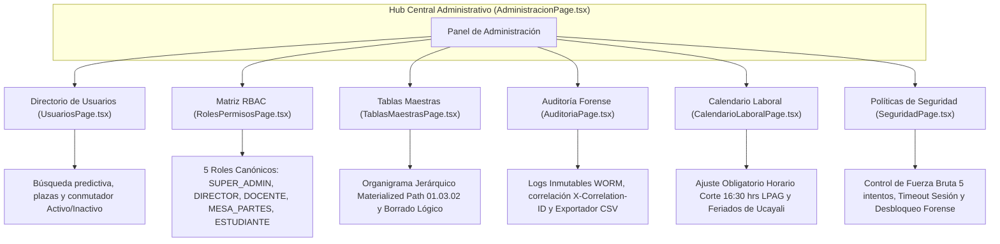

# PLAN DE TRABAJO MODULAR Y EVALUACIÓN DOCENTE: MÓDULO 5
## Administración Institucional, Seguridad RBAC y Auditoría Forense
### Sistema Integral de Gestión Documentaria (SIGD) — IESTP "Suiza" (Pucallpa, Ucayali)

---

### METADATOS DEL MÓDULO Y GOBERNANZA DOCENTE
- **Código de Documento:** `SIGD-DOC-M05-PLAN-EVAL-2026`
- **Versión:** `1.0.0 (Edición Modular Definitiva)`
- **Fecha de Emisión:** `2026-09-05`
- **Ciclo Académico:** `2026-2` | **Programa:** `Desarrollo de Sistemas de Información (DSI)`
- **Unidad Didáctica:** `Taller de Programación Web / Proyecto Integrador SIGD`
- **Docente Titular / Product Owner:** `Ing. Renato Henyer Tarazona Flores`
- **Sub-equipo Asignado (Grupo 4):**
  - **Líder de Grupo:** `Jhonatan Nijar Gonzales de Souza` (Git: `JHONATAN` / `jhonatan` / `F_GONZALES`)
  - **Especialista de Seguridad RBAC:** `Carlos Perea ("Gato")` (Git: `soychivo` / `caps6954` / `F_PEREA`)
  - **Desarrollador Auditoría Forense:** `Leonel Rivera Maxin ("Maxin")` (Git: `maxirivera` / `F_RIVERA`)
  - **Desarrollador Frontend / Seguridad:** `Cristian Macedo` (Git: `cristiamsaul2` / `F_CRISTIAM`)
- **Carga de Trabajo Asignada:** `28 Story Points (SP)` distribuidos en 6 entregables atómicos
- **Ubicación Canónica:** `frontend/docs/administracion-seguridad-auditoria/00_plan_de_trabajo_y_evaluacion_docente.md`
- **Documento Maestro Institucional:** [PLAN_DE_TRABAJO_MODULAR_Y_EVALUACION_DOCENTE.md](../PLAN_DE_TRABAJO_MODULAR_Y_EVALUACION_DOCENTE.md)

---

## 1. ALCANCE TÉCNICO Y ESPECIFICACIÓN FUNCIONAL DEL MÓDULO 5

El Módulo 5 ejerce el gobierno de la seguridad lógica, el control de acceso basado en roles (RBAC), la bitácora inmutable de auditoría forense, el mantenimiento de las tablas maestras institucionales y la parametrización del calendario laboral del IESTP "Suiza".

A diferencia de los demás módulos que requieren construcción desde cero, el Módulo 5 cuenta con una ventaja competitiva excepcional: **7 pantallas React 19 ya implementadas en el repositorio** (`frontend/src/pages/administracion/`), por lo que el plan de trabajo se focaliza en su conexión a microservicios REST `/api/v1/...`, la estabilización de contratos, la subsanación de inconsistencias normativas (corte 16:30 hrs LPAG) y la cobertura de pruebas automatizadas.



### 1.1. Componentes Clave y Articulación de las 7 Pantallas Existentes
1. **`AdministracionPage.tsx` (Hub Central Administrativo):**
   - Cuadrícula responsiva de 6 tarjetas de acceso rápido con métricas consolidadas.
   - Navegación mediante `AdminBreadcrumbs.tsx` y encabezado reutilizable `AdminPageHeader.tsx`.
2. **`UsuariosPage.tsx` (Directorio de Usuarios y Plazas):**
   - Directorio institucional con búsqueda en tiempo real y filtros por unidad orgánica y estado (`ACTIVA`, `INACTIVA`, `BLOQUEADA`).
   - Modal de administración para asignación de rol RBAC, sede y correo institucional.
3. **`RolesPermisosPage.tsx` (Matriz de Control de Acceso Granular RBAC):**
   - Gobernanza estricta sobre los **5 roles canónicos institucionales**:
     - `SUPER_ADMIN`: Administrador de infraestructura y soporte TI.
     - `DIRECTOR`: Máxima autoridad ejecutiva con atribución resolutiva y firma digital.
     - `DOCENTE`: Docente ordinario o contratado con acceso a bandejas académicas y actas.
     - `MESA_PARTES`: Operador de ventanilla presencial y virtual para recepción y radicación.
     - `ESTUDIANTE`: Administrado con acceso a casilla electrónica y trámites TUPA.
   - Matriz de permisos interactiva por módulo y acción (`ver`, `crear`, `editar`, `derivar`, `archivar`, `eliminar`, `exportar`).
4. **`AuditoriaPage.tsx` (Visor Forense de Logs Inmutables WORM):**
   - Inspección de eventos de auditoría de solo lectura vinculados al identificador `X-Correlation-ID`.
   - Visualizador de diferencias JSON (*diff* antes y después de cada mutación).
   - Exportador instantáneo a formato CSV (`auditoria-sigd.csv`) mediante generación de `Blob` en memoria.
5. **`TablasMaestrasPage.tsx` (Mantenimiento de Sedes, Áreas y Tipos Documentales):**
   - Mantenimiento con borrado lógico para preservar la trazabilidad histórica de expedientes antiguos.
   - Visualizador de organigrama jerárquico bajo el modelo **Materialized Path** (`01.03.02`).
6. **`CalendarioLaboralPage.tsx` (Jornada Laboral y Feriados de Ucayali):**
   - **Ajuste Normativo No Negociable:** Corrección del horario de fin de jornada de `17:00` a las **16:30 hrs** (Art. 138 TUO Ley N° 27444).
   - Configuración de feriados regionales: Fiesta de San Juan (24 de junio) y Aniversario de Pucallpa (13 de octubre).
7. **`SeguridadPage.tsx` (Políticas de Ciberseguridad y Desbloqueo de Cuentas):**
   - Reglas de bloqueo temporal (máximo 5 intentos fallidos consecutivos, bloqueo de 30 min).
   - Consola supervisada de desbloqueo manual de cuentas con justificación forense obligatoria.

---

## 2. CONTRATOS DE INTEGRACIÓN API REST (CANÓNICOS)

El Módulo 5 se comunica con los microservicios administrativos a través de las siguientes rutas:

| Método | Endpoint URI | Descripción | Request Payload | Response (200 / 201) | Manejo RFC 7807 |
|:---:|---|---|---|---|---|
| `GET` | `/api/v1/admin/resumen` | Métricas y contadores del panel central | *Ninguno* | `AdminDashboardSummaryDTO` | `401 Unauthorized`, `403 Forbidden` |
| `GET` | `/api/v1/usuarios` | Consulta paginada del directorio institucional | Query `?busqueda=&rolId=&page=` | `UsuarioListItemDTO[]` | `403 Forbidden` |
| `PUT` | `/api/v1/usuarios/:id` | Modificación de plaza, área y rol | `UpdateUsuarioDTO` | `UsuarioDetailDTO` | `404 Not Found`, `422 Unprocessable` |
| `PATCH` | `/api/v1/usuarios/:id/estado` | Conmutación de estado (`ACTIVA`, `INACTIVA`, `BLOQUEADA`) | `{ estado: string }` | `{ id, nuevoEstado }` | `409 Conflict` (no auto-bloqueo) |
| `GET` | `/api/v1/roles` | Catálogo de roles y matriz RBAC | *Ninguno* | `RolDetailDTO[]` | `401 Unauthorized` |
| `PUT` | `/api/v1/roles/:id/permisos` | Actualización de matriz de permisos | `UpdatePermisosDTO` | `RolDetailDTO` | `403 Forbidden` |
| `GET` | `/api/v1/auditoria` | Consulta forense de logs inmutables | Query `?modulo=&usuario=&correlationId=` | `RegistroAuditoriaDTO[]` | `403 Forbidden` |
| `GET` | `/api/v1/tablas-maestras/:tabla` | Listado maestro de áreas, sedes o tipos | Param `tabla` | `EntidadMaestraDTO[]` | `404 Not Found` |
| `GET/PUT` | `/api/v1/calendario/jornada` | Parametrización de jornada y corte 16:30 | `JornadaLaboralDTO` | `JornadaLaboralDTO` | `422 Unprocessable` |

---

## 3. TABLA DE ENTREGABLES ATÓMICOS DE EVALUACIÓN DOCENTE

Matriz de entregables para la calificación del Grupo 4 (28 Story Points):

| Código | Nombre del Entregable | Estudiantes Responsables | Artefactos Concretos en Repositorio | Criterios de Aceptación Objetivos (DoD) | Evidencia Demostrable | Peso % | SP |
|:---:|---|---|---|---|---|:---:|:---:|
| `ENT-M05-01` | **Panel Central de Administración y Navegación Institucional** | Jhonatan Gonzales (R/A) | `src/pages/administracion/AdministracionPage.tsx` (existente)<br>`src/components/administracion/AdminBreadcrumbs.tsx`<br>`src/components/administracion/AdminPageHeader.tsx` (existente)<br>`src/routes/AdminRoutes.tsx` | 1. Panel central con 6 tarjetas de acceso rápido operativas.<br>2. Breadcrumbs reactivos en todas las subvistas.<br>3. Botón de retorno contextual en el encabezado.<br>4. Enrutamiento integrado en `AppRouter.tsx` con guardianes de seguridad. | Vista central operativa; navegación fluida entre las 6 secciones sin errores de consola. | 15% | 3 |
| `ENT-M05-02` | **Gestión del Directorio de Usuarios y Asignación de Plazas** | Cristian Macedo (R)<br>Jhonatan Gonzales (R/A) | `src/pages/administracion/UsuariosPage.tsx` (existente)<br>`src/components/administracion/UserEditModal.tsx`<br>`src/hooks/useUsuariosAdmin.ts`<br>`src/types/usuarioAdmin.ts` | 1. Tabla de usuarios con búsqueda en tiempo real y filtro por estado.<br>2. Modal de administración para editar área, plaza y rol.<br>3. Conmutador reactivo de estado (Activa / Inactiva / Bloqueada).<br>4. Desacoplamiento de lógica en hook `useUsuariosAdmin.ts`. | Pantalla de usuarios completamente integrada; modal de edición funcional. | 20% | 5 |
| `ENT-M05-03` | **Matriz de Control de Acceso Granular RBAC (5 Roles Canónicos)** | Carlos Perea (R/A)<br>Jhonatan Gonzales (C) | `src/pages/administracion/RolesPermisosPage.tsx` (existente)<br>`src/components/administracion/RolePermissionMatrix.tsx`<br>`src/types/rbacRoles.ts`<br>`src/hooks/useRbacConfig.ts` | 1. Alineación estricta a los 5 roles canónicos: `SUPER_ADMIN`, `DIRECTOR`, `DOCENTE`, `MESA_PARTES`, `ESTUDIANTE`.<br>2. Matriz de permisos interactiva por módulo y acción.<br>3. Persistencia de cambios y advertencia de impacto en seguridad.<br>4. Tipado estricto sin comodín `any`. | Pantalla de roles interactiva; matriz de checkboxes mutable y tipada en TypeScript 5.9. | 20% | 5 |
| `ENT-M05-04` | **Visor Forense de Logs Inmutables y Exportación CSV** | Leonel Rivera (R/A)<br>Jhonatan Gonzales (C) | `src/pages/administracion/AuditoriaPage.tsx` (existente)<br>`src/components/administracion/AuditDetailDrawer.tsx`<br>`src/hooks/useAuditLogs.ts`<br>`src/types/auditoriaForense.ts` | 1. Interfaz de solo lectura para la bitácora WORM.<br>2. Filtros por módulo, resultado y trazabilidad por `X-Correlation-ID`.<br>3. Visualizador de diferencias JSON (datos anteriores vs nuevos).<br>4. Exportador a archivo CSV (`auditoria-sigd.csv`) mediante Blob en memoria. | Pantalla de auditoría con descarga directa de archivo CSV funcional y visor de diffs. | 15% | 5 |
| `ENT-M05-05` | **Mantenimiento de Tablas Maestras y Organigrama Materialized Path** | Jhonatan Gonzales (R/A)<br>Cristian Macedo (R) | `src/pages/administracion/TablasMaestrasPage.tsx` (existente)<br>`src/components/administracion/OrganigramaTreeView.tsx`<br>`src/hooks/useTablasMaestras.ts`<br>`src/types/tablasMaestras.ts` | 1. Pestañas para Sedes, Áreas y Tipos Documentales.<br>2. Alta y edición de registros con borrado lógico (inactivación).<br>3. Soporte visual del organigrama jerárquico bajo formato Materialized Path (`01.03.02`). | Mantenimiento operativo con visualización en árbol de la estructura organizacional. | 15% | 5 |
| `ENT-M05-06` | **Calendario Laboral LPAG (Ajuste 16:30 hrs) y Políticas de Seguridad** | Jhonatan Gonzales (R/A)<br>Carlos Perea & Cristian Macedo (R) | `src/pages/administracion/CalendarioLaboralPage.tsx` (existente)<br>`src/pages/administracion/SeguridadPage.tsx` (existente)<br>`src/hooks/useCalendarioLaboral.ts`<br>`src/hooks/useSeguridadPolicies.ts` | 1. Corrección obligatoria del horario de fin de 17:00 a las **16:30 hrs** (Ley N° 27444).<br>2. Parametrización de feriados regionales de Ucayali.<br>3. Políticas de acceso: 5 intentos fallidos máximos y timeout de sesión.<br>4. Desbloqueo supervisado de cuentas bloqueadas con justificación. | Horario 16:30 hrs reflejado en la UI; panel de políticas y desbloqueo de cuenta operativo. | 15% | 5 |
| **TOTAL** | **MÓDULO 4 (GRUPO 4) CONSOLIDADO** | **Grupo 4 Frontend** | **Conjunto de Artefactos de Grupo 4** | **Cumplimiento Integral de Criterios DoD y Ley 27444** | **Demostración en Vivo + Ficha Docente** | **100%** | **28 SP** |

---

## 4. RÚBRICA DE EVALUACIÓN VIGESIMAL DOCENTE (00 A 20 PUNTOS)

### 4.1. Criterios Analíticos por Dimensión
```
[00.0 - 10.9] DEFICIENTE | [11.0 - 13.9] REGULAR | [14.0 - 17.9] BUENO | [18.0 - 20.0] EXCELENTE
```

| Dimensión | Excelente (18.0 - 20.0) | Bueno (14.0 - 17.9) | Regular (11.0 - 13.9) | Deficiente (00.0 - 10.9) |
|---|---|---|---|---|
| **D1: Arquitectura Frontend y 7 Pantallas React 19 (30% / 6.0 pts)** | **5.4 – 6.0 pts:** Las 7 pantallas operan con fluidez absoluta; breadcrumbs dinámicos; modales y drawers desacoplados; hooks personalizados para cada dominio; cero recargas de página. | **4.2 – 5.3 pts:** Las 7 pantallas funcionales; navegación clara; hooks desacoplados en su mayoría; modales operativos. | **3.3 – 4.1 pts:** Navegación inconsistente; componentes con duplicación de código; estado de formularios acoplado directamente en vistas. | **0.0 – 3.2 pts:** Pantallas rotas o desarticuladas; fallas severas de renderizado; el código no compila en producción. |
| **D2: Integración Backend y Matriz RBAC (30% / 6.0 pts)** | **5.4 – 6.0 pts:** Fidelidad a las rutas `/api/v1/admin/...`; persistencia correcta de la matriz RBAC para los 5 roles canónicos; trazabilidad forense vinculada con `X-Correlation-ID`; manejo tipado RFC 7807. | **4.2 – 5.3 pts:** Endpoints canónicos respetados; matriz RBAC funcional; bitácora de auditoría con filtros operativos; errores estándar manejados. | **3.3 – 4.1 pts:** Desajustes en roles RBAC (nombres o permisos no sincronizados); auditoría sin trazabilidad de correlación; errores genéricos. | **0.0 – 3.2 pts:** Endpoints desconectados; manipulación arbitraria de la seguridad; vulnerabilidades evidentes en el control de acceso. |
| **D3: Ajuste Horario 16:30 hrs y Auditoría WORM (20% / 4.0 pts)** | **3.6 – 4.0 pts:** Horario de corte corregido a las 16:30 hrs en el calendario laboral conforme a la Ley 27444; exportador CSV de auditoría impecable; organigrama Materialized Path ordenado. | **2.8 – 3.5 pts:** Horario de corte 16:30 hrs ajustado; exportador CSV operativo; borrado lógico implementado en tablas maestras. | **2.2 – 2.7 pts:** Horario de corte permanece en 17:00 hrs (incumplimiento normativo leve); exportador CSV con caracteres corruptos en UTF-8. | **0.0 – 2.1 pts:** Omisión del ajuste de horario LPAG; auditoría editable (violación de principio WORM); borrado físico destructivo en base de datos. |
| **D4: Calidad TypeScript, Pruebas y Git (20% / 4.0 pts)** | **3.6 – 4.0 pts:** Tipado 100% estricto sin comodines `any`; interfaces de usuarios, roles y auditoría bien estructuradas; pruebas en Vitest $\ge 80\%$; commits limpios de los 4 integrantes. | **2.8 – 3.5 pts:** Tipado TypeScript consistente; pruebas unitarias cubriendo las pantallas principales (50%-79%); historial Git con commits trazables. | **2.2 – 2.7 pts:** Presencia de `any` en modelos de auditoría o roles; pruebas unitarias escasas (<50%); commits desbalanceados. | **0.0 – 2.1 pts:** Código plagado de `any`; ausencia de pruebas unitarias; repositorio sin actividad trazable del equipo M5. |

### 4.2. Penalizaciones Técnicas Específicas de M5
- **`PEN-01` (-3.0 pts):** Desconexión de endpoints administrativos o alteración de rutas canónicas `/api/v1/admin/...`.
- **`PEN-02` (-2.0 pts):** Mantener el horario de cierre a las 17:00 hrs en lugar del corte normativo LPAG a las 16:30 hrs.
- **`PEN-05` (-4.0 pts):** Regresiones de compilación TypeScript (`tsc --noEmit`) en las 7 pantallas del módulo.
- **`PEN-06` (-1.0 pt c/u, máx -3.0 pts):** Uso de `any` en la matriz de roles RBAC o en los DTOs de auditoría forense.

---

## 5. INSTRUMENTO DOCENTE DE EVALUACIÓN INDIVIDUAL (FICHA TÉCNICA)

```markdown
====================================================================================================
               INSTITUTO DE EDUCACIÓN SUPERIOR TECNOLÓGICO PÚBLICO "SUIZA"
           PROGRAMA DE ESTUDIOS: DESARROLLO DE SISTEMAS DE INFORMACIÓN (DSI 2026-2)
          FICHA DOCENTE DE EVALUACIÓN MODULAR: M05 - ADMINISTRACIÓN Y SEGURIDAD RBAC
====================================================================================================

1. DATOS DEL ESTUDIANTE Y ENTREGABLES
   - Estudiante Evaluado: _________________________________________________________________________
   - Rol en Grupo 4:    [ ] Líder / Hub / Maestras (Jhonatan Gonzales)
                         [ ] Especialista RBAC (Carlos Perea)
                         [ ] Auditoría WORM / CSV (Leonel Rivera)
                         [ ] Directorio / Seguridad (Cristian Macedo)
   - Entregable(s) a Calificar: [ ] ENT-M05-01  [ ] ENT-M05-02  [ ] ENT-M05-03  [ ] ENT-M05-04  [ ] ENT-M05-05  [ ] ENT-M05-06
   - Total Story Points Evaluados: _________ SP   |   Fecha de Sustentación: _____ / _____ / 2026

2. EVALUACIÓN POR DIMENSIONES (00 a 20 pts)
   +-------------------------------------------------------------+----------+--------+-------------+
   | Dimensión Evaluada                                          | Peso (%) | Nota   | Ponderado   |
   +-------------------------------------------------------------+----------+--------+-------------+
   | D1: Arquitectura Frontend y Puesta a Punto 7 Pantallas      |   30%    | [    ] | [         ] |
   | D2: Integración REST, Matriz RBAC y Tratamiento RFC 7807    |   30%    | [    ] | [         ] |
   | D3: Ajuste Horario LPAG 16:30 hrs y Auditoría WORM          |   20%    | [    ] | [         ] |
   | D4: Calidad TypeScript 5.9, Pruebas Vitest y Commits Git    |   20%    | [    ] | [         ] |
   +-------------------------------------------------------------+----------+--------+-------------+
   | SUB-TOTAL PONDERADO (0.0 a 20.0):                                      |        | [         ] |
   +------------------------------------------------------------------------+--------+-------------+

3. PENALIZACIONES APLICADAS
   [ ] PEN-01: Desconexión de endpoints canónicos                     (-3.0 pts)
   [ ] PEN-02: Mantener horario 17:00 en vez de corte 16:30 hrs      (-2.0 pts)
   [ ] PEN-05: Regresión de compilación TypeScript                    (-4.0 pts)
   [ ] PEN-06: Uso injustificado de comodín 'any' (__ casos)          (-1.0 pt c/u)
   TOTAL DEDUCCIÓN:                                                                    [-       ]

4. CALIFICACIÓN FINAL Y ACTA
   ┌───────────────────────────────────────────────────────────────────────────────────────────────┐
   │ NOTA FINAL VIGESIMAL (Sub-total - Penalizaciones):                             [         ]     │
   ├───────────────────────────────────────────────────────────────────────────────────────────────┤
   │ ESTADO: [ ] EXCELENTE (18-20)   [ ] BUENO (14-17.9)   [ ] REGULAR (11-13.9)   [ ] DEFICIENTE  │
   │ CONDICIÓN: [ ] APROBADO (>= 13.0)                     [ ] DESAPROBADO (< 13.0)                │
   └───────────────────────────────────────────────────────────────────────────────────────────────┘

5. OBSERVACIONES Y RECOMENDACIONES DOCENTES:
   ________________________________________________________________________________________________

______________________________________               ______________________________________
 Firma del Docente Evaluador (PO)                     Firma del Estudiante Evaluado
 Ing. Renato Henyer Tarazona Flores
```

---

## 6. HOJA DE RUTA Y PLAN DE SPRINTS DEL SUB-EQUIPO M5

- **Sprint 1 (Semanas 1-2):**
  - Auditoría de código de las 7 pantallas existentes en `frontend/src/pages/administracion/`.
  - Corrección inmediata del horario de fin de jornada a las **16:30 hrs** en `CalendarioLaboralPage.tsx`.
  - Modelado de interfaces TypeScript para los 5 roles canónicos y auditoría forense.
- **Sprint 2 (Semanas 3-4):**
  - Implementación de custom hooks desacoplados (`useUsuariosAdmin.ts`, `useRbacConfig.ts`, `useAuditLogs.ts`).
  - Conexión de la matriz de roles interactiva en `RolesPermisosPage.tsx`.
  - Habilitación del exportador CSV mediante Blob en memoria en `AuditoriaPage.tsx`.
- **Sprint 3 (Semanas 5-6):**
  - Integración del organigrama Materialized Path en `TablasMaestrasPage.tsx`.
  - Implementación de la consola de políticas de seguridad y desbloqueo supervisado.
  - Suite de pruebas automatizadas en Vitest (`ENT-M05-06`) y sustentación ante el docente.

---

## 7. NAVEGACIÓN Y ENLACES CRUZADOS
- [01_descripcion_general_administracion.md](01_descripcion_general_administracion.md): Hub de administración y articulación con las 7 pantallas React 19.
- [02_tablas_maestras_y_catalogos.md](02_tablas_maestras_y_catalogos.md): Sedes, áreas con Materialized Path (`01.03.02`) y borrado lógico.
- [03_control_acceso_roles_permisos_rbac.md](03_control_acceso_roles_permisos_rbac.md): Matriz de 5 roles canónicos y guardianes de ruta.
- [04_logs_auditoria_inmutable_trazabilidad.md](04_logs_auditoria_inmutable_trazabilidad.md): Visor forense WORM, correlación por `X-Correlation-ID` y exportación CSV.
- [05_directorio_usuarios_y_seguridad_acceso.md](05_directorio_usuarios_y_seguridad_acceso.md): Políticas de fuerza bruta (5 intentos), sesiones y desbloqueo supervisado.
- [06_calendario_laboral_y_jornada_lpag.md](06_calendario_laboral_y_jornada_lpag.md): Parametrización de jornada laboral, corrección del corte 16:30 hrs y feriados de Ucayali.
- [Volver al Plan Maestro Institucional](../PLAN_DE_TRABAJO_MODULAR_Y_EVALUACION_DOCENTE.md)
