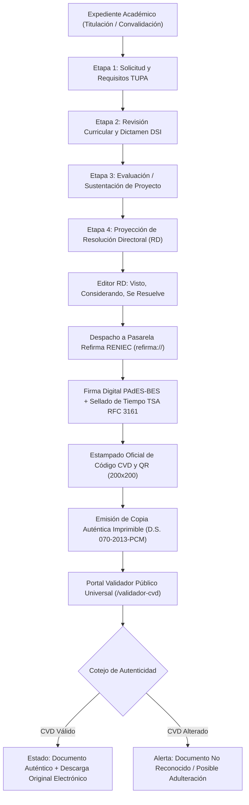

# PLAN DE TRABAJO MODULAR Y EVALUACIÓN DOCENTE: MÓDULO 4
## Flujos de Trabajo Académicos, Firma Digital (Refirma RENIEC) y Validez Legal (CVD / QR)
### Sistema Integral de Gestión Documentaria (SIGD) — IESTP "Suiza" (Pucallpa, Ucayali)

---

### METADATOS DEL MÓDULO Y GOBERNANZA DOCENTE
- **Código de Documento:** `SIGD-DOC-M04-PLAN-EVAL-2026`
- **Versión:** `1.0.0 (Edición Modular Definitiva)`
- **Fecha de Emisión:** `2026-09-05`
- **Ciclo Académico:** `2026-2` | **Programa:** `Desarrollo de Sistemas de Información (DSI)`
- **Unidad Didáctica:** `Taller de Programación Web / Proyecto Integrador SIGD`
- **Docente Titular / Product Owner:** `Ing. Renato Henyer Tarazona Flores`
- **Scrum Master & Arquitecto Principal:** `Christiam Saúl`
- **Sub-equipo Asignado (M4):**
  - **Líder de Sub-equipo:** `Geric Aldair Salas Ormeño` (Git: `geric-castillo`)
  - **Desarrolladora Frontend (Proyector RD):** `Lizbeth Jacobo Martel` (Git: `jacobo-rios` / `REDBLACK-OL`)
  - **Diseñadora UI/UX (Visor CVD / Validador):** `Jhasy Paredes` (Git: `jhasy-paredes` / `svrjhass-design`)
- **Carga de Trabajo Asignada:** `29 Story Points (SP)` distribuidos en 5 entregables atómicos
- **Ubicación Canónica:** `frontend/docs/flujo-validez-legal/00_plan_de_trabajo_y_evaluacion_docente.md`
- **Documento Maestro Institucional:** [PLAN_DE_TRABAJO_MODULAR_Y_EVALUACION_DOCENTE.md](../PLAN_DE_TRABAJO_MODULAR_Y_EVALUACION_DOCENTE.md)

---

## 1. ALCANCE TÉCNICO Y ESPECIFICACIÓN FUNCIONAL DEL MÓDULO 4

El Módulo 4 provee la infraestructura funcional y criptográfica para la tramitación de expedientes académicos de alto impacto (Titulación Profesional Técnica, Convalidaciones y Certificaciones Oficiales según la R.VM. N° 178-2018-MINEDU), articulando con la Infraestructura Oficial de Firma Electrónica (IOFE) de la República del Perú.

El frontend en **React 19 + TypeScript 5.9** resuelve cuatro desafíos de nivel de ingeniería:
1. **Orquestador de Workflows Académicos de 5 Etapas:** Modelado de estados concurrentes y control de transiciones bajo una Máquina de Estados Finitos (FSM) de 10 estados.
2. **Proyector de Resoluciones Directorales:** Editor enriquecido para estructurar actos administrativos formales con hoja membretada institucional A4.
3. **Pasarela de Firma Digital con Refirma RENIEC:** Despacho hacia el agente de firma local mediante protocolo URI `refirma://`, con estándar **PAdES-BES** y sellado de tiempo criptográfico **TSA (RFC 3161)**.
4. **Validador Público de Autenticidad (CVD / QR):** Portal de acceso universal irrestricto (sin autenticación requerida) para cotejar la autenticidad e integridad del documento original conforme a las leyes peruanas.



### 1.1. Componentes Clave de Arquitectura Frontend
1. **Stepper de Workflows Académicos (`src/components/flujos/AcademicWorkflowStepper.tsx`):**
   - Procedimiento oficial de Titulación Profesional Técnica (`PROC-ACA-01`):
     - *Etapa 1 (Admisión):* Validación de egreso regular y acreditación de EFSRT.
     - *Etapa 2 (Dictamen Curricular):* Conformidad técnica de la Coordinación de DSI.
     - *Etapa 3 (Sustentación):* Registro del jurado evaluador y acta de examen profesional.
     - *Etapa 4 (Proyecto de RD):* Redacción del acto resolutivo institucional.
     - *Etapa 5 (Firma y Diploma):* Despacho directoral y asiento en libro oficial.
   - Indicadores visuales de etapa: *Completada, En Curso, Bloqueada, Observada*.
2. **Editor y Proyector de Resoluciones (`src/pages/flujos/ProyectorResolucionesPage.tsx`):**
   - Editor de plantillas institucionales con bloques canónicos: `VISTO`, `CONSIDERANDO` y `SE RESUELVE`.
   - Asignación de numeración controlada (`RD-YYYY-XXXX-IESTP-SUIZA`).
   - Previsualización exacta WYSIWYG en hoja A4 con membrete oficial, márgenes regulados y pie de página.
3. **Pasarela de Conexión Refirma RENIEC (`src/components/firma/RefirmaConnectorModal.tsx`):**
   - Disparo del esquema URI registrado en el sistema operativo: `refirma://sign?token=...&callback=...`.
   - Diálogo modal con indicador de espera reactivo, detección de agente desconectado y soporte de reintento.
   - Soporte de firma en lote (*Batch Signing Drawer*) para secretaría académica (emisión masiva de actas de notas).
4. **Visor de Representación Impresa con CVD y QR (`src/components/firma/DocumentoCvdViewer.tsx`):**
   - Generación de la estampa lateral izquierda o inferior reglamentaria:
     - Código de Verificación Digital estructurado: `CVD-2026-TIT-XXXXXX-HEX8`.
     - Código QR (200x200px) que redirecciona a la URL de validación pública.
     - Texto normativo oficial: *"Esta es una copia auténtica imprimible de un documento electrónico archivado en el IESTP 'Suiza', aplicando lo dispuesto por el Art. 25 de D.S. 070-2013-PCM y la Tercera Disposición Complementaria Final del D.S. 026-2016-PCM"*.
5. **Portal Validador Público Universal (`src/pages/validador/ValidadorPublicoCvdPage.tsx`):**
   - Página abierta accesible de forma anónima (sin login ni token JWT).
   - Búsqueda por ingreso manual de CVD o subida de PDF para extracción automática del código.
   - Despliegue del dictamen forense: Nombre del firmante, entidad certificadora (IOFE/RENIEC), fecha cierta legal (TSA), título del acto y descarga del documento original.

---

## 2. CONTRATOS DE INTEGRACIÓN API REST (CANÓNICOS)

El Módulo 4 gobierna los flujos de firma y validación mediante las siguientes rutas:

| Método | Endpoint URI | Descripción | Request Payload | Response (200 / 201) | Manejo RFC 7807 |
|:---:|---|---|---|---|---|
| `GET` | `/api/v1/tramites/inbox` | Bandeja de trámites académicos por etapa | Query `?etapaId=&estado=` | `TramiteAcademicoDTO[]` | `401 Unauthorized` |
| `POST` | `/api/v1/documentos/generar` | Generación de borrador de acto resolutivo | `GenerarActoDTO` | `BorradorActoDTO` | `400 Bad Request`, `422 Unprocessable` |
| `POST` | `/api/v1/documentos/:id/firmar/preparar` | Generación de token y parámetros para Refirma | `{ firmanteDni: string }` | `RefirmaParamDTO` | `403 Forbidden`, `404 Not Found` |
| `POST` | `/api/v1/documentos/:id/firmar/completar` | Recepción de archivo PAdES firmado y CVD | `FirmadoPadesDTO` | `{ cvd, urlFirmado, timestamp }` | `409 Conflict`, `422 Invalid Signature` |
| `GET` | `/api/v1/validador/cvd/:codigoCvd` | **Público (Sin JWT):** Consulta de autenticidad | Param `codigoCvd` | `ValidacionCvdDTO` | `404 Not Found` (CVD inexistente) |

---

## 3. TABLA DE ENTREGABLES ATÓMICOS DE EVALUACIÓN DOCENTE

Matriz de entregables para la calificación del sub-equipo del Módulo 4 (29 Story Points):

| Código | Nombre del Entregable | Estudiantes Responsables | Artefactos Concretos en Repositorio | Criterios de Aceptación Objetivos (DoD) | Evidencia Demostrable | Peso % | SP |
|:---:|---|---|---|---|---|:---:|:---:|
| `ENT-M04-01` | **Visualizador de Workflows Académicos de 5 Etapas** | Geric Salas (R/A) | `src/pages/flujos/WorkflowAcademicoPage.tsx`<br>`src/components/flujos/AcademicWorkflowStepper.tsx`<br>`src/components/flujos/StageDetailCard.tsx`<br>`src/hooks/useWorkflowAcademico.ts`<br>`src/types/workflowAcademico.ts` | 1. Modelado visual de 5 etapas para Titulación Profesional Técnica (`PROC-ACA-01`).<br>2. Transiciones de estado bloqueantes gobernadas por FSM.<br>3. Despliegue de requisitos cumplidos y pendientes por etapa.<br>4. Diseño responsivo con navegación accesible por teclado. | Stepper completamente interactivo; visualización de avances y dictámenes por etapa. | 25% | 8 |
| `ENT-M04-02` | **Proyector y Gestor de Resoluciones Directorales y Actas** | Lizbeth Jacobo (R/A) | `src/pages/flujos/ProyectorResolucionesPage.tsx`<br>`src/components/flujos/PlantillaResolucionEditor.tsx`<br>`src/types/resolucionAcademica.ts` | 1. Editor con campos obligatorios: Visto, Considerando, Se Resuelve y Asignación RD.<br>2. Numeración correlativa automática anual institucional.<br>3. Previsualización WYSIWYG en hoja A4 con membrete institucional.<br>4. Exportación preliminar y guardado seguro de borradores. | Pantalla de edición operativa con vista previa fiel al formato oficial del IESTP "Suiza". | 20% | 5 |
| `ENT-M04-03` | **Pasarela Frontend de Despacho de Firma Digital (Refirma)** | Geric Salas (R/A)<br>Jhasy Paredes (R) | `src/components/firma/RefirmaConnectorModal.tsx`<br>`src/components/firma/FirmaBatchDrawer.tsx`<br>`src/hooks/useRefirmaGateway.ts`<br>`src/types/firmaDigital.ts` | 1. Disparo de esquema URI `refirma://` con token seguro y callback.<br>2. Modal interactivo con estado de espera, timeout y reintentos.<br>3. Soporte de estándar PAdES-BES con sellado de tiempo TSA RFC 3161.<br>4. Cajón (*drawer*) de firma masiva en lote para secretaría académica. | Demostración de llamada a protocolo Refirma; modal con feedback en tiempo real. | 25% | 8 |
| `ENT-M04-04` | **Visor de Representación Impresa con Código CVD y QR** | Jhasy Paredes (R/A) | `src/components/firma/DocumentoCvdViewer.tsx`<br>`src/components/firma/CvdStampBadge.tsx`<br>`src/types/cvdVerificacion.ts` | 1. Integración de visor PDF con inserción de estampa oficial en margen.<br>2. Código de Verificación Digital (CVD) generado con algoritmo formal.<br>3. Código QR de 200x200px legible que apunta al portal validador.<br>4. Leyenda legal oficial según D.S. 070-2013-PCM estampada. | Documento PDF en pantalla mostrando estampa lateral con CVD y QR escaneable. | 15% | 5 |
| `ENT-M04-05` | **Portal Validador Público de Validez Legal y No Repudio** | Geric Salas (R/A)<br>Jhasy Paredes (R) | `src/pages/validador/ValidadorPublicoCvdPage.tsx`<br>`src/components/validador/CvdVerificationResult.tsx`<br>`src/hooks/useCvdPublicVerification.ts` | 1. Página pública de acceso universal sin token JWT ni autenticación.<br>2. Formulario de ingreso de código CVD o carga de PDF para análisis.<br>3. Dictamen visual claro: Firmantes válidos, fecha/hora legal y validez jurídica.<br>4. Botón de descarga del documento electrónico original inalterado. | Portal público funcional demostrando validación exitosa de un CVD institucional de prueba. | 15% | 3 |
| **TOTAL** | **MÓDULO 4 CONSOLIDADO** | **Sub-equipo M4** | **Conjunto de Artefactos de M4** | **Cumplimiento Integral de Criterios DoD y Ley 27269** | **Demostración en Vivo + Ficha Docente** | **100%** | **29 SP** |

---

## 4. RÚBRICA DE EVALUACIÓN VIGESIMAL DOCENTE (00 A 20 PUNTOS)

### 4.1. Criterios Analíticos por Dimensión
```
[00.0 - 10.9] DEFICIENTE | [11.0 - 13.9] REGULAR | [14.0 - 17.9] BUENO | [18.0 - 20.0] EXCELENTE
```

| Dimensión | Excelente (18.0 - 20.0) | Bueno (14.0 - 17.9) | Regular (11.0 - 13.9) | Deficiente (00.0 - 10.9) |
|---|---|---|---|---|
| **D1: Arquitectura Frontend y Stepper Workflow (30% / 6.0 pts)** | **5.4 – 6.0 pts:** Stepper académico de 5 etapas interactivo y modular; proyector de resoluciones con previsualización A4 WYSIWYG; firma en lote fluida; código desacoplado y reactivo en React 19. | **4.2 – 5.3 pts:** Stepper funcional de 5 etapas; editor de resolución con formato adecuado; flujo de firma individual operativo. | **3.3 – 4.1 pts:** Stepper rígido con transiciones poco claras; editor de resolución con desajustes en el formato A4; componentes extensos. | **0.0 – 3.2 pts:** Stepper inoperativo; el código no compila; fallas estructurales graves en la gestión de etapas. |
| **D2: Integración Backend y Despacho Refirma (30% / 6.0 pts)** | **5.4 – 6.0 pts:** Invocación limpia al protocolo `refirma://`; recepción segura de PAdES-BES con sellado TSA RFC 3161; consulta de validador público `/validador/cvd/...` sin token JWT; captura tipada RFC 7807. | **4.2 – 5.3 pts:** Integración con Refirma mediante protocolo funcional; validación pública de CVD operativa; endpoints canónicos respetados. | **3.3 – 4.1 pts:** Comunicación con Refirma inestable; validador público exige autenticación indebida; errores genéricos en consola. | **0.0 – 3.2 pts:** Firma simulada sin protocolo ni estándar; portal validador inexistente o roto; endpoints desconectados. |
| **D3: Validez Legal, Estampa CVD y Normativa (20% / 4.0 pts)** | **3.6 – 4.0 pts:** Estampa CVD completa y legible con QR de 200x200px; leyenda oficial D.S. 070-2013-PCM; cumplimiento pleno de la Ley N° 27269 de Firmas Digitales; no repudio garantizado. | **2.8 – 3.5 pts:** Estampa CVD visible con código y QR funcional; leyenda legal presente; formato de documento respetado. | **2.2 – 2.7 pts:** Estampa CVD mal ubicada o QR de baja resolución no legible por móviles; omisión parcial de leyenda normativa. | **0.0 – 2.1 pts:** Ausencia total de CVD y QR; omisión deliberada de los preceptos de la Ley N° 27269 de firmas digitales. |
| **D4: Calidad TypeScript, Pruebas y Git (20% / 4.0 pts)** | **3.6 – 4.0 pts:** Tipado 100% estricto sin comodines `any`; tipos de certificados X.509 y workflows bien estructurados; pruebas Vitest $\ge 80\%$; commits atómicos de los 3 integrantes. | **2.8 – 3.5 pts:** Tipado TypeScript consistente; pruebas unitarias del validador CVD y stepper (50%-79%); historial Git ordenado. | **2.2 – 2.7 pts:** Presencia de `any` en modelos de firma; pruebas escasas (<50%); commits infrecuentes. | **0.0 – 2.1 pts:** Código plagado de `any`; ausencia de pruebas unitarias; repositorio sin actividad trazable del equipo. |

### 4.2. Penalizaciones Técnicas Específicas de M4
- **`PEN-01` (-3.0 pts):** Desconexión de endpoints de despacho de firma o validación pública de CVD.
- **`PEN-05` (-4.0 pts):** Regresiones de compilación TypeScript (`tsc --noEmit`) o fallas fatales en pantalla.
- **`PEN-06` (-1.0 pt c/u, máx -3.0 pts):** Uso del tipo `any` en contratos de firma digital o DTOs del validador CVD.
- **`PEN-07` (-1.5 pts):** Problemas de contraste WCAG 2.1 AA en el portal validador público.

---

## 5. INSTRUMENTO DOCENTE DE EVALUACIÓN INDIVIDUAL (FICHA TÉCNICA)

```markdown
====================================================================================================
               INSTITUTO DE EDUCACIÓN SUPERIOR TECNOLÓGICO PÚBLICO "SUIZA"
           PROGRAMA DE ESTUDIOS: DESARROLLO DE SISTEMAS DE INFORMACIÓN (DSI 2026-2)
          FICHA DOCENTE DE EVALUACIÓN MODULAR: M04 - FLUJOS ACADÉMICOS Y VALIDEZ LEGAL
====================================================================================================

1. DATOS DEL ESTUDIANTE Y ENTREGABLES
   - Estudiante Evaluado: _________________________________________________________________________
   - Rol en Sub-equipo: [ ] Líder / Workflow / Refirma (Geric Salas)
                        [ ] Proyector RD (Lizbeth Jacobo)   [ ] UI/UX / CVD / Validador (Jhasy Paredes)
   - Entregable(s) a Calificar: [ ] ENT-M04-01  [ ] ENT-M04-02  [ ] ENT-M04-03  [ ] ENT-M04-04  [ ] ENT-M04-05
   - Total Story Points Evaluados: _________ SP   |   Fecha de Sustentación: _____ / _____ / 2026

2. EVALUACIÓN POR DIMENSIONES (00 a 20 pts)
   +-------------------------------------------------------------+----------+--------+-------------+
   | Dimensión Evaluada                                          | Peso (%) | Nota   | Ponderado   |
   +-------------------------------------------------------------+----------+--------+-------------+
   | D1: Arquitectura Frontend, Stepper Workflow y Editor RD     |   30%    | [    ] | [         ] |
   | D2: Integración REST, Despacho Refirma y Manejo RFC 7807     |   30%    | [    ] | [         ] |
   | D3: Validez Legal, Estampa CVD, Código QR y Ley N° 27269    |   20%    | [    ] | [         ] |
   | D4: Calidad TypeScript 5.9, Pruebas Vitest y Commits Git    |   20%    | [    ] | [         ] |
   +-------------------------------------------------------------+----------+--------+-------------+
   | SUB-TOTAL PONDERADO (0.0 a 20.0):                                      |        | [         ] |
   +------------------------------------------------------------------------+--------+-------------+

3. PENALIZACIONES APLICADAS
   [ ] PEN-01: Desconexión de endpoints canónicos                     (-3.0 pts)
   [ ] PEN-05: Regresión de compilación TypeScript                    (-4.0 pts)
   [ ] PEN-06: Uso injustificado de comodín 'any' (__ casos)          (-1.0 pt c/u)
   [ ] PEN-07: Deficiencias de contraste en portal validador          (-1.5 pts)
   TOTAL DEDUCCIÓN:                                                                    [-       ]

4. CALIFICACIÓN FINAL Y ACTA
   ┌───────────────────────────────────────────────────────────────────────────────────────────────┐
   │ NOTA FINAL VIGESIMAL (Sub-total - Penalizaciones):                             [         ]     │
   ├───────────────────────────────────────────────────────────────────────────────────────────────┤
   │ ESTADO: [ ] EXCELENTE (18-20)   [ ] BUENO (14-17.9)   [ ] REGULAR (11-13.9)   [ ] DEFICIENTE  │
   │ CONDICIÓN: [ ] APROBADO (>= 13.0)                     [ ] DESAPROBADO (< 13.0)                │
   └───────────────────────────────────────────────────────────────────────────────────────────────┘

5. OBSERVACIONES Y RECOMENDACIONES DOCENTES:
   ________________________________________________________________________________________________

______________________________________               ______________________________________
 Firma del Docente Evaluador (PO)                     Firma del Estudiante Evaluado
 Ing. Renato Henyer Tarazona Flores
```

---

## 6. HOJA DE RUTA Y PLAN DE SPRINTS DEL SUB-EQUIPO M4

- **Sprint 1 (Semanas 1-2):**
  - Definición de tipos TypeScript para certificados X.509, actos resolutivos y códigos CVD.
  - Implementación del hook `useRefirmaGateway.ts` con protocolo `refirma://`.
  - Construcción del portal público `ValidadorPublicoCvdPage.tsx` y pruebas de acceso sin autenticación.
- **Sprint 2 (Semanas 3-4):**
  - Desarrollo del Stepper de 5 etapas para Titulación Profesional Técnica (`AcademicWorkflowStepper.tsx`).
  - Maquetación del editor WYSIWYG de Resoluciones Directorales en formato A4 institucional.
  - Integración del modal de conexión con Refirma RENIEC y soporte de sellado TSA RFC 3161.
- **Sprint 3 (Semanas 5-6):**
  - Implementación del visor de representación impresa con inserción de estampa lateral CVD y QR.
  - Soporte de firma masiva en lote (*FirmaBatchDrawer.tsx*) para secretaría académica.
  - Suite de pruebas unitarias en Vitest (`ENT-M04-05`) y sustentación ante el docente.

---

## 7. NAVEGACIÓN Y ENLACES CRUZADOS
- [01_descripcion_general_validez_legal.md](01_descripcion_general_validez_legal.md): Alcance general de trámites académicos y marco legal LFE/RENIEC.
- [02_flujos_trabajo_workflow_academico.md](02_flujos_trabajo_workflow_academico.md): FSM de 10 estados y etapas de titulación (`PROC-ACA-01`).
- [03_documentos_oficiales_firma_digital.md](03_documentos_oficiales_firma_digital.md): Proyector de Resoluciones Directorales y pasarela Refirma.
- [04_validez_legal_y_validador_cvd.md](04_validez_legal_y_validador_cvd.md): Estampa oficial CVD, código QR y portal validador público.
- [05_arquitectura_tecnica_y_contratos_api.md](05_arquitectura_tecnica_y_contratos_api.md): Endpoints `/api/v1/documentos/...` e integración PKI.
- [06_componentes_interfaz_ui.md](06_componentes_interfaz_ui.md): Componentes visuales del visor PDF y modales de firma.
- [diagrama_flujo_validez_legal.dbml](diagrama_flujo_validez_legal.dbml): Esquema de base de datos relacional en DBML.
- [Volver al Plan Maestro Institucional](../PLAN_DE_TRABAJO_MODULAR_Y_EVALUACION_DOCENTE.md)
