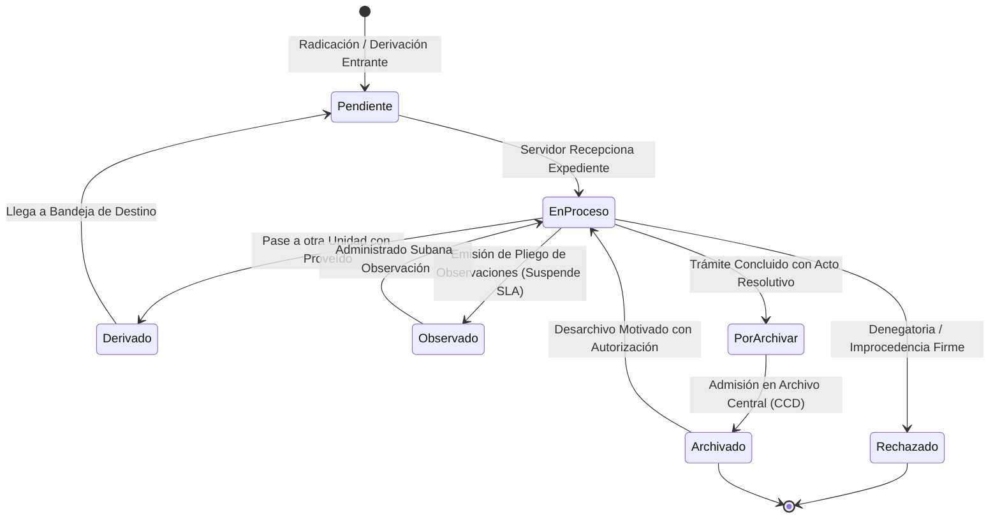

# PLAN DE TRABAJO MODULAR Y EVALUACIÓN DOCENTE: MÓDULO 3
## Bandejas del Funcionario, Trabajo Diario y Gestión de Expedientes
### Sistema Integral de Gestión Documentaria (SIGD) — IESTP "Suiza" (Pucallpa, Ucayali)

---

### METADATOS DEL MÓDULO Y GOBERNANZA DOCENTE
- **Código de Documento:** `SIGD-DOC-M03-PLAN-EVAL-2026`
- **Versión:** `1.0.0 (Edición Modular Definitiva)`
- **Fecha de Emisión:** `2026-09-05`
- **Ciclo Académico:** `2026-2` | **Programa:** `Desarrollo de Sistemas de Información (DSI)`
- **Unidad Didáctica:** `Taller de Programación Web / Proyecto Integrador SIGD`
- **Docente Titular / Product Owner:** `Ing. Renato Henyer Tarazona Flores`
- **Sub-equipo Asignado (Grupo 3):**
  - **Líder de Grupo:** `Isack Vargas` (Git: `isack-vargas` / `isakvargas` / `F_VARGAS`)
  - **Desarrollador Frontend (SLA y LPAG):** `Willfredo Soria` (Git: `willfredo-soria` / `F_SORIA`)
  - **Desarrollador Frontend (CCD y Foliado AGN):** `Piero Bartra Montalvo` (Git: `ppierobartra` / `F_BARTRA`)
- **Carga de Trabajo Asignada:** `28 Story Points (SP)` distribuidos en 5 entregables atómicos
- **Ubicación Canónica:** `frontend/docs/gestion-expedientes/00_plan_de_trabajo_y_evaluacion_docente.md`
- **Documento Maestro Institucional:** [PLAN_DE_TRABAJO_MODULAR_Y_EVALUACION_DOCENTE.md](../PLAN_DE_TRABAJO_MODULAR_Y_EVALUACION_DOCENTE.md)

---

## 1. ALCANCE TÉCNICO Y ESPECIFICACIÓN FUNCIONAL DEL MÓDULO 3

El Módulo 3 es el centro neurálgico del trabajo operativo cotidiano de los servidores públicos, jefes de unidad, coordinadores académicos y directores del IESTP "Suiza". Este módulo gobierna la custodia, derivación, control de plazos perentorios y archivo técnico de los expedientes administrativos.

Su desarrollo frontend en **React 19 + TypeScript 5.9** se fundamenta en cuatro pilares normativos y arquitecturales:
1. **Bandeja Operativa Unificada de 6 Pestañas:** Segmentación clara del ciclo de vida de los trámites con badges de conteo reactivos.
2. **Semáforo SLA Visual (TUO Ley N° 27444):** Cómputo de plazos máximos legales en días hábiles (regla general de 30 días hábiles).
3. **Timeline Inmutable de Hoja de Ruta (WORM):** Trazabilidad completa e inalterable de cada movimiento y proveído.
4. **Foliado Continuo Progresivo (Directiva N° 001-2019-AGN):** Numeración correlativa estricta sin tachaduras, letras ni adiciones.



### 1.1. Componentes Clave de Arquitectura Frontend
1. **Bandeja de Trabajo de 6 Pestañas (`src/pages/expedientes/BandejaExpedientesPage.tsx`):**
   - **Pendientes:** Expedientes derivados al área que aguardan aceptación formal.
   - **En Proceso:** Trámites admitidos en evaluación técnica por el funcionario asignado.
   - **Derivados:** Expedientes enviados en consulta a otras dependencias con seguimiento activo.
   - **Por Archivar:** Trámites con resolución firme listos para transferencia documental.
   - **Archivados:** Expedientes clasificados en custodia final en Archivo Central.
   - **Rechazados / Observados:** Trámites con observaciones normativas o declarados improcedentes.
   - Actualización en tiempo real mediante TanStack Query v5 con polling configurable o revalidación en foco.
2. **Semáforo SLA y Plazos LPAG (`src/components/expedientes/SlaBadge.tsx`):**
   - Cálculo en tiempo real de días hábiles transcurridos desde la fecha cierta de radicación.
   - Umbrales de alerta basados en el Art. 38 del TUO de la Ley N° 27444 (30 días hábiles):
     - **Verde ($\le 15$ días consumidos):** Trámite dentro del plazo ordinario holgado.
     - **Ámbar ($16 - 25$ días consumidos):** Advertencia de proximidad al vencimiento legal.
     - **Rojo ($26 - 30$ días consumidos):** Plazo crítico perentorio (atención prioritaria).
     - **Rojo Parpadeante ($> 30$ días consumidos):** Vencido. Alerta visual de responsabilidad funcional por silencio administrativo.
3. **Timeline Inmutable de Trazabilidad (`src/components/expedientes/ExpedienteTimeline.tsx`):**
   - Visualizador vertical inmutable (*Write Once, Read Many*) de toda la vida procesal del expediente.
   - Despliega: Fecha/hora exacta, unidad remitente, servidor emisor, unidad receptora, tipo de acción, proveído legal y enlace al documento generado con su hash SHA-256.
4. **Cuadro de Clasificación Documental (CCD) y Foliado AGN (`src/components/expedientes/CcdTreeSelector.tsx`):**
   - Árbol taxonómico de archivo: Fondo (`IESTP_SUIZA`) $\rightarrow$ Sección Orgánica (ej. `01 Dirección`, `02 Secretaría Académica`) $\rightarrow$ Serie Documental.
   - Visor de documentos con foliación correlativa progresiva (F. 1 a N) conforme a la Directiva N° 001-2019-AGN/DDPA, impidiendo alteraciones de folios.
5. **Acciones Procesales Formales (`src/components/expedientes/DerivacionModal.tsx`):**
   - Derivación individual o múltiple con proveído motivado obligatorio.
   - Observación formal que congela el cómputo de días hábiles del SLA hasta su subsanación.
   - Acumulación de expedientes conexos (Art. 160 Ley N° 27444) unificando hojas de ruta bajo el CUT matriz.

---

## 2. CONTRATOS DE INTEGRACIÓN API REST (CANÓNICOS)

El Módulo 3 sincroniza el estado de las bandejas con los endpoints oficiales del backend:

| Método | Endpoint URI | Descripción | Request Payload | Response (200 / 201) | Manejo RFC 7807 |
|:---:|---|---|---|---|---|
| `GET` | `/api/v1/expedientes` | Lista paginada de expedientes según pestaña | Query `?estado=&areaId=&page=` | `ExpedienteResumenDTO[]` | `401 Unauthorized`, `403 Forbidden` |
| `GET` | `/api/v1/expedientes/:id` | Detalle completo de expediente y hoja de ruta | Param `id` | `ExpedienteDetalleDTO` | `404 Not Found` |
| `POST` | `/api/v1/expedientes/:id/movimientos/recepcionar` | Aceptación formal de expediente derivado | `{ observacion?: string }` | `{ estado: 'EN_PROCESO' }` | `409 Conflict` (no está pendiente) |
| `POST` | `/api/v1/expedientes/:id/movimientos/derivar` | Derivación formal a otra unidad orgánica | `DerivarExpedienteDTO` | `{ derivacionId, nuevoEstado }` | `422 Unprocessable` (falta proveído) |
| `POST` | `/api/v1/expedientes/:id/movimientos/observar` | Emisión de pliego y suspensión de SLA | `ObservarExpedienteDTO` | `{ estado: 'OBSERVADO', slaPaused: true }` | `400 Bad Request` |
| `POST` | `/api/v1/expedientes/:id/movimientos/archivar` | Pase a custodia definitiva en Archivo | `{ serieCcdId, observacion }` | `{ estado: 'ARCHIVADO' }` | `403 Forbidden` (no autorizado) |
| `POST` | `/api/v1/expedientes/:id/movimientos/desarchivar` | Reapertura motivada autorizada | `{ motivo, autorizadorDni }` | `{ estado: 'EN_PROCESO' }` | `403 Forbidden` |

---

## 3. TABLA DE ENTREGABLES ATÓMICOS DE EVALUACIÓN DOCENTE

Matriz de entregables para la calificación del Grupo 3 (28 Story Points):

| Código | Nombre del Entregable | Estudiantes Responsables | Artefactos Concretos en Repositorio | Criterios de Aceptación Objetivos (DoD) | Evidencia Demostrable | Peso % | SP |
|:---:|---|---|---|---|---|:---:|:---:|
| `ENT-M03-01` | **Bandeja Operativa del Servidor con 6 Pestañas** | Isack Vargas (R/A)<br>Willfredo Soria (R) | `src/pages/expedientes/BandejaExpedientesPage.tsx`<br>`src/components/expedientes/BandejaTabFilter.tsx`<br>`src/components/expedientes/ExpedienteTable.tsx`<br>`src/hooks/useBandejaExpedientes.ts`<br>`src/types/expediente.ts` | 1. 6 pestañas estándar: Pendientes, En Proceso, Derivados, Por Archivar, Archivados, Rechazados.<br>2. Contadores numéricos reactivos en cada pestaña.<br>3. Búsqueda por CUT, administrado o asunto en tiempo real con debounce de 300ms.<br>4. Paginación y ordenamiento por fecha y prioridad. | Tabla reactiva con conmutación instantánea entre pestañas y badges actualizados sin recarga. | 25% | 8 |
| `ENT-M03-02` | **Semáforo SLA Visual de Plazos Máximos LPAG** | Willfredo Soria (R/A)<br>Isack Vargas (C) | `src/components/expedientes/SlaBadge.tsx`<br>`src/components/expedientes/SlaIndicatorTooltip.tsx`<br>`src/utils/slaCalculator.ts` | 1. Cálculo de días hábiles consumidos basado en la regla de 30 días hábiles de la Ley 27444.<br>2. 4 estados cromáticos: Verde, Ámbar, Rojo y Alerta parpadeante (>30d).<br>3. Exclusión precisa de fines de semana y feriados del calendario laboral.<br>4. Contraste mínimo WCAG 2.1 AA ($\ge 4.5:1$) con tooltip explicativo. | Insignias visuales en tabla con tooltip: "Quedan N días hábiles para vencimiento legal". | 20% | 5 |
| `ENT-M03-03` | **Timeline Inmutable de Hoja de Ruta y Trazabilidad** | Isack Vargas (R/A)<br>Piero Bartra Montalvo (R) | `src/components/expedientes/ExpedienteTimeline.tsx`<br>`src/components/expedientes/TimelineItemCard.tsx`<br>`src/types/trazabilidadExpediente.ts` | 1. Representación cronológica vertical de cada movimiento del expediente.<br>2. Despliegue de: fecha/hora, área emisora/receptora, servidor, proveído y hash de integridad.<br>3. Modo estricto de solo lectura que salvaguarda la cadena de custodia. | Hoja de ruta renderizada en la vista de detalle con trazabilidad completa de pases. | 20% | 5 |
| `ENT-M03-04` | **Cuadro de Clasificación Documental (CCD) y Foliado AGN** | Piero Bartra Montalvo (R/A)<br>Isack Vargas (C) | `src/components/expedientes/CcdTreeSelector.tsx`<br>`src/components/expedientes/FoliadoDocumentoViewer.tsx`<br>`src/types/ccdArchivistica.ts` | 1. Árbol taxonómico interactivo: Fondo $\rightarrow$ Sección $\rightarrow$ Serie Documental.<br>2. Visualización de folios correlativos continuos (F. 1 a N) según Directiva 001-2019-AGN.<br>3. Prohibición de letras, tachaduras o adiciones 'bis'.<br>4. Visualizador de documentos con folio estampado. | Selector jerárquico accesible y vista previa de documento foliado correctamente. | 15% | 5 |
| `ENT-M03-05` | **Modales de Derivación Formal, Pliego de Observaciones y Acumulación** | Isack Vargas (R/A)<br>Willfredo Soria & Piero Bartra Montalvo (R) | `src/components/expedientes/DerivacionModal.tsx`<br>`src/components/expedientes/ObservacionModal.tsx`<br>`src/components/expedientes/AcumulacionModal.tsx`<br>`src/hooks/useExpedienteActions.ts` | 1. Modal de derivación con selector de unidad y proveído obligatorio.<br>2. Modal de observaciones que activa la congelación temporal del SLA.<br>3. Modal de acumulación de expedientes conexos (Art. 160 Ley 27444).<br>4. Feedback visual inmediato con toast notifications. | Modales operativos con validación de formularios y simulación de pase exitoso. | 20% | 5 |
| **TOTAL** | **MÓDULO 3 (GRUPO 3) CONSOLIDADO** | **Grupo 3 Frontend** | **Conjunto de Artefactos de Grupo 3** | **Cumplimiento Integral de Criterios DoD y Ley 27444** | **Demostración en Vivo + Ficha Docente** | **100%** | **28 SP** |

---

## 4. RÚBRICA DE EVALUACIÓN VIGESIMAL DOCENTE (00 A 20 PUNTOS)

### 4.1. Criterios Analíticos por Dimensión
```
[00.0 - 10.9] DEFICIENTE | [11.0 - 13.9] REGULAR | [14.0 - 17.9] BUENO | [18.0 - 20.0] EXCELENTE
```

| Dimensión | Excelente (18.0 - 20.0) | Bueno (14.0 - 17.9) | Regular (11.0 - 13.9) | Deficiente (00.0 - 10.9) |
|---|---|---|---|---|
| **D1: Arquitectura Frontend y Bandeja 6 Pestañas (30% / 6.0 pts)** | **5.4 – 6.0 pts:** Bandeja de 6 pestañas fluida con TanStack Query v5; actualización instantánea de contadores numéricos; tabla optimizada con virtualización o paginación reactiva; modales desacoplados. | **4.2 – 5.3 pts:** Bandeja de 6 pestañas operativa; contadores funcionales; filtros de búsqueda ágiles; modales de pase bien implementados. | **3.3 – 4.1 pts:** Bandeja lenta al cambiar de pestaña; re-renderizados innecesarios; contadores desincronizados tras derivar. | **0.0 – 3.2 pts:** Bandeja inoperativa; el código no compila; pérdida de datos entre estados o bucles en renderizado. |
| **D2: Integración Backend y Gestión de Estado (30% / 6.0 pts)** | **5.4 – 6.0 pts:** Sincronización impecable con `/api/v1/expedientes/...`; invalidación quirúrgica de queries en TanStack Query; captura tipada de errores RFC 7807 (409 conflicto si no está pendiente). | **4.2 – 5.3 pts:** Endpoints canónicos respetados; transiciones de estado reflejadas en servidor; captura de errores estándar. | **3.3 – 4.1 pts:** Endpoints parcialmente desconectados; estado inconsistente que requiere recarga completa de la página (`F5`). | **0.0 – 3.2 pts:** Endpoints arbitrarios; omisión de manejo de errores; interfaz bloqueada tras fallo de red. |
| **D3: Semáforo SLA, Foliado AGN y Trazabilidad (20% / 4.0 pts)** | **3.6 – 4.0 pts:** Semáforo SLA que computa con exactitud días hábiles excluyendo feriados de Ucayali; timeline inmutable WORM impecable; foliado AGN continuo sin fallas (F. 1 a N); acumulación legal. | **2.8 – 3.5 pts:** Semáforo SLA funcional en días hábiles; timeline visible y ordenado; foliación correlativa respetada. | **2.2 – 2.7 pts:** Semáforo calcula días calendario en vez de días hábiles; timeline con saltos temporales; errores menores en foliado. | **0.0 – 2.1 pts:** Semáforo inoperativo o arbitrario; timeline editable (violación de inmutabilidad); foliación con letras o tachaduras. |
| **D4: Calidad TypeScript, Pruebas y Git (20% / 4.0 pts)** | **3.6 – 4.0 pts:** Tipado TypeScript 5.9 100% estricto sin tipo `any`; contratos de expediente y movimientos bien definidos; pruebas en Vitest $\ge 80\%$; commits semánticos atómicos. | **2.8 – 3.5 pts:** Tipado consistente con casting justificado; pruebas unitarias del calculador SLA y modales (50%-79%); commits trazables. | **2.2 – 2.7 pts:** Uso frecuente de comodines `any`; pruebas escasas (<50%); commits masivos desordenados. | **0.0 – 2.1 pts:** Código plagado de `any`; TypeScript permisivo; ausencia total de pruebas unitarias y de integración. |

### 4.2. Penalizaciones Técnicas Específicas de M3
- **`PEN-01` (-3.0 pts):** Desconexión o modificación arbitraria de los endpoints de expedientes y movimientos.
- **`PEN-05` (-4.0 pts):** Regresiones de compilación TypeScript (`tsc --noEmit`) o fallas fatales en tiempo de ejecución.
- **`PEN-06` (-1.0 pt c/u, máx -3.0 pts):** Uso injustificado del tipo `any` en los modelos de expediente o DTOs de derivación.
- **`PEN-07` (-1.5 pts):** Insignias de semáforo SLA con contraste cromático inferior a $4.5:1$ (WCAG 2.1 AA).

---

## 5. INSTRUMENTO DOCENTE DE EVALUACIÓN INDIVIDUAL (FICHA TÉCNICA)

```markdown
====================================================================================================
               INSTITUTO DE EDUCACIÓN SUPERIOR TECNOLÓGICO PÚBLICO "SUIZA"
           PROGRAMA DE ESTUDIOS: DESARROLLO DE SISTEMAS DE INFORMACIÓN (DSI 2026-2)
          FICHA DOCENTE DE EVALUACIÓN MODULAR: M03 - BANDEJAS Y GESTIÓN DE EXPEDIENTES
====================================================================================================

1. DATOS DEL ESTUDIANTE Y ENTREGABLES
   - Estudiante Evaluado: _________________________________________________________________________
   - Rol en Grupo 3:    [ ] Líder (Isack Vargas)   [ ] SLA y LPAG (Willfredo Soria)   [ ] CCD y Foliado AGN (Piero Bartra)
   - Entregable(s) a Calificar: [ ] ENT-M03-01  [ ] ENT-M03-02  [ ] ENT-M03-03  [ ] ENT-M03-04  [ ] ENT-M03-05
   - Total Story Points Evaluados: _________ SP   |   Fecha de Sustentación: _____ / _____ / 2026

2. EVALUACIÓN POR DIMENSIONES (00 a 20 pts)
   +-------------------------------------------------------------+----------+--------+-------------+
   | Dimensión Evaluada                                          | Peso (%) | Nota   | Ponderado   |
   +-------------------------------------------------------------+----------+--------+-------------+
   | D1: Arquitectura Frontend, Bandeja 6 Pestañas y React 19    |   30%    | [    ] | [         ] |
   | D2: Integración REST, Gestión de Estado y RFC 7807          |   30%    | [    ] | [         ] |
   | D3: Semáforo SLA 30 días, Foliado AGN y Timeline WORM       |   20%    | [    ] | [         ] |
   | D4: Calidad de Código TypeScript 5.9, Pruebas y Git         |   20%    | [    ] | [         ] |
   +-------------------------------------------------------------+----------+--------+-------------+
   | SUB-TOTAL PONDERADO (0.0 a 20.0):                                      |        | [         ] |
   +------------------------------------------------------------------------+--------+-------------+

3. PENALIZACIONES APLICADAS
   [ ] PEN-01: Desconexión de endpoints canónicos                     (-3.0 pts)
   [ ] PEN-05: Regresión de compilación TypeScript                    (-4.0 pts)
   [ ] PEN-06: Uso injustificado de comodín 'any' (__ casos)          (-1.0 pt c/u)
   [ ] PEN-07: Deficiencias de contraste en semáforo SLA (< 4.5:1)    (-1.5 pts)
   TOTAL DEDUCCIÓN:                                                                    [-       ]

4. CALIFICACIÓN FINAL Y ACTA
   ┌───────────────────────────────────────────────────────────────────────────────────────────────┐
   │ NOTA FINAL VIGESIMAL (Sub-total - Penalizaciones):                             [         ]     │
   ├───────────────────────────────────────────────────────────────────────────────────────────────┤
   │ ESTADO: [ ] EXCELENTE (18-20)   [ ] BUENO (14-17.9)   [ ] REGULAR (11-13.9)   [ ] DEFICIENTE  │
   │ CONDICIÓN: [ ] APROBADO (>= 13.0)                     [ ] DESAPROBADO (< 13.0)                │
   └───────────────────────────────────────────────────────────────────────────────────────────────┘

5. OBSERVACIONES Y RECOMENDACIONES DOCENTES:
   ________________________________________________________________________________________________

______________________________________               ______________________________________
 Firma del Docente Evaluador (PO)                     Firma del Estudiante Evaluado
 Ing. Renato Henyer Tarazona Flores
```

---

## 6. HOJA DE RUTA Y PLAN DE SPRINTS DEL SUB-EQUIPO M3

- **Sprint 1 (Semanas 1-2):**
  - Implementación del calculador de días hábiles `slaCalculator.ts` con exclusión de feriados.
  - Diseño de la insignia de semáforo SLA (`SlaBadge.tsx`) con directivas de contraste WCAG AA.
  - Modelado de contratos TypeScript de expediente, pases y CCD (`expediente.ts`, `trazabilidadExpediente.ts`).
- **Sprint 2 (Semanas 3-4):**
  - Maquetación de la bandeja operativa de 6 pestañas (`BandejaExpedientesPage.tsx`).
  - Implementación del hook `useBandejaExpedientes.ts` con TanStack Query v5.
  - Construcción del timeline vertical inmutable (`ExpedienteTimeline.tsx`).
- **Sprint 3 (Semanas 5-6):**
  - Desarrollo de modales de derivación, observación formal y acumulación procesal.
  - Integración del árbol taxonómico del Cuadro de Clasificación Documental y visor de foliatura AGN.
  - Suite de pruebas unitarias en Vitest y sustentación final ante el docente.

---

## 7. NAVEGACIÓN Y ENLACES CRUZADOS
- [01_bandeja_trabajo_diario_6_pestanas.md](01_bandeja_trabajo_diario_6_pestanas.md): Interfaz de bandejas y estados del servidor.
- [02_cuadro_clasificacion_documental_ccd_y_archivistica.md](02_cuadro_clasificacion_documental_ccd_y_archivistica.md): Normas archivísticas AGN y estructura del CCD.
- [03_modelo_datos_typescript_y_trazabilidad_inmutable.md](03_modelo_datos_typescript_y_trazabilidad_inmutable.md): Tipos DTO, timeline y semáforo SLA.
- [Volver al Plan Maestro Institucional](../PLAN_DE_TRABAJO_MODULAR_Y_EVALUACION_DOCENTE.md)
