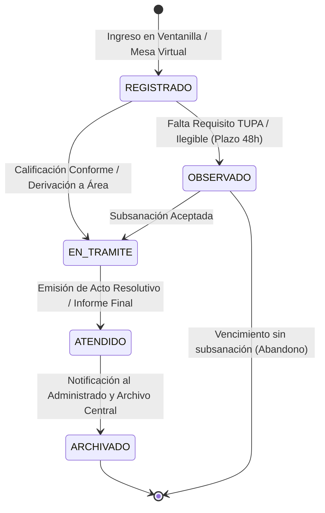

# Especificación Funcional de Ventanilla Presencial y Mesa de Partes Virtual

| Metadato | Detalle Institucional |
| :--- | :--- |
| **Código Documental** | SIGD-DOC-REGDOC-02 |
| **Módulo** | registro-documentario / Especificación Funcional de Ventanilla Presencial y Mesa de Partes Virtual |
| **Versión** | 1.0.0-PROD |
| **Fecha de Aprobación** | 2026-09-05 |
| **Autores Reconocidos** | Anllely Melgarejo, Carito Curto, Patricia Marina (Patty), Noelia Alva, Angy Mendoza |
| **Estado de Homologación** | Aprobado — Alineado a LPAG Ley N° 27444 y React 19 |

---

## 1. Propósito y Alcance Funcional

El presente documento establece las especificaciones funcionales, flujos de atención, reglas de negocio y ciclo de vida de los trámites que ingresan a través del módulo de **Registro Documentario** del Instituto de Educación Superior Tecnológico Público "Suiza" (IESTP "Suiza"). 

El sistema provee una **modalidad dual de atención**:
1. **Mesa de Partes Virtual (Autoservicio Ciudadano):** Portal web de acceso público orientado a postulantes, estudiantes, egresados, proveedores y ciudadanía en general para el ingreso remoto de trámites las 24 horas del día.
2. **Ventanilla Presencial Asistida (Operador Institucional):** Estación de trabajo optimizada para los operadores de la Unidad de Trámite Documentario y Archivo del IESTP Suiza, permitiendo la atención rápida de ciudadanos que entregan documentación física en ventanilla.

---

## 2. Modalidad Dual: Mesa de Partes Virtual vs Ventanilla Presencial

### 2.1. Mesa de Partes Virtual (Ciudadanía / Estudiantes)
- **Acceso:** Libre a través del portal institucional sin exigir credenciales previas para el registro inicial.
- **Catálogo de Procedimientos:**
  - **Trámites TUPA:** Procedimientos estandarizados con requisitos preestablecidos y tasas administrativas (ej. Certificados de Estudios, Constancia de Matrícula, Convalidación, Titulación Profesional).
  - **Trámites No TUPA / Documentación General:** Presentación de solicitudes genéricas, oficios interinstitucionales, cartas, cartas notariales y memoriales.
- **Carga Digital Obligatoria:** Formato estricto PDF/A, máximo 25 MB por archivo.
- **Cargo Virtual Inmediato:** Emisión de comprobante en PDF con Código Único de Trámite (`EXP-YYYY-XXXXXX`), Código de Verificación Digital (CVD) y código QR para trazabilidad pública.

### 2.2. Ventanilla Presencial Asistida (Operador de Mesa de Partes)
- **Acceso:** Autenticado con credenciales institucionales y rol de operador.
- **Búsqueda Integrada con IdentiCore:** 
  - Al ingresar el DNI o RUC del ciudadano que se apersona a ventanilla, el sistema consulta el padrón institucional.
  - Si el administrado ya ha tramitado previamente, sus datos se autocompletan en pantalla.
  - Si es nuevo, el operador registra sus nombres, datos de contacto y domicilio sin forzarle a crear contraseña o cuenta digital.
- **Visor PDF Integrado:**
  - Permite al operador visualizar inmediatamente los archivos escaneados o adjuntados sin necesidad de descargarlos en su disco duro local, garantizando la confidencialidad y rapidez.
- **Calificación en Ventanilla:**
  - **Derivar:** Si la documentación cumple los requisitos formales, se admite, pasa a estado `EN_TRAMITE` y se enruta de inmediato a la unidad académica o administrativa de destino.
  - **Observar:** Si falta algún requisito formal exigido por el TUPA o el documento carece de legibilidad, el operador emite un acta de observación provisional con un plazo legal de 48 horas para su subsanación.

---

## 3. Asistente Wizard de 4 Pasos (Flujo de Registro)

Para garantizar un ingreso de información claro, secuencial y sin errores de digitación, tanto la interfaz virtual como la presencial implementan un **Asistente Paso a Paso (Stepper Wizard)**:

```
┌─────────────────┐     ┌─────────────────┐     ┌─────────────────┐     ┌─────────────────┐
│     Paso 1      │     │     Paso 2      │     │     Paso 3      │     │     Paso 4      │
│  Identificación │ ──> │   Descripción   │ ──> │ Carga y Control │ ──> │  Confirmación   │
│ del Solicitante │     │   del Trámite   │     │   Documental    │     │ y Cargo Oficial │
└─────────────────┘     └─────────────────┘     └─────────────────┘     └─────────────────┘
```

### 3.1. Paso 1 — Identificación del Solicitante
1. **Tipo de Persona:** Selección entre Persona Natural o Persona Jurídica.
2. **Documento de Identidad:**
   - DNI (8 dígitos), Carné de Extranjería (CE) o Pasaporte para Persona Natural.
   - RUC (11 dígitos, con datos del representante legal) para Persona Jurídica.
3. **Datos de Contacto:** Correo electrónico obligatorio (canal de notificación) y número de teléfono celular (9 dígitos para alertas SMS).
4. **Domicilio:** Departamento, provincia y distrito seleccionados en cascada conforme al catálogo SIAGIE Ucayali.

### 3.2. Paso 2 — Descripción del Trámite y Selección de Destino
1. **Tipo de Procedimiento:** Selección desde el catálogo TUPA o trámite libre.
2. **Tipo de Documento Institucional:** Menú desplegable con tipologías formales (Solicitud, Oficio, Carta, Memorándum, Informe, Expediente Externo).
3. **Asunto / Resumen:** Descripción sucinta del petitorio (máximo 250 caracteres).
4. **Número de Folios:** Cantidad física o digital de hojas que componen la solicitud y sus sustentos.
5. **Oficina o Unidad de Destino:** Dirección General, Secretaría Académica, Unidad Académica, Administración, Coordinación de Carrera, etc.
6. **Prioridad:** Normal (plazo estándar LPAG), Urgente o Muy Urgente (con fundamentación justificada).

### 3.3. Paso 3 — Carga y Validación Documental
1. **Zona Dropzone Interactiva:** Carga del documento principal (solicitud o memorial firmado) y anexos complementarios (pagos Banco de la Nación, certificados previos, etc.).
2. **Inspección Automatizada en el Cliente:**
   - Verificación de Magic Bytes `%PDF` (`25 50 44 46`).
   - Restricción estricta de extensiones (rechazo de `.docx`, `.exe`, `.bat`).
   - Control de límite de tamaño (máx. 25 MB por archivo y 50 MB por expediente total).
3. **Cálculo de Huella SHA-256:** Cómputo criptográfico local y barra de transferencia directa a MinIO/S3.

### 3.4. Paso 4 — Confirmación, Declaración de Veracidad y Emisión de Cargo
1. **Pantalla de Resumen:** Visualización completa de los datos ingresados para verificación final.
2. **Declaración Jurada Obligatoria:** Checkbox mandatorio donde el administrado declara bajo juramento la veracidad de la información y la autenticidad de los documentos acompañados (conforme al Art. 51 del TUO de la Ley N° 27444).
3. **Generación Atómica del CUT:** Asignación transaccional del código `EXP-YYYY-XXXXXX` en PostgreSQL 18.
4. **Emisión y Descarga del Cargo Oficial:** Visualización instantánea del comprobante de recepción con sellado institucional.

---

## 4. Formatos de Cargo de Recepción Oficial

El sistema soporta dos formatos complementarios de cargo oficial para garantizar la cobertura de la atención presencial y remota:

### 4.1. Formato Ticket Térmico (Ventanilla Presencial)
- **Dispositivo Destino:** Impresoras térmicas de punto de venta (POS) estándar de 80 mm o 58 mm.
- **Propósito:** Entrega inmediata en mano al ciudadano que acude a la ventanilla del instituto, reduciendo el consumo de papel y tóner.
- **Contenido del Ticket:**
  - Cabecera: `IESTP "SUIZA" — MESA DE PARTES CENTRAL`
  - Código CUT destacado con código de barras lineal (Code 128) y código QR bidimensional.
  - Fecha y hora exacta de recepción (sellado con minutos y segundos).
  - Número de Asiento del Libro de Registro Diario.
  - Datos del administrado: DNI/RUC y nombres completos.
  - Resumen del trámite: Asunto, tipo de documento y total de folios.
  - Unidad de destino responsable.
  - URL de consulta de estado en línea: `https://sigd.iestpsuiza.edu.pe/seguimiento`
  - Firma del operador y sello institucional digital.

### 4.2. Formato PDF A4 Institucional (Mesa Virtual y Archivo Formal)
- **Dispositivo Destino:** Descarga directa en navegador (PDF vectorizado) y envío automático por correo electrónico.
- **Propósito:** Comprobante formal con valor legal probatorio pleno para trámites virtuales y solicitudes complejas.
- **Elementos de Seguridad:**
  - Membrete oficial del Instituto y Ministerio de Educación (MINEDU).
  - Código Único de Trámite en recuadro superior destacado.
  - Código de Verificación Digital (CVD) alfanumérico único para validación pública.
  - Hash criptográfico SHA-256 del documento principal consignado en el cuerpo del cargo.
  - Sello de tiempo oficial (*Timestamping Authority* interna) con certificación de fecha y hora legal de ingreso.

---

## 5. Ciclo de Vida Documental y los 5 Estados Procesales

Todo documento que ingresa al SIGD transita por un ciclo de vida estrictamente regulado compuesto por cinco estados legales:



### 5.1. Definición Operativa de los Estados
1. **`REGISTRADO`:** 
   - El documento ha ingresado al sistema y cuenta con CUT y número de asiento asignado.
   - En ventanilla presencial dura breves minutos mientras el operador realiza la calificación preliminar.
   - En mesa de partes virtual se encuentra en la cola de revisión inicial.
2. **`EN_TRAMITE`:**
   - El trámite fue formalmente admitido y transferido a la bandeja de trabajo de la oficina o unidad ejecutora competente (ej. Secretaría Académica para certificados).
   - Se inicia el cómputo de plazos de atención legal.
3. **`OBSERVADO`:**
   - El documento no cumple con los requisitos del TUPA, carece de firma obligatoria o los adjuntos resultan ilegibles.
   - Se genera una cédula de notificación de observaciones.
   - **Plazo de Subsanación:** Se otorgan exactamente **48 horas (2 días hábiles)** conforme a la Ley N° 27444. Si el administrado no subsana dentro del plazo, el trámite se declara inadmisible o en abandono formal.
4. **`ATENDIDO`:**
   - El área responsable culminó la elaboración del informe técnico, acta, proveído o resolución solicitada.
   - Se adjunta la respuesta formal firmada digitalmente al expediente.
5. **`ARCHIVADO`:**
   - La respuesta fue válidamente notificada al ciudadano en su Casilla Electrónica o correo institucional.
   - El expediente digital se clasifica en su Serie Documental según el Cuadro de Clasificación Documental (CCD) y pasa a custodia del archivo.

---

## 6. Regla Normativa del Horario de Corte Legal (16:30 hrs — Ley N° 27444)

### 6.1. Marco Legal Aplicable
De conformidad con el **Artículo 136 del Texto Único Ordenado (TUO) de la Ley N° 27444, Ley del Procedimiento Administrativo General**, aprobado mediante Decreto Supremo N° 004-2019-JUS:

> *"El horario de atención de las entidades públicas es de lunes a viernes en jornada continua no menor de ocho horas diarias... Los documentos presentados a través de mesas de partes virtuales fuera del horario oficial de atención de la entidad, se entienden presentados a la primera hora hábil del día hábil siguiente."*

### 6.2. Implementación de Reglas en Frontend y Backend
- **Horario Oficial de Mesa de Partes:** Lunes a Viernes de 08:00 a 16:30 horas (días laborables según calendario institucional del IESTP Suiza).
- **Trámites ingresados hasta las 16:30:00 hrs:**
  - Fecha y hora legal de recepción = Fecha y hora real de envío.
  - El cómputo del plazo de atención inicia el mismo día de la presentación.
- **Trámites ingresados a partir de las 16:30:01 hrs, sábados, domingos o feriados:**
  - El sistema registra dos marcas de tiempo diferenciadas:
    1. `fecha_hora_transaccion`: Marca técnica real UTC de la transferencia de datos.
    2. `fecha_hora_recepcion_legal`: Proyectada formalmente a las **08:00:00 hrs del día hábil inmediato siguiente**.
  - **Experiencia de Usuario (UI):** La interfaz de la Mesa de Partes Virtual despliega de forma permanente un banner informativo:
    > ⚠️ *"Aviso Legal: Toda solicitud ingresada después de las 16:30 hrs o en días inhábiles será considerada formalmente presentada a las 08:00 hrs del día hábil siguiente (Art. 136 TUO Ley N° 27444)."*
  - En el Cargo Oficial generado se imprimen explícitamente ambas marcas de tiempo para evitar ambigüedades jurídicas.

---

## 7. Procedimiento de Anulación Formal de Asiento Registral

### 7.1. Inmutabilidad del Libro de Registro
Conforme a las directivas de modernización de la gestión pública y trazabilidad documental:
- **Prohibición de Borrado Físico:** En ningún caso se permite la eliminación física (`DELETE`) de un registro de expediente o de asiento en el Libro de Registro Diario de Mesa de Partes.
- Los correlativos numéricos de asiento son correlativos e ininterrumpidos en el ejercicio anual.

### 7.2. Flujo de Anulación Protegida
Cuando por error material o duplicidad comprobada deba dejarse sin efecto un asiento recién ingresado:
1. **Permiso Requerido:** Exclusivo para el rol `Jefe de Mesa de Partes` o `Administrador de Trámite`.
2. **Acción en Pantalla:** El operador selecciona el expediente en estado `REGISTRADO` y ejecuta la acción *"Anular Asiento de Registro"*.
3. **Formulario Bloqueante de Justificación:**
   - Motivo formal de la anulación (mínimo 30 caracteres).
   - Documento sustentatorio (resolución, acta o informe interno).
   - Confirmación mediante contraseña o token 2FA del operador.
4. **Efecto en Datos:**
   - El campo `anulado` se actualiza a `true`.
   - El estado del trámite cambia a `ANULADO`.
   - Se registra en la bitácora inmutable de auditoría: identificador del usuario que anula, IP, fecha y hora exacta y motivo.
   - En las consultas y reportes, el asiento continúa visible con el distintivo visual *"ASIENTO ANULADO"*, preservando la secuencia numérica para auditorías de la Contraloría General de la República o el Archivo Regional.
