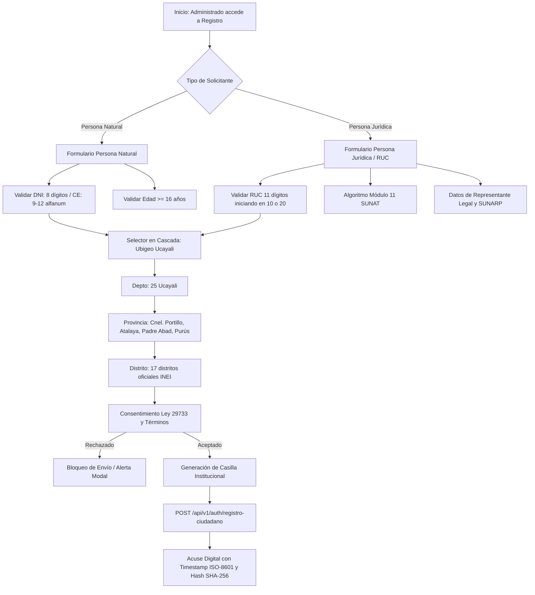

# PLAN DE TRABAJO MODULAR Y EVALUACIÓN DOCENTE: MÓDULO 1
## Identidad, Registro de Usuarios, Ubigeo Ucayali y Casilla Electrónica
### Sistema Integral de Gestión Documentaria (SIGD) — IESTP "Suiza" (Pucallpa, Ucayali)

---

### METADATOS DEL MÓDULO Y GOBERNANZA DOCENTE
- **Código de Documento:** `SIGD-DOC-M01-PLAN-EVAL-2026`
- **Versión:** `1.0.0 (Edición Modular Definitiva)`
- **Fecha de Emisión:** `2026-09-05`
- **Ciclo Académico:** `2026-2` | **Programa:** `Desarrollo de Sistemas de Información (DSI)`
- **Unidad Didáctica:** `Taller de Programación Web / Proyecto Integrador SIGD`
- **Docente Titular / Product Owner:** `Ing. Renato Henyer Tarazona Flores`
- **Sub-equipo Asignado (Grupo 2):**
  - **Líder de Grupo:** `Matías Tiziano Zumaeta Alva` (Git: `matias-zumaeta` / `Matias-Spike` / `F_MATIAS`)
  - **Desarrollador Frontend (Casilla y 2FA):** `Sergio Adrián Serruche Panduro` (Git: `sergio-serruche` / `Sergio-Serruche` / `F_SERGIO`)
  - **Especialista de Integración (Ubigeo y SIAGIE):** `Ángel Jesús Vásquez Godoy` (Git: `angel-vasquez` / `angel` / `F_JESUS`)
  - **Especialista Arq. (JSON Schema / S3 / Validación):** `Carito Curto (Angy Curto)` (Git: `cakcy3-web` / `F_CURTO`)
- **Carga de Trabajo Asignada:** `26 Story Points (SP)` distribuidos en 5 entregables atómicos
- **Ubicación Canónica:** `frontend/docs/registro-usuarios-casilla/00_plan_de_trabajo_y_evaluacion_docente.md`
- **Documento Maestro Institucional:** [PLAN_DE_TRABAJO_MODULAR_Y_EVALUACION_DOCENTE.md](../PLAN_DE_TRABAJO_MODULAR_Y_EVALUACION_DOCENTE.md)

---

## 1. ALCANCE TÉCNICO Y ESPECIFICACIÓN FUNCIONAL DEL MÓDULO 1

El Módulo 1 constituye la puerta de enlace e identificación oficial para la totalidad de actores del ecosistema SIGD del IESTP "Suiza" (postulantes, estudiantes ordinarios, egresados, empresas proveedoras y ciudadanos de la Región Ucayali). Su misión es garantizar la autenticidad jurídica de las identidades registradas, geolocalizar fehacientemente al administrado dentro de la cuenca amazónica y aperturar su domicilio procesal vinculante mediante la Casilla Electrónica Institucional.



### 1.1. Componentes Clave de Arquitectura Frontend (React 19 + TypeScript 5.9)
1. **Formulario Polimórfico Dual (`src/pages/registro/RegistroCiudadanoPage.tsx`):**
   - Gestión reactiva del estado mediante hooks de React 19 (`useActionState`, `useTransition`) evitando bloqueos de renderizado.
   - Conmutador accesible (WAI-ARIA `role="tablist"`) entre **Persona Natural** y **Persona Jurídica**.
   - Integración con React Hook Form y resolvers de Zod (`src/schemas/registroCiudadano.schema.ts`).
2. **Sub-formulario Persona Natural (`src/components/registro/PersonaNaturalForm.tsx`):**
   - Tipo de documento: DNI (`/^[0-9]{8}$/`), Carné de Extranjería (`/^[A-Z0-9]{9,12}$/`) o PTP.
   - Validación de fecha de nacimiento calculando edad cronológica estricta $\ge 16$ años al momento del registro.
   - Teléfono celular peruano (`/^9[0-9]{8}$/`) y correo electrónico validado con normalización a minúsculas.
3. **Sub-formulario Persona Jurídica (`src/components/registro/PersonaJuridicaForm.tsx`):**
   - RUC de 11 dígitos con validación de prefijo obligatorio `10` o `20` (`/^(10|20)[0-9]{9}$/`).
   - Implementación en cliente del algoritmo de suma ponderada y dígito verificador **Módulo 11 de SUNAT**:
     $$d_v = 11 - \left( \left( \sum_{i=1}^{10} d_i \times w_i \right) \bmod 11 \right)$$
     Donde los pesos son $w = [5, 4, 3, 2, 7, 6, 5, 4, 3, 2]$. Si el resultado es 10, $d_v = 0$; si es 11, $d_v = 1$.
   - Razón Social, DNI y facultades del Representante Legal y número de Partida Electrónica registral.
4. **Selector en Cascada de Ubigeo Ucayali (`src/components/common/UbigeoSelector.tsx`):**
   - Enlazado a la base canónica local `src/data/ucayali.ts` para funcionamiento offline resiliente.
   - Carga reactiva jerárquica: Departamento (Ucayali: 25) $\rightarrow$ Provincia $\rightarrow$ Distrito.
   - Mapeo con los 17 distritos distribuidos en las 4 provincias:
     - **Coronel Portillo (2501):** Callería, Campoverde, Iparía, Masisea, Yarinacocha, Nueva Requena, Manantay.
     - **Atalaya (2502):** Raimondi, Sepahua, Tahuanía, Yurúa.
     - **Padre Abad (2503):** Padre Abad, Irazola, Curimaná, Neshuya, Alexander Von Humboldt.
     - **Purús (2504):** Purús.
   - Reseteo automático de distrito ante conmutación de provincia y preservación de estado en hook `useUbigeoCascade.ts`.
5. **Casilla Electrónica Ciudadana (`src/pages/casilla/CasillaElectronicaPage.tsx`):**
   - Buzón institucional único generado: `{documento}@casilla.iestpsuiza.edu.pe`.
   - Bandeja con filtros por estado: *Todas, No Leídas, Notificaciones Administrativas, Resoluciones*.
   - Modal de lectura de acto administrativo con emisión automática de **Acuse de Notificación Digital** conteniendo: `fechaHoraLectura` (ISO-8601), dirección IP simulada/capturada, y hash SHA-256 del acto notificado.
6. **Consentimiento Informado Ley N° 29733 (`src/components/registro/ConsentimientoLey29733Modal.tsx`):**
   - Cumplimiento de la Directiva de Seguridad de la Información y Tratamiento de Datos Personales del MINJUS.
   - Cláusula de consentimiento previo, libre, expreso, informado e inequívoco para fines académicos e institucionales.
   - Checkbox bloqueante en formulario de registro; deshabilitación total del botón de envío si el valor no es `true`.

---

## 2. CONTRATOS DE INTEGRACIÓN API REST (CANÓNICOS)

El Módulo 1 interactúa de manera síncrona con el backend mediante las siguientes rutas oficiales:

| Método | Endpoint URI | Descripción | Request Payload | Response (200 / 201) | Manejo RFC 7807 |
|:---:|---|---|---|---|---|
| `POST` | `/api/v1/auth/registro-ciudadano` | Registro atómico de Persona Natural o Jurídica | `RegistroCiudadanoRequestDTO` | `{ usuarioId, casillaElectronica, tokenTemporal }` | `400 Bad Request`, `409 Conflict` (DNI/RUC duplicado), `422 Unprocessable` |
| `GET` | `/api/v1/maestras/ubigeo/departamentos` | Listado nacional de departamentos | *Ninguno* | `DepartamentoDTO[]` | `500 Internal Error` |
| `GET` | `/api/v1/maestras/ubigeo/provincias/:depId` | Provincias de un departamento (`depId=25`) | Param `depId` | `ProvinciaDTO[]` | `404 Not Found` |
| `GET` | `/api/v1/maestras/ubigeo/distritos/:provId` | Distritos de la provincia especificada | Param `provId` | `DistritoDTO[]` | `404 Not Found` |
| `GET` | `/api/v1/casilla/notificaciones` | Listado de notificaciones del ciudadano | Query `?estado=&page=` | `NotificacionCasillaDTO[]` | `401 Unauthorized` |
| `POST` | `/api/v1/casilla/notificaciones/:id/acuse` | Generación de acuse legal de recepción | `{ notificacionId, firmaAcuse }` | `{ acuseId, fechaHoraCierta, hashAcuse }` | `404 Not Found`, `409 Conflict` |

---

## 3. TABLA DE ENTREGABLES ATÓMICOS DE EVALUACIÓN DOCENTE

A continuación se detalla la matriz de entregables que el docente evaluará para el Grupo 2 (26 Story Points):

| Código | Nombre del Entregable | Estudiantes Responsables | Artefactos Concretos en Repositorio | Criterios de Aceptación Objetivos (DoD) | Evidencia Demostrable | Peso % | SP |
|:---:|---|---|---|---|---|:---:|:---:|
| `ENT-M01-01` | **Formulario Polimórfico de Registro Ciudadano y Empresa** | Matías Zumaeta (R/A)<br>Sergio Serruche (R) | `src/pages/registro/RegistroCiudadanoPage.tsx`<br>`src/components/registro/PersonaNaturalForm.tsx`<br>`src/components/registro/PersonaJuridicaForm.tsx`<br>`src/schemas/registroCiudadano.schema.ts`<br>`src/types/registroCiudadano.ts` | 1. Conmutador reactivo entre Persona Natural y Jurídica sin recarga.<br>2. Validación estricta con Zod: DNI 8 dígitos, CE 9-12 caracteres, RUC 11 dígitos iniciando en 10 o 20 con algoritmo Módulo 11.<br>3. Restricción de edad $\ge 16$ años calculada dinámicamente.<br>4. Tipado estricto sin tipo `any` ni advertencias en `tsc`. | Formulario 100% interactivo en navegador; validación de errores inline en tiempo real; esquema Zod tipado. | 25% | 8 |
| `ENT-M01-02` | **Selector en Cascada de Ubigeo Ucayali con Caché Local** | Ángel Jesús Vásquez (R/A)<br>Matías Zumaeta (C) | `src/components/common/UbigeoSelector.tsx`<br>`src/hooks/useUbigeoCascade.ts`<br>`src/data/ucayali.ts` | 1. Carga encadenada de Departamento (25 Ucayali) $\rightarrow$ Provincia $\rightarrow$ Distrito.<br>2. Cobertura exacta de las 4 provincias y 17 distritos de Ucayali.<br>3. Reseteo automático de distrito al alternar provincia.<br>4. Persistencia en memoria/caché local evitando llamadas redundantes.<br>5. Accesible por teclado bajo WCAG 2.1 AA. | Selector plenamente operativo en UI; hook con respuesta síncrona instantánea; datos alineados con INEI. | 20% | 5 |
| `ENT-M01-03` | **Bandeja de Casilla Electrónica Ciudadana y Acuse Legal** | Sergio Serruche (R/A)<br>Matías Zumaeta (C) | `src/pages/casilla/CasillaElectronicaPage.tsx`<br>`src/components/casilla/NotificacionList.tsx`<br>`src/components/casilla/NotificacionDetailModal.tsx`<br>`src/hooks/useCasilla.ts`<br>`src/types/casilla.ts` | 1. Visualización paginada de notificaciones oficiales dirigidas al administrado.<br>2. Indicadores de estado visuales (No Leído, Leído, Notificado).<br>3. Apertura modal que despliega acto administrativo y genera acuse digital con timestamp ISO-8601 y hash SHA-256.<br>4. Filtro por tipo de notificación y fecha. | Bandeja funcional con listado reactivo; simulación de apertura y generación de acuse con fecha cierta. | 25% | 5 |
| `ENT-M01-04` | **Consentimiento Informado Ley N° 29733 y Declaración Jurada** | Carito Curto (R/A)<br>Sergio Serruche (R) | `src/components/registro/ConsentimientoLey29733Modal.tsx`<br>`src/components/registro/DeclaracionJuradaCheckbox.tsx`<br>`src/schemas/consentimiento.schema.ts` | 1. Checkbox interactivo con cláusula de la ANPDP (Ley N° 29733).<br>2. Modal informativo accesible con el detalle de políticas de tratamiento de datos y domicilio digital.<br>3. Bloqueo estricto del botón de envío mientras el checkbox permanezca desmarcado.<br>4. Inclusión de `{ consentimientoLey29733: true, version: "1.0", fechaAceptacion }` en payload. | Interfaz bloqueante demostrada; modal responsive con texto legal oficial del IESTP "Suiza". | 15% | 3 |
| `ENT-M01-05` | **Suite de Pruebas Automatizadas de Validación M1** | Matías Zumaeta (R/A)<br>Carito Curto & Ángel Jesús Vásquez (R) | `src/tests/m1/registroCiudadano.test.tsx`<br>`src/tests/m1/ubigeoCascade.test.ts`<br>`src/tests/m1/casillaElectronica.test.tsx` | 1. Cobertura mínima de pruebas unitarias $\ge 80\%$ ejecutadas en Vitest.<br>2. Aserciones para casos de borde: DNI alfanumérico rechazado, RUC inválido en Módulo 11 rechazado, menor de 16 años rechazado, bloqueo sin consentimiento.<br>3. Prueba de renderizado de los 17 distritos de Ucayali. | Suite ejecutable mediante `npm test` con reporte 100% aprobado y cero fallas. | 15% | 5 |
| **TOTAL** | **MÓDULO 2 (GRUPO 2) CONSOLIDADO** | **Grupo 2 Frontend** | **Conjunto de Artefactos de Grupo 2** | **Cumplimiento Integral de DoD y Estándares DSI** | **Demostración en Vivo + Ficha Docente** | **100%** | **26 SP** |

---

## 4. RÚBRICA DE EVALUACIÓN VIGESIMAL DOCENTE (00 A 20 PUNTOS)

La evaluación del Módulo 1 se realiza bajo las 4 dimensiones estándar ponderadas, con criterios adaptados a los retos específicos de registro de usuarios, identidad y casilla electrónica:

### 4.1. Dimensiones y Niveles de Desempeño
```
[00.0 - 10.9] DEFICIENTE | [11.0 - 13.9] REGULAR | [14.0 - 17.9] BUENO | [18.0 - 20.0] EXCELENTE
```

| Dimensión | Excelente (18.0 - 20.0) | Bueno (14.0 - 17.9) | Regular (11.0 - 13.9) | Deficiente (00.0 - 10.9) |
|---|---|---|---|---|
| **D1: Arquitectura Frontend y Componentes (30% / 6.0 pts)** | **5.4 – 6.0 pts:** Componentes React 19 desacoplados y modulares; formularios polimórficos optimizados con hooks personalizados; transiciones fluidas; renderizado condicional sin re-renders redundantes; estructura FSD impecable. | **4.2 – 5.3 pts:** Formularios funcionales y estructurados; conmutador Natural/Jurídica operativo; hooks bien implementados; navegación limpia. | **3.3 – 4.1 pts:** Componentes sobrecargados (>350 líneas); lógica de negocio mezclada en vistas; re-renderizados innecesarios en inputs. | **0.0 – 3.2 pts:** El código no compila; fallas estructurales severas; bucles infinitos en useEffect; arquitectura monolítica e inmanejable. |
| **D2: Integración Backend y Manejo RFC 7807 (30% / 6.0 pts)** | **5.4 – 6.0 pts:** Fidelidad estricta al endpoint `POST /api/v1/auth/registro-ciudadano`; inyección de cabecera `X-Correlation-ID`; interceptación tipada de `ApiProblemDetails` ante DNI/RUC duplicado (409) o error de esquema (422) con feedback visual contextual. | **4.2 – 5.3 pts:** Endpoints canónicos respetados; captura de errores 400 y 409 con alertas informativas adecuadas; DTOs tipados. | **3.3 – 4.1 pts:** Endpoints mapeados parcialmente; errores manejados mediante alertas nativas `window.alert()` o sin deserializar RFC 7807. | **0.0 – 3.2 pts:** Endpoints inventados o rotos; omisión total de captura de excepciones; formularios colgados tras fallos de red. |
| **D3: Validaciones, Ubigeo y Normativa Legal (20% / 4.0 pts)** | **3.6 – 4.0 pts:** Validación matemática Módulo 11 de RUC en cliente; regex estricto de DNI/CE; cascada completa de 4 provincias y 17 distritos de Ucayali sin fallas; consentimiento Ley 29733 bloqueante e ineludible. | **2.8 – 3.5 pts:** Validaciones de DNI y RUC operativas; Ubigeo Ucayali funcional; consentimiento Ley 29733 bloquea el botón correctamente. | **2.2 – 2.7 pts:** RUC valida solo longitud pero no algoritmo Módulo 11; omisiones menores en distritos de Ucayali; consentimiento visualmente débil. | **0.0 – 2.1 pts:** Sin validación de RUC ni DNI (permite letras); Ubigeo incompleto o desconectado; omisión del consentimiento Ley 29733. |
| **D4: Calidad TypeScript, Pruebas y Git (20% / 4.0 pts)** | **3.6 – 4.0 pts:** Tipado TypeScript 5.9 100% estricto sin comodines `any`; esquemas Zod reutilizables; suite Vitest con cobertura $\ge 80\%$; historial Git con commits semánticos de ambos integrantes. | **2.8 – 3.5 pts:** Tipado consistente con casting justificado; esquemas Zod completos; pruebas básicas cubriendo el camino feliz (50%-79%); commits trazables. | **2.2 – 2.7 pts:** Presencia de `any` en tipados; validaciones incompletas; pruebas escasas (<50% cobertura); commits esporádicos y desordenados. | **0.0 – 2.1 pts:** Código plagado de `any`; TypeScript en modo permisivo; ausencia de pruebas unitarias; sin commits en el repositorio oficial. |

### 4.2. Penalizaciones Técnicas Específicas de M1
- **`PEN-01` (-3.0 pts):** Desconexión de endpoints canónicos `/api/v1/auth/registro-ciudadano` o rutas de Ubigeo.
- **`PEN-04` (-2.0 pts):** Inobservancia del consentimiento informado obligatorio de la Ley N° 29733 (permitir envío sin aceptación expresa).
- **`PEN-05` (-4.0 pts):** Errores fatales de compilación en `tsc --noEmit` o caída en blanco de la pantalla en tiempo de ejecución.
- **`PEN-06` (-1.0 pt c/u, máx -3.0 pts):** Uso injustificado del tipo `any` en DTOs o esquemas del registro ciudadano.

---

## 5. INSTRUMENTO DOCENTE DE EVALUACIÓN INDIVIDUAL (FICHA TÉCNICA)

```markdown
====================================================================================================
               INSTITUTO DE EDUCACIÓN SUPERIOR TECNOLÓGICO PÚBLICO "SUIZA"
           PROGRAMA DE ESTUDIOS: DESARROLLO DE SISTEMAS DE INFORMACIÓN (DSI 2026-2)
          FICHA DOCENTE DE EVALUACIÓN MODULAR: M01 - REGISTRO DE USUARIOS Y CASILLA
====================================================================================================

1. DATOS DEL ESTUDIANTE Y ENTREGABLES
   - Estudiante Evaluado: _________________________________________________________________________
   - Rol en Grupo 2:    [ ] Líder (Matías Zumaeta)  [ ] Casilla / 2FA (Sergio Serruche)
                         [ ] Ubigeo (Ángel Jesús Vásquez) [ ] Arq. JSON Schema / S3 (Carito Curto)
   - Entregable(s) a Calificar: [ ] ENT-M01-01  [ ] ENT-M01-02  [ ] ENT-M01-03  [ ] ENT-M01-04  [ ] ENT-M01-05
   - Total Story Points Evaluados: _________ SP   |   Fecha de Sustentación: _____ / _____ / 2026

2. EVALUACIÓN POR DIMENSIONES (00 a 20 pts)
   +-------------------------------------------------------------+----------+--------+-------------+
   | Dimensión Evaluada                                          | Peso (%) | Nota   | Ponderado   |
   +-------------------------------------------------------------+----------+--------+-------------+
   | D1: Arquitectura Frontend y Componentes React 19            |   30%    | [    ] | [         ] |
   | D2: Integración Backend y Tratamiento RFC 7807              |   30%    | [    ] | [         ] |
   | D3: Validaciones, Ubigeo Ucayali y Normativa Ley 29733      |   20%    | [    ] | [         ] |
   | D4: Calidad de Código TypeScript 5.9, Zod y Vitest          |   20%    | [    ] | [         ] |
   +-------------------------------------------------------------+----------+--------+-------------+
   | SUB-TOTAL PONDERADO (0.0 a 20.0):                                      |        | [         ] |
   +------------------------------------------------------------------------+--------+-------------+

3. PENALIZACIONES APLICADAS
   [ ] PEN-01: Desconexión de endpoints canónicos                     (-3.0 pts)
   [ ] PEN-04: Omisión de consentimiento bloqueante Ley 29733         (-2.0 pts)
   [ ] PEN-05: Regresión de compilación TypeScript                    (-4.0 pts)
   [ ] PEN-06: Uso injustificado de comodín 'any' (__ casos)          (-1.0 pt c/u)
   TOTAL DEDUCCIÓN:                                                                    [-       ]

4. CALIFICACIÓN FINAL Y ACTA
   ┌───────────────────────────────────────────────────────────────────────────────────────────────┐
   │ NOTA FINAL VIGESIMAL (Sub-total - Penalizaciones):                             [         ]     │
   ├───────────────────────────────────────────────────────────────────────────────────────────────┤
   │ ESTADO: [ ] EXCELENTE (18-20)   [ ] BUENO (14-17.9)   [ ] REGULAR (11-13.9)   [ ] DEFICIENTE  │
   │ CONDICIÓN: [ ] APROBADO (>= 13.0)                     [ ] DESAPROBADO (< 13.0)                │
   └───────────────────────────────────────────────────────────────────────────────────────────────┘

5. OBSERVACIONES Y RECOMENDACIONES DOCENTES:
   ________________________________________________________________________________________________

______________________________________               ______________________________________
 Firma del Docente Evaluador (PO)                     Firma del Estudiante Evaluado
 Ing. Renato Henyer Tarazona Flores
```

---

## 6. HOJA DE RUTA Y PLAN DE SPRINTS DEL SUB-EQUIPO M1

- **Sprint 1 (Semanas 1-2):**
  - Modelado de esquemas Zod (`registroCiudadano.schema.ts`, `consentimiento.schema.ts`).
  - Implementación del hook `useUbigeoCascade.ts` con la data de `src/data/ucayali.ts`.
  - Construcción del selector jerárquico de Ubigeo y pruebas de cobertura inicial.
- **Sprint 2 (Semanas 3-4):**
  - Maquetación accesible de `RegistroCiudadanoPage.tsx` con tabs Natural/Jurídica.
  - Implementación del algoritmo Módulo 11 de SUNAT en cliente para Persona Jurídica.
  - Creación del componente modal `ConsentimientoLey29733Modal.tsx` con bloqueo reactivo.
- **Sprint 3 (Semanas 5-6):**
  - Implementación de la vista `CasillaElectronicaPage.tsx` y listado de notificaciones.
  - Integración del modal de lectura y acuse digital con sellado ISO-8601.
  - Conexión con endpoints `/api/v1/auth/registro-ciudadano` e interceptores Axios RFC 7807.
  - Ejecución de la suite completa de pruebas unitarias en Vitest (`ENT-M01-05`) y sustentación ante el docente.

---

## 7. NAVEGACIÓN Y ENLACES CRUZADOS
- [01_registro_ciudadano_persona_natural_juridica.md](01_registro_ciudadano_persona_natural_juridica.md): Especificación técnica de campos y reglas de validación.
- [02_ubigeo_cascada_ucayali_siagie.md](02_ubigeo_cascada_ucayali_siagie.md): Catálogo de provincias y distritos de Ucayali y articulación SIAGIE.
- [03_casilla_electronica_y_ley_29733.md](03_casilla_electronica_y_ley_29733.md): Arquitectura de casilla electrónica y consentimiento informado.
- [Volver al Plan Maestro Institucional](../PLAN_DE_TRABAJO_MODULAR_Y_EVALUACION_DOCENTE.md)
