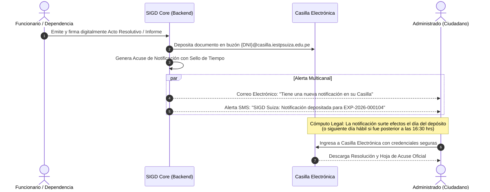

# Casilla Electrónica Institucional y Cumplimiento de la Ley N° 29733 — Registro de Usuarios y Casilla

| Metadato | Detalle Institucional |
| :--- | :--- |
| **Código Documental** | SIGD-DOC-REGUSU-03 |
| **Módulo** | registro-usuarios-casilla / Casilla Electrónica Institucional y Cumplimiento de la Ley N° 29733 |
| **Versión** | 1.0.0-PROD |
| **Fecha de Aprobación** | 2026-09-05 |
| **Autores Reconocidos** | Sergio Serruche Panduro, Matías Zumaeta, Christiam Saúl |
| **Estado de Homologación** | Aprobado — Alineado a LPAG Ley N° 27444 y React 19 |

---

## 1. Fundamentación Jurídica y Cumplimiento Normativo

La implementación de la **Casilla Electrónica** y los mecanismos de consentimiento en el Sistema Integral de Gestión Documentaria (SIGD) del Instituto de Educación Superior Tecnológico Público "Suiza" (IESTP "Suiza" — Pucallpa) responde a un riguroso alineamiento con el marco legal peruano:

1. **Ley N° 29733, Ley de Protección de Datos Personales**, y su Reglamento aprobado por **Decreto Supremo N° 003-2013-JUS**.
2. **Texto Único Ordenado (TUO) de la Ley N° 27444, Ley del Procedimiento Administrativo General**, aprobado por **Decreto Supremo N° 004-2019-JUS** (Artículos 20 y 51).
3. **Decreto Legislativo N° 1412**, Ley de Gobierno Digital, y las disposiciones de interoperabilidad y notificación electrónica de la Secretaría de Gobierno y Transformación Digital (SGTD-PCM).

---

## 2. Protección de Datos Personales (Ley N° 29733)

### 2.1. Principios Rectores Aplicados al SIGD
- **Principio de Consentimiento:** No se recopila ni almacena información personal sin la manifestación previa, libre, expresa, inequívoca e informada del titular.
- **Principio de Finalidad:** Los datos recopilados (DNI, nombres, correo, teléfono y domicilio) se destinan exclusivamente a la gestión de expedientes académicos, emisión de certificaciones oficiales, notificaciones administrativas y vinculación institucional con el IESTP Suiza. Queda prohibida su cesión o comercialización a terceros.
- **Principio de Proporcionalidad:** Se recaban únicamente los datos estrictamente necesarios para individualizar al administrado y cumplir con los requisitos del TUPA.
- **Principio de Seguridad:** Los datos se persisten de manera cifrada en tránsito (HTTPS / TLS 1.3) y en reposo mediante PostgreSQL 18 y almacenamiento seguro MinIO/S3.

### 2.2. Banco de Datos Personales Institucional
El IESTP "Suiza" formaliza el registro de su banco de datos ante la Autoridad Nacional de Protección de Datos Personales (ANPDP-MINJUS) bajo la denominación:
> **Banco de Datos:** *"Usuarios, Administrados y Postulantes del IESTP Suiza"*

### 2.3. Cláusula Informativa y Ejercicio de Derechos ARCO
En la interfaz de registro se incorpora una cláusula informativa transparente que detalla el ejercicio de los derechos ARCO (Acceso, Rectificación, Cancelación y Oposición):
> *"Usted puede ejercer en cualquier momento sus derechos de acceso, rectificación, cancelación y oposición respecto a sus datos personales dirigiéndose a la Mesa de Partes del IESTP Suiza o mediante comunicación formal a datos.personales@iestpsuiza.edu.pe, de conformidad con la Ley N° 29733."*

---

## 3. Declaración Jurada Obligatoria de Veracidad

### 3.1. Presunción de Veracidad (TUO Ley N° 27444)
Conforme al **Artículo IV, numeral 1.7 del Título Preliminar y el Artículo 51 del TUO de la Ley N° 27444**:

> *"Todas las declaraciones juradas, los documentos sucedáneos presentados y la información incluida en los escritos y formularios que presenten los administrados para la realización de procedimientos administrativos, se presumen ciertos y veraces para todos los efectos legales."*

### 3.2. Implementación en la Interfaz de Usuario
El formulario de registro finaliza con una sección bloqueante de aceptación jurada:

```
┌────────────────────────────────────────────────────────────────────────────┐
│  [X] DECLARACIÓN JURADA Y CONSENTIMIENTO INFORMADO                         │
│                                                                            │
│  Declaro bajo juramento que toda la información consignada y los          │
│  documentos adjuntados son auténticos, legítimos y reflejan la verdad.     │
│  Asimismo, autorizo expresamente al IESTP "Suiza" para el tratamiento de   │
│  mis datos personales según la Ley N° 29733 y acepto que toda notificación │
│  oficial sea remitida válidamente a mi Casilla Electrónica Institucional   │
│  conforme al Art. 20 del TUO de la Ley N° 27444.                           │
│                                                                            │
│  ⚠️ Conozco que cometer falsedad en esta declaración acarrea las sanciones │
│     administrativas y penales previstas en el Art. 411 del Código Penal.  │
└────────────────────────────────────────────────────────────────────────────┘
```

- **Comportamiento React 19:** La casilla de verificación se presenta desmarcada por defecto. El botón de envío *"Registrar y Crear Casilla"* permanece deshabilitado hasta que el usuario activa conscientemente el checkbox.

---

## 4. Sistema de Casilla Electrónica Institucional

### 4.1. Validez Jurídica de la Notificación Electrónica
De conformidad con el **Artículo 20, numeral 20.1.2 del TUO de la Ley N° 27444**:
1. La notificación dirigida a la Casilla Electrónica surte plenos efectos jurídicos administrativos equivalentes a la notificación personal en domicilio físico.
2. Al registrarse voluntariamente en el portal institucional y consentir los términos del servicio, el administrado autoriza de manera vinculante la notificación electrónica como modalidad prioritaria para todos los expedientes que tramite ante el IESTP Suiza.

### 4.2. Asignación y Formato de la Casilla Electrónica
Tras la verificación exitosa del registro, el sistema genera de forma atómica la casilla digital:
- **Nomenclatura para Persona Natural:** `{numero_dni}@casilla.iestpsuiza.edu.pe` (ej. `47891234@casilla.iestpsuiza.edu.pe`).
- **Nomenclatura para Persona Jurídica:** `{numero_ruc}@casilla.iestpsuiza.edu.pe` (ej. `20601234567@casilla.iestpsuiza.edu.pe`).

### 4.3. Reglas de Cómputo de la Notificación y Acuse de Recibo
El ciclo legal de la notificación en casilla electrónica opera bajo las siguientes reglas de negocio:



1. **Momento de Perfeccionamiento de la Notificación:**
   - La notificación se entiende jurídicamente efectuada el **día de su depósito formal en la casilla electrónica**.
   - Si el depósito se realiza después de las **16:30 horas** de un día hábil o en día sábado, domingo o feriado, la notificación surte efectos legales el **primer día hábil siguiente** a primera hora (08:00 hrs).
2. **Cómputo de Plazos:**
   - A partir del día siguiente de surtida la notificación inicia el cómputo de los plazos administrativos para el cumplimiento de requerimientos o interposición de recursos impugnatorios (ej. 15 días hábiles para reconsideración).
3. **Acuse de Notificación Electrónica Inmutable:**
   - El sistema almacena una cédula digital de notificación que acredita:
     - Identificador del expediente (`EXP-YYYY-XXXXXX`).
     - Acto administrativo notificado con su hash SHA-256.
     - Marca de tiempo legal UTC certificada.
     - Código de Verificación Digital (CVD) para validación pública.
     - Registro de confirmación de envío de la alerta complementaria (correo y SMS).

### 4.4. Alerta Multicanal Complementaria
Como salvaguarda del derecho de defensa y transparencia, el depósito de una resolución o cédula de notificación en la Casilla Electrónica dispara inmediatamente:
- Un correo electrónico automático al buzón personal registrado.
- Un mensaje de texto (SMS) al celular de 9 dígitos consignado en el registro.
- En ambos avisos se indica el código del expediente, la oficina remitente y el enlace directo para iniciar sesión en la casilla.
