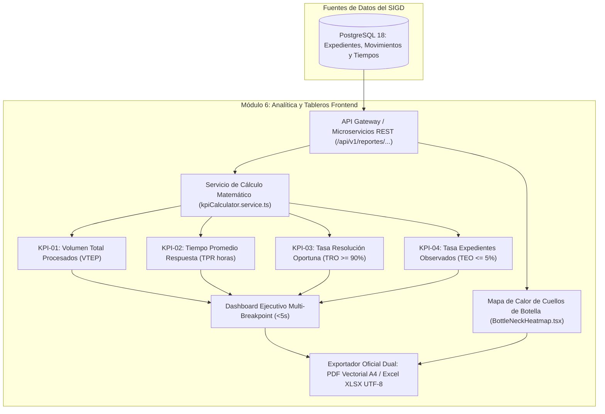

# PLAN DE TRABAJO MODULAR Y EVALUACIÓN DOCENTE: MÓDULO 6
## Indicadores de Gestión, KPIs del MGD (PCM), Tableros de Control y Accesibilidad WCAG 2.1 AA
### Sistema Integral de Gestión Documentaria (SIGD) — IESTP "Suiza" (Pucallpa, Ucayali)

---

### METADATOS DEL MÓDULO Y GOBERNANZA DOCENTE
- **Código de Documento:** `SIGD-DOC-M06-PLAN-EVAL-2026`
- **Versión:** `1.0.0 (Edición Modular Definitiva)`
- **Fecha de Emisión:** `2026-09-05`
- **Ciclo Académico:** `2026-2` | **Programa:** `Desarrollo de Sistemas de Información (DSI)`
- **Unidad Didáctica:** `Taller de Programación Web / Proyecto Integrador SIGD`
- **Docente Titular / Product Owner:** `Ing. Renato Henyer Tarazona Flores`
- **Scrum Master & Arquitecto Principal:** `Christiam Saúl`
- **Sub-equipo Asignado (M6):**
  - **Líder de Sub-equipo:** `Clider Lex Urquia` (Git: `cliderlex-sketch`)
  - **Especialista de Métricas & Datos:** `Jennifer Gatica Saavedra` (Git: `gaticasaavedrajennifer844-jpg`)
  - **Diseñador UX / Accesibilidad (WCAG AA):** `Christian Jhoel Rodríguez Cari (Jhuel)` (Git: `christianjhoelrodriguezcari-hue`)
  - **Desarrollador Frontend (Exportador PDF/Excel):** `Lloner Vargas Huayunga` (Git: `lloner-araujo` / `vargashuayunga92-11`)
- **Carga de Trabajo Asignada:** `29 Story Points (SP)` distribuidos en 5 entregables atómicos
- **Ubicación Canónica:** `frontend/docs/reportes-tableros-control/00_plan_de_trabajo_y_evaluacion_docente.md`
- **Documento Maestro Institucional:** [PLAN_DE_TRABAJO_MODULAR_Y_EVALUACION_DOCENTE.md](../PLAN_DE_TRABAJO_MODULAR_Y_EVALUACION_DOCENTE.md)

---

## 1. ALCANCE TÉCNICO Y ESPECIFICACIÓN FUNCIONAL DEL MÓDULO 6

El Módulo 6 dota a la Dirección General, Jefaturas de Unidad Orgánica y Órganos de Control Institucional del IESTP "Suiza" de una plataforma visual de inteligencia operativa y analítica en tiempo real. Permite fiscalizar la celeridad administrativa, detectar tempranamente cuellos de botella y emitir padrones oficiales auditables.

La ingeniería frontend en **React 19 + TypeScript 5.9** se estructura sobre cuatro pilares de calidad:
1. **Tablero Directivo de Alta Eficiencia (<5 segundos):** Carga y renderizado inicial ultra-rápido en 3 breakpoints (Móvil, Tablet, Desktop) con micro-gráficos (*sparklines*) y deltas porcentuales ($\Delta\%$).
2. **Modelado Matemático Formal de Indicadores MGD:** Implementación de fórmulas oficiales del Modelo de Gestión Documental (PCM) con protección ante indeterminación matemática (división por cero).
3. **Mapa de Calor de Cuellos de Botella por Dependencia:** Visualización matricial de áreas que retienen expedientes más allá del umbral legal permitido.
4. **Accesibilidad Digital Universal (WCAG 2.1 AA) y Exportador Multiformato:** Contraste mínimo de color $\ge 4.5:1$, navegación completa por tabulación y exportación sin corrupción UTF-8 a libros Excel y reportes PDF ejecutivos.



### 1.1. Modelado Matemático de los Indicadores Institucionales (MGD - PCM)
El sub-equipo implementa las 4 fórmulas oficiales en `src/services/kpiCalculator.service.ts`:

1. **KPI-01: Volumen Total de Expedientes Procesados ($VTEP$):**
   $$\text{VTEP} = \sum_{i=1}^{n} E_{\text{resueltos}, i} + \sum_{j=1}^{m} E_{\text{archivados}, j}$$
   *Meta Institucional:* $\ge 95\%$ de los trámites ingresados en el año fiscal.

2. **KPI-02: Tiempo Promedio de Respuesta ($TPR$ en horas hábiles):**
   $$\text{TPR} = \frac{\sum_{k=1}^{N} (\text{FechaFinAtencion}_k - \text{FechaInicioAtencion}_k)_{\text{horas\_habiles}}}{N}$$
   *Meta Institucional:* $\le 24.0$ horas hábiles para primera derivación; $\le 15.0$ días para resolución final.

3. **KPI-03: Tasa de Resolución Oportuna ($TRO$):**
   $$\text{TRO} = \begin{cases} \left( \dfrac{N_{\text{atendidos\_en\_plazo}}}{N_{\text{total\_resueltos}}} \right) \times 100 & \text{si } N_{\text{total\_resueltos}} > 0 \\ 100.0\% & \text{si } N_{\text{total\_resueltos}} = 0 \end{cases}$$
   *Meta Institucional:* $\ge 90.0\%$.

4. **KPI-04: Tasa de Expedientes Observados ($TEO$):**
   $$\text{TEO} = \begin{cases} \left( \dfrac{N_{\text{expedientes\_observados}}}{N_{\text{total\_radicados}}} \right) \times 100 & \text{si } N_{\text{total\_radicados}} > 0 \\ 0.0\% & \text{si } N_{\text{total\_radicados}} = 0 \end{cases}$$
   *Meta Institucional:* $\le 5.0\%$.

### 1.2. Componentes Clave de Arquitectura Frontend
1. **Tablero Directivo Ejecutivo (`src/pages/reportes/DashboardEjecutivoPage.tsx`):**
   - Tarjetas de resumen métrico (`ExecutiveKpiCard.tsx`) con micro-gráficos de tendencia (*sparklines*), deltas respecto al período anterior y semáforo cromático accesible.
   - Rendimiento optimizado para garantizar tiempo de renderizado visual inferior a **500 ms** y carga de datos en red menor a **5 segundos**.
2. **Mapa de Calor de Cuellos de Botella (`src/components/reportes/BottleNeckHeatmap.tsx`):**
   - Matriz visual que clasifica las dependencias según expedientes estancados ($\ge 5$ días hábiles sin movimiento).
   - Patrón de doble codificación para personas con daltonismo (color + íconos distintivos `✓`, `⚠`, `✕`).
3. **Exportador Multiformato Oficial (`src/utils/excelReportExporter.ts` / `pdfReportExporter.ts`):**
   - Generación de hojas Excel en formato `.xlsx` preservando tildes y caracteres especiales en UTF-8, con fórmulas de sumatoria embebidas.
   - Generación de reportes PDF vectoriales en formato A4 con membrete institucional del IESTP "Suiza" y firmas de control.
4. **Cumplimiento de Accesibilidad Web (WCAG 2.1 AA):**
   - Contraste de texto $\ge 4.5:1$ y de componentes gráficos $\ge 3:1$.
   - Soporte total de navegación por teclado (`tabindex="0"`, `focus:ring-2`) y atributos semánticos `aria-label` y `aria-live`.

---

## 2. CONTRATOS DE INTEGRACIÓN API REST (CANÓNICOS)

El Módulo 6 consume la API analítica a través de las siguientes rutas canónicas:

| Método | Endpoint URI | Descripción | Request Payload | Response (200 / 201) | Manejo RFC 7807 |
|:---:|---|---|---|---|---|
| `GET` | `/api/v1/reportes/dashboard/resumen` | Métricas consolidadas de los 4 KPIs | Query `?fechaInicio=&fechaFin=` | `DashboardKpiResumenDTO` | `400 Bad Request` (fechas inválidas) |
| `GET` | `/api/v1/reportes/dashboard/tendencia` | Serie temporal de radicación vs atención | Query `?periodo=mensual\|semanal` | `TendenciaTemporalDTO[]` | `401 Unauthorized` |
| `GET` | `/api/v1/reportes/dashboard/estados` | Distribución porcentual por estado | *Ninguno* | `DistribucionEstadosDTO[]` | `403 Forbidden` |
| `GET` | `/api/v1/reportes/dashboard/cuellos-botella` | Listado de áreas con retención de pases | Query `?diasLimite=5` | `AreaCuelloBotellaDTO[]` | `500 Internal Error` |
| `POST` | `/api/v1/reportes/exportar` | Generación asíncrona de reportes (PDF/XLSX) | `ExportReporteRequestDTO` | `{ descargaUrl, sha256Checksum }` | `422 Unprocessable` |

---

## 3. TABLA DE ENTREGABLES ATÓMICOS DE EVALUACIÓN DOCENTE

Matriz de entregables para la calificación del sub-equipo del Módulo 6 (29 Story Points):

| Código | Nombre del Entregable | Estudiantes Responsables | Artefactos Concretos en Repositorio | Criterios de Aceptación Objetivos (DoD) | Evidencia Demostrable | Peso % | SP |
|:---:|---|---|---|---|---|:---:|:---:|
| `ENT-M06-01` | **Tablero Directivo Ejecutivo Multi-Breakpoint (<5s)** | Christian Jhuel (R/A)<br>Clider Urquia (R) | `src/pages/reportes/DashboardEjecutivoPage.tsx`<br>`src/components/reportes/ExecutiveKpiCard.tsx`<br>`src/components/reportes/KpiMetricGrid.tsx`<br>`src/hooks/useDashboardMetrics.ts`<br>`src/types/dashboardEjecutivo.ts` | 1. Vista directiva con tiempo de carga total en red $\le 5$ segundos.<br>2. 3 breakpoints responsivos (Móvil, Tablet, Desktop).<br>3. Tarjetas KPI con deltas temporales ($\Delta\%$) y micro-gráficos sparkline.<br>4. Estados de skeleton loading fluidos. | Dashboard renderizado con métricas de performance en consola; layout adaptable probado. | 25% | 8 |
| `ENT-M06-02` | **Motor de Cálculo de KPIs del MGD con Modelado Matemático** | Jennifer Gatica (R/A) | `src/services/kpiCalculator.service.ts`<br>`src/components/reportes/KpiFormulaExplanationCard.tsx`<br>`src/types/kpiCalculations.ts` | 1. Implementación exacta de las 4 fórmulas: VTEP, TPR, TRO y TEO.<br>2. Control estricto de división por cero devolviendo `0.00%` o valor neutro.<br>3. Cálculo de horas hábiles excluyendo sábados, domingos y feriados.<br>4. Tipado estricto sin tipo `any`. | Servicio tipado con pruebas unitarias que verifican precisión a 2 decimales; explicaciones matemáticas en UI. | 25% | 8 |
| `ENT-M06-03` | **Mapa de Calor y Análisis Visual de Cuellos de Botella** | Christian Jhuel (R/A)<br>Lloner Vargas (R) | `src/components/reportes/BottleNeckHeatmap.tsx`<br>`src/components/reportes/AreaRetentionChart.tsx`<br>`src/hooks/useAreaBottlenecks.ts` | 1. Visualización matricial de áreas que retienen expedientes $\ge 5$ días.<br>2. Código de colores accesible (verde/ámbar/rojo) complementado con iconografía.<br>3. Navegación por teclado y etiquetas `aria-label` en celdas.<br>4. Tooltip con detalle de expedientes en riesgo por dependencia. | Mapa de calor interactivo y accesible; navegación fluida por teclado (Tab y flechas). | 20% | 5 |
| `ENT-M06-04` | **Exportador Estructurado de Reportes en PDF y Excel** | Clider Urquia (R/A)<br>Lloner Vargas (R) | `src/components/reportes/ReportExportModal.tsx`<br>`src/utils/excelReportExporter.ts`<br>`src/utils/pdfReportExporter.ts`<br>`src/types/reportExportConfig.ts` | 1. Generación de hojas Excel `.xlsx` con soporte UTF-8 sin desconfiguración de caracteres especiales.<br>2. Reporte PDF institucional en formato A4 con membrete oficial del IESTP "Suiza".<br>3. Inclusión de filtros aplicados, fecha de emisión y hash de integridad. | Descarga probada en navegador de archivo `.xlsx` y archivo `.pdf` con formato institucional. | 15% | 5 |
| `ENT-M06-05` | **Suite de Pruebas de Precisión Numérica y Accesibilidad** | Jennifer Gatica (R/A)<br>Sub-equipo M6 (R) | `src/tests/m6/kpiCalculator.test.ts`<br>`src/tests/m6/dashboardA11y.test.tsx` | 1. Pruebas unitarias de las 4 fórmulas matemáticas con casos de borde (0 trámites, denominadores nulos).<br>2. Verificación de accesibilidad con cero violaciones de contraste cromático (< 4.5:1).<br>3. Cobertura en Vitest $\ge 80\%$. | Reporte de Vitest con 100% de aserciones aprobadas y reporte de accesibilidad limpio. | 15% | 3 |
| **TOTAL** | **MÓDULO 6 CONSOLIDADO** | **Sub-equipo M6** | **Conjunto de Artefactos de M6** | **Cumplimiento Integral de Criterios DoD y MGD-PCM** | **Demostración en Vivo + Ficha Docente** | **100%** | **29 SP** |

---

## 4. RÚBRICA DE EVALUACIÓN VIGESIMAL DOCENTE (00 A 20 PUNTOS)

### 4.1. Criterios Analíticos por Dimensión
```
[00.0 - 10.9] DEFICIENTE | [11.0 - 13.9] REGULAR | [14.0 - 17.9] BUENO | [18.0 - 20.0] EXCELENTE
```

| Dimensión | Excelente (18.0 - 20.0) | Bueno (14.0 - 17.9) | Regular (11.0 - 13.9) | Deficiente (00.0 - 10.9) |
|---|---|---|---|---|
| **D1: Arquitectura Frontend y Dashboard (<5s) (30% / 6.0 pts)** | **5.4 – 6.0 pts:** Tablero directivo ultra-eficiente (<5s carga en red, render <500ms); diseño adaptativo en 3 breakpoints impecable; mapa de calor responsivo; estados de carga esqueletales fluidos. | **4.2 – 5.3 pts:** Tablero funcional con tiempo de carga adecuado; responsivo en desktop y móvil; componentes gráficos bien estructurados. | **3.3 – 4.1 pts:** Carga lenta (>6s); componentes gráficos pesados que causan tirones (*jank*); desajustes visuales en tablet. | **0.0 – 3.2 pts:** Tablero inoperativo; el código no compila; bloqueo del navegador por re-cálculos pesados en el hilo principal. |
| **D2: Integración Backend y Endpoints Analíticos (30% / 6.0 pts)** | **5.4 – 6.0 pts:** Fidelidad estricta a `/api/v1/reportes/...`; agregación de datos óptima en cliente; exportador asíncrono con checksum SHA-256; manejo tipado RFC 7807 ante filtros inválidos. | **4.2 – 5.3 pts:** Endpoints canónicos respetados; flujo de exportación funcional; manejo de errores estándar. | **3.3 – 4.1 pts:** Endpoints con filtros no sincronizados; exportador síncrono que bloquea la interfaz; errores genéricos en toast. | **0.0 – 3.2 pts:** Endpoints desconectados o mockeados sin sustento; omisión de captura de fallos de red. |
| **D3: Fórmulas MGD, Cuellos de Botella y WCAG AA (20% / 4.0 pts)** | **3.6 – 4.0 pts:** Modelado matemático impecable de VTEP, TPR, TRO y TEO con blindaje ante división por cero; mapa de calor de cuellos de botella con doble codificación; contraste WCAG 2.1 AA ($\ge 4.5:1$). | **2.8 – 3.5 pts:** Fórmulas matemáticas correctas; control básico de divisiones por cero; mapa de calor operativo; contraste adecuado. | **2.2 – 2.7 pts:** Error en el cálculo de horas hábiles del TPR; mapa de calor depende exclusivamente del color (sin íconos accesibles); contraste deficiente en gráficos. | **0.0 – 2.1 pts:** Fórmulas erróneas o inventadas ajenas al MGD; caídas por división por cero (`NaN` o `Infinity` en pantalla); inaccesible por teclado. |
| **D4: Calidad TypeScript, Pruebas y Git (20% / 4.0 pts)** | **3.6 – 4.0 pts:** Tipado 100% estricto sin tipo `any`; servicio de cálculo con cobertura $\ge 80\%$ en Vitest; pruebas de accesibilidad con cero infracciones; commits atómicos de los 4 integrantes. | **2.8 – 3.5 pts:** Tipado TypeScript consistente; pruebas unitarias de fórmulas matemáticas (50%-79%); historial Git con commits ordenados. | **2.2 – 2.7 pts:** Uso de `any` en modelos analíticos; pruebas escasas (<50%); commits desbalanceados entre integrantes. | **0.0 – 2.1 pts:** Código plagado de `any`; ausencia de pruebas unitarias; repositorio sin actividad trazable del sub-equipo M6. |

### 4.2. Penalizaciones Técnicas Específicas de M6
- **`PEN-01` (-3.0 pts):** Desconexión o alteración de los endpoints canónicos `/api/v1/reportes/...`.
- **`PEN-05` (-4.0 pts):** Regresiones de compilación TypeScript (`tsc --noEmit`) o excepciones no capturadas al renderizar gráficos.
- **`PEN-06` (-1.0 pt c/u, máx -3.0 pts):** Uso del tipo `any` en las fórmulas matemáticas o DTOs analíticos.
- **`PEN-07` (-1.5 pts):** Deficiencias de contraste cromático (< 4.5:1) en tarjetas KPI o mapas de calor (WCAG 2.1 AA).

---

## 5. INSTRUMENTO DOCENTE DE EVALUACIÓN INDIVIDUAL (FICHA TÉCNICA)

```markdown
====================================================================================================
               INSTITUTO DE EDUCACIÓN SUPERIOR TECNOLÓGICO PÚBLICO "SUIZA"
           PROGRAMA DE ESTUDIOS: DESARROLLO DE SISTEMAS DE INFORMACIÓN (DSI 2026-2)
          FICHA DOCENTE DE EVALUACIÓN MODULAR: M06 - REPORTES Y TABLEROS DE CONTROL
====================================================================================================

1. DATOS DEL ESTUDIANTE Y ENTREGABLES
   - Estudiante Evaluado: _________________________________________________________________________
   - Rol en Sub-equipo: [ ] Líder / Dashboard (Clider Urquia)
                        [ ] Especialista Métricas / Fórmulas (Jennifer Gatica)
                        [ ] Diseñador UX / Accesibilidad (Christian Jhuel)
                        [ ] Desarrollador Exportador (Lloner Vargas)
   - Entregable(s) a Calificar: [ ] ENT-M06-01  [ ] ENT-M06-02  [ ] ENT-M06-03  [ ] ENT-M06-04  [ ] ENT-M06-05
   - Total Story Points Evaluados: _________ SP   |   Fecha de Sustentación: _____ / _____ / 2026

2. EVALUACIÓN POR DIMENSIONES (00 a 20 pts)
   +-------------------------------------------------------------+----------+--------+-------------+
   | Dimensión Evaluada                                          | Peso (%) | Nota   | Ponderado   |
   +-------------------------------------------------------------+----------+--------+-------------+
   | D1: Arquitectura Frontend, Dashboard (<5s) y React 19       |   30%    | [    ] | [         ] |
   | D2: Integración REST, Endpoints Analíticos y RFC 7807       |   30%    | [    ] | [         ] |
   | D3: Modelado Fórmulas MGD, Cuellos de Botella y WCAG AA     |   20%    | [    ] | [         ] |
   | D4: Calidad TypeScript 5.9, Pruebas Vitest y Commits Git    |   20%    | [    ] | [         ] |
   +-------------------------------------------------------------+----------+--------+-------------+
   | SUB-TOTAL PONDERADO (0.0 a 20.0):                                      |        | [         ] |
   +------------------------------------------------------------------------+--------+-------------+

3. PENALIZACIONES APLICADAS
   [ ] PEN-01: Desconexión de endpoints canónicos                     (-3.0 pts)
   [ ] PEN-05: Regresión de compilación TypeScript                    (-4.0 pts)
   [ ] PEN-06: Uso injustificado de comodín 'any' (__ casos)          (-1.0 pt c/u)
   [ ] PEN-07: Incumplimiento de contraste WCAG 2.1 AA (< 4.5:1)      (-1.5 pts)
   TOTAL DEDUCCIÓN:                                                                    [-       ]

4. CALIFICACIÓN FINAL Y ACTA
   ┌───────────────────────────────────────────────────────────────────────────────────────────────┐
   │ NOTA FINAL VIGESIMAL (Sub-total - Penalizaciones):                             [         ]     │
   ├───────────────────────────────────────────────────────────────────────────────────────────────┤
   │ ESTADO: [ ] EXCELENTE (18-20)   [ ] BUENO (14-17.9)   [ ] REGULAR (11-13.9)   [ ] DEFICIENTE  │
   │ CONDICIÓN: [ ] APROBADO (>= 13.0)                     [ ] DESAPROBADO (< 13.0)                │
   └───────────────────────────────────────────────────────────────────────────────────────────────┘

5. OBSERVACIONES Y RECOMENDACIONES DOCENTES:
   ________________________________________________________________________________________________

______________________________________               ______________________________________
 Firma del Docente Evaluador (PO)                     Firma del Estudiante Evaluado
 Ing. Renato Henyer Tarazona Flores
```

---

## 6. HOJA DE RUTA Y PLAN DE SPRINTS DEL SUB-EQUIPO M6

- **Sprint 1 (Semanas 1-2):**
  - Implementación del servicio matemático `kpiCalculator.service.ts` con las 4 fórmulas y control de excepciones.
  - Pruebas unitarias de casos de borde en Vitest (`kpiCalculator.test.ts`).
  - Modelado de interfaces TypeScript analíticas (`dashboardEjecutivo.ts`, `kpiCalculations.ts`).
- **Sprint 2 (Semanas 3-4):**
  - Desarrollo de `DashboardEjecutivoPage.tsx` con soporte responsivo para 3 breakpoints.
  - Maquetación de tarjetas KPI (`ExecutiveKpiCard.tsx`) con micro-gráficos sparkline.
  - Construcción del mapa de calor accesible `BottleNeckHeatmap.tsx` con doble codificación de estados.
- **Sprint 3 (Semanas 5-6):**
  - Implementación del exportador a hojas Excel (.xlsx) y documentos PDF vectoriales A4.
  - Auditoría de accesibilidad WCAG 2.1 AA y verificación de contraste de color.
  - Suite de pruebas de integración (`ENT-M06-05`) y sustentación docente.

---

## 7. NAVEGACIÓN Y ENLACES CRUZADOS
- [01_descripcion_general_reportes_dashboard.md](01_descripcion_general_reportes_dashboard.md): Visión directiva y arquitectura del tablero ejecutivo (<5s).
- [02_catalogo_kpis_y_metricas_institucionales.md](02_catalogo_kpis_y_metricas_institucionales.md): Catálogo formal de indicadores institucionales MGD (PCM).
- [03_fuentes_datos_formulas_matematicas.md](03_fuentes_datos_formulas_matematicas.md): Modelado matemático KaTeX de VTEP, TPR, TRO y TEO.
- [04_diseno_visual_graficos_y_componentes.md](04_diseno_visual_graficos_y_componentes.md): Mapas de calor de cuellos de botella y componentes gráficos adaptativos.
- [05_navegacion_filtros_y_accesibilidad_ux.md](05_navegacion_filtros_y_accesibilidad_ux.md): Directivas de contraste WCAG 2.1 AA, navegación por teclado y WAI-ARIA.
- [06_arquitectura_frontend_y_plan_pruebas.md](06_arquitectura_frontend_y_plan_pruebas.md): Exportador multiformato oficial a hojas Excel (.xlsx) y PDF.
- [diagrama_metricas_dashboard.dbml](diagrama_metricas_dashboard.dbml): Modelo analítico relacional de KPIs y métricas en formato DBML.
- [Volver al Plan Maestro Institucional](../PLAN_DE_TRABAJO_MODULAR_Y_EVALUACION_DOCENTE.md)
